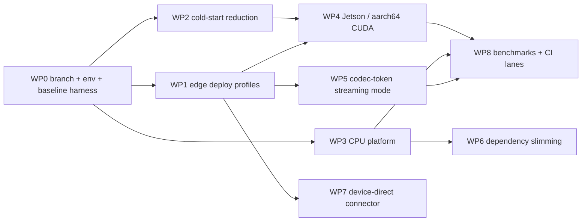

# Plan: an edge branch for vLLM-Omni

Target: a development branch in [`../vllm-omni`](../vllm-omni) (main @ `7be014bc`) that makes vLLM-Omni itself run, and perform acceptably, on edge devices. This is the "S1/S2/S4 inside vLLM-Omni" part of [vllm_omni_edge_feasibility.md](vllm_omni_edge_feasibility.md); the C++ orchestrator work on llama.cpp/MNN/ExecuTorch (S3) stays outside this branch and is covered by [implementation_roadmap.md](implementation_roadmap.md). Every touch point below was located in the checkout; nothing has been changed yet.

## 0. Ground rules

- Branch: `edge/omni-edge` off `main@7be014bc`, repo-local identity `tzhouam <tzhouam@connect.ust.hk>`, credential helper via `gh` (per `/data/zhoutaichang/CLAUDE.md`). Work packages land as separate sub-branches (`edge/wp1-deploy-profiles`, ...) so each can become an upstream PR on its own.
- Environment: a fresh `uv venv` for this checkout (`uv pip install -e .` per the repo's `AGENTS.md`/docs), because the machine's Python imports `/home/zhoutaichang/feature/vllm-omni-main` (`be335a86f`), not this tree. This is a dependency installation and needs your go-ahead.
- Upstream policy: vLLM-Omni's `.claude/skills` (`precheck-pr`, `review-pr`, `vllm-omni-test`) define PR shape and test levels (`core_model` L1/L2, `advanced_model` L3, `full_model` L4; `cpu` platform marker exists in `pyproject.toml`). Each WP below names the tests it adds at those levels.
- GPU runs go through `gpu run --timeout --note`; model downloads and installs are permission-gated.

## 1. Work packages

### WP0 — Branch, environment, baseline harness (2–3 days)

- Create the branch and the uv environment; confirm `python -c "import vllm_omni"` resolves to this checkout.
- Promote the session driver [experiments/vllm_omni_tts/tts_stream_bench.py](experiments/vllm_omni_tts/tts_stream_bench.py) into `benchmarks/tts/stream_latency_bench.py` (reuses the example's `_build_inputs`; records TTFA, per-chunk arrivals, uninterrupted-playback latency, RTF streamed+tail, init time, RSS, `nvidia-smi` peak). JSON schema = the one in [experiments/vllm_omni_tts/bench_results.json](experiments/vllm_omni_tts/bench_results.json).
- Re-run the Qwen3-TTS 1.7B baseline on this checkout (not the installed one) and add the 0.6B variant (driver flag to override the hard-coded model ids in `_build_inputs`).
- Acceptance: baseline JSON for 0.6B and 1.7B on L20X committed under `benchmarks/tts/results/`; numbers within noise of [experiments.md](experiments.md) §2 for 1.7B.

### WP1 — Edge deploy profiles (3–5 days)

Touch points: `vllm_omni/deploy/` (90 YAMLs; platform overlays under `platforms:` exist in 23 of them), `vllm_omni/config/stage_config.py` (`enforce_eager` L408, `compilation_config` L418, `gpu_memory_utilization` L402, `devices` L386, `async_chunk` L548, `inline_diffusion` L273), `vllm_omni/model_executor/stage_input_processors/chunk_size_utils.py` (`parse_chunk_ramp` L42, `ramp_chunk_size` L79).

- Add `vllm_omni/deploy/edge/qwen3_tts_edge.yaml` (and one per TTS family that passes Phase 0 parity): both stages on one device, `gpu_memory_utilization` sized from measured need (not 0.3), `codec_chunk_ramp: [4, 4, 8, 16, 25]` on by default (removes the ≈80 ms first-gap measured in [experiments.md](experiments.md)), `decode_batch_max_size: 1`, `max_num_seqs` small, `enforce_eager` documented as a switch per stage, sampling defaults unchanged.
- Add a `profile: edge` selector so `--deploy-config` is not needed (a `DeployConfig` lookup by `(model, profile)` in `config/config_factory.py`).
- Tests: L1 `tests/config/test_edge_profiles.py` (YAML resolves, schedule parses, ramp ends at `codec_chunk_frames`); L3 e2e TTFA/playback-gap regression on CUDA using WP0's harness.
- Acceptance: uninterrupted-playback latency ≤ TTFA + 60 ms on L20X with the ramp (versus ≈190 ms today); no RTF regression > 10 %.

### WP2 — Cold-start reduction (1–2 weeks)

Touch points: `vllm_omni/engine/stage_runtime.py` (parallel replica init exists near L460; sequential today for co-located stages), `vllm_omni/engine/async_omni_engine.py` (`_wait_for_orchestrator_init`, 300 s default that failed run 1), `vllm_omni/worker/gpu_ar_model_runner.py` (talker-MTP graph capture, L546 in the installed log), `model_executor/models/qwen3_tts/{segmented_graph_wrapper.py,cuda_graph_decoder_wrapper.py}`, `common/qwen3_code_predictor.py` (warm-up buckets + `torch.compile`).

- Instrument init with a timeline (process spawn, weight load, profile run, KV alloc, graph capture, compile, predictor warm-up) emitted as JSON; make it a `benchmarks/tts/init_profile.py`.
- Measure the four configurations: default; `enforce_eager` both stages; compile cache warm; parallel stage init. Keep whichever combination meets the gate and make it the edge profile default.
- Persist and reuse compile/graph artifacts (`VLLM_CACHE_ROOT` already caches AOT compile; add the code-predictor warm-up buckets and code2wav graph shapes to a versioned cache keyed by checkpoint hash + deploy profile).
- Raise the default orchestrator timeout when the edge profile is active, or scale it from the measured timeline.
- Acceptance: ready-to-serve ≤ 30 s on L20X for Qwen3-TTS 0.6B with warm caches, ≤ 90 s cold; init timeline test at L3.

### WP3 — CPU platform (3–5 weeks)

Touch points: `vllm_omni/platforms/__init__.py` (`builtin_omni_platform_plugins` L123: cuda/rocm/npu/xpu/musa), `vllm_omni/platforms/interface.py` (`OmniPlatform` surface: `get_omni_ar_worker_cls` L61, `get_omni_generation_worker_cls` L65, `get_diffusion_worker_cls` L175, `get_device_count` L266, memory/synchronize/autocast/`set_device_control_env_var` L329; `UnspecifiedOmniPlatform` L385), `vllm_omni/platforms/cuda/platform.py` (432 lines, the smallest template), `vllm_omni/worker/{base.py,gpu_ar_worker.py,gpu_ar_model_runner.py,gpu_generation_worker.py,gpu_generation_model_runner.py,mixins.py}`, `requirements/cpu.txt` (today: `common.txt` + `onnxruntime` only), `setup.py` (already accepts device `cpu`).

Design: vLLM's `CPUWorker(Worker)` and `CPUModelRunner(GPUModelRunner)` (`vllm/v1/worker/cpu_worker.py`, `cpu_model_runner.py`) subclass the same GPU classes that vLLM-Omni's `OmniGPUWorkerBase`/`GPUARModelRunner` extend, so the CPU platform is built by composition rather than a rewrite:

- `vllm_omni/platforms/cpu/platform.py`: `CPUOmniPlatform(OmniPlatform)` returning `vllm_omni.worker.cpu_ar_worker.CPUARWorker`, `cpu_generation_worker.CPUGenerationWorker`, a CPU diffusion worker (initially "unsupported" with a clear error), `get_device_count() = 1`, `device_control_env_var` = none, memory functions from `psutil`, `supports_talker_mtp_graph_capture() = False`, `supports_torch_inductor()` = vLLM CPU default, autocast = bf16/fp16 per vLLM CPU dtype rules.
- `vllm_omni/worker/cpu_ar_worker.py`: `CPUARWorker(CPUWorker, OmniWorkerMixin)` with the omni hooks from `gpu_ar_worker.py` factored into `mixins.py` where they are not already; `cpu_ar_model_runner.py`: `CPUARModelRunner(CPUModelRunner)` + the omni runner mixin (`omni_connector_model_runner_mixin.py`); same pair for the generation stage (code2wav on CPU: no CUDA graphs, eager decoder, fp32).
- Register `"cpu"` in `builtin_omni_platform_plugins` behind `VLLM_TARGET_DEVICE=cpu` or vLLM's CPU platform detection; keep `UnspecifiedOmniPlatform` for the no-device case.
- `requirements/cpu.txt`: real runtime deps (soundfile, torchaudio CPU, onnxruntime) and the vLLM CPU wheel line; docs page `docs/getting_started/installation/cpu.md`.
- Model-level: the Qwen3-TTS decoder's Triton Snake/GroupNorm kernels have torch fallbacks (verified in the model report); add a CPU branch in `CustomOp.dispatch_forward` users where `forward_native` is missing; CosyVoice3's TRT default (`COSYVOICE3_TRT`) must be off on CPU.
- Tests: L1 `tests/platforms/test_cpu_platform.py` (registration, worker classes, device count) and per-family CPU unit tests already exist under `tests/model_executor/models/<family>/`; L3 e2e Qwen3-TTS 0.6B on CPU (`pytest -m "core_model and cpu"` lane).
- Validation order: x86 on this host first (the CPU-only path needs no GPU reservation), then aarch64 Linux (vLLM ships aarch64 CPU wheels; KleidiAI W4A8 for the talker).
- Acceptance: Qwen3-TTS 0.6B end-to-end on 8 x86 threads with RTF ≤ 1.0 and TTFA ≤ 500 ms; same test green on one aarch64 box; RSS ≤ 4 GB.

### WP4 — Jetson / aarch64 CUDA (2–3 weeks, hardware-gated)

Touch points: none in vLLM-Omni beyond the edge profile and docs; the work is environment: vLLM aarch64+CUDA build or wheel (vLLM detects Tegra via `/etc/nv_tegra_release`; CUDA arch 8.7/11.0 are in its `CMakeLists.txt`), torch for JetPack, `recipes/edge/jetson.md`.

- Run WP0's harness and WP2's init profile on Orin; capture memory with unified-memory caveats (`gpu_memory_utilization` semantics differ when the GPU shares RAM with the CPU: add a `max_memory_gb` absolute option to the edge profile in `stage_config.py`).
- Acceptance: Qwen3-TTS 0.6B RTF ≤ 0.5 and ready-to-serve ≤ 90 s on Orin; documented power mode; blocker if no board is available.

### WP5 — Codec-token streaming mode (S4 wire contract) (2–3 weeks)

Touch points: `vllm_omni/entrypoints/openai/serving_speech_stream.py` (`OmniStreamingSpeechHandler`, `_generate_and_send` L260 consumes PCM chunks), `vllm_omni/entrypoints/openai/tts_adapters/{base.py,capabilities.py}` (`register_tts_adapter`), `vllm_omni/model_executor/models/output_templates.py`, `vllm_omni/data_entry_keys.py` (`codes` key), `vllm_omni/deploy/edge/qwen3_tts_talker_only.yaml` (stage 0 only, `final_output_type` codes).

- Server: a `mode: "codec_tokens"` session option on `/v1/audio/speech/stream` that runs the talker-only profile and emits frames `{seq, n_frames, codes: int16[n_frames×16], eos}` with explicit ordering, EOS, and cancel semantics; abort path unchanged (`AsyncOmni.abort`).
- Adapter capability flag `supports_codec_stream` per family (Qwen3-TTS first; MOSS next since its codec is transformer-only).
- Client reference: `examples/online_serving/text_to_speech/edge_decoder_client.py` decoding on device with the exported `Qwen3TTSTokenizerV2Decoder` (plain torch CPU first; ExecuTorch `.pte` second), carrying the 72-frame context and `reset()` on cancel.
- Tests: L1 protocol tests (ordering, EOS, cancel mid-chunk); L3 e2e PCM parity between server-decoded and client-decoded audio (SNR ≥ 40 dB).
- Acceptance: client-observed TTFA ≤ server TTFA + RTT + first-chunk decode; bandwidth ≈ 400 B/s payload + framing; interruption stops audio within one chunk.

### WP6 — Dependency and import slimming (1–2 weeks)

Touch points: `pyproject.toml` optional-dependencies, `requirements/common.txt` (diffusers pin, x-transformers, openai-whisper, onnxruntime), `vllm_omni/__init__.py` and `patch.py` import graph, `vllm_omni/diffusion/` imports pulled in by AR-only paths.

- Add an `edge` extra that excludes diffusion/video dependencies; make diffusion, forced-aligner, and VAD imports lazy on the TTS path; measure `import vllm_omni` time and RSS before/after.
- Acceptance: `python -c "import vllm_omni"` ≤ 3 s and no `diffusers` import for a TTS-only deploy; test at L1 with an import-guard test.

### WP7 — Device-direct connector for co-located stages (2 weeks, optional)

Touch points: `vllm_omni/distributed/omni_connectors/connectors/{base.py,shm_connector.py}` (`OmniConnectorBase.put/get`), `utils/serialization.py` (`OmniMsgpackEncoder`, zero-copy TODO), deploy YAML `connectors:` section.

- `CudaIpcConnector`: `put` exports a CUDA IPC handle (`torch.multiprocessing` reductions) for same-GPU stages instead of D2H + msgpack; `get` maps it; metadata carries handle + shape + dtype; fallback to shared memory for non-tensor payloads. Mori's intra-node `xgmi` path shows the pattern for AMD; this covers single-GPU NVIDIA co-location (Jetson, single-card servers).
- Acceptance: per-chunk hop latency measured with the WP0 harness drops for the Talker → Code2Wav edge; no change in audio; L1 unit test with a fake two-process exchange.

### WP8 — Benchmarks and CI lanes (ongoing)

- `benchmarks/tts/stream_latency_bench.py` and `init_profile.py` results committed per profile; a `cpu` Buildkite lane running `pytest -m "core_model and cpu"` for WP3; a nightly `edge` job for the L3 e2e tests on CUDA; recipes under `recipes/edge/`.

## 2. Order and effort

| Order | WP | Effort | Depends on | Needs hardware / permission |
|---|---|---|---|---|
| 1 | WP0 | 2–3 d | — | uv env install (permission); GPU via scheduler |
| 2 | WP1 | 3–5 d | WP0 | GPU |
| 3 | WP2 | 1–2 w | WP0 | GPU |
| 4 | WP3 | 3–5 w | WP0 | none for x86 CPU; aarch64 box later |
| 5 | WP5 | 2–3 w | WP1 | GPU; ExecuTorch install for the `.pte` client (permission) |
| 6 | WP6 | 1–2 w | WP3 | none |
| 7 | WP4 | 2–3 w | WP1, WP2 | Jetson board (blocker today) |
| 8 | WP7 | 2 w | WP1 | GPU |
| 9 | WP8 | ongoing | all | CI access |

Critical path for a demonstrable result: WP0 → WP1 → WP2 gives a measurably better edge-server tier on the hardware we have; WP3 is the first item that reaches devices without a discrete GPU and is the largest.

## 3. Risks

- **vLLM drift**: vLLM-Omni imports 284 `vllm.*` modules and monkeypatches request/output classes; the CPU worker composition in WP3 depends on `CPUWorker`/`CPUModelRunner` internals that changed between the installed 0.28.0 and this checkout's target. Pin the vLLM commit in the branch's `requirements/` and re-validate at each vLLM minor.
- **Upstream acceptance**: each WP is written as an upstream-shaped PR (tests at L1/L3, precheck skill), but WP3 and WP7 are large; expect design review through the repo's `imdesign`/`review-pr` flow before implementation.
- **Model coverage**: the edge profiles are validated per family; families relying on TensorRT (CosyVoice3) or external packages (Fish `fish-speech`) stay CUDA-only until their CPU fallbacks are verified.
- **Hardware**: WP4 and the aarch64 half of WP3 cannot start without boards; WP3-x86 and WP5 can.

## 4. Definition of done for the branch

- Edge profiles, CPU platform, and codec-token streaming merged on `edge/omni-edge`, each with L1 tests green locally and L3 e2e green on the CUDA lane.
- Published benchmark JSON for: Qwen3-TTS 0.6B/1.7B on L20X (default vs edge profile), 0.6B on x86 CPU and on one aarch64 box, and (if a board arrives) Jetson.
- Docs: `docs/getting_started/installation/cpu.md`, `recipes/edge/*.md`, and an updated `docs/design/feature/async_chunk.md` section on ramp defaults.

## 5. Implementation status (branch `edge/omni-edge`, 2026-09-09)

The branch lives in `/data/zhoutaichang/embedding_infer/vllm-omni` (from `main@7be014bc`, one commit per work package, not pushed). Everything below was measured on this host (one NVIDIA L20X at a time through `gpu run --gpus 1`, or CPU-only on NUMA node 1); the JSON is committed under `benchmarks/tts/edge_results/` and rendered in [experiments/edge_branch/results_summary.md](experiments/edge_branch/results_summary.md). Section numbers refer to [experiments.md §8](experiments.md#8-edge-branch-experiments-2026-09-09).

| WP | Status | Where | Result / decision |
|---|---|---|---|
| WP0 baseline harness | done | `benchmarks/tts/stream_latency_{bench,metrics}.py`, `tests/benchmarks/` | 1.7B default: TTFA p50 32 ms, playback-start 116 ms, stall 85 ms, RTF 0.10; 0.6B: 28 / 95 / 67 ms. Reproduces the study's ≈80 ms first-chunk gap. |
| WP1 edge profile + `deploy_profile` | done | `vllm_omni/deploy/edge/qwen3_tts.yaml`, `entrypoints/utils.py`, `--deploy-profile` | Ramp `[2,4,8,16,25]` + small batches: stall 0 ms, playback-start = TTFA (44 ms for 1.7B, 41 ms for 0.6B), RTF unchanged. TTFA +12 ms because the first chunk is 2 frames. |
| WP2 init timeline + cold start | done | `engine/init_timeline.py`, `benchmarks/tts/init_profile.py` | Warm 1.7B: default 152 s, eager stage 1 150 s, eager both 111 s (first TTFA 15 s, rejected), `parallel_stage_init` 94.6 s (adopted via the profile's `orchestrator:` block), cold caches 355 s. Dominant phases: engine-core init 51–75 s per stage (model load 9–13 s, talker-MTP graph capture 27 s, predictor compile 12 s, code2wav graphs 4–6 s); the ≤30 s warm target is not met on this stack, the remainder is vLLM's own per-stage init. |
| WP3 CPU platform | done (no vLLM change needed) | `vllm_omni/platforms/cpu/`, `platforms: cpu:` overlay, `docs/getting_started/installation/cpu.md` | 0.6B end to end on the `+cpu` wheel. Thread sweep: 8 threads TTFA 426 ms / RTF 2.8; 16: 292 ms / 1.8; 16 + inductor: 234 ms / 1.4; 32: 252 ms / 1.7. Attribution: the talker step is 136–250 ms per frame (170–310 % of the 80 ms budget); scheduler + hop overhead < 1 %. Not real-time on this CPU class. |
| WP4 hardware adaptation | done (emulated) | `vllm_omni/edge/{hardware_probe,adapt,calibrate,auto_profile,decoder_export}.py`, `deploy/edge/hardware/*.yaml`, `benchmarks/tts/hw_emulation.py` | `deploy_profile="auto"` classifies and sizes every emulated class; Jetson-8 GB emulation (eager, absolute KV budget) TTFA 181 ms / RTF 0.57, Jetson-32 GB 68 ms / 0.09, 8 GB discrete 47 ms / 0.09; CPU classes as in WP3. Decoder export: windowed `torch.export` verified (exact vs eager, 460 MB fp32 per chunk size); ExecuTorch lowering written but not executed (install permission-gated). |
| WP5 codec-token streaming | done (parity partly) | `deploy/qwen3_tts_talker_only.yaml`, `entrypoints/openai/codec_stream.py`, `serving_speech{,_stream}.py`, client + parity scripts, `docs/serving/codec_token_streaming.md` | Streams per step after three runtime fixes found by measurement (FINAL_ONLY coercion, list payloads, delta rows): client TTFA 152–156 ms, stall 0, ramp 2/4/8/16/25 frames, client RTF 0.5 with CPU decode. Client decoder == exact decoder (72–76 dB); end-to-end SNR vs the two-stage server is not meaningful because the two deployments sample different tokens for the same seed (§8.6). |
| WP6 import slimming | done | lazy diffusion imports, `requirements/{core,media,*-edge}.txt`, `VLLM_OMNI_EDGE_BUILD` | AR/TTS path no longer imports diffusers/x_transformers/whisper (guard test); the remaining ≈20 s import overhead is transformers itself. |
| WP7 CUDA-IPC connector | done, not adopted | `connectors/cuda_ipc_connector.py`, `deploy/qwen3_tts_cuda_ipc.yaml` | Talker→code2wav put→get hop: 2.4 ms with shared memory vs 2.9 ms (p95 10.7 ms) with CUDA-IPC (§8.7); below the ≥1 ms gain gate, so the edge profile keeps `SharedMemoryConnector`. |
| WP8 edge scheduling | attribution done; gated items not triggered | `vllm_omni/edge/step_stats.py`, `vllm_omni/edge/scheduling.py`, `--step-stats` | Per-step counters show scheduler + chunk hop + dispatch < 2 % of the frame budget on GPU and CPU; the model step is the cost. Event-driven hand-off, inline AR stage and deadline co-scheduling stay unimplemented by the plan's 5 % gate; the no-preemption admission rule is implemented (exact KV bytes/token) and tested. |

**Decisions recorded.**

- *Init knobs*: keep CUDA graphs on both stages; enable `parallel_stage_init` in the edge profile (run 20260909-112200). Eager stage 1 buys nothing; eager on both cuts 41 s of init but costs 15 s of first-request latency.
- *Scheduling*: no scheduler replacement. The dead `connector_get_sleep_s` knob (no consumer in the tree) and the 1 ms receive-loop back-off were confirmed; polling costs ≤1 ms per chunk, so an event-driven hand-off would recover ≤1.3 % of the frame budget and was not built. The admission rule (`vllm_omni/edge/scheduling.py`) is used by the hardware adaptation to size `max_num_seqs` so vLLM never preempts by recompute.
- *Native rewrite*: not warranted by measurement. On the L20X the whole non-model overhead per frame is a few milliseconds; on CPU the talker forward alone is 2–3× the frame budget. The escape hatch remains the C++ S3 orchestrator on llama.cpp/MNN/ExecuTorch for devices where vLLM cannot run at all (phones), which the codec-token stream and the decoder export now serve.
- *CUDA-IPC*: measured no gain on the talker → code2wav edge (the chunk tensor is a small host tensor; the IPC export/ack adds 0.5 ms and a worse tail), so the connector only pays off when a hop carries large device tensors (Qwen3-Omni hidden states); it stays available behind `qwen3_tts_cuda_ipc.yaml`.

**Not done / deviations.** ExecuTorch was not installed (permission gate; the export path is unit-tested with a fake decoder and the `.pt2` export with the real one). The torch-profiler attribution on CPU was replaced by the step counters (same question, lower overhead). No real edge hardware was used; Jetson/ARM numbers are emulations of the derivation logic, not of the silicon. The customvoice regression e2e passed; the codec-stream e2e passed after the client fix, and three further fixes were needed before frames actually streamed per step (§8.6) — the e2e test checks frames and decoding, not cadence, which is a gap to close.
