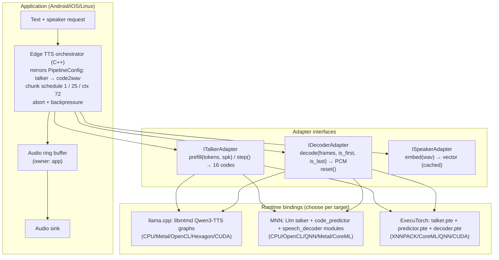

# Edge TTS design (vLLM-Omni-compatible)

Scope: run vLLM-Omni's autoregressive-plus-codec TTS pipelines on edge devices with the same chunking, state, and interruption semantics as the server, using llama.cpp, MNN, or ExecuTorch as the execution runtime. Reference model: **Qwen3-TTS-12Hz (0.6B / 1.7B)**, because it is the only family implemented natively in vLLM-Omni, llama.cpp, and MNN at the analyzed commits [Verified: [engines/vllm_omni_models.md](engines/vllm_omni_models.md) §2, [engines/llama_cpp.md](engines/llama_cpp.md) §9, [engines/mnn.md](engines/mnn.md) §9]. Secondary references: MOSS-TTS (transformer-only codec with ring KV), CosyVoice3 (flow-matching code2wav), Voxtral TTS (ExecuTorch streaming runner).

## 1. Analysis of the pipeline being ported

### 1.1 Conditioning

| Input | Qwen3-TTS (server) | Edge implication |
|---|---|---|
| Text | Tokenized by the HF tokenizer; the task template (CustomVoice / VoiceDesign / Base) is built inside the model by `Qwen3TTSPromptEmbedsBuilder.build_prompt_embeds` in `prompt_embeds_builder.py`, called from the talker; the example only supplies `additional_information` and estimates prompt length [Verified] | Tokenizer must ship on device (llama.cpp vocab, MNN `.mtok`, ExecuTorch tokenizers submodule). The prompt-embeds builder is engine code and the parity source for the edge orchestrator's template construction. |
| Speaker | ECAPA speaker encoder on reference audio (`qwen3_tts_talker.py#L202`) or predefined speaker id; optional in-context codes from a Mimi encoder [Verified] | llama.cpp and MNN both run the ECAPA encoder on device (`qwen3tts-spkenc.cpp`; MNN requires `--ref_audio`, zero-embedding path unsupported [Verified]). Speaker embeddings should be **computed once and cached** as a small vector; the encoder does not need to be in the hot path. |
| Instruction / style | Text tokens in the template [Verified] | Same as text. |

### 1.2 Generation type

Autoregressive over codec frames at **12.5 Hz** (80 ms per frame): the talker predicts codebook 0 per step and a 5-layer code predictor fills the remaining 15 codebooks, re-prefilling per codebook without a KV cache [Verified, `common/qwen3_code_predictor.py#L996`]. In vLLM-Omni the code predictor is captured in dedicated CUDA graphs (`talker_mtp`); in llama.cpp it runs with on-graph top-k/top-p [Verified]. There is no diffusion in this family; CosyVoice3 (CFM, 10 Euler steps, CFG batch 2) and IndexTTS-2 (S2Mel DiT) are the diffusion-flow variants and cost proportionally more per chunk [Verified].

### 1.3 Codec / vocoder

`Qwen3TTSTokenizerV2Decoder`: RVQ embedding sum → causal conv → 8-layer sliding-window (72 frames) transformer → 2×2 upsampling → BigVGAN/Snake stack, fp32, 24 kHz, 1920 samples per frame [Verified]. Cross-chunk state: conv context (2 + 12 frames), a reference-prefix `DynamicCache`, and the 72-frame attention window (`modeling_qwen3_tts_tokenizer_v2.py#L803`) [Verified]. On the server this runs as an `LLM_GENERATION` stage with stateful CUDA graphs per reachable chunk length.

### 1.4 Streaming and first-audio latency structure

Server schedule (from `deploy/qwen3_tts.yaml` and measured in [experiments.md](experiments.md)):

```
talker step 1 ──► 1 frame ──► code2wav ──► first chunk (1,920 samples)      TTFA ≈ 28 ms on L20X
talker steps 2..26 ──► 25 frames ──► code2wav with 72-frame left ctx ──► chunk 2 (48,000 samples)  +160 ms
...
EOS ──► remaining frames ──► final message carries the tail
```

TTFA is bounded below by: text prefill + one talker decode + code predictor (15 sub-steps) + decoder on 1 frame with empty context + transfer. On the server the transfer is a shared-memory hop; on device it is a function call.

### 1.5 Real-time factor, quality, interruption, memory, thermals

| Concern | Server fact | Edge design consequence |
|---|---|---|
| RTF | 0.08–0.10 on L20X (measured); repo-reported 0.16 on H200 at concurrency 1 | Per-frame budget on device is 80 ms for talker + predictor + decoder amortized. From the CPU baseline (409 M LLM at 135 tok/s Q4_0 on 4 x86 threads, measured), the AR part of a 0.6B talker is plausible on ARM big cores; the decoder (BigVGAN + 8-layer transformer per 25-frame window) is the unknown and must be measured first [Unknown]. |
| Quality | fp32 decoder, BF16 talker; quantization "scoped to the AR LM stage" in repo docs | Quantize the talker (Q4/Q8, W4 block-64); keep the decoder fp16 at most; validate with the parity harness (§5). |
| Interruption | `AsyncOmni.abort` → Orchestrator → per-stage abort; decoder state released in `on_requests_finished` [Verified] | Edge orchestrator needs the same three-part abort: stop talker loop at the next frame, drop queued codec frames, flush/reset decoder state; playback ring buffer must be cleared by the app. |
| Memory | Stage 0 asked for 30 % of a 140 GB card by config, not need [Unknown actual] | Weights: 0.6B talker ≈ 0.4 GB at Q4, ≈ 1.2 GB at fp16 [Inferred from parameter count]; decoder ≈ 200 M params (repo doc for Qwen3-Omni code2wav) ≈ 0.4 GB fp16 [Inferred]; KV for ≤4096 positions small. Target under 2 GB resident for the 0.6B path. |
| Thermals | N/A on server | Sustained decode on phone big cores throttles within minutes; design must allow moving the decoder to GPU/NPU (MNN OpenCL/QNN, ExecuTorch CoreML/QNN) and keep the talker on CPU, or vice versa, without changing the orchestrator. |

## 2. Design

### 2.1 Architecture



### 2.2 Adapter interfaces [Proposal]

```cpp
// Talker: one AR frame per step; returns 16 codebook ids (codebook 0 from the LLM, 1..15 from the predictor)
struct ITalkerAdapter {
  virtual bool prefill(const std::vector<int32_t>& text_tokens, const SpeakerCond& spk) = 0;
  virtual bool step(std::array<int32_t,16>& codes, bool& eos) = 0;      // ≤ 80 ms budget
  virtual void set_sampling(const Sampling& s) = 0;                     // temp 0.9, top_k 50 (deploy default)
  virtual void reset() = 0;                                             // drops KV, ready for next utterance
};
// Decoder: stateful across chunks; caller decides chunking (1, then 25) and supplies left context policy
struct IDecoderAdapter {
  virtual bool decode(const int32_t* codes, int n_frames, bool first, bool last, PcmBuffer& out) = 0;
  virtual void reset() = 0;                                             // clears conv ctx, window, prefix cache
  virtual int left_context_frames() const = 0;                          // 72 for Qwen3-TTS
};
struct ISpeakerAdapter { virtual bool embed(const float* pcm, int n, int sr, std::vector<float>& out) = 0; };
```

Orchestrator loop (per utterance). The chunk schedule is a parameter mirrored from the deploy YAML, not a constant: the measured default (1 frame, then 25) gives an ≈80 ms first chunk followed by a ≈160 ms wait, i.e. a playback underrun if playback starts on the first chunk; the YAML's `codec_chunk_ramp` (for example 4, 4, 8, 16, 25) or `codec_chunk_adaptive` remove that cliff and should be the edge default. Gate on uninterrupted-playback latency (time until playback can start without a later gap), measured separately from first-chunk arrival.

1. `spk = cache.get_or(ISpeakerAdapter::embed)`; `talker.prefill(tokens, spk)`.
2. Run `talker.step` until `schedule.size(0)` frames are collected (1 frame in the measured baseline; 4 with the example ramp) → `decoder.decode(frames, first=true)` → push PCM (this is the TTFA path).
3. For chunk index i ≥ 1, accumulate `schedule.size(i)` frames (ramp or adaptive, converging to 25; or until EOS) → `decoder.decode(frames, first=false, last=eos)` → push. `schedule` mirrors `codec_chunk_ramp`/`codec_chunk_adaptive`/`codec_chunk_frames` from the deploy YAML (`chunk_size_utils.py`, `ramp_chunk_size`), and TTFA is compared against a server reference run with the same schedule; 1→25 stays the measured baseline.
4. On abort: set flag checked before every `talker.step`; discard accumulated frames; `decoder.reset()`; `talker.reset()`; app clears the ring buffer.
5. Backpressure: if the ring buffer holds more than N seconds (default 2 s, one chunk), pause the talker loop rather than running ahead; this bounds memory and makes interruption cheap.

### 2.3 State and buffer ownership

| State | Owner | Lifetime | Notes |
|---|---|---|---|
| Talker KV cache | Runtime (llama.cpp `llama_kv_cache`, MNN `CPUKVCacheManager`, ExecuTorch in-graph buffer) | Utterance | Sized for prompt + max frames (deploy `max_model_len 4096`); reset per utterance. No paging needed at batch 1. |
| Code predictor scratch | Runtime | Step | No KV (re-prefill per codebook); llama.cpp/MNN implement this already. |
| Decoder conv/window/prefix state | Decoder adapter | Utterance | Must survive between `decode` calls; `reset()` on abort or EOS. |
| Frame accumulator (≤25 × 16 ints) | Orchestrator | Chunk | Tiny; discarded on abort. |
| PCM ring buffer | Application | Session | Sized to 2–4 s; cleared on abort; the only buffer the audio thread touches. |
| Speaker embedding cache | Application | Session | Keyed by reference audio hash. |

### 2.4 Stage placement per target [Proposal]

| Target | Talker | Decoder | Runtime | Rationale |
|---|---|---|---|---|
| ARM Linux board / phone CPU | CPU Q4 (KleidiAI) | CPU fp16 | llama.cpp or MNN | Both have the full path today; MNN adds NNAPI/QNN escape hatch. |
| Apple Silicon | Metal (llama.cpp) or CPU | Metal (llama.cpp) / CoreML (ExecuTorch) | llama.cpp first; ExecuTorch for ANE | llama.cpp ships xcframework; ExecuTorch has CoreML/MLX delegates. |
| Android with Qualcomm NPU | CPU or Hexagon HTP (llama.cpp) | QNN (MNN or ExecuTorch) | MNN (single engine) | MNN has QNN online/offline compile and an Android app to host it. |
| Jetson | CUDA (llama.cpp) or vLLM-Omni as-is | CUDA | vLLM-Omni (S1) or llama.cpp | S1 gives the reference numbers on the same box. |

## 3. Hybrid (edge/cloud) variant

Talker in vLLM-Omni (cloud or Jetson server), decoder on device. The wire payload is the codec token stream: 16 × int16 per frame at 12.5 Hz = 400 B/s of raw payload before framing and transport overhead, far below any audio stream; the on-device decoder needs only the 72-frame context it already keeps [Inferred]. Integration is more than an adapter: `serving_speech_stream.py`'s `_generate_and_send` consumes PCM from the full pipeline, so a codec-token mode needs a defined wire contract (stage termination after the talker, frame ordering, decoder state/revision, EOS and cancel), most naturally as a talker-only deploy profile plus a new stream message type; the `OmniPayload` key `codes` exists for the intra-pipeline representation [Verified]. S4-first is conditional on prototyping this contract and measuring the on-device decoder. This variant gives server-quality talker sampling, device-local audio with no PCM over the network, and a clean interruption story (client stops consuming; server abort as today).

## 4. Runtime-specific integration notes

- **llama.cpp**: the audio-gen helper (`mtmd-helper-gen.cpp`, `step_prompt/step_gen/get_output`) is already frame-stepped with caller-owned state; `tools/tts/tts.cpp` shows the loop. Work: expose chunked decode (1/25 frames) instead of one WAV, add abort check per step, add a server endpoint later. The decoder window (72 frames) is hard-coded in `clip.cpp` per the report; keep it in sync with the deploy YAML.
- **MNN**: `Llm::generateTTS` runs the decoder once per utterance; work: split `speech_decoder` invocation into chunked calls carrying conv/window state (the Qwen2.5-Omni path already streams with a callback and worker threads, so the pattern exists in `omni.cpp`). Export via `llmexport.py` (W4 default) and verify the fp32 requirement of the decoder on GPU (the Omni DiT is forced fp32 on GPU).
- **ExecuTorch**: model the runner on `examples/models/voxtral_tts/voxtral_tts_runner.cpp` (`AudioChunkCallback`, `streaming_chunk_frames_`, left context). Export three programs: talker (`export_llm` with a Qwen3 config; the code-predictor as a separate method), decoder (from `modeling_qwen3_tts_tokenizer_v2.py`, with explicit state tensors as method I/O in the static-attention style so QNN/CoreML can run it). Upper-bound dims: 25 + 72 frames for the decoder, 4096 for the talker.

## 5. Parity and validation

- Oracle: vLLM-Omni offline run of the same text/speaker with `temperature 0` (or a fixed seed) via `Omni.generate`, saving codec tokens and PCM; the session driver in [experiments/vllm_omni_tts/tts_stream_bench.py](experiments/vllm_omni_tts/tts_stream_bench.py) already records chunk boundaries.
- Metrics: token-level agreement of codebook 0 under greedy decoding (talker parity), PCM SNR of the decoder given identical codes (decoder parity), then perceptual checks (ASR WER on the 12 benchmark prompts, speaker similarity via the same ECAPA encoder).
- Streaming metrics identical to the server definitions in [experiments.md](experiments.md): TTFA, inter-chunk gap p95, RTF (streamed + tail), plus device-only metrics: resident memory, CPU/GPU utilization, and SoC temperature over a 10-minute continuous synthesis run.

## 6. Blockers and unknowns

- Decoder cost on ARM CPU/GPU is unmeasured; if a 25-frame window exceeds 2 s of compute on the target, use smaller steady chunks (the server supports `codec_chunk_ramp` and adaptive chunking, so the schedule is a parameter, not a redesign) [Verified server feature; edge cost Unknown].
- llama.cpp and MNN Qwen3-TTS conversions come from their own converters (GGUF, `.mnn`); numerical parity with vLLM-Omni was not measured here.
- Voice cloning (Base variant) requires the ECAPA encoder and reference-audio codes on device; only speaker-embedding mode is confirmed in MNN [Verified].
- Checkpoint/task parity is not established across engines: the server benchmark used CustomVoice 1.7B, llama.cpp's README demonstrates 1.7B Base, and MNN's demo requires reference-audio cloning and hard-codes `hiddenSize = 1024` in `Talker::generateQwen3TTS` (`omni.cpp`). Family support does not imply every size/task variant runs everywhere; Phase 0 must pin one checkpoint and task per engine before comparing.
- No edge hardware was available; every device number above is a projection to be replaced by Phase 0 measurements in [implementation_roadmap.md](implementation_roadmap.md).
