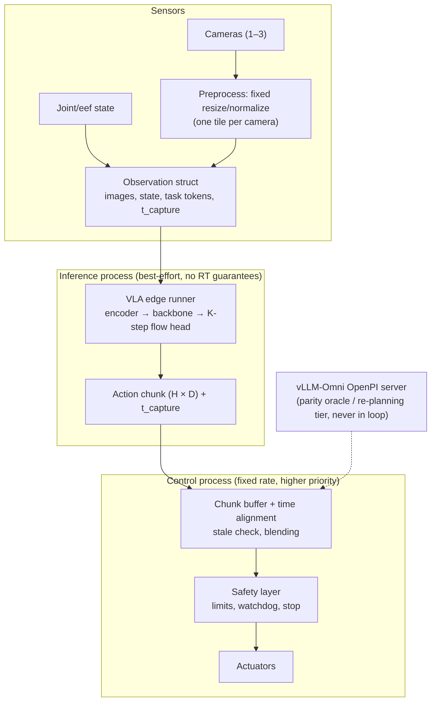

# Edge VLA design (vLLM-Omni-compatible)

Scope: run vision-language-action policies of the kind vLLM-Omni serves (GR00T N1.7, π0, and by extension InternVLA-A1) on edge devices, with vLLM-Omni's OpenPI endpoint as the behavioural oracle. Inference is separated from control and safety throughout; nothing here assumes hard real-time guarantees. Evidence: [engines/vllm_omni_models.md](engines/vllm_omni_models.md) §3, [engines/vllm_omni.md](engines/vllm_omni.md), the four runtime reports, and the CPU vision measurement in [experiments.md](experiments.md).

## 1. Analysis of the pipelines being ported

### 1.1 Perception

| Model | Vision path (server) | Edge implication |
|---|---|---|
| GR00T N1.7 | Qwen3-VL encoder from Cosmos-Reason2-2B, backbone truncated to 12 layers, SDPA, eager, batch 1 [Verified] | ViT + 12-layer LLM per control step; exportable (HF `AutoModel` wrapper). |
| π0 | PaliGemma (SigLIP-So400m producing 256 × 1152 tokens per 224² image, per `modeling_pi0.py`; + Gemma-2B) with up to 3 cameras, prompt ≤ 48 tokens, fp32 [Verified] | Three So400m encoder passes per step. The CPU measurement (0.6–1.2 s per 512 px tile of SmolVLM's smaller SigLIP encoder at 8 x86 threads in llama.cpp) shows only that vision encoding dominates on CPU; it is not an estimate for π0's encoder, which must be measured from the actual graph. |
| DreamZero | 14B DiT world model, 16 UniPC steps, 3 cameras 352×640, per-session paged KV of 603 MiB [Verified] | Not an edge candidate at this size; kept as a cloud tier only. |

### 1.2 Structured inputs and fusion

Proprioception enters GR00T through a per-embodiment `CategorySpecificMLP` (32 embodiments, padded to 132 dims) and π0 through its state projection; language is tokenized once per task; fusion happens in the backbone (GR00T: `AlternateVLDiT` cross-attends to vision/text tokens; π0: Gemma expert attends to PaliGemma KV) [Verified]. In vLLM-Omni the observation dict travels in `OmniDiffusionSamplingParams.extra_args["robot_obs"]` set by `entrypoints/openpi/serving.py`, and never through `OmniPayload` [Verified]. Edge design: the observation struct is defined by the application and passed as plain tensors; there is no connector layer to preserve.

### 1.3 Action generation and chunking

| Model | Head | Steps | Horizon × dim | Output |
|---|---|---|---|---|
| GR00T N1.7 | `AlternateVLDiT` 16 blocks × 1536 | 4 Euler | 40 × per-embodiment (DROID: eef_9d 9, gripper 1, joint 7) | dict of action tensors [Verified] |
| π0 | Gemma-300M expert, flow matching | 10 Euler | 50 × 32 | (50, 32) [Verified] |
| InternVLA-A1 | flow head | 10 | 50 × 32 | offline only [Verified] |

All are **stateless across inferences**: one observation → one action chunk; no KV reuse across control steps in the served code (eager, batch 1) [Verified]. Within one inference π0's `sample_actions` builds a prefix KV that the denoise loop reuses and draws Gaussian noise unless `noise` is passed [Verified]. For edge this means no persistent KV between steps, only weights and per-inference scratch, and that parity tests must pass the noise explicitly to make a step a deterministic function of the observation.

### 1.4 Temporal state, latency, jitter, stale inputs

- Temporal state lives in the **controller**, not the model: the action chunk (40–50 steps) is executed over several control ticks while the next inference runs [Inferred from the OpenPI one-request/one-chunk protocol]. The edge design keeps an explicit chunk buffer with timestamps.
- Latency per inference = preprocessing + encoder(s) + backbone + K flow steps. On the server there is no published per-step number in tree; InternVLA docs mention 38 s for its offline example (unmeasured claim) [Unknown].
- Jitter sources on device: thermal throttling, GPU/NPU queue contention with the camera pipeline, garbage collection if any managed runtime is involved, and dynamic shapes (never allow them in the hot path).
- Stale inputs: the observation must carry a capture timestamp; if inference finishes later than a configured staleness bound, the controller keeps executing the previous chunk's remaining actions and the new chunk is time-aligned (skip the steps already elapsed) or discarded.

### 1.5 Task success

Success is measured in simulation first. vLLM-Omni ships simulation evaluation clients for DreamZero (`examples/online_serving/dreamzero/droid_sim_eval_client.py`, `molmospace_dreamzero_eval_demo.py`) that drive an external simulator through the server [Verified]; no simulator itself is in any of the six trees. The plan reuses those clients where the policy matches, still requires an external simulator, and defines success only relative to the server policy running the same episodes.

## 2. Design

### 2.1 Architecture: inference isolated from control and safety



Rules [Proposal]:

- Inference and control are separate OS processes (or at least threads with different priorities) sharing a lock-free single-slot mailbox for the latest chunk; the control loop never blocks on inference.
- Safety (joint limits, velocity limits, watchdog on chunk age, e-stop) is enforced after the controller and does not depend on the model runtime.
- The cloud endpoint is used only for parity tests and optional slow re-planning (task text updates), never for per-tick actions.

### 2.2 Adapter interfaces [Proposal]

```cpp
struct IVisionAdapter   { virtual bool encode(const ImageTensor& img, int cam, TokenTensor& out) = 0; };   // fixed shape per camera
struct IFusionAdapter   { virtual bool fuse(const TokenTensor* vis, int n_cam, const StateVec& s, const TaskTokens& t, Cond& out) = 0; };
struct IActionHead      { virtual bool sample(const Cond& c, int k_steps, ActionChunk& out) = 0; };        // K Euler steps inside
struct IVlaRunner {                                                                                        // composes the three, owns scratch
  virtual bool infer(const Observation& o, ActionChunk& out, InferStats& st) = 0;                         // returns wall time, per-stage ms
};
```

`infer` is stateless across calls; `Observation` carries `t_capture`. The runner may keep encoder outputs for cameras whose frames did not change (frame-hash check) as an optimization, which is safe because the model is stateless [Inferred].

### 2.3 State and buffer ownership

| State | Owner | Notes |
|---|---|---|
| Weights, runtime scratch | Runner | Static allocation at load (ExecuTorch plans it at export; MNN/llama.cpp reserve at init). |
| Observation buffers | Sensor process | Double-buffered; the runner reads the latest complete frame. |
| Action chunk buffer | Controller | Ring of two chunks with timestamps; blending policy at chunk boundaries is the controller's. |
| Task text tokens | Application | Re-tokenized only when the instruction changes. |
| Per-embodiment tables (GR00T) | Runner | Constant tensors selected by embodiment id at load. |

### 2.4 Stage placement per runtime [Proposal]

| Runtime | Encoder | Backbone | Action head | Assessment |
|---|---|---|---|---|
| **ExecuTorch (primary)** | `vision_encoder` method (CoreML/QNN/XNNPACK) with fixed 224² input | `text_decoder`-style method with static shapes (prompt ≤ 48 tokens, no KV persistence) | Flow loop as a `while_loop`/unrolled K steps inside one method, or K calls from the runner | Static memory bound and zero-copy I/O are available mechanisms, not automatic: outputs must be left unplanned at export for `set_output_data_ptr` to accept them, and every op must be covered by the chosen delegate or it falls to portable CPU kernels; PT2E quantizer recipes per delegate; runner pattern exists in `MultimodalRunner`. Export sources: GR00T `diffusion/models/gr00t/` (HF wrapper), π0 `diffusion/models/pi0/modeling_pi0.py` (plain torch, parity test already runs on CPU [Verified]). |
| **MNN (secondary)** | `utils/vision.py` exporters (Qwen3-VL/SigLIP families) | `llmexport.py` path with `input_embeds` overloads, or ONNX | DiT via the diffusion engine or ONNX with a host loop | Broadest Android NPU coverage (QNN/Hexagon/NNAPI) and existing apps; batch 1 and static shapes are already the norm. |
| **llama.cpp** | `clip.cpp` projector families (SigLIP present) | `libllama` with `llama_batch.embd` for proprio/vision embeddings | Not available; would be a new C++ graph (sidecar proposal in [engines/llama_cpp.md](engines/llama_cpp.md)) | Viable for VLM-only reasoning tiers; not for the action head without new engine code. |
| **ncnn** | ViT/CNN encoder via pnnx | No | Small MLP head only | Component runtime for Vulkan-only devices. |

Hardware placement: keep the encoder on the NPU/GPU and the flow head wherever K small matmuls run with the least launch overhead (often CPU for a 300 M expert at K = 4–10 [Inferred]); measure both.

### 2.5 Latency budget template [Proposal]

For a target control period T (for example 100 ms at 10 Hz):

| Stage | Budget | How enforced |
|---|---|---|
| Preprocess | ≤ 5 % T | Fixed resize on the ISP/GPU |
| Encoders (n cameras) | ≤ 40 % T | One tile per camera; NPU delegate; skip unchanged frames |
| Backbone + fusion | ≤ 30 % T | Static shapes; quantized weights |
| Action head (K steps) | ≤ 20 % T | K fixed; unrolled |
| Slack for jitter | ≥ 5 % T | Monitored p95; if exceeded for N consecutive steps, drop to a lower-rate mode |

Chunking makes the effective requirement softer: with a 40-step chunk executed at 10 Hz, inference may take up to several periods as long as chunk age stays within the staleness bound; the design treats T as the *desired* inference cadence, not a deadline.

## 3. Validation in simulation first

1. **Numerical parity** (no robot): export each module, feed recorded observations from an episode, compare action chunks with vLLM-Omni's OpenPI server (`examples/online_serving/pi0/openpi_client.py`) at fixed seeds; report max-abs and per-dimension RMS error per flow step count.
2. **Closed-loop in simulation**: the same episodes in a simulator with the edge runner in the loop; success rate versus the server policy on ≥ 50 episodes per task; report jitter (p95 of inference wall time) and chunk-age distribution.
3. **Fault injection**: delayed frames, dropped cameras, thermal throttling emulation (CPU frequency cap); verify the controller's stale-input path and the safety layer engage as specified.
4. Only after 1–3 pass on the target device class does hardware-in-the-loop start, with the safety layer active and independent of the model runtime.

## 4. Blockers and unknowns

- No VLA model runs in any of the four runtimes today; every path is an export project [Verified absence].
- Model sizes: GR00T ≈ 6 GiB BF16 per recipe; π0 backbone is a 2B PaliGemma; both need weight quantization to fit under 4 GB on phones, and the quality impact on actions is unmeasured [Unknown].
- Vision cost on CPU is the dominant risk (measured on x86 with llama.cpp: 0.6–1.2 s per 512 px SigLIP tile at 8 threads); NPU delegation of the encoder is required for anything above 1–2 Hz on CPU-only boards [Inferred].
- Weights for DreamZero/π0/GR00T are not in the local cache and their download requires permission; reference numbers on the L20X could not be produced in this session.
- Simulation evaluation clients exist in vLLM-Omni (`examples/online_serving/dreamzero/droid_sim_eval_client.py`, `molmospace_dreamzero_eval_demo.py`), but the simulator itself and any π0/GR00T-specific harness remain external dependencies.
