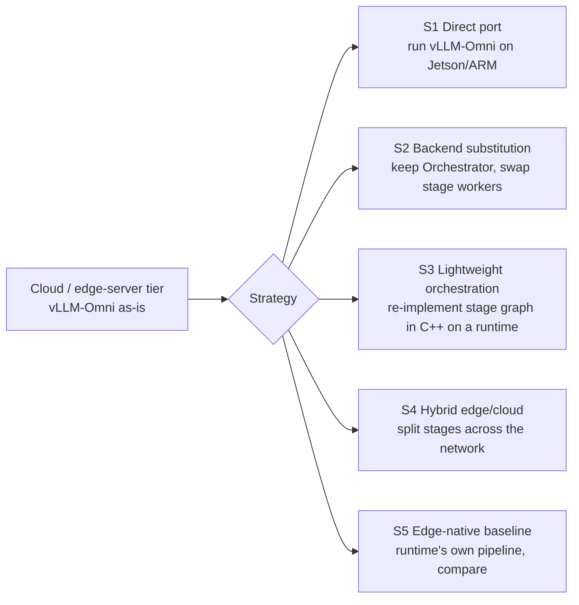

# Feasibility: extending vLLM-Omni to edge devices

Question answered here: can vLLM-Omni's TTS and VLA pipelines run on edge devices, and if so, which pieces of vLLM-Omni are re-used, replaced, or re-implemented? Evidence comes from [engines/vllm_omni.md](engines/vllm_omni.md), [engines/vllm_omni_models.md](engines/vllm_omni_models.md), [engines/vllm.md](engines/vllm.md), the four runtime reports, and [experiments.md](experiments.md). Labels as in [README.md](README.md).

## 1. What "vLLM-Omni on edge" can mean

vLLM-Omni is three things at once [Verified]:

1. **A process/serving model**: `AsyncOmniEngine` → `Orchestrator` → per-stage vLLM engine processes (`StageEngineCoreProc`) or diffusion workers, wired by connectors (default: host-staged shared memory), exposed over HTTP/WebSocket. Initialization observed at 157–188 s for a 2-stage TTS on an L20X in the default configuration; the minimum with `enforce_eager`/parallel stage init was not measured.
2. **Pipeline semantics**: stage graph per model (`PipelineConfig`), deployment overlay (`DeployConfig`), async-chunk hand-off (1-frame first chunk, 25-frame steady chunks, 72-frame decoder context for Qwen3-TTS), abort propagation, output templates, OpenPI robot protocol.
3. **Model code**: talkers built on vLLM layers; codecs/vocoders/action heads that are plain PyTorch modules.

Only (2) and parts of (3) are portable. The plan below therefore distinguishes: *re-host* (run the real vLLM-Omni on an edge server), *substitute* (keep vLLM-Omni's control plane, swap execution), *orchestrate lightly* (re-implement the control plane in a small runtime), *split* (edge/cloud hybrid), and *edge-native baseline* (use a runtime's own pipeline and compare).

## 2. Target hardware classes and assumptions

No edge hardware was available in this session (x86 host only). Statements about targets are drawn from what each repository ships for that target and are labelled.

| Target | Assumption made here | vLLM / vLLM-Omni status | Runtime coverage |
|---|---|---|---|
| **Embedded NVIDIA (Jetson Orin / Thor class)** | aarch64 Linux, CUDA, 8–64 GB unified memory, JetPack; power caps 15–60 W | vLLM: Tegra detection path and CUDA arch 8.7/11.0 in the build list, no wheels/CI/docs beyond an sm_110a note [Verified]. vLLM-Omni: CUDA platform code is arch-agnostic; aarch64+CUDA is exercised in vLLM CI on GH200 only [Verified]. **Feasible in principle, unproven** [Inferred]. | llama.cpp CUDA (needs explicit sm_87), MNN CUDA (sm87 in list), ExecuTorch CUDA (AOTInductor; Jetson unknown), ncnn (aarch64 CPU + Tegra Vulkan) [Verified] |
| **ARM CPU (Linux SBC, Graviton-class, phone big cores)** | ARMv8.2+ with fp16/dotprod, often i8mm; 4–8 usable cores; 4–16 GB | vLLM CPU platform is first-class on aarch64 Linux (wheels, ARM CI, oneDNN+ACL, KleidiAI W4A8) [Verified]; vLLM-Omni **has no CPU platform** [Verified]. | All four runtimes; KleidiAI in llama.cpp, MNN, ExecuTorch(XNNPACK) [Verified] |
| **Apple Silicon (M-series Mac, iPhone/iPad A-series)** | macOS/iOS, Metal, ANE via CoreML, unified memory | vLLM: CPU-only experimental on macOS; Metal via out-of-tree `vllm-metal` (MLX) [Verified]; vLLM-Omni: nothing [Verified]. **Not feasible as-is** on iOS (no Python/torch runtime model). | llama.cpp Metal + xcframework; MNN Metal/CoreML + iOS framework; ExecuTorch CoreML/MLX/Metal via SwiftPM; ncnn via MoltenVK [Verified] |
| **Mobile GPU/NPU (Android: Adreno/Mali GPU, Hexagon/QNN, MediaTek, Samsung)** | Android 10+, 8–16 GB, thermal throttling within minutes | vLLM/vLLM-Omni: nothing [Verified]. **Not feasible.** | llama.cpp OpenCL (Adreno), Vulkan, Hexagon HTP; MNN OpenCL/Vulkan/QNN/Hexagon/NNAPI; ExecuTorch Vulkan/QNN/MediaTek/Samsung; ncnn Vulkan [Verified] |

## 3. Strategy comparison

| Strategy | What it keeps from vLLM-Omni | Targets it can reach | Blocking facts | Verdict |
|---|---|---|---|---|
| **S1 Direct port** (install vLLM + vLLM-Omni on the device) | Everything | Jetson-class CUDA only (aarch64 Linux + CUDA); ARM CPU only if a CPU platform is added to vLLM-Omni | Initialization 157–188 s observed on L20X with default compile/graph capture, likely worse on Jetson [Inferred]; Python + torch 2.13 + transformers + diffusers footprint; two engine processes for two AR/generation stages; no CPU platform in vLLM-Omni (missing implementation, not architectural) [Verified] | Viable for an **edge server** (Orin 64 GB, Thor) where long-lived processes are fine; not viable for phones, MCUs, or cold-start use. Recommended as the *reference tier* only. |
| **S2 Backend substitution** (vLLM platform plugin whose worker calls llama.cpp/MNN/ExecuTorch) | Orchestrator, schedulers, connectors, APIs | Same as S1 (still Python + vLLM process model) | The vLLM platform plugin contract requires a `WorkerBase`, an `AttentionBackend`, a device communicator and torch tensors flowing through the model runner [Verified]; a worker that delegates a whole stage to a foreign runtime bypasses paged attention, sampling and CUDA-graph logic, so most of what vLLM contributes is lost while its process overhead stays. `OmniPayload` has no action keys; the default shared-memory connector serializes via CPU; the Mooncake/Mori transfer-engine connectors have device fast paths (Mori's `xgmi` backend is intra-node), but none is validated for an edge target [Verified]. | Not recommended as the main path. A narrow variant is useful: **replace only the vocoder/codec stage** with an exported artifact executed by torch (or ExecuTorch's Python runtime) inside the existing `LLM_GENERATION` worker on Jetson. |
| **S3 Lightweight orchestration** (re-implement `PipelineConfig` semantics in a small C++ runtime on top of llama.cpp / MNN / ExecuTorch) | Stage graph, chunk schedule, state-ownership rules, abort semantics, API shapes, tests as parity oracle | All four target classes | Requires exporting every stage to the runtime's format; talkers are vLLM-bound modules and must be re-exported from the HF checkpoint, not from vLLM-Omni code [Verified]; no shared connector abstraction exists across the runtimes (all in-process, app-owned buffers) | **Recommended primary path** for phones, Apple devices, ARM boards. Two of the runtimes already implement the Qwen3-TTS graph natively (llama.cpp `MTMD_GEN_AUDIO_TYPE_QWEN3TTS`, MNN `Llm::generateTTS`), so the TTS orchestration layer mostly adds streaming, interruption and parity, not model porting. |
| **S4 Hybrid edge/cloud** (e.g. thinker or talker in the cloud, codec/vocoder on device; or perception on device, policy in cloud) | Cloud stages unchanged; device runs one exported stage | All targets for the device stage | vLLM-Omni's connectors are process/host transports (shared memory, RDMA) not WAN-ready [Verified]; the WebSocket endpoints (`/v1/audio/speech/stream`, `/v1/realtime`, OpenPI) are the practical boundary. Network jitter dominates for VLA; for TTS a codec-token stream is tiny (16 codebooks × 12.5 Hz) which makes talker-in-cloud / vocoder-on-device attractive [Inferred]. | Recommended as the **first deliverable** for TTS (codec tokens over WebSocket, on-device vocoder), **conditional on** a prototype of the new wire contract (the speech stream endpoint's `_generate_and_send` consumes PCM today, so codec-token streaming needs stage termination, token ordering, decoder state/revision, EOS and cancel semantics defined) and on a measured on-device decoder; and as a fallback tier for VLA (never in the control loop, only for re-planning). |
| **S5 Edge-native baseline** (llama.cpp `llama-tts`, MNN `qwen3_tts_demo`, ExecuTorch Voxtral runner; VLM via `llama-mtmd-cli`) | Nothing but the model weights and the benchmark protocol | All targets | These paths are single-request, mostly non-streaming (llama.cpp CLI, MNN Qwen3-TTS single callback) [Verified] | Required as the **measurement floor** in every phase; also the fastest way to get audio on a device today. |

Assessment of the "must keep vLLM-Omni" premise: an edge deployment that keeps the vLLM-Omni *code* is only sensible on Jetson-class servers (S1). For every other target, the deliverable is "vLLM-Omni-compatible edge pipelines": same models, same chunking and state rules, same API surface, validated against vLLM-Omni outputs. That is S3 with S4 and S5 as bookends.

## 4. Per-runtime assessment for stage placement

Stages considered (from [engines/vllm_omni_models.md](engines/vllm_omni_models.md)): text front-end + speaker conditioning (ECAPA), **AR talker** (Qwen3 LLM with 15/16-codebook code predictor), **codec decoder / vocoder** (RVQ decode + sliding-window transformer + BigVGAN), and for VLA: **vision encoder** (SigLIP/Qwen3-VL ViT), **state/language fusion** (LLM backbone), **action head** (flow/diffusion DiT, 4–10 Euler steps).

### 4.1 llama.cpp

| Aspect | Finding |
|---|---|
| Stage placement | Talker + code predictor + code2wav + speaker encoder all inside `libmtmd` for Qwen3-TTS (`tools/mtmd/models/qwen3tts-gen.cpp`, `qwen3tts-spkenc.cpp`; enum in `tools/mtmd/mtmd.h`) [Verified]. Vision encoder for a VLM in `clip.cpp` with ~60 projector types; LLM backbone in `libllama`; **no action head** [Verified]. |
| Operator gaps | For TTS: none for Qwen3-TTS and Pocket-TTS; other vLLM-Omni families (CosyVoice3 CFM+HiFT, Fish DAC, MOSS codec) would need new graph code in C++ [Verified absence]. For VLA: flow head = new graph; proprio input has to enter through `llama_batch.embd`; `while`-style denoise loop must be driven from the app. `ggml` has conv/pool/1-D ops and flash attention, so the DiT itself is expressible [Inferred]. |
| State | KV in `llama_kv_cache` (per-seq, ring, quantizable, save/load); code2wav 72-frame window state inside the mtmd helper; caller-owned state blobs in the step API [Verified]. |
| Copies | Zero-copy mmap weights; scheduler copies at backend splits; audio helper returns float buffers [Verified]. |
| Integration effort | TTS: low (already runs); work is streaming callback + interruption + parity harness. VLA: medium-high (C++ graph for the action head + app loop). |
| Where it fits | ARM CPU (KleidiAI), Apple Metal, Android via OpenCL/Adreno, Hexagon HTP, Jetson CUDA; static single binary. |

### 4.2 ncnn

| Aspect | Finding |
|---|---|
| Stage placement | Vocoder/VITS-class nets and CNN/ViT vision encoders; the Piper example shows a 5-net app-driven TTS [Verified]. LLM talker only via the batch-1 KV cache path with host-provided masks and RoPE, no tokenizer, no sampler, seq-len-1 export [Verified]. |
| Operator gaps | No Vulkan for Embed/MatMul/GLU/RNN; no tokenizer; no audio I/O; block-quant LLM only on CPU [Verified]. |
| State | App-owned `Mat` KV blobs (consume-and-replace); no paging [Verified]. |
| Copies | Explicit upload/download per extract on Vulkan [Verified]. |
| Integration effort | High for anything LLM-shaped; low for a stand-alone vocoder or vision encoder. |
| Where it fits | Only as a **component runtime** (vocoder, image encoder, small MLP/CNN action head) inside an S3 orchestrator on Vulkan-only devices; not recommended as the primary TTS/VLA runtime. |

### 4.3 MNN

| Aspect | Finding |
|---|---|
| Stage placement | Full Qwen3-TTS path in the LLM engine (talker → 16-group code predictor → codec embedder → speech decoder; `Llm::generateTTS`, `demo/qwen3_tts_demo.cpp`) and Qwen2.5-Omni talker → DiT → BigVGAN with chunked callback [Verified]. VLA: vision exporters for 16 encoder families, DiT/flow runtime in the diffusion engine, `input_embeds` overloads; no policy model [Verified]. |
| Operator gaps | Qwen3-TTS decoder runs as **one call per utterance** (single callback) rather than chunk-streamed; GPU backends ignore `attention_mode` (KV quant/flash only on CPU/Metal) [Verified]. Action head: DiT ops exist; proprio MLP + embodiment lookup is ordinary graph code [Inferred]. |
| State | `KVMeta` per forward, contiguous KV with quant and mmap-to-disk; codec state in engine worker threads; `Module::clone` shares weights [Verified]. |
| Copies | Per-op CPU fallback wraps; NPU subgraph compile is all-or-nothing [Verified]. |
| Integration effort | TTS: low-medium (add chunked streaming to the Qwen3-TTS path, mirror vLLM-Omni's 1/25/72 schedule). VLA: medium (export encoder + backbone + head via `llmexport.py`/ONNX, write the control loop in C++ against `Module`). |
| Where it fits | Android (CPU/OpenCL/QNN/Hexagon/NNAPI), iOS/macOS (Metal/CoreML), OpenHarmony, Jetson CUDA; the only runtime with in-tree Android/iOS chat apps and an Omni engine. |

### 4.4 ExecuTorch

| Aspect | Finding |
|---|---|
| Stage placement | LLM runner (`TextLLMRunner`, `MultimodalRunner`) for talker/backbone; Voxtral TTS example shows LM + flow head + codec decoder as two `.pte`s with a chunked streaming callback (25 frames, 5 initial, 25 left context) [Verified]. VLA: any sub-module exportable with `torch.export`; `while_loop` supported inside graphs; static planning and zero-copy I/O suit fixed-rate loops [Verified]. |
| Operator gaps | Per delegate: QNN/Ethos-U static shapes only; CoreML/XNNPACK coverage decided by partitioner; unsupported ops fall to portable CPU kernels, which is correct but slow [Verified]. The Qwen3-TTS decoder's Snake activations and sliding-window attention have no delegate-specific kernels [Unknown until exported]. |
| State | KV as in-graph mutable buffers with upper-bound length (or static-attention I/O for NPUs); runner tracks position; no paging [Verified]. |
| Copies | Inputs aliased; outputs zero-copy only when the export leaves them unplanned (`Method::set_output_data_ptr` rejects memory-planned outputs; see `docs/source/compiler-memory-planning.md`); `_h2d/_d2h` only on CUDA delegates [Verified]. |
| Integration effort | TTS: medium (export talker + code predictor + decoder; write a Qwen3-TTS runner modelled on the Voxtral runner). VLA: medium (export three modules; runner loop; QNN/CoreML quantizer recipes). Highest AOT rigor (memory bound known at build time), which is what a safety-reviewed control path wants. |
| Where it fits | Apple (CoreML/MLX), Qualcomm QNN, MediaTek/Samsung NPUs, XNNPACK ARM CPU, Cortex-M/Ethos-U for tiny heads; CUDA on Linux (Jetson unknown). |

## 5. Source-level integration points in vLLM-Omni

These are the places an edge implementation reads from (as specification) or hooks into (for hybrid/parity), all [Verified] in the engine reports:

| Purpose | Path | Use |
|---|---|---|
| Stage graph per model | `vllm_omni/model_executor/models/<family>/pipeline.py`, registry `vllm_omni/config/pipeline_registry.py` | Source of truth for stage order, types, and output modality; the edge orchestrator mirrors it |
| Chunk schedule and decoder context | [`vllm_omni/deploy/qwen3_tts.yaml`](../vllm-omni/vllm_omni/deploy/qwen3_tts.yaml) (`initial_codec_chunk_frames`, `codec_chunk_frames`, `codec_left_context_frames`), `chunk_size_utils.py` | Same numbers on device so audio is bit-comparable |
| Payload contract | `vllm_omni/data_entry_keys.py` (`OmniPayload`: hidden_states, embed, ids, codes, meta) | Defines what crosses a stage boundary; edge adapters carry the same keys |
| Streaming/abort semantics | `Orchestrator._handle_abort`, `OmniChunkTransferAdapter`, `WAITING_FOR_CHUNK` | Interruption rules to replicate |
| TTS output formatting | `vllm_omni/model_executor/models/output_templates.py`, TTS adapter registry | Output shape (`audio`, `sr`, chunk list) the edge API should match |
| Robot API | `vllm_omni/entrypoints/openpi/` (`serving.py` puts observations into `robot_obs`), `diffusion/output_formatter.py` (`actions`) | Wire protocol for hybrid VLA and for parity tests |
| Parity oracles | `tests/e2e/offline_inference/test_qwen3_tts_*.py`, `tests/e2e/online_serving/test_{pi0,gr00t_openpi,dreamzero}_expansion.py`, CPU unit tests per family | Reference outputs for edge validation |
| Model code that is plain torch | Qwen3-TTS `tokenizer_12hz/modeling_qwen3_tts_tokenizer_v2.py` (decoder), `common/qwen3_code_predictor.py`, GR00T `diffusion/models/gr00t/`, π0 `diffusion/models/pi0/` | Export sources for ExecuTorch/MNN/ONNX |
| Model code that is vLLM-bound | Talker classes using `Qwen2Model`/`Qwen3Model`, `ParallelLMHead` | Must be re-exported from the HF checkpoint, not from these classes |

## 6. Blockers

| Blocker | Type | Affects |
|---|---|---|
| No CPU platform in vLLM-Omni | Missing implementation | S1/S2 on ARM CPU |
| Initialization of 2.5–3 min for two stages (observed, default config; lower bound unmeasured) | Process model is architectural; compile/graph capture at start is configurable (`enforce_eager`, `compilation_config`) | S1 on any device with cold-start needs |
| Default inter-stage transport (`SharedMemoryConnector`) is host-staged; device fast paths exist in the Mooncake/Mori transfer-engine connectors (including Mori's intra-node `xgmi` backend on AMD), none validated for an edge target | Missing validation/implementation for edge co-location (repo docs list D2D as roadmap) | S1/S2 latency; irrelevant to S3 |
| Talkers depend on vLLM layers | Architectural for reuse; not for re-export | S3 must export from HF checkpoints |
| `OmniPayload` lacks action/video keys; VLA bypasses connectors | Missing implementation | S2/S4 for VLA |
| Qwen3-TTS decoder streaming in MNN is single-callback; llama.cpp CLI non-streaming | Missing implementation | S3 on MNN/llama.cpp |
| No VLA model in any runtime | Missing implementation | S3/S5 for VLA |
| No edge hardware in this environment | Environmental | All measurements beyond x86/L20X |
| Model weights for VLA (DreamZero, π0, GR00T) not cached; downloads need permission | Environmental | Reference measurements for VLA |

## 7. Decision

- **TTS**: S4 first (talker in vLLM-Omni, on-device vocoder) **only if** the codec-token wire-contract prototype and the on-device decoder measurement pass (the speech stream endpoint's `_generate_and_send` consumes PCM today); otherwise S3 first. Then S3 on llama.cpp (ARM CPU, Apple) and MNN (Android NPU/GPU, iOS) with ExecuTorch for CoreML/QNN targets, S5 numbers reported alongside at every phase. Design in [tts_edge_design.md](tts_edge_design.md).
- **VLA**: S3 only, on ExecuTorch (primary, for its static memory model) and MNN (secondary, Android/NPU breadth), with vLLM-Omni's OpenPI endpoint as the parity oracle and as an S4 re-planning tier that is never inside the control loop. Design in [vla_edge_design.md](vla_edge_design.md).
- **S1** is retained for Jetson-class edge servers as the way to run the unmodified reference and to validate the other tiers.
