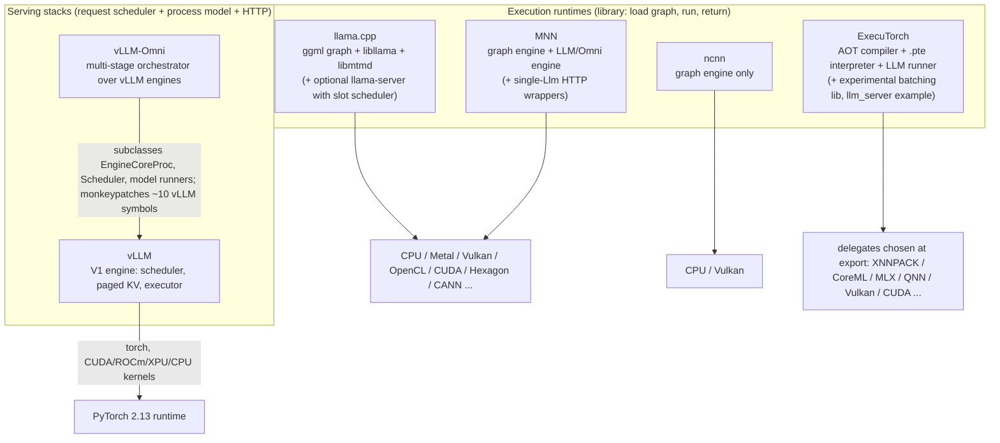

# Six-engine comparison

Sources: the seven engine reports under [engines/](engines/) (each claim there carries a file/symbol citation) and the measurements in [experiments.md](experiments.md). This document compares; it does not re-derive. Labels: [Verified] = confirmed in the engine reports against source at the analyzed commits; [Inferred]; [Proposal]; [Unknown]; "repo-reported" = published by the repository, not reproduced; "measured" = produced in this session on this x86/L20X host.

## 1. Two kinds of software

The six repositories split into **serving stacks** (own a request queue, batch across requests, run as long-lived processes) and **execution runtimes** (a library that runs one graph or one decode step when called). This distinction explains most of the comparison below, and it is the first thing the edge plan has to respect: a serving stack can be *re-hosted*, but it cannot be *shrunk* into a runtime without replacing its process model.

| Engine | Kind | Unit of work the public API accepts | Long-lived process model | Report |
|---|---|---|---|---|
| vLLM | Serving stack (V1 engine) | A request (prompt + sampling params) into a continuous-batching scheduler | Yes: API server + `EngineCoreProc` + workers, ZMQ between them [Verified] | [engines/vllm.md](engines/vllm.md) |
| vLLM-Omni | Serving stack built on vLLM | A request that flows through a DAG of stages (AR / generation / diffusion), each stage a vLLM-style engine process | Yes: `AsyncOmniEngine` + `Orchestrator` + one `StageEngineCoreProc` per AR stage, shared-memory or RDMA connectors between stages [Verified] | [engines/vllm_omni.md](engines/vllm_omni.md), [engines/vllm_omni_models.md](engines/vllm_omni_models.md) |
| llama.cpp | Execution runtime (+ optional server tool) | `llama_decode(batch)` over one or more `seq_id`s; `mtmd` chunk encode; audio-gen step API | No in `libllama`; yes only in `tools/server` (slots, single worker queue) [Verified] | [engines/llama_cpp.md](engines/llama_cpp.md) |
| ncnn | Execution runtime | `Extractor::extract(blob)` on one `Net` | No [Verified] | [engines/ncnn.md](engines/ncnn.md) |
| MNN | Execution runtime (+ LLM/Omni engine) | `Module::onForward`, or `Llm::response/generate` for one conversation | No; `mls_server`/`mnncli` wrap one `Llm` under a mutex [Verified] | [engines/mnn.md](engines/mnn.md) |
| ExecuTorch | Execution runtime (AOT + interpreter) | `Method::execute()` on one loaded `.pte`; `IRunner::generate` for LLMs | No in core; experimental `extension/llm/batching` scheduler has no in-tree executor; `examples/llm_server` serializes execution [Verified] | [engines/executorch.md](engines/executorch.md) |

## 2. Device layer

| Dimension | vLLM | vLLM-Omni | llama.cpp | ncnn | MNN | ExecuTorch |
|---|---|---|---|---|---|---|
| In-tree accelerators | CUDA, ROCm, XPU, CPU (x86/aarch64/Apple CPU); TPU via out-of-tree shim; Jetson detected through `/etc/nv_tegra_release` with CUDA arch 8.7/11.0 in the build list [Verified] | CUDA, ROCm, Ascend NPU (incl. 310P), XPU, MUSA; **no CPU platform** (`UnspecifiedOmniPlatform` reports 0 devices) [Verified] | 18 backend dirs: cpu, cuda, hip, musa, metal, vulkan, opencl (Adreno), hexagon (HTP), cann, sycl, openvino, webgpu, blas, rpc, virtgpu, zdnn, zendnn, et (a vendor accelerator platform under `/opt/et`, not ExecuTorch) [Verified] | CPU (ARM/x86/RISC-V/MIPS/LoongArch) + Vulkan only; Apple via MoltenVK [Verified] | 16 backend dirs: cpu (arm82/KleidiAI/SME2/AVX), metal, opencl, vulkan, opengl, cuda (sm60-120), musa, tensorrt, coreml, nnapi, qnn, hiai, hexagon, rknn, neuropilot (stub) [Verified] | Delegates chosen at export: XNNPACK, Vulkan, WebGPU, QNN, MediaTek, Samsung ENN, Ethos-U/VGF, NXP, OpenVINO, CoreML, Metal (exp.), MLX (exp.), CUDA (AOTInductor), Cortex-M, Cadence [Verified] |
| Discovery / selection | Exactly one `Platform` activates from builtin detectors or the `vllm.platform_plugins` entry point; out-of-tree wins [Verified] | Same as vLLM plus `vllm_omni.platform_plugins`; devices assigned per stage in deploy YAML [Verified] | `ggml_backend_registry`, dynamic backend `.so` loading, registration order = scheduler priority, CPU last [Verified] | Vulkan device by `rough_score`; CPU ISA tables at load [Verified] | `Schedule::getAppropriateType` AUTO priority HIAI → CoreML/NNAPI → TRT → CUDA → OpenCL → Metal → Vulkan → CPU [Verified] | None at runtime: `BackendDelegate::Init` looks up a string id in a 16-slot static registry and checks `is_available()` [Verified] |
| Memory model | Paged KV blocks sized from `gpu_memory_utilization` after a profile run; torch caching allocator; CuMem sleep mode [Verified] | Inherits; adds per-stage `determine_available_memory`, stage co-location admission, diffusion offload, host-weight mmap sharing [Verified] | `ggml_gallocr` worst-case compute buffer reserved at context init; mmap weights; per-backend buffer types [Verified] | Pool allocators, optional mmap weights, Vulkan blob/weight/staging allocators [Verified] | Eager/defer arena allocators, mmap weights and feature maps, KV cache mmap-to-disk option [Verified] | Static planning at export (`non_const_buffer_sizes`), `HierarchicalAllocator` arenas, zero-copy input aliasing and output pointers [Verified] |
| Host/device transfers | torch copies; multimodal embeddings scattered on device; CPU offload/KV connectors [Verified] | Default `SharedMemoryConnector` path: **D2H → shared memory (msgpack) → H2D** for every hop; repo docs state connectors are D2H2D, but `MooncakeTransferEngineConnector.put` and the Mori connector pass tensors/`ManagedBuffer` without serialization and support device memory pools, Mori including an intra-node `xgmi` backend [Verified] | Scheduler inserts copies at backend splits; async `tensor_set/get`; RPC backend serializes over TCP [Verified] | Explicit `record_upload/download` per extract; CPU fallback downloads [Verified] | `WrapExecution` copies at per-op fallback boundaries; NPU delegates run whole subgraphs [Verified] | `_h2d_copy/_d2h_copy` inserted by `PropagateDevicePass` at delegate boundaries (CUDA) [Verified] |
| Sync / streams | CUDA streams, CUDA graphs, async scheduling overlaps CPU/GPU [Verified] | Adds copy-stream D2H snapshot, async output materialization [Verified] | One stream per backend; events; pipeline parallelism up to 4 copies for multi-GPU [Verified] | One command buffer per extract, `submit_and_wait` [Verified] | Single queue per GPU backend, commit-and-wait; no multi-stream [Verified] | Synchronous interpreter; optional per-method CUDA graph [Verified] |
| Portability envelope | Linux servers; aarch64 Linux CPU wheels; macOS CPU experimental; no Android [Verified] | Linux CUDA/ROCm/NPU/XPU/MUSA servers only [Verified] | Linux/macOS/Windows/Android/iOS/WASM; xcframework and Android JNI samples in tree [Verified] | 60 CMake toolchains incl. Android, iOS, HarmonyOS, Jetson, QNX, ESP32, WASM [Verified] | Android/iOS/macOS/Linux/Windows-ARM64/OpenHarmony/WASM/RISC-V; CUDA sm87 present [Verified] | Android AAR, Apple SwiftPM xcframeworks, bare-metal Arm, Zephyr, ESP32, RISC-V, Linux, Windows, WASM [Verified] |

Take-aways for edge: only the four runtimes reach Android GPU/NPU and Apple GPU/ANE. vLLM reaches ARM CPU and Jetson-class CUDA (untested in CI), and vLLM-Omni does not reach CPU at all. That last point is an **architectural** constraint only in the sense that vLLM-Omni's platform layer requires a device-backed worker; adding a CPU platform is a missing implementation, not a redesign (see §9).

## 3. Kernel layer

| Dimension | vLLM | vLLM-Omni | llama.cpp | ncnn | MNN | ExecuTorch |
|---|---|---|---|---|---|---|
| Operator set | torch ops + 132 CUDA custom ops + 73 CPU ops; attention backends by enum registry [Verified] | Inherits; adds diffusion attention registry (11 backends), fused/Triton ops for codecs with torch fallbacks [Verified] | 102 `ggml_op`s; per-backend `supports_op` vtables; `docs/ops.md` support matrix [Verified] | 110 layer types; 64 with Vulkan kernels [Verified] | 186 schema op types; CPU registers 75, Metal 36, OpenCL 39, Vulkan 35/26, QNN 41; geometry decomposition to Raster/Loop reduces what a backend must implement [Verified] | 209 portable + 23 optimized + 19 quantized kernels; LLM custom ops (`sdpa_with_kv_cache`, `update_cache`, ...) [Verified] |
| Dispatch | `CustomOp.dispatch_forward` per platform, `vllm.ir` provider priority, `MPLinearKernel.can_implement` chain [Verified] | Adds `forward_npu/musa`, per-role diffusion attention selection [Verified] | `ggml_backend_sched` assigns each node to the highest-priority backend whose `supports_op` is true [Verified] | `Layer_final{layer_cpu, layer_vulkan}` per layer, feature masks per layer [Verified] | Backend creator map; per-op CPU retry on failure [Verified] | Static kernel table resolved at `Method::init`; delegate calls are opaque blobs [Verified] |
| Quantization | AWQ/GPTQ/FP8/compressed-tensors/ModelOpt/MXFP4/torchao/...; ARM CPU: W8A8 (oneDNN) and W4A8 (KleidiAI) only [Verified] | Scoped to the AR LM stage; non-AR stages BF16 "not validated" (repo doc) [Verified] | 43 `ggml_type`s (Q4_0..IQ*, TQ, MXFP4); dequant fused into matmul; CPU repack + KleidiAI [Verified] | fp16/bf16, int8 PTQ, LLM block quant W4/W6/W8A8 (CPU only) [Verified] | Export-time W2/W3/W4/W8 block quant (default W4 block-64), runtime int8 dynamic activation; KV int8/TQ3/TQ4; GPU low-bit GEMV [Verified] | torchao 8da4w/4w/8w, SpinQuant, QAT+LoRA; PT2E quantizers per delegate; KV int8 [Verified] |
| Compilation / graph capture | `torch.compile` modes + CUDA graph modes, all at warm-up [Verified] | Per-stage compile config; talker-MTP graphs; code2wav stateful graphs per chunk length; diffusion regional compile [Verified] | No JIT; CUDA graph capture; Metal runtime shader compile; Vulkan build-time SPIR-V; OpenCL kernel cache [Verified] | Runtime GLSL → SPIR-V via glslang with pipeline cache [Verified] | No JIT/no CUDA graph; tuning cache files [Verified] | AOT only; optional CUDA graph per method [Verified] |
| Fallback | Native torch path per `CustomOp`; Triton C++ fallbacks on CPU [Verified] | Torch fallbacks for Triton codec kernels [Verified] | Unsupported node → CPU with inserted copies [Verified] | Layer without Vulkan impl → CPU with download/upload [Verified] | Per-op CPU retry; NPU subgraph compile is all-or-nothing [Verified] | Non-delegated ops stay portable CPU kernels; missing kernel → load error [Verified] |
| Extension | Platform plugin, `CustomOp.register_oot`, `vllm.ir.register_impl`, `register_quantization_config` [Verified] | `register_diffusion_backend`, TTS adapter registry, model/pipeline registries [Verified] | New backend = vtables + `GGML_BACKEND_DL_IMPL`; custom ops `ggml_custom_4d` [Verified] | `Net::register_custom_layer`; custom Vulkan shader op [Verified] | `MNNInsertExtraRuntimeCreator`; plugin ops [Verified] | New delegate = `BackendInterface` + partitioner; custom ops via YAML + kernel registration [Verified] |

## 4. Model runner

| Dimension | vLLM | vLLM-Omni | llama.cpp | ncnn | MNN | ExecuTorch |
|---|---|---|---|---|---|---|
| Model format / conversion | HF safetensors directly; no conversion [Verified] | Same; plus per-family Python module code; no export tooling [Verified] | GGUF via `convert_hf_to_gguf.py` (+ separate mmproj GGUF) then `llama-quantize` [Verified] | `.param/.bin` via pnnx (PyTorch/ONNX) or legacy converters; LLM decoder needs seq-len-1 export + param patch [Verified] | `.mnn` FlatBuffer via MNNConvert (ONNX/TF/TorchScript) or `llmexport.py` (HF → MNN with fused attention/RoPE ops); GGUF import [Verified] | `.pte` via `torch.export` → `to_edge_transform_and_lower` → `to_executorch`; LLM CLI `export_llm`; HF via optimum-executorch [Verified] |
| Lifecycle | init device → load → profile → KV alloc → compile/warm-up → busy loop [Verified] | Same per stage, sequentially; Orchestrator readiness gate (default 300 s, see experiments) [Verified, measured] | load → init context (reserve) → decode; no warm-up API [Verified] | load_param/model → extractor; no warm-up; first extract compiles Vulkan pipelines [Verified] | `Llm::load` builds tokenizer, modules, clones decode module; optional tuning [Verified] | load program → `Method::init` (kernel resolution, delegate init) → execute [Verified] |
| Dynamic shapes | Native; CUDA graphs bucketed by batch size [Verified] | Same; code2wav shapes derived from chunk schedule [Verified] | Native; graph reuse when shapes match [Verified] | Native; shape expressions [Verified] | Bucketed module clones (prefill/decode); `shapeMutable=false` on GPU/NPU + chunked prefill [Verified] | Upper-bound dims at export; XNNPACK reshapes per call; QNN/Ethos-U static [Verified] |
| KV / state | Block-paged, prefix caching, hybrid managers, offload connectors, streaming-input sessions [Verified] | Inherits; adds hidden-state prefix cache, inter-stage KV transfer, per-session paged KV in `ARDiffusionEngine` [Verified] | Ring-buffer cells, seq bitsets, no paging, context shift, quantized KV, state save/load [Verified] | Contiguous per-head `Mat`, ×1.5 growth, batch-1 only, host-provided mask/RoPE [Verified] | Contiguous per-head, grows by 64, int8/TQ quant, mmap-to-disk, no paging [Verified] | In-graph mutable buffer `[B,H,max_ctx,D]`, runner tracks position; static-attention I/O mode for NPUs; experimental paged-like cache lib [Verified] |
| Multimodal stages | Encoders in worker under an encoder budget, embeddings scattered [Verified] | Encoders, talkers, codec/vocoder, diffusion each as stages or model-owned sub-modules [Verified] | `mtmd` encode chunk → `llama_decode(embd)`; audio-gen step API [Verified] | Separate `Net`s wired by the app (Piper: 5 nets) [Verified] | `Omni` class: vision/audio encoders, talker, DiT, vocoder threads [Verified] | `MultimodalRunner` method conventions (`vision_encoder`, `text_decoder`, ...); Voxtral TTS runner [Verified] |

## 5. Scheduler

Request/token/pipeline scheduling is separated from graph/operator/thread scheduling, as the task requires.

| Level | vLLM | vLLM-Omni | llama.cpp | ncnn | MNN | ExecuTorch |
|---|---|---|---|---|---|---|
| Request / token | Token-budget continuous batching, chunked prefill, preemption by recompute, async scheduling, priority, admission backpressure, abort [Verified] | Per-stage vLLM schedulers (`OmniARScheduler`, async variant) + `OmniGenerationScheduler`; **pipeline-level**: Orchestrator routes, pre-warms downstream requests parked in `WAITING_FOR_CHUNK`, propagates abort [Verified] | `libllama`: none (caller batches `seq_id`s). `llama-server`: slots, one worker queue, continuous batching, cancel, speculative [Verified] | N/A [Verified] | N/A; batch 1 baked into export; cancel only through wav callback or per-token stepping [Verified] | N/A in core; experimental `DecodeFirstScheduler` without executor; `llm_server` serializes; cooperative `stop()` [Verified] |
| Pipeline (multi-stage) | N/A (single model) | Yes: stage DAG, connectors, async chunk hand-off (Talker → Code2Wav in 25-frame chunks after a 1-frame first chunk) [Verified, measured] | App-level only (`mtmd` helper loops) [Verified] | App-level (Piper example) [Verified] | Built-in for Omni: thinker/talker interleave and codec-LM → DiT → vocoder worker threads with `WavChunk` queues [Verified] | App-level (Voxtral TTS runner chunk loop) [Verified] |
| Graph / operator / thread | CUDA graph dispatch, DBO micro-batching; OpenMP binding on CPU; no op scheduler [Verified] | Inherits | `ggml_backend_sched` 5-pass split, `ggml_threadpool` with cpumask/polling, separate batch/decode thread counts [Verified] | Lazy DAG pull, OpenMP intra-op, big/little affinity [Verified] | Linear command walk, own thread pool (max 2 tasks), big/little pinning [Verified] | Sequential instruction chain; pthreadpool sized by performant cores; delegate-internal threading [Verified] |
| Concurrency | Many requests per step | Many per stage, stage-parallel | Server slots; library caller-managed | One Extractor per thread | One `Llm` per thread | One `Method` at a time |
| Cancellation | Immediate at next step | Propagated across stages | Server cancel task; library abort callback (CPU/Metal) | None | Weak (callback return / stepping) | Token-boundary stop |

## 6. I/O layer

| Dimension | vLLM | vLLM-Omni | llama.cpp | ncnn | MNN | ExecuTorch |
|---|---|---|---|---|---|---|
| Tokenizer | HF `tokenizers`, Mistral, incremental detok [Verified] | Inherits; per-model speech tokenizers (12/25 Hz Qwen3-TTS, s3tokenizer, DAC, XCodec) [Verified] | In-tree SPM/BPE/WPM/UGM/RWKV [Verified] | None [Verified] | In-house SentencePiece/tiktoken/BERT/HF-BPE + vendored Jinja [Verified] | Submodule (uninitialized here): HF json, Tiktoken, SentencePiece, Llama2c, Tekken [Verified/Unknown internals] |
| Image / audio preprocessing | HF processors in API process; PyAV/soxr audio [Verified] | Adds Silero VAD, forced aligner, resamplers, soundfile encoders [Verified] | stb_image + slicing; miniaudio + mel/FFT [Verified] | `Mat::from_pixels`, Spectrogram layers; no audio I/O [Verified] | ImageProcess, per-family vision preprocess, fbank → `audio.mnn` [Verified] | `ImageProcessor`, exportable mel spectrogram, ASR runners [Verified] |
| Streaming | Token SSE, WS realtime audio input [Verified] | Token + audio chunk streaming, `/v1/audio/speech/stream`, duplex sessions [Verified] | Server SSE; audio-gen step API but CLI writes one WAV [Verified] | None [Verified] | `setWavformCallback` chunked audio (Qwen2.5-Omni); Qwen3-TTS single callback [Verified] | Token callback; Voxtral TTS `AudioChunkCallback` [Verified] |
| Application boundary | Python, OpenAI/Anthropic HTTP, gRPC, CLI; no C API/mobile [Verified] | Python `Omni/AsyncOmni`, HTTP + WS incl. OpenPI robot endpoint; no C API/mobile [Verified] | C API, CLI, server, Android JNI, Swift; no Python runtime [Verified] | C++/C API, Python, Android/iOS packaging [Verified] | C++, Python (`MNN.llm`), Android/iOS/HarmonyOS apps, HTTP wrappers [Verified] | C++ `Module`, Python, Android AAR, Swift packages, WASM [Verified] |

## 7. Deployment complexity, conversion, extensibility

| Dimension | vLLM | vLLM-Omni | llama.cpp | ncnn | MNN | ExecuTorch |
|---|---|---|---|---|---|---|
| Minimum deployable unit | Python env with torch 2.13 + CUDA/CPU wheel (≤500 MB wheel cap) [Verified] | vLLM env + vLLM-Omni + transformers/diffusers/soundfile/onnxruntime + per-family extras; 2 engine processes for a 2-stage TTS [Verified] | Single static binary; libs of ~0.9 MB (`ggml-base`) + 1.5 MB (`ggml-cpu`) + `libllama` measured here on x86 [measured] | `libncnn` (size deltas only in CI) [Unknown absolute] | Android core `.so` ≈ 800 KB, iOS static ≈ 12 MB repo-reported [repo-reported] | Core ≈ 50 kB (CI thresholds 45–52 kB) + delegates + kernels [repo-reported] |
| Cold start | Seconds to minutes (compile + graph capture) | **157–188 s observed** for Qwen3-TTS 2-stage on L20X with default CUDA graphs and `torch.compile` (sequential stage init; `enforce_eager`, per-stage `compilation_config`, and parallel init exist but were not measured) [measured, not a lower bound] | Sub-second to seconds (mmap) [Inferred from design; not measured here except mtmd run ≈ 8 s incl. 1 GB load] | Sub-second (first Vulkan pipeline compile aside) [Inferred] | Seconds (module clones) [Inferred] | Sub-second (static planning) [Inferred] |
| Conversion effort for a new HF model | None (Python model class) | Python model class + pipeline config + deploy YAML | Converter class in `conversion/` + graph class in `src/models/` + optional mmproj | pnnx export + possibly custom layers + param patching | `llmexport.py` mapper entry or ONNX path; fused ops emitted by exporter | `torch.export` of each sub-module with static/upper-bound shapes; partitioner per target; quantizer recipe |
| Adding a backend | Platform plugin (out-of-tree possible) | Same + omni platform overlay | ggml backend vtables (in-tree or dynamic) | Third slot in `Layer_final` (in-tree) | `MNNInsertExtraRuntimeCreator` (in-tree) | `BackendInterface` + partitioner (in- or out-of-tree) |
| Adding an op | `CustomOp` / `vllm.ir` | Same | `ggml_custom_4d` or new op enum across backends | `register_custom_layer` | Plugin op | YAML + kernel or delegate-internal |

## 8. What vLLM-Omni inherits from vLLM and what it adds

Inherited (used as-is or subclassed) [Verified in engines/vllm_omni.md]:

- Engine processes and IPC: `EngineCoreProc` (subclassed as `StageEngineCoreProc`), `AsyncMPClient` over ZMQ, msgspec serialization.
- Scheduler: `Scheduler`/`AsyncScheduler` subclassed into `OmniARScheduler`/`OmniARAsyncScheduler`; token budgets, chunked prefill, preemption, prefix caching.
- KV cache manager and block pool; multimodal processor and caches; tokenizers; quantization configs; `torch.compile`/CUDA-graph machinery; platform plugin mechanism; OpenAI server scaffolding.
- Model layers for talkers (`Qwen2Model`/`Qwen3Model`, `ParallelLMHead`, paged attention).

Added [Verified]:

- Stage abstraction: `PipelineConfig` (LLM_AR / LLM_GENERATION / DIFFUSION) + `DeployConfig` YAML; `AsyncOmniEngine`, `Orchestrator`, `StageRuntime/StagePool`, headless remote replicas.
- `LLM_GENERATION` runner (`GPUGenerationModelRunner`: no logits/sampling, tensor outputs) and `OmniGenerationScheduler`.
- Diffusion runtime: `DiffusionEngine` with request/step schedulers, workers, 11-backend attention registry, offload, parallelism (TP/SP/CFG/HSDP/VAE).
- Connectors (`OmniConnector`: shared memory, Mooncake, Mori, Yuanrong) and the async-chunk protocol (`WAITING_FOR_CHUNK`, `OmniChunkTransferAdapter`).
- Model families: 15 TTS, 12 speech-to-speech/omni, 5 image, 4 video/world, 2 VLA pipelines; TTS adapter registry; audio encoders/resamplers; OpenPI robot WebSocket; duplex sessions.
- Monkeypatches of vLLM internals (`patch.py`) and injection of omni model classes into vLLM workers via the `vllm.general_plugins` entry point.

Consequence: vLLM-Omni is not separable from vLLM's process model. It imports 284 `vllm.*` modules and patches request/output classes; "vLLM-Omni without vLLM" is not a meaningful target. What *is* separable is the **model code of individual stages** (see [engines/vllm_omni_models.md](engines/vllm_omni_models.md) §5: decoders, codecs, action heads are plain torch) and the **pipeline semantics** (stage graph, chunk sizes, abort rules), which is what the edge design re-implements.

## 9. Architectural constraints versus missing implementations

| Engine | Architectural constraint (would need a redesign) | Missing implementation (could be added without changing the architecture) |
|---|---|---|
| vLLM | Multi-process engine with ZMQ IPC and a Python control loop; server-class dependency set (torch, transformers) | Jetson wheels/CI; Android/Vulkan/QNN (would be new platform plugins, but the torch dependency remains) |
| vLLM-Omni | Every AR/generation stage is a vLLM engine process and diffusion stages are a worker process or inline; the default inter-stage transport is host-staged shared memory (the Mooncake/Mori transfer-engine connectors have device-memory fast paths, and Mori's `xgmi` backend covers intra-node AMD GPU-to-GPU per `deploy/qwen3_omni_moe_mori_intranode.yaml`; none is validated for an edge target); start-up = per-stage load + optional compile/capture | CPU platform; a device-direct connector for single-GPU/edge co-location (repo docs list D2D as roadmap); action keys in `OmniPayload`; CPU/edge deploy YAML overlays; a codec-token streaming wire contract (the speech stream endpoint consumes PCM today) |
| llama.cpp | Single-graph-per-arch C++ model definitions (each new architecture is C++ work); no request scheduler in the library | Server TTS endpoint; batched audio generation; abort callback on GPU backends; VLA action head (proposal in report) |
| ncnn | No LLM runtime, no tokenizer, batch-1 KV cache, host-provided masks/RoPE; app owns all pipeline logic | NPU delegates; more Vulkan ops (Embed, MatMul, GLU, RNN); LLM export tooling in-tree |
| MNN | Batch 1 baked at export; static shapes on GPU/NPU; one `Llm` per conversation; no request queue | Streaming callback for Qwen3-TTS (single callback today); Python TTS API; more TTS families; VLA (nothing yet) |
| ExecuTorch | Everything is AOT: no runtime op fallback across devices, static kernel table, upper-bound shapes, one `Method` at a time | In-tree batching executor; mobile TTS example; VLA models; generic TTS runner |

## 10. TTS and VLA capability matrix

| Capability | vLLM | vLLM-Omni | llama.cpp | ncnn | MNN | ExecuTorch |
|---|---|---|---|---|---|---|
| TTS model families in tree | none | 15 (Qwen3-TTS, CosyVoice3, Fish S2 Pro, MOSS, IndexTTS-2, VoxCPM2, GLM-TTS, Higgs, OmniVoice, Ming, Voxtral TTS, Gepard, dots, Audex, ...) | Qwen3-TTS, Pocket-TTS (`MTMD_GEN_AUDIO_TYPE_*`), legacy WavTokenizer arch | Piper/VITS example | Qwen3-TTS (`Llm::generateTTS`), Qwen2.5-Omni talker, `mnn_tts` SDK (Bert-VITS2, Supertonic, Piper), sherpa-mnn (Kokoro, Matcha, VITS) | Voxtral-4B-TTS example (streaming), Supertonic (MLX only) |
| Streaming audio out | N/A | Yes, 1-frame first chunk then 25-frame chunks; measured TTFA ≈ 28 ms on L20X | Step API (app-level streaming possible), CLI writes one WAV | App-level | Qwen2.5-Omni chunked callback; Qwen3-TTS single callback | Voxtral chunk callback (25 frames, initial 5) |
| Codec/vocoder state across chunks | N/A | Explicit (conv ctx, 72-frame window, ref-prefix cache) for Qwen3-TTS; MOSS ring KV; CosyVoice3 re-decodes cumulative history | Qwen3-TTS code2wav 72-frame windows | App-owned | App/engine-owned worker queues | Runner-owned (left context 25) |
| VLA models in tree | OpenVLA (image-only, discrete action bins) | GR00T N1.7, π0, DreamZero, InternVLA-A1 (offline), Cosmos3 action modes; OpenPI WebSocket serving | none (vision encoders + `embd` input only) | none | none (vision exporters + DiT runtime) | none (VLM runners, DiT on QNN) |
| Structured (proprioceptive) inputs | none (`EmbedsPrompt` only) | Via diffusion sampling-param `extra_args["robot_obs"]`, not through `OmniPayload` | `llama_batch.embd` | Any `Mat` input | Any `VARP` input | Any tensor input |
| Action head type | discrete tokens | Flow/diffusion heads (4–16 Euler/UniPC steps), stateless per step, batch 1, eager | Would be a sidecar graph (proposal) | Host denoise loop per extract | Host denoise loop; DiT runtime exists | Loop inside `.pte` (`while_loop` supported) or runner loop |

## 11. Measured data points that anchor the comparison

From [experiments.md](experiments.md), this host only (x86 Xeon 8480C; L20X):

| Measurement | Value | What it tells the edge plan |
|---|---|---|
| vLLM-Omni Qwen3-TTS 1.7B, 1 GPU, batch 1: TTFA p50 / p95 | 27.7 / 30.7 ms | First-audio is nearly free once graphs are warm, but the default 1→25 schedule leaves an ≈80 ms playback gap (80 ms of audio at 30 ms, next chunk at 190 ms); the deploy YAML's `codec_chunk_ramp`/`codec_chunk_adaptive` options exist to remove that cliff. An edge port must keep the chunk semantics configurable and gate on uninterrupted playback, not on first-chunk arrival. |
| Same: steady cadence per 25-frame (2 s) chunk | ≈160 ms | About 6.4 ms per codec frame for talker + code predictor + vocoder; the edge budget is 80 ms per frame. |
| Same: RTF | 0.08–0.10 | ~10× real-time headroom on a data-center GPU. No device extrapolation is made here: predictor and decoder scaling on edge hardware is unmeasured. |
| Same: engine initialization (default config) | 157–188 s | Observed with CUDA graphs and `torch.compile`, cold and warm caches; the minimum with `enforce_eager`/parallel init is unmeasured. Either way the edge design precompiles/exports ahead of time. |
| llama.cpp CPU, 409 M-param LLM, Q4_0, 4 threads: decode | 135.6 tok/s | Backbone-only microbenchmark. A Qwen3-TTS frame also needs 15 code-predictor sub-steps (`qwen3_code_predictor.py`) and the decoder, none of which `llama-bench` measures; it bounds only the talker backbone's share of the 80 ms frame budget. |
| llama.cpp CPU, SigLIP-class vision encoder, one 512 px tile, 8 threads | ≈0.6–1.2 s | Vision encoding, not the LLM, dominates per-frame VLA cost on CPU; tile count must be pinned to 1 per camera. |

## 12. Recommendation summary (detailed in the design documents)

- Treat vLLM-Omni as the **reference implementation and cloud/edge-server tier**, not as code to ship on a phone. What transfers to edge is its stage graph, chunk schedule, state ownership rules, abort semantics, and API shapes.
- For **TTS on edge**, llama.cpp and MNN already run the same Qwen3-TTS family; ExecuTorch has a streaming TTS runner pattern (Voxtral). Choose per target: llama.cpp (ARM CPU, Apple Metal, Adreno OpenCL, Hexagon), MNN (Android CPU/OpenCL/QNN, iOS Metal/CoreML), ExecuTorch (CoreML/MLX, QNN, XNNPACK with the strongest AOT story), ncnn (only as a vocoder/VITS-class runtime).
- For **VLA on edge**, no runtime has a policy model in tree; the closest building blocks are ExecuTorch (static memory, zero-copy I/O, `while_loop` for the denoise loop, QNN/CoreML delegates) and MNN (DiT runtime, vision exporters, NPU delegation). llama.cpp is viable for the VLM backbone but not for the action head today; ncnn fits only the vision encoder or a small MLP head.
- See [vllm_omni_edge_feasibility.md](vllm_omni_edge_feasibility.md) for the strategy comparison, [tts_edge_design.md](tts_edge_design.md) and [vla_edge_design.md](vla_edge_design.md) for the designs, and [implementation_roadmap.md](implementation_roadmap.md) for phases and acceptance criteria.
