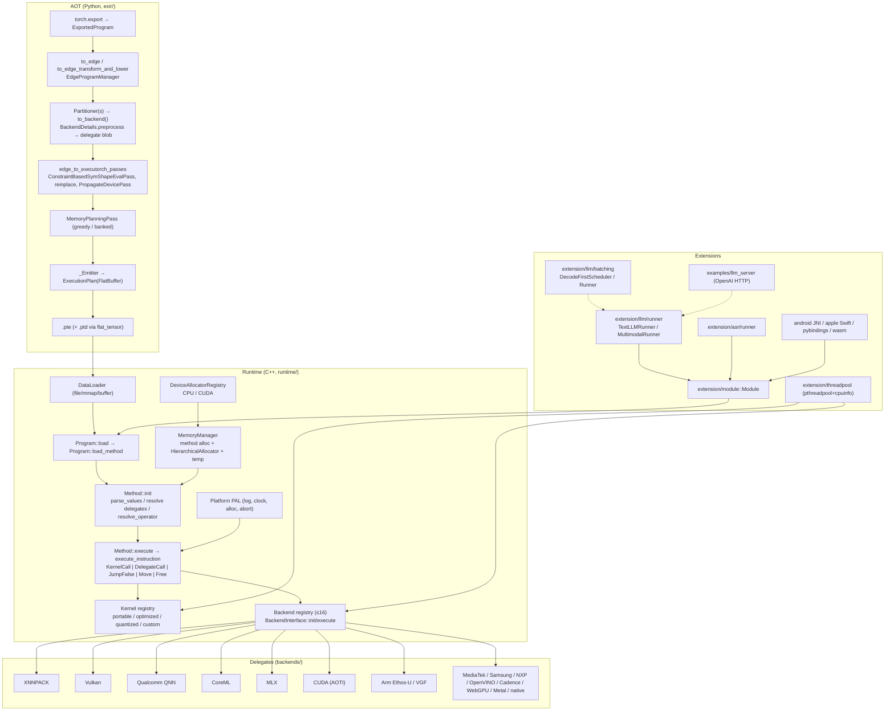
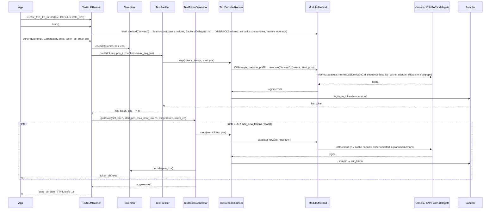
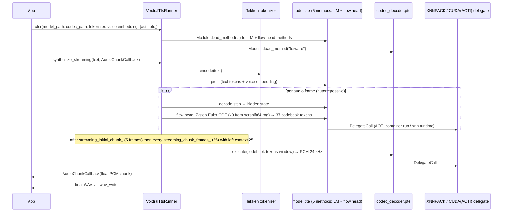

# ExecuTorch (pytorch/executorch) — Engine Analysis

| Field | Value |
|---|---|
| Local path | `/data/zhoutaichang/embedding_infer/executorch` |
| Remote | `https://github.com/pytorch/executorch.git` (origin) |
| Branch | `main` |
| HEAD | `cfc6ecd5166bec70c5fde2bad836fed26018fe52` — "Qualcomm AI Engine Direct - Enable QNN Windows ARM64 build in CI (#22438)", 2026-09-07 23:47 +0800 |
| Declared version | `1.5.0` ([version.txt](../../executorch/version.txt)) |
| Dirty status | clean (`git status --short` empty) |
| Submodules | **all 23 uninitialized** (`git submodule status` shows `-` for every entry), including `extension/llm/tokenizers`, `backends/xnnpack/third-party/{XNNPACK,pthreadpool,cpuinfo,FP16,FXdiv}`, `backends/mlx/third-party/mlx`, `backends/vulkan/third-party/*`, `third-party/{ao,flatbuffers,flatcc,gflags,googletest,json,pocketfft,pybind11,ios-cmake,prelude}`, `kernels/optimized/third-party/eigen`, `shim`, `backends/cadence/utils/FACTO` |
| Analysis date | 2026-09-08 (read-only; no builds, installs or GPU use) |
| Repo guidance followed | [CLAUDE.md](../../executorch/CLAUDE.md) (AGENTS.md is a symlink to it), `.claude/*.md` reference docs, `.wiki/index.md` |

Evidence labels: **[Verified]** read in code/docs at this HEAD; **[Inferred]** reasoned from structure; **[Proposal]** design suggestion; **[Unknown]** not determinable from the tree. Repo-published numbers are labelled "repo-reported, not reproduced".

---

## 0. Summary

- **What it is** [Verified]: ExecuTorch is an *ahead-of-time (AOT) compiler + minimal C++ execution runtime* for PyTorch models. Python side (`exir/`) lowers `torch.export` programs through Edge IR, partitions subgraphs to hardware "delegates" (`to_backend`), plans memory statically, and serializes a FlatBuffer `.pte` ([schema/program.fbs](../../executorch/schema/program.fbs)). The C++ runtime ([runtime/executor/method.cpp](../../executorch/runtime/executor/method.cpp)) walks a linear instruction list per method.
- **Execution runtime, not a serving stack** [Verified]: the core is a single-`Method`, single-thread, sequential interpreter (`Method::execute` loops chains → instructions; comment says "Chains are executed sequentially today"). There is no request queue, batcher or server in `runtime/`.
- **Serving-adjacent layers exist above the core** [Verified]: `extension/llm/runner/` (TextLLMRunner / MultimodalRunner with token callbacks), an experimental `extension/llm/batching/` (`DecodeFirstScheduler`, `Runner`, `Session`, `GenerationHandle` with cancel) and `examples/llm_server/` (OpenAI-compatible Python control plane over JSONL worker binaries). No in-tree class implements `batching::Executor` outside its tests.
- **Backends in tree** [Verified]: XNNPACK, Vulkan, WebGPU, Qualcomm QNN (HTP/GPU/LPAI), MediaTek Neuron, Samsung Exynos (ENN), Arm (Ethos-U via TOSA/Vela, VGF, Cortex-M CMSIS-NN), Cadence DSP, NXP Neutron, OpenVINO, Apple CoreML, Apple Metal (experimental), Apple "Core AI" (under construction), MLX (experimental), CUDA (AOTInductor + Triton; experimental ROCm), a "native" portable delegate, and the AOTI common library. **No `backends/apple/mps` directory exists at this HEAD.**
- **Device model** [Verified]: backend selection happens entirely at export (partitioner). At runtime `BackendDelegate::Init` looks up the delegate by string id in a 16-slot static registry (`kMaxRegisteredBackends = 16`, [runtime/backend/interface.cpp](../../executorch/runtime/backend/interface.cpp#L20)) and calls `is_available()`. There is no runtime device discovery/selection.
- **Memory** [Verified]: static memory planning in Python (`greedy` default, optional banked planning) produces `non_const_buffer_sizes`; the runtime `MemoryManager` = method allocator + `HierarchicalAllocator` (planned arenas, ≤16 spans) + temp allocator. A new `Device{CPU,CUDA}` concept and `DeviceAllocator` registry let planned buffers live in CUDA memory with explicit `_h2d_copy/_d2h_copy` ops inserted at delegate boundaries.
- **Kernels** [Verified]: portable (209 ops in `functions.yaml`), optimized (23), quantized (19), ATen wrapper (225) plus LLM custom ops (`custom_sdpa`, `update_cache`, `quantized_moe_ffn`, `gated_delta_rule`, ...). Kernel table is a static array (default 250 ops × 8 kernels), selective build generates `selected_max_kernel_num.h`.
- **Quantization** [Verified]: torchao source transforms (`8da4w`, `int8`, `4w`, `torchao:8da*`, `torchao:fpa*`) and PT2E quantizers per backend (XNNPACK, QNN, CoreML, Vulkan, OpenVINO, TOSA/Ethos-U/VGF). CUDA backend has int4/5/6/8 packed GEMM shims; MLX has int2/4/8 weight quant.
- **LLM decode loop** [Verified]: `TextPrefiller::prefill` (chunked) → `TextTokenGenerator::generate` → per-token `TextDecoderRunner::step` → `Module::execute("forward"|"decode")` → `Sampler` → tokenizer `decode` → `token_callback`. KV cache is a mutable buffer inside the `.pte` (static, `[B,H,max_context,D]` layout), updated by `update_cache`/`custom_sdpa`.
- **TTS in tree** [Verified]: `examples/models/voxtral_tts` (LM + flow head + codec decoder, 5 methods, CPU/XNNPACK and CUDA, streaming codec chunks with `AudioChunkCallback`) and `examples/models/supertonic` (MLX, 4 methods incl. `vocoder`, dynamic FP16). Mimi codec on QNN under `examples/qualcomm/oss_scripts/moshi`. Audio front end: `extension/audio/mel_spectrogram.py` (exportable Whisper mel), `extension/asr/runner` (seq2seq + transducer), `extension/llm/runner/audio.h`.
- **VLA in tree** [Verified]: none. No OpenVLA/pi0/LeRobot/diffusion-policy/proprioceptive references anywhere. Vision encoders exist for VLMs (LLaVA, Llama 3.2 Vision, Gemma3, SmolVLM, InternVL3) via `MultimodalRunner` with `vision_encoder`/`token_embedding`/`text_decoder` method naming.
- **Edge profile** [Verified]: core runtime CI thresholds ~45–52 KB stripped (Linux gcc/clang size_test), ~118 KB bare-metal Cortex-M / ~136 KB Zephyr all-in; CMake presets for android-arm64-v8a, ios, macos, linux, windows, arm-baremetal, arm-ethosu-linux, esp-baremetal, riscv64-linux, zephyr, llm-release-{cuda,rocm,metal}, mlx-release. Android AAR (Maven), iOS xcframeworks (SwiftPM), Python wheels incl. aarch64 CUDA wheels.
- **Jetson** [Unknown]: no explicit Jetson/Orin documentation; an aarch64-Linux CUDA wheel workflow exists ([.github/workflows/build-wheels-cuda-aarch64-linux.yml](../../executorch/.github/workflows/build-wheels-cuda-aarch64-linux.yml)), so aarch64+CUDA is at least built.
- **Tokenizers** [Verified]: C++ tokenizers (HF JSON, Tiktoken, SentencePiece, Llama2c, Tekken) live in the `extension/llm/tokenizers` submodule, which is **not checked out here**; only the `.claude/tokenizers.md` summary and call sites could be inspected.

---

## 1. Architecture overview

**Key modules**

| Module | Path | Responsibility | Key symbols |
|---|---|---|---|
| Export IR | [exir/program/_program.py](../../executorch/exir/program/_program.py) | `to_edge`, `to_edge_transform_and_lower`, `EdgeProgramManager.to_backend/to_executorch`, `ExecutorchProgramManager.buffer/save` | `to_edge` (L1414), `EdgeProgramManager` (L1496), `ExecutorchProgramManager` (L1823) |
| Backend API | [exir/backend/backend_api.py](../../executorch/exir/backend/backend_api.py), [exir/backend/partitioner.py](../../executorch/exir/backend/partitioner.py), [exir/backend/backend_details.py](../../executorch/exir/backend/backend_details.py) | Partition + preprocess into delegate blobs | `to_backend` (singledispatch), `Partitioner.partition`, `BackendDetails.preprocess/preprocess_multimethod`, `PreprocessResult` |
| Memory planning | [exir/memory_planning.py](../../executorch/exir/memory_planning.py), [exir/banked_memory_planning.py](../../executorch/exir/banked_memory_planning.py) | Lifetime analysis, arena assignment | `greedy`, `naive`, `MemoryPlanningAlgorithmSuite`, `_partition_specs_by_device`, `TargetMemoryMap` |
| Config | [exir/capture/_config.py](../../executorch/exir/capture/_config.py) | Export/backend knobs | `EdgeCompileConfig`, `ExecutorchBackendConfig` |
| Emitter | [exir/emit/_emitter.py](../../executorch/exir/emit/_emitter.py) | FX → FlatBuffer instructions | `_Emitter`, `_TopLevelEmitter` |
| Schema | [schema/program.fbs](../../executorch/schema/program.fbs) | `.pte` file format | `Program`, `ExecutionPlan`, `Chain`, `KernelCall`, `DelegateCall`, `NonConstBufferDevice` |
| Program/Method | [runtime/executor/program.h](../../executorch/runtime/executor/program.h), [runtime/executor/method.cpp](../../executorch/runtime/executor/method.cpp) | Load, init, execute | `Program::load/load_method`, `Method::init/execute/step/set_input/get_outputs`, `BackendDelegate` |
| Memory | [runtime/executor/memory_manager.h](../../executorch/runtime/executor/memory_manager.h), [runtime/core/hierarchical_allocator.h](../../executorch/runtime/core/hierarchical_allocator.h), [runtime/core/memory_allocator.h](../../executorch/runtime/core/memory_allocator.h) | Arena allocators | `MemoryManager`, `HierarchicalAllocator::get_offset_address`, `MemoryAllocator` |
| Device memory | [runtime/core/device_allocator.h](../../executorch/runtime/core/device_allocator.h), [runtime/core/device_memory_buffer.h](../../executorch/runtime/core/device_memory_buffer.h), [runtime/core/portable_type/device.h](../../executorch/runtime/core/portable_type/device.h) | Non-CPU planned buffers | `DeviceAllocator`, `DeviceAllocatorRegistry`, `DeviceMemoryBuffer`, `Device{CPU,CUDA}` |
| Backend registry | [runtime/backend/interface.h](../../executorch/runtime/backend/interface.h) | Delegate ABI | `BackendInterface::{is_available,init,execute,set_option,get_option,destroy}`, `register_backend` |
| Kernel registry | [runtime/kernel/operator_registry.h](../../executorch/runtime/kernel/operator_registry.h) | Op → kernel resolution | `Kernel`, `KernelKey`, `register_kernels`, `get_op_function_from_registry` |
| PAL | [runtime/platform/platform.h](../../executorch/runtime/platform/platform.h) | OS abstraction | `et_pal_init/abort/current_ticks/emit_log_message/allocate/free`, `PalImpl` |
| Kernels | [kernels/portable/functions.yaml](../../executorch/kernels/portable/functions.yaml), [kernels/optimized/optimized.yaml](../../executorch/kernels/optimized/optimized.yaml), [kernels/quantized/quantized.yaml](../../executorch/kernels/quantized/quantized.yaml) | CPU op libraries | YAML op defs + `kernels/*/cpu/op_*.cpp` |
| Selective build | [tools/cmake/Codegen.cmake](../../executorch/tools/cmake/Codegen.cmake), [codegen/gen.py](../../executorch/codegen/gen.py) | Generate registration for selected ops | `gen_selected_ops`, `EXECUTORCH_SELECT_OPS_*` |
| Module API | [extension/module/module.h](../../executorch/extension/module/module.h) | Convenience wrapper | `Module::{load_method,execute,forward,set_input,set_output,method_meta}`, `LoadMode` |
| LLM runner | [extension/llm/runner/](../../executorch/extension/llm/runner/README.md) | Prefill/decode loop | `IRunner`, `TextLLMRunner`, `TextPrefiller`, `TextDecoderRunner`, `TextTokenGenerator`, `IOManager`, `MultimodalRunner`, `MultimodalPrefiller`, `LLMSession`, `LLMEngine` |
| LLM batching | [extension/llm/batching/](../../executorch/extension/llm/batching/runner.h) | Experimental multi-session scheduler | `Scheduler`, `DecodeFirstScheduler`, `Executor`, `Runner`, `Session`, `GenerationHandle` |
| LLM cache | [extension/llm/cache/](../../executorch/extension/llm/cache/cache.h) | Off-graph KV cache abstractions | `CacheBase`, `SequenceCache`, `CellCache`, `RingPolicy`, `kvcache::update_and_attend` |
| Custom ops | [extension/llm/custom_ops/custom_ops.py](../../executorch/extension/llm/custom_ops/custom_ops.py) | LLM kernels | `sdpa_with_kv_cache`, `custom_sdpa`, `update_cache`, `quantized_moe_ffn`, `gated_delta_rule` |
| Threadpool | [extension/threadpool/threadpool.h](../../executorch/extension/threadpool/threadpool.h), [runtime/kernel/thread_parallel_interface.h](../../executorch/runtime/kernel/thread_parallel_interface.h) | CPU parallelism | `ThreadPool`, `get_threadpool`, `get_pthreadpool`, `parallel_for` |
| Devtools | [devtools/etdump/](../../executorch/devtools/etdump/etdump_flatcc.h), [devtools/inspector/_inspector.py](../../executorch/devtools/inspector/_inspector.py), [devtools/bundled_program/](../../executorch/devtools/bundled_program/bundled_program.h) | Profiling / debugging | ETDump, `Inspector`, bundled program |

---

## 2. Device layer

### 2.1 Backends actually in tree [Verified]

Every backend registers itself with `register_backend(...)` into a static 16-entry table ([runtime/backend/interface.cpp](../../executorch/runtime/backend/interface.cpp#L20), `kMaxRegisteredBackends = 16`, with a TODO noting global statics prevent multiple executors). Registration sites:

| Backend id / dir | Registration | Hardware / OS | Status note |
|---|---|---|---|
| XNNPACK — [backends/xnnpack](../../executorch/backends/xnnpack/README.md) | [XNNPACKBackend.cpp#L272](../../executorch/backends/xnnpack/runtime/XNNPACKBackend.cpp#L272) | ARM64/ARMv7/x86 CPU on Android, iOS, macOS, Linux, Windows ([xnnpack-overview.md](../../executorch/docs/source/backends/xnnpack/xnnpack-overview.md)); KleidiAI via `EXECUTORCH_XNNPACK_ENABLE_KLEIDI` ([CMakeLists.txt#L34](../../executorch/backends/xnnpack/CMakeLists.txt#L34)) | default CPU delegate |
| Vulkan — [backends/vulkan](../../executorch/backends/vulkan/README.md) | [VulkanBackend.cpp#L931](../../executorch/backends/vulkan/runtime/VulkanBackend.cpp#L931) | Android GPUs (Adreno/Mali/PowerVR noted in wiki), desktop experimental | mature on Android |
| WebGPU — [backends/webgpu](../../executorch/backends/webgpu/README.md) | [WebGPUBackend.cpp#L263](../../executorch/backends/webgpu/runtime/WebGPUBackend.cpp#L263) | Dawn/Tint WGSL; browser via Emscripten, native Metal/Vulkan | under active development |
| Qualcomm QNN — [backends/qualcomm](../../executorch/backends/qualcomm/README.md) | [QnnExecuTorchBackend.cpp#L394](../../executorch/backends/qualcomm/runtime/QnnExecuTorchBackend.cpp#L394) | HTP / GPU / LPAI; 38 chipset enum entries in [qc_schema.py](../../executorch/backends/qualcomm/serialization/qc_schema.py) (`QcomChipset`) | no BC guarantees stated |
| MediaTek Neuron — [backends/mediatek](../../executorch/backends/mediatek/README.md) | [NeuronBackend.cpp#L261](../../executorch/backends/mediatek/runtime/NeuronBackend.cpp#L261) | Dimensity 9300/9400 NPU | |
| Samsung Exynos — [backends/samsung](../../executorch/backends/samsung/README.md) | [enn_backend.cpp#L96](../../executorch/backends/samsung/runtime/enn_backend.cpp#L96) | Exynos 2500 NPU/DSP (`EXECUTORCH_BUILD_ENN`) | |
| Arm Ethos-U — [backends/arm](../../executorch/backends/arm/README.md) | [EthosUBackend.cpp#L451](../../executorch/backends/arm/runtime/EthosUBackend.cpp#L451) | Ethos-U55/65/85 via TOSA → Vela | bare-metal |
| Arm VGF — same dir | [VGFBackend.cpp#L803](../../executorch/backends/arm/runtime/VGFBackend.cpp#L803) | Vulkan ML extensions (SPIR-V ML) | |
| Arm Cortex-M — [backends/cortex_m](../../executorch/backends/cortex_m/README.md) | not a delegate: an operator dialect (`cortex_m::*`) on CMSIS-NN with portable fallback | Cortex-M MCUs | Beta |
| Cadence — [backends/cadence](../../executorch/backends/cadence/README.md) | no delegation; custom ops for HiFi4/FusionG3/Vision DSP (see wiki "No-delegation architecture") | Xtensa DSP | |
| NXP Neutron — [backends/nxp](../../executorch/backends/nxp/README.md) | [NeutronBackend.cpp#L676](../../executorch/backends/nxp/runtime/NeutronBackend.cpp#L676) | eIQ Neutron NPU (i.MX) | |
| OpenVINO — [backends/openvino](../../executorch/backends/openvino/README.md) | [OpenvinoBackend.cpp#L419](../../executorch/backends/openvino/runtime/OpenvinoBackend.cpp#L419) | Intel CPU / iGPU / dGPU / NPU | |
| Apple CoreML — [backends/apple/coreml](../../executorch/backends/apple/coreml/README.md) | [coreml_backend_delegate.mm#L438](../../executorch/backends/apple/coreml/runtime/delegate/coreml_backend_delegate.mm#L438) | iOS/macOS ANE/GPU/CPU (compute units via compile spec) | |
| Apple Metal — [backends/apple/metal](../../executorch/backends/apple/metal/README.md) | [metal_backend.cpp#L696](../../executorch/backends/apple/metal/runtime/metal_backend.cpp#L696) | AOTI-driven Metal | "EXPERIMENTAL" |
| Apple Core AI — [backends/apple/coreai](../../executorch/backends/apple/coreai/README.md) | Python only at this HEAD | | "Under construction — not for use" |
| MLX — [backends/mlx](../../executorch/backends/mlx/README.md) | [MLXBackend.cpp#L570](../../executorch/backends/mlx/runtime/MLXBackend.cpp#L570) | Apple Silicon GPU, macOS ≥ 14, iOS ≥ 17 experimental ([mlx-overview.md](../../executorch/docs/source/backends/mlx/mlx-overview.md)) | experimental |
| CUDA — [backends/cuda](../../executorch/backends/cuda/cuda_backend.py) | [cuda_backend.cpp#L1429](../../executorch/backends/cuda/runtime/cuda_backend.cpp#L1429) | NVIDIA Linux/Windows via AOTInductor + Triton; ROCm experimental ([rocm.md](../../executorch/backends/cuda/rocm.md)) | |
| AOTI common — [backends/aoti](../../executorch/backends/aoti/README.md) | library, not a backend | shared shims for CUDA/Metal | |
| native — [backends/native](../../executorch/backends/native/preprocess.py) | `NativeBackend` serializes an fx subgraph to a generic flatbuffer executed by [backends/native/runtime/Program.h](../../executorch/backends/native/runtime/Program.h) | portable | new |
| example/test — [backends/example](../../executorch/backends/example/README.md), [backends/test](../../executorch/backends/test/README.md) | reference delegate + test harness | | |

Reference table also in [.claude/backends.md](../../executorch/.claude/backends.md) and [docs/source/backends-overview.md](../../executorch/docs/source/backends-overview.md).

### 2.2 Device discovery / selection [Verified]

- **AOT**: the user chooses the target by passing a `Partitioner` to `to_backend()`/`to_edge_transform_and_lower()`. Multiple partitioners are applied in priority order; unmatched ops stay as `KernelCall`s for the CPU kernel library ([.claude/backends.md](../../executorch/.claude/backends.md)).
- **Runtime**: `BackendDelegate::Init` ([method.cpp#L61](../../executorch/runtime/executor/method.cpp#L61)) does `get_backend_class(backend_id)` then `backend->is_available()` and fails with `NotFound` if either check fails. There is no fallback to another backend at runtime and no enumeration of physical devices. Backend-specific selection (e.g., CoreML compute units, QNN SoC/HTP arch, CUDA graph enable) is carried in `CompileSpec`s embedded in the `.pte` and parsed in `init` (e.g., [coreml_backend_delegate.mm#L278](../../executorch/backends/apple/coreml/runtime/delegate/coreml_backend_delegate.mm#L278), `kEnableCudaGraphForMethod` in [cuda_backend.cpp#L85](../../executorch/backends/cuda/runtime/cuda_backend.cpp#L85)).
- Runtime knobs can be pushed to a backend by name with `set_option(backend_name, Span<BackendOption>)` ([interface.h](../../executorch/runtime/backend/interface.h)); a `BackendOptionsMap` can be passed at `load_method` time.

### 2.3 Memory allocation / pools [Verified]

- `MemoryManager(method_allocator, planned_memory, temp_allocator)` ([memory_manager.h](../../executorch/runtime/executor/memory_manager.h)); method and temp allocator must differ. `planned_memory` is a `HierarchicalAllocator` over `Span<Span<uint8_t>>` — one span per `mem_id`, hard cap `kSpanArraySize = 16` for the deprecated constructor; `get_offset_address(memory_id, offset, size)` with overflow checks ([hierarchical_allocator.h](../../executorch/runtime/core/hierarchical_allocator.h)).
- Sizes come from `ExecutionPlan.non_const_buffer_sizes` ([program.fbs#L368](../../executorch/schema/program.fbs#L368)); the app must allocate those arenas. `Method::resolve_operator` uses temp allocator (falls back to method allocator) for `TensorMeta` scratch ([method.cpp#L731](../../executorch/runtime/executor/method.cpp#L731)).
- Temp allocator is reset after each instruction and at the start of `execute()` ([method.cpp#L1697](../../executorch/runtime/executor/method.cpp#L1697)) — kernels get per-op scratch.
- Planning algorithms: `greedy` (default, allows overlapping lifetimes), `naive`, `MemoryPlanningAlgorithmSuite` picks the minimum total; `banked_memory_planning.TargetMemoryMap` adds capacity-aware placement across memory banks with spill ([banked_memory_planning.py](../../executorch/exir/banked_memory_planning.py)). Mutable buffers (KV caches) are placeholders that are "never freed" ([memory_planning.py#L492](../../executorch/exir/memory_planning.py#L492)) and are planned only if `alloc_mutable_buffers`.
- Inputs/outputs: if not memory-planned, `Method::set_input` aliases user memory (`share_tensor_data`) instead of copying; otherwise `copy_tensor_data` after `resize_tensor` ([method.cpp#L1146](../../executorch/runtime/executor/method.cpp#L1146)); `set_output_data_ptr` lets the caller supply output buffers.

### 2.4 Host ↔ device transfers [Verified]

- `Device{type: CPU|CUDA, index}` ([device.h](../../executorch/runtime/core/portable_type/device.h)); `DeviceAllocator` has `allocate/deallocate/copy_host_to_device/copy_device_to_host`; `DeviceAllocatorRegistry` holds one allocator per device type; `DeviceMemoryBuffer::create(size, type)` RAII ([device_allocator.h](../../executorch/runtime/core/device_allocator.h), [device_memory_buffer.h](../../executorch/runtime/core/device_memory_buffer.h)).
- `ExecutionPlan.non_const_buffer_device: [NonConstBufferDevice]` marks planned arenas on CUDA ([program.fbs#L417](../../executorch/schema/program.fbs#L417)); `MemoryManager::has_device_memory()` exposes this.
- At export, `ExecutorchBackendConfig.enable_non_cpu_memory_planning=True` (default) partitions specs by device (`_partition_specs_by_device`) and `PropagateDevicePass` inserts `_h2d_copy`/`_d2h_copy` ops at delegate boundaries ([_config.py#L126](../../executorch/exir/capture/_config.py#L126), [propagate_device_pass.py](../../executorch/exir/passes/propagate_device_pass.py), [_device_copy_ops_registry.py#L27](../../executorch/exir/passes/_device_copy_ops_registry.py#L27)).
- CUDA backend auto-registers `CudaAllocator` ([cuda_backend.cpp#L1431](../../executorch/backends/cuda/runtime/cuda_backend.cpp#L1431), [cuda_allocator.h](../../executorch/backends/cuda/runtime/cuda_allocator.h)) and uses `cudaMemcpyAsync` device-to-device for CUDA-graph static I/O staging ([cuda_backend.cpp#L574](../../executorch/backends/cuda/runtime/cuda_backend.cpp#L574)).
- Other delegates copy internally (XNNPACK: `xnn_setup_runtime_v2` on external tensors; Vulkan: `maybe_resize_input`/staging in [VulkanBackend.cpp#L529](../../executorch/backends/vulkan/runtime/VulkanBackend.cpp#L529); QNN: `RegisterMem`/`PreRegisterMem` shared buffers and rpcmem in [QnnManager.h#L89](../../executorch/backends/qualcomm/runtime/QnnManager.h#L89), [rpc_mem.h](../../executorch/examples/qualcomm/oss_scripts/llama/runner/rpc_mem.h)).

### 2.5 Synchronization / streams [Verified]

- Core runtime is synchronous: every `KernelCall`/`DelegateCall` returns before the next instruction. No stream abstraction in `runtime/`.
- CUDA backend: optional CUDA-graph capture per method (`CudaGraphPhase::{Warmup,Replay,Disabled}`, `kCudaGraphWarmupSteps`, `cudaGraphLaunch` on a stream — [cuda_backend.cpp#L434](../../executorch/backends/cuda/runtime/cuda_backend.cpp#L434)); enable with compile-spec `enable_cuda_graph_for_method`. Unavailable on ROCm ([rocm.md](../../executorch/backends/cuda/rocm.md)).
- Vulkan: `ComputeGraph::submit_current_cmd[_and_wait]`, `submit_deferred_cmds_and_wait`, `prepack`, `optional_warmup_execute`, `propagate_resize` ([ComputeGraph.h#L1103](../../executorch/backends/vulkan/runtime/graph/ComputeGraph.h#L1103)).
- MLX: `async_eval` with keep-alive of input data ([MLXBackend.cpp#L94](../../executorch/backends/mlx/runtime/MLXBackend.cpp#L94)).

### 2.6 Portability [Verified]

- PAL functions are weak symbols (`ET_INTERNAL_PLATFORM_WEAKNESS`) or a `PalImpl` table ([platform.h](../../executorch/runtime/platform/platform.h)); defaults in `runtime/platform/default`. Examples of custom PALs: Arduino ([examples/arduino/arduino_pal.cpp](../../executorch/examples/arduino/arduino_pal.cpp)), Zephyr ([zephyr/](../../executorch/zephyr)), CUDA ([backends/cuda/runtime/platform/platform.cpp](../../executorch/backends/cuda/runtime/platform/platform.cpp)).
- Build presets ([CMakePresets.json](../../executorch/CMakePresets.json)): `android-arm64-v8a`, `android-x86_64`, `macos`, `ios`, `ios-simulator`, `linux`, `windows`, `pybind`, `zephyr`, `arm-baremetal`, `arm-ethosu-linux`, `esp-baremetal`, `riscv64-linux`, `llm`, `llm-release[-cuda|-rocm|-metal]`, `llm-debug[-cuda|-metal|-vulkan]`, `mlx[-release|-debug]`, `profiling`.
- Host OS for building: Linux x86_64, macOS x86_64/ARM64, Windows 10+ (VS2022 + Clang-CL) or WSL ([using-executorch-building-from-source.md](../../executorch/docs/source/using-executorch-building-from-source.md)).

---

## 3. Kernel layer

### 3.1 Operator set & registration [Verified]

- Op definitions are YAML (`- op:`/`- func:` entries): portable 209 ([functions.yaml](../../executorch/kernels/portable/functions.yaml)) + 2 custom ([custom_ops.yaml](../../executorch/kernels/portable/custom_ops.yaml)); optimized 23 ([optimized.yaml](../../executorch/kernels/optimized/optimized.yaml) — `op_add/bmm/div/elu/exp/fft_*/gelu/grid_sampler_2d/le/linear/log_softmax/mm/mul/native_layer_norm/sub/sum/where`); quantized 19 ([quantized.yaml](../../executorch/kernels/quantized/quantized.yaml)); ATen wrapper 225 ([kernels/aten/functions.yaml](../../executorch/kernels/aten/functions.yaml)); prim ops (`et_copy_index`, `et_view`, sym ops) in [kernels/prim_ops/register_prim_ops.cpp](../../executorch/kernels/prim_ops/register_prim_ops.cpp).
- Codegen ([codegen/gen.py](../../executorch/codegen/gen.py), [codegen/templates](../../executorch/codegen/templates)) emits `Kernel{name, KernelKey, OpFunction}` arrays registered via `register_kernels(Span<const Kernel>)` ([operator_registry.h#L179](../../executorch/runtime/kernel/operator_registry.h#L179)). `KernelKey` encodes dtype/dim-order per tensor arg (`kKernelKeyBufSize = 659`); a null key is the fallback kernel.
- Table capacity: `MAX_KERNEL_NUM` → `EXECUTORCH_SELECTED_MAX_KERNEL_NUM` (generated by selective build) → default `250 ops × 8 kernels` ([operator_registry.cpp#L30](../../executorch/runtime/kernel/operator_registry.cpp#L30)). Duplicate registration aborts (see [.claude/faq.md](../../executorch/.claude/faq.md)).
- Portable kernels must use ExecuTorch types (`executorch::aten::Tensor`, no `at::Tensor`) — [kernels/README.md](../../executorch/kernels/README.md).

### 3.2 Dispatch [Verified]

- At `Method::init`, each `KernelCall` instruction is resolved once: `resolve_operator` builds `TensorMeta` for the args and calls `get_op_function_from_registry(name, meta_list)`; the resulting `OpFunction` pointer is stored in `chain.kernels_[instr]` ([method.cpp#L731](../../executorch/runtime/executor/method.cpp#L731), [#L1040](../../executorch/runtime/executor/method.cpp#L1040)).
- At `execute_instruction`, `KernelCall` invokes `chain.kernels_[idx](context, args)` with a `KernelRuntimeContext(event_tracer, temp_allocator)`; `DelegateCall` invokes `delegates_[idx].Execute(BackendExecutionContext, args)`; `JumpFalseCall`, `MoveCall`, `FreeCall` implement control flow, aliasing and explicit frees ([method.cpp#L1450](../../executorch/runtime/executor/method.cpp#L1450)).
- Routing to a backend is therefore decided *entirely at export*: an op either became part of a delegate blob (`executorch_call_delegate` → `DelegateCall`) or stays a CPU `KernelCall`. There is no runtime per-op dispatcher across backends.
- When the `Method` is loaded with an explicit `kernel_registry` span, resolution uses that list instead of the global table ([method.h](../../executorch/runtime/executor/method.h) `Span<const Kernel> kernel_registry_`).

### 3.3 Quantization formats & where dequant happens [Verified]

- **LLM source transforms** ([quantize.py](../../executorch/examples/models/llama/source_transformation/quantize.py)): `int8` (weight-only), `8da4w`/`8da8w` (int8 dynamic act + int4/int8 weight, torchao `Int8DynamicActivationIntxWeightConfig`), `4w`, `torchao:8da*` and `torchao:fpa*` low-bit kernels for Arm, embedding quant `4,32` etc. Config in [llm_config.py](../../executorch/extension/llm/export/config/llm_config.py) (`QuantizationConfig.qmode`, `pt2e_quantize`, `use_qat`, `use_spin_quant`, `preq_mode` values `8da4w` and `8da4w_output_8da8w`). SpinQuant R1/R2 rotations: [apply_spin_quant_r1_r2.py](../../executorch/examples/models/llama/source_transformation/apply_spin_quant_r1_r2.py).
- **KV-cache quant**: `QuantizedKVCache` (int8 per-token, `QuantizedCacheType`), `StaticQuantizedKVCache` with calibration, `QuantizedRingKVCache`, `CustomKVCacheWithAttentionSink` ([custom_kv_cache.py](../../executorch/examples/models/llama/source_transformation/custom_kv_cache.py)); `QuantizedSDPA` consumes int8 caches ([sdpa.py#L104](../../executorch/examples/models/llama/source_transformation/sdpa.py#L104)). Dequant happens inside `custom_quantized_sdpa`/XNNPACK kernels at runtime.
- **PT2E quantizers** ([quantizer_lib.py](../../executorch/extension/llm/export/quantizer_lib.py)): XNNPACK ([xnnpack_quantizer.py](../../executorch/backends/xnnpack/quantizer/xnnpack_quantizer.py)), QNN (`get_qnn_quantizer`, 8a8w/16a4w/16a8w — see wiki [recipes.md](../../executorch/.wiki/quantization/recipes.md)), CoreML, Vulkan, OpenVINO, TOSA/Ethos-U/VGF, Cortex-M `CortexMQuantizer`. Q/DQ nodes are fused into the delegate blob by the backend's preprocess; ops that stay on CPU run `quantized_decomposed::*` kernels from [kernels/quantized](../../executorch/kernels/quantized/quantized.yaml) (see `quant_fusion_pass.py` in [exir/passes](../../executorch/exir/passes/quant_fusion_pass.py)).
- **GPU**: CUDA int4 tile-packed (`tile_packed_to_4d`, `_weight_int4pack_mm`) plus int5/int6/int8 planar GEMM shims ([backends/cuda/runtime/shims](../../executorch/backends/cuda/runtime/shims/int4mm.cuh), [quantize_op_dispatch](../../executorch/backends/cuda/quantize_op_dispatch/int4_dispatch.py)); MLX INT2/4/8 weight quant via torchao ([mlx-overview.md](../../executorch/docs/source/backends/mlx/mlx-overview.md)); WebGPU 4-bit weight-only, 8da4w, q8ta ([webgpu README](../../executorch/backends/webgpu/README.md)). Also `extension/llm/export/{int4,mx,nvfp4,gguf}.py` for GGUF loading, MX and NVFP4 formats.

### 3.4 Compilation / JIT / graph capture [Verified]

- Everything is AOT: `torch.export` → `to_edge` (ATen→Edge dialect, decompositions, dim-order) → partition/preprocess → `to_executorch` (passes incl. `ConstraintBasedSymShapeEvalPass`, `reinplace`, `MemoryPlanningPass`, `ToOutVarPass`) → emit. No JIT at runtime.
- Delegate compilers: XNNPACK builds an `xnn_subgraph` at `init` (`xnn_create_runtime_v4` with pthreadpool, weights cache, workspace — [XNNCompiler.cpp#L2296](../../executorch/backends/xnnpack/runtime/XNNCompiler.cpp#L2296)); Vulkan builds `ComputeGraph` from a flatbuffer, prepacks and optionally warms up ([VulkanBackend.cpp#L676](../../executorch/backends/vulkan/runtime/VulkanBackend.cpp#L676)); QNN loads precompiled context binaries (or online-prepare) via `QnnManager::Compile` ([QnnManager.h#L85](../../executorch/backends/qualcomm/runtime/QnnManager.h#L85)); CoreML compiles/caches `.mlmodelc` at first load; CUDA `dlopen`s the AOTInductor `.so` from the `.ptd` and calls `AOTInductorModelContainerCreateWithDevice/Run` ([cuda_backend.cpp#L164](../../executorch/backends/cuda/runtime/cuda_backend.cpp#L164)); MLX interprets its own flatbuffer bytecode ([backends/mlx/serialization](../../executorch/backends/mlx/serialization)).

### 3.5 Fallback path [Verified]

- Unsupported ops simply remain `KernelCall`s to the portable/optimized CPU kernels ([backends-overview.md](../../executorch/docs/source/backends-overview.md): "Operators not supported by the delegate are executed using the portable CPU fallback"). If the CPU kernel is also missing (selective build), `Method::init` fails with `OperatorMissing` (0x14) ([.claude/faq.md](../../executorch/.claude/faq.md)). Cortex-M's dialect explicitly relies on portable-ops fallback ([cortex_m/README.md](../../executorch/backends/cortex_m/README.md)).
- `extension/llm/custom_ops/op_fallback.cpp` provides an AOT-side fallback op ([op_fallback.py](../../executorch/extension/llm/custom_ops/op_fallback.py)).

### 3.6 Extension points [Verified]

- **Custom op**: define via `torch.library` (see [custom_ops.py](../../executorch/extension/llm/custom_ops/custom_ops.py)), implement an `out`-variant C++ kernel using ExecuTorch tensors, register with `EXECUTORCH_LIBRARY` / YAML + codegen (`gen_selected_ops`, [Codegen.cmake](../../executorch/tools/cmake/Codegen.cmake)); docs [kernel-library-custom-aten-kernel.md](../../executorch/docs/source/kernel-library-custom-aten-kernel.md), [examples/portable/custom_ops](../../executorch/examples/portable/custom_ops).
- **Custom backend**: Python `BackendDetails.preprocess(edge_program, compile_specs) -> PreprocessResult` + a `Partitioner` returning `PartitionResult` ([backend_details.py#L53](../../executorch/exir/backend/backend_details.py#L53), [partitioner.py#L37](../../executorch/exir/backend/partitioner.py#L37)); C++ `BackendInterface` subclass + `static auto _ = register_backend({"Id", &instance})`; template in [docs/source/backends/template](../../executorch/docs/source/backends/template) and the [backends/example](../../executorch/backends/example/README.md) reference delegate. Multi-method delegates via `preprocess_multimethod` and `MethodProgramsPartitionerSpec` ([backend_api.py#L664](../../executorch/exir/backend/backend_api.py#L664)).
- **Custom memory planning**: pass your own `MemoryPlanningPass`/algorithm list or custom `mem_id` pools ([compiler-memory-planning.md](../../executorch/docs/source/compiler-memory-planning.md)).
- **Custom passes**: `EdgeProgramManager.transform(passes)` and `ExecutorchBackendConfig.passes` ([compiler-custom-compiler-passes.md](../../executorch/docs/source/compiler-custom-compiler-passes.md)).

---

## 4. Model runner

### 4.1 Loading / export / conversion pipeline [Verified]

- Formats: `.pte` (FlatBuffer program with inline or segmented constants and delegate blobs; extended header in [schema/extended_header.h](../../executorch/schema/extended_header.h); [pte-file-format.md](../../executorch/docs/source/pte-file-format.md)); `.ptd` external tensor files (`extension/flat_tensor`, `FlatTensorDataMap`; [ptd-file-format.md](../../executorch/docs/source/ptd-file-format.md)) used for external constants (`ExecutorchBackendConfig.external_constants`), CUDA AOTI blobs (`aoti_cuda_blob.ptd`), Whisper weights, LoRA adapters.
- Export API: `to_edge_transform_and_lower(ep, partitioner=[...], transform_passes=..., compile_config=EdgeCompileConfig)` then `.to_executorch(ExecutorchBackendConfig)` and `.buffer`/`.save()` ([_program.py#L1280](../../executorch/exir/program/_program.py#L1280)). Also `executorch.export` recipe API ([export/](../../executorch/export)).
- LLM export: `python -m executorch.extension.llm.export.export_llm` (Hydra/YAML `LlmConfig`: `base`, `model`, `export`, `quantization`, `backend`, `debug`) → [export_llm.py](../../executorch/extension/llm/export/export_llm.py) → [export_llama_lib.py](../../executorch/examples/models/llama/export_llama_lib.py) → `LLMEdgeManager` in [builder.py](../../executorch/extension/llm/export/builder.py). Model classes in `ModelType` (stories110m, llama2/3/3_1/3_2, llama3_2_vision, static_llama, qwen2_5*, qwen3*, qwen3_5*, phi_4_mini, smollm2, lfm2*). HF models via *optimum-executorch* (out of tree; [export-llm-optimum.md](../../executorch/docs/source/llm/export-llm-optimum.md)). QNN LLMs use a separate path [examples/qualcomm/oss_scripts/llama/llama.py](../../executorch/examples/qualcomm/oss_scripts/llama/llama.py) (wiki warns against `export_llama --qnn`, [model-specific.md](../../executorch/.wiki/export/model-specific.md)).
- Loading: `DataLoader` variants (`FileDataLoader`, `MmapDataLoader` with mlock/madvise, `BufferDataLoader`, `FileDescriptorDataLoader` — [extension/data_loader](../../executorch/extension/data_loader/mmap_data_loader.h)); `Module::LoadMode {File, Mmap, MmapUseMlock, MmapUseMlockIgnoreErrors, MmapUseMadvise}` ([module.h#L50](../../executorch/extension/module/module.h#L50)); LLM runner default `MmapUseMlockIgnoreErrors` ([llm_runner_helper.h#L106](../../executorch/extension/llm/runner/llm_runner_helper.h#L106)).

### 4.2 Execution lifecycle [Verified]

1. `Program::load(loader, Verification)` → header check, optional flatbuffer verification ([program.h#L97](../../executorch/runtime/executor/program.h#L97)).
2. `Program::load_method(name, MemoryManager*, EventTracer*, NamedDataMap*)` → `Method::init`: `parse_values` (materialize `values_` table, tensors pointing into planned arenas / constant segments / external `.ptd` data), allocate and `BackendDelegate::Init` each delegate (calls `backend->init` → `DelegateHandle*`), `resolve_operator` for every `KernelCall` ([method.cpp#L883](../../executorch/runtime/executor/method.cpp#L883)).
3. `Method::set_input(s)` (resize + copy or alias) → `Method::execute()` (checks all inputs set, resets temp allocator, sequentially runs all chains/instructions, guards against >`ET_MAX_INSTRUCTIONS`=10 M, then `reset_execution`) → `Method::get_outputs` (shallow copies) ([method.cpp#L1697](../../executorch/runtime/executor/method.cpp#L1697)).
4. Alternative: `Method::step()` executes one instruction (experimental; used by devtools/debuggers), `reset_execution()` after `EndOfMethod`.
5. **Warmup**: no core warmup phase; `TextLLMRunner::warmup(prompt, max_new_tokens)` runs a throwaway generation ([text_llm_runner.h#L146](../../executorch/extension/llm/runner/text_llm_runner.h#L146)); Vulkan `optional_warmup_execute`; CUDA-graph warmup steps.
6. Multiple `Method`s per program (e.g., `encoder`, `text_decoder`, `prefill`, `decode`, `vision_encoder`, `token_embedding`, TTS `duration_predictor/text_encoder/vector_estimator/vocoder`) are loaded independently, each with its own planned memory; a global `MergedDataMap` lets them share `.ptd` constants.

### 4.3 Dynamic shapes [Verified]

- Export with `torch.export.Dim` dynamic shapes; `ConstraintBasedSymShapeEvalPass` (default in `ExecutorchBackendConfig.sym_shape_eval_pass`) converts symbolic sizes to upper bounds for memory planning (`DynamicMemoryPlanningMode.UPPER_BOUND` default; `SYMBOLIC` exists) ([sym_shape_eval_pass.py#L257](../../executorch/exir/passes/sym_shape_eval_pass.py#L257), [dynamic_shape.py](../../executorch/exir/dynamic_shape.py), [_config.py#L56](../../executorch/exir/capture/_config.py#L56)).
- Runtime tensors carry `TensorShapeDynamism {STATIC, DYNAMIC_BOUND, DYNAMIC_UNBOUND}` ([tensor_shape_dynamism.h](../../executorch/runtime/core/tensor_shape_dynamism.h)); `set_input` calls `resize_tensor` then copies; `DYNAMIC_UNBOUND` is not memory-planned and must be provided by the caller.
- Delegates handle dynamic shapes themselves: XNNPACK `xnn_reshape_external_value` + `xnn_reshape_runtime` + `resize_outputs` per call ([XNNExecutor.cpp#L150](../../executorch/backends/xnnpack/runtime/XNNExecutor.cpp#L150)); Vulkan `maybe_resize_input`/`propagate_resize`; MLX advertises dynamic shape support; QNN graphs are static (wiki known-issues). LLM examples default to static (`enable_dynamic_shape=False` in [model_args.py#L102](../../executorch/examples/models/llama/model_args.py#L102)); the LLM runner reads `enable_dynamic_shape` metadata ([constants.h](../../executorch/extension/llm/runner/constants.h)) and otherwise pads prefill to fixed length.

### 4.4 State & KV cache [Verified]

- **In-graph mutable buffers**: `KVCache` registers `k_cache/v_cache` buffers of shape `[max_batch, n_heads, max_context_len, head_dim]` and updates with `index_copy_`/slice writes ([attention.py#L99](../../executorch/examples/models/llama/attention.py#L99)); `CustomKVCache` uses `llama::update_cache` + `llama::custom_sdpa` ([custom_kv_cache.py#L579](../../executorch/examples/models/llama/source_transformation/custom_kv_cache.py#L579), [op_update_cache.cpp](../../executorch/extension/llm/custom_ops/op_update_cache.cpp), [op_sdpa.cpp](../../executorch/extension/llm/custom_ops/op_sdpa.cpp)). Ring buffer (`CustomRingKVCache`, `QuantizedRingKVCache`) and attention-sink variants exist; `ReplaceKVCache...` transforms are selected by `ModelConfig` flags (`use_kv_cache`, `use_sdpa_with_kv_cache`, `quantize_kv_cache`, `use_attention_sink`, `use_ring_kv_cache`).
- The cache lives in the method's planned non-const memory (mutable buffer, never freed) and persists across `execute()` calls; the runner tracks `pos_` and passes `start_pos` as an input tensor. `reset()` zeroes position; there is **no paging, eviction or cross-request sharing** in the core runner — one `Method` = one sequence. `max_context_len` vs `max_seq_len` (prefill chunk) are metadata methods (`get_max_context_len`, `get_max_seq_len`).
- **Static attention (NPU-friendly)**: `StaticKVCache`/`StaticAttention`/`StaticAttentionIOManager` in Python ([static_attention.py](../../executorch/examples/models/llama/static_attention.py)) and C++ ([static_attention_io_manager.h](../../executorch/examples/models/llama/runner/static_attention_io_manager.h)) keep caches *outside* the graph as method inputs/outputs; update styles `SHIFT_POINTER` and `SMART_MASK` (fixed I/O pointers enabling persistent AP↔NPU mapping; supports per-layer cache lengths for sliding-window layers, batch 1, lookahead n-gram cache). Used by the QNN runner ([kv_manager.h](../../executorch/examples/qualcomm/oss_scripts/llama/runner/kv_manager.h), [rpc_mem.h](../../executorch/examples/qualcomm/oss_scripts/llama/runner/rpc_mem.h)).
- **Off-graph cache library** (new, experimental): `extension/llm/cache` defines `CacheBase`, `SequenceControl::rewind`, `SequencePlanner::plan/commit`, `LayoutPolicy` (`FlatPolicy`, `RingPolicy`), `SequenceCache`, and a paged-like `CellCache` (cells claimed per position with owner bitsets, `kMaxSeqs = 64`, `free_cells()`), reached from the graph through the functional custom op `kvcache::update_and_attend` keyed by `layer_id` ([cache.h](../../executorch/extension/llm/cache/cache.h), [cell_cache.h](../../executorch/extension/llm/cache/cell_cache.h), [sequence_cache.h](../../executorch/extension/llm/cache/sequence_cache.h), [update_and_attend.py](../../executorch/extension/llm/cache/update_and_attend.py)). MLX supports per-session mutable state (`mlx_mutable_state.h`, `skip_mutable_buffer_init` — [MLXBackend.cpp#L298](../../executorch/backends/mlx/runtime/MLXBackend.cpp#L298)); CUDA has `cuda_mutable_state.h` ([backends/cuda/runtime/cuda_mutable_state.h](../../executorch/backends/cuda/runtime/cuda_mutable_state.h)). **[Inferred]** these are the substrate for the multi-session `LLMEngine` implementations (Muse Glimmer, Qwen3.5-MoE, Gemma4-31B engines).

### 4.5 Multimodal stages [Verified]

- `MultimodalRunner` (`IRunner`) takes `std::vector<MultimodalInput>` (text / tokens / `Image` / `Audio` (mel) / `RawAudio`); `MultimodalPrefiller` runs `vision_encoder` or `audio_encoder`, `token_embedding`, then `text_decoder` for prefill; decode continues with `MultimodalDecoderRunner`/`TextTokenGenerator` ([multimodal_runner.h](../../executorch/extension/llm/runner/multimodal_runner.h), [multimodal_prefiller.cpp#L112](../../executorch/extension/llm/runner/multimodal_prefiller.cpp#L112), [multimodal_input.h](../../executorch/extension/llm/runner/multimodal_input.h)).
- Encoders/preprocessors as separate methods or `.pte`s: LLaVA (`export_image_encoder`, CLIP preprocessing in Python; [export_llava.py#L138](../../executorch/examples/models/llava/export_llava.py#L138)); Llama 3.2 Vision (exportable preprocess + C++ preprocess in [llama3_2_vision/preprocess](../../executorch/examples/models/llama3_2_vision/preprocess/preprocess.h)); Whisper mel `preprocessor.pte` ([extension/audio/mel_spectrogram.py](../../executorch/extension/audio/mel_spectrogram.py)); Voxtral Realtime `preprocessor.pte` ([voxtral_realtime README](../../executorch/examples/models/voxtral_realtime/README.md)).
- Decoders/vocoders: Voxtral TTS `codec_decoder.pte` (Conv1d/ConvTranspose1d + 8 transformer layers → 24 kHz) driven by `voxtral_tts_runner` with a 7-step Euler flow head; Supertonic `vocoder` method; Mimi decoder on QNN (`qnn_mimi_decoder_runner.cpp`).
- Diffusion: `examples/models/stable_diffusion` and `stable_diffusion_3_5_large` are model definitions/export scripts only (no runner); DiT on QNN ([dit.py](../../executorch/examples/qualcomm/oss_scripts/dit.py)).

---

## 5. Scheduler

### 5(a) Request / token / pipeline-level scheduling

- **Core runtime**: **N/A** [Verified]. One `Method` executes one request synchronously; `execute()` refuses re-entry while `in_progress()`; there is no queue, no batching across requests, no admission control. Batch size is baked into the exported shapes (LLM examples: batch 1).
- **LLM runner (`extension/llm/runner`)** [Verified]: sequential prefill → decode per call; `GenerationConfig` (`max_new_tokens`, `seq_len`, `temperature`, `echo`, `warming`, `grammar`) ([irunner.h](../../executorch/extension/llm/runner/irunner.h)); chunked prefill in `TextPrefiller::prefill` when prompt > `max_seq_len` ([text_llm_runner.cpp#L143](../../executorch/extension/llm/runner/text_llm_runner.cpp#L143)); optional two-method PTE (`prefill` + `decode`) ([constants.h#L28](../../executorch/extension/llm/runner/constants.h#L28)). Cancellation: `IRunner::stop()` sets an atomic checked per token in `TextTokenGenerator::generate` ([text_token_generator.h#L131](../../executorch/extension/llm/runner/text_token_generator.h#L131)); `LLMSession::stop()` is documented as a token-boundary cooperative stop ([llm_session.h#L104](../../executorch/extension/llm/runner/llm_session.h#L104)). No backpressure concept (callbacks are synchronous on the calling thread).
- **`extension/llm/batching` (experimental)** [Verified]: `Scheduler` interface (`submit/has_work/get_work/cancel(sid)/clear/max_prefill_chunk_size`), `DecodeFirstScheduler::create(max_batch_tokens=544, max_decode_sequences=32, max_prefill_chunk_size=256)` takes all pending decodes first then fills the token budget with round-robin prefill chunks (continuous batching with chunked prefill; admission rejects over-budget tasks) ([decode_first_scheduler.h](../../executorch/extension/llm/batching/decode_first_scheduler.h)); `Executor` (`open_session/close_session/set_sampling/execute(BatchInput, BatchOutput)`); `Runner(executor, scheduler)` with `open_session_async`, `Session::generate_async(delta, GenConfig, callback)` returning `GenerationHandle{cancel, done, wait, finish_reason}` and `FinishReason {StopToken, NewTokenLimit, Cancelled, Failed}` ([runner.h](../../executorch/extension/llm/batching/runner.h)). **Gap [Verified]**: no in-tree `Executor` implementation outside `extension/llm/batching/test`; no batched `.pte` example wires into it yet.
- **`examples/llm_server`** [Verified]: OpenAI-compatible `/v1/chat/completions` (streaming + non-streaming), one worker process with *serialized execution*, multiple isolated sessions on one weight load when the engine reports `LLMServingCapacity > 1`, bounded request cancellation, structured 400s for unsupported params (`n>1`, penalties, logprobs...) ([examples/llm_server/README.md](../../executorch/examples/llm_server/README.md), [worker_loop.h](../../executorch/examples/llm_server/cpp/worker_loop.h), [worker_prefill_plan.h](../../executorch/examples/llm_server/cpp/worker_prefill_plan.h)). `LLMEngine` implementations: [muse_glimmer_engine.h](../../executorch/examples/models/muse-glimmer/runtime/engine/muse_glimmer_engine.h) (with DFlash speculative decoding), [qwen35_moe_engine.h](../../executorch/examples/models/qwen3_5_moe/qwen35_moe_engine.h), [gemma4_31b_engine.h](../../executorch/examples/models/gemma4_31b/gemma4_31b_engine.h).
- **Multi-stage pipelines** (TTS/ASR): hand-written in each example runner (e.g., `VoxtralTtsRunner::synthesize_streaming` LM → flow head → codec chunks with `streaming_chunk_frames_=25`, `streaming_initial_chunk_=5`, `streaming_left_context_=25` — [voxtral_tts_runner.h#L121](../../executorch/examples/models/voxtral_tts/voxtral_tts_runner.h#L121)); QNN has a Python `genai_pipeline` with model-preparation / quantization / compilation / inference stages ([genai_pipeline.py](../../executorch/backends/qualcomm/genai_pipeline/genai_pipeline.py)).

### 5(b) Graph / operator / thread-level scheduling

- **Op ordering** [Verified]: fixed at export (topological order emitted into `Chain.instructions`); executed strictly sequentially by `Method::execute` — "Chains are executed sequentially today, but future async designs may branch and run many in parallel" ([method.cpp#L1722](../../executorch/runtime/executor/method.cpp#L1722)). No inter-op parallelism, no stream assignment in the core.
- **Intra-op threading** [Verified]: `extension/threadpool` wraps `pthreadpool` and sizes the pool from `cpuinfo` performant cores (`get_num_performant_cores`, [cpuinfo_utils.cpp](../../executorch/extension/threadpool/cpuinfo_utils.cpp)); `ThreadPool::run(fn, range)` is blocking `pthreadpool_parallelize_1d`; `_unsafe_reset_threadpool(n)` changes size ([threadpool.cpp#L65](../../executorch/extension/threadpool/threadpool.cpp#L65)); kernels use `parallel_for(begin,end,grain,fn)` which degrades to a serial loop without `ET_USE_THREADPOOL` ([thread_parallel_interface.h#L53](../../executorch/runtime/kernel/thread_parallel_interface.h#L53)). XNNPACK shares the same `get_pthreadpool()` ([XNNCompiler.cpp#L2300](../../executorch/backends/xnnpack/runtime/XNNCompiler.cpp#L2300)). `NoThreadPoolGuard` prevents nested parallelism.
- **Delegate-internal scheduling** [Verified]: Vulkan builds command buffers per graph and submits/waits (`submit_current_cmd_and_wait`); CUDA optionally replays a captured CUDA graph; QNN executes a named graph on HTP with optional multi-graph context; XNNPACK runs the subgraph on the pthreadpool.
- **Batching** [Verified]: static batch dim only; `HierarchicalAllocator` sizes are per-method so batch changes require re-export.

---

## 6. I/O layer

- **Text tokenization** [Verified via docs, submodule absent]: `extension/llm/tokenizers` (pytorch-labs tokenizers, submodule commit `1d7ca636`) provides C++ `HFTokenizer` (tokenizer.json), `Tiktoken`, `SentencePiece`, `Llama2c`, `Tekken` plus Python `pytorch_tokenizers.get_tokenizer` ([.claude/tokenizers.md](../../executorch/.claude/tokenizers.md)); `llm::load_tokenizer(path, special_tokens)` auto-detects ([llm_runner_helper.h#L47](../../executorch/extension/llm/runner/llm_runner_helper.h#L47)); llama runner tries Tiktoken → SentencePiece → Llama2c ([runner.cpp](../../executorch/examples/models/llama/runner/runner.cpp)). WASM tokenizers bindings in [extension/wasm/tokenizers](../../executorch/extension/wasm/tokenizers).
- **Image preprocessing** [Verified]: C++ `ImageProcessor::process/process_yuv/process_into` (resize + normalize, NV12/NV21, SIMD and Apple GPU variants) in [extension/image/image_processor.h](../../executorch/extension/image/image_processor.h); Swift `ExecuTorch+ImageProcessor.swift`; JNI `jni_layer_image.cpp`; examples use `stb_image` ([gemma3/e2e_runner.cpp](../../executorch/examples/models/gemma3/e2e_runner.cpp)) and `llm::Image` ([image.h](../../executorch/extension/llm/runner/image.h)); custom op `tile_crop` ([op_tile_crop.cpp](../../executorch/extension/llm/custom_ops/op_tile_crop.cpp)).
- **Audio** [Verified]: `WhisperAudioProcessor` (torch.stft + mel filterbank, exportable to `whisper_preprocess.pte`, 16 kHz/80 bins/30 s defaults) in [extension/audio/mel_spectrogram.py](../../executorch/extension/audio/mel_spectrogram.py); `RawAudio{data, batch, n_channels, n_samples}` and `Audio` (mel, float/bf16) types ([audio.h](../../executorch/extension/llm/runner/audio.h)); `wav_loader.h`; ASR runners `Seq2SeqRunner` (Whisper-style `encoder` + `text_decoder`) and `TransducerRunner` (Parakeet TDT) in [extension/asr/runner](../../executorch/extension/asr/runner/seq2seq_runner.h); Silero VAD streaming runner ([stream_main.cpp](../../executorch/examples/models/silero_vad/stream_main.cpp)).
- **Streaming** [Verified]: token-level `token_callback(const std::string&)` per generated token and `stats_callback(const Stats&)` (`first_token_ms`, `prompt_eval_end_ms`, `num_generated_tokens`, `gpu_total_bytes` — [stats.h](../../executorch/extension/llm/runner/stats.h)); audio-chunk `AudioChunkCallback` in Voxtral TTS; Voxtral Realtime processes 80 ms chunks live; Supertonic persistent mode emits JSONL results per request. HTTP SSE streaming in `examples/llm_server`.
- **Buffering** [Verified]: planned arenas allocated by the app; `Module` allocates them internally; `set_output_data_ptr` for zero-copy outputs; XNNPACK weights cache for `.ptd` weights ([XNNCompiler.cpp#L2283](../../executorch/backends/xnnpack/runtime/XNNCompiler.cpp#L2283)).
- **Postprocessing** [Verified]: `Sampler` (temperature, top-k `sample_topk`, argmax) + `LogitProcessor` chain (grammar hooks) ([sampler.h](../../executorch/extension/llm/sampler/sampler.h), [logit_processor.h](../../executorch/extension/llm/sampler/logit_processor.h)); tokenizer `decode(prev, cur)`; WAV writers in TTS examples ([wav_writer.h](../../executorch/examples/models/voxtral_tts/wav_writer.h)).
- **Application boundaries** [Verified]:
  - C++: `runtime/` core API, `extension/module::Module`, `extension/tensor` (`TensorPtr`), `extension/runner_util`, LLM/ASR runners, `executor_runner` CLI ([examples/portable/executor_runner/executor_runner.cpp](../../executorch/examples/portable/executor_runner/executor_runner.cpp)).
  - Python: `executorch.runtime.Runtime/Program/Method` and `portable_lib._load_for_executorch` ([.claude/runtime-api.md](../../executorch/.claude/runtime-api.md), [extension/pybindings/pybindings.cpp](../../executorch/extension/pybindings/pybindings.cpp)); LLM runner pybindings ([extension/llm/runner/pybindings.cpp](../../executorch/extension/llm/runner/pybindings.cpp)).
  - Android: Kotlin `Module`, `Tensor`, `EValue`, `ExecuTorchRuntime`, `BackendOptionsMap` + JNI layers for runtime/llama/asr/image/training ([extension/android](../../executorch/extension/android/README.md), [jni_layer_llama.cpp](../../executorch/extension/android/jni/jni_layer_llama.cpp)); shipped as AAR on Maven Central ([using-executorch-android.md](../../executorch/docs/source/using-executorch-android.md)).
  - Apple: Objective-C/Swift `ExecuTorchModule/Tensor/Value/ImageProcessor/BackendOptions` ([extension/apple/ExecuTorch/Exported](../../executorch/extension/apple/ExecuTorch/Exported/ExecuTorchModule.h)) and `ExecuTorchLLM` ([extension/llm/apple](../../executorch/extension/llm/apple)); xcframeworks via SwiftPM ([using-executorch-ios.md](../../executorch/docs/source/using-executorch-ios.md)).
  - WASM: [extension/wasm/wasm_bindings.cpp](../../executorch/extension/wasm/wasm_bindings.cpp).
  - HTTP: `examples/llm_server` (Python control plane; C++ single-binary server listed as future).
  - Demo apps in tree: only [examples/demo-apps/react-native/rnllama](../../executorch/examples/demo-apps/react-native) (native Android/iOS demo apps have moved out of this tree; docs still reference them).

---

## 7. Execution flow

### 7(a) Text LLM decode (TextLLMRunner over XNNPACK-delegated `.pte`) [Verified]

Source: [text_llm_runner.cpp](../../executorch/extension/llm/runner/text_llm_runner.cpp), [text_prefiller.h](../../executorch/extension/llm/runner/text_prefiller.h), [text_token_generator.h#L83](../../executorch/extension/llm/runner/text_token_generator.h#L83), [text_decoder_runner.cpp#L40](../../executorch/extension/llm/runner/text_decoder_runner.cpp#L40), [io_manager.h](../../executorch/extension/llm/runner/io_manager/io_manager.h), [method.cpp#L1697](../../executorch/runtime/executor/method.cpp#L1697).

### 7(b) TTS: Voxtral TTS streaming synthesis (CPU or CUDA) [Verified structure; per-method details Inferred]

Source: [voxtral_tts_runner.h](../../executorch/examples/models/voxtral_tts/voxtral_tts_runner.h), [voxtral_tts_runner.cpp](../../executorch/examples/models/voxtral_tts/voxtral_tts_runner.cpp), [README](../../executorch/examples/models/voxtral_tts/README.md). Exact method names inside `model.pte` were not enumerated here [Unknown].

Multimodal VLM path (for VLA-style vision+text) is the `MultimodalRunner` sequence: `vision_encoder(image)` → `token_embedding(tokens)` → `text_decoder(embeds, start_pos)` prefill → token loop ([multimodal_prefiller.cpp](../../executorch/extension/llm/runner/multimodal_prefiller.cpp)).

---

## 8. Tests and examples

- **Python tests** [Verified]: `pytest -n auto` from repo root ([CLAUDE.md](../../executorch/CLAUDE.md)); [pytest.ini](../../executorch/pytest.ini) ignores `backends/arm/**` (needs `examples/arm/setup.sh`), some XNNPACK op tests, `backends/test` (WIP harness), LLaVA tests, backend-specific Muse Glimmer pipelines. Tests live next to code: `exir/tests`, `exir/backend/test`, `backends/*/test`, `extension/llm/export/test`, `examples/models/llama/tests` (incl. `test_static_attention.py`), `runtime/test/test_runtime.py`.
- **C++ tests** [Verified]: gtest via CMake `EXECUTORCH_BUILD_TESTS=ON` then `ctest --output-on-failure`; [Test.cmake](../../executorch/Test.cmake) enumerates `runtime/*/test`, `kernels/test`, `extension/*/test`; [test/run_oss_cpp_tests.sh](../../executorch/test/run_oss_cpp_tests.sh); size tests [test/build_size_test.sh](../../executorch/test/build_size_test.sh) and [test/size_test.cpp](../../executorch/test/size_test.cpp); end-to-end [test/end2end](../../executorch/test/end2end).
- **Backend op-coverage harness**: [backends/test](../../executorch/backends/test/README.md) (`suite`, `harness`, FACTO), `multi_method_delegate_test.cpp`.
- **CI** [Verified]: ~60 workflows in [.github/workflows](../../executorch/.github/workflows) — `pull.yml`, `trunk`/`periodic.yml`, `nightly.yml`, `_unittest.yml`, `_android.yml`, `apple.yml`, `cuda.yml`, `cuda-windows.yml`, `cuda-perf.yml`, `rocm.yml`, `metal.yml`, `mlx.yml`, `riscv64.yml`, `qnn-windows-msvc.yml`, `test-backend-{arm,coreml,cortex-m,nxp,openvino}.yml`, `_test_cadence.yml`, `_xtensa_*.yml`, `_llm_server.yml`, `_test_arduino_library.yml`, wheel builds for linux/macos/windows/aarch64/cuda.
- **Example apps / runners** [Verified]: LLM: [examples/models/llama](../../executorch/examples/models/llama/README.md) (`main.cpp`, `runner/`, `export_llama.py`, eval, Android perf table), `examples/models/{qwen3,phi-3-mini,gemma3,gemma4,smollm2,lfm2,deepseek-r1-distill-llama-8B,...}`; VLM: llava, llama3_2_vision, gemma3, smolvlm, internvl3, muse_glimmer; audio: whisper, voxtral, voxtral_realtime, parakeet, silero_vad, sortformer, granite_speech, emformer_rnnt, wav2letter; TTS: voxtral_tts, supertonic; vision: mobilenet_v2/v3, resnet, deit, dinov2, efficient_sam, yolo12/26, torchvision_vit, edsr; diffusion: stable_diffusion, stable_diffusion_3_5_large. Platform examples: [examples/qualcomm](../../executorch/examples/qualcomm/README.md) (40+ oss_scripts incl. llama, whisper, t5, gemma4, moshi/mimi, DiT, EfficientSAM), [examples/apple/coreml](../../executorch/examples/apple/coreml/README.md), [examples/arm](../../executorch/examples/arm/README.md) (Ethos-U/VGF/Cortex-M notebooks: smollm2, silero_vad, tinystories, mobilesam), [examples/mediatek](../../executorch/examples/mediatek/README.md), [examples/samsung](../../executorch/examples/samsung), [examples/nxp](../../executorch/examples/nxp), [examples/openvino](../../executorch/examples/openvino), [examples/vulkan](../../executorch/examples/vulkan), [examples/xnnpack](../../executorch/examples/xnnpack/README.md), [examples/cuda](../../executorch/examples/cuda/README.md) (ROCm pointwise), [examples/arduino](../../executorch/examples/arduino/README.md), [examples/espressif](../../executorch/examples/espressif/README.md), [examples/raspberry_pi/pico2](../../executorch/examples/raspberry_pi/pico2), [examples/riscv](../../executorch/examples/riscv/README.md), [examples/zephyr](../../executorch/examples/zephyr), [examples/wasm](../../executorch/examples/wasm), [examples/llm_pte_finetuning](../../executorch/examples/llm_pte_finetuning), [examples/demo-apps/react-native](../../executorch/examples/demo-apps/react-native).
- **Make targets** [Verified]: [Makefile](../../executorch/Makefile) + per-example `CMakePresets.json` (`make whisper-cpu|whisper-cuda|whisper-metal`, `make silero-vad-cpu`, `make sortformer-cpu`, `make supertonic-mlx`).

---

## 9. TTS relevance

**Exists** [Verified]:
- **Voxtral-4B-TTS** end-to-end: export ([export_voxtral_tts.py](../../executorch/examples/models/voxtral_tts/export_voxtral_tts.py)) producing `model.pte` (Mistral 4B decoder + 3-layer flow-matching head, 5 methods) and `codec_decoder.pte`; backends `portable`, `xnnpack`, `cuda`, `cuda-windows`; quant `--qlinear 4w|8w|8da4w|8da8w`, `--qlinear-codec`, `--qembedding`; `--streaming` chunk metadata; C++ runner with `synthesize_streaming` + `AudioChunkCallback`, xorshift RNG for flow noise, WAV writer. Repo-reported (not reproduced): CUDA 4w RTF 0.31× on RTX 5080 with ~2.6 s time-to-first-audio, 3.4 GB `.ptd`; FP32 CUDA RTF 51× (codec on portable CPU) ([README](../../executorch/examples/models/voxtral_tts/README.md)).
- **Supertonic 3 on MLX**: single dynamic FP16 `.pte` with methods `duration_predictor`, `text_encoder`, `vector_estimator` (5 flow steps), `vocoder`; one-shot and persistent JSONL server mode; repo-reported RTF ≈ 0.028 on Apple Silicon ([README](../../executorch/examples/models/supertonic/README.md), [supertonic_runner.cpp](../../executorch/examples/models/supertonic/runtime/supertonic_runner.cpp), [model/vocoder.py](../../executorch/examples/models/supertonic/model/vocoder.py)). macOS/Apple-Silicon only.
- **Neural audio codecs**: Mimi (Moshi) tests ([examples/models/moshi/mimi/test_mimi.py](../../executorch/examples/models/moshi/mimi/test_mimi.py)) and a QNN Mimi decoder runner ([qnn_mimi_decoder_runner.cpp](../../executorch/examples/qualcomm/oss_scripts/moshi/qnn_mimi_decoder_runner.cpp)); Voxtral codec decoder.
- **Audio ops**: portable/optimized FFT (`op_fft_r2c/c2r` in [kernels/optimized/cpu](../../executorch/kernels/optimized/cpu/op_fft_r2c.cpp), pocketfft third-party), Conv1d→Conv2d transform ([backends/transforms/convert_conv1d_to_conv2d_pass.py](../../executorch/backends/transforms/convert_conv1d_to_conv2d_pass.py)) for XNNPACK; `ConvTranspose1d` handled in Voxtral codec on CPU/CUDA; mel front end exportable.
- **Streaming audio output**: chunked codec decoding with left context (Voxtral TTS); real-time 80 ms chunk ASR (Voxtral Realtime) shows the runtime can sustain streaming loops; VAD streaming runner.
- **Text front end**: Supertonic `text_processor.cpp`; no general G2P/phonemizer library.
- **NXP** README explicitly lists TTS as a Neutron NPU use-case ([backends/nxp/README.md](../../executorch/backends/nxp/README.md)) [Verified statement, no TTS example for NXP found].

**Missing / gaps** [Verified unless noted]:
- No generic TTS runner abstraction (unlike `extension/llm/runner` or `extension/asr/runner`); each TTS model has a bespoke C++ runner.
- No mobile (Android/iOS/QNN/CoreML) TTS example; Supertonic is MLX-only, Voxtral TTS is CPU/CUDA. [Inferred] the XNNPACK path is fp32 (`--dtype fp32` default) and 4B params — heavy for phones.
- No vocoder zoo (HiFi-GAN, BigVGAN, WaveRNN, etc.) or codec encoders (EnCodec/SNAC/DAC) in tree; `stable_diffusion` has no audio variant.
- Flow-matching ODE loops are unrolled by the runner (7 Euler steps as repeated method calls), not expressed as a graph; no CFG batching helper.
- No audio-specific streaming buffer/jitter management; callbacks are synchronous.
- Sampling for audio tokens (multi-codebook, 37 codebooks per frame) is handled inside the example, not by `Sampler`.

---

## 10. VLA relevance

**Exists** [Verified]:
- **Vision encoders**: CLIP (LLaVA), Llama 3.2 Vision encoder + cross-attention decoder, SigLIP-style Gemma3/SmolVLM/InternVL3 via optimum-executorch converters ([examples/models/smolvlm/convert_weights.py](../../executorch/examples/models/smolvlm/convert_weights.py)), DINOv2, ViT, DeiT, EfficientSAM, YOLO, MobileNet; `MultimodalRunner` handles image → embeddings → decoder; C++ `ImageProcessor` for resize/normalize/YUV.
- **Structured inputs**: methods accept arbitrary tensor tuples (`Method::set_input`), so proprioceptive vectors are trivially additional inputs [Inferred: no example does this].
- **Low-latency loops**: static memory planning, no allocation in steady state, `set_output_data_ptr` zero-copy outputs, CUDA-graph replay for fixed-shape methods, Vulkan/QNN prepacked graphs, `Method::execute` overhead is a flat instruction walk — good fit for fixed-rate control loops. Static attention IO manager demonstrates fixed-pointer I/O for NPUs.
- **Diffusion/flow machinery**: SD/SD3.5 model definitions, DiT on QNN, Voxtral/Supertonic flow-matching heads driven by runner-side Euler loops; `MoveCall`/`JumpFalseCall` allow `torch.cond`/`while` control flow in a single method (`get_while_nodes`, `get_scan_nodes` in memory planning) — [Inferred] a fixed-step denoising loop could be exported as `torch.ops.higher_order.while_loop` but no example does so.
- **Action heads**: nothing VLA-specific; an MLP/transformer action head is just another method.

**Missing** [Verified]:
- No VLA models (OpenVLA, π0, ACT, Diffusion Policy, SmolVLA, Octo), no LeRobot integration, no "robot" mentions in docs/examples/wiki.
- No multi-method orchestration primitive for encoder + policy + action-decoder pipelines beyond writing a C++ runner; no shared-memory/DMA-BUF camera input path (image bytes must be copied into an ExecuTorch tensor).
- No batched multi-camera encoder execution beyond exporting a batched shape.
- Jetson/embedded-CUDA deployment is undocumented (see §11).

**[Proposal]** For an edge VLA on ExecuTorch: export `vision_encoder` (per camera, batched), `proprio_proj`, `text/token_embedding`, `policy_decoder` (static KV, `SMART_MASK` style) and `action_head` (flow/diffusion step as a method called N times) into one `.pte` with shared `.ptd` weights; drive with a small C++ runner modelled on `MultimodalPrefiller` + `VoxtralTtsRunner`; pin planned arenas once and reuse `Method` objects across control ticks.

---

## 11. Edge deployment profile

- **Binary size** [Verified, repo-reported]: docs state the core library is "around 50 kB with no operators/kernels or delegates" ([kernel-library-selective-build.md](../../executorch/docs/source/kernel-library-selective-build.md)); CI thresholds in [pull.yml](../../executorch/.github/workflows/pull.yml#L555): stripped `size_test` ≤ 52,168 B (gcc9) / ≤ 45,000 B (clang); bare-metal Arm `size_test` ≤ 118,000 B (GCC 15.2 baseline 115,868 B) and Zephyr preset ≤ 136,020 B. Size tooling: `EXECUTORCH_OPTIMIZE_SIZE` (`-Os -fno-exceptions -fno-rtti`), `ET_LOG_ENABLED=0`, bloaty ([.claude/skills/binary-size/SKILL.md](../../executorch/.claude/skills/binary-size/SKILL.md), [devtools/size_analysis_tool](../../executorch/devtools/size_analysis_tool)).
- **Selective build** [Verified]: `EXECUTORCH_SELECT_OPS_YAML|LIST|MODEL`, `EXECUTORCH_ENABLE_DTYPE_SELECTIVE_BUILD`, `gen_selected_ops(...)` macro; generates `selected_max_kernel_num.h` ([tools/cmake/Codegen.cmake](../../executorch/tools/cmake/Codegen.cmake), [examples/selective_build](../../executorch/examples/selective_build)).
- **Dependencies** [Verified]: core needs only C++17 and flatbuffers headers (`third-party/flatbuffers`); optional pthreadpool + cpuinfo (`EXECUTORCH_BUILD_PTHREADPOOL`, `EXECUTORCH_BUILD_CPUINFO`), XNNPACK, Eigen (optimized BLAS), gflags for runners, flatcc for ETDump, torchao (`third-party/ao`) for quant kernels, tokenizers submodule for LLM; C++ `c10` headers vendored (`check-c10-sync.yml`). Python side pins PyTorch via [torch_pin.py](../../executorch/torch_pin.py).
- **Build system** [Verified]: CMake (`CMakeLists.txt`, presets in [tools/cmake/preset](../../executorch/tools/cmake/preset/default.cmake) with `EXECUTORCH_BUILD_{XNNPACK,VULKAN,QNN,COREML,METAL,MLX,CUDA,ROCM,NEURON,ENN,NXP_NEUTRON,OPENVINO,CADENCE,CORTEX_M,VGF,ARM_BAREMETAL,ARM_ETHOSU_LINUX,WEBGPU,WASM,...}`, `EXECUTORCH_BUILD_EXTENSION_{MODULE,TENSOR,DATA_LOADER,FLAT_TENSOR,LLM,LLM_RUNNER,ASR_RUNNER,IMAGE,TRAINING,APPLE,...}`, `EXECUTORCH_BUILD_KERNELS_{OPTIMIZED,QUANTIZED,LLM}`); Buck2 (`BUCK`/`targets.bzl`) for Meta-internal; Gradle for AAR; `Package.swift` for SwiftPM; Arduino library builder; `pip install executorch` wheels for Linux/macOS/Windows (+ CUDA and aarch64-CUDA wheels).
- **Platform matrix** [Verified from backend docs/dirs]:
  - **Embedded NVIDIA / Jetson**: [Unknown] — CUDA backend documented only for "Linux or Windows" x86-class hosts; aarch64 Linux CUDA wheels are built in CI, which [Inferred] would cover Jetson/GB10-class aarch64 if the AOTI `.so` is compiled for the target SM, but no doc, example or CI run targets Jetson.
  - **ARM CPU**: XNNPACK (ARM64/ARMv7, KleidiAI i8mm/dotprod kernels by default on ARM), torchao low-bit kernels (`torchao:8da4w`), `riscv64-linux` preset also exists; Raspberry Pi tutorial ([raspberry_pi_llama_tutorial.md](../../executorch/docs/source/raspberry_pi_llama_tutorial.md)).
  - **Cortex-M / MCU**: `arm-baremetal`, `zephyr`, `esp-baremetal` presets; Cortex-M CMSIS-NN dialect; Ethos-U55/65/85 delegate; Arduino library; Pico2 example; Alif/Zephyr tutorial ([zephyr_alif_tutorial.md](../../executorch/docs/source/zephyr_alif_tutorial.md)).
  - **Apple**: CoreML (ANE/GPU/CPU, iOS/macOS), MLX (Apple-Silicon GPU, macOS ≥ 14, iOS ≥ 17 experimental), Metal (experimental AOTI), XNNPACK; distributed as xcframeworks `executorch, executorch_llm, backend_coreml, backend_mlx, backend_xnnpack, kernels_llm/optimized/quantized/torchao`.
  - **Android**: XNNPACK, Vulkan (Adreno/Mali; Maven artifact `executorch-android-vulkan`), QNN HTP (Snapdragon; 38 chipset ids incl. automotive SA8295/SA8797), MediaTek Neuron (D9300/D9400), Samsung ENN (Exynos 2500), Arm VGF (Vulkan ML). NNAPI: not present in tree. OpenCL: not present (Vulkan only).
  - **Intel**: OpenVINO CPU/iGPU/dGPU/NPU.
  - **Browser**: WebGPU + WASM bindings.
- **Model conversion constraints** [Verified]: must be `torch.export`-able (no data-dependent Python control flow except `torch.cond`/`while_loop`; static or bounded dynamic shapes); one `.pte` per backend; QNN/Ethos-U/CoreML prefer static shapes and quantized graphs; Ethos-U requires Vela-compilable int8 TOSA; dim-order/channels-last pitfalls documented in [.wiki/export/common-pitfalls.md](../../executorch/.wiki/export/common-pitfalls.md); CUDA export needs `EdgeCompileConfig(_check_ir_validity=False, _skip_dim_order=True)` ([cuda-overview.md](../../executorch/docs/source/backends/cuda/cuda-overview.md)); PTE BC guarantee is ≥ one following minor release ([runtime/COMPATIBILITY.md](../../executorch/runtime/COMPATIBILITY.md)).
- **Repo-reported perf (not reproduced)**: Llama 3.2 1B SpinQuant on OnePlus 12 (XNNPACK+KleidiAI): 50.2 tok/s decode, 0.3 s TTFT, 1,083 MiB PTE, 1,921 MiB RSS; 3B SpinQuant 19.7 tok/s ([llama/README.md#L70](../../executorch/examples/models/llama/README.md#L70)); WebGPU Llama 3.2 1B 4-bit on M4 Pro 188 tok/s decode @128 ctx ([webgpu README](../../executorch/backends/webgpu/README.md)).

---

## 12. Limitations and unknowns

- [Verified] Single-method, synchronous, sequential execution; no request-level batching in the core; `extension/llm/batching` has no production `Executor` implementation in tree.
- [Verified] Global static registries (backends ≤ 16, kernels ≤ 2000 by default) with an explicit TODO that multiple `Executor` instances are not supported in the long term.
- [Verified] Backend availability is checked only at delegate init; no runtime fallback if a delegate is unavailable — a `.pte` is tied to its backend.
- [Verified] KV cache is a static, pre-sized mutable buffer per method; no paging/eviction/prefix sharing in the core (experimental `CellCache`/`SequenceCache` exist but are wired only through custom ops and engine examples).
- [Verified] Dynamic shapes are upper-bound planned; `DYNAMIC_UNBOUND` outputs need caller-provided memory; several NPU delegates (QNN, Ethos-U) are static-shape only per wiki.
- [Verified] No VLA/policy models, no robotics integration, no general TTS runner, no vocoder/codec library; TTS examples are CUDA/MLX-centric.
- [Verified] Tokenizers, XNNPACK, pthreadpool, cpuinfo, MLX, Vulkan headers, flatbuffers, torchao are uninitialized submodules in this checkout — their internals (e.g., tokenizer implementations, XNNPACK version, KleidiAI integration details) could not be inspected.
- [Unknown] Jetson/embedded CUDA support status; whether AOTI-compiled `.so` blobs are portable across SM versions and aarch64.
- [Unknown] Exact method set and shapes inside Voxtral TTS `model.pte`; exact QNN LLM multi-graph memory layout; Metal and Core AI backend maturity.
- [Unknown] `examples/llm_server` C++ single-binary server ("future"); Android/iOS native demo apps are referenced by docs but not present in tree (only react-native).
- [Inferred] Cross-method sharing of a KV cache (e.g., encoder→decoder cross-attn cache, `update_cross_attn_cache` op) is supported by custom ops but memory planning treats each method independently, so shared state must be threaded as inputs/outputs or held off-graph.
- [Inferred] Thread-count control is global (`_unsafe_reset_threadpool`), so co-scheduling two models (e.g., VLM + TTS) on CPU has no per-model thread budget.

---

## 13. Reference index

| Path | Role |
|---|---|
| [../../executorch/CLAUDE.md](../../executorch/CLAUDE.md) | Repo agent guidance, quick build/test commands |
| [../../executorch/.claude/backends.md](../../executorch/.claude/backends.md) | Backend table + partitioner imports |
| [../../executorch/.claude/runtime-api.md](../../executorch/.claude/runtime-api.md) | Python runtime API summary |
| [../../executorch/.claude/quantization.md](../../executorch/.claude/quantization.md) | Quantizer list |
| [../../executorch/.claude/llm-export.md](../../executorch/.claude/llm-export.md) | LLM export config summary |
| [../../executorch/.claude/tokenizers.md](../../executorch/.claude/tokenizers.md) | Tokenizer classes (submodule absent) |
| [../../executorch/.claude/faq.md](../../executorch/.claude/faq.md) | Error codes, threadpool reset |
| [../../executorch/.claude/skills/binary-size/SKILL.md](../../executorch/.claude/skills/binary-size/SKILL.md) | Size measurement procedure |
| [../../executorch/.wiki/index.md](../../executorch/.wiki/index.md) | Tribal knowledge index |
| [../../executorch/.wiki/export/model-specific.md](../../executorch/.wiki/export/model-specific.md) | LLM export codepaths, dynamic-shape limits |
| [../../executorch/.wiki/export/common-pitfalls.md](../../executorch/.wiki/export/common-pitfalls.md) | Export pitfalls |
| [../../executorch/.wiki/quantization/recipes.md](../../executorch/.wiki/quantization/recipes.md) | Quant recipe selection |
| [../../executorch/version.txt](../../executorch/version.txt) | Version 1.5.0 |
| [../../executorch/CMakePresets.json](../../executorch/CMakePresets.json) | Build presets |
| [../../executorch/tools/cmake/preset/default.cmake](../../executorch/tools/cmake/preset/default.cmake) | `EXECUTORCH_BUILD_*` options |
| [../../executorch/tools/cmake/Codegen.cmake](../../executorch/tools/cmake/Codegen.cmake) | Selective build macros |
| [../../executorch/codegen/gen.py](../../executorch/codegen/gen.py) | Kernel registration codegen |
| [../../executorch/Makefile](../../executorch/Makefile) | Runner make targets |
| [../../executorch/Test.cmake](../../executorch/Test.cmake) | C++ test enumeration |
| [../../executorch/pytest.ini](../../executorch/pytest.ini) | Python test config |
| [../../executorch/test/build_size_test.sh](../../executorch/test/build_size_test.sh) | Size test build |
| [../../executorch/test/size_test.cpp](../../executorch/test/size_test.cpp) | Minimal runtime binary |
| [../../executorch/.github/workflows/pull.yml](../../executorch/.github/workflows/pull.yml) | CI incl. size thresholds |
| [../../executorch/.github/workflows/build-wheels-cuda-aarch64-linux.yml](../../executorch/.github/workflows/build-wheels-cuda-aarch64-linux.yml) | aarch64 CUDA wheels |
| [../../executorch/schema/program.fbs](../../executorch/schema/program.fbs) | PTE schema |
| [../../executorch/schema/extended_header.h](../../executorch/schema/extended_header.h) | PTE extended header |
| [../../executorch/runtime/COMPATIBILITY.md](../../executorch/runtime/COMPATIBILITY.md) | PTE/runtime BC policy |
| [../../executorch/runtime/executor/program.h](../../executorch/runtime/executor/program.h) | `Program` API |
| [../../executorch/runtime/executor/method.h](../../executorch/runtime/executor/method.h) | `Method` API |
| [../../executorch/runtime/executor/method.cpp](../../executorch/runtime/executor/method.cpp) | `BackendDelegate`, init/execute/step |
| [../../executorch/runtime/executor/memory_manager.h](../../executorch/runtime/executor/memory_manager.h) | `MemoryManager` |
| [../../executorch/runtime/core/hierarchical_allocator.h](../../executorch/runtime/core/hierarchical_allocator.h) | Planned arenas |
| [../../executorch/runtime/core/memory_allocator.h](../../executorch/runtime/core/memory_allocator.h) | Bump allocator |
| [../../executorch/runtime/core/device_allocator.h](../../executorch/runtime/core/device_allocator.h) | `DeviceAllocator` registry |
| [../../executorch/runtime/core/device_memory_buffer.h](../../executorch/runtime/core/device_memory_buffer.h) | RAII device buffer |
| [../../executorch/runtime/core/portable_type/device.h](../../executorch/runtime/core/portable_type/device.h) | `Device{CPU,CUDA}` |
| [../../executorch/runtime/core/tensor_shape_dynamism.h](../../executorch/runtime/core/tensor_shape_dynamism.h) | Shape dynamism enum |
| [../../executorch/runtime/backend/interface.h](../../executorch/runtime/backend/interface.h) | `BackendInterface` |
| [../../executorch/runtime/backend/interface.cpp](../../executorch/runtime/backend/interface.cpp) | Backend registry (16) |
| [../../executorch/runtime/kernel/operator_registry.h](../../executorch/runtime/kernel/operator_registry.h) | Kernel registry API |
| [../../executorch/runtime/kernel/operator_registry.cpp](../../executorch/runtime/kernel/operator_registry.cpp) | Kernel table limits |
| [../../executorch/runtime/kernel/thread_parallel_interface.h](../../executorch/runtime/kernel/thread_parallel_interface.h) | `parallel_for` |
| [../../executorch/runtime/platform/platform.h](../../executorch/runtime/platform/platform.h) | PAL |
| [../../executorch/exir/program/_program.py](../../executorch/exir/program/_program.py) | `to_edge`, managers |
| [../../executorch/exir/capture/_config.py](../../executorch/exir/capture/_config.py) | Compile/backend configs |
| [../../executorch/exir/memory_planning.py](../../executorch/exir/memory_planning.py) | Planning algorithms |
| [../../executorch/exir/banked_memory_planning.py](../../executorch/exir/banked_memory_planning.py) | Capacity-aware planning |
| [../../executorch/exir/dynamic_shape.py](../../executorch/exir/dynamic_shape.py) | `DynamicMemoryPlanningMode` |
| [../../executorch/exir/passes/sym_shape_eval_pass.py](../../executorch/exir/passes/sym_shape_eval_pass.py) | Upper-bound shape eval |
| [../../executorch/exir/passes/propagate_device_pass.py](../../executorch/exir/passes/propagate_device_pass.py) | h2d/d2h insertion |
| [../../executorch/exir/passes/_device_copy_ops_registry.py](../../executorch/exir/passes/_device_copy_ops_registry.py) | `_h2d_copy/_d2h_copy` ops |
| [../../executorch/exir/passes/quant_fusion_pass.py](../../executorch/exir/passes/quant_fusion_pass.py) | Q/DQ fusion |
| [../../executorch/exir/emit/_emitter.py](../../executorch/exir/emit/_emitter.py) | Emitter |
| [../../executorch/exir/backend/backend_api.py](../../executorch/exir/backend/backend_api.py) | `to_backend` |
| [../../executorch/exir/backend/partitioner.py](../../executorch/exir/backend/partitioner.py) | `Partitioner` |
| [../../executorch/exir/backend/backend_details.py](../../executorch/exir/backend/backend_details.py) | `BackendDetails` |
| [../../executorch/export](../../executorch/export) | Recipe export API |
| [../../executorch/kernels/README.md](../../executorch/kernels/README.md) | Kernel lib layout |
| [../../executorch/kernels/portable/functions.yaml](../../executorch/kernels/portable/functions.yaml) | Portable ops (209) |
| [../../executorch/kernels/portable/custom_ops.yaml](../../executorch/kernels/portable/custom_ops.yaml) | Portable custom ops |
| [../../executorch/kernels/optimized/optimized.yaml](../../executorch/kernels/optimized/optimized.yaml) | Optimized ops (23) |
| [../../executorch/kernels/optimized/cpu/op_fft_r2c.cpp](../../executorch/kernels/optimized/cpu/op_fft_r2c.cpp) | FFT kernel |
| [../../executorch/kernels/quantized/quantized.yaml](../../executorch/kernels/quantized/quantized.yaml) | Quantized ops (19) |
| [../../executorch/kernels/aten/functions.yaml](../../executorch/kernels/aten/functions.yaml) | ATen mode ops |
| [../../executorch/kernels/prim_ops/register_prim_ops.cpp](../../executorch/kernels/prim_ops/register_prim_ops.cpp) | Prim ops |
| [../../executorch/backends/xnnpack/README.md](../../executorch/backends/xnnpack/README.md) | XNNPACK backend |
| [../../executorch/backends/xnnpack/CMakeLists.txt](../../executorch/backends/xnnpack/CMakeLists.txt) | KleidiAI flag |
| [../../executorch/backends/xnnpack/runtime/XNNPACKBackend.cpp](../../executorch/backends/xnnpack/runtime/XNNPACKBackend.cpp) | Registration |
| [../../executorch/backends/xnnpack/runtime/XNNCompiler.cpp](../../executorch/backends/xnnpack/runtime/XNNCompiler.cpp) | Subgraph → runtime |
| [../../executorch/backends/xnnpack/runtime/XNNExecutor.cpp](../../executorch/backends/xnnpack/runtime/XNNExecutor.cpp) | Dynamic reshape/forward |
| [../../executorch/backends/xnnpack/quantizer/xnnpack_quantizer.py](../../executorch/backends/xnnpack/quantizer/xnnpack_quantizer.py) | XNNPACK quantizer |
| [../../executorch/backends/vulkan/README.md](../../executorch/backends/vulkan/README.md) | Vulkan backend |
| [../../executorch/backends/vulkan/runtime/VulkanBackend.cpp](../../executorch/backends/vulkan/runtime/VulkanBackend.cpp) | Vulkan delegate |
| [../../executorch/backends/vulkan/runtime/graph/ComputeGraph.h](../../executorch/backends/vulkan/runtime/graph/ComputeGraph.h) | Vulkan graph exec |
| [../../executorch/backends/webgpu/README.md](../../executorch/backends/webgpu/README.md) | WebGPU backend |
| [../../executorch/backends/webgpu/runtime/WebGPUBackend.cpp](../../executorch/backends/webgpu/runtime/WebGPUBackend.cpp) | Registration |
| [../../executorch/backends/qualcomm/README.md](../../executorch/backends/qualcomm/README.md) | QNN backend |
| [../../executorch/backends/qualcomm/runtime/QnnExecuTorchBackend.cpp](../../executorch/backends/qualcomm/runtime/QnnExecuTorchBackend.cpp) | Registration |
| [../../executorch/backends/qualcomm/runtime/QnnManager.h](../../executorch/backends/qualcomm/runtime/QnnManager.h) | Graph exec, shared mem |
| [../../executorch/backends/qualcomm/serialization/qc_schema.py](../../executorch/backends/qualcomm/serialization/qc_schema.py) | Chipset enum |
| [../../executorch/backends/qualcomm/genai_pipeline/genai_pipeline.py](../../executorch/backends/qualcomm/genai_pipeline/genai_pipeline.py) | QNN GenAI pipeline |
| [../../executorch/backends/mediatek/README.md](../../executorch/backends/mediatek/README.md) | MediaTek backend |
| [../../executorch/backends/mediatek/runtime/NeuronBackend.cpp](../../executorch/backends/mediatek/runtime/NeuronBackend.cpp) | Registration |
| [../../executorch/backends/samsung/README.md](../../executorch/backends/samsung/README.md) | Samsung backend |
| [../../executorch/backends/samsung/runtime/enn_backend.cpp](../../executorch/backends/samsung/runtime/enn_backend.cpp) | Registration |
| [../../executorch/backends/arm/README.md](../../executorch/backends/arm/README.md) | Arm TOSA/Ethos-U/VGF |
| [../../executorch/backends/arm/runtime/EthosUBackend.cpp](../../executorch/backends/arm/runtime/EthosUBackend.cpp) | Ethos-U delegate |
| [../../executorch/backends/arm/runtime/VGFBackend.cpp](../../executorch/backends/arm/runtime/VGFBackend.cpp) | VGF delegate |
| [../../executorch/backends/cortex_m/README.md](../../executorch/backends/cortex_m/README.md) | Cortex-M dialect |
| [../../executorch/backends/cadence/README.md](../../executorch/backends/cadence/README.md) | Cadence DSP |
| [../../executorch/backends/nxp/README.md](../../executorch/backends/nxp/README.md) | NXP Neutron |
| [../../executorch/backends/nxp/runtime/NeutronBackend.cpp](../../executorch/backends/nxp/runtime/NeutronBackend.cpp) | Registration |
| [../../executorch/backends/openvino/README.md](../../executorch/backends/openvino/README.md) | OpenVINO |
| [../../executorch/backends/openvino/runtime/OpenvinoBackend.cpp](../../executorch/backends/openvino/runtime/OpenvinoBackend.cpp) | Registration |
| [../../executorch/backends/apple/coreml/README.md](../../executorch/backends/apple/coreml/README.md) | CoreML backend |
| [../../executorch/backends/apple/coreml/runtime/delegate/coreml_backend_delegate.mm](../../executorch/backends/apple/coreml/runtime/delegate/coreml_backend_delegate.mm) | CoreML delegate |
| [../../executorch/backends/apple/metal/README.md](../../executorch/backends/apple/metal/README.md) | Metal (experimental) |
| [../../executorch/backends/apple/metal/runtime/metal_backend.cpp](../../executorch/backends/apple/metal/runtime/metal_backend.cpp) | Registration |
| [../../executorch/backends/apple/coreai/README.md](../../executorch/backends/apple/coreai/README.md) | Core AI (WIP) |
| [../../executorch/backends/mlx/README.md](../../executorch/backends/mlx/README.md) | MLX backend |
| [../../executorch/backends/mlx/runtime/MLXBackend.cpp](../../executorch/backends/mlx/runtime/MLXBackend.cpp) | MLX runtime |
| [../../executorch/backends/mlx/serialization](../../executorch/backends/mlx/serialization) | MLX bytecode |
| [../../executorch/backends/cuda/cuda_backend.py](../../executorch/backends/cuda/cuda_backend.py) | CUDA AOTI export |
| [../../executorch/backends/cuda/runtime/cuda_backend.cpp](../../executorch/backends/cuda/runtime/cuda_backend.cpp) | CUDA delegate, CUDA graphs |
| [../../executorch/backends/cuda/runtime/cuda_allocator.h](../../executorch/backends/cuda/runtime/cuda_allocator.h) | CUDA `DeviceAllocator` |
| [../../executorch/backends/cuda/runtime/cuda_mutable_state.h](../../executorch/backends/cuda/runtime/cuda_mutable_state.h) | Per-session state |
| [../../executorch/backends/cuda/runtime/shims/int4mm.cuh](../../executorch/backends/cuda/runtime/shims/int4mm.cuh) | int4 GEMM |
| [../../executorch/backends/cuda/quantize_op_dispatch/int4_dispatch.py](../../executorch/backends/cuda/quantize_op_dispatch/int4_dispatch.py) | Quant dispatch |
| [../../executorch/backends/cuda/rocm.md](../../executorch/backends/cuda/rocm.md) | ROCm status |
| [../../executorch/backends/aoti/README.md](../../executorch/backends/aoti/README.md) | AOTI common lib |
| [../../executorch/backends/native/preprocess.py](../../executorch/backends/native/preprocess.py) | Native delegate |
| [../../executorch/backends/native/runtime/Program.h](../../executorch/backends/native/runtime/Program.h) | Native runtime |
| [../../executorch/backends/example/README.md](../../executorch/backends/example/README.md) | Example delegate |
| [../../executorch/backends/test/README.md](../../executorch/backends/test/README.md) | Backend test harness |
| [../../executorch/backends/transforms/convert_conv1d_to_conv2d_pass.py](../../executorch/backends/transforms/convert_conv1d_to_conv2d_pass.py) | Conv1d transform |
| [../../executorch/extension/module/module.h](../../executorch/extension/module/module.h) | `Module` |
| [../../executorch/extension/data_loader/mmap_data_loader.h](../../executorch/extension/data_loader/mmap_data_loader.h) | mmap loader |
| [../../executorch/extension/flat_tensor/flat_tensor_data_map.h](../../executorch/extension/flat_tensor/flat_tensor_data_map.h) | `.ptd` loader |
| [../../executorch/extension/threadpool/threadpool.h](../../executorch/extension/threadpool/threadpool.h) | Threadpool |
| [../../executorch/extension/threadpool/threadpool.cpp](../../executorch/extension/threadpool/threadpool.cpp) | Impl |
| [../../executorch/extension/threadpool/cpuinfo_utils.cpp](../../executorch/extension/threadpool/cpuinfo_utils.cpp) | Performant cores |
| [../../executorch/extension/llm/runner/README.md](../../executorch/extension/llm/runner/README.md) | Runner framework |
| [../../executorch/extension/llm/runner/irunner.h](../../executorch/extension/llm/runner/irunner.h) | `IRunner`, `GenerationConfig` |
| [../../executorch/extension/llm/runner/text_llm_runner.h](../../executorch/extension/llm/runner/text_llm_runner.h) | `TextLLMRunner` |
| [../../executorch/extension/llm/runner/text_llm_runner.cpp](../../executorch/extension/llm/runner/text_llm_runner.cpp) | generate() |
| [../../executorch/extension/llm/runner/text_prefiller.h](../../executorch/extension/llm/runner/text_prefiller.h) | Prefill |
| [../../executorch/extension/llm/runner/text_token_generator.h](../../executorch/extension/llm/runner/text_token_generator.h) | Decode loop |
| [../../executorch/extension/llm/runner/text_decoder_runner.h](../../executorch/extension/llm/runner/text_decoder_runner.h) | Decoder step |
| [../../executorch/extension/llm/runner/text_decoder_runner.cpp](../../executorch/extension/llm/runner/text_decoder_runner.cpp) | step impl |
| [../../executorch/extension/llm/runner/io_manager/io_manager.h](../../executorch/extension/llm/runner/io_manager/io_manager.h) | `IOManager` |
| [../../executorch/extension/llm/runner/multimodal_runner.h](../../executorch/extension/llm/runner/multimodal_runner.h) | `MultimodalRunner` |
| [../../executorch/extension/llm/runner/multimodal_prefiller.cpp](../../executorch/extension/llm/runner/multimodal_prefiller.cpp) | Encoder invocation |
| [../../executorch/extension/llm/runner/multimodal_input.h](../../executorch/extension/llm/runner/multimodal_input.h) | Input variant |
| [../../executorch/extension/llm/runner/image.h](../../executorch/extension/llm/runner/image.h) | `Image` |
| [../../executorch/extension/llm/runner/audio.h](../../executorch/extension/llm/runner/audio.h) | `Audio`, `RawAudio` |
| [../../executorch/extension/llm/runner/constants.h](../../executorch/extension/llm/runner/constants.h) | Method name conventions |
| [../../executorch/extension/llm/runner/llm_session.h](../../executorch/extension/llm/runner/llm_session.h) | `LLMSession`, `LLMEngine` |
| [../../executorch/extension/llm/runner/llm_runner_helper.h](../../executorch/extension/llm/runner/llm_runner_helper.h) | Factories, tokenizer loading |
| [../../executorch/extension/llm/runner/stats.h](../../executorch/extension/llm/runner/stats.h) | `Stats` |
| [../../executorch/extension/llm/runner/pybindings.cpp](../../executorch/extension/llm/runner/pybindings.cpp) | Runner pybindings |
| [../../executorch/extension/llm/sampler/sampler.h](../../executorch/extension/llm/sampler/sampler.h) | `Sampler` |
| [../../executorch/extension/llm/sampler/logit_processor.h](../../executorch/extension/llm/sampler/logit_processor.h) | `LogitProcessor` |
| [../../executorch/extension/llm/batching/runner.h](../../executorch/extension/llm/batching/runner.h) | Batching runner/session |
| [../../executorch/extension/llm/batching/decode_first_scheduler.h](../../executorch/extension/llm/batching/decode_first_scheduler.h) | Scheduler impl |
| [../../executorch/extension/llm/cache/cache.h](../../executorch/extension/llm/cache/cache.h) | Cache interfaces |
| [../../executorch/extension/llm/cache/cell_cache.h](../../executorch/extension/llm/cache/cell_cache.h) | Cell (paged-like) cache |
| [../../executorch/extension/llm/cache/sequence_cache.h](../../executorch/extension/llm/cache/sequence_cache.h) | Flat/Ring policies |
| [../../executorch/extension/llm/cache/update_and_attend.py](../../executorch/extension/llm/cache/update_and_attend.py) | `kvcache::update_and_attend` |
| [../../executorch/extension/llm/custom_ops/custom_ops.py](../../executorch/extension/llm/custom_ops/custom_ops.py) | Custom op defs |
| [../../executorch/extension/llm/custom_ops/op_sdpa.cpp](../../executorch/extension/llm/custom_ops/op_sdpa.cpp) | SDPA kernel |
| [../../executorch/extension/llm/custom_ops/op_update_cache.cpp](../../executorch/extension/llm/custom_ops/op_update_cache.cpp) | KV update kernel |
| [../../executorch/extension/llm/custom_ops/op_tile_crop.cpp](../../executorch/extension/llm/custom_ops/op_tile_crop.cpp) | Image tile crop |
| [../../executorch/extension/llm/custom_ops/op_fallback.py](../../executorch/extension/llm/custom_ops/op_fallback.py) | Fallback op |
| [../../executorch/extension/llm/export/export_llm.py](../../executorch/extension/llm/export/export_llm.py) | LLM export CLI |
| [../../executorch/extension/llm/export/builder.py](../../executorch/extension/llm/export/builder.py) | `LLMEdgeManager` |
| [../../executorch/extension/llm/export/config/llm_config.py](../../executorch/extension/llm/export/config/llm_config.py) | `LlmConfig`, `ModelType` |
| [../../executorch/extension/llm/export/partitioner_lib.py](../../executorch/extension/llm/export/partitioner_lib.py) | Backend partitioners for LLM |
| [../../executorch/extension/llm/export/quantizer_lib.py](../../executorch/extension/llm/export/quantizer_lib.py) | PT2E quantizers |
| [../../executorch/extension/llm/apple](../../executorch/extension/llm/apple) | `ExecuTorchLLM` Swift |
| [../../executorch/extension/asr/runner/seq2seq_runner.h](../../executorch/extension/asr/runner/seq2seq_runner.h) | ASR seq2seq |
| [../../executorch/extension/audio/mel_spectrogram.py](../../executorch/extension/audio/mel_spectrogram.py) | Mel front end |
| [../../executorch/extension/image/image_processor.h](../../executorch/extension/image/image_processor.h) | Image preprocessing |
| [../../executorch/extension/android/README.md](../../executorch/extension/android/README.md) | Android bindings |
| [../../executorch/extension/android/jni/jni_layer_llama.cpp](../../executorch/extension/android/jni/jni_layer_llama.cpp) | LLM JNI |
| [../../executorch/extension/apple/ExecuTorch/Exported/ExecuTorchModule.h](../../executorch/extension/apple/ExecuTorch/Exported/ExecuTorchModule.h) | Apple bindings |
| [../../executorch/extension/pybindings/pybindings.cpp](../../executorch/extension/pybindings/pybindings.cpp) | Python bindings |
| [../../executorch/extension/wasm/wasm_bindings.cpp](../../executorch/extension/wasm/wasm_bindings.cpp) | WASM bindings |
| [../../executorch/extension/wasm/tokenizers](../../executorch/extension/wasm/tokenizers) | WASM tokenizers |
| [../../executorch/devtools/etdump/etdump_flatcc.h](../../executorch/devtools/etdump/etdump_flatcc.h) | ETDump |
| [../../executorch/devtools/inspector/_inspector.py](../../executorch/devtools/inspector/_inspector.py) | Inspector |
| [../../executorch/devtools/bundled_program/bundled_program.h](../../executorch/devtools/bundled_program/bundled_program.h) | Bundled program |
| [../../executorch/devtools/size_analysis_tool](../../executorch/devtools/size_analysis_tool) | Size analysis |
| [../../executorch/examples/models/llama/README.md](../../executorch/examples/models/llama/README.md) | Llama example + perf |
| [../../executorch/examples/models/llama/export_llama_lib.py](../../executorch/examples/models/llama/export_llama_lib.py) | Export pipeline |
| [../../executorch/examples/models/llama/model_args.py](../../executorch/examples/models/llama/model_args.py) | `ModelArgs` |
| [../../executorch/examples/models/llama/attention.py](../../executorch/examples/models/llama/attention.py) | `KVCache`, attention |
| [../../executorch/examples/models/llama/static_attention.py](../../executorch/examples/models/llama/static_attention.py) | Static attention (Python) |
| [../../executorch/examples/models/llama/runner/static_attention_io_manager.h](../../executorch/examples/models/llama/runner/static_attention_io_manager.h) | Static attention (C++) |
| [../../executorch/examples/models/llama/runner/runner.cpp](../../executorch/examples/models/llama/runner/runner.cpp) | Llama runner factory |
| [../../executorch/examples/models/llama/source_transformation/quantize.py](../../executorch/examples/models/llama/source_transformation/quantize.py) | Quant modes |
| [../../executorch/examples/models/llama/source_transformation/custom_kv_cache.py](../../executorch/examples/models/llama/source_transformation/custom_kv_cache.py) | KV cache variants |
| [../../executorch/examples/models/llama/source_transformation/sdpa.py](../../executorch/examples/models/llama/source_transformation/sdpa.py) | SDPA variants |
| [../../executorch/examples/models/llama/source_transformation/apply_spin_quant_r1_r2.py](../../executorch/examples/models/llama/source_transformation/apply_spin_quant_r1_r2.py) | SpinQuant |
| [../../executorch/examples/models/llava/README.md](../../executorch/examples/models/llava/README.md) | LLaVA |
| [../../executorch/examples/models/llava/export_llava.py](../../executorch/examples/models/llava/export_llava.py) | LLaVA export |
| [../../executorch/examples/models/llama3_2_vision/preprocess/preprocess.h](../../executorch/examples/models/llama3_2_vision/preprocess/preprocess.h) | Vision preprocess C++ |
| [../../executorch/examples/models/smolvlm/convert_weights.py](../../executorch/examples/models/smolvlm/convert_weights.py) | SmolVLM |
| [../../executorch/examples/models/gemma3/e2e_runner.cpp](../../executorch/examples/models/gemma3/e2e_runner.cpp) | Gemma3 VLM runner |
| [../../executorch/examples/models/voxtral_tts/README.md](../../executorch/examples/models/voxtral_tts/README.md) | Voxtral TTS |
| [../../executorch/examples/models/voxtral_tts/export_voxtral_tts.py](../../executorch/examples/models/voxtral_tts/export_voxtral_tts.py) | TTS export |
| [../../executorch/examples/models/voxtral_tts/voxtral_tts_runner.h](../../executorch/examples/models/voxtral_tts/voxtral_tts_runner.h) | TTS runner API |
| [../../executorch/examples/models/voxtral_tts/voxtral_tts_runner.cpp](../../executorch/examples/models/voxtral_tts/voxtral_tts_runner.cpp) | TTS runner impl |
| [../../executorch/examples/models/voxtral_tts/wav_writer.h](../../executorch/examples/models/voxtral_tts/wav_writer.h) | WAV output |
| [../../executorch/examples/models/supertonic/README.md](../../executorch/examples/models/supertonic/README.md) | Supertonic TTS (MLX) |
| [../../executorch/examples/models/supertonic/runtime/supertonic_runner.cpp](../../executorch/examples/models/supertonic/runtime/supertonic_runner.cpp) | Supertonic runner |
| [../../executorch/examples/models/supertonic/model/vocoder.py](../../executorch/examples/models/supertonic/model/vocoder.py) | Vocoder |
| [../../executorch/examples/models/voxtral_realtime/README.md](../../executorch/examples/models/voxtral_realtime/README.md) | Streaming ASR |
| [../../executorch/examples/models/voxtral/README.md](../../executorch/examples/models/voxtral/README.md) | Audio LLM via optimum |
| [../../executorch/examples/models/whisper/README.md](../../executorch/examples/models/whisper/README.md) | Whisper runner |
| [../../executorch/examples/models/parakeet/README.md](../../executorch/examples/models/parakeet/README.md) | Parakeet TDT |
| [../../executorch/examples/models/silero_vad/README.md](../../executorch/examples/models/silero_vad/README.md) | VAD |
| [../../executorch/examples/models/silero_vad/stream_main.cpp](../../executorch/examples/models/silero_vad/stream_main.cpp) | Streaming VAD |
| [../../executorch/examples/models/sortformer/README.md](../../executorch/examples/models/sortformer/README.md) | Diarization |
| [../../executorch/examples/models/moshi/mimi/test_mimi.py](../../executorch/examples/models/moshi/mimi/test_mimi.py) | Mimi codec test |
| [../../executorch/examples/models/muse_glimmer/README.md](../../executorch/examples/models/muse_glimmer/README.md) | 30B VLM + serving |
| [../../executorch/examples/models/muse-glimmer/runtime/engine/muse_glimmer_engine.h](../../executorch/examples/models/muse-glimmer/runtime/engine/muse_glimmer_engine.h) | `LLMEngine` impl |
| [../../executorch/examples/models/qwen3_5_moe/qwen35_moe_engine.h](../../executorch/examples/models/qwen3_5_moe/qwen35_moe_engine.h) | `LLMEngine` impl |
| [../../executorch/examples/models/gemma4_31b/gemma4_31b_engine.h](../../executorch/examples/models/gemma4_31b/gemma4_31b_engine.h) | `LLMEngine` impl |
| [../../executorch/examples/models/stable_diffusion/model.py](../../executorch/examples/models/stable_diffusion/model.py) | SD model def |
| [../../executorch/examples/models/stable_diffusion_3_5_large/export_sd3_5_large.py](../../executorch/examples/models/stable_diffusion_3_5_large/export_sd3_5_large.py) | SD3.5 export |
| [../../executorch/examples/llm_server/README.md](../../executorch/examples/llm_server/README.md) | OpenAI server |
| [../../executorch/examples/llm_server/cpp/worker_loop.h](../../executorch/examples/llm_server/cpp/worker_loop.h) | Worker loop |
| [../../executorch/examples/llm_server/cpp/worker_prefill_plan.h](../../executorch/examples/llm_server/cpp/worker_prefill_plan.h) | Prefill planning |
| [../../executorch/examples/qualcomm/README.md](../../executorch/examples/qualcomm/README.md) | QNN examples |
| [../../executorch/examples/qualcomm/oss_scripts/llama/llama.py](../../executorch/examples/qualcomm/oss_scripts/llama/llama.py) | QNN LLM export |
| [../../executorch/examples/qualcomm/oss_scripts/llama/runner/kv_manager.h](../../executorch/examples/qualcomm/oss_scripts/llama/runner/kv_manager.h) | QNN KV manager |
| [../../executorch/examples/qualcomm/oss_scripts/llama/runner/rpc_mem.h](../../executorch/examples/qualcomm/oss_scripts/llama/runner/rpc_mem.h) | rpcmem shared buffers |
| [../../executorch/examples/qualcomm/oss_scripts/moshi/qnn_mimi_decoder_runner.cpp](../../executorch/examples/qualcomm/oss_scripts/moshi/qnn_mimi_decoder_runner.cpp) | Mimi on QNN |
| [../../executorch/examples/qualcomm/oss_scripts/dit.py](../../executorch/examples/qualcomm/oss_scripts/dit.py) | DiT on QNN |
| [../../executorch/examples/apple/coreml/README.md](../../executorch/examples/apple/coreml/README.md) | CoreML examples |
| [../../executorch/examples/arm/README.md](../../executorch/examples/arm/README.md) | Arm examples |
| [../../executorch/examples/mediatek/README.md](../../executorch/examples/mediatek/README.md) | MediaTek examples |
| [../../executorch/examples/samsung](../../executorch/examples/samsung) | Samsung examples |
| [../../executorch/examples/nxp](../../executorch/examples/nxp) | NXP examples |
| [../../executorch/examples/openvino](../../executorch/examples/openvino) | OpenVINO examples |
| [../../executorch/examples/vulkan](../../executorch/examples/vulkan) | Vulkan examples |
| [../../executorch/examples/xnnpack/README.md](../../executorch/examples/xnnpack/README.md) | XNNPACK examples |
| [../../executorch/examples/cuda/README.md](../../executorch/examples/cuda/README.md) | ROCm/AOTI example |
| [../../executorch/examples/portable/executor_runner/executor_runner.cpp](../../executorch/examples/portable/executor_runner/executor_runner.cpp) | Generic runner |
| [../../executorch/examples/portable/custom_ops](../../executorch/examples/portable/custom_ops) | Custom op example |
| [../../executorch/examples/selective_build](../../executorch/examples/selective_build) | Selective build example |
| [../../executorch/examples/arduino/README.md](../../executorch/examples/arduino/README.md) | Arduino |
| [../../executorch/examples/arduino/arduino_pal.cpp](../../executorch/examples/arduino/arduino_pal.cpp) | Arduino PAL |
| [../../executorch/examples/espressif/README.md](../../executorch/examples/espressif/README.md) | ESP32 |
| [../../executorch/examples/raspberry_pi/pico2](../../executorch/examples/raspberry_pi/pico2) | Pico 2 |
| [../../executorch/examples/riscv/README.md](../../executorch/examples/riscv/README.md) | RISC-V |
| [../../executorch/examples/zephyr](../../executorch/examples/zephyr) | Zephyr |
| [../../executorch/examples/wasm](../../executorch/examples/wasm) | WASM |
| [../../executorch/examples/llm_pte_finetuning](../../executorch/examples/llm_pte_finetuning) | On-device finetuning |
| [../../executorch/examples/demo-apps/react-native](../../executorch/examples/demo-apps/react-native) | RN demo |
| [../../executorch/zephyr](../../executorch/zephyr) | Zephyr module |
| [../../executorch/torch_pin.py](../../executorch/torch_pin.py) | PyTorch pin |
| [../../executorch/docs/source/backends-overview.md](../../executorch/docs/source/backends-overview.md) | Backend matrix |
| [../../executorch/docs/source/backends/xnnpack/xnnpack-overview.md](../../executorch/docs/source/backends/xnnpack/xnnpack-overview.md) | XNNPACK platforms |
| [../../executorch/docs/source/backends/cuda/cuda-overview.md](../../executorch/docs/source/backends/cuda/cuda-overview.md) | CUDA docs |
| [../../executorch/docs/source/backends/mlx/mlx-overview.md](../../executorch/docs/source/backends/mlx/mlx-overview.md) | MLX docs |
| [../../executorch/docs/source/backends/template](../../executorch/docs/source/backends/template) | Backend doc template |
| [../../executorch/docs/source/kernel-library-selective-build.md](../../executorch/docs/source/kernel-library-selective-build.md) | Selective build |
| [../../executorch/docs/source/kernel-library-custom-aten-kernel.md](../../executorch/docs/source/kernel-library-custom-aten-kernel.md) | Custom kernels |
| [../../executorch/docs/source/compiler-memory-planning.md](../../executorch/docs/source/compiler-memory-planning.md) | Memory planning |
| [../../executorch/docs/source/compiler-custom-compiler-passes.md](../../executorch/docs/source/compiler-custom-compiler-passes.md) | Custom passes |
| [../../executorch/docs/source/pte-file-format.md](../../executorch/docs/source/pte-file-format.md) | PTE format |
| [../../executorch/docs/source/ptd-file-format.md](../../executorch/docs/source/ptd-file-format.md) | PTD format |
| [../../executorch/docs/source/runtime-overview.md](../../executorch/docs/source/runtime-overview.md) | Runtime overview |
| [../../executorch/docs/source/getting-started-architecture.md](../../executorch/docs/source/getting-started-architecture.md) | Architecture |
| [../../executorch/docs/source/using-executorch-building-from-source.md](../../executorch/docs/source/using-executorch-building-from-source.md) | Build options/presets |
| [../../executorch/docs/source/using-executorch-android.md](../../executorch/docs/source/using-executorch-android.md) | Android AAR |
| [../../executorch/docs/source/using-executorch-ios.md](../../executorch/docs/source/using-executorch-ios.md) | iOS xcframeworks |
| [../../executorch/docs/source/llm/export-llm.md](../../executorch/docs/source/llm/export-llm.md) | LLM export doc |
| [../../executorch/docs/source/llm/export-llm-optimum.md](../../executorch/docs/source/llm/export-llm-optimum.md) | optimum-executorch |
| [../../executorch/docs/source/etdump.md](../../executorch/docs/source/etdump.md) | ETDump |
| [../../executorch/docs/source/raspberry_pi_llama_tutorial.md](../../executorch/docs/source/raspberry_pi_llama_tutorial.md) | RPi tutorial |
| [../../executorch/docs/source/zephyr_alif_tutorial.md](../../executorch/docs/source/zephyr_alif_tutorial.md) | Zephyr/Alif tutorial |
