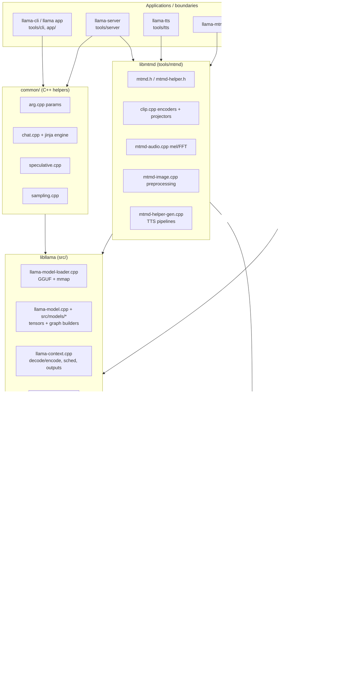

# llama.cpp (ggml-org/llama.cpp) — Engine Analysis

| Field | Value |
|---|---|
| Local path | `/data/zhoutaichang/embedding_infer/llama.cpp` |
| Remote | `https://github.com/ggml-org/llama.cpp.git` (origin) |
| Branch | `master` |
| HEAD | `e71b80510c848c00175924ecf3c40333ccae8eb5` (2026-09-07, "Revert CUDA: size routed MoE MMQ N-tiles ... (#28551)") |
| Dirty status | clean (`git status --porcelain` empty) |
| Submodules | none declared (`git submodule status` prints nothing); third-party code is vendored under `vendor/` (cpp-httplib, miniaudio, nlohmann, stb, sheredom, hash) |
| Analysis date | 2026-09-08 |
| Method | read-only source/doc inspection; no builds, no runs; evidence labels: [Verified] / [Inferred] / [Proposal] / [Unknown] |

Note: this checkout is far ahead of common public knowledge about llama.cpp. Several features described here (mtmd audio generation, Hexagon/HTP backend, backend samplers, `llama_model_init_from_user`, DSv4/MSA KV caches, unified `llama` app binary) may not exist in older releases. Everything below is grounded in this tree.

## 0. Summary

- [Verified] llama.cpp is a C/C++ inference engine built on the `ggml` tensor library. Two layers: `ggml` (tensor/graph/backends/scheduler, `../../llama.cpp/ggml/`) and `libllama` (model loading, KV/memory, graph building, sampling, tokenization, `../../llama.cpp/src/`), plus `libmtmd` (multimodal encoders + audio generation, `../../llama.cpp/tools/mtmd/`) and `common/` (CLI args, chat templates, speculative decoding).
- [Verified] It is primarily an **execution runtime + library**; the "serving stack" is a separate tool, `llama-server` (`../../llama.cpp/tools/server/`), which implements slot-based continuous batching, an OpenAI/Anthropic-compatible HTTP API, SSE streaming, a router mode that spawns child server processes, and prompt caching.
- [Verified] 18 ggml backend directories exist in-tree: `blas, cann, cpu, cuda, et, hexagon, hip, metal, musa, opencl, openvino, rpc, sycl, virtgpu, vulkan, webgpu, zdnn, zendnn` (`../../llama.cpp/ggml/src/`). All are registered via `ggml_backend_registry` (`../../llama.cpp/ggml/src/ggml-backend-reg.cpp`) and can be built as dynamically loaded plugins (`GGML_BACKEND_DL`).
- [Verified] Heterogeneous execution: `ggml_backend_sched` (`../../llama.cpp/ggml/src/ggml-backend.cpp`) assigns each graph node to a backend (weights location, `supports_op`, `offload_op`), splits the graph, inserts inter-backend copies, and supports pipeline parallelism with up to `GGML_SCHED_MAX_COPIES=4` in-flight copies + events. Unsupported ops fall back to the CPU backend (last-priority backend).
- [Verified] Quantization: 43 `ggml_type` ids incl. Q4_0/Q4_1/Q5_x/Q8_0, K-quants (Q2_K..Q6_K), IQ1..IQ4 variants, TQ1_0/TQ2_0 ternary, MXFP4, NVFP4, Q1_0/Q2_0 (`../../llama.cpp/ggml/include/ggml.h#L390`). Dequantization is done on the fly inside matmul kernels (CPU `vec_dot` over quantized blocks after quantizing activations to `vec_dot_type`; CUDA `mmq`/`mmvq`).
- [Verified] Edge CPU acceleration: runtime weight repacking (`GGML_CPU_REPACK`, on by default) into interleaved Q4_0/Q4_K/Q2_K/Q5_K/Q6_K/Q8_0/IQ4_NL/MXFP4 layouts (`../../llama.cpp/ggml/src/ggml-cpu/repack.cpp`), optional Arm KleidiAI microkernels (`GGML_CPU_KLEIDIAI`, `../../llama.cpp/ggml/src/ggml-cpu/kleidiai/`), AMX on x86, per-arch SIMD in `ggml-cpu/arch/{arm,x86,riscv,loongarch,powerpc,s390,wasm}`.
- [Verified] Mobile/edge GPU/NPU backends present: Metal (Apple, default ON on APPLE), Vulkan, OpenCL (Qualcomm Adreno-optimized, prebuilt Adreno binary kernel library optional), Hexagon HTP (Snapdragon NPU, `../../llama.cpp/ggml/src/ggml-hexagon/`), CANN (Ascend), OpenVINO (Intel NPU, "in progress"), WebGPU, ET (RISC-V manycore). No CoreML, no NNAPI, no QNN backend in tree.
- [Verified] Model runner: GGUF format only (converted by `convert_hf_to_gguf.py` + `conversion/*.py` + `gguf-py`). `llama_model_load_from_file` -> `llama_init_from_model` -> `llama_decode`/`llama_encode`. Graph is rebuilt per ubatch unless `llm_graph_result::can_reuse()` matches (graph reuse), and compute buffers are reserved up front (`llama_context::sched_reserve`).
- [Verified] KV/memory abstraction `llama_memory_i` has many implementations: unified/per-stream KV cache, iSWA (two caches), DSA/DSA-iSWA, MSA, DSv4, recurrent (Mamba/RWKV, with rollback snapshots), hybrid, hybrid-iSWA, hybrid-idx (`../../llama.cpp/src/llama-memory.h`, `../../llama.cpp/src/llama-model.cpp#L2232`). KV cells are a ring buffer with per-cell sequence bitsets; no paged attention.
- [Verified] TTS is first-class at this commit: `tools/tts` (`llama-tts`) drives a 3-stage pipeline (backbone -> code predictor / flow net -> code2wav / Mimi decoder) through `mtmd` experimental audio-generation API. Supported pipelines: **Qwen3-TTS** and **Pocket-TTS (Kyutai)**; legacy **WavTokenizer decoder** arch remains in `libllama` (OuteTTS-era). Output is WAV to file, non-streaming in the CLI, but the API is frame-stepped (`step_gen`) so streaming is feasible.
- [Verified] Audio input (ASR/audio understanding) is supported through mtmd audio encoders (Whisper-style, Conformer/Parakeet, Ultravox, Qwen2/3-Audio, Voxtral, Gemma-4 audio, etc.). Server exposes `/v1/audio/transcriptions`. Mel preprocessing is a whisper.cpp-derived FFT in `mtmd-audio.cpp`.
- [Verified] Vision: `clip.cpp` in mtmd implements ~60 projector types (SigLIP/CLIP ViTs, Qwen-VL mergers, Gemma3/4, Pixtral, InternVL, Kimi-VL, MobileNetV5 for Gemma3n, etc.), with image preprocessing (Pillow-compatible resize, LLaVA-UHD slicing) and video (ffmpeg subprocess).
- [Verified] No VLA support: no action heads, no proprioceptive input path, no diffusion/flow policy heads for robotics. The only generic "numeric input" path is `llama_batch.embd` (pre-computed input embeddings) and `mtmd` encoder outputs. Diffusion **language** models (Dream/LLaDA) exist (`../../llama.cpp/examples/diffusion/`), and Pocket-TTS contains a flow-matching net in mtmd, which are the closest existing building blocks.
- [Verified] Application boundaries: C API (`include/llama.h`, `tools/mtmd/mtmd.h`), unified `llama` binary (`app/`), `llama-cli`, `llama-server`, `llama-mtmd-cli`, `llama-tts`, Android JNI/Kotlin sample (`examples/llama.android`), iOS SwiftUI + XCFramework (`examples/llama.swiftui`, `build-xcframework.sh`), RPC server for distributed backends.
- [Unknown] The repo publishes no binary-size numbers; footprint must be measured.

## 1. Architecture overview



Key modules:

| Module | Path | Responsibility | Key symbols |
|---|---|---|---|
| ggml core | `../../llama.cpp/ggml/src/ggml.c`, `../../llama.cpp/ggml/include/ggml.h` | tensor struct, op enum (102 ops), graph build | `ggml_tensor`, `enum ggml_op`, `ggml_build_forward_expand`, `ggml_custom_4d` |
| Backend API | `../../llama.cpp/ggml/include/ggml-backend.h`, `../../llama.cpp/ggml/src/ggml-backend-impl.h` | device/buffer/backend vtables | `ggml_backend_device_i`, `ggml_backend_i`, `ggml_backend_reg_i`, `ggml_backend_dev_props` |
| Backend registry | `../../llama.cpp/ggml/src/ggml-backend-reg.cpp` | compile-time registration, dynamic loading | `ggml_backend_registry`, `ggml_backend_load_all`, `ggml_backend_load_best` |
| Scheduler | `../../llama.cpp/ggml/src/ggml-backend.cpp` | node->backend assignment, splits, copies, pipeline parallel | `ggml_backend_sched`, `ggml_backend_sched_split_graph`, `ggml_backend_sched_compute_splits` |
| Graph allocator | `../../llama.cpp/ggml/src/ggml-alloc.c` | compute buffer planning (in-place reuse, chunked vbuffers) | `ggml_gallocr`, `ggml_dyn_tallocr`, `ggml_backend_alloc_ctx_tensors` |
| CPU backend | `../../llama.cpp/ggml/src/ggml-cpu/ggml-cpu.c`, `ggml-cpu.cpp`, `ops.cpp` | threadpool, op kernels, extra buffer types | `ggml_threadpool`, `ggml_graph_compute`, `type_traits_cpu`, `ggml_backend_cpu_device_supports_op` |
| GPU/NPU backends | `../../llama.cpp/ggml/src/ggml-cuda/ggml-cuda.cu`, `../../llama.cpp/ggml/src/ggml-metal/ggml-metal.cpp`, `../../llama.cpp/ggml/src/ggml-vulkan/ggml-vulkan.cpp`, `../../llama.cpp/ggml/src/ggml-opencl/ggml-opencl.cpp`, `../../llama.cpp/ggml/src/ggml-hexagon/ggml-hexagon.cpp` | per-backend kernels | `ggml_backend_*_device_supports_op`, `*_reg()` |
| RPC backend | `../../llama.cpp/ggml/src/ggml-rpc/ggml-rpc.cpp`, `../../llama.cpp/tools/rpc/rpc-server.cpp` | remote device over sockets | `enum rpc_cmd` |
| Model loader | `../../llama.cpp/src/llama-model-loader.cpp`, `../../llama.cpp/src/llama-mmap.cpp` | GGUF parse, splits, mmap/mlock, tensor data upload | `llama_model_loader`, `load_all_data`, `init_mappings` |
| Model | `../../llama.cpp/src/llama-model.cpp`, `../../llama.cpp/src/models/models.h` (+ one `.cpp` per arch in `../../llama.cpp/src/models/`) | hparams/tensors per arch, buffer placement, `create_memory`, `build_graph` | `llama_model::load_tensors`, `make_cpu_buft_list`, `make_gpu_buft_list`, `llama_model::create_memory` |
| Context | `../../llama.cpp/src/llama-context.cpp` | backends/sched creation, reserve, decode/encode loop, outputs, state save/load | `llama_context::decode`, `process_ubatch`, `sched_reserve`, `graph_compute` |
| Batch | `../../llama.cpp/src/llama-batch.cpp` | validate batch, split into ubatches | `llama_batch_allocr::split_simple/split_equal/split_seq` |
| Memory/KV | `../../llama.cpp/src/llama-memory.h`, `../../llama.cpp/src/llama-kv-cache.cpp`, `llama-kv-cells.h`, `llama-memory-recurrent.cpp` | KV storage, slot finding, masks, shifts, state IO | `llama_memory_i`, `llama_kv_cache::find_slot`, `apply_ubatch`, `llama_kv_cells` |
| Graph builder | `../../llama.cpp/src/llama-graph.cpp` | shared building blocks, graph inputs, reuse checks | `llm_graph_context::build_attn/build_ffn/build_moe_ffn/build_rs`, `llm_graph_result::can_reuse` |
| Vocab | `../../llama.cpp/src/llama-vocab.cpp` | tokenizers SPM/BPE/WPM/UGM/RWKV/PLaMo2, detokenize | `llm_tokenizer_*_session`, `llama_vocab::impl` |
| Sampling | `../../llama.cpp/src/llama-sampler.cpp` | CPU sampler chain + backend (in-graph) samplers | `llama_sampler_chain_*`, `llama_set_sampler` |
| Multimodal | `../../llama.cpp/tools/mtmd/mtmd.cpp`, `clip.cpp`, `mtmd-audio.cpp`, `mtmd-image.cpp`, `mtmd-helper.cpp` | encoders, preprocessing, chunked prompt eval | `mtmd_tokenize`, `mtmd_encode_chunk`, `mtmd_helper_eval_chunks`, `clip_image_batch_encode` |
| Audio generation | `../../llama.cpp/tools/mtmd/mtmd-helper-gen.cpp`, `../../llama.cpp/tools/mtmd/models/qwen3tts-gen.cpp`, `pockettts-gen.cpp` | TTS stage 2/3 graphs and stateful driver | `mtmd_gen_audio_process`, `qwen3tts_gen_audio_pipeline`, `pockettts_gen_audio_pipeline` |
| Server | `../../llama.cpp/tools/server/server-context.cpp`, `server-queue.cpp`, `server-http.cpp` | slots, continuous batching, HTTP/SSE | `server_slot`, `update_slots`, `server_queue`, `set_chunked_content_provider` |
| Conversion | `../../llama.cpp/convert_hf_to_gguf.py`, `../../llama.cpp/conversion/base.py`, `../../llama.cpp/gguf-py/gguf/` | HF -> GGUF | `ModelBase`, `TextModel`, `MmprojModel`, `GGUFWriter` |

## 2. Device layer

**Backend abstraction.** [Verified] Three-level object model in `../../llama.cpp/ggml/include/ggml-backend.h`: `ggml_backend_reg_t` (a backend library, enumerates devices) -> `ggml_backend_dev_t` (a physical device with `ggml_backend_dev_props{name, description, memory_free/total, type, device_id, caps}`) -> `ggml_backend_t` (a "stream"/execution context created by `ggml_backend_dev_init`). Buffer types (`ggml_backend_buffer_type_t`) allocate `ggml_backend_buffer_t`. Device types: `CPU`, `GPU`, `IGPU` (integrated, host memory), `ACCEL` (BLAS/AMX used together with CPU), `META` (tensor-parallel wrapper) (`../../llama.cpp/ggml/include/ggml-backend.h#L134`).

**Device capability flags.** [Verified] `ggml_backend_dev_caps{async, host_buffer, buffer_from_host_ptr, events, mmap_support}` (`../../llama.cpp/ggml/include/ggml-backend.h#L148`). `llama_context` enables pipeline parallelism only if all non-CPU devices report `async` and `events` (`../../llama.cpp/src/llama-context.cpp#L426`).

**Backends in tree and registration.** [Verified] `../../llama.cpp/ggml/src/ggml-backend-reg.cpp#L115` `struct ggml_backend_registry` registers at static-init time (guarded by `GGML_USE_*`): CUDA, Metal, SYCL, Vulkan, WebGPU, zDNN, VirtGPU frontend, OpenCL, ZenDNN, Hexagon, CANN, BLAS, RPC, OpenVINO, ET, and CPU last. HIP and MUSA compile the CUDA source tree (`ggml-hip/`, `ggml-musa/` are thin CMake wrappers; `ggml-hip` has 0 source lines). `ggml_backend_load_all_from_path` (`#L578`) dlopens `ggml-{blas,zendnn,cann,cuda,hip,metal,rpc,sycl,vulkan,virtgpu,opencl,hexagon,musa,openvino,cpu}` plugins when `GGML_BACKEND_DL` is used; `ggml_backend_load_best` picks the best CPU variant (`GGML_CPU_ALL_VARIANTS`). Backend order in the registry defines scheduler priority (GPU first, CPU last).

**Device discovery/selection in llama.** [Verified] `../../llama.cpp/src/llama.cpp#L139-L303`: `llama_model_load_from_file_impl` enumerates `ggml_backend_dev_count()`; if `params.devices` is NULL it collects GPU devices, then IGPU devices only if no GPU, RPC servers first; `split_mode == LLAMA_SPLIT_MODE_NONE` keeps only `main_gpu`. `llama_model_params{devices, tensor_buft_overrides, n_gpu_layers, split_mode, load_mode, lazy_mode, main_gpu, tensor_split, use_extra_bufts, no_host, no_alloc}` (`../../llama.cpp/include/llama.h`). CLI `--device`, `--list-devices` (`../../llama.cpp/docs/build.md#L838`).

**Weight placement.** [Verified] `../../llama.cpp/src/llama-model.cpp#L1031` `make_cpu_buft_list` builds an ordered candidate list: ACCEL device bufts, GPU host (pinned) bufts (unless `no_host`), CPU extra bufts (AMX/KleidiAI/repack, when `use_extra_bufts`), then plain CPU. `make_gpu_buft_list` (`#L1093`) adds split-row bufts for `LLAMA_SPLIT_MODE_ROW`, the device buft, and GPU extra bufts. Layers `[n_layer+1-n_gpu_layers, n_layer]` map to GPU devices proportionally to `tensor_split` (`#L1479-L1504`); input embeddings always on CPU (`dev_input`). Per-tensor overrides via regex `tensor_buft_overrides` (`--override-tensor`). Each weight is placed in the first buft in its layer list whose device `supports_op` for a probe op (`llama_model_loader` `select_weight_buft`; [Inferred] from function names at `#L1031-L1138` and loader code).

**Memory allocation & pools.** [Verified] Weights: `ggml_backend_alloc_ctx_tensors_from_buft` (`../../llama.cpp/ggml/src/ggml-alloc.c#L1239`), or zero-copy `ggml_backend_dev_buffer_from_host_ptr` from the mmap'd file when the device supports it and the buft is the default one (`../../llama.cpp/src/llama-model.cpp#L1734`). `LLAMA_LOAD_MODE_{AUTO,MMAP,MLOCK,MMAP_MLOCK,NONE}` control mmap/mlock (`../../llama.cpp/src/llama-model-loader.cpp#L559`). Compute buffers: `ggml_gallocr` in `ggml-alloc.c` plans in-place reuse (`ggml_op_can_inplace`, `#L22`), splits large allocations into chunks (`struct vbuffer`, `#L398`), and reallocates only when `ggml_gallocr_needs_realloc` (`#L1009`). KV cache: one `ggml_context` per buffer type, K/V tensors allocated per layer (`../../llama.cpp/src/llama-kv-cache.cpp#L104-L152`); `offload_kqv` places the cache on the layer's device. Output logits/embeddings: pinned host buffer `buf_output` (`../../llama.cpp/src/llama-context.cpp#L380`). Backend-internal pools (e.g. CUDA VMM pool) are inside each backend ([Verified] `GGML_CUDA_NO_VMM` option in `../../llama.cpp/ggml/CMakeLists.txt#L204`).

**Host <-> device transfers.** [Verified] `ggml_backend_tensor_set/get` (sync), `_async` variants, strided 2D variants `ggml_backend_tensor_set_2d_async` (`../../llama.cpp/ggml/include/ggml-backend.h#L86-L96`), `ggml_backend_tensor_copy_async` between backends with automatic sync fallback (`#L116`). The scheduler copies split inputs: user inputs (`GGML_TENSOR_FLAG_INPUT`) are copied synchronously after waiting on the copy's event; other inputs use `cpy_tensor_async` if the backend supports it, else sync copy (`../../llama.cpp/ggml/src/ggml-backend.cpp#L1670-L1760`). MoE weights that live on host are copied expert-by-expert only for the experts used (`#L1690`). Model loading uploads via `load_all_data` with optional async upload backend ([Inferred] from `upload_backend`/`ggml_backend_event` usage grep in `llama-model-loader.cpp`).

**Synchronization / streams.** [Verified] One `ggml_backend_t` per device = one stream. `ggml_backend_synchronize`, `ggml_backend_event_{new,record,wait,synchronize}` (`ggml-backend.h#L121-L128`). Scheduler keeps `events[GGML_SCHED_MAX_BACKENDS=16][GGML_SCHED_MAX_COPIES=4]` (`ggml-backend.cpp#L763-L772, #L819`) and rotates `cur_copy` per graph for pipeline parallelism; `n_copies = parallel ? 4 : 1` (`#L1865`). `llama_context::graph_compute` calls `ggml_backend_sched_graph_compute_async` and results are fetched with async `ggml_backend_tensor_get_async` then `llama_synchronize` (`../../llama.cpp/src/llama-context.cpp#L2492`, `#L714`).

**Tensor parallelism / multi-device.** [Verified] `GGML_BACKEND_DEVICE_TYPE_META` + `ggml_backend_meta_device` (`../../llama.cpp/ggml/src/ggml-backend-meta.cpp`) implement experimental tensor parallelism (`LLAMA_SPLIT_MODE_TENSOR`, `../../llama.cpp/docs/multi-gpu.md#L80`); NCCL optional (`GGML_CUDA_NCCL`). Default multi-GPU is layer split with pipeline parallelism.

**RPC backend.** [Verified] `../../llama.cpp/ggml/src/ggml-rpc/ggml-rpc.cpp#L61` defines `rpc_cmd` {ALLOC_BUFFER, GET_ALIGNMENT, GET_MAX_SIZE, BUFFER_GET_BASE, FREE_BUFFER, BUFFER_CLEAR, SET_TENSOR, SET_TENSOR_HASH, GET_TENSOR, COPY_TENSOR, GRAPH_COMPUTE, GET_DEVICE_MEMORY, INIT_TENSOR, GET_ALLOC_SIZE, HELLO, DEVICE_COUNT, GRAPH_RECOMPUTE, MEMSET_TENSOR}; graphs are serialized and computed remotely; `SET_TENSOR_HASH` dedups uploads > 10 MiB. Server binary: `../../llama.cpp/tools/rpc/rpc-server.cpp`. Apple transport variant `transport-apple.cpp`.

**Portability (OS/arch actually in tree).** [Verified]
- CPU arches: `ggml/src/ggml-cpu/arch/{arm,x86,riscv,loongarch,powerpc,s390,wasm}`; build options for SSE4.2/AVX/AVX2/AVX512(+VNNI/BF16)/AMX, RVV/Zfh/Zvfh, LASX/LSX, VXE (`../../llama.cpp/ggml/CMakeLists.txt#L154-L181`). Android NDK arm64-v8a documented (`../../llama.cpp/docs/android.md`), Termux build, WASM/Emscripten (`LLAMA_WASM_*`).
- GPU/NPU: CUDA (arch list incl. `86-real`, `89-real`, `120a/121a-real`; [Inferred] Jetson Orin sm_87 would rely on `native` or user-provided `CMAKE_CUDA_ARCHITECTURES`, `../../llama.cpp/ggml/src/ggml-cuda/CMakeLists.txt#L28-L54`), HIP, MUSA, Metal (macOS/iOS/visionOS/tvOS via `build-xcframework.sh`), Vulkan (Windows/Linux/Android/macOS via MoltenVK or KosmicKrisp, `../../llama.cpp/docs/build.md#L402-L557`), OpenCL for Adreno (Android, Windows Arm64; Adreno 750/810/830/840/X1-85/X2-90 listed, `../../llama.cpp/docs/backend/OPENCL.md#L47-L54`), Hexagon HTP v73+ via Hexagon SDK containers (`../../llama.cpp/docs/backend/snapdragon/README.md`), CANN, SYCL (Intel GPU), OpenVINO, zDNN (IBM Z), WebGPU (Dawn; browser via Emscripten), VirtGPU (VM API remoting), ET (RISC-V ET-SOC).

## 3. Kernel layer

**Operator set.** [Verified] `enum ggml_op` in `../../llama.cpp/ggml/include/ggml.h#L482-L593` has 102 entries incl. `MUL_MAT`, `MUL_MAT_ID` (MoE), `FLASH_ATTN_EXT`, `ROPE`, `RMS_NORM`, `GROUP_NORM`, `L2_NORM`, `SSM_CONV/SSM_SCAN`, `RWKV_WKV6/7`, `GATED_LINEAR_ATTN`, `GATED_DELTA_NET`, `LIGHTNING_INDEXER`, `DSV4_HC_*`, `SOLVE_TRI`, `TRI`, conv family (`CONV_2D`, `CONV_3D`, `CONV_2D_DW`, `CONV_TRANSPOSE_1D/2D`, `IM2COL`, `IM2COL_3D`, `COL2IM_1D`), `POOL_1D/2D`, `UPSCALE`, `PAD`, `PAD_REFLECT_1D`, `ROLL`, `ARANGE`, `TIMESTEP_EMBEDDING`, `ARGSORT`, `TOP_K`, `CUMSUM`, `SET_ROWS`, `GET_ROWS`, optimizer ops (`OPT_STEP_ADAMW/SGD`, `CROSS_ENTROPY_LOSS`), `MAP_CUSTOM1..3`, `CUSTOM`, `UNARY`, `GLU`. Unary and GLU sub-ops are separate enums (`#L596`, `#L623`). Per-backend support matrix is generated into `../../llama.cpp/docs/ops.md` from `docs/ops/*.csv` (columns: BLAS, CANN, CPU, CUDA, ET, HTP, MTL, OpenCL, SYCL, Vulkan, WebGPU, ZenDNN, zDNN) via `test-backend-ops support --output csv` + `../../llama.cpp/scripts/create_ops_docs.py`.

**Dispatch mechanism.** [Verified] There is no per-op registry table across backends. Each backend implements `ggml_backend_device_i::supports_op(dev, op)` and `offload_op(dev, op)` (`../../llama.cpp/ggml/src/ggml-backend-impl.h#L205-L212`) plus a `graph_compute(backend, cgraph)` entry (`#L146`) that walks the nodes and switches on `op->op`. The scheduler queries `supports_op`/`supports_buft` to assign nodes (Section 5b). Examples: `ggml_backend_cpu_device_supports_op` (`../../llama.cpp/ggml/src/ggml-cpu/ggml-cpu.cpp#L424`, which also delegates to extra buffer types' `supports_op`), `ggml_backend_cuda_device_supports_op` (`../../llama.cpp/ggml/src/ggml-cuda/ggml-cuda.cu#L5060`), `ggml_backend_metal_device_supports_op` (`../../llama.cpp/ggml/src/ggml-metal/ggml-metal.cpp#L741`), `ggml_backend_vk_device_supports_op` (`../../llama.cpp/ggml/src/ggml-vulkan/ggml-vulkan.cpp#L19037`), `ggml_opencl_supports_op` (`../../llama.cpp/ggml/src/ggml-opencl/ggml-opencl.cpp#L8393`), `ggml_backend_hexagon_device_supports_op` (`../../llama.cpp/ggml/src/ggml-hexagon/ggml-hexagon.cpp#L5831`; HTP op list at `#L4962-L4992`: FA, MUL_MAT(_ID), binary ops, CPY, GET/SET_ROWS, ARGSORT, norms, SOFT_MAX, SSM_CONV, GATED_DELTA_NET, ROPE, ...). `offload_op` lets a GPU claim ops on host-resident weights when the batch is large enough (CUDA: `GGML_OP_OFFLOAD_MIN_BATCH`, default 32, `ggml-cuda.cu#L5714`).

**CPU kernel selection.** [Verified] `type_traits_cpu[GGML_TYPE_COUNT]` (`../../llama.cpp/ggml/src/ggml-cpu/ggml-cpu.c#L215`) maps each quant type to `{from_float, vec_dot, vec_dot_type, nrows}`. In `ggml_compute_forward_mul_mat` (`../../llama.cpp/ggml/src/ggml-cpu/ops.cpp#L5240-L5290`) the activation matrix is quantized to `vec_dot_type` (e.g. Q8_0/Q8_K) into `params->wdata`, then `vec_dot` runs over quantized weight blocks; there is no full dequantization of weights. Optional tinyBLAS `llamafile_sgemm` (`../../llama.cpp/ggml/src/ggml-cpu/llamafile/sgemm.cpp`, `GGML_LLAMAFILE`) and BLAS/Accelerate for large F32/F16 matmuls.

**CPU extra buffer types (repack / KleidiAI / AMX).** [Verified] `ggml_backend_cpu_get_extra_buffer_types` (`../../llama.cpp/ggml/src/ggml-cpu/ggml-cpu.cpp#L42`) registers AMX, SpacemiT RISC-V, KleidiAI, and repack buffer types. An extra buffer type implements `extra_buffer_type::supports_op` and `get_tensor_traits` (`../../llama.cpp/ggml/src/ggml-cpu/traits.h#L29-L31`); `tensor_traits::compute_forward` overrides the kernel for ops whose weight lives in that buffer. `repack.cpp` converts Q4_0 -> Q4_0x4/x8/x16, Q4_K -> Q4_Kx8/x16, Q2_K/Q5_K/Q6_K, Q8_0, IQ4_NL, MXFP4 into interleaved blocks at load time (`make_block_*`, `repack_*_bl`, `ggml_repack_get_optimal_repack_type` at `#L4528`). KleidiAI (`../../llama.cpp/ggml/src/ggml-cpu/kleidiai/kleidiai.cpp`) selects Arm microkernels by dotprod/i8mm/SVE/SME2 at runtime (`../../llama.cpp/docs/build.md#L616-L712`).

**Quantization formats.** [Verified] `enum ggml_type` (`../../llama.cpp/ggml/include/ggml.h#L390-L433`): F32, F16, BF16, F64, I8/I16/I32/I64, Q4_0, Q4_1, Q5_0, Q5_1, Q8_0, Q8_1, Q2_K..Q6_K, Q8_K, IQ2_XXS/XS/S, IQ3_XXS/S, IQ1_S/M, IQ4_NL/XS, TQ1_0/TQ2_0, MXFP4, NVFP4, Q1_0, Q2_0. Quantize/dequantize reference in `../../llama.cpp/ggml/src/ggml-quants.c`; model-level `llama_ftype` (42 `LLAMA_FTYPE_MOSTLY_*` entries) and `llama_model_quantize` in `../../llama.cpp/src/llama-quant.cpp` (imatrix-aware, per-tensor type overrides, layer pruning). GPU: CUDA `mmq.cuh` (int8 tensor-core MMQ on quantized weights), `mmvq.cu` (matvec), `dequantize.cuh`/`convert.cu`; Metal kernels in `../../llama.cpp/ggml/src/ggml-metal/kernels/` (23 files incl. `dequantize.h`); Vulkan 180 shader sources in `../../llama.cpp/ggml/src/ggml-vulkan/vulkan-shaders/`; OpenCL 178 `.cl` kernels (`../../llama.cpp/ggml/src/ggml-opencl/kernels/`), Adreno path supports Q4_0/Q4_1/Q4_K/Q6_K/MXFP4 ([Verified] `../../llama.cpp/docs/backend/OPENCL.md#L59-L83`). KV cache may be quantized (`type_k/type_v`, e.g. q8_0), Flash-attention kernels handle quantized KV on CPU/CUDA/Metal/Vulkan ([Inferred] from `GGML_CUDA_FA_ALL_QUANTS` and `k_vec_dot_type` in `ops.cpp#L8688`).

**Compilation / JIT / graph capture.** [Verified]
- Metal: shaders compiled from embedded source at runtime with `newLibraryWithSource` per op-source, or loaded from a prebuilt `.metallib` (`GGML_METAL_EMBED_LIBRARY`, `../../llama.cpp/ggml/src/ggml-metal/ggml-metal-device.m#L300-L395`); pipelines cached (`ggml_metal_pipelines_t`). Metal 4 tensor API gated by `has_tensor`.
- Vulkan: GLSL compiled to SPIR-V at build time by the host tool `vulkan-shaders-gen` (`../../llama.cpp/ggml/src/ggml-vulkan/CMakeLists.txt#L174-L199`, `../../llama.cpp/ggml/src/ggml-vulkan/vulkan-shaders/vulkan-shaders-gen.cpp`); pipelines created lazily at runtime; cooperative-matrix variants selected by device features (`coopmat_support`, `ggml-vulkan.cpp#L890`).
- OpenCL: kernels embedded (`GGML_OPENCL_EMBED_KERNELS`) and built at init with an on-disk program binary cache (`../../llama.cpp/ggml/src/ggml-opencl/cl-program-cache.cpp`); optional Adreno prebuilt binary kernel library (`GGML_OPENCL_USE_ADRENO_BIN_KERNELS`).
- CUDA: CUDA graph capture for decode graphs (`GGML_CUDA_GRAPHS`, `ggml_cuda_graph_evaluate_and_capture` at `../../llama.cpp/ggml/src/ggml-cuda/ggml-cuda.cu#L4181`; keyed per `graph_key`); HIP graphs, SYCL graphs, MUSA graphs (experimental) also have options (`../../llama.cpp/ggml/CMakeLists.txt#L207-L250`).
- Hexagon: HTP kernels compiled with the Hexagon SDK into `libggml-htp-v73.so`-style DSP libraries invoked over FastRPC (`../../llama.cpp/ggml/src/ggml-hexagon/htp/`, `htp_iface.idl`; [Verified] build log excerpt in `../../llama.cpp/docs/backend/snapdragon/README.md`).
- Backend-side graph rewriting hook: `ggml_backend_i::graph_optimize` (`../../llama.cpp/ggml/src/ggml-backend-impl.h#L155`) is invoked per split (`ggml-backend.cpp#L1462`). llama also probes fused ops per backend (`llm_fused_op_probe`, `llama_context::resolve_fused_ops`, `../../llama.cpp/src/llama-context.cpp#L35`, `#L505`).

**Fallback when an op is unsupported.** [Verified] In `ggml_backend_sched_backend_id_from_cur` (`../../llama.cpp/ggml/src/ggml-backend.cpp#L921`): a node whose weight buffer's backend does not `supports_op` searches other backends that support both the buffer type and op; if none, the weight is copied ("the weight will need to be copied"). Graph inputs default to the last backend (CPU). Pass 2/3 expand assignments to neighbours and "upgrade" nodes to higher-priority backends only when buffer types are compatible; remaining unsupported nodes end up on CPU, producing extra splits and copies (`#L1124-L1297`). `docs/ops.md` marks partial support; the ET backend doc explicitly states "some/most operations will likely fallback to CPU backend" (`../../llama.cpp/docs/backend/ET.md`).

**Extension points (custom op / backend).** [Verified] Custom ops: `ggml_map_custom1/2/3` and `ggml_custom_4d(ctx, type, ne0..3, args, n_args, fun, n_tasks, userdata)` with `ggml_custom_op_t` executed by the CPU backend (`../../llama.cpp/ggml/include/ggml.h#L2679-L2747`). New backend: implement `ggml_backend_reg_i`, `ggml_backend_device_i`, `ggml_backend_i`, `ggml_backend_buffer_type_i`, `ggml_backend_buffer_i` vtables (`ggml-backend-impl.h`), export with `GGML_BACKEND_DL_IMPL(reg_fn)` (`#L258-L285`), add to `ggml-backend-reg.cpp` and CMake. Optional proc-address extensions: `ggml_backend_set_n_threads`, `ggml_backend_dev_get_extra_bufts`, `ggml_backend_set_abort_callback`, `ggml_backend_get_features` (`ggml-backend.h#L205-L225`). New model arch: `../../llama.cpp/docs/development/HOWTO-add-model.md` (conversion class in `conversion/`, arch enum in `llama-arch.cpp`, `llama_model_<arch>` class in `src/models/models.h` with `load_arch_hparams/load_arch_tensors/build_graph`). Tests for new ops go in `../../llama.cpp/tests/test-backend-ops.cpp`.

## 4. Model runner

**Formats and conversion.** [Verified] Runtime format is GGUF only (`../../llama.cpp/ggml/src/gguf.cpp`, `../../llama.cpp/gguf-py/gguf/gguf_writer.py`, `gguf_reader.py`, `constants.py`, `tensor_mapping.py`). `../../llama.cpp/convert_hf_to_gguf.py` (312 lines) dispatches to registered classes in `../../llama.cpp/conversion/` (`ModelBase`, `TextModel`, `MmprojModel` in `../../llama.cpp/conversion/base.py`; 100+ per-family files incl. `qwen3tts.py`, `pockettts.py`, `wavtokenizer.py`, `talkie.py`, `ultravox.py`, `qwen3vl.py`). Multimodal encoders are converted into a separate `mmproj` GGUF (`--mmproj`). Also `convert_lora_to_gguf.py`, `convert_llama_ggml_to_gguf.py`, `llama-quantize` (`../../llama.cpp/tools/quantize/`), `llama-imatrix`, `gguf-split`. Model sharding/splits supported (`llama_model_load_from_splits`, `llama_get_list_splits` in `llama-model-loader.cpp#L82`). Models can also be constructed programmatically without a file: `llama_model_init_from_user` (`../../llama.cpp/src/llama.cpp#L446`).

**Load pipeline.** [Verified] `llama_model_load_from_file_impl` (`../../llama.cpp/src/llama.cpp#L380`) -> device list -> `llama_model_load` (`#L316`) -> `llama_model_loader` parses GGUF metadata (+ splits), `model.load_arch/hparams/vocab/stats`, `model.load_tensors` (buffer placement, mmap zero-copy or `load_all_data` upload; `../../llama.cpp/src/llama-model.cpp#L1403-L1834`), optional `check_tensors`, progress callback that can abort loading. `lazy_mode` allows on-demand reading of arch-marked tensors. 152 `LLM_ARCH_*` enums (`../../llama.cpp/src/llama-arch.h`).

**Execution lifecycle.** [Verified]
1. `llama_backend_init()`; optionally `ggml_backend_load_all()` for DL builds (`../../llama.cpp/examples/simple/simple.cpp#L82`).
2. `llama_init_from_model(model, params)` -> `llama_context` ctor (`../../llama.cpp/src/llama-context.cpp#L83`): computes `n_ctx` padded to 256 and `n_ctx_seq = n_ctx / n_seq_max` unless `kv_unified` (`#L288-L301`), `create_memory`, inits one `ggml_backend_t` per model device + ACCEL devices + CPU (`#L331-L357`), collects `set_n_threads` hooks, allocates output buffer, decides pipeline parallelism, then `sched_reserve()` (`#L582`).
3. `sched_reserve`: builds `ggml_backend_sched_new(backends, bufts, n, max_nodes, pipeline_parallel, op_offload)` and reserves compute buffers by building worst-case graphs for prompt-processing (`n_ubatch` tokens) and token-generation (1 token) shapes via `graph_reserve` (`#L2416`), logging split counts `n_splits_pp/tg` and buffer sizes. If allocation fails with pipeline parallelism it retries without (`#L637`).
4. Warmup: `llama_set_warmup(ctx, true)` and a decode of BOS/EOS is done by `common` init (deprecated-marked in API but present).
5. Step: `llama_decode(ctx, batch)` (`#L1644`) -> `balloc->init` validates the `llama_batch` (tokens or embeddings, positions, `seq_id`, `logits` output flags) -> `memory_update(false)` applies pending shifts/copies -> `memory->init_batch(balloc, n_ubatch, output_all)` splits into ubatches and finds KV slots (retrying once after `memory_update(true)` optimization) -> `output_reserve` -> for each ubatch `process_ubatch` (`#L1334`): `mctx->apply()`, graph reuse check, else `ggml_backend_sched_reset` + `model.build_graph(gparams)` + `ggml_backend_sched_alloc_graph`; `res->set_inputs(&ubatch)`; `graph_compute` (async) -> logits/embeddings copied with `ggml_backend_tensor_get_async` into host buffers, reordered by `output_reorder`. `llama_encode` handles encoder-only / encoder half of enc-dec (T5) and non-causal models (`#L1406`).
6. `llama_get_logits_ith`, `llama_get_embeddings_{ith,seq}`, backend-sampler results `llama_get_sampled_token_ith` (`../../llama.cpp/include/llama.h#L1035-L1092`).

**Dynamic shapes / graph reuse.** [Verified] Graphs are built per ubatch as `ggml_cgraph` (no static shape compilation). `llm_graph_params` records `ubatch` shape, `n_outputs`, memory context, and each `llm_graph_input_*::can_reuse` compares against the previous graph (`../../llama.cpp/src/llama-graph.h#L100-L760`, `#L771-L892`); when identical topology, `process_ubatch` skips rebuilding and reallocating (`n_reused++`), which is what makes CUDA graph capture effective. Env `LLAMA_GRAPH_REUSE_DISABLE` disables it (`../../llama.cpp/src/llama-context.cpp#L280`). Because `ggml_gallocr` reserved worst-case buffers, varying `n_tokens <= n_ubatch` needs no reallocation (`ggml_gallocr_needs_realloc`).

**Batch splitting.** [Verified] `llama_batch_allocr::split_simple(n_ubatch)` (sequential chunk), `split_equal(n_ubatch, sequential, n_keep_tail)` (equal-length per-sequence groups, used by non-unified KV and recurrent memories), `split_seq(n_ubatch)` (one sequence per ubatch) (`../../llama.cpp/src/llama-batch.h#L103-L111`). KV cache picks `split_simple` when `n_stream == 1`, else `split_equal` (`../../llama.cpp/src/llama-kv-cache.cpp#L713`). `llama_ubatch` holds `token/embd/pos/n_seq_id/seq_id/seq_id_unq/output` (`llama-batch.h#L15`).

**State and KV cache.** [Verified]
- Interface: `llama_memory_i` {`init_batch`, `init_full`, `init_update`, `clear`, `seq_rm/seq_cp/seq_keep/seq_add/seq_div`, `seq_pos_min/max`, `state_write/read`, `memory_breakdown`} and `llama_memory_context_i` {`next`, `apply`, `get_ubatch`, `get_status`} (`../../llama.cpp/src/llama-memory.h#L51-L126`). Public C API `llama_memory_*` (`../../llama.cpp/include/llama.h#L739-L805`).
- Factory: `llama_model::create_memory` (`../../llama.cpp/src/llama-model.cpp#L2232-L2700`) returns `nullptr` for encoder-only/diffusion/WavTokenizer archs (no cache), `llama_kv_cache_msa` (MiniMax-M3), `llama_kv_cache` (standard), `llama_kv_cache_dsa` / `dsa_iswa` (DeepSeek sparse attention), `llama_kv_cache_iswa` (two caches: full + sliding-window, `../../llama.cpp/src/llama-kv-cache-iswa.h`), `llama_kv_cache_dsv4`, `llama_memory_recurrent` (Mamba/RWKV: per-seq `r_l`/`s_l` state tensors, `n_rs_seq` rollback snapshots, `../../llama.cpp/src/llama-memory-recurrent.h#L70-L113`), `llama_memory_hybrid`, `hybrid_iswa`, `hybrid_idx`.
- Layout: `llama_kv_cache` stores per-layer `k_l/v_l` tensors of `kv_size` cells (K contiguous per head, V optionally transposed `v_trans` for non-FA path), one **stream** per sequence when `unified=false` (`n_stream = n_seq_max`) or a single shared stream when unified (`../../llama.cpp/src/llama-kv-cache.cpp#L84`, `#L135-L152`). Cells are tracked by `llama_kv_cells` with `pos`, `shift`, `seq` bitset (`std::bitset<LLAMA_MAX_SEQ=256>`) and a `seq_pos` index (`../../llama.cpp/src/llama-kv-cells.h#L489-L524`). `find_slot(ubatch, cont)` (`llama-kv-cache.cpp#L898`) scans the ring buffer for free cells (contiguous or not; non-contiguous slots are expressed via `k_idxs/v_idxs` and `GGML_OP_SET_ROWS`), honoring SWA masking to free expired cells. There is **no paging** and no defragmentation step any more (`defrag_thold` marked deprecated in `llama_context_params`); eviction is explicit via `llama_memory_seq_rm`/context-shift (`seq_add` with K-shift graph, `update(do_shift)` at `#L817`).
- Sharing across requests: `seq_cp` copies cells between sequences (full-buffer copy only for non-unified streams, `#L496-L506`); server prompt cache saves idle slot KV to RAM and restores by common prefix; `llama_state_seq_{get,set}_data(_ext)` with flags `SWA_ONLY`, `PARTIAL_ONLY`, `ON_DEVICE` (`../../llama.cpp/include/llama.h#L906-L916`), file variants `llama_state_seq_save_file/load_file`, whole-context `llama_state_get_data/set_data`.
- KV dtypes: `type_k/type_v` (F16 default, quantized allowed), `offload_kqv`, `flash_attn_type`, `swa_full`, `kv_unified` in `llama_context_params`.

**Multimodal stages.** [Verified] Encoders are in `libmtmd` (`../../llama.cpp/tools/mtmd/`), not in `libllama`: `mtmd_init_from_file(mmproj, model, params)` loads a `clip_ctx` per modality (vision and/or audio, with own `ggml_backend_sched` and a chosen device `mtmd_context_params.device`, `../../llama.cpp/tools/mtmd/clip.cpp#L153-L202`). Pipeline (`../../llama.cpp/tools/mtmd/README-dev.md#L18`): bitmap (RGB or PCM) -> `mtmd_tokenize` (splits prompt into text/image/audio chunks, runs preprocessor: `mtmd_image_preprocessor_*` slicing/resizing in `mtmd-image.cpp`, mel spectrogram in `mtmd-audio.cpp`) -> `mtmd_encode_chunk`/`mtmd_batch_encode` (runs `clip_image_batch_encode`, graph built by `clip_get_graph_builder` per projector type at `clip.cpp#L930`, computed at `#L4437-L5749`) -> `mtmd_get_output_embd` -> `mtmd_helper_decode_image_chunk` feeds embeddings to `llama_decode` via `llama_batch.embd` (with M-RoPE 2D positions via `mtmd_decoder_pos`, non-causal attention toggled by `llama_set_causal_attn` for some models) (`../../llama.cpp/tools/mtmd/mtmd-helper.cpp#L100-L293`). Decoders/vocoders for TTS live in mtmd as "gen" graphs (Section 9). Diffusion LMs are driven by `../../llama.cpp/examples/diffusion/diffusion.cpp` on top of `llama_decode` with `llama_model_is_diffusion`.

## 5. Scheduler

### 5a. Request / token / pipeline-level scheduling

**Library level (libllama).** [Verified] `libllama` has no request scheduler: the caller composes a `llama_batch` with tokens from any number of sequences (`seq_id` per token, up to `n_seq_max`, `LLAMA_MAX_SEQ=256`), and `llama_decode` processes it as ubatches of at most `n_ubatch` tokens, sharing weights across sequences (this is the batching primitive). `examples/batched` and `examples/parallel` demonstrate multi-sequence decoding with `llama_memory_seq_cp` for shared prefixes (`../../llama.cpp/examples/parallel/parallel.cpp#L263-L307`). Cancellation inside a decode: `llama_set_abort_callback` (CPU backend `ggml_cplan.abort_callback` checked per node, `../../llama.cpp/ggml/src/ggml-cpu/ggml-cpu.c#L3150`; Metal also supports an abort callback, `../../llama.cpp/ggml/src/ggml-metal/ggml-metal-context.m#L620`); other backends: [Unknown]/not observed. Backpressure: `llama_decode` returns `1` when no KV slot is found (`../../llama.cpp/src/llama-context.cpp#L1779`), leaving the caller to shrink or retry.

**Server level (tools/server).** [Verified]
- Slots: `n_parallel` `server_slot`s, each bound to a `seq_id`, with `n_ctx_slot = n_ctx_seq` (or capped with `kv_unified_per_slot`) (`../../llama.cpp/tools/server/server-context.cpp#L239`, `#L1250-L1295`). States: `IDLE, WAIT_OTHER, STARTED, PROCESSING_PROMPT, DONE_PROMPT, GENERATING` (`#L100`).
- Queue: `server_queue` (`../../llama.cpp/tools/server/server-queue.cpp`) is a mutex/condvar-protected deque; `post()`, `defer()` (task waits for a free slot), `pop_deferred_task(id_slot)`, `start_loop` runs `process_single_task` then `update_slots` on one worker thread; `yield_to_queue` lets `update_slots` interleave new tasks (`#L223`).
- Continuous batching: `update_slots()` (`#L2777`) adds one sampled token per generating slot (plus speculative draft tokens) to a shared `llama_batch`, then fills remaining capacity up to `n_batch` with pending prompt tokens (`#L3087-L3129`), reusing common prefixes (`get_common_prefix`, `n_cache_reuse` KV shifting `#L3202-L3268`, context checkpoints), decodes in chunks of `n_batch` (`#L2853-L2873`; on KV-slot failure it halves `n_batch` and retries), and dispatches results per slot. Slots that cannot batch together (`can_batch_with`, e.g. different LoRA) are processed in separate iterations (`#L2973`, `#L3108`).
- Prefill vs decode: no separate phases/engines; prompt tokens and generation tokens share ubatches (chunked prefill is natural since prompts are consumed `n_batch` at a time). Context shift when full (`n_discard`, `seq_rm` + `seq_add`, `#L2898-L2948`), disabled for multimodal.
- Cancellation: `SERVER_TASK_TYPE_CANCEL` releases the slot (`#L2438`); `post()` drops pending tasks with the same id (`server-queue.cpp#L31`). HTTP disconnect during streaming ends the chunked provider.
- Multi-stage: speculative decoding (draft model, EAGLE-3, DFlash, DSpark, n-gram variants; `../../llama.cpp/docs/speculative.md`, `../../llama.cpp/common/speculative.h`) runs draft + verify inside a slot; parent/child slots exist for `n > 1` completions (`launch_slots_with_parent_task`, `#L2264`). Router mode (`--models-dir`, `server-models.cpp`) spawns/unloads child `llama-server` processes per model and proxies requests (`../../llama.cpp/tools/server/README.md#L230-L233`, `#L1800-L2040`).
- Backpressure: `n_parallel` bounds concurrency; excess tasks are deferred; `/slots` and `/metrics` expose state; `--cache-ram` bounds prompt-cache RAM.

**TTS pipeline scheduling.** [Verified] `mtmd_helper_gen_audio` (`../../llama.cpp/tools/mtmd/mtmd-helper-gen.cpp`) is a single-sequence stateful driver: `set_input` -> `step_prompt(n_batch)` loops -> per-frame `step_gen(sampled, h_state)` running GEN_CODE then buffered GEN_WAV flushes (`flush_gen_wav`, window of 72 frames for Qwen3-TTS `window_frames`, `#L400-L437`) -> `get_output`. No batching across TTS requests; the server does not expose it.

### 5b. Graph / operator / thread-level scheduling

**Graph split scheduling (`ggml_backend_sched`).** [Verified] `ggml_backend_sched_split_graph` (`../../llama.cpp/ggml/src/ggml-backend.cpp#L1066`) runs five passes: (1) assign nodes/leafs with pre-allocated tensors (weights -> their backend; graph inputs -> CPU; `op_offload` may move host-weight ops to a GPU if `offload_op` says so, `#L921-L995`); (2) expand assignments to adjacent nodes, GPU backends up/down but never expanding CPU (`#L1124`); (3) upgrade nodes to higher-priority backends when buffer types are compatible (`#L1204`); (4) assign remaining sources from destination/view_src (`#L1265`); (5) cut the node list into contiguous same-backend splits, record split inputs that need copies (`#L1297-L1423`), call each backend's `graph_optimize` (`#L1462`), and build a copy graph with copy nodes inserted (`#L1475-L1513`). `ggml_backend_sched_alloc_splits` allocates via `ggml_gallocr` with per-node buffer ids, reallocating only if needed. `ggml_backend_sched_compute_splits` (`#L1643`) executes splits in order, one async `graph_compute` per split, with event-based cross-backend synchronization and `cur_copy` rotation; `callback_eval` can observe intermediate tensors and abort. Op ordering within a split is the topological order of `ggml_build_forward_expand`; there is no reordering/fusion in the scheduler itself (fusion is backend-internal, e.g. CUDA/Metal fusing RMS_NORM+MUL, probed via `llm_fused_op_probe`).

**Threads (CPU backend).** [Verified] `ggml_threadpool` (`../../llama.cpp/ggml/src/ggml-cpu/ggml-cpu.c#L481`) with `n_threads`, per-thread `cpumask`, priority (`GGML_SCHED_PRIO_{LOW,NORMAL,MEDIUM,HIGH,REALTIME}` mapped to SCHED_FIFO/OTHER on Linux/macOS, thread priority classes on Windows, `#L2557-L2700`), polling level, pause/resume (`ggml_threadpool_pause/resume`, `../../llama.cpp/ggml/include/ggml-cpu.h#L58-L62`), OpenMP mode when `GGML_OPENMP` (default ON; Android docs recommend OFF). Each op is split across threads by row ranges inside `ggml_compute_forward_*`, with `ggml_barrier` between ops (`#L576`). `llama_context` keeps separate `threadpool` and `threadpool_batch` (`n_threads` vs `n_threads_batch`) and sets them per compute (`../../llama.cpp/src/llama-context.cpp#L2492-L2510`); CLI exposes `--threads`, `--cpu-mask`, `--cpu-range`, `--prio`, `--poll` (`../../llama.cpp/tools/cli/README.md`). GPU backends use a single stream per device; Hexagon HTP has its own DSP worker pool (`htp/worker-pool.c` referenced in the Snapdragon doc build log).

**Stream assignment.** [Verified] One stream per backend; pipeline parallelism overlaps up to 4 ubatches across devices via copies/events. Backends may additionally use internal multi-streams ([Unknown] not audited per backend).

## 6. I/O layer

**Text tokenization.** [Verified] Built-in, no external library: `llama_vocab_type` {NONE, SPM, BPE, WPM, UGM, RWKV, PLAMO2} (`../../llama.cpp/include/llama.h#L73-L79`), implementations `llm_tokenizer_spm_session`, `llm_tokenizer_bpe_session` (with `unicode_regex_split` pre-tokenizer regexes per `LLAMA_VOCAB_PRE_TYPE_*`), `llm_tokenizer_wpm_session`, `llm_tokenizer_ugm_session` (naive trie + Viterbi-style), `llm_tokenizer_rwkv_session`, `llm_tokenizer_plamo2_session`, plus `hybriddna` and `whitespace` variants (`../../llama.cpp/src/llama-vocab.cpp#L110-L1723`). Unicode tables in `../../llama.cpp/src/unicode-data.cpp`. API: `llama_tokenize`, `llama_token_to_piece`, `llama_detokenize` (`../../llama.cpp/include/llama.h#L1172-L1200`), special tokens (BOS/EOS/EOT/SEP/PAD/MASK/FIM), `llama_vocab_is_eog`. Chat templates: in-tree Jinja engine (`../../llama.cpp/common/jinja/README.md`, not minja) used by `common/chat.cpp` with tool-call grammar constraining and PEG-based output parsers (`../../llama.cpp/docs/autoparser.md`, `../../llama.cpp/common/peg-parser.cpp`); `llama_chat_apply_template` C API with built-in templates. Grammar-constrained sampling: GBNF (`../../llama.cpp/grammars/README.md`, `../../llama.cpp/src/llama-grammar.cpp`), JSON-schema -> grammar, optional LLGuidance.

**Image preprocessing.** [Verified] Decoding via vendored `stb_image` (JPEG/PNG/...), WebP and video via `ffmpeg`/`ffprobe` subprocess (`MTMD_VIDEO` compile option, `../../llama.cpp/tools/mtmd/mtmd-helper.cpp#L36`, `#L419`, `../../llama.cpp/tools/mtmd/mtmd-helper.h#L23-L53`). Resizing with Pillow-compatible bilinear/bicubic (`img_tool::resize_pillow`, `../../llama.cpp/tools/mtmd/mtmd-image.cpp#L204`), smart-resize to patch multiples, padding, LLaVA-UHD/MiniCPM-V slicing (`mtmd_image_preprocessor_llava_uhd`, `#L485`), normalization with `image_mean/std` from the mmproj GGUF.

**Audio preprocessing.** [Verified] Decoding via vendored `miniaudio` (WAV/MP3/FLAC, resampled to model sample rate, `mtmd-helper.cpp#L23-L33`). Mel spectrogram from a whisper.cpp-derived implementation: Hann window, Cooley-Tukey FFT, mel filterbank matrix (`mtmd_audio_cache::fill_mel_filterbank_matrix`, `fft_impl`, `../../llama.cpp/tools/mtmd/mtmd-audio.cpp#L13-L268`). `mtmd_get_audio_sample_rate` reports e.g. 16000 for Whisper-type encoders. Audio encoders in mtmd: `whisper-enc.cpp`, `conformer.cpp`, `parakeet.cpp`, `granite-speech.cpp`, `qwen3a.cpp`, `mimo-audio.cpp`, `gemma4a.cpp/gemma4ua.cpp` (`../../llama.cpp/tools/mtmd/models/`).

**Streaming.** [Verified] Token streaming: server SSE via `httplib` chunked content provider (`../../llama.cpp/tools/server/server-http.cpp#L546-L576`), `server-stream.cpp` assembles OpenAI/Anthropic-style deltas; CLI prints pieces as sampled. Audio streaming output: `llama-tts` accumulates PCM and writes one WAV (`write_wav16`, `../../llama.cpp/tools/tts/tts.cpp#L53`); the helper API is frame-stepped (`step_gen` returns after each frame; GEN_WAV state carried via `state_data` so windows can be decoded incrementally, `mtmd.h#L426-L433`), so chunked audio streaming is achievable at the application layer [Inferred]. No audio-streaming HTTP endpoint exists.

**Buffering/postprocessing.** [Verified] Logits are returned only for tokens flagged in `llama_batch.logits`; output rows are reordered to batch order (`output_reorder`). Sampling: CPU sampler chain (greedy, dist, top-k/p, min-p, typical, temp, XTC, top-n-sigma, mirostat, penalties, DRY, adaptive-p, logit-bias, grammar, infill; `../../llama.cpp/include/llama.h#L1367-L1524`) or experimental backend samplers executed in-graph (`llama_set_sampler`, `llama_get_sampled_token_ith`; `llm_graph_input_sampling` in `llama-graph.h#L744`). Detokenization is incremental via `llama_token_to_piece`; server handles partial UTF-8. Vocoder/codec postprocessing for TTS is inside mtmd gen graphs (Section 9).

**Application boundaries.** [Verified]
- C API: `../../llama.cpp/include/llama.h` (`llama_*`), `../../llama.cpp/tools/mtmd/mtmd.h` + `mtmd-helper.h` (`mtmd_*`), ggml headers.
- C++ helpers: `../../llama.cpp/common/` (`common_params`, `common_sampler`, `common_chat_*`, `common_speculative_*`); `llama-cpp.h`/`ggml-cpp.h` RAII wrappers.
- CLI: unified `llama` binary (`../../llama.cpp/app/llama.cpp`: `server`, `cli`, hidden `completion/bench/batched-bench/fit-params/quantize/perplexity/download`), `llama-cli` (`../../llama.cpp/tools/cli/`, which embeds a server context), `llama-completion`, `llama-mtmd-cli`, `llama-tts`, `llama-bench`, `llama-diffusion-cli`.
- HTTP: `llama-server` endpoints `/completion`, `/tokenize`, `/detokenize`, `/apply-template`, `/embedding(s)`, `/reranking`, `/infill`, `/props`, `/slots`, `/metrics`, `/lora-adapters`, `/v1/models`, `/v1/completions`, `/v1/chat/completions` (+`/control`, `/input_tokens`), `/v1/responses`, `/v1/embeddings`, `/v1/messages` (Anthropic), `/v1/audio/transcriptions` (audio-input models only), `/models` (router mode load/unload/download/SSE), MCP tool servers, Web UI (`../../llama.cpp/tools/server/README.md#L473-L2040`, `../../llama.cpp/tools/server/server.cpp#L261`).
- Mobile bindings: Android JNI + Kotlin `InferenceEngine`/`AiChat` with Kotlin `Flow` token stream and GGUF metadata reader (`../../llama.cpp/examples/llama.android/lib/src/main/cpp/ai_chat.cpp`, `../../llama.cpp/examples/llama.android/lib/src/main/java/com/arm/aichat/InferenceEngine.kt`, CMake enabling KleidiAI+OpenMP on arm64-v8a `../../llama.cpp/examples/llama.android/lib/src/main/cpp/CMakeLists.txt`); iOS/macOS/visionOS/tvOS `llama.xcframework` via `../../llama.cpp/build-xcframework.sh` and Swift sample `../../llama.cpp/examples/llama.swiftui/llama.cpp.swift/LibLlama.swift` (direct C API from Swift: `llama_batch_init`, `llama_decode`, `llama_sampler_chain_*`).
- Python: only conversion/tooling (`gguf-py`); no runtime Python binding in tree (third-party `llama-cpp-python` is not vendored). [Verified] `../../llama.cpp/README.md` (no bindings list at this commit).
- Distributed: `rpc-server` (`../../llama.cpp/tools/rpc/README.md`).

## 7. Execution flow

### (a) Text LLM decode (single sequence, e.g. `examples/simple`)

```mermaid
sequenceDiagram
    participant App as App (simple.cpp)
    participant L as libllama (llama-context.cpp)
    participant B as llama_batch_allocr
    participant M as llama_memory_i (KV cache)
    participant G as llm_graph_context / model.build_graph
    participant S as ggml_backend_sched
    participant BE as Backends (GPU..., CPU)
    App->>L: llama_backend_init(); ggml_backend_load_all()
    App->>L: llama_model_load_from_file(gguf, mparams)
    L->>BE: enumerate devices, place weights (mmap / upload)
    App->>L: llama_init_from_model(model, cparams)
    L->>M: model.create_memory()
    L->>S: ggml_backend_sched_new(); sched_reserve() (pp + tg worst-case graphs)
    App->>L: llama_tokenize(prompt)
    loop each llama_decode(batch)
        App->>L: llama_decode(ctx, batch)
        L->>B: balloc->init(batch) validate seq_id/pos/outputs
        L->>M: memory_update(false); init_batch(balloc, n_ubatch)
        M-->>L: memory context (ubatches + slot_info per ubatch)
        loop each ubatch
            L->>M: mctx->apply() (apply_ubatch: write cells)
            alt graph reusable (can_reuse)
                L->>L: reuse gf_res_prev
            else
                L->>G: build_graph(gparams)
                G-->>L: ggml_cgraph
                L->>S: sched_reset(); sched_alloc_graph(gf)
                S->>S: split_graph (assign backends, splits, copies)
            end
            L->>L: res->set_inputs(ubatch) (tokens, pos, kq_mask, k/v idxs)
            L->>S: ggml_backend_sched_graph_compute_async(gf)
            S->>BE: per split: copy inputs, graph_compute_async, record event
            L->>BE: ggml_backend_tensor_get_async(logits -> host)
        end
        App->>L: llama_sampler_sample(smpl, ctx, -1)
        L->>L: llama_synchronize(); apply sampler chain on logits
        App->>L: llama_token_to_piece(); next llama_batch_get_one(token)
    end
```

### (b) TTS path (`llama-tts` with Qwen3-TTS or Pocket-TTS)

```mermaid
sequenceDiagram
    participant T as tools/tts/tts.cpp
    participant H as mtmd_helper gen_audio pipeline (mtmd-helper-gen.cpp)
    participant L as libllama (backbone talker)
    participant MT as libmtmd (mtmd.cpp / clip.cpp)
    participant SPK as clip graph: speaker encoder
    participant GC as clip graph: GEN_CODE (code_predictor / flow net)
    participant GW as clip graph: GEN_WAV (code2wav / Mimi decoder)
    T->>L: load backbone GGUF (LLM_ARCH_QWEN3TTS / POCKETTTS)
    T->>MT: mtmd_init_from_file(mmproj) -> gen_audio_get_info(type, sample_rate)
    T->>MT: mtmd_helper_bitmap_init_from_file(speaker.wav/mp3) (miniaudio decode)
    T->>H: set_input(prompt, lang, speaker_ref, top_k/top_p/seed)
    H->>MT: mtmd_tokenize + encode speaker chunk
    MT->>SPK: ECAPA-TDNN (qwen3tts-spkenc) / Mimi encoder (pockettts-spkenc)
    SPK-->>H: speaker embedding row(s)
    loop step_prompt(n_batch) until 0
        H->>L: llama_decode(prompt tokens + speaker embd via llama_batch.embd)
    end
    T->>L: sampled = common_sampler_sample(); h_state = llama_get_embeddings_ith(-1)
    loop step_gen(sampled, h_state) until EOS / max frames
        H->>MT: mtmd_gen_audio_process(GEN_CODE, code0=sampled, embd=h_state)
        MT->>GC: code_predictor: 15 more codebooks (on-device top-k/top-p sampling) | flow-matching latent + EOS score
        GC-->>H: codes / feats, embd (next backbone input), is_eos
        H->>H: buffer codes; every window_frames (72) -> flush_gen_wav
        H->>MT: mtmd_gen_audio_process(GEN_WAV, codes, state_data)
        MT->>GW: code2wav (Qwen3-TTS) | Mimi/SEANet decoder (Pocket-TTS), state carried across calls
        GW-->>H: PCM samples + new state
        H->>L: llama_decode(next backbone input embedding)
        T->>L: sample next codec_0 token
    end
    T->>H: get_output() -> WAV bytes (write_wav16)
```

## 8. Tests and examples

- [Verified] Unit tests: `../../llama.cpp/tests/` (71 `llama_build_and_test`/`llama_test` registrations in `../../llama.cpp/tests/CMakeLists.txt`), run with `ctest` after `cmake -B build -DLLAMA_BUILD_TESTS=ON && cmake --build build`; labels `main` (`ctest -L main`), e.g. `test-backend-ops.cpp` (per-op cross-backend correctness/`perf`/`grad`/`support` modes, CSV output used for `docs/ops.md`), `test-tokenizer-0/1-bpe/1-spm`, `test-quantize-fns/perf`, `test-alloc`, `test-batch-alloc`, `test-thread-safety`, `test-save-load-state`, `test-state-restore-fragmented`, `test-recurrent-state-rollback`, `test-mtmd-c-api.c`, `test-mtmd-impl.cpp`, `test-backend-sampler`, `test-rpc-multi-server`, `test-chat*`, `test-jinja`, `test-grammar*`, `test-llama-archs`. Debugging guide: `../../llama.cpp/docs/development/debugging-tests.md` (`scripts/debug-test.sh`). CONTRIBUTING requires running `test-backend-ops` after ggml changes (`../../llama.cpp/CONTRIBUTING.md#L48`).
- [Verified] Server tests: pytest scenarios in `../../llama.cpp/tools/server/tests/` (`tests.sh`, `../../llama.cpp/tools/server/tests/README.md`).
- [Verified] CI: `.github/workflows` includes `build-android.yml`, `build-apple.yml` (builds xcframework, `xcodebuild` of `llama.swiftui`, runs `ctest -L main`), `build-and-test-snapdragon.yml` (Hexagon/OpenCL presets), `build-opencl.yml` (Windows Arm64 Adreno), `build-vulkan.yml`, `build-webgpu.yml`, `build-cann.yml`, `build-openvino.yml`, `build-riscv.yml`, `build-wasm.yml`, `server.yml`, `update-ops-docs.yml`; self-hosted `ggml-ci` via `../../llama.cpp/ci/run.sh` (`../../llama.cpp/ci/README.md`).
- [Verified] Examples relevant to edge/TTS/vision/audio: `../../llama.cpp/tools/tts/tts.cpp` (TTS), `../../llama.cpp/tools/mtmd/mtmd-cli.cpp` (vision/audio chat), `../../llama.cpp/examples/llama.android/` (Kotlin app + JNI lib), `../../llama.cpp/examples/llama.swiftui/` (iOS), `../../llama.cpp/examples/simple/simple.cpp`, `../../llama.cpp/examples/simple-chat/`, `../../llama.cpp/examples/batched/batched.cpp`, `../../llama.cpp/examples/parallel/parallel.cpp`, `../../llama.cpp/examples/embedding/`, `../../llama.cpp/examples/retrieval/`, `../../llama.cpp/examples/diffusion/diffusion-cli.cpp`, `../../llama.cpp/examples/speculative-simple/`, `../../llama.cpp/examples/eval-callback/` (tensor observation via `cb_eval`), `../../llama.cpp/tools/llama-bench/`, `../../llama.cpp/tools/batched-bench/`, `../../llama.cpp/tools/rpc/`. Multimodal model docs: `../../llama.cpp/docs/multimodal.md`, `../../llama.cpp/docs/multimodal/`.
- [Verified] Snapdragon build helper: `../../llama.cpp/scripts/snapdragon/build.py` (Docker toolchain, `--push` to adb).

## 9. TTS relevance

**What exists.** [Verified]
- Tool: `llama-tts` (`../../llama.cpp/tools/tts/tts.cpp`, README `../../llama.cpp/tools/tts/README.md`): `llama-tts -hf ggml-org/Qwen3-TTS-12Hz-1.7B-Base-GGUF -p "Hello world" --output out.wav`, options `--tts-lang` (zh/en/de/it/pt/es/ja/ko/fr/ru), `--tts-speaker-file` (wav/mp3 reference voice), `-n` frames, standard sampling and `-ngl/-b/-ub`. README states the tool "used to serve as a demo for OuteTTS, but it was converted to a more model-agnostic tool".
- Supported pipelines (`enum mtmd_gen_audio_type`, `../../llama.cpp/tools/mtmd/mtmd.h#L370-L374`): `QWEN3TTS` (24 kHz; backbone `LLM_ARCH_QWEN3TTS` reusing the Qwen3-VL graph, `../../llama.cpp/src/models/qwen3tts.cpp`; speaker encoder ECAPA-TDNN `../../llama.cpp/tools/mtmd/models/qwen3tts-spkenc.cpp`; `code_predictor` producing 15 additional codebooks with on-graph top-k/top-p sampling `../../llama.cpp/tools/mtmd/models/qwen3tts-gen.cpp`; `code2wav` vocoder with 72-frame windows and carried state) and `POCKETTTS` (Kyutai Pocket-TTS: CALM backbone without lm_head `../../llama.cpp/src/models/pockettts.cpp`, flow-matching latent generator + EOS head `../../llama.cpp/tools/mtmd/models/pockettts-gen.cpp`, Mimi/SEANet codec encoder+decoder `pockettts-seanet.cpp`, `pockettts-spkenc.cpp`; requires a speaker file). Conversion classes: `../../llama.cpp/conversion/qwen3tts.py` (`Qwen3TTSTalkerModel`, `Qwen3TTSSpeakerEncoderModel`), `../../llama.cpp/conversion/pockettts.py`.
- Legacy path: `LLM_ARCH_WAVTOKENIZER_DEC` (`../../llama.cpp/src/models/wavtokenizer-dec.cpp`: posnet/convnext decoder, group norm, conv1d) and `conversion/wavtokenizer.py` remain in libllama (OuteTTS-era vocoder), but no OuteTTS driver exists in `tools/tts` anymore. `LLM_ARCH_TALKIE` (`../../llama.cpp/src/models/talkie.cpp`) is a 13B text model class ([Unknown] its exact purpose; name suggests a speech LLM but nothing audio-specific is in its graph file header).
- API: experimental, stateless core `mtmd_gen_audio_process(ctx, mtmd_gen_inp{type=GEN_CODE|GEN_WAV, code0, embd, top_k, top_p, seed, temp, codes/feats, state_data}, mtmd_gen_out{codes/feats, embd, is_eos, audio, n_samples, state_data})` (`../../llama.cpp/tools/mtmd/mtmd.h#L385-L438`), and stateful helper `mtmd_helper_gen_audio_{init,set_input,step_prompt,step_gen,get_output}` with a C++ `mtmd_helper::gen_audio` wrapper (`../../llama.cpp/tools/mtmd/mtmd-helper.h#L189-L291`). Design rules for porting new TTS models are documented in `../../llama.cpp/tools/mtmd/README-dev.md#L38-L90` (3-stage pipeline, sidecar models in mmproj, `a.gen.*` tensor prefixes, most logic in `mtmd-helper-gen.cpp`).
- Audio ops available in ggml relevant to vocoders: `CONV_TRANSPOSE_1D`, `IM2COL`, `COL2IM_1D`, `PAD_REFLECT_1D`, `GROUP_NORM`, `CUMSUM`, `TOP_K`, `ARGSORT`, `SSM_CONV`, `TIMESTEP_EMBEDDING` (used by Pocket-TTS flow net time embedding). Backend coverage for these varies (see `../../llama.cpp/docs/ops.md`: e.g. `COL2IM_1D` only SYCL/Vulkan; `CONV_TRANSPOSE_1D` CPU/CANN/CUDA/Metal/SYCL/Vulkan; not OpenCL/HTP), so on Adreno/Hexagon those ops fall back to CPU.
- Audio input for ASR/audio-LLMs: Whisper-style encoders, Qwen2/3-Audio, Ultravox, Voxtral, Granite-Speech, Parakeet, Gemma-4 audio, Qwen2.5/3-Omni (audio+vision input) (`../../llama.cpp/docs/multimodal.md#L108-L138`, projector enum `../../llama.cpp/tools/mtmd/clip-impl.h#L445-L507`).
- Timing instrumentation: `llama-tts` reports prompt / generation / vocoder seconds and frames (`tts.cpp#L188-L201`).

**What is missing / limitations.** 
- [Verified] No streaming audio output in the CLI (single WAV at end) and no server endpoint for speech synthesis (`/v1/audio/speech` absent; only `/v1/audio/transcriptions`).
- [Verified] Only two generation pipelines; OuteTTS driver removed; no Kokoro/CosyVoice/Orpheus/SNAC/Dia/Chatterbox etc. in tree.
- [Verified] `mtmd_gen_audio` API is marked experimental / subject to breaking changes; hparams for code2wav are hard-coded in `clip.cpp` (`conversion/qwen3tts.py#L257`).
- [Verified] Single-sequence TTS driver; no batching of multiple utterances, no cross-request scheduling; state (`c2w_state`) is a byte blob managed by the caller.
- [Inferred] Latency-critical stage 2/3 graphs run through `clip_ctx`'s own `ggml_backend_sched` with per-call graph rebuild (`clip_image_batch_encode` resets and reallocates each call), so no graph reuse/CUDA-graph benefit on the vocoder path.
- [Unknown] No published RTF/latency numbers for TTS in docs.

## 10. VLA relevance

**What exists.** [Verified]
- Vision encoders: ~60 projector/encoder types in `clip.cpp` (`../../llama.cpp/tools/mtmd/clip-impl.h#L445-L507`), including SigLIP (`tools/mtmd/models/siglip.cpp`), Qwen2/2.5/3-VL mergers with M-RoPE, Gemma3/3n/4 (MobileNetV5 `mobilenetv5.cpp`), Pixtral, InternVL, Kimi-VL, LLaVA/LLaVA-UHD, MiniCPM-V, Idefics3/SmolVLM, LFM2-VL, PaddleOCR/DeepSeek-OCR, Llama-4, Janus-Pro, CogVLM, Step3-VL, Hunyuan-VL, Nemotron-V2-VL, YouTu-VL, MiMo-VL, Granite-Vision. Encoder-only use is possible via `mtmd_encode`/`clip_image_batch_encode` + `mtmd_get_output_embd` without decoding (embedding extraction), and `clip_init` can be called standalone.
- Numeric / continuous inputs: `llama_batch.embd` lets an application inject arbitrary pre-computed input embeddings (rows of `n_embd_inp`) instead of tokens (`../../llama.cpp/include/llama.h#L262-L270`); `mtmd_bitmap_init_from_audio(n_samples, float*)` accepts raw float sequences (audio); no generic "sensor" tensor input.
- Encoder-decoder and non-causal graphs: `llama_encode`, `llama_set_causal_attn`, T5 (`src/models/t5.cpp`), BERT-family embeddings, classification heads (`llama_model_n_cls_out`, `llama_model_cls_label`), pooling types.
- Diffusion / iterative denoising in text: Dream / LLaDA / LLaDA-MoE / RND1 masked-diffusion LMs driven by `examples/diffusion` (`../../llama.cpp/examples/diffusion/README.md`; algorithms origin/entropy/margin/random/confidence; timestep or block scheduling). Flow matching in mtmd: Pocket-TTS `clip_graph_pockettts_gen` (`../../llama.cpp/tools/mtmd/models/pockettts-gen.cpp`, `time_embed`, `modulate` = adaLN-style conditioning) shows a working pattern for a small flow-matching head on top of a backbone hidden state, generating continuous 32-d latents per step.
- Low-latency loop primitives: graph reuse + CUDA graphs for 1-token steps; backend samplers to avoid host round-trips; `llama_decode` on embeddings; state snapshot/restore (`llama_state_seq_*`); recurrent-state rollback (`n_rs_seq`); abort callback; threadpool pinning/priorities.
- Training hooks: `llama_opt_init/llama_opt_epoch` and `ggml-opt.cpp` (AdamW/SGD) for fine-tuning in ggml (`../../llama.cpp/include/llama.h#L1609-L1625`).

**What is missing.** [Verified unless noted]
- No VLA model architecture (no OpenVLA, pi0/pi0.5, SmolVLA, GR00T, RT-2 style heads): grep for `proprio|openvla|smolvla|pi0|action head|diffusion policy` finds nothing in `src/`, `tools/`, `conversion/`, `docs/`.
- No action head abstraction: `libllama` outputs are logits (`n_vocab`), embeddings (`n_embd`/pooled), classification (`n_cls_out`), or backend-sampled tokens; a continuous action regression head would need a new arch class in `src/models/` or a sidecar graph in mtmd (as Pocket-TTS does).
- No proprioception/state tokenizer or projector; `llama_batch.embd` requires the caller to compute embeddings externally.
- No diffusion/flow policy sampler loop at library level (Pocket-TTS's is model-specific inside `mtmd-helper-gen.cpp`).
- No structured multi-stage scheduler for a control loop (perception encoder -> backbone -> action decoder) beyond the sequential helper used for TTS; no fixed-rate/real-time scheduling.
- [Inferred] Vision encoder latency on mobile GPUs depends on backend op coverage (`CONV_2D`, `IM2COL`, `UPSCALE`, `PAD`, 2D-RoPE); OpenCL/HTP have gaps in `docs/ops.md`, so parts of encoders may fall back to CPU.
- [Proposal] A VLA port would: (1) convert the VLM backbone via `conversion/` + mmproj; (2) add a `PROJECTOR_TYPE_*` for the vision tower if new; (3) add a sidecar "action expert" graph in `tools/mtmd/models/` driven by a new `mtmd_gen_*`-style stateless process API and a helper driver mirroring `mtmd-helper-gen.cpp`; (4) feed proprio via `llama_batch.embd` rows after a small projector computed in the sidecar graph.

## 11. Edge deployment profile

- **Build system.** [Verified] CMake (`../../llama.cpp/CMakeLists.txt`, `../../llama.cpp/ggml/CMakeLists.txt`), presets `CMakePresets.json`, Nix flake, Makefile shim. Static builds via `-DBUILD_SHARED_LIBS=OFF` (`../../llama.cpp/docs/build.md#L63`, `#L335`), `GGML_STATIC`, `GGML_LTO`. Optional components can be disabled: `LLAMA_BUILD_{COMMON,TESTS,TOOLS,EXAMPLES,SERVER,APP,UI}`, `LLAMA_OPENSSL=OFF`, `LLAMA_SUBPROCESS`, `LLAMA_LLGUIDANCE`, `GGML_OPENMP`, `GGML_LLAMAFILE`, `GGML_CPU_REPACK`, `GGML_BACKEND_DL`. `LLAMA_BUILD_MTMD` builds libmtmd standalone (`../../llama.cpp/CMakeLists.txt#L256`).
- **Dependencies.** [Verified] Core (`ggml` + `libllama`) has no external runtime dependencies beyond libc/libstdc++ and optional pthreads/OpenMP. Vendored: cpp-httplib, nlohmann/json, miniaudio, stb_image, sheredom (`../../llama.cpp/vendor/`). Optional: OpenSSL/BoringSSL (HTTPS downloads), CURL (not required; `download.cpp` uses httplib), ffmpeg binaries for video/WebP (runtime, subprocess), backend SDKs (CUDA, ROCm, Vulkan SDK + glslc at build time, OpenCL headers/ICD, Hexagon SDK, CANN, OpenVINO, Dawn for WebGPU, KleidiAI fetched when enabled).
- **Binary size.** [Unknown] No size numbers in docs. [Inferred] CPU-only footprint is dominated by per-arch kernel variants (`GGML_CPU_ALL_VARIANTS` multiplies) and `unicode-data.cpp` (7 k lines of tables); Metal embeds shader source; Vulkan embeds SPIR-V for 180 shaders (times variants); OpenCL embeds 178 kernels; CUDA fat binaries for multiple archs are large (limit `CMAKE_CUDA_ARCHITECTURES`).
- **Platforms.**
  - [Verified] Apple Silicon: Metal on by default (`GGML_METAL_DEFAULT ON` when `APPLE`, `../../llama.cpp/ggml/CMakeLists.txt#L95`), Accelerate/BLAS; iOS 16.4+, macOS 13.3+, visionOS 1.0+, tvOS 16.4+ xcframework (`../../llama.cpp/build-xcframework.sh#L7-L10`), `GGML_METAL_EMBED_LIBRARY` for app bundles. No CoreML/ANE backend.
  - [Verified] Android: NDK arm64-v8a cross-compile with `GGML_NATIVE=OFF GGML_OPENMP=OFF GGML_LLAMAFILE=OFF LLAMA_OPENSSL=OFF` (`../../llama.cpp/docs/android.md`), KleidiAI for SME2/i8mm/dotprod, OpenCL for Adreno (`../../llama.cpp/docs/build.md#L712-L760`), Hexagon HTP NPU via Snapdragon toolchain containers with `GGML_HEXAGON=ON GGML_OPENCL=ON` preset (`../../llama.cpp/docs/backend/snapdragon/README.md`), Vulkan (generic). No NNAPI, no QNN; Adreno prebuilt kernel library is a manual download.
  - [Verified] Embedded NVIDIA (Jetson): CUDA backend; the CMake default arch list does not include sm_87 explicitly (`../../llama.cpp/ggml/src/ggml-cuda/CMakeLists.txt#L28-L54`), so a `native` build on-device or explicit `-DCMAKE_CUDA_ARCHITECTURES=87` is needed ([Inferred]). `GGML_CUDA_GRAPHS` benefits small-batch decode. Unified memory documented (`../../llama.cpp/docs/build.md#L285`).
  - [Verified] Generic ARM Linux CPU: NEON/dotprod/i8mm/SVE/SME runtime dispatch, repack, KleidiAI; RISC-V RVV incl. SpacemiT (`../../llama.cpp/docs/build-riscv64-spacemit.md`); s390x; LoongArch.
  - [Verified] Windows on Arm (Snapdragon X): OpenCL Adreno and Hexagon docs (`../../llama.cpp/docs/backend/snapdragon/windows.md`).
  - [Verified] Browser/WASM: WebGPU via Emscripten (`../../llama.cpp/docs/build.md#L806-L821`), `build-wasm.yml`.
- **Model conversion path and constraints.** [Verified] HF safetensors -> `convert_hf_to_gguf.py` (per-arch class must exist in `conversion/`; unsupported archs fail) -> optional `llama-quantize` (with `llama-imatrix` for IQ/low-bit types) -> optional `gguf-split`. Multimodal encoders need a separate `--mmproj` conversion; TTS sidecars (code2wav, Mimi) must live in the mmproj GGUF (`README-dev.md#L61-L80`). Pre-quantized GGUFs downloadable with `-hf` (HF cache in `common/hf-cache.cpp`). Constraints: no ONNX/TorchScript import; tokenizer must be one of the supported vocab types with a recognized pre-tokenizer (`convert_hf_to_gguf_update.py` maintains hashes); quantized weight repacking happens at load (`use_extra_bufts`), not offline, and is CPU-only.
- **Memory fit tooling.** [Verified] `llama-fit-params` / `common/fit.cpp` and `no_alloc` metadata-only loads (`llama_model_params.no_alloc`) estimate memory before allocating; `llama_get_memory_breakdown` (`../../llama.cpp/src/llama-ext.h#L91`).
- **Runtime knobs for edge.** [Verified] `-ngl`, `--device`, `-t/-tb`, `--cpu-mask/--prio/--poll`, `-c` (KV size), `-ctk/-ctv` (KV quant), `-fa`, `-b/-ub`, `--load-mode` (mmap/mlock/none), `--override-tensor`, `--no-repack`/`use_extra_bufts`, `--kv-unified`.

## 12. Limitations and unknowns

1. [Verified] No paged/blocked KV cache; sequences occupy fixed slots in a ring buffer (`n_ctx_seq` each unless unified); long-context multi-tenant serving relies on prompt cache save/restore and context shift.
2. [Verified] No dedicated prefill/decode disaggregation or priority scheduling in `llama-server`; single worker thread, FIFO with deferral.
3. [Verified] Cancellation within a running `llama_decode` only works on CPU (and Metal via abort callback); GPU backends run the whole split.
4. [Verified] Graph is rebuilt per ubatch unless reusable; `clip.cpp` encoder/generator graphs are rebuilt and reallocated on every call.
5. [Verified] TTS API is experimental; only Qwen3-TTS and Pocket-TTS; CLI-only; no streaming HTTP; code2wav hparams hard-coded in `clip.cpp`.
6. [Verified] No VLA/action-head/proprioception support; continuous inputs only via `llama_batch.embd`.
7. [Verified] Op coverage on mobile accelerators is partial (OpenCL, HTP columns in `docs/ops.md`); vocoder/conv ops frequently fall back to CPU on those backends.
8. [Verified] No NNAPI/QNN/CoreML/TensorRT backends; Hexagon requires the proprietary Hexagon SDK and signed DSP libraries; Adreno binary kernel lib is a manual download.
9. [Verified] Python is conversion-only; runtime bindings are out of tree.
10. [Unknown] Binary sizes, per-platform performance, TTS real-time factor, Hexagon vs OpenCL relative speed: no numbers in this tree (benchmarks in `../../llama.cpp/benches/` were not audited).
11. [Unknown] Whether pipeline-parallel copies (`n_copies=4`) apply on single-device mobile builds: [Inferred] no, since `pipeline_parallel` requires more than one non-CPU device (`llama-context.cpp#L428`).
12. [Inferred] The `talkie` and `muse-glimmer` archs are recent additions whose exact application is not documented in-tree.
13. [Unknown] ET backend (`ggml-et`) maturity and availability of hardware.

## 13. Reference index

| Path | Role |
|---|---|
| `../../llama.cpp/AGENTS.md` | Contributor/agent policy (read-first) |
| `../../llama.cpp/README.md` | Backend table, docs index |
| `../../llama.cpp/CMakeLists.txt` | Top-level build options (`LLAMA_BUILD_*`, `LLAMA_BUILD_MTMD`) |
| `../../llama.cpp/ggml/CMakeLists.txt` | ggml backend/SIMD options (`GGML_*`) |
| `../../llama.cpp/ggml/include/ggml.h` | tensor types, `ggml_op` enum, custom ops |
| `../../llama.cpp/ggml/include/ggml-backend.h` | backend/device/buffer/sched public API |
| `../../llama.cpp/ggml/include/ggml-cpu.h` | CPU backend API, threadpool, feature queries |
| `../../llama.cpp/ggml/src/ggml.c` | tensor/graph core |
| `../../llama.cpp/ggml/src/ggml-backend.cpp` | `ggml_backend_sched` (split/assign/compute) |
| `../../llama.cpp/ggml/src/ggml-backend-impl.h` | backend vtables, `GGML_BACKEND_DL_IMPL` |
| `../../llama.cpp/ggml/src/ggml-backend-reg.cpp` | registry, dynamic loading |
| `../../llama.cpp/ggml/src/ggml-backend-meta.cpp` | meta device (tensor parallel) |
| `../../llama.cpp/ggml/src/ggml-backend-dl.h` | dlopen helpers |
| `../../llama.cpp/ggml/src/ggml-alloc.c` | graph/tensor allocators |
| `../../llama.cpp/ggml/src/ggml-quants.c` | reference quant/dequant |
| `../../llama.cpp/ggml/src/gguf.cpp` | GGUF reader/writer |
| `../../llama.cpp/ggml/src/ggml-cpu/ggml-cpu.c` | threadpool, `type_traits_cpu`, graph compute |
| `../../llama.cpp/ggml/src/ggml-cpu/ggml-cpu.cpp` | CPU device/reg, extra buffer types, `supports_op` |
| `../../llama.cpp/ggml/src/ggml-cpu/ops.cpp` | CPU op kernels incl. mul_mat quantized path |
| `../../llama.cpp/ggml/src/ggml-cpu/repack.cpp` | runtime weight repacking (Q4_0x4/x8, Q4_Kx8, ...) |
| `../../llama.cpp/ggml/src/ggml-cpu/traits.h` | `extra_buffer_type`/`tensor_traits` interfaces |
| `../../llama.cpp/ggml/src/ggml-cpu/kleidiai/kleidiai.cpp` | Arm KleidiAI microkernel integration |
| `../../llama.cpp/ggml/src/ggml-cpu/amx/amx.cpp` | Intel AMX buffer type |
| `../../llama.cpp/ggml/src/ggml-cpu/llamafile/sgemm.cpp` | tinyBLAS sgemm |
| `../../llama.cpp/ggml/src/ggml-cuda/ggml-cuda.cu` | CUDA backend, `supports_op`, CUDA graphs |
| `../../llama.cpp/ggml/src/ggml-cuda/CMakeLists.txt` | CUDA arch selection |
| `../../llama.cpp/ggml/src/ggml-cuda/mmq.cuh` | quantized matmul (int8 MMA) |
| `../../llama.cpp/ggml/src/ggml-cuda/mmvq.cu` | quantized matvec |
| `../../llama.cpp/ggml/src/ggml-metal/ggml-metal.cpp` | Metal device/backend registration |
| `../../llama.cpp/ggml/src/ggml-metal/ggml-metal-device.m` | Metal library compile / metallib load |
| `../../llama.cpp/ggml/src/ggml-metal/ggml-metal-context.m` | Metal command encoding, abort callback |
| `../../llama.cpp/ggml/src/ggml-metal/kernels/` | Metal shader sources |
| `../../llama.cpp/ggml/src/ggml-vulkan/ggml-vulkan.cpp` | Vulkan backend |
| `../../llama.cpp/ggml/src/ggml-vulkan/CMakeLists.txt` | shader generation at build |
| `../../llama.cpp/ggml/src/ggml-vulkan/vulkan-shaders/vulkan-shaders-gen.cpp` | GLSL->SPIR-V generator |
| `../../llama.cpp/ggml/src/ggml-opencl/ggml-opencl.cpp` | OpenCL/Adreno backend |
| `../../llama.cpp/ggml/src/ggml-opencl/cl-program-cache.cpp` | OpenCL program binary cache |
| `../../llama.cpp/ggml/src/ggml-opencl/kernels/` | OpenCL kernels |
| `../../llama.cpp/ggml/src/ggml-hexagon/ggml-hexagon.cpp` | Hexagon HTP host-side backend |
| `../../llama.cpp/ggml/src/ggml-hexagon/htp/` | DSP-side HVX/HMX kernels |
| `../../llama.cpp/ggml/src/ggml-rpc/ggml-rpc.cpp` | RPC backend protocol |
| `../../llama.cpp/ggml/src/ggml-opt.cpp` | optimizer/training |
| `../../llama.cpp/include/llama.h` | public C API |
| `../../llama.cpp/src/llama.cpp` | model load entry, device selection |
| `../../llama.cpp/src/llama-ext.h` | extended (non-stable) API |
| `../../llama.cpp/src/llama-model-loader.cpp` | GGUF loading, splits, mmap |
| `../../llama.cpp/src/llama-mmap.cpp` | mmap/mlock |
| `../../llama.cpp/src/llama-model.cpp` | tensors, buffer placement, `create_memory`, `build_graph` |
| `../../llama.cpp/src/models/models.h` | per-arch model classes |
| `../../llama.cpp/src/models/qwen3tts.cpp` | Qwen3-TTS backbone |
| `../../llama.cpp/src/models/pockettts.cpp` | Pocket-TTS backbone |
| `../../llama.cpp/src/models/wavtokenizer-dec.cpp` | WavTokenizer decoder (legacy vocoder) |
| `../../llama.cpp/src/models/talkie.cpp` | Talkie arch |
| `../../llama.cpp/src/models/t5.cpp` | encoder-decoder example |
| `../../llama.cpp/src/llama-arch.h` | arch enum |
| `../../llama.cpp/src/llama-context.cpp` | context, decode/encode, sched, state |
| `../../llama.cpp/src/llama-batch.h` | ubatch splitting |
| `../../llama.cpp/src/llama-batch.cpp` | batch allocator |
| `../../llama.cpp/src/llama-memory.h` | memory interface |
| `../../llama.cpp/src/llama-kv-cache.h` | KV cache class |
| `../../llama.cpp/src/llama-kv-cache.cpp` | KV cache impl (find_slot, apply_ubatch, shift) |
| `../../llama.cpp/src/llama-kv-cells.h` | cell bookkeeping |
| `../../llama.cpp/src/llama-kv-cache-iswa.h` | SWA dual cache |
| `../../llama.cpp/src/llama-memory-recurrent.h` | recurrent state memory |
| `../../llama.cpp/src/llama-graph.h` | graph inputs, params, reuse |
| `../../llama.cpp/src/llama-graph.cpp` | graph building blocks |
| `../../llama.cpp/src/llama-vocab.cpp` | tokenizers |
| `../../llama.cpp/src/unicode-data.cpp` | unicode tables |
| `../../llama.cpp/src/llama-sampler.cpp` | samplers |
| `../../llama.cpp/src/llama-grammar.cpp` | GBNF grammar sampling |
| `../../llama.cpp/src/llama-quant.cpp` | quantization |
| `../../llama.cpp/src/llama-cparams.h` | `LLAMA_MAX_SEQ` |
| `../../llama.cpp/common/speculative.h` | speculative decoding API |
| `../../llama.cpp/common/chat.h` | chat templates / tool calls |
| `../../llama.cpp/common/jinja/README.md` | Jinja engine |
| `../../llama.cpp/common/peg-parser.cpp` | PEG output parser |
| `../../llama.cpp/tools/mtmd/mtmd.h` | mtmd C API incl. audio generation |
| `../../llama.cpp/tools/mtmd/mtmd-helper.h` | helper API (eval chunks, gen_audio) |
| `../../llama.cpp/tools/mtmd/mtmd.cpp` | tokenizer/encoder glue, `mtmd_gen_audio_process` |
| `../../llama.cpp/tools/mtmd/mtmd-helper.cpp` | media decoding, `llama_decode` chunk driver |
| `../../llama.cpp/tools/mtmd/mtmd-helper-gen.cpp` | TTS stateful pipelines |
| `../../llama.cpp/tools/mtmd/mtmd-audio.cpp` | mel/FFT preprocessing |
| `../../llama.cpp/tools/mtmd/mtmd-image.cpp` | image preprocessing |
| `../../llama.cpp/tools/mtmd/clip.cpp` | encoder graphs and execution |
| `../../llama.cpp/tools/mtmd/clip.h` | clip API |
| `../../llama.cpp/tools/mtmd/clip-impl.h` | projector type enum |
| `../../llama.cpp/tools/mtmd/models/` | per-model encoder/generator graphs |
| `../../llama.cpp/tools/mtmd/models/qwen3tts-gen.cpp` | code predictor + on-graph sampling |
| `../../llama.cpp/tools/mtmd/models/qwen3tts-spkenc.cpp` | ECAPA-TDNN speaker encoder |
| `../../llama.cpp/tools/mtmd/models/pockettts-gen.cpp` | flow-matching latent generator |
| `../../llama.cpp/tools/mtmd/models/pockettts-seanet.cpp` | Mimi/SEANet codec |
| `../../llama.cpp/tools/mtmd/models/whisper-enc.cpp` | Whisper encoder |
| `../../llama.cpp/tools/mtmd/models/siglip.cpp` | SigLIP vision encoder |
| `../../llama.cpp/tools/mtmd/models/mobilenetv5.cpp` | Gemma3n vision tower |
| `../../llama.cpp/tools/mtmd/mtmd-cli.cpp` | multimodal CLI |
| `../../llama.cpp/tools/mtmd/README.md` | multimodal usage |
| `../../llama.cpp/tools/mtmd/README-dev.md` | libmtmd design + TTS porting checklist |
| `../../llama.cpp/tools/tts/tts.cpp` | TTS CLI |
| `../../llama.cpp/tools/tts/README.md` | TTS usage |
| `../../llama.cpp/tools/server/server.cpp` | route registration |
| `../../llama.cpp/tools/server/server-context.cpp` | slots, `update_slots`, endpoints impl |
| `../../llama.cpp/tools/server/server-queue.cpp` | task queue |
| `../../llama.cpp/tools/server/server-http.cpp` | HTTP/SSE |
| `../../llama.cpp/tools/server/server-models.cpp` | router mode |
| `../../llama.cpp/tools/server/README.md` | server docs/endpoints |
| `../../llama.cpp/tools/server/tests/README.md` | server pytest |
| `../../llama.cpp/tools/cli/README.md` | CLI args |
| `../../llama.cpp/tools/rpc/rpc-server.cpp` | RPC server |
| `../../llama.cpp/tools/rpc/README.md` | RPC usage |
| `../../llama.cpp/app/llama.cpp` | unified `llama` binary |
| `../../llama.cpp/examples/simple/simple.cpp` | minimal decode loop |
| `../../llama.cpp/examples/batched/batched.cpp` | multi-sequence batching |
| `../../llama.cpp/examples/parallel/parallel.cpp` | serving simulation |
| `../../llama.cpp/examples/diffusion/diffusion-cli.cpp` | diffusion LM driver |
| `../../llama.cpp/examples/diffusion/README.md` | diffusion params |
| `../../llama.cpp/examples/llama.android/lib/src/main/cpp/ai_chat.cpp` | Android JNI |
| `../../llama.cpp/examples/llama.android/lib/src/main/cpp/CMakeLists.txt` | Android lib build |
| `../../llama.cpp/examples/llama.android/lib/src/main/java/com/arm/aichat/InferenceEngine.kt` | Kotlin API |
| `../../llama.cpp/examples/llama.swiftui/llama.cpp.swift/LibLlama.swift` | Swift wrapper |
| `../../llama.cpp/examples/llama.swiftui/README.md` | iOS sample |
| `../../llama.cpp/build-xcframework.sh` | Apple xcframework build |
| `../../llama.cpp/docs/xcframework.md` | xcframework usage |
| `../../llama.cpp/docs/build.md` | build docs (all backends, KleidiAI, OpenCL, Android) |
| `../../llama.cpp/docs/android.md` | Android build |
| `../../llama.cpp/docs/ops.md` | op support matrix |
| `../../llama.cpp/docs/ops/CPU.csv` | CPU op CSV |
| `../../llama.cpp/docs/ops/Vulkan.csv` | Vulkan op CSV |
| `../../llama.cpp/docs/multimodal.md` | multimodal models |
| `../../llama.cpp/docs/multi-gpu.md` | split modes, tensor parallel |
| `../../llama.cpp/docs/speculative.md` | speculative decoding |
| `../../llama.cpp/docs/backend/OPENCL.md` | Adreno OpenCL |
| `../../llama.cpp/docs/backend/snapdragon/README.md` | Hexagon/Snapdragon build |
| `../../llama.cpp/docs/backend/snapdragon/windows.md` | Windows on Snapdragon |
| `../../llama.cpp/docs/backend/snapdragon/developer.md` | Hexagon dev notes |
| `../../llama.cpp/docs/backend/ET.md` | ET backend |
| `../../llama.cpp/docs/backend/SYCL.md` | SYCL |
| `../../llama.cpp/docs/backend/VirtGPU.md` | VirtGPU |
| `../../llama.cpp/docs/build-riscv64-spacemit.md` | RISC-V |
| `../../llama.cpp/docs/development/HOWTO-add-model.md` | adding models |
| `../../llama.cpp/docs/development/debugging-tests.md` | test debugging |
| `../../llama.cpp/docs/autoparser.md` | output parser |
| `../../llama.cpp/tests/CMakeLists.txt` | test registration |
| `../../llama.cpp/tests/test-backend-ops.cpp` | per-op backend tests |
| `../../llama.cpp/ci/README.md` | CI overview |
| `../../llama.cpp/ci/run.sh` | ggml-ci script |
| `../../llama.cpp/convert_hf_to_gguf.py` | conversion entry |
| `../../llama.cpp/conversion/base.py` | conversion base classes |
| `../../llama.cpp/conversion/qwen3tts.py` | Qwen3-TTS conversion |
| `../../llama.cpp/conversion/pockettts.py` | Pocket-TTS conversion |
| `../../llama.cpp/conversion/wavtokenizer.py` | WavTokenizer conversion |
| `../../llama.cpp/gguf-py/gguf/gguf_writer.py` | GGUF writer |
| `../../llama.cpp/gguf-py/gguf/constants.py` | GGUF keys/arch constants |
| `../../llama.cpp/gguf-py/README.md` | gguf-py docs |
| `../../llama.cpp/scripts/create_ops_docs.py` | ops.md generator |
| `../../llama.cpp/scripts/snapdragon/build.py` | Snapdragon build helper |
| `../../llama.cpp/grammars/README.md` | GBNF guide |
| `../../llama.cpp/vendor/` | vendored third-party libs |
| `../../llama.cpp/CONTRIBUTING.md` | contribution/testing rules |
