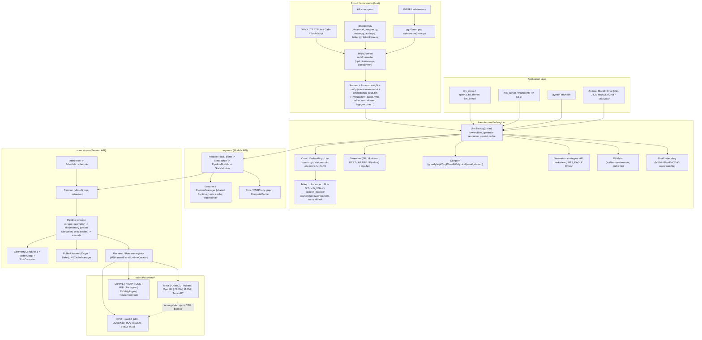

# MNN (alibaba/MNN) — Engine Analysis

| Field | Value |
|---|---|
| Local path | `/data/zhoutaichang/embedding_infer/MNN` |
| Remote | `https://github.com/alibaba/MNN.git` (origin) |
| Branch / HEAD | `master` @ `bef71b9756a2c77549eddbe33eb97290e3b16602` (2026-09-04, "[Vulkan:Perf] Optimize INT4 cooperative matrix path") |
| Dirty status | clean (`git status --porcelain` empty) |
| Submodules | none (`.gitmodules` absent; third-party code is vendored under `3rd_party/` or fetched by CMake at build time — see §11) |
| Engine version | 3.6.1 ([MNNDefine.h](../../MNN/include/MNN/MNNDefine.h)) |
| Analysis date | 2026-09-08 |
| Reading restrictions | Per [AGENTS.md](../../MNN/AGENTS.md), `schema/private/` and `source/internal/` were **not** read or cited. |

Evidence labels: **[Verified]** = code/doc read; **[Inferred]** = reasoned from structure; **[Proposal]** = design suggestion; **[Unknown]** = could not determine. Links are relative to `analysis/engines/`.

---

## 0. Summary

- **What it is** [Verified]: MNN is a C++11 inference engine (no training focus, `-fno-rtti -fno-exceptions`) with two APIs — the low-level Session API (`Interpreter → createSession → runSession`) and the recommended Express/Module API (`Module::load → onForward(VARP)`) — plus a separate transformer stack (`transformers/llm/engine`, `transformers/diffusion/engine`) built on top of Module. See [AGENTS.md](../../MNN/AGENTS.md), [Interpreter.hpp](../../MNN/include/MNN/Interpreter.hpp), [Module.hpp](../../MNN/include/MNN/expr/Module.hpp).
- **Execution runtime vs serving stack** [Verified]: the core is a single-graph, single-request runtime. There is no request scheduler, no continuous batching, no paging. Serving is thin: `mls_server` (`POST /chat/completions`, SSE) and `apps/mnncli` (`/v1/chat/completions`, `/v1/messages`) wrap one `Llm` behind a mutex ([mls_server.cpp](../../MNN/transformers/llm/engine/app/mls_server.cpp), [mnncli_server.cpp](../../MNN/apps/mnncli/src/mnncli_server.cpp)).
- **Model format** [Verified]: FlatBuffers `.mnn` ([MNN.fbs](../../MNN/schema/default/MNN.fbs), 186 `OpType` enumerators) with large weights split into a sidecar `.mnn.weight` addressed by `Op.externalPath` + per-op `external:[offset,size,...]`. Converter frontends: ONNX, TF, TFLite, Caffe, TorchScript, MNN-JSON ([cli.cpp](../../MNN/tools/converter/source/common/cli.cpp)).
- **Backends in tree** [Verified]: 16 dirs under [source/backend](../../MNN/source/backend): `cpu` (+`arm82` fp16, x86 AVX2/AVX512-VNNI, RISC-V RVV, KleidiAI, SME2, bf16), `metal`, `opencl`, `vulkan` (image or buffer variant chosen at build), `opengl`, `cuda`, `musa`, `tensorrt`, `coreml`, `nnapi`, `qnn`, `hiai`, `hexagon`, `rknn` (plugin op), `neuropilot` (stub only in OSS). No LoongArch, no WebGPU.
- **Heterogeneous fallback** [Verified]: every non-CPU `Session` carries a CPU "backup" backend; per-op `Backend::onCreate` returning `nullptr` triggers a retry on CPU inside `_createExecutions` ([Pipeline.cpp#L583-L596](../../MNN/source/core/Pipeline.cpp#L583)), with `WrapExecution` inserting layout/device copies. Only works when the runtime's `CompilerType` is `Compiler_Loop` (full geometry decomposition); NPU-style backends (`CoreML`, `NNAPI`, `QNN`, `HIAI`, `TensorRT`) compile the whole subgraph and are exempt from wrapping.
- **Kernel dispatch** [Verified]: per-backend `addCreator(OpType, Creator*)` maps; CPU registers 75 op types, Metal 36, OpenCL 39 (×buffer/image), Vulkan buffer 35, CUDA ~44. Geometry decomposition lowers shape-manipulation ops into `OpType_Raster` regions so backends only need a small compute subset ([GeometryComputer.cpp](../../MNN/source/geometry/GeometryComputer.cpp), [docs/contribute/backend.md](../../MNN/docs/contribute/backend.md)).
- **LLM quantization** [Verified]: exporter default W4 block-64 asymmetric with fp16 scales; W2/W3/W4/W8/FP16 supported (W2/W3 need ARMv8.6 i8mm); optional HQQ/AWQ/GPTQ/OmniQuant/SmoothQuant ([llmexport.py](../../MNN/transformers/llm/export/llmexport.py)). Runtime dequant is fused into the GEMM under `MNN_LOW_MEMORY` (weight-dequant float GEMM with `memory=normal`, or dynamic-int8-activation GEMM with `memory=low`) ([ConvolutionFloatFactory.cpp](../../MNN/source/backend/cpu/compute/ConvolutionFloatFactory.cpp)). KV cache: int8 / TQ3 / TQ4 on CPU, int8 on Metal, optional mmap-to-disk.
- **LLM engine** [Verified]: `Llm` (text), `Omni : Embedding : Llm` (vision/audio/talker), `Talker : Llm` (speech). Decode is a plain autoregressive loop in `ArGeneration::generate` ([generate.cpp#L44](../../MNN/transformers/llm/engine/src/speculative_decoding/generate.cpp#L44)) with optional lookahead / MTP / EAGLE / DFlash speculative strategies. Modules are cloned per (seq-len-bucket, all_logits) key to avoid resizing (`mPrefillKey=100`, decode key 1).
- **TTS is first-class** [Verified]: (1) in-engine Qwen2.5-Omni thinker→talker→DiT(flow ODE)→BigVGAN and Qwen3-TTS talker→code-predictor→speech-decoder (single waveform callback after all frames, `Talker::generateQwen3TTS` in `omni.cpp`) while Qwen2.5-Omni streams **chunked PCM** through `setWavformCallback(const float*, size_t, bool last)` and a two-thread async DiT/vocoder pipeline ([omni.cpp](../../MNN/transformers/llm/engine/src/omni.cpp)); (2) a native `MNNTTSSDK` (Bert-VITS2, Supertonic, Piper) under [apps/frameworks/mnn_tts](../../MNN/apps/frameworks/mnn_tts); (3) a full sherpa-onnx port (VITS/Kokoro/Matcha/HiFiGAN + Zipformer ASR) under [apps/frameworks/sherpa-mnn](../../MNN/apps/frameworks/sherpa-mnn).
- **VLA is absent** [Verified]: exhaustive grep for VLA/OpenVLA/π0/SmolVLA/LeRobot/diffusion-policy/proprio/action-head yields zero real hits. Building blocks exist: 16 vision-encoder exporters (Qwen2/2.5/3/3.5-VL, Gemma3/4, InternVL, MiniCPM-V, SmolVLM/Idefics3, LFM2-VL, MobileCLIP, ...), M-RoPE, DiT/flow-matching runtime (SD3.5/Sana/Wan2.1 T2V, token2wav DiT).
- **Edge profile** [Verified]: minimal `libMNN.so` links only pthread/dl (Linux) or log/m/android (Android); OpenCL/Vulkan are `dlopen`ed by default; repo-reported core size ≈ 800 KB (Android armv7a, `c++_shared`), 12 MB full iOS static lib; `MNN_BUILD_MINI` strips geometry/shape for fixed-shape models. Platforms with build scripts: Android (NDK, API ≥21 arm64 / 14 armv7), iOS/macOS (CocoaPods `MNN.podspec`, fat framework), Linux/Windows/OpenHarmony, WASM (emcmake), RISC-V (SpacemiT K3), CUDA sm60–120 (incl. sm87 Jetson Orin), Qualcomm QNN/Hexagon, Huawei HIAI, Rockchip RKNN, Apple ANE via CoreML.
- **No JIT / graph capture** [Verified]: kernels are AOT (Metal source strings compiled at first use with a persisted tuning cache; Vulkan SPIR-V arrays; OpenCL online-compiled with binary+tuning cache; CUDA nvcc). No `cudaGraph`, no `MTLIndirectCommandBuffer`. GPU batching is controlled by `OP_ENCODER_NUMBER_FOR_COMMIT`.
- **Bindings** [Verified]: C++ only in core (no C API); Python `MNN.llm` (`response/generate/…`, no TTS callback), Android JNI + Kotlin apps, iOS ObjC++/Swift wrapper with audio-out callback.
- **Concurrency model** [Verified]: one `Llm` = one `Executor` + one `RuntimeManager`; thread-safe only if one thread drives it ([test_multi_instance.cpp](../../MNN/transformers/llm/engine/test/test_multi_instance.cpp)). Cancellation of text decode has no engine API — apps step `generate(1)` themselves; `USER_CANCEL` is set only when the wav callback returns `false`.
- **Top facts for edge TTS/VLA**: TTS with RTF reporting exists today (chunk-streamed for Qwen2.5-Omni, single-callback for Qwen3-TTS, on CPU/GPU, DiT forced fp32 on GPU); the DiT ODE loop is host-driven Express code, so a diffusion action head would be implementable the same way; the missing pieces for VLA are proprio/action I/O and any low-latency control loop.

---

## 1. Architecture overview



### Key modules

| Module | Path | Responsibility | Key symbols |
|---|---|---|---|
| Public headers | [include/MNN](../../MNN/include/MNN) | Session API, tensor, forward types, Express/Module API | `Interpreter`, `Tensor`, `MNNForwardType`, `BackendConfig`, `ScheduleConfig`, `Express::Module`, `Express::Executor`, `VARP` |
| Core scheduling | [source/core/Schedule.cpp](../../MNN/source/core/Schedule.cpp) | Pick backend type, build per-pipeline op lists, mark I/O tensors | `Schedule::schedule`, `Schedule::getAppropriateType`, `Schedule::BackendCache`, `OpCacheInfo` |
| Session | [source/core/Session.cpp](../../MNN/source/core/Session.cpp) | Owns pipelines, translates `SessionMode`/`HintMode` into `RuntimeHint`, resize/run | `Session::Session`, `Session::resize`, `Session::run`, `ModeGroup::setHint`, `createPipelineBackend` |
| Pipeline | [source/core/Pipeline.cpp](../../MNN/source/core/Pipeline.cpp) | shape+geometry → command buffer → execution creation (with CPU fallback) → memory plan → execute | `Pipeline::encode`, `Pipeline::allocMemory`, `_createExecutions`, `_InsertCopy`, `Pipeline::execute`, `_pushTuningTask` |
| Backend abstraction | [source/core/Backend.hpp](../../MNN/source/core/Backend.hpp), [Backend.cpp](../../MNN/source/core/Backend.cpp) | Backend/Runtime interfaces, creator registry, hints | `Backend::onCreate/onAcquire/onCopyBuffer/onSync`, `Runtime`, `RuntimeHint`, `MNNInsertExtraRuntimeCreator`, `registerBackend` |
| Memory | [source/core/BufferAllocator.hpp](../../MNN/source/core/BufferAllocator.hpp) | Static/dynamic pools, mmap-backed allocators | `EagerBufferAllocator`, `DeferBufferAllocator`, `BufferAllocator::createMmap` |
| Copy/wrap | [source/core/WrapExecution.cpp](../../MNN/source/core/WrapExecution.cpp) | Insert device/layout conversion between executions | `WrapExecution::needWrap`, `makeCopyExecution` |
| Geometry | [source/geometry](../../MNN/source/geometry) | Decompose ops into Raster/Loop primitives | `GeometryComputer`, `GeometryComputerUtils::shapeComputeAndGeometryTransform`, `registerGeometryOps` |
| Shape | [source/shape](../../MNN/source/shape) | Output-shape inference per op | `SizeComputer`, `SizeComputerSuite`, `REGISTER_SHAPE` |
| KV cache core | [source/core/KVMeta.hpp](../../MNN/source/core/KVMeta.hpp), [KVCacheManager.hpp](../../MNN/source/core/KVCacheManager.hpp) | Host-side KV cursor; base KV storage w/ disk mmap | `KVMeta::sync`, `KVCacheConfig`, `KVCacheManager::onAlloc/onRealloc` |
| CPU backend | [source/backend/cpu](../../MNN/source/backend/cpu) | Kernels, thread pool, core detection, attention, KV cache | `CPUBackend::addCreator/onCreate`, `CPURuntime`, `ThreadPool`, `MNNGetCPUInfo`, `CPUAttention`, `CPUKVCacheManager`, `CoreFunctions` |
| ARM fp16 | [source/backend/arm82](../../MNN/source/backend/arm82) | fp16 variant of CPU backend (NC8HW8) | `Arm82Backend`, `Arm82Functions::init` |
| GPU backends | [metal](../../MNN/source/backend/metal), [opencl](../../MNN/source/backend/opencl), [vulkan](../../MNN/source/backend/vulkan), [cuda](../../MNN/source/backend/cuda) | Device runtimes, kernels, tuning caches | `MetalBackend`, `OpenCLBackend`, `VulkanBackend`, `CUDABackend` |
| NPU backends | [coreml](../../MNN/source/backend/coreml), [nnapi](../../MNN/source/backend/nnapi), [qnn](../../MNN/source/backend/qnn), [hiai](../../MNN/source/backend/hiai), [hexagon](../../MNN/source/backend/hexagon), [rknn](../../MNN/source/backend/rknn) | Subgraph compilation / delegation | `CoreMLBackend::buildModel`, `NNAPIBackend::buildModel`, `QnnBackend::finalizeGraph`, `NPUBackend::bulidIRModelAndLoad`, `registerRKNNPlugin` |
| Express | [express/](../../MNN/express) | Lazy VARP graph, Module implementations, RuntimeManager | `Executor::RuntimeManager::createRuntimeManager`, `StaticModule`, `PipelineModule`, `Executor::ComputeCache` |
| Converter | [tools/converter](../../MNN/tools/converter) | Frontends + optimizer passes + weight quant/coding | `MNNConverter.cpp`, `cli.cpp`, `PostConverter.cpp`, `merge/FuseAttention.cpp`, `WeightQuantAndCoding.cpp` |
| LLM export | [transformers/llm/export](../../MNN/transformers/llm/export) | HF → MNN (text/vision/audio/talker/token2wav/draft models) | `llmexport.py`, `utils/model_mapper.py`, `utils/vision.py`, `utils/audio.py`, `utils/talker.py`, `utils/token2wav.py`, `gguf2mnn.py` |
| LLM engine | [transformers/llm/engine](../../MNN/transformers/llm/engine) | Runtime for LLM/VLM/omni/TTS/embedding/reranker | `Llm`, `Omni`, `Talker`, `Embedding`, `LlmConfig`, `Tokenizer`, `Sampler`, `Generation*`, `DiskEmbedding` |
| Diffusion engine | [transformers/diffusion/engine](../../MNN/transformers/diffusion/engine) | SD1.5 (PNDM), SD3.5 (flow), Sana (flow, Qwen3 text enc), Wan2.1 T2V | `Diffusion::createDiffusion`, `StableDiffusion`, `DiffusionSD35`, `SanaDiffusion`, `WanDiffusion` |
| CV / audio libs | [tools/cv](../../MNN/tools/cv), [tools/audio](../../MNN/tools/audio) | OpenCV-like ops on VARP; wav I/O, fbank/whisper/conformer/usm mel | `MNN::CV::resize/imread`, `MNN::AUDIO::load/save/whisper_fbank/conformer_fbank/usm_fbank` |
| Apps | [apps/](../../MNN/apps) | Android/iOS chat apps, TTS SDK, sherpa port, mnncli server, Sana app | `MnnLlmChat`, `MnnTaoAvatar`, `mnn_tts`, `sherpa-mnn`, `mnncli` |
| Python | [pymnn/](../../MNN/pymnn) | Bindings: expr/nn/cv/audio/llm/reranker | `pymnn/src/llm.h` (`PyMNNLLM_methods`) |

---

## 2. Device layer

### Backend abstraction and selection
- [Verified] `MNNForwardType` ([MNNForwardType.h](../../MNN/include/MNN/MNNForwardType.h)): `CPU=0, METAL=1, CUDA=2, OPENCL=3, AUTO=4, NN=5 (NNAPI on Android / CoreML on iOS / QNN online), OPENGL=6, VULKAN=7, USER_0=8 (HIAI), USER_1=9 (TensorRT), HEXAGON=10, USER_3=11, ALL=12, CPU_EXTENSION=13, MNN_MEMORY_AHARDWAREBUFFER=14, MUSA=15`; offline-convert pseudo-types `MNN_CONVERT_QNN=32, MNN_CONVERT_NEUROPILOT=33, MNN_CONVERT_COREML=34`. `MNNGpuMode` bit-flags: `MNN_GPU_TUNING_{NONE,HEAVY,WIDE,NORMAL,FAST}`, `MNN_GPU_MEMORY_BUFFER (1<<6)`, `MNN_GPU_MEMORY_IMAGE (1<<7)`, `MNN_GPU_RECORD_OP (1<<8)`, `MNN_GPU_RECORD_BATCH (1<<9)` — these are OR'ed into `ScheduleConfig::numThread` for GPU backends (the LLM engine does `numThread |= 64 | 512` for OpenCL, [llm.cpp#L232](../../MNN/transformers/llm/engine/src/llm.cpp#L232)).
- [Verified] `BackendConfig` = `MemoryMode {Normal, High, Low}`, `PowerMode {Normal, High, Low}`, `PrecisionMode {Normal, High, Low, Low_BF16}`, and a **union** of `void* sharedContext` / `size_t flags`. `RuntimeStatus` probes: `STATUS_SUPPORT_FP16`, `_DOT_PRODUCT`, `_POWER_LOW`, `_SIMD_GROUP_REDUCE`, `_FUSED_PROJ`.
- [Verified] `class Backend` ([Backend.hpp](../../MNN/source/core/Backend.hpp)): pure virtuals `onCreate(inputs, outputs, op)` (returns `Execution*` or `nullptr` = unsupported), `onResizeBegin/End`, `onExecuteBegin/End`, `onAcquire(tensor, StorageType)`, `onClearBuffer`, `onCopyBuffer(src, dst)`; helpers `onAcquireBuffer/onReleaseBuffer` store a `MemObj` in the tensor descriptor; `StorageType {STATIC, DYNAMIC, DYNAMIC_SEPERATE, DYNAMIC_IN_EXECUTION}`; GPU hooks `onMapTensor/onUnmapTensor/onSync(MapType, toCpu, tensor)`; `getMetaPtr/setMetaPtr` (KV meta). `class Runtime`: `CompilerType {Compiler_Geometry, Compiler_Origin, Compiler_Loop}` (default Loop), `AllocatorType {Defer, Eager}`, `onCreate(config, origin)`, `onReset`, `onGabageCollect(level)`, `onSetCache/onGetCache`, `onSetCachePath`, `onMeasure`, async-work API (`setAsyncWork/waitAsyncWork/mCancelled`), `onConcurrencyBegin/End`.
- [Verified] `RuntimeHint` ([Backend.hpp](../../MNN/source/core/Backend.hpp)) carries all tunables: `memoryAllocatorType`, `winogradMemoryUsed=3`, `cpuDecreaseRate=50`, `dynamicQuantOption`, `attentionOption=8`, `kvcacheSizeLimit=-1`, `kvcacheDirPath`, `prefixcacheDirPath`, `midMemoryPath`, `weightMemoryPath`, `mmapFileSize=1024 MB`, `useCachedMmap`, `encorderNumForCommit=10`, `initThreadNumber`, `useArmSme2Cores`, `enableKleidiAI`, `cpuIds`, `divisionRatio=41`. `Session::ModeGroup::setHint` ([Session.cpp#L77](../../MNN/source/core/Session.cpp#L77)) is the single translation point from `Interpreter::HintMode`.
- [Verified] Registry: `registerBackend()` in [Backend.cpp](../../MNN/source/core/Backend.cpp) (under `std::call_once`) always registers CPU and conditionally CoreML (`MNN_COREML_ENABLED`), NNAPI, QNN, RKNN plugin, Hexagon, OpenCL, Metal, NeuroPilot. Vulkan, OpenGL, CUDA, MUSA, TensorRT, HIAI self-register via file-scope static initializers (e.g. [VulkanRuntime.cpp](../../MNN/source/backend/vulkan/runtime/VulkanRuntime.cpp), [cuda/Register.cpp](../../MNN/source/backend/cuda/Register.cpp), [GLBackend.cpp](../../MNN/source/backend/opengl/GLBackend.cpp)). `MNNGetExtraRuntimeCreator` instantiates a probe `Runtime` when the creator was registered with `needCheck=true` (OpenCL, Vulkan, HIAI) so a missing driver degrades gracefully.
- [Verified] Discovery/selection: `Schedule::getAppropriateType` ([Schedule.cpp#L111](../../MNN/source/core/Schedule.cpp#L111)) resolves `MNN_FORWARD_AUTO` through the fixed priority list `HIAI → CoreML/NN → TensorRT → CUDA → OpenCL → Metal → Vulkan → CPU`, falls back to `config.backupType` if the creator is missing, and demotes OpenCL+`Power_Low` if `STATUS_SUPPORT_POWER_LOW` is false. `RuntimeFactory::create` is a one-liner over the registry ([RuntimeFactory.cpp](../../MNN/source/core/RuntimeFactory.cpp)).

### Memory allocation and pools
- [Verified] [BufferAllocator.hpp](../../MNN/source/core/BufferAllocator.hpp): `EagerBufferAllocator` (free-list `multimap<size,Node>`, 64-byte alignment via `MNN_MEMORY_ALIGN_DEFAULT` in [MNNMemoryUtils.h](../../MNN/source/core/MNNMemoryUtils.h), per-thread groups) and `DeferBufferAllocator` (symbolic plan then `compute()/apply()` into one arena). Factories `createDefault`, `createMmap(dir, prefix, postfix, autoRemove, syncValid)`, `createRecurse(parent)`.
- [Verified] CPU: `CPURuntime` owns one static Eager pool and `MNN_CPU_MAX_BUFFER_INDEX=2` dynamic buffers; `createDynamicBufferAlloctor` returns Defer vs Eager based on `hint().memoryAllocatorType` (`HintMode::MEM_ALLOCATOR_TYPE`) ([CPUBackend.cpp](../../MNN/source/backend/cpu/CPUBackend.cpp)). `hint().weightMemoryPath` swaps the static pool for an mmap-backed one (this is `use_mmap` in the LLM config → `EXTERNAL_WEIGHT_DIR`); `midMemoryPath` does the same for dynamic buffers (`EXTERNAL_FEATUREMAP_DIR`).
- [Verified] `SessionMode` memory knobs: `Session_Memory_Collect` runs `onGabageCollect(0)` after every `allocMemory` ([Session.cpp#L363](../../MNN/source/core/Session.cpp#L363)); `Session_Memory_Cache` keeps static memory. `Session_Input_User` (what `Module::Config::shapeMutable=true` maps to) keeps inputs user-owned and stages copies through `inputTensorCopyCache` in `Pipeline::_copyInputs`.
- [Verified] Express default: `Executor::getGlobalExecutor()` creates a 1-thread CPU runtime with `memoryAllocatorType=0` (Defer) ([Executor.cpp#L154](../../MNN/express/Executor.cpp#L154)).

### Host↔device transfers and synchronization
- [Verified] [Tensor.hpp](../../MNN/include/MNN/Tensor.hpp): `copyFromHostTensor`, `copyToHostTensor`, `map/unmap(MapType, DimensionType)`, `wait(MapType, finish)`. `Tensor::map` calls `Backend::onSync` then `onMapTensor`, falling back to a temp host copy when mapping is unsupported ([Tensor.cpp](../../MNN/source/core/Tensor.cpp)).
- [Verified] Metal ([MetalBackend.mm](../../MNN/source/backend/metal/MetalBackend.mm)): one `MTLCommandQueue`, a rolling `MTLCommandBuffer`, `mEncoderCount` reset at `onExecuteBegin`, encoder flushed/committed every `hint().encorderNumForCommit` ops (`OP_ENCODER_NUMBER_FOR_COMMIT`), `onSync(toCpu)` = flush + commit + `waitUntilCompleted`; `onAcquire` handles `DYNAMIC_IN_EXECUTION` from an execution pool; tuned threadgroup tables persisted through `onGetCache/onSetCache` (`MetalTuneLevel` default `Wide`, schema [MetalCache.fbs](../../MNN/source/backend/metal/schema/MetalCache.fbs)).
- [Verified] OpenCL ([OpenCLBackend.cpp](../../MNN/source/backend/opencl/core/OpenCLBackend.cpp)): `setGpuMode` decodes BUFFER/IMAGE (AUTO → BUFFER on Mali/Intel, IMAGE elsewhere) and tuning level; record-queue (`MNN_GPU_RECORD_OP/BATCH`) when the device supports it; `onSync(toCpu)` = `commandQueue().finish()`; SVM fine-grain buffers under `MNN_OPENCL_SVM_ENABLE`; binary+tuning cache in a FlatBuffer (`CLCache` schema under [opencl/core/runtime](../../MNN/source/backend/opencl/core/runtime)). The buffer path can be compiled out with `MNN_OPENCL_SIZE_CUT`.
- [Verified] Vulkan buffer variant ([VulkanBackend.cpp](../../MNN/source/backend/vulkan/buffer/backend/VulkanBackend.cpp)): `mDirect = !(gpuMode & MNN_GPU_RECORD_BATCH)`; all command buffers submitted in one `vkQueueSubmit` + single `VulkanFence` in `_finish()`; `onCopyBuffer` stages through a host-visible buffer; dynamic pool is an `EagerBufferAllocator` aligned to `nonCoherentAtomSize`. Image variant selected by `MNN_VULKAN_IMAGE=ON` (default) at build time.

### Portability — what is actually in tree

| Backend dir | Forward type | Registration | CMake gate | Delegation granularity / notes |
|---|---|---|---|---|
| [cpu](../../MNN/source/backend/cpu) | CPU / CPU_EXTENSION | `registerCPURuntimeCreator` | always | per-op; `Compiler_Loop` |
| [arm82](../../MNN/source/backend/arm82) | CPU_EXTENSION (fp16) | `registerArm82RuntimeCreator` → `Arm82Functions::init` | `MNN_ARM82` (ON) | chosen when `Precision_Low` and `fp16arith` |
| [metal](../../MNN/source/backend/metal) | METAL | `registerMetalRuntimeCreator` | `MNN_METAL` + APPLE | per-op |
| [opencl](../../MNN/source/backend/opencl) | OPENCL | `registerOpenCLRuntimeCreator` (needCheck) | `MNN_OPENCL` | per-op; dlopen unless `MNN_USE_SYSTEM_LIB` |
| [vulkan](../../MNN/source/backend/vulkan) | VULKAN | static init (needCheck) | `MNN_VULKAN`, `MNN_VULKAN_IMAGE` | per-op; dlopen `libvulkan` |
| [opengl](../../MNN/source/backend/opengl) | OPENGL | static init | `MNN_OPENGL` | per-op; links GLESv3/EGL |
| [cuda](../../MNN/source/backend/cuda) | CUDA | static init | `MNN_CUDA` (+`MNN_CUDA_QUANT/BF16/TUNE_PARAM`) | per-op; sm 60–120 |
| [musa](../../MNN/source/backend/musa) | MUSA=15 | static init | `MNN_MUSA` (+ stub/compat/native) | Moore Threads |
| [tensorrt](../../MNN/source/backend/tensorrt) | USER_1 | static init | `MNN_TENSORRT` | whole subgraph at `onResizeEnd` |
| [coreml](../../MNN/source/backend/coreml) | NN | `registerCoreMLRuntimeCreator` | `MNN_COREML` | whole subgraph: `buildModel()` at `onResizeEnd`, `invokeModel()` at `onExecuteEnd` |
| [nnapi](../../MNN/source/backend/nnapi) | NN | `registerNNAPIRuntimeCreator` | `MNN_NNAPI` (API ≥ 29) | whole graph via `ANeuralNetworksCompilation`; `Compiler_Geometry` |
| [qnn](../../MNN/source/backend/qnn) | NN (online) / CONVERT_QNN (offline) | `registerQNNRuntimeCreator` | `MNN_QNN`, `MNN_QNN_ONLINE_FINALIZE`, `MNN_QNN_CONVERT_MODE` | `Compiler_Origin`; graph finalized once; context binary cached via `onGetCache/onSetCache`; SDK via [prepare_qnn_deps.sh](../../MNN/prepare_qnn_deps.sh) |
| [hiai](../../MNN/source/backend/hiai) | USER_0 | static init (needCheck) | `MNN_NPU` (not an `option()`) | whole graph `bulidIRModelAndLoad`; `Compiler_Origin` |
| [hexagon](../../MNN/source/backend/hexagon) | HEXAGON=10 | `registerHexagon` (probes DSP lib) | `MNN_HEXAGON` | per-op over decomposed stream (`Compiler_Loop`), forced 1 thread |
| [rknn](../../MNN/source/backend/rknn) | (CPU + Plugin op) | `registerRKNNPlugin` | `MNN_RKNN` + `MNN_WITH_PLUGIN` | one plugin op wraps a whole `.rknn` file |
| [neuropilot](../../MNN/source/backend/neuropilot) | CONVERT_NEUROPILOT=33 | — | forced OFF ([CMakeLists.txt](../../MNN/source/backend/neuropilot/CMakeLists.txt)) | not shipped in OSS |

- [Verified] NNAPI and CoreML both claim `MNN_FORWARD_NN`; `MNNInsertExtraRuntimeCreator` rejects duplicates, so only one can be linked per build [Inferred from registry assert].
- [Verified] CPU ISA paths: `source/backend/cpu/arm/arm64` (NEON, `*_ARMV82_*` sdot, `*_ARMV86_*` i8mm/smmla, `low_memory/` W2/W3/W4 GEMM, `sme2_asm/`), `arm32`, `x86_x64/{sse,avx,avxfma,avx512}` (AVX512-VNNI split), `riscv/rvv` (+ SpacemiT IME2), `kleidiai/` (fetched v1.16.0 by [cmake/KleidiAI.cmake](../../MNN/cmake/KleidiAI.cmake)), `bf16/`. Runtime feature detection `MNNGetCPUInfo()` ([CPURuntime.cpp](../../MNN/source/backend/cpu/CPURuntime.cpp)): `fp16arith, dot, i8mm, sve2, sme2, rvv/zvfh, groups (big/little clusters by cpufreq), smeCoreNumber, perfCoreNumber`.

### Multi-backend fallback (unsupported op on GPU)
- [Verified] `Session::createPipelineBackend` ([Session.cpp#L26](../../MNN/source/core/Session.cpp#L26)) creates `cache.first` (target) and, unless the target is CPU, a separate CPU `cache.second` with `flags=4` (`MNN_CPU_USE_DEFAULT_BACKEND`).
- [Verified] `_createExecutions` ([Pipeline.cpp#L538](../../MNN/source/core/Pipeline.cpp#L538)): try `OpCommonUtils::createExecutionWithExternal(mBackend, …)`; if `nullptr`, `// Try Backup` on `mBackupBackend`; if still null → `NOT_SUPPORT`. `_InsertCopy` then walks every command's inputs/outputs and, when `WrapExecution::needWrap(t, curBackend)` is true, appends an `OpType_Copy` command built by `WrapExecution::makeCopyExecution` (const tensors cached via `copyConstCache`). `needWrap` returns false for `MNN_FORWARD_NN` and types ≥ `MNN_CONVERT_QNN`, and for CPU↔CPU_EXTENSION only when `bytes` or `pack` (on NC4HW4 data) differ ([WrapExecution.cpp](../../MNN/source/core/WrapExecution.cpp)).
- [Verified] Coarser fallback under `Session_Backend_Auto`: `Pipeline::allocMemory` asks `Runtime::onMeasure` per op; if any reports `initCostLong` it prints "Turn back to cpu", starts `_pushTuningTask` asynchronously and swaps the whole pipeline backend to CPU ([Pipeline.cpp#L1079](../../MNN/source/core/Pipeline.cpp#L1079)).
- [Verified] Only `Compiler_Loop` runtimes get op-level CPU fallback ([docs/contribute/backend.md](../../MNN/docs/contribute/backend.md)); NPU backends compile the whole graph and refuse (return null) unsupported ops.

### Runtime sharing
- [Verified] `Executor::RuntimeManager::createRuntimeManager(config)` ([Executor.cpp#L334](../../MNN/express/Executor.cpp#L334)) calls `_getOrCreateRuntime(type, …)` on the current `Executor` — an existing runtime of the same forward type is **reused** (`onReset` with new thread count), and `mRuntime.second` (CPU backup) is always the executor's CPU runtime. `StaticModule::clone` reuses the RuntimeManager's runtime and shared const tensors, so N cloned Modules share one thread pool/allocator/tuning cache while owning separate `Backend`/`Session` objects ([StaticModule.cpp](../../MNN/express/module/StaticModule.cpp)). `Executor::newExecutor` + `ExecutorScope` gives a fully independent runtime (used by the Talker's async worker threads).

### CPU threading and core binding
- [Verified] `MNN_USE_THREAD_POOL=ON` (default) → own pool ([ThreadPool.cpp](../../MNN/source/backend/cpu/ThreadPool.cpp)): pools keyed by affinity mask, `MNN_THREAD_POOL_MAX_TASKS=2` concurrent task slots, sleeping-worker bitmask. `CPURuntime::_resetThreadPool` may return fewer threads than requested. `CPURuntime::_validateCpuIds` forbids mixing little and big cores; `Power_Low` → little cluster, `Power_High` → highest clusters, `Power_Normal` → no pinning; `MNNSetSchedAffinity` via raw `sched_setaffinity` syscall. Work split by `computeDivideSizes` weights little cores with `CPU_LITTLECORE_DECREASE_RATE` (default 50%).

---

## 3. Kernel layer

### Operator set and registration
- [Verified] [MNN.fbs](../../MNN/schema/default/MNN.fbs): `enum OpType` with 186 entries; transformer block `Attention=299, FmhaV2=300, Fmhca=301, SeqLen2Spatial=302, SplitGeLU=303, GroupNorm=304, LinearAttention=305, RoPE=306, FusedLinear=307, GatedRMSNorm=308`; quant ops `ConvInt8=513, Int8ToFloat=514, DepthwiseConvInt8=515, FloatToInt8=517, EltwiseInt8=518, DynamicQuant=155`; control `While=600, If=601, LayerNorm=603, GridSample=604`; escape hatches `Plugin=256`, `Extra=512`; `Stft=156` is the only audio-ish op. `table Op { inputIndexes, main:OpParameter, name, outputIndexes, type, defaultDimentionFormat=NHWC, externalPath }`; `table Net { bizCode, extraTensorDescribe, extraInfo, oplists, outputName, preferForwardType, sourceType, tensorName, tensorNumber, usage (INFERENCE/TRAIN/INFERENCE_STATIC), subgraphs, mnn_uuid }`. `AttentionParam { kv_cache, kv_shared_layer, layer_index, kv_shared_layer_index, mhq_quant, output_c4, attnScale }`, `RoPEParam`, `FusedLinearParam`, `LinearAttentionParam` (gate folding), `LoopParam/RegionCommand` (the Loop IR). Other schema files: [CaffeOp.fbs](../../MNN/schema/default/CaffeOp.fbs) (`IDSTQuan`, `Convolution2D`), [TensorflowOp.fbs](../../MNN/schema/default/TensorflowOp.fbs), [Tensor.fbs](../../MNN/schema/default/Tensor.fbs) (`MNN_DATA_FORMAT {NCHW, NHWC, NC4HW4, NHWC4}`, `Blob.external`), [UserDefine.fbs](../../MNN/schema/default/UserDefine.fbs), [TFQuantizeOp.fbs](../../MNN/schema/default/TFQuantizeOp.fbs), [Type.fbs](../../MNN/schema/default/Type.fbs), [ExtraInfo.fbs](../../MNN/schema/default/ExtraInfo.fbs), [TrainInfo.fbs](../../MNN/schema/default/TrainInfo.fbs).
- [Verified] Registration per backend: CPU `REGISTER_CPU_OP_CREATOR(name, OpType)` → `CPUBackend::addCreator` into a `std::map<OpType, Creator*>`; generated [CPUOPRegister.cpp](../../MNN/source/backend/cpu/CPUOPRegister.cpp) registers 75 op types (incl. `Attention`, `LinearAttention`, `RoPE`, `Stft`, `Plugin`, `ConvInt8`, `DynamicQuant`, `While`). Metal [MetalOPRegister.mm](../../MNN/source/backend/metal/MetalOPRegister.mm) 36 (transformer ops under `MNN_SUPPORT_TRANSFORMER_FUSE`). OpenCL keys by `pair<OpType, GpuMemObject>` (buffer vs image) — [OpenCLOPRegister.cpp](../../MNN/source/backend/opencl/core/OpenCLOPRegister.cpp) 66 entries / 39 types. Vulkan buffer 35 / image 26 (self-registering statics). CUDA ~44 (static `CUDACreatorRegister`). NNAPI 23, CoreML 22, QNN 41.

### Dispatch mechanism
- [Verified] `Execution` ([Execution.hpp](../../MNN/source/core/Execution.hpp)): `onResize`, `onExecute` (pure), `onClone` (capability probe when `dst==nullptr`), plus a string-keyed `insertExtraCreator/searchExtraCreator`. `CPUBackend::onCreate` ([CPUBackend.cpp](../../MNN/source/backend/cpu/CPUBackend.cpp)) rewrites `Convolution` → `ConvInt8` when I/O `quantAttr.type == DT_INT8` and the conv has quantized weights, then looks up `gCreator`.
- [Verified] Precision → CPU variant (`CPURuntime::onCreate`): `Precision_Low` + `fp16arith` → `Arm82Backend` (pack 8, bytes 2); `Precision_Low_BF16` → BF16 core functions; `flags==4` → plain CPU; else `AVX2Backend` on x86. All variants share the `CoreFunctions` table ([CommonOptFunction.h](../../MNN/source/backend/cpu/compute/CommonOptFunction.h): `pack`, `bytes`, `supportFp16arith/SDot/I8mm/SME2`, kernel pointers) — so **NC4HW4 is really NC{pack}HW{pack}**: 4 (fp32 NEON), 8 (fp16 / AVX2), 16 (AVX512).
- [Verified] The flow per op at resize: `SizeComputer::computeOutputSize` → `GeometryComputer::onCompute` (or identity `DefaultGeometryComputer`) → `Backend::onCreate` → `Execution::onResize`; at run: `Execution::onExecute` in `Pipeline::execute` ([Pipeline.cpp#L1167](../../MNN/source/core/Pipeline.cpp#L1167)).

### Geometry decomposition
- [Verified] [GeometryComputer.hpp](../../MNN/source/geometry/GeometryComputer.hpp): `GeometryComputer::Context` holds one pre-built `OpType_Raster` op used for every emitted region command; `registerGeometryComputer(computer, types, CompilerType)`; two tables (`Compiler_Geometry`, `Compiler_Loop`), `Compiler_Origin` bypasses geometry. 51 files (`GeometryConv2D`, `GeometryBatchMatMul`, `GeometryReshape`, `GeometryPermute`, `GeometryBinary`, `GeometryReduce`, `GeometryLayernorm`, `GeometryFusedProj`, `GeometryGatedRMSNorm`, …), 84 registrations in [GeometryOPRegister.cpp](../../MNN/source/geometry/GeometryOPRegister.cpp). `GEOMETRY_COMPUTE_MASK` bits: `FUSEREGION`, `FUSEREGION_MULTI`, `USELOOP`, `OPENCACHE`.
- [Verified] Contract ([docs/contribute/op.md](../../MNN/docs/contribute/op.md), [docs/contribute/backend.md](../../MNN/docs/contribute/backend.md)): schema → shape → (optional) geometry → per-backend execution; if geometry is written, no per-backend kernel is required. [Inferred] Minimal backend residue: `Raster`, `Convolution(+Depthwise)`, `MatMul`, `BinaryOp`, `UnaryOp`, `Pooling`, `Reduction`, `Softmax`, `ReLU/PReLU`, `Scale`, `While/Loop` — the intersection of all backend registries.
- [Verified] `Usage_INFERENCE_STATIC` models (converted with `--saveStaticModel`) skip shape+geometry entirely (`needComputeGeometry=false` in `Schedule::schedule`; `Pipeline::encode` copies commands verbatim) — this is what `MNN_SKIPBUILD_GEOMETRY`/`MNN_BUILD_MINI` rely on.

### Shape inference / dynamic shapes
- [Verified] [SizeComputer.hpp](../../MNN/source/shape/SizeComputer.hpp): `onComputeSize`, `onComputeFlops`, `REGISTER_SHAPE(_INPUTS)` (ops whose shape depends on input *content*, e.g. `Stft`, mark `mNeedContentInputIndex`); 82 files, 122 registrations ([ShapeRegister.cpp](../../MNN/source/shape/ShapeRegister.cpp)); transformer shapes gated by `MNN_SUPPORT_TRANSFORMER_FUSE`.
- [Verified] Runtime shape change: `Interpreter::resizeTensor` → `Session::setNeedResize`; `Session::resize()` ([Session.cpp#L306](../../MNN/source/core/Session.cpp#L306)) re-runs `Pipeline::encode` (shape+geometry) then `allocMemory` (execution creation cached in `executionCache`, memory re-planned). `Session_Resize_Check/Fix` (`Module::traceOrOptimize`) records a resize trace and freezes it. For Express Modules, `shapeMutable=true` → `Session_Input_User`.

### Layout
- [Verified] `Tensor::DimensionType {TENSORFLOW (NHWC), CAFFE (NCHW), CAFFE_C4 (NC4HW4)}`; `NativeInsideDescribe::dimensionFormat` defaults to `MNN_DATA_FORMAT_NC4HW4` ([TensorUtils.hpp](../../MNN/source/core/TensorUtils.hpp)); `Region` is the raster primitive. `Arm82Backend` reinterprets NC4HW4 as NC8HW8 ([Arm82Backend.hpp](../../MNN/source/backend/arm82/Arm82Backend.hpp)). Layout conversion between ops/backends is automatic via `WrapExecution` (§2).

### Quantization formats and where dequant happens
- [Verified] Classic PTQ int8: [tools/quantization](../../MNN/tools/quantization) (`quantized.out`, [calibration.cpp](../../MNN/tools/quantization/calibration.cpp): keys `quant_bits`, `feature_quantize_method` (KL/ADMM/EMA), `weight_quantize_method`, `feature_clamp_value`, `weight_clamp_value`, `winogradOpt`, `skip_quant_op_names`). Weights stored as `IDSTQuan { buffer, alpha, type (1 int8 / 2 sparse / 3 fp16 / 4 weightInt8 / 8 external low-bit), quantScale, scaleIn/Out, aMaxOrBits, aMin, readType, alphaFp16, scaleStorage }` ([CaffeOp.fbs](../../MNN/schema/default/CaffeOp.fbs)) and decoded by `ConvolutionCommon::load` ([ConvolutionCommon.cpp](../../MNN/source/core/ConvolutionCommon.cpp)) into `Int8Common { weight, alpha, canUseInt4/Int3/Int2, asymmetric }`.
- [Verified] LLM weight quant (export): `--quant_bit {2,3,4,8,16}` (default 4), `--quant_block` (default 64; 0 = per-channel), `--lm_quant_bit/--lm_quant_block`, `--visual_quant_bit/--visual_quant_block`, `--embed_bit {16,8,4}`, `--sym`, `--scale_bit {16,32}`, `--awq`, `--hqq`, `--gptq_path`, `--omni`, `--smooth`, `--calib_data`, `--act_bit {8,16}`, `--quant_config` (per-op JSON) — [llmexport.py](../../MNN/transformers/llm/export/llmexport.py); packing in [utils/mnn_converter.py](../../MNN/transformers/llm/export/utils/mnn_converter.py) (`quant`, `write_header`, `build_weight`) and [utils/mnn_utils.py](../../MNN/transformers/llm/export/utils/mnn_utils.py) (`repack_low_bits`). MNNConvert equivalents: `--weightQuantBits`, `--weightQuantBlock`, `--weightQuantAsymmetric`, `--hqq`, `--weightQuantScaleBit` ([cli.cpp](../../MNN/tools/converter/source/common/cli.cpp)).
- [Verified] Runtime dequant on CPU (`MNN_LOW_MEMORY`, forced ON by `MNN_BUILD_LLM`): `ConvolutionFloatFactory::_createUnit` ([ConvolutionFloatFactory.cpp](../../MNN/source/backend/cpu/compute/ConvolutionFloatFactory.cpp)) — with `Memory_Low` → `DenseConvInt8TiledExecutor(isDynamicQuant=true)` (activations quantized to int8 per forward: `BatchAsyDynamicQuant`/`BatchSymDynamicQuant`, `DYNAMIC_QUANT_OPTIONS` 1 = per-tensor, 2 = block-quant input), else `DenseConvolutionTiledExecutor` where block-wise scale/bias pointers are threaded into the packed GEMM (`selectLowMemoryMatmulFunc`) — no materialized float weights. ARM64 kernels: [arm64/low_memory](../../MNN/source/backend/cpu/arm/arm64/low_memory) (`MNNGemmInt8AddBiasScale_ARMV82_w{2,3,4}_Unit.S`, `_ARMV86_w{2,3,4}_`, `MNNDynamicQuantFP32_Pack{4,8}.S`). GPU: Metal `MetalConvolution1x1.mm` accepts `mDequantBits ∈ {2,3,4,8}` (Q4 16-byte GEMV); OpenCL `ConvBufLowMemoryExecution`/`ConvLowMemoryExecution` + `gemm_int.cl`/`gemv_conv1x1_buf.cl`; Vulkan buffer `gemv_dequant_int4.comp`, `dynamic_w8a8_coop_gemm_fused.comp`, `VulkanConv1x1CoopA8`; CUDA `weight_only_quant/ConvFpAIntBExecution.cu` + CUTLASS int8.
- [Verified] fp16: `MNN_ARM82` (ON; `Precision_Low`), bf16 `MNN_SUPPORT_BF16` (OFF). KleidiAI: `MNN_KLEIDIAI` (ON) but used only if `RuntimeHint::enableKleidiAI` (`CPU_ENABLE_KLEIDIAI`, default from `MNN_KLEIDIAI_DEFAULT_ON`=OFF) and the conv is 1×1 stride-1. SME2: `MNN_SME2` (ON), hints `CPU_SME2_INSTRUCTIONS`, `CPU_SME2_NEON_DIVISION_RATIO` (default 41).
- [Verified] Attention/KV quant: `RuntimeHint::attentionOption` (default 8): `%8` → 0 none / 1 K int8 / 2 K+V int8 / 3 K TQ3 / 4 K+V TQ3 / 5 K TQ4 / 6 K+V TQ4; `/8` → flash attention on/off ([CPUAttention.cpp](../../MNN/source/backend/cpu/CPUAttention.cpp), `KVQuantMode` in [CPUKVCacheManager.hpp](../../MNN/source/backend/cpu/CPUKVCacheManager.hpp)). LLM config key `attention_mode` (legacy `quant_qkv`). Metal supports only int8 KV and flash attention for `head_dim ∈ {64,128,256}` ([docs/transformers/llm.md](../../MNN/docs/transformers/llm.md)); other GPU backends ignore `attention_mode` [Verified, repo doc].
- [Verified] Fused transformer ops: `MNN_SUPPORT_TRANSFORMER_FUSE`; converter merge passes in [optimizer/merge](../../MNN/tools/converter/source/optimizer/merge) (`FuseAttention`, `FuseFmhaV2`, `FuseFmhca`, `FuseGeLu`, `FuseSplitGeLu`, `FuseGroupNorm`, `FuseLayerNorm{,V2,V3,RMS,RMSGamm,WithoutGammBeta}`, `MergeDynamicQuantV1/V2`, `ConvertMatMulToConv2D`) and [postconvert/FuseTransformerC4.cpp](../../MNN/tools/converter/source/optimizer/postconvert/FuseTransformerC4.cpp); `RoPE`, `FusedLinear` (QKV / gate-up / LN+proj), `LinearAttention` gate folding, `GatedRMSNorm` are emitted by the exporter (`--disable_fuse_qkv_proj`, `--disable_fuse_gate_up_proj`, `--disable_fuse_ln_proj`, `--disable_transformer_c4`). Cross-layer KV sharing: `AttentionParam.kv_shared_layer_index` → `Execution::onClone` from a registry in `_createExecutions`.

### Compilation / JIT / graph capture
- [Verified] No machine-code JIT. `codegen/` ([codegen/CMakeLists.txt](../../MNN/codegen/CMakeLists.txt): `MNN_CODEGEN_OPENCL/METAL/CUDA`, all OFF) is source-level op fusion emitted at `Session::resize` when `Session_Codegen_Enable`. Metal shaders are embedded C strings ([AllShader.cpp](../../MNN/source/backend/metal/AllShader.cpp)) compiled by the OS with pipeline-state + tuning cache; Vulkan SPIR-V pre-generated ([buffer/compiler](../../MNN/source/backend/vulkan/buffer/compiler)); OpenCL online-built with `CLCache`; CUDA AOT `.cu`. No `cudaGraph`/`MTLIndirectCommandBuffer` anywhere. `Interpreter::setCacheFile` / `RuntimeManager::setCache` persist tuning across runs (LLM engine writes `tmp_path/mnn_cachefile.bin` for non-CPU backends).

### Fallback when op unsupported
- [Verified] Per-op CPU backup (§2); if CPU also lacks the op → `NOT_SUPPORT` at resize. Unresolved `OpType_Extra` is a converter-time failure (only Metal registers an `Extra` creator; CPU has none).

### Extension points: custom op / backend
- [Verified] Plugin ops: `MNN_WITH_PLUGIN`; [include/MNN/plugin](../../MNN/include/MNN/plugin) (`PluginKernel.hpp`: `CPUComputeKernel::init/compute/resize`, `REGISTER_PLUGIN_COMPUTE_KERNEL(name, kernel)`; `PluginShapeInference.hpp`: `REGISTER_PLUGIN_OP(name, inferShapeKernel)`), string-keyed; `OpType_Plugin { type:string, attr }` executed by [CPUPlugin.cpp](../../MNN/source/backend/cpu/CPUPlugin.cpp). RKNN and offline-QNN reuse this path. No `registerCustomOp` API exists.
- [Verified] Native op: schema + `REGISTER_SHAPE` + optional geometry + `REGISTER_{CPU,METAL,OPENCL}_OP_CREATOR` / `VulkanBackend::addCreator` ([docs/contribute/op.md](../../MNN/docs/contribute/op.md)); converter `--customOpLibs`/`--allowCustomOp`.
- [Verified] New backend: subclass `Backend` + `Runtime`, register via `MNNInsertExtraRuntimeCreator(type, creator, needCheck)` ([docs/contribute/backend.md](../../MNN/docs/contribute/backend.md)).

---

## 4. Model runner

### Model loading / export / conversion
- [Verified] `.mnn` = FlatBuffer `Net`; `Interpreter::createFromFile/createFromBuffer`, `createSession(ScheduleConfig{type, numThread|gpuMode, backendConfig, backupType, saveTensors, path})`, `setSessionMode`, `setSessionHint`, `setCacheFile`, `setExternalFile`, `resizeTensor/resizeSession`, `runSession(WithCallBack)`, `updateSessionToModel` ([Interpreter.hpp](../../MNN/include/MNN/Interpreter.hpp)). `SessionMode` values 0–17 (`Session_Debug/Release`, `Input_Inside/User`, `Output_Inside/User`, `Resize_Direct/Defer`, `Backend_Fix/Auto`, `Memory_Collect/Cache`, `Codegen_Disable/Enable`, `Resize_Check/Fix`, `Module_Forward_Separate/Combine`); `HintMode` 0–17 (see §2); `ExternalPathType {KVCACHE_DIR, FEATUREMAP_DIR, WEIGHT_DIR, NPU_FILE_DIR, PREFIXCACHE_DIR}`.
- [Verified] Module API: `Module::load(inputs, outputs, file|buffer, rtMgr, Config{dynamic=false, shapeMutable=true, rearrange=false, backend, base})` ([Module.hpp](../../MNN/include/MNN/expr/Module.hpp)); implementation `NetModule → PipelineModule (sub-graphs, If/While/MoE modules) → StaticModule (wraps a Session)` ([Module.cpp](../../MNN/express/module/Module.cpp), [PipelineModule.hpp](../../MNN/express/module/PipelineModule.hpp), [StaticModule.cpp](../../MNN/express/module/StaticModule.cpp)). `Module::load` auto-sets the external file to `<file>.weight` if none set. `Module::clone(module, shareParams)` shares weights, new Session. Lazy Express eval: `Executor::LazyMode {LAZY_FULL, LAZY_CONTENT, LAZY_COMPUTE_ONCE}`; `Executor::ComputeCache` in [express/Utils.hpp](../../MNN/express/Utils.hpp).
- [Verified] External weights: `Op.externalPath` + `Convolution2D.external=[offset, weight_bytes, bias_bytes]`, `Blob.external=[offset, bytes]`; writer [writeFb.cpp](../../MNN/tools/converter/source/common/writeFb.cpp) (`--saveExternalData`, auto for large models, threshold `externalTreshold=64 KB` in [config.hpp](../../MNN/tools/converter/include/config.hpp)); loaded lazily by `FileLoader` at execution creation (`createExecutionWithExternal`).
- [Verified] Converter: [MNNConverter.cpp](../../MNN/tools/converter/source/MNNConverter.cpp) → `Cli::convertModel`; frontends `onnx/`, `tensorflow/`, `tflite/`, `caffe/`, `torch/` (TorchScript, `MNN_BUILD_TORCH`); flags `--fp16`, `--weightQuantBits`, `--weightQuantBlock`, `--hqq`, `--optimizeLevel 0/1/2`, `--optimizePrefer`, `--keepInputFormat`, `--saveStaticModel`, `--saveExternalData`, `--transformerFuse`, `--transformerFuseC4`, `--transformerFuseQkvProj/GateUpProj/LnProj`, `--alignDenormalizedValue`, `--detectSparseSpeedUp`, `--customOpLibs`, `--allowCustomOp`, `--testdir/--thredhold`, `--JsonFile`, `--rknn`. Pass pipeline in [PostConverter.cpp](../../MNN/tools/converter/source/optimizer/PostConverter.cpp) (`RemoveUnusefulOp → … → MergeBNToConvolution → … → AddTensorFormatConverter → ReIndexTensor`), 41 merge passes, 33 `onnxextra/` rewrites.
- [Verified] GGUF import ([gguf2mnn.py](../../MNN/transformers/llm/export/gguf2mnn.py)): F16, Q4_0, Q4_1, Q4_K, Q5_0, Q5_1, Q6_K, Q8_0 → MNN low-bit blobs (others assert); [safetensors2mnn.py](../../MNN/transformers/llm/export/safetensors2mnn.py) for pre-quantized/plain safetensors.
- [Verified] LLM export pipeline ([llmexport.py](../../MNN/transformers/llm/export/llmexport.py): `export_talker → export_vision → export_audio → export_eagle → export_dflash → export_language → export_mtp → export_tokenizer → export_config`) produces `llm.mnn`, `llm.mnn.weight`, `llm_config.json`, `config.json` (runtime defaults: `backend_type=cpu, thread_num=4, precision=low, memory=low, sampler_type=mixed, temperature=0.8, top_k=40, top_p=0.9, min_p=0.05, …`), `tokenizer.txt` (or `.mtok` binary), `embeddings_bf16.bin` / `embeddings_int{8,4}.bin`, optional `visual.mnn`, `audio.mnn`, `talker.mnn`, `predit.mnn`, `dit.mnn`, `bigvgan.mnn`, `spk_dict.mnn`, `code_predictor.mnn`, `speech_decoder.mnn`, `speaker_encoder.mnn`, `mtp.mnn`, EAGLE/DFlash draft files, `ple_embeddings_bf16.bin` (Gemma4). Supported families in [model_mapper.py](../../MNN/transformers/llm/export/utils/model_mapper.py): llama, qwen/qwen2/qwen3/qwen3_moe/qwen3_5(_moe/_text), qwen2_vl/qwen2_5_vl/qwen3_vl(_moe), qwen2_audio, qwen3_asr, qwen2_5_omni, qwen3_tts, internlm, mobilellm, baichuan, deepseek-vl, llama4_text, mimo, poi_qwen2_mtp, chatglm/chatglm2, phi/phi-msft, internvl_chat, gemma2/gemma3(_text)/gemma4, openelm, idefics3/smolvlm, llava_qwen2 (FastVLM), hunyuan_v1_dense/hunyuan_vl, gpt_oss, minicpm/minicpmv, funaudiochat, glm_ocr, lfm2/lfm2_moe/lfm2_vl/lfm2_audio. NPU export helpers: [export/npu](../../MNN/transformers/llm/export/npu) (`generate_llm_qnn.py`, `generate_llm_mlda.py`) driving [compilefornpu.cpp](../../MNN/tools/cpp/compilefornpu.cpp).

### Execution lifecycle (init → warmup → step)
- [Verified] `Llm::createLLM(config.json)` → `Omni` if `is_visual || is_audio || has_talker` else `Llm` ([llm.cpp#L88](../../MNN/transformers/llm/engine/src/llm.cpp#L88)). `Llm::load()` ([llm.cpp#L319](../../MNN/transformers/llm/engine/src/llm.cpp#L319)): check files → clear module pool before re-creating runtime (Backend lifetime) → `initRuntime()` (ScheduleConfig from `backend_type/thread_num/precision/power/memory`, `RuntimeManager`, hints from `setRuntimeHint`) → `Tokenizer::createTokenizer` → merge `context.json` into jinja context → `DiskEmbedding` (+ PLE) → chat template → `Sampler` → `Module::load({input_ids, attention_mask, position_ids, logits_index[, deepstack_embeds, ple_embeddings]}, {logits[, talker_embeds][, hidden_states]})` with `shapeMutable = !(opencl|vulkan|npu)`, `rearrange=true`, external file = `llm_weight` → `setSpeculativeConfig` (spec only if the model declares a dimensioned `logits_index` input) → `GenerationStrategyFactory::create` → clone decode module (key `<1,false>`) and spec module (`<draft+1,true>`) → preallocate mask/position VARPs → `mGenerationStrategy->load` → status `RUNNING`.
- [Verified] **No implicit warmup**. Optional `Llm::tuning(OP_ENCODER_NUMBER, candidates)` benchmarks commit granularity on Metal/CPU (skipped on OpenCL) then resets KV; demos call it with `{1,5,10,20,30,50,100}`.
- [Verified] Step: `Llm::forwardRaw(hidden, mask, pos, extra)` ([llm.cpp#L569](../../MNN/transformers/llm/engine/src/llm.cpp#L569)) picks module by `(seqLenKey = inDecode ? seq_len : mPrefillKey(100), allLogits)`, chooses `logitsAllIdx`/`logitsLastIdx`, `onForward`, validates outputs, optional `Tensor::wait` when `async=false`, then `mMeta->sync()`. `forwardVec` sets `mMeta->add = seq_len` and splits into `size_limit` blocks for chunked prefill.
- [Verified] Runtime hints actually set by the LLM engine ([llm.cpp#L181](../../MNN/transformers/llm/engine/src/llm.cpp#L181)): `INIT_THREAD_NUMBER=4`, `MEM_ALLOCATOR_TYPE=0`, `ATTENTION_OPTION`, `USE_CACHED_MMAP`, `DYNAMIC_QUANT_OPTIONS`, `KVCACHE_INFO` (ptr), `CPU_SME2_NEON_DIVISION_RATIO`, `MMAP_FILE_SIZE`, `OP_ENCODER_NUMBER_FOR_COMMIT` (0 during prefill / 512 during decode on OpenCL); external paths `KVCACHE_DIR` (`kvcache_mmap`), `PREFIXCACHE_DIR`, `WEIGHT_DIR` (`use_mmap`), `NPU_FILE_DIR`. Never set: `KVCACHE_SIZE_LIMIT`, `CPU_CORE_IDS`, `CPU_ENABLE_KLEIDIAI`.

### Dynamic shapes
- [Verified] Strategy is **bucketed module clones, not per-step resize**: prefill of any length maps to key 100 (the Session inside resizes on shape change since `Session_Input_User`), decode always key 1 (no resize), spec-verify key `draft+1`. Mask/position VARPs are reused when dims match (`needNewVar`). Chunked prefill (`size_limit: [block, 1]`) keeps shapes to a handful of values, needed on OpenCL/Vulkan/NPU where `shapeMutable=false`.

### State & KV cache
- [Verified] `KVMeta` ([KVMeta.hpp](../../MNN/source/core/KVMeta.hpp)): `block=4096, previous, remove, reserve[] (pairs begin/len), n_reserve, add, file_name, file_flag {NoChange, PendingWrite, PendingRead}, seqlen_in_disk, layer_index, layer_nums, attn_scale, spec_block`; `sync()` applies `previous = previous - remove + add + Σreserve_len` after each forward. `Llm::setKVCacheInfo`, `eraseHistory(begin,end)` (partial rollback via reserve segments), `reset()` (`remove = previous`), `reuse_kv` (multi-turn KV retention), `prompt_cache` (text-prefix diff → only the token delta is prefilled, [llm.cpp#L1167](../../MNN/transformers/llm/engine/src/llm.cpp#L1167)), `setPrefixCacheFile` (KV prefix to disk; **requires `kvcache_mmap=true`**).
- [Verified] Storage: [KVCacheManager.hpp](../../MNN/source/core/KVCacheManager.hpp) (`KVCacheConfig { mKVCacheDir, mPrefixCacheDir, mExpandChunk=64, mBlockNum=1, mKvAlignNum }`, key layout `{numhead, [maxlen/hP, headdim, hP]}` (or int8 `[maxlen/hP8, headdim/lP8, hP8, lP8]`), value `{numhead, [headdim/hP, maxlen, hP]}`, mmap FDs) and [CPUKVCacheManager.cpp](../../MNN/source/backend/cpu/CPUKVCacheManager.cpp) (`onAlloc/onRealloc` grow by `mExpandChunk` on demand, `expandKVCacheInMem/InDisk`, `moveKVCacheFromMemToDisk` when `kvcacheSizeLimit` exceeded, quant via `MNNQuantAttentionKey/Value`). Layout is contiguous per head — **no paging, no eviction policy**; the KV is a growable array trimmed only by explicit `remove/reserve`. Per-`Llm` instance (each cloned Module has its own attention executions → own KV). Metal/OpenCL/Vulkan/CUDA have their own attention executions ([MetalAttention.mm](../../MNN/source/backend/metal/MetalAttention.mm), [AttentionBufExecution.cpp](../../MNN/source/backend/opencl/execution/buffer/AttentionBufExecution.cpp), [VulkanAttention.cpp](../../MNN/source/backend/vulkan/buffer/execution/VulkanAttention.cpp), [AttentionExecution.cu](../../MNN/source/backend/cuda/execution/AttentionExecution.cu)).
- [Verified] Embedding lookup is host-side from a file (`DiskEmbedding`, [diskembedding.cpp](../../MNN/transformers/llm/engine/src/diskembedding.cpp): bf16/int8/int4/int2/int3 rows, buffered `FileLoader` reads, tie-embeddings read from inside `llm.mnn.weight`), then fed as `input_embeds`.

### Sampling and speculative decoding
- [Verified] [sampler.cpp](../../MNN/transformers/llm/engine/src/sampler.cpp): `greedy, temperature, topK, topP, minP, tfs, typical, penalty (repetition/presence/frequency + n-gram), mixed` pipeline (`penalty` forced first), `logit_bias`, `banned_tokens`, GPU top-k prefilter.
- [Verified] [speculative_decoding](../../MNN/transformers/llm/engine/src/speculative_decoding): `ArGeneration` (plain AR), `LookaheadGeneration` (n-gram lookahead, `draft_predict_length`, `ngram_match_maxlen`, `lookup_file`), `MtpGeneration` (`mtp.mnn`, needs `hidden_states`), `EagleGeneration` (tree drafting: `eagle_model/eagle_fc/eagle_d2t`, `eagle_depth=3`, `eagle_topk`), `DFlashGeneration` (block diffusion-style drafts: `dflash_model/fc/kvmat`, `dflash_block_size=8`). Verification = greedy longest prefix (`Generation::draftVerify`), KV rollback via `KVMeta.reserve/spec_block`.

### Multimodal stages
- [Verified] `Omni` ([omni.cpp](../../MNN/transformers/llm/engine/src/omni.cpp)): separate `mProcessorRuntimeManager` from the `mllm` sub-config (can put encoders on a different backend/thread count); `visual.mnn` (`mVisionModule`) with per-family preprocess `defaultVisionProcess` (CV resize+normalize), `qwen2VisionProcess` (smart-resize to pixel budget, patch 14 / 16 for Qwen3-VL, window mask), `gemma4VisionProcess`, `smolvlmVisionProcess`, `minicpmVisionProcess`, `hunyuanVisionProcess`, `qwenVideoProcess` (fps sampling, temporal patch 2, `video_max_frames=768`); `audio.mnn` (`mAudioModule`) fed by `whisper_fbank` / `conformer_fbank` / `usm_fbank` (16 kHz; Qwen2-Audio clipped to 3000 frames), audio window mask for 2-input encoders; M-RoPE position streams (`MropeInfo`); prompt syntax `…</img>`, `<audio>…</audio>`, `<video>…</video>` or `MultimodalPrompt{images, audios, videos}`; embeddings spliced into pad-token runs in `Omni::embedding`.
- [Verified] `Talker` (§9) for speech output; `Embedding`/reranker (`sentence_embeddings` output pooled inside the graph, [embedding.cpp](../../MNN/transformers/llm/engine/src/embedding.cpp), [reranker.hpp](../../MNN/transformers/llm/engine/include/llm/reranker.hpp)).
- [Verified] Diffusion ([diffusion.hpp](../../MNN/transformers/diffusion/engine/include/diffusion/diffusion.hpp)): `DiffusionModelType {STABLE_DIFFUSION_1_5, STABLE_DIFFUSION_TAIYI_CHINESE, SANA_DIFFUSION, WAN2_1_T2V}`; `StableDiffusion` = text_encoder → unet (PNDM/PLMS, [scheduler.hpp](../../MNN/transformers/diffusion/engine/src/scheduler.hpp)) → vae_decoder with module release by `memoryMode` and `Session_Resize_Check/Fix` to freeze the denoise-loop resize plan; `DiffusionSD35` (3 text encoders, DiT transformer, **flow matching** `step_flow_match`); `SanaDiffusion` (Qwen3-0.6B text encoder, DiT, flow matching, img2img; [sana_diffusion.hpp](../../MNN/transformers/diffusion/engine/include/diffusion/sana_diffusion.hpp)); `WanDiffusion` (T2V, `runVideo`, frame dump; [wan_diffusion.hpp](../../MNN/transformers/diffusion/engine/include/diffusion/wan_diffusion.hpp), [wan_diffusion_demo.cpp](../../MNN/transformers/diffusion/engine/wan_diffusion_demo.cpp)). Export: [diffusion/export](../../MNN/transformers/diffusion/export). Build: `MNN_BUILD_DIFFUSION` (forces `MNN_LOW_MEMORY`, `MNN_SUPPORT_TRANSFORMER_FUSE`, `MNN_BUILD_OPENCV`).

---

## 5. Scheduler

### (a) Request / token / pipeline-level scheduling
- **Request scheduling: N/A** [Verified]. One `Llm` object serves one conversation at a time; there is no queue, no batching across requests, no continuous batching, no prefill/decode disaggregation. `mls_server` and `mnncli` serialize HTTP requests with a `std::mutex` around `llm->response` ([mls_server.cpp](../../MNN/transformers/llm/engine/app/mls_server.cpp)). Batch dim is fixed to 1 in the exported graph (`input_ids` `[1, seq]`; [llmexport.py](../../MNN/transformers/llm/export/llmexport.py) patches the batch dim).
- **Concurrency** [Verified]: N independent `Llm` instances in N threads work (each has its own `Executor`/`RuntimeManager`; [test_multi_instance.cpp](../../MNN/transformers/llm/engine/test/test_multi_instance.cpp)); `ExecutorScope` makes the executor thread-local. Runtimes created from the *global* executor share the CPU runtime and thread pool (`_getOrCreateRuntime`). `LlmContext::mutex` only protects token vectors for external readers.
- **Prefill vs decode** [Verified]: prefill = one `forwardVec` over all prompt embeddings (optionally chunked by `size_limit` block size — `Llm::generate(ids)` loops `generate(chunk_embeds, 0)`), decode = `ArGeneration::generate` loop of `sample → is_stop → tokenizer_decode → stream to os → forwardVec({token})` ([generate.cpp#L44](../../MNN/transformers/llm/engine/src/speculative_decoding/generate.cpp#L44)). Stage-specific tuning: `Llm::switchMode(Prefill|Decode)` toggles OpenCL commit batching.
- **Multi-stage pipelines** [Verified]: (1) `Omni::responseInterleaved` interleaves one thinker decode step with one talker step in a single loop (`while (!thinker_done || !talker_done)`, [omni.cpp#L2286](../../MNN/transformers/llm/engine/src/omni.cpp#L2286)); (2) `Talker` async token2wav: main thread runs the codec LM and enqueues `WavChunk`s (60 codec tokens + 24/12 context) → `ditWorkerLoop` thread (own `Executor::newExecutor`, cloned `mPreDit/mDit`) → `mMelQueue` → `vocoderWorkerLoop` thread (cloned BigVGAN) → wav callback ([omni.cpp#L2944](../../MNN/transformers/llm/engine/src/omni.cpp#L2944)). Enabled only when the talker's backend is CPU and a processor runtime distinct from the talker runtime exists; GPU backends run token2wav synchronously. `Talker::finalize` waits up to 60 s for the last chunk.
- **Cancellation / abort** [Verified]: `LlmStatus::USER_CANCEL` exists and stops every generation loop, but the engine sets it in exactly one place — when the wav callback returns `false` ([omni.cpp#L3403](../../MNN/transformers/llm/engine/src/omni.cpp#L3403)). Text decode has no cancel API; `response()` blocks until stop/max tokens/`timeout_ms`. Apps work around this by calling `response(..., max_new_tokens=0)` (prefill only) and stepping `llm->generate(1)` per token under their own flag ([llm_session.cpp#L300](../../MNN/apps/Android/MnnLlmChat/app/src/main/cpp/llm_session.cpp#L300)). `timeout_ms` config aborts with `TIMEOUT` after prefill or during decode. Async resize tuning can be cancelled through `Runtime::mCancelled`.
- **Backpressure** [Verified]: none for text (stream is an `std::ostream*`, writes are synchronous). For audio, the wav callback's return value is the only backpressure/abort signal; the async queues are unbounded `std::queue`s.

### (b) Graph / operator / thread-level scheduling
- [Verified] `Schedule::schedule` ([Schedule.cpp#L291](../../MNN/source/core/Schedule.cpp#L291)): builds `ScheduleInfo` = const-tensor init (with external weight loader) + one `PipelineInfo` per `ScheduleConfig` (multi-path sessions supported via `createMultiPathSession`), ops kept in model order (`generateScheduleGraph` filters by `path`/`saveTensors`), marks INPUT/OUTPUT usage, computes `needInputContentForShape`, and for static models disables shape/geometry.
- [Verified] `Pipeline::encode` → `shapeComputeAndGeometryTransform` (shape + geometry + const folding, with `OpResizeCache` for shape-change replay) → `allocMemory` (`_createExecutions` → `_InsertCopy` → `_SetTensorBackend` → per-execution `onResize` between `onResizeBegin/End`, memory planned by the Defer/Eager allocator with `_recycleDynamicMemory`) → `execute` (linear walk of `executeBuffer.command` calling `onExecute`, between `onExecuteBegin/End` on both backends). Op order is topological as emitted by the converter; there is no reordering or multi-stream assignment.
- [Verified] Thread pools: CPU `ThreadPool` per affinity mask, `numThread` per `ScheduleConfig`, big/little weighting, SME2 core selection (`useArmSme2Cores`, `divisionRatio`). GPU "streams": one Metal command queue with commit every N encoders; one OpenCL command queue with optional record queue; one Vulkan submit per `onExecuteEnd`; no multi-stream overlap. Async: `Runtime::setAsyncWork` for background tuning; `INIT_THREAD_NUMBER` for parallel module load.

---

## 6. I/O layer

- **Image preprocessing** [Verified]: `CV::ImageProcess` ([ImageProcess.hpp](../../MNN/include/MNN/ImageProcess.hpp): 15 formats incl. NV21/NV12/I420, `Filter {NEAREST, BILINEAR, BICUBIC}`, affine `Matrix`, mean/normal, `convert(src → Tensor|raw)`, `draw`), kernels in [ImageProcessFunction.cpp](../../MNN/source/backend/cpu/compute/ImageProcessFunction.cpp). OpenCV-like `MNN::CV` on VARP ([tools/cv/include/cv/cv.hpp](../../MNN/tools/cv/include/cv/cv.hpp): `resize/warpAffine/cvtColor/GaussianBlur/threshold/findContours/imread/imwrite/solvePnP…`), `MNN_BUILD_OPENCV`, `MNN_IMGCODECS` (stb-based).
- **Audio preprocessing** [Verified]: `MNN::AUDIO` ([audio.hpp](../../MNN/tools/audio/include/audio/audio.hpp)): `load/save` (wav), `hamming_window/hann_window`, `melscale_fbanks`, `spectrogram`, `mel_spectrogram`, `fbank`, `whisper_fbank`, `conformer_fbank` (NeMo-style), `usm_fbank` (Gemma4), resamplers (linear, soxr-HQ); `MNN_BUILD_AUDIO`. Python exposes all but the two fork additions ([pymnn/src/audio.h](../../MNN/pymnn/src/audio.h)).
- **Tokenization** [Verified]: in-house [tokenizer.cpp](../../MNN/transformers/llm/engine/src/tokenizer/tokenizer.cpp): `tokenizer.txt` with magic 430 and type `SENTENCEPIECE | TIKTOIKEN | BERT | HUGGINGFACE | PIPELINE` (`.mtok` binary: `Normalizer/PreTokenizer/TokenizerModel/TokenDecoder`, added tokens, byte-level BPE); special/stop tokens in the file; `is_stop()`; chat templates rendered by a vendored single-header Jinja2 engine [jinja.hpp](../../MNN/transformers/llm/engine/src/tokenizer/jinja.hpp) (jinja.cpp, not minja) with tools support; template/eos/bos read from the tokenizer file or `config.json["jinja"]`; `stripThinkBlocks` for prompt-cache stability ([prompt_cache_utils.hpp](../../MNN/transformers/llm/engine/src/prompt_cache_utils.hpp)).
- **Streaming** [Verified]: text tokens are written to `std::ostream*` per token (apps subclass `std::streambuf`, e.g. [llm_stream_buffer.hpp](../../MNN/apps/Android/MnnLlmChat/app/src/main/cpp/llm_stream_buffer.hpp), with UTF-8 reassembly); no token callback API. Audio: `setWavformCallback(bool(const float* pcm, size_t n, bool last))`, chunked at ~120 mel frames / 60 codec tokens (Qwen2.5-Omni) or once at the end (Qwen3-TTS, single `speech_decoder` call). Perf counters in `LlmContext` (`prefill_us, decode_us, sample_us, ttfa_us, audio_us`).
- **Buffering** [Verified]: disk-streamed embeddings; mmap weights (`use_mmap` → `EXTERNAL_WEIGHT_DIR`, `mmap_size`, `use_cached_mmap`); KV to disk (`kvcache_mmap`); OpenCL/Metal tuning cache file.
- **Postprocessing** [Verified]: detokenize per token; wav writing is the caller's job (`MNN::AUDIO::save(path, VARP, 24000)` in [qwen3_tts_demo.cpp](../../MNN/transformers/llm/engine/demo/qwen3_tts_demo.cpp)); diffusion writes PNG via `MNN::CV::imwrite`.
- **Application boundaries** [Verified]: C++ (`Interpreter`, `Express`, `Llm`; no C API beyond [MNNSharedContext.h](../../MNN/include/MNN/MNNSharedContext.h)); Python `MNN.llm` ([pymnn/src/llm.h](../../MNN/pymnn/src/llm.h): `create/load/forward/generate/response/get_context/set_config/erase_history/txt_embedding/create_lora…`, GIL released in `response`; no TTS); HTTP `mls` (`POST /chat/completions`, SSE) and `mnncli` (`/v1/models`, `/v1/chat/completions`, Anthropic `/v1/messages`); CLIs `llm_demo`, `llm_bench`, `embedding_demo`, `reranker_demo`, `qwen3_tts_demo`, `multi_lora_demo`, `rollback_demo`, `tokenizer_demo`, `apply_template`, `llm_logits_diff` ([demo/](../../MNN/transformers/llm/engine/demo)); Android JNI + Kotlin (`MnnLlmChat`, `MnnTaoAvatar`), iOS ObjC++ wrapper ([LLMInferenceEngineWrapper.h](../../MNN/apps/iOS/MNNLLMChat/MNNLLMiOS/InferenceEngine/LLMInferenceEngineWrapper.h) with `setAudioWaveformCallback`), engine iOS demo ([engine/ios](../../MNN/transformers/llm/engine/ios)); OpenHarmony build only (no app); no WASM/JS binding (build recipe only).

---

## 7. Execution flow

### (a) Text LLM: one `response()` call

```mermaid
sequenceDiagram
  participant App
  participant Llm as Llm (llm.cpp)
  participant Tok as Tokenizer+jinja
  participant Emb as DiskEmbedding
  participant Mod as Module pool (StaticModule/Session)
  participant Pipe as Pipeline/Backend
  participant Attn as CPUAttention+KVCacheManager
  participant Gen as ArGeneration
  participant Samp as Sampler
  App->>Llm: response(ChatMessages, os, end_with, max_new)
  Llm->>Tok: apply_chat_template(messages) -> prompt
  Llm->>Llm: prompt_cache? diff vs mCachedPromptText -> delta tokens
  Llm->>Tok: tokenizer_encode(prompt|delta)
  Llm->>Llm: generate_init(os): reset ctx; if !reuse_kv: mMeta.remove=previous
  Llm->>Emb: embedding(ids) -> VARP [seq,1,hidden]
  Llm->>Llm: forwardVec: mMeta.add=seq; gen_attention_mask; gen_position_ids
  Llm->>Mod: select key (100, all_logits) -> onForward({embeds,mask,pos,logits_index})
  Mod->>Pipe: Session resize (shape+geometry, exec cache) if dims changed; execute
  Pipe->>Attn: OpType_Attention onExecute: onAlloc(KVMeta) grows KV by expandChunk; quant K/V; flash-attn blocks
  Pipe-->>Mod: logits (last token)
  Mod-->>Llm: outputs; mMeta.sync() (previous += add - remove)
  Llm->>Gen: generate(max_new) [OpenCL: OP_ENCODER_NUMBER_FOR_COMMIT=512]
  loop until stop token / max_new / USER_CANCEL / TIMEOUT
    Gen->>Samp: sample(logits) -> token
    Gen->>Llm: is_stop(token)? (sets NORMAL_FINISHED)
    Gen->>Tok: tokenizer_decode(token)
    Gen->>App: os << piece (flush)
    Gen->>Llm: forwardVec({token}) -> module key (1,false), mMeta.add=1
    Llm->>Mod: onForward (no resize; KV append)
    Mod-->>Gen: next logits
  end
  Gen-->>Llm: status MAX_TOKENS_FINISHED | NORMAL_FINISHED
  Llm->>Llm: updateCachedPromptText (prompt_cache)
  Llm-->>App: return (output_tokens in LlmContext)
```

### (b) TTS: Qwen2.5-Omni thinker → talker → DiT → BigVGAN (streaming)

```mermaid
sequenceDiagram
  participant App
  participant Omni as Omni (omni.cpp)
  participant Thinker as Llm modules (llm.mnn)
  participant Talker as Talker (talker.mnn)
  participant Q as WavChunk queues
  participant DiT as ditWorkerLoop (predit.mnn + dit.mnn, own Executor)
  participant Voc as vocoderWorkerLoop (bigvgan.mnn clone)
  App->>Omni: setWavformCallback(cb)
  App->>Omni: response(prompt, os)
  Omni->>Talker: generate_init()
  Omni->>Thinker: prefill (+vision/audio embeddings via visual.mnn/audio.mnn)
  Thinker-->>Omni: logits + talker_embeds -> Talker.addTalkerEmbeds
  loop thinker decode (text streamed to os)
    Omni->>Thinker: forwardVec(token)
    Thinker-->>Omni: talker_embeds[i]
  end
  App->>Omni: generateWavform()  (or interleaved: talker steps inside the text loop)
  Omni->>Talker: generate(): stepPrefill(concat(talker_embeds[0], text_bos+codec_pad, talker_embeds[1]+codec_bos))
  loop codec tokens (max talker_max_new_tokens) until 8292/8294
    Talker->>Talker: stepForward: embedding(prev)+talker_embeds[i]|text_pad -> forward -> sample (penalty,topK,topP,temp)
    Talker->>Q: trySubmitChunkAsync: when >= 24+60+12 tokens push WavChunk(codec_tokens, noise slice)
  end
  Talker->>Q: finalize(): push last chunk, wait mWavLastDone (<=60s)
  Q->>DiT: pop WavChunk
  DiT->>DiT: mPreDit({cond,spk,code}) -> code_embeds,rope,mask; dit_steps-1 ODE steps (Euler or RK4) of mDit({x,code_embeds,rope,mask,t}) -> mel[80, 2*codec]
  DiT->>Q: push chunk with mel (left/right padding sliced)
  Q->>Voc: pop mel chunk; concat into mMelBuffer
  Voc->>Voc: mBigvgan(mel) -> waveform; trim 8*240 samples context each side
  Voc->>App: cb(pcm_ptr, n_samples, is_last)  (return false => USER_CANCEL)
  Omni-->>App: prints talker prefill/decode, token2wav time, tts rtf
```

[Verified] Qwen3-TTS variant (`Omni::generateTTS` → `Talker::generateQwen3TTS`, [omni.cpp#L3222](../../MNN/transformers/llm/engine/src/omni.cpp#L3222)): prompt embedder (codec prefix + text + tts tokens, optional ECAPA speaker embedding from `--ref_audio`) → per-frame loop: talker → first code (2048 + EOS) → `code_predictor` autoregressively over 16 groups → `codec_embedder` next input → after all frames one `speech_decoder({codes[1,16,frames]}) → waveform` → single callback with `last=true`. Not chunk-streamed.

---

## 8. Tests and examples

- [Verified] Unit tests: [test/](../../MNN/test) (`op/` 103 files, `expr/` 21, `speed/` 17, `grad/`, `core/`, `plugin/`, `model/`, `cv/`, `kleidiai/`, `sharedmem/`); runner `./run_test.out [test_name] [backend 0=CPU,3=OpenCL] [precision] [thread/gpuMode] [flag] [memory]` ([test/main.cpp](../../MNN/test/main.cpp)); `MNN_TEST_SKIP` env; attention/KV tests [AttentionTest.cpp](../../MNN/test/op/AttentionTest.cpp), GEMM/GEMV microbenchmarks [GemmSpeed.cpp](../../MNN/test/speed/GemmSpeed.cpp), [GemvBWTest.cpp](../../MNN/test/speed/GemvBWTest.cpp).
- [Verified] Driver [test.sh](../../MNN/test.sh) (`static | local | android <serial> [filter]`) with stages in [test_stages.json](../../MNN/test_stages.json) (`unit → lowmem → smokeA → smokeB → bench → llm`, filters `cpu|opencl-image|opencl-buffer|vulkan|lowmem|llm`, documented driver-bug skip rationales for Mali/OpenCL-image); [docs/testing.md](../../MNN/docs/testing.md); skill [skills/test-ci/SKILL.md](../../MNN/skills/test-ci/SKILL.md) incl. real-device iPhone LLM bench ([ios_llm_bench.sh](../../MNN/transformers/llm/engine/ios/ios_llm_bench.sh)).
- [Verified] Model/tool tests: [tools/cpp](../../MNN/tools/cpp) (`MNNV2Basic`, `ModuleBasic`, `backendTest`, `testModel`, `timeProfile`, `GetMNNInfo`, `MNN2QNNModel`, `compilefornpu`); converter round-trips [tools/script](../../MNN/tools/script) (`testMNNFromOnnx.py/Tf/Tflite/Torch`, `testPTQ.py`, `testTransformerC4Switches.py`); pymnn [pymnn/test](../../MNN/pymnn/test).
- [Verified] LLM: [engine/test](../../MNN/transformers/llm/engine/test) (`test_tokenizer`, `test_omni_video_prompt`, `test_multi_instance`), evals [transformers/llm/eval](../../MNN/transformers/llm/eval) (perplexity, C-Eval), [llm_bench.cpp](../../MNN/transformers/llm/engine/tools/llm_bench.cpp) (`-p 512` pp, `-n 128` tg, `-pg`), `bench_ttfa.py` (time to first audio), nightly [llm_nightly.sh](../../MNN/transformers/llm/benchmark/llm_nightly.sh).
- [Verified] CI ([.github/workflows](../../MNN/.github/workflows)): `linux.yml` builds 3 configs and runs `run_test.out` (incl. LLM/vision/audio/OpenCL/Vulkan-enabled build); `macos.yml`, `windows.yml`, `android.yml` (build-only), `ios.yml`, pymnn wheels, `code-format.yml`. **No on-device GPU/NPU CI in GitHub Actions.**
- [Verified] Examples: [demo/exec](../../MNN/demo/exec) (pictureRecognition, segment, multiPose, transformerDemo, expressDemo…), [benchmark/](../../MNN/benchmark) (`benchmark.out`, Android script), apps: [MnnLlmChat](../../MNN/apps/Android/MnnLlmChat) (LLM/VLM/audio-in/audio-out/diffusion, model market HF+ModelScope+Modelers), [MnnTaoAvatar](../../MNN/apps/Android/MnnTaoAvatar) (LLM+ASR+TTS+A2BS+NNR avatar), [iOS MNNLLMChat](../../MNN/apps/iOS/MNNLLMChat), [apps/sana](../../MNN/apps/sana), [apps/mnncli](../../MNN/apps/mnncli), TTS SDK demo [mnn_tts/demo/android](../../MNN/apps/frameworks/mnn_tts/demo/android).

---

## 9. TTS relevance

**What exists** [Verified]
- **Engine-native speech output** (`Talker : Llm`, [omni.hpp](../../MNN/transformers/llm/engine/src/omni.hpp)):
  - Qwen2.5-Omni: `talker.mnn` (codec-token LM conditioned on thinker hidden states), `spk_dict.mnn` (speakers `Chelsie`, `Ethan`), `predit.mnn` + `dit.mnn` (flow-matching DiT, `dit_steps=5`, `dit_solver` 1 = Euler / 4 = RK4, forced `Precision_High` on GPU), `bigvgan.mnn` vocoder; 50 codec tokens ≈ 1 s (repo doc); chunked streaming (60-token DiT chunks, 24/12 context, vocoder 8/8 context at 240× upsample), async two-thread token2wav on CPU, interleaved thinker/talker mode (`interleaved=true`), RTF reporting.
  - Qwen3-TTS (`talker_type=qwen3_tts`): talker + `code_predictor` (16 groups × 2048) + `codec_embedder` + `speech_decoder` (upsample 1920) + `speaker_encoder` (ECAPA-TDNN; **reference audio required** — voice cloning only); languages `auto/chinese/english/german/italian/portuguese/spanish/japanese/korean/french/russian`; API `Llm::generateTTS(text, language, max_new_tokens, ref_audio)`; demo [qwen3_tts_demo.cpp](../../MNN/transformers/llm/engine/demo/qwen3_tts_demo.cpp).
  - Export: [utils/talker.py](../../MNN/transformers/llm/export/utils/talker.py) (`Qwen2_5OmniTalker`, `Qwen3TTSTalker`), [utils/token2wav.py](../../MNN/transformers/llm/export/utils/token2wav.py) (`DiTBlock`, `DiTAttention`, `DitRotary`, BigVGAN anti-alias surgery, `ECAPA_TDNN`, `Qwen2_5OmniToken2Wav`, `Qwen3TTSToken2Wav`).
  - Config keys ([llmconfig.hpp#L201](../../MNN/transformers/llm/engine/src/llmconfig.hpp#L201)): `has_talker, talker_model/weight/embedding_file, talker_type, predit_model, dit_model, bigvgan_model, spk_dict, talker_speaker, talker_max_new_tokens, dit_steps, dit_solver, interleaved, code_predictor_*, speech_decoder_*, speaker_encoder_*, tts_{bos,eos,pad}_token_id`.
  - App integration: Android `LlmSession_setWavformCallbackNative` writes `output.wav` @24 kHz and plays chunks ([llm_session.cpp](../../MNN/apps/Android/MnnLlmChat/app/src/main/cpp/llm_session.cpp), `AudioChunksPlayer.kt`); iOS `setAudioWaveformCallback`; docs [llm.md](../../MNN/docs/transformers/llm.md) (AudioQueue playback example).
- **Native TTS SDK** ([apps/frameworks/mnn_tts](../../MNN/apps/frameworks/mnn_tts)): `MNNTTSSDK::Process(text) → (sample_rate, Audio)` with backends Bert-VITS2 (Chinese/English G2P, BERT front-ends, `TTSGenerator`), Supertonic (duration predictor / text encoder / vector estimator / vocoder, multi-voice styles), Piper (espeak-ng phonemizer; currently commented out); Android service + JNI, iOS, desktop. Shipped models `bert-vits2-MNN` (1.39 GB) and `supertonic-tts-mnn` (464 MB) in [model_market.json](../../MNN/apps/Android/MnnLlmChat/app/src/main/assets/model_market.json).
- **sherpa-mnn** ([apps/frameworks/sherpa-mnn](../../MNN/apps/frameworks/sherpa-mnn)): sherpa-onnx ported onto MNN: offline TTS VITS / Kokoro / Matcha + HiFiGAN, MeloTTS/Piper lexicons, streaming Zipformer ASR, VAD, speaker ID, C/Kotlin/Python APIs. Used by both Android apps for voice chat (ASR in, TTS out).
- **Audio input (ASR side)**: `audio.mnn` encoders for Qwen2-Audio, Qwen3-ASR (`qwen3_asr`), Qwen2.5-Omni audio, FunAudioChat, LFM2-Audio, Gemma4 audio ([utils/audio.py](../../MNN/transformers/llm/export/utils/audio.py)); `MNN::AUDIO` front-ends (whisper/conformer/usm); Whisper itself is not a shipped pipeline (only its fbank).
- **Ops**: `OpType_Stft` (shape/CPU kernel, [ShapeStft.cpp](../../MNN/source/shape/ShapeStft.cpp)); everything else (mel, iSTFT, vocoder convs/transposed convs/snake activations) is expressed as ordinary graph ops after export.

**What's missing** [Verified unless noted]
- No CosyVoice / Fish-Speech / F5-TTS / SparkTTS / ChatTTS / Kokoro-native (only via sherpa) / SNAC / EnCodec / DAC / WavTokenizer; no Qwen3-Omni.
- Qwen3-TTS path is not chunk-streamed (single `speech_decoder` call) and has no preset speakers (ref audio mandatory).
- No sample-rate conversion on output; fixed 24 kHz assumption in demos.
- No engine-level audio backpressure/queue bounds; no `USER_CANCEL` for text other than via wav callback.
- Python binding lacks `setWavformCallback`/`generateTTS`.
- [Proposal] For vLLM-Omni-style stage separation, the natural seams are `Talker::stepForward` (codec LM) and the `WavChunk` queues (DiT / vocoder) — they are already separate Modules with their own RuntimeManager/Executor, so they could be placed on CPU vs GPU or different cores.

---

## 10. VLA relevance

**What exists** [Verified]
- Vision encoders exportable with dynamic resolution + M-RoPE: `Qwen2/2.5/3/3.5-VL`, `Qwen2.5-Omni`, `Qwen-VL`, `DeepSeek-VL`, `InternVL`, `GLM-OCR`, `Gemma3/4`, `Idefics3/SmolVLM`, `HunyuanVL`, `MiniCPM-V`, `MobileCLIP`, `LFM2-VL`, `FastVLM (llava_qwen2)` ([utils/vision.py](../../MNN/transformers/llm/export/utils/vision.py)); runtime preprocessing in `Omni::*VisionProcess` incl. video frame sampling; window attention masks; separate processor runtime (`mllm` config) so the encoder can run on another backend.
- Structured prompt input: `MultimodalPrompt{images (raw RGB buffers), audios (waveform), videos (frames+timestamps)}`; `input_embeds` overload of `response/generate` lets a host inject arbitrary continuous embeddings (e.g. proprioception projected on the host) [Verified API; use for proprio is a Proposal].
- Diffusion/flow machinery: `DiT` blocks + host-driven ODE loop (`Talker::ditForward`), SD3.5/Sana flow matching, Wan2.1 T2V; generic `Module` API can run any exported action-head graph; `Session_Resize_Check/Fix` keeps repeated fixed-shape denoise steps allocation-free.
- Low-latency primitives: decode key-1 module (no resize), `reuse_kv`, `eraseHistory` (rollback), KV quant, fp16 ARM, KleidiAI/SME2, NPU delegation (QNN/HIAI/CoreML) for static-shape encoders.

**What's missing** [Verified]
- Zero VLA/robotics code: no OpenVLA / π0 / SmolVLA / RDT / Octo / LeRobot, no action tokenizer/detokenizer (e.g. FAST), no action chunking, no proprio embedding path, no continuous-action head, no diffusion-policy scheduler, no control-loop/timer, no ROS/serial I/O.
- No multi-request batching (action chunk sampling with CFG would need batch-2 graphs exported explicitly).
- [Proposal] A VLA on MNN would be: export vision tower via `utils/vision.py`, export the LLM with `hidden_states=true` (already used by MTP/EAGLE) to expose the last hidden state, export the action head (MLP or DiT) as a separate `.mnn` Module, and drive the flow-matching loop on the host exactly as `Talker::ditForward` does.

---

## 11. Edge deployment profile

- **Build system** [Verified]: CMake ≥ 3.6, C++11 default (C++17 for CUDA+transformer-fuse, C++20 for MSVC+QNN), Google-style, `-fno-rtti -fno-exceptions`, `-fvisibility=hidden -ffunction-sections -fdata-sections`, `-O3` (no `-Os`), `--gc-sections -s` only for `MNN_BUILD_FOR_ANDROID_COMMAND` ([CMakeLists.txt](../../MNN/CMakeLists.txt)). Key options (defaults): `MNN_BUILD_SHARED_LIBS=ON`, `MNN_SEP_BUILD=ON` (separate `libMNN_CL/Vulkan/Express/OpenCV/Audio/llm/diffusion.so`), `MNN_USE_THREAD_POOL=ON`, `MNN_ARM82=ON`, `MNN_KLEIDIAI=ON` (`MNN_KLEIDIAI_DEFAULT_ON=OFF`), `MNN_SME2=ON`, `MNN_AVX2=ON`, `MNN_AVX512=OFF`, `MNN_USE_RVV=OFF`, `MNN_METAL/OPENCL/VULKAN/OPENGL/CUDA/MUSA/TENSORRT/COREML/NNAPI/QNN/RKNN/HEXAGON=OFF`, `MNN_LOW_MEMORY=OFF` (forced ON by `MNN_BUILD_LLM`), `MNN_SUPPORT_TRANSFORMER_FUSE=OFF` (forced ON by LLM/diffusion), `MNN_BUILD_LLM=OFF`, `MNN_BUILD_LLM_OMNI=OFF` (forces OpenCV+Audio+imgcodecs), `MNN_BUILD_DIFFUSION=OFF`, `MNN_BUILD_OPENCV=OFF`, `MNN_IMGCODECS=OFF`, `MNN_BUILD_AUDIO=OFF`, `MNN_WITH_PLUGIN=OFF`, `MNN_BUILD_MINI=OFF` (= `MNN_SKIPBUILD_GEOMETRY` + `MNN_REDUCE_SIZE`), `MNN_SUPPORT_BF16=OFF`, `MNN_USE_SYSTEM_LIB=OFF` (dlopen OpenCL/Vulkan), `MNN_JNI=OFF`, `MNN_BUILD_CONVERTER=OFF`, `MNN_BUILD_TEST=OFF`. `MNN_CPU_WEIGHT_DEQUANT_GEMM` was removed (comment in CMakeLists; superseded by `MNN_LOW_MEMORY`). Docs/code drift: [docs/compile/cmake.md](../../MNN/docs/compile/cmake.md) lists `MNN_USE_SSE` default OFF (code ON) and options no longer present (`MNN_METALLIB_SOURCE`, `MNN_VULKAN_DEBUG`).
- **Binary size** [repo-reported, not reproduced]: [README.md](../../MNN/README.md) — iOS full static lib armv7+arm64 ≈ 12 MB (+2 MB executable growth), Android core `.so` ≈ 800 KB (armv7a, `c++_shared`), `MNN_BUILD_MINI` ≈ −25%; [docs/intro/about.md](../../MNN/docs/intro/about.md) — trimmed iOS static ≈ 6.1 MB (+600 KB). Op pruning: `GetMNNInfo` → `tools/script/prue_mnn_ops.py` rewrites `CPUOPRegister.cpp`/`GeometryOPRegister.cpp` ([docs/faq.md](../../MNN/docs/faq.md)).
- **Runtime dependencies** [Verified]: minimal `libMNN`: Linux `-pthread -ldl`; Android `log m android`; OHOS `libhilog_ndk.z.so`; flatbuffers header-only vendored; protobuf converter-only; OpenGL is the only GPU backend hard-linked (`GLESv3`, `EGL`). Vendored [3rd_party](../../MNN/3rd_party): flatbuffers 1.10, half, stb (imageHelper), OpenCL headers, rapidjson, protobuf (converter), musa_compat. Fetched at build: KleidiAI v1.16.0, CUTLASS (CUDA), oneDNN (opt), googletest (cv/audio tests), QNN SDK zip ([prepare_qnn_deps.sh](../../MNN/prepare_qnn_deps.sh)). Additional LLM deps: cpp-httplib (vendored), jinja.cpp (vendored), OpenSSL only for `mls`.
- **Platforms** [Verified]: Android NDK arm64-v8a (API 21, [project/android/build_64.sh](../../MNN/project/android/build_64.sh): OpenCL + LLM + diffusion) and armeabi-v7a (API 14, [package_scripts/android/build.sh](../../MNN/package_scripts/android/build.sh)); iOS ≥ 11 via [MNN.podspec](../../MNN/MNN.podspec) / `MNN.framework` ([package_scripts/ios/buildiOS.sh](../../MNN/package_scripts/ios/buildiOS.sh), Metal + ARM82, thread pool off); macOS arm64+x86_64 fat framework; Linux x86/arm64 (cross-compile toolchain [project/cross-compile](../../MNN/project/cross-compile)); Windows MSVC/clang incl. ARM64; OpenHarmony ([project/harmony/build_64.sh](../../MNN/project/harmony/build_64.sh)); WASM via emcmake ([docs/compile/engine.md](../../MNN/docs/compile/engine.md), LLM-on-WASM recipe in llm.md); RISC-V RVV + SpacemiT K3 IME2 ([riscv/CMakeLists.txt](../../MNN/source/backend/cpu/riscv/CMakeLists.txt), perf note [riscv_k3_ime2_asymmetric_w4b64.md](../../MNN/docs/perf/riscv_k3_ime2_asymmetric_w4b64.md)); no LoongArch.
- **Accelerators** [Verified]: NVIDIA CUDA sm 60/61/62/70/72/75/80/86/**87**/89/120 ([cuda/CMakeLists.txt](../../MNN/source/backend/cuda/CMakeLists.txt); sm87 = Jetson Orin [Inferred], CUDA ≥ 11.4), TensorRT (`MNN_TRT_DYNAMIC` dlopen); Apple Metal (Metal4 tensor ops via `MNN_METAL_TENSOR`), CoreML/ANE (`MNN_FORWARD_NN`); Android OpenCL (dlopen search list for Mali/Adreno/PowerVR/pocl in [OpenCLWrapper.cpp](../../MNN/source/backend/opencl/core/runtime/OpenCLWrapper.cpp)), Vulkan (dlopen [vulkan_wrapper.cpp](../../MNN/source/backend/vulkan/runtime/vulkan_wrapper.cpp)), NNAPI (API ≥ 29), Qualcomm QNN/HTP (online: static-shape generic `.mnn`, `MNN_FORWARD_NN`; offline: `MNN2QNNModel` → `model_<soc>_<arch>.bin` + plugin `.mnn` run on CPU type with `MNN_WITH_PLUGIN`; SoC table 8 Gen1/2/3/Elite = 36/69, 43/73, 57/75, 69/79 in [docs/inference/npu.md](../../MNN/docs/inference/npu.md); LLM-on-QNN export [llm.md](../../MNN/docs/transformers/llm.md)), Hexagon HVX direct (`libMNN_htpops*.so` prebuilt with Hexagon SDK, [hexagon/README.md](../../MNN/source/backend/hexagon/README.md)), Huawei HIAI (`MNN_NPU`, prebuilt DDK libs), Rockchip RKNN (`MNNConvert --rknn` → wrapper `.mnn` + `.rknn`, fp32 output only, host copies), MediaTek NeuroPilot not shipped; Moore Threads MUSA.
- **Model conversion path & constraints** [Verified]: generic CNN/transformer: `MNNConvert -f ONNX|TF|TFLITE|CAFFE|TORCH --modelFile … --MNNModel … [--fp16|--weightQuantBits N --weightQuantBlock B] [--saveExternalData] [--saveStaticModel]`; LLM: `llmexport.py --path <hf> --export mnn [--quant_bit 4 --quant_block 64 --hqq]`, needs `MNNConvert` (or pymnn) and produces fixed batch-1 graphs; fixed-shape backends (OpenCL/Vulkan/NPU) require `shapeMutable=false` + chunked prefill; QNN needs static shapes per (chunk, history) bucket; NPU export scripts are Qualcomm/MLDA specific; TTS needs `MNN_BUILD_AUDIO` (+ `LLM_SUPPORT_AUDIO` define) and vision needs `MNN_BUILD_OPENCV` (+`MNN_IMGCODECS`). Pre-converted models published on ModelScope `MNN` org and HF `taobao-mnn` ([docs/transformers/models.md](../../MNN/docs/transformers/models.md)).
- **Python wheel** [Verified]: `pip install MNN` (repo-reported); source build `pymnn/pip_package` with deps string incl. `llm`, `opencl`, `vulkan`, `cuda`, `torch` ([docs/compile/pymnn.md](../../MNN/docs/compile/pymnn.md)); console tools `mnnconvert`, `mnnquant`.

---

## 12. Limitations and unknowns

- [Verified] No request-level scheduler, batching, or paged KV: one request per `Llm`, batch dim 1 baked into exported graphs.
- [Verified] No engine API to cancel a running text `response()`; apps must step `generate(1)` themselves. `USER_CANCEL` only via wav callback.
- [Verified] KV cache is a contiguous growable array per attention execution; no eviction beyond explicit `remove/reserve`; disk spill only with `kvcache_mmap`/`KVCACHE_SIZE_LIMIT` (the LLM engine never sets the size limit hint).
- [Verified] Flash attention / KV quant knobs are CPU-first: Metal supports int8 KV + FA with head_dim ∈ {64,128,256}; OpenCL/Vulkan/CUDA ignore `attention_mode` (repo doc). TQ3/TQ4 KV quant is CPU-only.
- [Verified] OpenCL/Vulkan image mode lacks `LinearAttention` (falls back to CPU); Vulkan low-bit kernels exist only in the buffer variant.
- [Verified] W2/W3 weights need ARMv8.6 i8mm + fp16 hardware; W4 GEMV on Metal accepts only 2/3/4/8-bit.
- [Verified] `Llm::tuning` is skipped on OpenCL; `Llm::load` performs no warmup, so first-token latency includes shader compile / tuning unless a cache file exists.
- [Verified] Talker async token2wav only on CPU backend; DiT forced to fp32 on GPU (fp16 collapses the ODE).
- [Verified] Qwen3-TTS requires reference audio (no preset speakers) and produces audio only after all frames; Qwen2.5-Omni speakers limited to Chelsie/Ethan.
- [Verified] No Whisper/SenseVoice/Paraformer pipeline in the engine (ASR delegated to sherpa-mnn Zipformer or Qwen-audio encoders).
- [Verified] No VLA/robotics code; no action tokenizer; no proprio path.
- [Verified] NeuroPilot backend is a stub in OSS; HIAI/NPU option undeclared (`-DMNN_NPU=ON` by hand); NNAPI and CoreML cannot coexist (same forward type).
- [Verified] No JIT/graph capture; GPU op launch overhead mitigated only by commit batching / record queues.
- [Verified] Python binding has no TTS/audio-out API; no C API; no WASM binding (build recipe only); no on-device CI in GitHub Actions.
- [Verified] Docs drift: cmake.md defaults vs code (`MNN_USE_SSE`, `MNN_AVX512_VNNI`), stale option names; `docs/inference/npu.md` omits Hexagon/NeuroPilot.
- [Unknown] Actual latency/RTF numbers on target edge devices — only repo-reported figures exist (e.g. Metal prefill +3.6–3.9% note [metal_prefill_optimization_summary.md](../../MNN/docs/perf/metal_prefill_optimization_summary.md); MnnLlmChat README speed-up claims vs llama.cpp/fastllm); none reproduced here.
- [Unknown] Behaviour of `schema/private/` / `source/internal/` features (model auth, metrics under `MNN_INTERNAL`) — not read per AGENTS.md.
- [Unknown] Whether the bounded-thread `ThreadPool` (`MNN_THREAD_POOL_MAX_TASKS=2`) limits running vision encoder and talker concurrently on the same runtime — the Talker avoids it by creating a fresh `Executor` per worker thread.
- [Inferred] Multi-model pipelines (encoder on NPU, LLM on CPU, vocoder on GPU) are feasible today via per-Module `RuntimeManager`s, but every cross-backend hop is a synchronous host copy (`onSync` + `copyToHostTensor`).

---

## 13. Reference index

| Path | Role |
|---|---|
| [../../MNN/AGENTS.md](../../MNN/AGENTS.md) | Repo guidance; restricted dirs; architecture summary |
| [../../MNN/README.md](../../MNN/README.md) | Overview; repo-reported size numbers; news (Qwen3.5, Qwen3-VL, Omni) |
| [../../MNN/CMakeLists.txt](../../MNN/CMakeLists.txt) | All top-level build options, platform flags, link deps |
| [../../MNN/MNN.podspec](../../MNN/MNN.podspec) | CocoaPods spec (iOS 11+) |
| [../../MNN/prepare_qnn_deps.sh](../../MNN/prepare_qnn_deps.sh) | Downloads QNN SDK headers/libs |
| [../../MNN/test.sh](../../MNN/test.sh), [../../MNN/test_stages.json](../../MNN/test_stages.json) | CI/test driver and stage matrix |
| [../../MNN/include/MNN/MNNDefine.h](../../MNN/include/MNN/MNNDefine.h) | Version 3.6.1 |
| [../../MNN/include/MNN/MNNForwardType.h](../../MNN/include/MNN/MNNForwardType.h) | Forward types, GPU mode flags, BackendConfig, RuntimeStatus |
| [../../MNN/include/MNN/Interpreter.hpp](../../MNN/include/MNN/Interpreter.hpp) | Session API, SessionMode, HintMode, ExternalPathType |
| [../../MNN/include/MNN/Tensor.hpp](../../MNN/include/MNN/Tensor.hpp) | Tensor, DimensionType, map/wait |
| [../../MNN/include/MNN/ImageProcess.hpp](../../MNN/include/MNN/ImageProcess.hpp) | Image preprocessing API |
| [../../MNN/include/MNN/MNNSharedContext.h](../../MNN/include/MNN/MNNSharedContext.h) | Only `extern "C"` header (shared GPU context) |
| [../../MNN/include/MNN/expr/Module.hpp](../../MNN/include/MNN/expr/Module.hpp) | Module::load/Config/clone |
| [../../MNN/include/MNN/expr/Executor.hpp](../../MNN/include/MNN/expr/Executor.hpp) | Executor, RuntimeManager, LazyMode |
| [../../MNN/include/MNN/plugin](../../MNN/include/MNN/plugin) | Plugin op kernel/shape registration |
| [../../MNN/source/core/Backend.hpp](../../MNN/source/core/Backend.hpp), [Backend.cpp](../../MNN/source/core/Backend.cpp) | Backend/Runtime/RuntimeHint; creator registry |
| [../../MNN/source/core/RuntimeFactory.cpp](../../MNN/source/core/RuntimeFactory.cpp) | Runtime creation |
| [../../MNN/source/core/Schedule.cpp](../../MNN/source/core/Schedule.cpp) | Backend type resolution, op scheduling |
| [../../MNN/source/core/Session.cpp](../../MNN/source/core/Session.cpp) | Session lifecycle, hint translation, backup backend |
| [../../MNN/source/core/Pipeline.cpp](../../MNN/source/core/Pipeline.cpp) | encode/allocMemory/execute, CPU fallback, copies, tuning |
| [../../MNN/source/core/WrapExecution.cpp](../../MNN/source/core/WrapExecution.cpp) | Cross-backend/layout copy insertion |
| [../../MNN/source/core/Execution.hpp](../../MNN/source/core/Execution.hpp) | Execution interface |
| [../../MNN/source/core/BufferAllocator.hpp](../../MNN/source/core/BufferAllocator.hpp) | Eager/Defer allocators, mmap allocator |
| [../../MNN/source/core/MNNMemoryUtils.h](../../MNN/source/core/MNNMemoryUtils.h) | 64-byte alignment |
| [../../MNN/source/core/Tensor.cpp](../../MNN/source/core/Tensor.cpp) | Host/device copy and map |
| [../../MNN/source/core/TensorUtils.hpp](../../MNN/source/core/TensorUtils.hpp) | NC4HW4 descriptor, Region |
| [../../MNN/source/core/ConvolutionCommon.cpp](../../MNN/source/core/ConvolutionCommon.cpp) | Quantized weight decode |
| [../../MNN/source/core/KVMeta.hpp](../../MNN/source/core/KVMeta.hpp), [KVCacheManager.hpp](../../MNN/source/core/KVCacheManager.hpp) | KV cursor and storage base |
| [../../MNN/source/geometry/GeometryComputer.hpp](../../MNN/source/geometry/GeometryComputer.hpp), [GeometryComputer.cpp](../../MNN/source/geometry/GeometryComputer.cpp), [GeometryOPRegister.cpp](../../MNN/source/geometry/GeometryOPRegister.cpp) | Geometry decomposition |
| [../../MNN/source/shape/SizeComputer.hpp](../../MNN/source/shape/SizeComputer.hpp), [ShapeRegister.cpp](../../MNN/source/shape/ShapeRegister.cpp), [ShapeStft.cpp](../../MNN/source/shape/ShapeStft.cpp) | Shape inference |
| [../../MNN/source/backend/cpu/CPUBackend.cpp](../../MNN/source/backend/cpu/CPUBackend.cpp), [CPUOPRegister.cpp](../../MNN/source/backend/cpu/CPUOPRegister.cpp), [CPURuntime.cpp](../../MNN/source/backend/cpu/CPURuntime.cpp), [ThreadPool.cpp](../../MNN/source/backend/cpu/ThreadPool.cpp) | CPU backend, dispatch, core detection, thread pool |
| [../../MNN/source/backend/cpu/CPUAttention.cpp](../../MNN/source/backend/cpu/CPUAttention.cpp), [CPUKVCacheManager.hpp](../../MNN/source/backend/cpu/CPUKVCacheManager.hpp), [CPUKVCacheManager.cpp](../../MNN/source/backend/cpu/CPUKVCacheManager.cpp) | Attention, KV quant, disk KV |
| [../../MNN/source/backend/cpu/CPUPlugin.cpp](../../MNN/source/backend/cpu/CPUPlugin.cpp) | Plugin op execution |
| [../../MNN/source/backend/cpu/compute/CommonOptFunction.h](../../MNN/source/backend/cpu/compute/CommonOptFunction.h) | CoreFunctions table (pack/bytes/kernels) |
| [../../MNN/source/backend/cpu/compute/ConvolutionFloatFactory.cpp](../../MNN/source/backend/cpu/compute/ConvolutionFloatFactory.cpp) | Low-memory conv/GEMM selection |
| [../../MNN/source/backend/cpu/compute/ImageProcessFunction.cpp](../../MNN/source/backend/cpu/compute/ImageProcessFunction.cpp) | Image preprocessing kernels |
| [../../MNN/source/backend/cpu/arm/arm64/low_memory](../../MNN/source/backend/cpu/arm/arm64/low_memory) | W2/W3/W4 GEMM and dynamic quant asm |
| [../../MNN/source/backend/cpu/riscv/CMakeLists.txt](../../MNN/source/backend/cpu/riscv/CMakeLists.txt) | RISC-V RVV / SpacemiT build |
| [../../MNN/source/backend/arm82/Arm82Backend.hpp](../../MNN/source/backend/arm82/Arm82Backend.hpp) | fp16 backend (NC8HW8) |
| [../../MNN/source/backend/metal/MetalBackend.mm](../../MNN/source/backend/metal/MetalBackend.mm), [MetalOPRegister.mm](../../MNN/source/backend/metal/MetalOPRegister.mm), [MetalAttention.mm](../../MNN/source/backend/metal/MetalAttention.mm), [AllShader.cpp](../../MNN/source/backend/metal/AllShader.cpp), [MetalCache.fbs](../../MNN/source/backend/metal/schema/MetalCache.fbs) | Metal backend |
| [../../MNN/source/backend/opencl/core/OpenCLBackend.cpp](../../MNN/source/backend/opencl/core/OpenCLBackend.cpp), [OpenCLOPRegister.cpp](../../MNN/source/backend/opencl/core/OpenCLOPRegister.cpp), [OpenCLWrapper.cpp](../../MNN/source/backend/opencl/core/runtime/OpenCLWrapper.cpp), [AttentionBufExecution.cpp](../../MNN/source/backend/opencl/execution/buffer/AttentionBufExecution.cpp) | OpenCL backend |
| [../../MNN/source/backend/vulkan/runtime/VulkanRuntime.cpp](../../MNN/source/backend/vulkan/runtime/VulkanRuntime.cpp), [vulkan_wrapper.cpp](../../MNN/source/backend/vulkan/runtime/vulkan_wrapper.cpp), [buffer/backend/VulkanBackend.cpp](../../MNN/source/backend/vulkan/buffer/backend/VulkanBackend.cpp), [VulkanAttention.cpp](../../MNN/source/backend/vulkan/buffer/execution/VulkanAttention.cpp), [buffer/compiler](../../MNN/source/backend/vulkan/buffer/compiler) | Vulkan backend |
| [../../MNN/source/backend/cuda/Register.cpp](../../MNN/source/backend/cuda/Register.cpp), [cuda/CMakeLists.txt](../../MNN/source/backend/cuda/CMakeLists.txt), [AttentionExecution.cu](../../MNN/source/backend/cuda/execution/AttentionExecution.cu) | CUDA backend |
| [../../MNN/source/backend/opengl/GLBackend.cpp](../../MNN/source/backend/opengl/GLBackend.cpp) | OpenGL backend |
| [../../MNN/source/backend/coreml](../../MNN/source/backend/coreml), [nnapi](../../MNN/source/backend/nnapi), [qnn](../../MNN/source/backend/qnn), [hiai](../../MNN/source/backend/hiai), [hexagon](../../MNN/source/backend/hexagon), [hexagon/README.md](../../MNN/source/backend/hexagon/README.md), [rknn](../../MNN/source/backend/rknn), [neuropilot/CMakeLists.txt](../../MNN/source/backend/neuropilot/CMakeLists.txt), [musa](../../MNN/source/backend/musa), [tensorrt](../../MNN/source/backend/tensorrt) | NPU / other accelerator backends |
| [../../MNN/express/Executor.cpp](../../MNN/express/Executor.cpp), [Utils.hpp](../../MNN/express/Utils.hpp), [module/Module.cpp](../../MNN/express/module/Module.cpp), [module/StaticModule.cpp](../../MNN/express/module/StaticModule.cpp), [module/PipelineModule.hpp](../../MNN/express/module/PipelineModule.hpp) | Express runtime and Module implementations |
| [../../MNN/schema/default/MNN.fbs](../../MNN/schema/default/MNN.fbs), [CaffeOp.fbs](../../MNN/schema/default/CaffeOp.fbs), [TensorflowOp.fbs](../../MNN/schema/default/TensorflowOp.fbs), [Tensor.fbs](../../MNN/schema/default/Tensor.fbs), [UserDefine.fbs](../../MNN/schema/default/UserDefine.fbs), [TFQuantizeOp.fbs](../../MNN/schema/default/TFQuantizeOp.fbs), [Type.fbs](../../MNN/schema/default/Type.fbs), [ExtraInfo.fbs](../../MNN/schema/default/ExtraInfo.fbs), [TrainInfo.fbs](../../MNN/schema/default/TrainInfo.fbs) | Model schema |
| [../../MNN/codegen/CMakeLists.txt](../../MNN/codegen/CMakeLists.txt) | Source-level fusion codegen options |
| [../../MNN/cmake/KleidiAI.cmake](../../MNN/cmake/KleidiAI.cmake) | KleidiAI fetch/integration |
| [../../MNN/tools/converter/source/MNNConverter.cpp](../../MNN/tools/converter/source/MNNConverter.cpp), [common/cli.cpp](../../MNN/tools/converter/source/common/cli.cpp), [common/writeFb.cpp](../../MNN/tools/converter/source/common/writeFb.cpp), [include/config.hpp](../../MNN/tools/converter/include/config.hpp), [optimizer/PostConverter.cpp](../../MNN/tools/converter/source/optimizer/PostConverter.cpp), [optimizer/merge](../../MNN/tools/converter/source/optimizer/merge), [postconvert/FuseTransformerC4.cpp](../../MNN/tools/converter/source/optimizer/postconvert/FuseTransformerC4.cpp) | Converter |
| [../../MNN/tools/quantization/calibration.cpp](../../MNN/tools/quantization/calibration.cpp) | Offline int8 calibration |
| [../../MNN/tools/cpp](../../MNN/tools/cpp), [compilefornpu.cpp](../../MNN/tools/cpp/compilefornpu.cpp) | Test/benchmark/NPU-compile tools |
| [../../MNN/tools/script](../../MNN/tools/script) | Converter/model test scripts, op pruning |
| [../../MNN/tools/cv/include/cv/cv.hpp](../../MNN/tools/cv/include/cv/cv.hpp) | OpenCV-like API |
| [../../MNN/tools/audio/include/audio/audio.hpp](../../MNN/tools/audio/include/audio/audio.hpp) | Audio front-end API |
| [../../MNN/transformers/llm/export/llmexport.py](../../MNN/transformers/llm/export/llmexport.py), [gguf2mnn.py](../../MNN/transformers/llm/export/gguf2mnn.py), [safetensors2mnn.py](../../MNN/transformers/llm/export/safetensors2mnn.py), [utils/model_mapper.py](../../MNN/transformers/llm/export/utils/model_mapper.py), [utils/vision.py](../../MNN/transformers/llm/export/utils/vision.py), [utils/audio.py](../../MNN/transformers/llm/export/utils/audio.py), [utils/talker.py](../../MNN/transformers/llm/export/utils/talker.py), [utils/token2wav.py](../../MNN/transformers/llm/export/utils/token2wav.py), [utils/mnn_converter.py](../../MNN/transformers/llm/export/utils/mnn_converter.py), [utils/mnn_utils.py](../../MNN/transformers/llm/export/utils/mnn_utils.py), [export/npu](../../MNN/transformers/llm/export/npu) | LLM/VLM/TTS export |
| [../../MNN/transformers/llm/engine/include/llm/llm.hpp](../../MNN/transformers/llm/engine/include/llm/llm.hpp), [reranker.hpp](../../MNN/transformers/llm/engine/include/llm/reranker.hpp) | Public LLM API |
| [../../MNN/transformers/llm/engine/src/llm.cpp](../../MNN/transformers/llm/engine/src/llm.cpp), [llmconfig.hpp](../../MNN/transformers/llm/engine/src/llmconfig.hpp), [omni.hpp](../../MNN/transformers/llm/engine/src/omni.hpp), [omni.cpp](../../MNN/transformers/llm/engine/src/omni.cpp), [embedding.cpp](../../MNN/transformers/llm/engine/src/embedding.cpp), [diskembedding.cpp](../../MNN/transformers/llm/engine/src/diskembedding.cpp), [sampler.cpp](../../MNN/transformers/llm/engine/src/sampler.cpp), [kvmeta.hpp](../../MNN/transformers/llm/engine/src/kvmeta.hpp), [prompt_cache_utils.hpp](../../MNN/transformers/llm/engine/src/prompt_cache_utils.hpp) | LLM engine core |
| [../../MNN/transformers/llm/engine/src/speculative_decoding](../../MNN/transformers/llm/engine/src/speculative_decoding), [generate.cpp](../../MNN/transformers/llm/engine/src/speculative_decoding/generate.cpp) | AR / lookahead / MTP / EAGLE / DFlash generation |
| [../../MNN/transformers/llm/engine/src/tokenizer/tokenizer.cpp](../../MNN/transformers/llm/engine/src/tokenizer/tokenizer.cpp), [jinja.hpp](../../MNN/transformers/llm/engine/src/tokenizer/jinja.hpp) | Tokenizers, chat templates |
| [../../MNN/transformers/llm/engine/demo](../../MNN/transformers/llm/engine/demo), [qwen3_tts_demo.cpp](../../MNN/transformers/llm/engine/demo/qwen3_tts_demo.cpp) | CLI demos |
| [../../MNN/transformers/llm/engine/app/mls_server.cpp](../../MNN/transformers/llm/engine/app/mls_server.cpp) | Minimal OpenAI-style HTTP server |
| [../../MNN/transformers/llm/engine/tools/llm_bench.cpp](../../MNN/transformers/llm/engine/tools/llm_bench.cpp), [engine/test](../../MNN/transformers/llm/engine/test), [test_multi_instance.cpp](../../MNN/transformers/llm/engine/test/test_multi_instance.cpp), [engine/ios](../../MNN/transformers/llm/engine/ios), [ios_llm_bench.sh](../../MNN/transformers/llm/engine/ios/ios_llm_bench.sh) | LLM bench/tests/iOS demo |
| [../../MNN/transformers/llm/eval](../../MNN/transformers/llm/eval), [benchmark/llm_nightly.sh](../../MNN/transformers/llm/benchmark/llm_nightly.sh) | Evals and nightly |
| [../../MNN/transformers/diffusion/engine/include/diffusion/diffusion.hpp](../../MNN/transformers/diffusion/engine/include/diffusion/diffusion.hpp), [sana_diffusion.hpp](../../MNN/transformers/diffusion/engine/include/diffusion/sana_diffusion.hpp), [wan_diffusion.hpp](../../MNN/transformers/diffusion/engine/include/diffusion/wan_diffusion.hpp), [src/scheduler.hpp](../../MNN/transformers/diffusion/engine/src/scheduler.hpp), [wan_diffusion_demo.cpp](../../MNN/transformers/diffusion/engine/wan_diffusion_demo.cpp), [diffusion/export](../../MNN/transformers/diffusion/export) | Diffusion engine |
| [../../MNN/apps/Android/MnnLlmChat](../../MNN/apps/Android/MnnLlmChat), [llm_session.cpp](../../MNN/apps/Android/MnnLlmChat/app/src/main/cpp/llm_session.cpp), [llm_stream_buffer.hpp](../../MNN/apps/Android/MnnLlmChat/app/src/main/cpp/llm_stream_buffer.hpp), [model_market.json](../../MNN/apps/Android/MnnLlmChat/app/src/main/assets/model_market.json) | Android chat app |
| [../../MNN/apps/Android/MnnTaoAvatar](../../MNN/apps/Android/MnnTaoAvatar) | Avatar app (LLM+ASR+TTS+A2BS+NNR) |
| [../../MNN/apps/iOS/MNNLLMChat](../../MNN/apps/iOS/MNNLLMChat), [LLMInferenceEngineWrapper.h](../../MNN/apps/iOS/MNNLLMChat/MNNLLMiOS/InferenceEngine/LLMInferenceEngineWrapper.h) | iOS chat app |
| [../../MNN/apps/frameworks/mnn_tts](../../MNN/apps/frameworks/mnn_tts), [mnn_tts/demo/android](../../MNN/apps/frameworks/mnn_tts/demo/android) | Native TTS SDK (Bert-VITS2 / Supertonic / Piper) |
| [../../MNN/apps/frameworks/sherpa-mnn](../../MNN/apps/frameworks/sherpa-mnn) | sherpa-onnx port (TTS/ASR/VAD) |
| [../../MNN/apps/mnncli](../../MNN/apps/mnncli), [mnncli_server.cpp](../../MNN/apps/mnncli/src/mnncli_server.cpp) | CLI + OpenAI/Anthropic-compatible server |
| [../../MNN/apps/sana](../../MNN/apps/sana) | Sana image-edit app |
| [../../MNN/pymnn/src/llm.h](../../MNN/pymnn/src/llm.h), [pymnn/src/audio.h](../../MNN/pymnn/src/audio.h), [pymnn/test](../../MNN/pymnn/test) | Python bindings |
| [../../MNN/project/android/build_64.sh](../../MNN/project/android/build_64.sh), [project/harmony/build_64.sh](../../MNN/project/harmony/build_64.sh), [project/cross-compile](../../MNN/project/cross-compile), [package_scripts/android/build.sh](../../MNN/package_scripts/android/build.sh), [package_scripts/ios/buildiOS.sh](../../MNN/package_scripts/ios/buildiOS.sh) | Platform build/packaging scripts |
| [../../MNN/demo/exec](../../MNN/demo/exec), [benchmark](../../MNN/benchmark) | Classic demos and benchmark |
| [../../MNN/test](../../MNN/test), [test/main.cpp](../../MNN/test/main.cpp), [test/op/AttentionTest.cpp](../../MNN/test/op/AttentionTest.cpp), [test/speed/GemmSpeed.cpp](../../MNN/test/speed/GemmSpeed.cpp), [test/speed/GemvBWTest.cpp](../../MNN/test/speed/GemvBWTest.cpp) | Unit tests |
| [../../MNN/.github/workflows](../../MNN/.github/workflows) | CI |
| [../../MNN/skills/test-ci/SKILL.md](../../MNN/skills/test-ci/SKILL.md) | Test/CI agent skill |
| [../../MNN/docs/contribute/op.md](../../MNN/docs/contribute/op.md), [docs/contribute/backend.md](../../MNN/docs/contribute/backend.md) | Extension recipes |
| [../../MNN/docs/transformers/llm.md](../../MNN/docs/transformers/llm.md), [models.md](../../MNN/docs/transformers/models.md) | LLM export/config/backends/TTS docs; model hubs |
| [../../MNN/docs/inference/npu.md](../../MNN/docs/inference/npu.md) | NPU backends (QNN/CoreML/NNAPI/HIAI/RKNN) |
| [../../MNN/docs/compile/cmake.md](../../MNN/docs/compile/cmake.md), [engine.md](../../MNN/docs/compile/engine.md), [pymnn.md](../../MNN/docs/compile/pymnn.md) | Build docs |
| [../../MNN/docs/intro/about.md](../../MNN/docs/intro/about.md), [docs/faq.md](../../MNN/docs/faq.md), [docs/testing.md](../../MNN/docs/testing.md) | Size claims, pruning, testing |
| [../../MNN/docs/perf/metal_prefill_optimization_summary.md](../../MNN/docs/perf/metal_prefill_optimization_summary.md), [riscv_k3_ime2_asymmetric_w4b64.md](../../MNN/docs/perf/riscv_k3_ime2_asymmetric_w4b64.md) | Repo-reported perf notes |
| [../../MNN/3rd_party](../../MNN/3rd_party) | Vendored deps |
