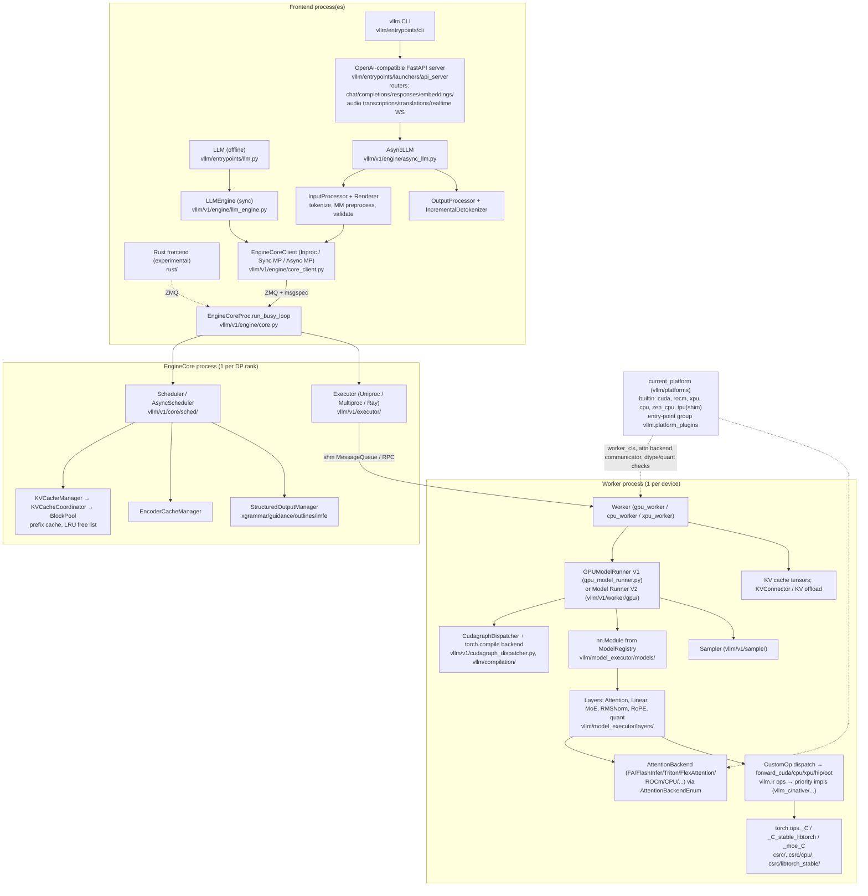
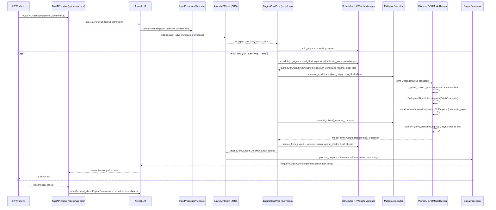
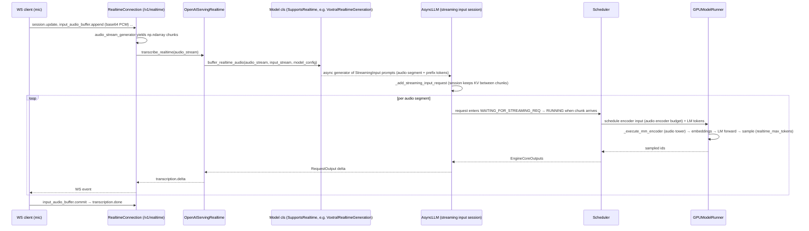

# vLLM (vllm-project/vllm) — Engine Analysis

| Field | Value |
| --- | --- |
| Local path | `/data/zhoutaichang/embedding_infer/vllm` |
| Remote | `https://github.com/vllm-project/vllm.git` (origin) |
| Branch | `main` |
| HEAD | `51da0ca66c8065619c79e35dff97aa99aeaf5644` — 2026-09-07 "[CI/Build] Unskip ColQwen3 multimodal pooling tests on Transformers v5 (#55588)" |
| `git describe --tags` | `v0.28.1rc0-500-g51da0ca66` (newest tag in checkout: `v0.29.0rc4`) |
| Working tree | clean (`git status --porcelain` empty) |
| Submodules | none registered (`git submodule status` prints nothing); kernel deps are fetched by CMake `FetchContent` at build time |
| Installed vs checkout | `pip show vllm` reports **0.28.0** installed in this machine's Python, while the checkout is ~500 commits past `v0.28.1rc0` (post-0.29.0rc4). Importing `vllm` from inside the checkout fails (`No module named 'vllm._C_stable_libtorch'`) because the C++/CUDA extensions are not built here. All statements below are about the **checkout**, not the installed wheel. |
| Analysis date | 2026-09-08 |
| Method | Read-only source/doc inspection (no builds, no execution). Evidence tags: [Verified] / [Inferred] / [Proposal] / [Unknown]. |

Reading guidance followed: `AGENTS.md` (`CLAUDE.md` is just `@AGENTS.md`) — no private/internal dirs are excluded for this repo.

## 0. Summary

- [Verified] vLLM is a Python-first LLM **serving stack** (OpenAI-compatible HTTP/gRPC/Python API) plus an **execution runtime** built on PyTorch: request scheduling + paged KV cache in an "EngineCore" process, model execution in worker processes, and hand-written CUDA/C++/Triton kernels bound through `torch.ops`. There is no standalone C/C++ runtime binary; PyTorch (`torch==2.13.0`) is a hard dependency ([pyproject.toml](../../vllm/pyproject.toml), [requirements/common.txt](../../vllm/requirements/common.txt)).
- [Verified] Only the **V1 engine** exists in-tree: `AsyncLLM`/`LLMEngine` → `EngineCoreClient` (ZMQ + msgspec) → `EngineCore` (`Scheduler` + `KVCacheManager`) → `Executor` → `Worker` → `GPUModelRunner` ([vllm/v1/engine/async_llm.py](../../vllm/vllm/v1/engine/async_llm.py), [vllm/v1/engine/core.py](../../vllm/vllm/v1/engine/core.py)).
- [Verified] In-tree platforms: **CUDA, ROCm, XPU (Intel GPU), CPU (x86/ARM/PowerPC/s390x/RISC-V, macOS CPU)** and a **Zen-CPU** variant. **TPU is a thin shim** that imports the out-of-tree `tpu_inference` package. Everything else (Ascend NPU, Apple Metal/MLX, Gaudi, ...) is an out-of-tree platform plugin discovered via the `vllm.platform_plugins` entry-point group ([vllm/platforms/__init__.py](../../vllm/vllm/platforms/__init__.py), [vllm/platforms/tpu.py](../../vllm/vllm/platforms/tpu.py)).
- [Verified] Backend substitution has three documented extension points: platform plugin (`Platform` subclass returning a `worker_cls`, attention backend, device communicator), out-of-tree models (`ModelRegistry.register_model` via `vllm.general_plugins`), and out-of-tree layer/op implementations (`CustomOp.register_oot`, `AttentionBackendEnum.CUSTOM`, and the newer `vllm.ir` op/impl registry) ([docs/design/plugin_system.md](../../vllm/docs/design/plugin_system.md), [vllm/model_executor/custom_op.py](../../vllm/vllm/model_executor/custom_op.py), [vllm/ir/op.py](../../vllm/vllm/ir/op.py)).
- [Verified] Request scheduling is a single token-budget loop with **no explicit prefill/decode phases** (chunked prefill, prefix caching, spec decode all fall out of `num_computed_tokens` vs `num_tokens_with_spec`), FCFS or priority queues, preemption-by-recompute, and an `AsyncScheduler` subclass that overlaps step N+1 scheduling with step N execution ([vllm/v1/core/sched/scheduler.py](../../vllm/vllm/v1/core/sched/scheduler.py#L535)).
- [Verified] KV cache is block-paged with hash-based prefix caching (sha256 default), LRU eviction via a doubly linked free list, and per-layer-type managers (full, sliding-window, chunked-local, Mamba, circular buffer) coordinated by a hybrid coordinator ([vllm/v1/core/block_pool.py](../../vllm/vllm/v1/core/block_pool.py), [vllm/v1/core/single_type_kv_cache_manager.py](../../vllm/vllm/v1/core/single_type_kv_cache_manager.py)).
- [Verified] Execution uses `torch.compile` (piecewise Dynamo/Inductor, "VLLM_COMPILE" mode) plus a CUDA-graph dispatcher with `NONE/PIECEWISE/FULL/FULL_DECODE_ONLY/FULL_AND_PIECEWISE` modes; all compilation/capture happens at startup, never on a live request ([vllm/config/compilation.py](../../vllm/vllm/config/compilation.py), [vllm/v1/cudagraph_dispatcher.py](../../vllm/vllm/v1/cudagraph_dispatcher.py), [docs/design/cuda_graphs.md](../../vllm/docs/design/cuda_graphs.md)).
- [Verified] A second, experimental **Model Runner V2** (`vllm/v1/worker/gpu/`) is now the default when Triton is available and no unsupported feature is requested; it is "async-first" and Triton-heavy ([vllm/config/vllm.py](../../vllm/vllm/config/vllm.py#L657), [docs/design/model_runner_v2.md](../../vllm/docs/design/model_runner_v2.md)).
- [Verified] **CPU backend** is real and ARM-aware: NEON/BF16/I8MM code paths in `csrc/cpu`, oneDNN + Arm Compute Library GEMMs, KleidiAI-backed dynamic-4-bit W4A8 kernels through `torch.ops.aten._dyn_quant_matmul_4bit`, thread binding, tcmalloc preload, aarch64 wheels and `arm64` Docker images; validated on AWS Graviton3 per docs ([cmake/cpu_extension.cmake](../../vllm/cmake/cpu_extension.cmake), [vllm/v1/attention/backends/cpu_attn.py](../../vllm/vllm/v1/attention/backends/cpu_attn.py#L481), [docs/getting_started/installation/cpu.arm.inc.md](../../vllm/docs/getting_started/installation/cpu.arm.inc.md)).
- [Verified] **TTS: none.** There is no speech-synthesis model, vocoder, codec decoder, or audio-output endpoint. What exists is audio **input** (Whisper, Ultravox, Qwen2-Audio, Voxtral, Kimi-Audio, MOSS-Audio, omni "thinker" halves, etc.), `/v1/audio/transcriptions|translations`, and a WebSocket `/v1/realtime` streaming-ASR path with a `SupportsRealtime` model interface ([vllm/model_executor/models/registry.py](../../vllm/vllm/model_executor/models/registry.py), [vllm/entrypoints/speech_to_text/realtime/serving.py](../../vllm/vllm/entrypoints/speech_to_text/realtime/serving.py)).
- [Verified] **VLA: one model.** `OpenVLAForActionPrediction` (DINOv2+SigLIP backbone, projector, Llama LM, discretized action-token vocabulary) is registered; no proprioceptive input channel, no diffusion/flow action head, no closed-loop control API. `DiffusionGemmaForBlockDiffusion` shows the runner can host a non-autoregressive block-diffusion *text* decoder ([vllm/model_executor/models/openvla.py](../../vllm/vllm/model_executor/models/openvla.py), [vllm/model_executor/models/diffusion_gemma.py](../../vllm/vllm/model_executor/models/diffusion_gemma.py)).
- [Verified] Jetson is recognized (`/etc/nv_tegra_release` check, non-NVML CUDA platform, `8.7`/`11.0` in supported CUDA archs, Thor `sm_110a` troubleshooting note) but there is no Jetson-specific build target, docs page, or CI job ([vllm/platforms/__init__.py](../../vllm/vllm/platforms/__init__.py#L76), [CMakeLists.txt](../../vllm/CMakeLists.txt#L112), [docs/usage/troubleshooting.md](../../vllm/docs/usage/troubleshooting.md)).
- [Verified] Apple Silicon: CPU-only in-tree (FP16/FP32, BF16 if `FEAT_BF16`, build from source, CI smoke-tested on macOS runners); GPU via the out-of-tree `vllm-metal` (MLX) plugin. No Android/Vulkan/OpenCL/QNN/NNAPI code anywhere in tree ([docs/getting_started/installation/cpu.apple.inc.md](../../vllm/docs/getting_started/installation/cpu.apple.inc.md), [docs/getting_started/installation/gpu.apple.inc.md](../../vllm/docs/getting_started/installation/gpu.apple.inc.md)).
- [Verified] GGUF and bitsandbytes quantization have been **moved out of tree** to plugins (`vllm-gguf-plugin`, `vllm-bnb-plugin`); in-tree formats are AWQ/GPTQ(+Marlin), FP8, compressed-tensors (INT8 W8A8, W4A8 int/fp8, ...), ModelOpt (FP4/MXFP8), MXFP4, TorchAO, Quark, INC, and an "online" method ([vllm/model_executor/layers/quantization/__init__.py](../../vllm/vllm/model_executor/layers/quantization/__init__.py), [docs/features/quantization/gguf.md](../../vllm/docs/features/quantization/gguf.md)).
- [Verified] Deployment footprint is server-class: 3+ processes (API server, engine core, one worker per device), ZMQ/msgspec IPC, FastAPI/uvicorn, `transformers>=5.10`, `torch 2.13`; wheel size CI cap is 500 MB ([docs/design/arch_overview.md](../../vllm/docs/design/arch_overview.md#L67), [.buildkite/check-wheel-size.py](../../vllm/.buildkite/check-wheel-size.py)).

## 1. Architecture overview

Key modules:

| Module | Path | Responsibility | Key symbols |
| --- | --- | --- | --- |
| Async engine front-end | [vllm/v1/engine/async_llm.py](../../vllm/vllm/v1/engine/async_llm.py) | Request admission, streaming outputs, abort/pause, streaming-input sessions | `AsyncLLM`, `generate`, `_add_streaming_input_request`, `abort` |
| Sync engine | [vllm/v1/engine/llm_engine.py](../../vllm/vllm/v1/engine/llm_engine.py) | Offline `step()` loop used by `LLM` | `LLMEngine.step`, `add_request` |
| Engine core | [vllm/v1/engine/core.py](../../vllm/vllm/v1/engine/core.py) | Owns scheduler, KV init, busy loop, ZMQ I/O threads | `EngineCore.step`, `step_with_batch_queue`, `_initialize_kv_caches`, `EngineCoreProc.run_busy_loop` |
| Core client | [vllm/v1/engine/core_client.py](../../vllm/vllm/v1/engine/core_client.py) | In-proc vs multiproc clients, request/response transport | `EngineCoreClient.make_client`, `InprocClient` |
| Input/output processing | [vllm/v1/engine/input_processor.py](../../vllm/vllm/v1/engine/input_processor.py), [vllm/v1/engine/output_processor.py](../../vllm/vllm/v1/engine/output_processor.py), [vllm/v1/engine/detokenizer.py](../../vllm/vllm/v1/engine/detokenizer.py) | Validation, MM cache injection, incremental detokenization, stop strings | `InputProcessor.process_inputs`, `OutputProcessor.process_outputs`, `FastIncrementalDetokenizer` |
| Scheduler | [vllm/v1/core/sched/scheduler.py](../../vllm/vllm/v1/core/sched/scheduler.py), [vllm/v1/core/sched/async_scheduler.py](../../vllm/vllm/v1/core/sched/async_scheduler.py), [vllm/v1/core/sched/request_queue.py](../../vllm/vllm/v1/core/sched/request_queue.py) | Token-budget scheduling, preemption, encoder budget, spec-decode slots | `Scheduler.schedule`, `update_from_output`, `_preempt_request`, `FCFSRequestQueue`, `PriorityRequestQueue` |
| KV cache manager | [vllm/v1/core/kv_cache_manager.py](../../vllm/vllm/v1/core/kv_cache_manager.py), [vllm/v1/core/kv_cache_coordinator.py](../../vllm/vllm/v1/core/kv_cache_coordinator.py), [vllm/v1/core/block_pool.py](../../vllm/vllm/v1/core/block_pool.py), [vllm/v1/core/kv_cache_utils.py](../../vllm/vllm/v1/core/kv_cache_utils.py) | Block allocation, prefix-cache lookup, eviction, events | `KVCacheManager.allocate_slots`, `get_computed_blocks`, `BlockPool.cache_full_blocks`, `FreeKVCacheBlockQueue`, `hash_block_tokens` |
| KV cache specs | [vllm/v1/kv_cache_interface.py](../../vllm/vllm/v1/kv_cache_interface.py), [vllm/v1/kv_cache_layout.py](../../vllm/vllm/v1/kv_cache_layout.py) | Per-layer spec types, physical layouts | `FullAttentionSpec`, `SlidingWindowSpec`, `MambaSpec`, `KVCacheConfig`, `KVCacheLayout` |
| Executor | [vllm/v1/executor/abstract.py](../../vllm/vllm/v1/executor/abstract.py), [vllm/v1/executor/multiproc_executor.py](../../vllm/vllm/v1/executor/multiproc_executor.py), [vllm/v1/executor/uniproc_executor.py](../../vllm/vllm/v1/executor/uniproc_executor.py) | Spawns workers, broadcasts `execute_model`/`sample_tokens` | `Executor.get_class`, `MultiprocExecutor`, `WorkerProc` |
| Workers | [vllm/v1/worker/worker_base.py](../../vllm/vllm/v1/worker/worker_base.py), [vllm/v1/worker/gpu_worker.py](../../vllm/vllm/v1/worker/gpu_worker.py), [vllm/v1/worker/cpu_worker.py](../../vllm/vllm/v1/worker/cpu_worker.py), [vllm/v1/worker/xpu_worker.py](../../vllm/vllm/v1/worker/xpu_worker.py) | Device init, memory profiling, warmup/graph capture, sleep mode | `Worker.init_device`, `determine_available_memory`, `compile_or_warm_up_model`, `CPUWorker` |
| Model runner V1 | [vllm/v1/worker/gpu_model_runner.py](../../vllm/vllm/v1/worker/gpu_model_runner.py), [vllm/v1/worker/cpu_model_runner.py](../../vllm/vllm/v1/worker/cpu_model_runner.py) | Persistent batch, input prep, MM encoder execution, forward, sampling, KV alloc | `GPUModelRunner.execute_model`, `_dummy_run`, `capture_model`, `initialize_kv_cache`, `load_model`, `CPUModelRunner` |
| Model runner V2 | [vllm/v1/worker/gpu/model_runner.py](../../vllm/vllm/v1/worker/gpu/model_runner.py), [vllm/v1/worker/gpu/README.md](../../vllm/vllm/v1/worker/gpu/README.md) | Async-first rewrite; fixed-row persistent state, Gumbel sampling | `GPUModelRunner.execute_model`, `prepare_inputs`, `sample_tokens` |
| Attention | [vllm/v1/attention/backend.py](../../vllm/vllm/v1/attention/backend.py), [vllm/v1/attention/backends/registry.py](../../vllm/vllm/v1/attention/backends/registry.py), [vllm/v1/attention/selector.py](../../vllm/vllm/v1/attention/selector.py) | Backend ABC, enum registry with overrides, selection | `AttentionBackend`, `AttentionMetadataBuilder`, `AttentionBackendEnum`, `get_attn_backend` |
| Platforms | [vllm/platforms/interface.py](../../vllm/vllm/platforms/interface.py), [vllm/platforms/__init__.py](../../vllm/vllm/platforms/__init__.py), [vllm/platforms/cpu.py](../../vllm/vllm/platforms/cpu.py), [vllm/platforms/cuda.py](../../vllm/vllm/platforms/cuda.py) | Device abstraction and config mutation | `Platform`, `PlatformEnum`, `CpuArchEnum`, `resolve_current_platform_cls_qualname`, `CpuPlatform.check_and_update_config` |
| Custom ops / IR | [vllm/model_executor/custom_op.py](../../vllm/vllm/model_executor/custom_op.py), [vllm/ir/op.py](../../vllm/vllm/ir/op.py), [vllm/kernels/vllm_c.py](../../vllm/vllm/kernels/vllm_c.py) | Per-platform forward dispatch; provider-priority op impls | `CustomOp.dispatch_forward`, `register_oot`, `IrOp.register_impl`, `IrOp.dispatch` |
| Compilation | [vllm/compilation/backends.py](../../vllm/vllm/compilation/backends.py), [vllm/compilation/cuda_graph.py](../../vllm/vllm/compilation/cuda_graph.py), [vllm/compilation/decorators.py](../../vllm/vllm/compilation/decorators.py), [vllm/config/compilation.py](../../vllm/vllm/config/compilation.py) | Dynamo piecewise compile, Inductor passes, CUDA graph wrappers | `CompilationMode`, `CUDAGraphMode`, `CompilationConfig` |
| Quantization | [vllm/model_executor/layers/quantization/__init__.py](../../vllm/vllm/model_executor/layers/quantization/__init__.py), [vllm/model_executor/kernels/linear/mixed_precision/cpu.py](../../vllm/vllm/model_executor/kernels/linear/mixed_precision/cpu.py), [vllm/model_executor/kernels/linear/mixed_precision/dynamic_4bit.py](../../vllm/vllm/model_executor/kernels/linear/mixed_precision/dynamic_4bit.py) | Method registry, per-kernel `can_implement` selection | `QUANTIZATION_METHODS`, `CPUWNA16LinearKernel`, `Dynamic4bitLinearKernel` |
| Model registry | [vllm/model_executor/models/registry.py](../../vllm/vllm/model_executor/models/registry.py), [vllm/model_executor/models/interfaces.py](../../vllm/vllm/model_executor/models/interfaces.py) | Arch → module map, OOT registration, capability protocols | `_MULTIMODAL_MODELS`, `ModelRegistry.register_model`, `SupportsMultiModal`, `SupportsTranscription`, `SupportsRealtime` |
| Multimodal | [vllm/multimodal/registry.py](../../vllm/vllm/multimodal/registry.py), [vllm/multimodal/processing/processor.py](../../vllm/vllm/multimodal/processing/processor.py), [vllm/multimodal/cache.py](../../vllm/vllm/multimodal/cache.py), [vllm/multimodal/audio.py](../../vllm/vllm/multimodal/audio.py) | HF-processor wrapping, prompt updates, processor caches, audio resample/split | `MultiModalRegistry`, `BaseMultiModalProcessor`, `MultiModalProcessorCache*`, `AudioResampler`, `split_audio` |
| Sampling | [vllm/v1/sample/sampler.py](../../vllm/vllm/v1/sample/sampler.py), [vllm/v1/sample/ops/topk_topp_sampler.py](../../vllm/vllm/v1/sample/ops/topk_topp_sampler.py), [vllm/v1/sample/rejection_sampler.py](../../vllm/vllm/v1/sample/rejection_sampler.py) | Temperature/penalties/logits processors, top-k/p, spec-decode rejection | `Sampler.forward`, `TopKTopPSampler` |
| Entrypoints | [vllm/entrypoints/llm.py](../../vllm/vllm/entrypoints/llm.py), [vllm/entrypoints/launchers/api_server/entry.py](../../vllm/vllm/entrypoints/launchers/api_server/entry.py), [vllm/entrypoints/speech_to_text/base/serving.py](../../vllm/vllm/entrypoints/speech_to_text/base/serving.py), [vllm/entrypoints/grpc_server.py](../../vllm/vllm/entrypoints/grpc_server.py) | Python API, HTTP server, ASR endpoints, gRPC | `LLM.generate`, `run_server`, `SpeechToTextBaseServing`, `OpenAIServingRealtime` |
| Tokenizers | [vllm/tokenizers/registry.py](../../vllm/vllm/tokenizers/registry.py), [vllm/tokenizers/fastokens.py](../../vllm/vllm/tokenizers/fastokens.py) | HF / Mistral / custom tokenizer modes, optional Rust `fastokens` patch | `get_tokenizer`, `_TokenizerRegistry` |
| C++/CUDA kernels | [csrc/libtorch_stable/torch_bindings.cpp](../../vllm/csrc/libtorch_stable/torch_bindings.cpp), [csrc/cpu/torch_bindings.cpp](../../vllm/csrc/cpu/torch_bindings.cpp), [CMakeLists.txt](../../vllm/CMakeLists.txt), [cmake/cpu_extension.cmake](../../vllm/cmake/cpu_extension.cmake) | Op registration, build targets, ISA detection | `TORCH_LIBRARY_EXPAND`, `_C`, `_C_stable_libtorch`, `_moe_C_stable_libtorch` |

## 2. Device layer

**Platform abstraction.** [Verified] Everything device-specific is behind `vllm.platforms.current_platform`, an instance of a `Platform` subclass ([vllm/platforms/interface.py](../../vllm/vllm/platforms/interface.py#L134)). `PlatformEnum` has `CUDA, ROCM, TPU, XPU, CPU, OOT, UNSPECIFIED`; `CpuArchEnum` has `X86, ARM, POWERPC, S390X, RISCV, OTHER, UNKNOWN` ([interface.py#L67](../../vllm/vllm/platforms/interface.py#L67)). The interface (~1,340 lines) covers: `get_attn_backend_cls`, `get_vit_attn_backend`, `get_device_capability/name/uuid/total_memory`, `set_device`, `inference_mode`, `check_and_update_config` (mutates `VllmConfig`, sets `worker_cls`), `get_device_communicator_cls`, `get_punica_wrapper` (LoRA), `supports_fp8/mx`, `fp8_dtype`, `use_custom_allreduce`, `get_static_graph_wrapper_cls`, `support_static_graph_mode`, `import_kernels`, `import_ir_kernels`, `get_default_ir_op_priority`, `get_cpu_architecture`, `is_pin_memory_available`, `get_global_graph_pool`, `stateless_init_device_torch_dist_pg`.

**Discovery/selection.** [Verified] `resolve_current_platform_cls_qualname()` ([vllm/platforms/__init__.py#L222](../../vllm/vllm/platforms/__init__.py#L222)) probes builtin detectors `{tpu, cuda, rocm, xpu, cpu}` and every `vllm.platform_plugins` entry point; exactly one may activate (two OOT or two builtin → `RuntimeError`), OOT wins over builtin, none → `UnspecifiedPlatform`. `VLLM_TARGET_DEVICE=cpu` short-circuits to CPU. Detection details:
- CUDA: `pynvml` device count > 0 and the wheel version string does not contain `cpu`; if NVML is missing, a **Jetson** check (`/etc/nv_tegra_release` or `/sys/class/tegra-firmware`) still enables CUDA ([__init__.py#L76](../../vllm/vllm/platforms/__init__.py#L76)). `CudaPlatform` is `NvmlCudaPlatform` or `NonNvmlCudaPlatform` chosen at import time ([cuda.py#L1040](../../vllm/vllm/platforms/cuda.py#L1040)).
- ROCm: `amdsmi` handles > 0, or WSL fallback via `torch.version.hip`.
- XPU: `torch.xpu.is_available()`.
- CPU: `VLLM_TARGET_DEVICE == "cpu"`, or a `+cpu` wheel version, or `sys.platform == darwin` (macOS is always CPU). AMD CPUs with AVX-512 and `zentorch` installed get `ZenCpuPlatform` ([vllm/platforms/zen_cpu.py](../../vllm/vllm/platforms/zen_cpu.py)).
- TPU: `libtpu` importable → `vllm.platforms.tpu.TpuPlatform`, which is just `from tpu_inference.platforms import TpuPlatform` ([vllm/platforms/tpu.py](../../vllm/vllm/platforms/tpu.py)); i.e. TPU execution code is **not** in this tree.

**In-tree backend inventory.** [Verified]

| Platform | File | `worker_cls` | dist backend | Notes |
| --- | --- | --- | --- | --- |
| CUDA | [vllm/platforms/cuda.py](../../vllm/vllm/platforms/cuda.py) | `vllm.v1.worker.gpu_worker.Worker` ([#L325](../../vllm/vllm/platforms/cuda.py#L325)) | nccl | dtype: bf16 needs CC≥8.0, fp16 needs CC≥6.0; `is_integrated_gpu` via `torch.cuda.get_device_properties(...).is_integrated` ([#L714](../../vllm/vllm/platforms/cuda.py#L714)) |
| ROCm | [vllm/platforms/rocm.py](../../vllm/vllm/platforms/rocm.py) | `vllm.v1.worker.gpu_worker.Worker` ([#L916](../../vllm/vllm/platforms/rocm.py#L916)) | nccl (rccl) | shares the GPU worker; AITER/Triton attention backends |
| XPU | [vllm/platforms/xpu.py](../../vllm/vllm/platforms/xpu.py) | `vllm.v1.worker.xpu_worker.XPUWorker` ([#L363](../../vllm/vllm/platforms/xpu.py#L363)) | xccl | own worker + `xpu_model_runner.py` |
| CPU | [vllm/platforms/cpu.py](../../vllm/vllm/platforms/cpu.py) | `vllm.v1.worker.cpu_worker.CPUWorker` ([#L282](../../vllm/vllm/platforms/cpu.py#L282)) | gloo | see below |
| Zen CPU | [vllm/platforms/zen_cpu.py](../../vllm/vllm/platforms/zen_cpu.py) | inherits CPU | gloo | bf16/fp32 only, zentorch GEMM |
| TPU | [vllm/platforms/tpu.py](../../vllm/vllm/platforms/tpu.py) | (in `tpu_inference`) | — | shim only; `tpu_input_batch.py` is a leftover |
| OOT | via plugin | plugin-defined | plugin-defined | e.g. Ascend, Metal, Gaudi (not in tree) |

**Memory allocation / pools.** [Verified] GPU worker profiles memory once (`determine_available_memory` → `model_runner.profile_run()` under `memory_profiling`, honoring `gpu_memory_utilization` or an explicit `kv_cache_memory_bytes`) ([gpu_worker.py#L525](../../vllm/vllm/v1/worker/gpu_worker.py#L525)); `EngineCore._initialize_kv_caches` then computes `KVCacheConfig` (block count, groups, layout) and calls `initialize_from_config` + `compile_or_warm_up_model` ([core.py#L254](../../vllm/vllm/v1/engine/core.py#L254)). Sleep mode / weight offload use a custom CUDA-VMM allocator (`cumem_allocator` extension, [csrc/cumem_allocator.cpp](../../vllm/csrc/cumem_allocator.cpp), [vllm/device_allocator/cumem.py](../../vllm/vllm/device_allocator/cumem.py)); XPU has an analogous `xpumem.py`. CUDA graphs share one global graph memory pool (`Platform.get_global_graph_pool`). CPU: KV space is `VLLM_CPU_KVCACHE_SPACE` (GiB) or `kv_cache_memory_bytes`, plain `torch` CPU tensors; `tcmalloc` and PyTorch's `libgomp` are force-`LD_PRELOAD`ed on Linux x86/ARM/s390x ([cpu.py#L369](../../vllm/vllm/platforms/cpu.py#L369)).

**Host↔device transfers and streams.** [Verified] The runner keeps `CpuGpuBuffer` pairs (pinned host + device) and copies inputs per step; async output copy uses a dedicated stream (`_get_or_create_async_output_copy_stream`, [gpu_model_runner.py#L1181](../../vllm/vllm/v1/worker/gpu_model_runner.py#L1181)). MRV2 assumes "the core model execution loop is a CUDA stream with no CPU synchronization points" ([docs/design/model_runner_v2.md](../../vllm/docs/design/model_runner_v2.md)). CPU has no streams; `_set_torch_accelerator_to_noop` stubs stream/sync calls and `VLLM_DISABLE_SHARED_EXPERTS_STREAM=1` is forced ([cpu_model_runner.py#L244](../../vllm/vllm/v1/worker/cpu_model_runner.py#L244), [cpu.py#L356](../../vllm/vllm/platforms/cpu.py#L356)). Collectives go through `DeviceCommunicatorBase` subclasses: `cuda_communicator` (NCCL, custom all-reduce, quick-reduce, symm-mem), `cpu_communicator` (gloo + shared-memory `shm_allreduce` ops from `csrc/cpu/shm.cpp`), `xpu_communicator`, `ray_communicator` ([vllm/distributed/device_communicators/](../../vllm/vllm/distributed/device_communicators/base_device_communicator.py)).

**CPU platform specifics (ARM edge target).** [Verified]
- `supported_dtypes`: x86/aarch64 → bf16/fp16/fp32; macOS ARM → fp16/fp32 (+bf16 only if `sysctl hw.optional.arm.FEAT_BF16` = 1); RISC-V → bf16/fp16/fp32; POWER → bf16/fp32/fp16 ([cpu.py#L107](../../vllm/vllm/platforms/cpu.py#L107)).
- `check_and_update_config` forces: `async_scheduling=False`, `mp` executor (OpenMP needs it), `cudagraph_capture_sizes=[]`, compilation mode `DYNAMO_TRACE_ONCE` with Inductor (`eager` only under `VLLM_CPU_CI_ENV`), compilation disabled if LoRA, `+gelu/+gelu_tanh/+gelu_and_mul` custom ops enabled on ARM, `spawn` start method, `TORCHINDUCTOR_COMPILE_THREADS=1`, MLA on non-AMX disables chunked prefill/prefix caching ([cpu.py#L198](../../vllm/vllm/platforms/cpu.py#L198)).
- Kernel import: x86 loads `_C`, `_C_AVX512` or `_C_AVX2` depending on runtime flags; every other arch loads `_C` ([cpu.py#L553](../../vllm/vllm/platforms/cpu.py#L553)).
- Attention ISA: `amx` (x86 AMX + bf16 + block%32) → `neon` (ARM, block%32, "NEON FMLA and BFMMLA (bf16)") → `rvv` → `vxe` → `vsx` → `vec`/`vec16` ([cpu_attn.py#L481](../../vllm/vllm/v1/attention/backends/cpu_attn.py#L481)); implementations live in [csrc/cpu/cpu_attn_neon.hpp](../../vllm/csrc/cpu/cpu_attn_neon.hpp), [csrc/cpu/cpu_attn_neon_bfmmla.hpp](../../vllm/csrc/cpu/cpu_attn_neon_bfmmla.hpp), [csrc/cpu/cpu_types_arm.hpp](../../vllm/csrc/cpu/cpu_types_arm.hpp).
- NUMA/thread binding: `CPUWorker.__init__` binds memory nodes and OpenMP threads (`VLLM_CPU_OMP_THREADS_BIND=auto|nobind|list`, `VLLM_CPU_NUM_OF_RESERVED_CPU`, `CPU_VISIBLE_MEMORY_NODES`) ([cpu_worker.py#L33](../../vllm/vllm/v1/worker/cpu_worker.py#L33), [docs/getting_started/installation/cpu.md](../../vllm/docs/getting_started/installation/cpu.md#L150)).
- Pipeline/tensor parallel on CPU use gloo + shm ops; docs recommend TP = number of NUMA nodes ([cpu.md](../../vllm/docs/getting_started/installation/cpu.md)).

CPU-related environment variables ([vllm/envs.py#L877](../../vllm/vllm/envs.py#L877), [docs/getting_started/installation/cpu.md#L150](../../vllm/docs/getting_started/installation/cpu.md#L150)) [Verified]:

| Variable | Default | Effect |
| --- | --- | --- |
| `VLLM_TARGET_DEVICE` | `cuda` | Build/select target (`cpu` forces CPU platform even on GPU hosts) |
| `VLLM_CPU_KVCACHE_SPACE` | unset (0) | KV cache size in GiB (legacy; `kv_cache_memory_bytes` preferred) |
| `VLLM_CPU_OMP_THREADS_BIND` | `auto` | Core list / `auto` (per-NUMA) / `nobind` for OpenMP threads |
| `VLLM_CPU_NUM_OF_RESERVED_CPU` | unset | Cores left free for the frontend per rank |
| `CPU_VISIBLE_MEMORY_NODES` | unset | NUMA node mask, like `CUDA_VISIBLE_DEVICES` |
| `VLLM_CPU_ATTN_SPLIT_KV` | `1` | Split-KV attention on CPU |
| `VLLM_CPU_INT4_W4A8` | `1` | Enable dynamic 4-bit W4A8 path |
| `VLLM_ZENTORCH_WEIGHT_PREPACK` | `1` | Zen: prepack linear weights for ZenDNN |
| `VLLM_CPU_CI_ENV` | `0` | Internal: eager instead of Inductor |
| `VLLM_ENABLE_V1_MULTIPROCESSING` | `1` | `0` = in-process engine core (CPU still forces the `mp` executor) |
| `VLLM_USE_V2_MODEL_RUNNER` | unset | Force V1/V2 model runner (auto: V2 if Triton present and no unsupported features) |
| `VLLM_PLUGINS` | unset | Allow-list of plugin names to load |

**Portability matrix (what is actually in tree).** [Verified] Linux x86_64 (CUDA/ROCm/XPU/CPU), Linux aarch64 (CUDA e.g. GH200 CI job, CPU), Linux ppc64le/s390x/riscv64 (CPU), macOS arm64 (CPU only), WSL2 (CUDA/ROCm detection). [Verified] No Windows native support code; no Android/iOS bindings; no Vulkan/OpenCL/Metal/QNN/NNAPI kernels. CUDA arch list depends on nvcc: `7.5;8.0;8.6;8.7;8.9;9.0;10.0;(10.7);11.0;12.0` for CUDA ≥13.0 — `8.7` = Jetson Orin, `11.0` = Thor ([CMakeLists.txt#L112](../../vllm/CMakeLists.txt#L112)). ROCm arch list includes `gfx1150/1151/1152/1153` (RDNA3.5 APUs) ([CMakeLists.txt#L52](../../vllm/CMakeLists.txt#L52)).

## 3. Kernel layer

**Operator set and registration.** [Verified] Three C++ extension families:
- CUDA `_C_stable_libtorch` (132 `def(` ops in [csrc/libtorch_stable/torch_bindings.cpp](../../vllm/csrc/libtorch_stable/torch_bindings.cpp), registered with `STABLE_TORCH_LIBRARY` so the wheel is ABI-stable across torch minors) plus `_moe_C_stable_libtorch`; legacy `_C` remains ROCm-only ("CUDA ops migrated to `_C_stable_libtorch`", [CMakeLists.txt#L367](../../vllm/CMakeLists.txt#L367)). Contents: activations, layernorm(+quant fusion), RoPE, fused QK-norm+RoPE, cache kernels, `merge_attn_states`, MLA helpers, sampler/top-k, MoE align/topk/permute, Marlin/Machete/CUTLASS/AWQ/GPTQ/FP4/FP8/INT8 GEMMs, custom all-reduce.
- CPU `_C` (73 `def(` ops in [csrc/cpu/torch_bindings.cpp](../../vllm/csrc/cpu/torch_bindings.cpp#L357)): `silu_and_mul`, `gelu_*`, `rms_norm`, `fused_add_rms_norm`, `rotary_embedding`, `onednn_mm`/`onednn_scaled_mm`, `static/dynamic_scaled_int8_quant`, `fp8_scaled_mm_cpu`, `weight_packed_linear`, `fused_experts_cpu`, `cpu_fused_moe`, `causal_conv1d_*_cpu`, `decode/extend_attention_cpu`, `shm_allreduce/gather`, `dynamic_4bit_int_moe`, plus ARM-only (`ARM_I8MM_SUPPORT && ARM_BF16_SUPPORT && !__APPLE__`) `prepack_moe_weight_int8`/`cpu_fused_moe_int8` ([torch_bindings.cpp#L690](../../vllm/csrc/cpu/torch_bindings.cpp#L690)). Micro-GEMMs per ISA in [csrc/cpu/micro_gemm/](../../vllm/csrc/cpu/micro_gemm/cpu_micro_gemm_neon.hpp) (`amx`, `neon`, `int8_neon`, `rvv`, `vec`, `vsx`).
- Externally fetched kernel projects (CUDA only): vllm-flash-attn, FlashMLA, FlashKDA, MSA/fmha_sm100, tml-fa4, qutlass, DeepGEMM, Triton kernels ([cmake/external_projects/](../../vllm/cmake/external_projects/vllm_flash_attn.cmake)). Pip-side kernel deps: `flashinfer-python`, `tilelang`, `nvidia-cutlass-dsl`, `quack-kernels`, `humming-kernels`, `tokenspeed-mla` ([requirements/cuda.txt](../../vllm/requirements/cuda.txt)).

Python-side Triton kernels are spread across `vllm/model_executor/layers/**` (fused MoE, Mamba, RoPE, etc.), `vllm/v1/sample/ops/topk_topp_triton.py`, `vllm/v1/worker/gpu/*`, and [vllm/kernels/triton/](../../vllm/vllm/kernels/triton/qkv_padded_fp8_quant.py); Helion and "oink" kernels exist under [vllm/kernels/](../../vllm/vllm/kernels/oink_ops.py).

**Dispatch mechanism.** [Verified] Two coexisting mechanisms:
1. `CustomOp` (nn.Module subclasses such as `RMSNorm`, `SiluAndMul`, `RotaryEmbedding`): `dispatch_forward()` picks `forward_hip/cpu/tpu/xpu/oot/cuda` by `current_platform`, or `forward_native` (pure torch, optionally `torch.compile`d) when the op is disabled. Enablement is per-op via `CompilationConfig.custom_ops` (`all`/`none` + `+op`/`-op`); with Inductor the default is `none`, so Inductor generates fused Triton for them ([custom_op.py#L174](../../vllm/vllm/model_executor/custom_op.py#L174), [docs/design/custom_op.md](../../vllm/docs/design/custom_op.md)). OOT plugins replace an in-tree class by name with `@CustomOp.register_oot(name=...)` / `@PluggableLayer.register_oot` — instantiation of the in-tree class returns the OOT subclass ([custom_op.py#L103](../../vllm/vllm/model_executor/custom_op.py#L103)).
2. `vllm.ir` (newer): `@register_op` declares a functional op (`rms_norm`, `fused_add_rms_norm` today, [vllm/ir/ops/layernorm.py](../../vllm/vllm/ir/ops/layernorm.py)); providers register implementations with `op.register_impl("vllm_c", supported=..., supports_args=...)`; `IrOp.dispatch` walks a per-op **priority list** (platform default e.g. `["vllm_c","native"]` when not compiling, `["native"]` under Inductor, `["oink", ...]` if `VLLM_USE_OINK_OPS`) and returns the first impl whose `supports_args` passes ([ir/op.py#L244](../../vllm/vllm/ir/op.py#L244), [cuda.py#L723](../../vllm/vllm/platforms/cuda.py#L723), [docs/design/vllm_ir.md](../../vllm/docs/design/vllm_ir.md)).
3. Attention: `AttentionBackendEnum` maps names to class paths; `register_backend` can override any member (including `CUSTOM`) at runtime; the platform's `get_attn_backend_cls` ranks candidates by device capability, head size, dtype, block size, sliding window, etc. via `AttentionBackend.validate_configuration` ([registry.py](../../vllm/vllm/v1/attention/backends/registry.py), [cuda.py#L434](../../vllm/vllm/platforms/cuda.py#L434), [backend.py#L270](../../vllm/vllm/v1/attention/backend.py#L270)). In-tree backends: FLASH_ATTN(+DIFFKV), TRITON_ATTN(+DIFFKV), FLASHINFER, FLEX_ATTENTION, ROCM_ATTN/AITER variants, ~12 MLA variants, HPC_ATTN, B12X, TURBOQUANT, NO_ATTENTION, CPU_ATTN, CPU_MLA, AMX_MLA; Mamba-family backends MAMBA1/MAMBA2/SHORT_CONV/LINEAR/GDN_ATTN.
Default attention backend candidates per platform [Verified]:

| Platform | Candidate order (non-MLA, decoder) | Source |
| --- | --- | --- |
| CUDA CC 10.x (Blackwell) | FLASHINFER → FLASH_ATTN → TRITON_ATTN → FLEX_ATTENTION | [cuda.py#L157](../../vllm/vllm/platforms/cuda.py#L157) |
| CUDA other (≥8.0) | FLASH_ATTN → FLASHINFER → TRITON_ATTN → FLEX_ATTENTION | [cuda.py#L165](../../vllm/vllm/platforms/cuda.py#L165) |
| CUDA MLA (CC 9.0/10.x/12.x) | FLASHINFER_MLA / FLASH_ATTN_MLA / CUTLASS_MLA / FLASHMLA variants by CC | [cuda.py#L85](../../vllm/vllm/platforms/cuda.py#L85) |
| ROCm | ROCM_AITER_UNIFIED_ATTN / ROCM_AITER_FA / ROCM_ATTN → TRITON_ATTN → TURBOQUANT; MLA: ROCM_AITER_MLA / TRITON_MLA | [rocm.py#L463](../../vllm/vllm/platforms/rocm.py#L463) |
| XPU | FLASH_ATTN (SYCL) / TRITON_ATTN; MLA: TRITON_MLA / XPU_MLA_SPARSE | [xpu.py#L145](../../vllm/vllm/platforms/xpu.py#L145) |
| CPU | CPU_ATTN (ISA-dispatched); MLA: AMX_MLA (x86 AMX) or CPU_MLA | [cpu.py#L138](../../vllm/vllm/platforms/cpu.py#L138) |
| ViT encoders | FLASH_ATTN / TRITON_ATTN / FLASHINFER / TORCH_SDPA by platform | [cuda.py#L536](../../vllm/vllm/platforms/cuda.py#L536) |

4. Linear/quant kernels: `choose_mp_linear_kernel` iterates `MPLinearKernel` subclasses and picks the first whose `can_implement(config)` succeeds ([compressed_tensors_w4a8_int.py#L104](../../vllm/vllm/model_executor/layers/quantization/compressed_tensors/schemes/compressed_tensors_w4a8_int.py#L104)); CPU unquantized GEMM is chosen at load time by `dispatch_cpu_unquantized_gemm`: zentorch → sgl-kernel `weight_packed_linear` (AMX only, weight ≤1 MiB) → oneDNN `onednn_mm` (non-POWER) → `torch.nn.functional.linear` ([layers/utils.py#L434](../../vllm/vllm/model_executor/layers/utils.py#L434)).

**Quantization formats and where dequant happens.** [Verified] `QUANTIZATION_METHODS`: awq, auto_awq, fp8, fbgemm_fp8 (deprecated), fp_quant (deprecated), modelopt, modelopt_fp4, modelopt_mxfp8, modelopt_mixed, auto_gptq, gptq, gptq_marlin, awq_marlin, humming, compressed-tensors, experts_int8, quark, moe_wna16, torchao, inc, mxfp4, gpt_oss_mxfp4, deepseek_v4_fp8, online (+ online sub-modes fp8_per_tensor/per_block/per_channel, int8_per_channel_weight_only, nvfp4_per_token, mxfp8) ([quantization/__init__.py#L16](../../vllm/vllm/model_executor/layers/quantization/__init__.py#L16)). Third-party configs can be added with `register_quantization_config`. Weight-only formats are dequantized **inside fused GEMM kernels** (Marlin/Machete/CUTLASS W4A8, oneDNN int8 on CPU, KleidiAI dynamic-4-bit on ARM via `torch.ops.aten._dyn_quant_matmul_4bit`, [dynamic_4bit.py#L14](../../vllm/vllm/model_executor/kernels/linear/mixed_precision/dynamic_4bit.py#L14)); activation quant (fp8/int8) is fused into RMSNorm/SiLU kernels where available (`fused_layernorm_dynamic_per_token_quant`, `fused_silu_mul_block_quant`). KV cache dtypes: `auto, float16, bfloat16, fp8, fp8_e4m3, fp8_e5m2, fp8_inc, fp8_ds_mla, nvfp4_ds_mla, turboquant_*, int4/int8/fp8_per_token_head, nvfp4, nvfp4_4over6` ([vllm/config/cache.py#L39](../../vllm/vllm/config/cache.py#L39)); on CPU FP8 KV requires x86 AVX-512/AMX ([cpu_attn.py#L500](../../vllm/vllm/v1/attention/backends/cpu_attn.py#L500)). [Verified] Repo-reported hardware/format matrix for Arm CPU: only llm-compressor INT8 W8A8 and W4A8 marked supported; AWQ/GPTQ/Marlin/GGUF marked unsupported ([docs/features/quantization/README.md#L50](../../vllm/docs/features/quantization/README.md#L50)). GGUF and bitsandbytes now require `vllm-gguf-plugin` / `vllm-bnb-plugin` ([gguf.md](../../vllm/docs/features/quantization/gguf.md), [bnb.md](../../vllm/docs/features/quantization/bnb.md)).

**Compilation / JIT / graph capture.** [Verified] `CompilationMode`: `NONE`, `STOCK_TORCH_COMPILE`, `DYNAMO_TRACE_ONCE`, `VLLM_COMPILE` (piecewise: model is split at attention/`splitting_ops`, each piece compiled by Inductor with guard dropping, artifacts cached under `~/.cache/vllm/torch_compile_cache`) ([config/compilation.py#L37](../../vllm/vllm/config/compilation.py#L37), [docs/design/torch_compile.md](../../vllm/docs/design/torch_compile.md)). `CUDAGraphMode`: `NONE, PIECEWISE, FULL, FULL_DECODE_ONLY, FULL_AND_PIECEWISE`; `CudagraphDispatcher.dispatch` maps a `BatchDescriptor` (padded size, uniform-decode flag, LoRA case) to a captured graph or falls back to eager ([cudagraph_dispatcher.py#L235](../../vllm/vllm/v1/cudagraph_dispatcher.py#L235)). Optimization levels `-O0..-O3` set these defaults ([docs/design/optimization_levels.md](../../vllm/docs/design/optimization_levels.md)). Warmup: `Worker.compile_or_warm_up_model` runs `_dummy_run` for compile sizes, `kernel_warmup`, `capture_model()` (largest→smallest), then a sampler dummy run; all before the first request ([gpu_worker.py#L762](../../vllm/vllm/v1/worker/gpu_worker.py#L762)). ViT encoders have their own CUDA-graph path ([vllm/v1/worker/encoder_cudagraph.py](../../vllm/vllm/v1/worker/encoder_cudagraph.py), [docs/design/cuda_graphs_multimodal.md](../../vllm/docs/design/cuda_graphs_multimodal.md)). CPU uses `DYNAMO_TRACE_ONCE` + Inductor C++ codegen (no graphs) ([cpu.py#L292](../../vllm/vllm/platforms/cpu.py#L292)).

**Fallback when an op is unsupported.** [Verified] `CustomOp` → `forward_native` (pure PyTorch). `vllm.ir` → the last provider in the priority list must accept all args (normally `native`). Attention → candidate list ordered by platform; if none validates, an error lists why each was rejected ([cuda.py#L434](../../vllm/vllm/platforms/cuda.py#L434)). CPU without Triton-CPU → `_postprocess_triton` monkey-patches Triton kernels (slot mapping, EAGLE/DFlash input prep, rejection sampler, Mamba memcpy) with C++/torch equivalents ([cpu_model_runner.py#L65](../../vllm/vllm/v1/worker/cpu_model_runner.py#L65)); with Triton-CPU present the patches are skipped. Missing compiled extension modules only log a warning at import (`import_kernels`) but any op call then fails.

**How to add a custom op / backend (extension points).** [Verified]
- New platform: package with `entry_points={"vllm.platform_plugins": [...]}` returning a `Platform` subclass path; implement `check_and_update_config` (set `worker_cls`), `get_attn_backend_cls`, `get_device_communicator_cls`; a `WorkerBase` subclass; an `AttentionBackend`; optional OOT `CustomOp`s. Reference skeleton: [tests/plugins/vllm_add_dummy_platform/](../../vllm/tests/plugins/vllm_add_dummy_platform/setup.py) with `dummy_platform.py`, `dummy_attention_backend.py`, `dummy_custom_ops.py` ([docs/design/plugin_system.md](../../vllm/docs/design/plugin_system.md)).
- New op impl: `@ir.ops.<op>.register_impl("provider", supported=..., supports_args=...)` or a `CustomOp.forward_<platform>`; C++ ops via `torch.ops` (see `vllm/_custom_ops.py`).
- New attention backend: `register_backend(AttentionBackendEnum.CUSTOM, "pkg.mod.Class")`.
- New model: `ModelRegistry.register_model("Arch", "pkg.mod:Class")` from a `vllm.general_plugins` entry point ([docs/contributing/model/registration.md](../../vllm/docs/contributing/model/registration.md)).
- New quant method: `register_quantization_config`.
- Plugin loading is gated by `VLLM_PLUGINS` and happens in every process ([vllm/plugins/__init__.py](../../vllm/vllm/plugins/__init__.py)). [Verified] Triton ops cannot be overridden via the OOT mechanism ("Custom way doesn't work for triton ops now", plugin doc).

## 4. Model runner

**Model loading / formats.** [Verified] Models are HF-format directories loaded by `ModelRegistry` → architecture class → `DefaultModelLoader` (safetensors/pt/npcache), or alternative loaders: `dummy`, `fastsafetensors`, `instanttensor`, `ipc_cache`, `mistral`, `modelexpress`, `runai_streamer(_sharded)`, `sharded_state`, `tensorizer` ([vllm/model_executor/model_loader/__init__.py#L33](../../vllm/vllm/model_executor/model_loader/__init__.py#L33), [vllm/config/load.py](../../vllm/vllm/config/load.py)). There is **no export/conversion pipeline**: weights are mapped in-place into vLLM's parallel layers (`AutoWeightsLoader`, `WeightsMapper`); quantized checkpoints are consumed in their vendor formats. A `transformers` fallback backend (`_TRANSFORMERS_BACKEND_MODELS`) runs unsupported HF architectures ([registry.py#L698](../../vllm/vllm/model_executor/models/registry.py#L698)). Weight reload / RL weight-update RPCs exist (`reload_weights`, `update_weights`, [gpu_worker.py#L1391](../../vllm/vllm/v1/worker/gpu_worker.py#L1391)).

**Execution lifecycle.** [Verified]
1. `EngineCore.__init__` → `Executor` spawns workers → `Worker.init_device` (device select, dist init, memory snapshot, `init_workspace_manager`, choose V1 vs V2 runner) ([gpu_worker.py#L357](../../vllm/vllm/v1/worker/gpu_worker.py#L357)) → `load_model`.
2. `_initialize_kv_caches`: `register_all_kvcache_specs`, gather per-layer `KVCacheSpec`s, resolve `KVCacheLayout`, `determine_available_memory` (profile run), `get_kv_cache_configs`, possibly auto-fit `max_model_len`, `initialize_from_config` (allocate KV tensors, bind to attention layers), `compile_or_warm_up_model` (compile + CUDA graphs + sampler warmup) ([core.py#L254](../../vllm/vllm/v1/engine/core.py#L254)).
3. Steady state: `EngineCore.step` → `scheduler.schedule()` → `executor.execute_model(scheduler_output, non_block=True)` → grammar bitmask → `sample_tokens` → `scheduler.update_from_output` ([core.py#L608](../../vllm/vllm/v1/engine/core.py#L608)). With pipeline parallel or async scheduling `step_with_batch_queue` keeps up to N in-flight batches.
4. Worker step (V1 runner): `_update_states` (apply scheduler diffs to the persistent batch) → `_execute_mm_encoder` (encoder-only inputs, cached by `mm_hash`) → `_prepare_inputs` (token ids, positions, slot mappings, attention metadata per KV group, spec-decode metadata) → `_determine_batch_execution_and_padding` (DP/micro-batch/CUDA-graph descriptor) → `set_forward_context` → `_model_forward` → `compute_logits` → `_sample` → `_bookkeeping_sync` (async copy to host) ([gpu_model_runner.py#L4274](../../vllm/vllm/v1/worker/gpu_model_runner.py#L4274)).

Lifecycle summary [Verified]:

| Phase | Where | What happens |
| --- | --- | --- |
| Config resolution | [vllm/config/vllm.py](../../vllm/vllm/config/vllm.py) + `Platform.check_and_update_config` | Optimization level → compile/cudagraph modes; async scheduling; worker class; CPU overrides |
| Process spawn | `EngineCoreClient.make_client` → `EngineCoreProc.run_engine_core`; `Executor._init_executor` | Engine core and worker processes, ZMQ handshake (`startup_handshake`), shm queues |
| Device init | `Worker.init_device` / `CPUWorker.init_device` | Device select, `init_worker_distributed_environment`, memory snapshot, workspace manager, runner construction |
| Load | `Worker.load_model` → `GPUModelRunner.load_model` | Loader by `load_format`, weight mapping, `process_weights_after_loading` (quant repack, CPU GEMM dispatch) |
| Profile | `determine_available_memory` → `profile_run` | Dummy max batch (incl. dummy MM inputs) to size KV cache |
| KV alloc | `EngineCore._initialize_kv_caches` → `initialize_from_config` → `initialize_kv_cache` | Group specs, block count, layout, tensor allocation, bind to attention layers |
| Warmup | `compile_or_warm_up_model` | `_dummy_run` per compile size, `kernel_warmup`, `capture_model` (CUDA graphs), sampler dummy run |
| Serve | `run_busy_loop` → `step` / `step_with_batch_queue` | Schedule → execute → sample → update; outputs pushed to the client socket |
| Idle / sleep | `sleep`, `wake_up`, `pause_generation` | Free weights/KV via cumem allocator, keep process alive |
| Shutdown | `EngineCore.shutdown`, `Executor.shutdown` | Abort in-flight requests, join workers |

**Dynamic shapes.** [Verified] Batches are token-flattened (`num_tokens` varies) with padding to the nearest CUDA-graph capture size or `compile_sizes`/`compile_ranges`; Dynamo marks the token dimension dynamic and vLLM drops guards ([docs/design/torch_compile.md](../../vllm/docs/design/torch_compile.md)). `max_num_seqs`/`max_num_batched_tokens` bound persistent buffers. MRV2 pre-allocates `max_num_reqs` rows (1024 default) and assigns a fixed row per request ([docs/design/model_runner_v2.md](../../vllm/docs/design/model_runner_v2.md)).

**State & KV cache.** [Verified] Allocation: KV tensors are allocated per `KVCacheGroupSpec` at `initialize_kv_cache` ([gpu_model_runner.py#L7491](../../vllm/vllm/v1/worker/gpu_model_runner.py#L7491)); layout chosen from six `KVCacheLayout` permutations (`LBHNC`, `LBNHC`, `LHBNC`, `BLHNC`, `BLNHC`, `BHLNC`) per backend support ([kv_cache_layout.py](../../vllm/vllm/v1/kv_cache_layout.py)); CPU backend packs its own layout (`CpuPlatform.pack_kv_cache`). Paging: fixed `block_size` (backend-preferred; hybrid models align attention and Mamba page sizes, [interface.py#L609](../../vllm/vllm/platforms/interface.py#L609)); `BlockPool` holds all blocks plus `BlockHashToBlockMap` for prefix hits; `FreeKVCacheBlockQueue` is an O(1) doubly linked LRU list, ordered so the tail of a freed chain is evicted first ([kv_cache_utils.py#L230](../../vllm/vllm/v1/core/kv_cache_utils.py#L230)). Prefix caching: block hash = `hash(parent_hash, block_tokens, extra: lora_id, mm_hashes, cache_salt)`; default `sha256`, options `sha256_cbor`, `xxhash`, `xxhash_cbor`; only full blocks are cached; partial-tail caching exists (`cache_partial_block`) ([docs/design/prefix_caching.md](../../vllm/docs/design/prefix_caching.md), [block_pool.py#L225](../../vllm/vllm/v1/core/block_pool.py#L225)). Reuse across calls: `get_computed_blocks` at admission returns the longest cached prefix per group; sliding-window/chunked-local/Mamba managers implement their own `find_longest_cache_hit` and `remove_skipped_blocks` ([single_type_kv_cache_manager.py](../../vllm/vllm/v1/core/single_type_kv_cache_manager.py)). Eviction to host: `vllm/v1/kv_offload` (CPU offload with policies, Triton swap kernels) and KV connectors (NIXL, LMCache, Mooncake, MoRIIO, FlexKV, offloading/simple CPU offload) for disaggregated prefill ([vllm/v1/kv_offload/cpu/manager.py](../../vllm/vllm/v1/kv_offload/cpu/manager.py), [vllm/distributed/kv_transfer/kv_connector/v1/base.py](../../vllm/vllm/distributed/kv_transfer/kv_connector/v1/base.py#L171)). Encoder outputs have a separate `EncoderCacheManager` budget ([vllm/v1/core/encoder_cache_manager.py](../../vllm/vllm/v1/core/encoder_cache_manager.py)). Session/streaming requests keep KV alive between turns (`WAITING_FOR_STREAMING_REQ`, `_update_request_as_session`, [scheduler.py#L1545](../../vllm/vllm/v1/core/sched/scheduler.py#L1545)).

**Multimodal stages.** [Verified] Preprocessing runs in the API-server process (`BaseMultiModalProcessor` wraps the HF processor; `PromptInsertion/Replacement` expand placeholder tokens; outputs are hashed and cached in `MultiModalProcessorCache` variants including a shared-memory object store between API server and engine) ([processing/processor.py#L1030](../../vllm/vllm/multimodal/processing/processor.py#L1030), [cache.py](../../vllm/vllm/multimodal/cache.py)). Encoders (ViT, Whisper encoder, audio towers) run inside the worker step under an encoder token budget and are cached per `mm_hash`; embeddings are scattered into `inputs_embeds` before the LM forward (`_execute_mm_encoder`, `_gather_mm_embeddings`, [gpu_model_runner.py#L3066](../../vllm/vllm/v1/worker/gpu_model_runner.py#L3066)). Encoder–decoder (Whisper) uses `CrossAttentionSpec` KV groups and `EncDecMultiModalProcessor`. Disaggregated encoder execution via EC connectors ([docs/features/disagg_encoder.md](../../vllm/docs/features/disagg_encoder.md), [vllm/v1/worker/mm_encoder_model_runner.py](../../vllm/vllm/v1/worker/mm_encoder_model_runner.py)). [Verified] No vocoder/decoder/diffusion *output* stages exist; `DiffusionGemma` implements block-diffusion **text** decoding with a custom `DiffusionSampler` and `ModelState` ([diffusion_gemma.py#L1043](../../vllm/vllm/model_executor/models/diffusion_gemma.py#L1043)).

## 5. Scheduler

### (a) Request / token / pipeline-level scheduling

[Verified] `Scheduler.schedule()` ([scheduler.py#L535](../../vllm/vllm/v1/core/sched/scheduler.py#L535)) — the code comment states there is "no decoding phase nor prefill phase": each request has `num_computed_tokens` and `num_tokens_with_spec`; the loop assigns up to `token_budget = max_num_scheduled_tokens` (defaults to `max_num_batched_tokens`) new tokens per step.
- **Running requests first**: for each, `num_new_tokens = num_tokens_with_spec - num_computed_tokens`, capped by `long_prefill_token_threshold` (chunked prefill), token budget, `max_model_len`, Mamba block alignment, encoder budget (`_try_schedule_encoder_inputs`), multi-module MTP lookahead; `kv_cache_manager.allocate_slots` reserves blocks; on failure, **preemption**: the lowest-priority (priority policy) or last (FCFS) running request is popped, its blocks freed, `num_computed_tokens=0`, and it is prepended to `waiting` (recompute, no swap-out) ([scheduler.py#L1452](../../vllm/vllm/v1/core/sched/scheduler.py#L1452)).
- **Waiting requests** are then admitted while budget remains and `len(running) < max_num_seqs`; prefix-cache hits reduce their initial `num_new_tokens`; requests may be parked as `WAITING_FOR_REMOTE_KVS`, `WAITING_FOR_STRUCTURED_OUTPUT_GRAMMAR`, or `WAITING_FOR_STREAMING_REQ` ([vllm/v1/request.py#L364](../../vllm/vllm/v1/request.py#L364)).
- **Batching**: continuous batching with mixed prefill/decode in one `SchedulerOutput`; `SchedulingPolicy.FCFS | PRIORITY` via `create_request_queue` ([request_queue.py](../../vllm/vllm/v1/core/sched/request_queue.py)); DP "prefill throttling" for cadence alignment (`throttle_prefills`).
- **Speculative decoding** reserves `draft_slots` and passes `scheduled_spec_decode_tokens`; drafts come from EAGLE/EAGLE3/MTP/Medusa/DFlash/n-gram/suffix proposers ([vllm/v1/spec_decode/](../../vllm/vllm/v1/spec_decode/eagle.py)).
- **Async scheduling**: `AsyncScheduler` overrides `_update_after_schedule`/`_update_request_with_output` to schedule step N+1 with placeholder output tokens before step N's sampled ids are known ([async_scheduler.py](../../vllm/vllm/v1/core/sched/async_scheduler.py)); default is **on** unless pooling model, non-EAGLE/n-gram spec-decode, executor lacks support, ROCm DeepEP-DBO, or CPU platform ([config/vllm.py#L1273](../../vllm/vllm/config/vllm.py#L1273), [cpu.py#L268](../../vllm/vllm/platforms/cpu.py#L268)).
- **Pipeline/multi-stage**: PP is handled by `step_with_batch_queue` (batch queue depth = PP stages) ([core.py#L649](../../vllm/vllm/v1/engine/core.py#L649)); multi-model "stages" (e.g. thinker→talker) are **not** a scheduler concept — N/A.
- **Cancellation/abort**: `AsyncLLM.abort` → `EngineCoreClient.abort_requests_async` → `EngineCoreProc` aborts queue → `Scheduler.finish_requests(FINISHED_ABORTED)`; blocks are freed (possibly deferred, `_drain_deferred_frees`) ([async_llm.py#L834](../../vllm/vllm/v1/engine/async_llm.py#L834), [scheduler.py#L2483](../../vllm/vllm/v1/core/sched/scheduler.py#L2483)). Client disconnects propagate through the FastAPI handlers to `abort`.
- **Backpressure**: `AsyncLLM.check_admission` enforces max in-flight requests/tokens ([async_llm.py#L288](../../vllm/vllm/v1/engine/async_llm.py#L288)); `pause_generation/resume_generation` and `PauseState` stop scheduling (used for sleep/weight update); `max_num_seqs`, `max_num_batched_tokens`, `stream_interval` (token buffering) are the tuning knobs ([config/scheduler.py#L190](../../vllm/vllm/config/scheduler.py#L190)).

Scheduler knobs and where they bite [Verified]:

| Knob (`SchedulerConfig` / `CacheConfig`) | Effect in `Scheduler` |
| --- | --- |
| `max_num_seqs` | `max_num_running_reqs`: cap on RUNNING set; waiting admission stops at it |
| `max_num_batched_tokens` / `max_num_scheduled_tokens` | Per-step `token_budget` |
| `long_prefill_token_threshold` | Chunk size for long prompts (chunked prefill) |
| `enable_chunked_prefill` | Disabled automatically for non-causal (prefix-LM) layers and CPU MLA without AMX |
| `policy` = `fcfs` / `priority` | Queue type and preemption victim selection |
| `async_scheduling` | `AsyncScheduler` subclass; auto-resolved in `VllmConfig` |
| `stream_interval` | Token batching for streaming output |
| `enable_prefix_caching`, `prefix_caching_hash_algo` | `KVCacheManager.get_computed_blocks`, `BlockPool` hashing |
| `block_size`, `kv_cache_memory_bytes`, `gpu_memory_utilization` | Block geometry and pool size |
| `max_num_encoder_input_tokens` (derived) | Encoder compute budget per step |
| `speculative_config.max_num_new_slots_for_drafting` | `draft_slots` reserved from `input_budget` |

Concrete `SchedulerOutput` contents ([vllm/v1/core/sched/output.py](../../vllm/vllm/v1/core/sched/output.py)): new request descriptors (prompt ids, MM features, block ids), cached-request diffs (new tokens, new block ids, resumed flags), `num_scheduled_tokens` per request, `scheduled_spec_decode_tokens`, `scheduled_encoder_inputs`, `free_encoder_mm_hashes`, `num_common_prefix_blocks` (cascade attention), `preempted_req_ids`, structured-output flags (`has_structured_output_requests`, `pending_structured_output_tokens`), `kv_connector_metadata`, and `finished_req_ids` ([output.py#L223](../../vllm/vllm/v1/core/sched/output.py#L223)). The worker never sees request objects — only this diff, which is what makes the persistent-batch runner possible.

### (b) Graph / operator / thread-level scheduling

[Verified] There is **no operator-level scheduler**: op ordering is whatever the PyTorch module graph (eager or Dynamo-captured) produces, with Inductor fusion passes ([vllm/compilation/passes/](../../vllm/vllm/compilation/passes/pass_manager.py)). Concurrency knobs at this layer:
- CUDA graph replay chosen per batch by `CudagraphDispatcher` ([cudagraph_dispatcher.py](../../vllm/vllm/v1/cudagraph_dispatcher.py)).
- Micro-batching / Dual-Batch-Overlap (`enable_dbo`, `ubatch_slices`, `gpu_ubatch_wrapper.py`) splits a batch into two streams to overlap communication and compute ([vllm/v1/worker/gpu_ubatch_wrapper.py](../../vllm/vllm/v1/worker/gpu_ubatch_wrapper.py), [docs/design/dbo.md](../../vllm/docs/design/dbo.md)); disabled on CPU.
- Separate streams: async output copy stream; shared-experts stream in MoE (disabled on CPU).
- Thread pools: CPU backend binds one OpenMP thread per core per TP rank (`VLLM_CPU_OMP_THREADS_BIND`) and forbids `torch.set_num_threads` after binding ([cpu_worker.py#L120](../../vllm/vllm/v1/worker/cpu_worker.py#L120)); `TORCHINDUCTOR_CPP_DYNAMIC_THREADS=1`. Engine core uses dedicated input/output socket threads ([core.py#L1705](../../vllm/vllm/v1/engine/core.py#L1705)); structured-output bitmask filling is submitted to a thread pool ([vllm/v1/structured_output/__init__.py](../../vllm/vllm/v1/structured_output/__init__.py)).
- Stream assignment per op / explicit op scheduling: **N/A**.

## 6. I/O layer

- **Text preprocessing / tokenization.** [Verified] `Renderer` classes turn chat/completion prompts into token ids and MM data (`hf`, `mistral`, `cohere`, `deepseek_v32/v4`, `kimi_k3`, `inkling`, `terratorch`) ([vllm/renderers/registry.py](../../vllm/vllm/renderers/registry.py), [vllm/renderers/base.py](../../vllm/vllm/renderers/base.py)). Tokenizer modes: HF `tokenizers` (fast, via `CachedHfTokenizer`), Mistral `mistral_common`, custom (`kimi_audio`, DeepSeek encodings) ([vllm/tokenizers/registry.py](../../vllm/vllm/tokenizers/registry.py)); `fastokens` (optional Rust package) patches HF fast tokenizers ([vllm/tokenizers/fastokens.py](../../vllm/vllm/tokenizers/fastokens.py)); `sentencepiece` and `tiktoken` are dependencies ([requirements/common.txt](../../vllm/requirements/common.txt)). Prompt types: `TextPrompt`, `TokensPrompt`, `EmbedsPrompt` (prompt embeddings), `ExplicitEncoderDecoderPrompt`, `DataPrompt` ([vllm/inputs/llm.py](../../vllm/vllm/inputs/llm.py)).
- **Image/video/audio preprocessing.** [Verified] `vllm/multimodal/media/{image,video,audio}.py` load bytes/base64/URL; images via Pillow, video via OpenCV/PyAV/torchcodec/PyNvVideoCodec backends ([vllm/multimodal/video.py](../../vllm/vllm/multimodal/video.py)), audio via PyAV decode with resampling by `soxr`/`scipy`/PyAV and mono downmix (`AudioResampler`, `normalize_audio`) ([vllm/multimodal/audio.py](../../vllm/vllm/multimodal/audio.py)); optional `audio` extra = `av, scipy, soundfile, soxr, mistral_common[audio]` ([setup.py#L1515](../../vllm/setup.py#L1515)). `split_audio`/`find_split_point` chunk long audio at quiet points for ASR ([audio.py#L325](../../vllm/vllm/multimodal/audio.py#L325)).
- **Streaming.** [Verified] Token streaming: `RequestOutputCollector` (async queue per request) → SSE in the OpenAI routers; `stream_interval` batches tokens ([output_processor.py#L48](../../vllm/vllm/v1/engine/output_processor.py#L48)). Streaming **input**: `AsyncLLM.generate` accepts an async generator of `StreamingInput` (prompt chunks + sampling params) for multi-turn sessions that keep KV; used by the realtime ASR path ([async_llm.py#L515](../../vllm/vllm/v1/engine/async_llm.py#L515), [vllm/engine/protocol.py#L30](../../vllm/vllm/engine/protocol.py#L30), [tests/v1/streaming_input/](../../vllm/tests/v1/streaming_input/test_async_llm_streaming.py)). Realtime audio: WebSocket `/v1/realtime` (`input_audio_buffer.append/commit`, `transcription.delta/done` events) → `RealtimeConnection.audio_stream_generator` → model's `buffer_realtime_audio` → streaming prompts ([speech_to_text/realtime/connection.py](../../vllm/vllm/entrypoints/speech_to_text/realtime/connection.py), [docs/serving/online_serving/speech_to_text.md#L169](../../vllm/docs/serving/online_serving/speech_to_text.md#L169)). No audio *output* streaming exists.
- **Postprocessing.** [Verified] Incremental detokenization (`FastIncrementalDetokenizer` using `tokenizers.DecodeStream`, slow fallback), stop-string checking, logprobs, reasoning/tool parsers ([vllm/v1/engine/detokenizer.py](../../vllm/vllm/v1/engine/detokenizer.py), [vllm/reasoning/](../../vllm/vllm/reasoning/__init__.py), [vllm/tool_parsers/](../../vllm/vllm/tool_parsers/__init__.py)); pooling outputs (embedding/classification/score) ([vllm/outputs.py](../../vllm/vllm/outputs.py)); ASR post-processing (`post_process_output`, segment timestamps, diarization) in `SupportsTranscription`. IO-processor plugins allow custom pre/post for pooling models ([vllm/plugins/io_processors/interface.py](../../vllm/vllm/plugins/io_processors/interface.py)).
- **Application boundaries.** [Verified] Python: `LLM` (offline: `generate/chat/encode/embed/score/classify`, `apply_model`, `collective_rpc`) and `AsyncLLM`. HTTP: OpenAI-compatible FastAPI (`/v1/completions`, `/v1/chat/completions`, `/v1/responses`, `/v1/embeddings`, `/v1/audio/transcriptions`, `/v1/audio/translations`, `/v1/realtime`, scoring, tokenize, Anthropic `/v1/messages`, Cohere), endpoint plugins ([docs/serving/online_serving/openai_compatible_server.md](../../vllm/docs/serving/online_serving/openai_compatible_server.md), [vllm/entrypoints/anthropic/](../../vllm/vllm/entrypoints/anthropic/__init__.py)). gRPC: `vllm.entrypoints.grpc_server` backed by the external `smg-grpc-servicer` package ([grpc_server.py](../../vllm/vllm/entrypoints/grpc_server.py)). CLI: `vllm serve|chat|complete|bench|run-batch|collect-env` ([vllm/entrypoints/cli/main.py](../../vllm/vllm/entrypoints/cli/main.py)). Rust: experimental drop-in frontend (`vllm-server` axum, tokenizer, chat templates) talking ZMQ to the Python engine core ([rust/README.md](../../vllm/rust/README.md)). **No C API, no mobile bindings.**

## 7. Execution flow

### (a) Text LLM decode (online, V1 runner, single GPU)

### (b) Realtime streaming ASR (audio in → text out) — the closest TTS/VLA-relevant path

[Verified] For OpenVLA the flow is exactly (a) with an image: `OpenVLAMultiModalProcessor` → DINOv2+SigLIP `PrismaticVisionBackbone` → `PrismaticProjector` → Llama decode of `n_action_bins` action tokens ([openvla.py#L377](../../vllm/vllm/model_executor/models/openvla.py#L377)); un-normalizing action tokens into continuous actions is left to the client (not in tree). TTS: **N/A** (no path).

## 8. Tests and examples

- [Verified] Tests: `tests/` (~60 top-level areas): `tests/v1/{core,engine,worker,e2e,attention,cudagraph,kv_connector,kv_offload,sample,spec_decode,structured_output,streaming_input,...}` ([tests/v1/core/test_scheduler.py](../../vllm/tests/v1/core/test_scheduler.py), [tests/v1/core/test_prefix_caching.py](../../vllm/tests/v1/core/test_prefix_caching.py), [tests/v1/engine/test_engine_core.py](../../vllm/tests/v1/engine/test_engine_core.py)); kernels in `tests/kernels/{attention,core,mamba,moe,quantization,ir,helion}` incl. [tests/kernels/test_onednn.py](../../vllm/tests/kernels/test_onednn.py); models in `tests/models` (e.g. [tests/models/multimodal/processing/test_openvla.py](../../vllm/tests/models/multimodal/processing/test_openvla.py)); platform test [tests/platforms/test_cpu.py](../../vllm/tests/platforms/test_cpu.py); plugin fixtures in [tests/plugins/](../../vllm/tests/plugins/vllm_add_dummy_platform/setup.py) and [tests/plugins_tests/](../../vllm/tests/plugins_tests/test_endpoint_plugins.py) (gguf/bnb plugin tests live here). Evals under `tests/evals`.
- [Verified] How to run (per [AGENTS.md](../../vllm/AGENTS.md)): `uv venv --python 3.12`, `VLLM_USE_PRECOMPILED=1 uv pip install -e . --torch-backend=auto`, `uv pip install -r requirements/test/cuda.in`, then `.venv/bin/python -m pytest tests/path/to/test_file.py -v`; never bare `pip`. Model-specific test guidance: [docs/contributing/model/tests.md](../../vllm/docs/contributing/model/tests.md).
- [Verified] CI: Buildkite pipelines ([.buildkite/test-pipeline.yaml](../../vllm/.buildkite/test-pipeline.yaml), hardware jobs for AMD, Ascend NPU, **CPU x86 + "Arm CPU Test Shard" via `run-cpu-test-arm.sh`**, GH200 (aarch64 + Hopper), Intel/XPU ([.buildkite/hardware_tests/cpu.yaml#L149](../../vllm/.buildkite/hardware_tests/cpu.yaml#L149), [.buildkite/hardware_tests/gh200.yaml](../../vllm/.buildkite/hardware_tests/gh200.yaml), [.buildkite/scripts/hardware_ci/run-cpu-test-arm.sh](../../vllm/.buildkite/scripts/hardware_ci/run-cpu-test-arm.sh)); GitHub Actions macOS Apple-Silicon smoke test ([.github/workflows/macos-smoke-test.yml](../../vllm/.github/workflows/macos-smoke-test.yml)); wheel size guard 500 MB ([.buildkite/check-wheel-size.py](../../vllm/.buildkite/check-wheel-size.py)); CPU performance benchmark JSONs referenced from the CPU docs.
- [Verified] Examples: basic offline/online ([examples/basic/offline_inference/basic.py](../../vllm/examples/basic/offline_inference/basic.py)); vision/audio ([examples/generate/multimodal/audio_language_offline.py](../../vllm/examples/generate/multimodal/audio_language_offline.py), [vision_language_offline.py](../../vllm/examples/generate/multimodal/vision_language_offline.py), [encoder_decoder_multimodal_offline.py](../../vllm/examples/generate/multimodal/encoder_decoder_multimodal_offline.py)); Qwen2.5-Omni **thinker only** ([examples/generate/multimodal/qwen2_5_omni/only_thinker.py](../../vllm/examples/generate/multimodal/qwen2_5_omni/only_thinker.py)); ASR clients ([examples/speech_to_text/openai/openai_transcription_client.py](../../vllm/examples/speech_to_text/openai/openai_transcription_client.py)); realtime microphone Gradio demo ([examples/speech_to_text/realtime/openai_realtime_microphone_client.py](../../vllm/examples/speech_to_text/realtime/openai_realtime_microphone_client.py)); disaggregated / RL / Ray serving. **No mobile, embedded, or TTS examples.**

## 9. TTS relevance

- [Verified] **Models producing audio: none.** Search for vocoders/codec decoders/audio-output endpoints returns only audio *encoder* code (`mimo_audio.py` holds MiMo's RVQ audio tokenizer/encoder used as an input tower by `MiMoV2OmniForCausalLM`; Qwen2.5/3-Omni are registered as **Thinker** halves with `"talker.": None` weight-skip; the example README is titled "Thinker Only") ([mimo_audio.py](../../vllm/vllm/model_executor/models/mimo_audio.py), [qwen2_5_omni_thinker.py#L1062](../../vllm/vllm/model_executor/models/qwen2_5_omni_thinker.py#L1062), [examples/generate/multimodal/qwen2_5_omni/README.md](../../vllm/examples/generate/multimodal/qwen2_5_omni/README.md)).
- [Verified] **Audio input models** (registry `_MULTIMODAL_MODELS`): AudioFlamingo3, FunAudioChat, Gemma3n, Granite Speech(+Plus), Kimi-Audio, MiDashengLM, MiMo-V2-Omni, MiniCPM-O, MOSS-Audio, MossTranscribeDiarize, Phi-4-MM, Qwen2-Audio, Qwen2.5-Omni thinker, Qwen3-Omni thinker, Qwen3-ASR, Ultravox, Voxtral, Voxtral Realtime, Whisper, VibeVoice-ASR, GLM-ASR, FireRedASR2, FunASR, Cohere-Transcribe ([registry.py#L345](../../vllm/vllm/model_executor/models/registry.py#L345), [docs/models/supported_models.md#L706](../../vllm/docs/models/supported_models.md#L706)).
- [Verified] **Audio ops**: resampling (soxr/scipy/PyAV), mono downmix, normalization, duration, quiet-point chunking ([vllm/multimodal/audio.py](../../vllm/vllm/multimodal/audio.py)); Whisper-style encoder attention via `MMEncoderAttention`; sinusoidal position embeddings; RVQ codebooks (encoder side only). No STFT/iSTFT, no mel-inverse, no HiFi-GAN/BigVGAN/WavTokenizer decoder, no flow-matching/DiT audio decoder.
- [Verified] **Streaming audio**: input-side only (`SupportsRealtime.buffer_realtime_audio`, `VoxtralRealtimeBuffer` with look-ahead/look-back ms, `realtime_max_tokens` per segment) ([voxtral_realtime.py#L127](../../vllm/vllm/model_executor/models/voxtral_realtime.py#L127), [interfaces.py#L1267](../../vllm/vllm/model_executor/models/interfaces.py#L1267)).
- [Verified] **Interfaces to build on**: `SupportsTranscription` + `SpeechToTextBaseServing` show how an audio-modal endpoint, chunking, language detection, and streaming post-processors are wired ([docs/contributing/model/transcription.md](../../vllm/docs/contributing/model/transcription.md)). Streaming-input sessions (`StreamingInput`, `WAITING_FOR_STREAMING_REQ`) give a KV-preserving multi-turn primitive that a text→speech-token model could reuse.
- **What is missing for TTS** [Verified unless noted]: (1) any speech-token → waveform stage and a place to run it (no "post-LM decoder stage" in the runner); (2) audio output types in `RequestOutput`/OpenAI `/v1/audio/speech`; (3) non-text sampling constraints for codec-token vocabularies (would have to be logits processors); (4) [Inferred] multi-stage pipeline scheduling (thinker→talker→vocoder) — the scheduler has one model per engine; vLLM-Omni is the project's answer, not this repo. Registering a TTS LM whose output is codec tokens is feasible as a plain text-generation model, but decoding to audio must happen outside vLLM. [Proposal] For edge TTS, use vLLM only if the LM half dominates cost and a separate lightweight vocoder can run on the same device.

## 10. VLA relevance

- [Verified] **Vision encoders**: many ViT/SigLIP/CLIP/DINOv2/InternViT/Qwen-VL towers with their own CUDA-graph and attention-backend selection (`get_vit_attn_backend`: FLASH_ATTN/TRITON/FLASHINFER/TORCH_SDPA), `SupportsEncoderCudaGraph`, `SupportsMultiModalPruning` ([interfaces.py#L1856](../../vllm/vllm/model_executor/models/interfaces.py#L1856), [docs/design/cuda_graphs_multimodal.md](../../vllm/docs/design/cuda_graphs_multimodal.md)).
- [Verified] **Action model**: `OpenVLAForActionPrediction` — Prismatic backbone (`timm` DINOv2 + SigLIP fused), 2/3-layer MLP projector, Llama LM, `n_action_bins` from `OpenVLAConfig`, image-only modality (`get_placeholder_str` raises for non-image), 224×224 fixed patches; docs list it as supported with PP ([openvla.py](../../vllm/vllm/model_executor/models/openvla.py), [vllm/transformers_utils/configs/openvla.py](../../vllm/vllm/transformers_utils/configs/openvla.py), [docs/models/supported_models.md#L606](../../vllm/docs/models/supported_models.md#L606)).
- [Verified] **Structured/proprioceptive inputs**: none as a modality; only `EmbedsPrompt` (raw prompt embeddings) could carry precomputed state embeddings ([vllm/inputs/llm.py#L131](../../vllm/vllm/inputs/llm.py#L131), [docs/features/prompt_embeds.md](../../vllm/docs/features/prompt_embeds.md)).
- [Verified] **Action heads / diffusion / flow policies**: none. `DiffusionGemma` proves the runner can host a non-AR block-diffusion decoder with a custom sampler and per-request state (`DiffusionGemmaRequestStates`, `ModelState`) — a template for iterative denoising heads over the LM's KV cache, but it produces text tokens ([diffusion_gemma.py#L660](../../vllm/vllm/model_executor/models/diffusion_gemma.py#L660)).
- [Verified] **Low-latency loop primitives**: async scheduling, full CUDA graphs for uniform decode, `FULL_DECODE_ONLY`, MRV2's sync-free stream loop, priority scheduling, streaming input sessions that keep KV (`session_id`) across turns, `stream_interval`. [Inferred] The 3-process architecture (API server ↔ engine core ↔ worker over ZMQ/shm) adds fixed IPC latency per step that a single-process control loop would avoid; `InprocClient` + `UniprocExecutor` (`VLLM_ENABLE_V1_MULTIPROCESSING=0`) reduce this to one process on GPU, but CPU forces the `mp` executor ([cpu.py#L273](../../vllm/vllm/platforms/cpu.py#L273)).
- **Missing for VLA** [Verified]: proprioception/state tokens, continuous action heads (MLP/diffusion/flow), action chunk decoding, KV reuse across timesteps for a fixed instruction with changing images (prefix caching covers the text prefix only; image embeddings are cached by `mm_hash` so identical frames hit, new frames do not), and any robotics I/O.

## 11. Edge deployment profile

- **Build system.** [Verified] `setuptools` + CMake (`cmake>=3.26.1`, `ninja`), `setuptools-rust` and a Rust `1.95` toolchain ([rust-toolchain.toml](../../vllm/rust-toolchain.toml)) for the optional Rust frontend/`fastokens` (precompiled artifacts can be reused: `VLLM_USE_PRECOMPILED`, `VLLM_USE_PRECOMPILED_RUST`) ([setup.py#L49](../../vllm/setup.py#L49), [build_rust.sh](../../vllm/build_rust.sh)). Target selection: `VLLM_TARGET_DEVICE=cuda|rocm|xpu|cpu|empty` (macOS forced to `cpu`) ([setup.py#L85](../../vllm/setup.py#L85)). CPU build: [cmake/cpu_extension.cmake](../../vllm/cmake/cpu_extension.cmake) detects ISA from `/proc/cpuinfo`/`sysctl` (`asimd`, `bf16`, `i8mm`, AVX2/512/AMX, POWER, S390 VXE, RVV), sets `-march=armv8.2-a+bf16+dotprod+fp16` (or without bf16), builds **oneDNN** (pinned commit for aarch64) and **Arm Compute Library** via SCons (`ONEDNN_AARCH64_USE_ACL`, `VLLM_USE_ACL`; `ACL_ROOT_DIR` to reuse a prebuilt one), and C++20. Cross-compile flags: `VLLM_CPU_ARM_BF16`, `VLLM_CPU_ARM_I8MM`, `VLLM_CPU_RVV_BF16`. Apple Silicon skips oneDNN/ACL (`APPLE_SILICON_FOUND`).
- **Dependencies (runtime).** [Verified] `torch==2.13.0` (+cpu on Linux x86/aarch64/s390x), `transformers>=5.10.4`, `tokenizers`, `safetensors`, `fastapi[standard]`, `uvicorn` (via fastapi standard), `pyzmq`, `msgspec`, `numba==0.65.0`, `opencv-python-headless`, `pillow`, `torchaudio`, `torchvision`, `torchcodec`, `xgrammar`, `llguidance`, `outlines_core`, `lm-format-enforcer`, `compressed-tensors`, `mistral_common`, `openai`, `anthropic`, `mcp`, `opentelemetry-*`, `prometheus_client`, `intel-openmp` (x86 CPU), `py-cpuinfo` ([requirements/common.txt](../../vllm/requirements/common.txt), [requirements/cpu.txt](../../vllm/requirements/cpu.txt)). [Inferred] This is a multi-GB Python environment even on CPU; there is no "minimal" profile.
- **Binary size.** [Verified] CI fails if a wheel exceeds `VLLM_MAX_SIZE_MB` (default 500 MB) ([.buildkite/check-wheel-size.py#L12](../../vllm/.buildkite/check-wheel-size.py#L12)). [Unknown] Actual CPU/aarch64 wheel size and RSS were not measured here.
- **Process model.** [Verified] API server + engine core + N workers (+DP coordinator), `spawn`/`forkserver` start methods, ZMQ sockets, shared-memory `MessageQueue`; single-process mode via `VLLM_ENABLE_V1_MULTIPROCESSING=0` (GPU only in practice) ([docs/design/arch_overview.md#L67](../../vllm/docs/design/arch_overview.md#L67), [docs/design/multiprocessing.md](../../vllm/docs/design/multiprocessing.md)).
- **Supported platforms for edge** [Verified]:
  - *NVIDIA Jetson/Orin/Thor*: detection path exists (`cuda_is_jetson`, non-NVML platform), arch `8.7` and `11.0` in `CUDA_SUPPORTED_ARCHS`; docs only contain a Thor `sm_110a` Triton `ptxas` workaround (`TRITON_PTXAS_PATH`); no Jetson wheels/Docker/CI in tree; kernel deps (FlashInfer, FA, CUTLASS DSL) would need aarch64+CUDA builds — the GH200 CI job shows aarch64+CUDA is built ([__init__.py#L76](../../vllm/vllm/platforms/__init__.py#L76), [troubleshooting.md](../../vllm/docs/usage/troubleshooting.md)). `is_integrated_gpu()` exists on the platform interface (used for unified-memory awareness) ([cuda.py#L714](../../vllm/vllm/platforms/cuda.py#L714)).
  - *ARM CPU (Linux aarch64)*: first-class: NEON/BF16/I8MM kernels, oneDNN+ACL GEMM, KleidiAI W4A8 via torch, INT8 W8A8 (`onednn_scaled_mm`), int8 fused MoE, prebuilt `manylinux_2_34_aarch64` wheels since 0.11.2, nightly wheels per commit, `vllm/vllm-openai-cpu:latest-arm64` images, ARM CI shards, "tested on AWS Graviton3" ([cpu.arm.inc.md](../../vllm/docs/getting_started/installation/cpu.arm.inc.md), [docker/Dockerfile.cpu#L143](../../vllm/docker/Dockerfile.cpu#L143)). Requirements: Linux, gcc≥12.3, NEON; BF16 needs ARMv8.6 (`FEAT_BF16`). Triton-CPU is only built into the x86 Docker image (`VLLM_CPU_X86` guard), so on ARM the runner uses the C++ monkey-patches and **Model Runner V1** (`HAS_TRITON` false → V2 disabled) ([Dockerfile.cpu#L311](../../vllm/docker/Dockerfile.cpu#L311), [vllm/triton_utils/importing.py#L15](../../vllm/vllm/triton_utils/importing.py#L15), [config/vllm.py#L672](../../vllm/vllm/config/vllm.py#L672)).
  - *Apple Silicon*: in-tree **CPU only** (experimental; FP16/FP32, BF16 if `FEAT_BF16`; build from source; no wheels/images; oneDNN/ACL disabled; CI smoke test); GPU only via OOT `vllm-metal` (MLX) ([cpu.apple.inc.md](../../vllm/docs/getting_started/installation/cpu.apple.inc.md), [gpu.apple.inc.md](../../vllm/docs/getting_started/installation/gpu.apple.inc.md)). No CoreML/ANE.
  - *Android / mobile GPU-NPU (Vulkan, OpenCL, QNN, NNAPI)*: **nothing in tree**; would require an OOT platform plugin plus a PyTorch build for that target. [Inferred] Not realistic given the torch/transformers/FastAPI dependency stack.
  - *Other*: AMD RDNA3/3.5 APU gfx targets are in the ROCm arch list ([CMakeLists.txt#L52](../../vllm/CMakeLists.txt#L52)); RISC-V RVV and s390x CPU builds exist.
- **Model conversion path and constraints.** [Verified] None required: HF checkpoints (safetensors) are loaded directly; quantized checkpoints must come pre-quantized in a supported format (AWQ/GPTQ/compressed-tensors/ModelOpt/etc.) or use the `online` quant method; on ARM CPU only INT8 W8A8 and dynamic 4-bit W4A8 (compressed-tensors `W4A8Int` with `Dynamic4bitLinearKernel`, groupwise bf16 scales, KleidiAI-supported shapes) have kernels ([dynamic_4bit.py#L26](../../vllm/vllm/model_executor/kernels/linear/mixed_precision/dynamic_4bit.py#L26)). `torch.compile` cache directory can be copied to a target to avoid compile time ([docs/design/torch_compile.md](../../vllm/docs/design/torch_compile.md)). [Verified] CPU-validated model list is Intel Xeon-centric ([docs/models/hardware_supported_models/cpu.md](../../vllm/docs/models/hardware_supported_models/cpu.md)); no ARM-specific validated list.

## 12. Limitations and unknowns

- [Verified] No TTS / audio generation of any kind; no vocoder or codec-decoder ops; no `/v1/audio/speech`.
- [Verified] Only one VLA model (OpenVLA), text-token action outputs only; no proprioceptive modality or continuous action heads.
- [Verified] Hard dependencies on PyTorch 2.13, transformers ≥5.10, FastAPI/uvicorn, ZMQ; no C API, no mobile bindings, no Android/Vulkan/OpenCL/QNN/NNAPI/CoreML support.
- [Verified] TPU, Ascend NPU, Apple Metal, Gaudi, GGUF, bitsandbytes all live in out-of-tree packages; compatibility of those plugins with this HEAD is outside this tree ([Unknown]).
- [Verified] CPU platform disables async scheduling, DBO, CUDA-graph-equivalents; compilation is `DYNAMO_TRACE_ONCE` + Inductor (C++ codegen), LoRA disables compilation; MLA on non-AMX CPUs disables chunked prefill and prefix caching.
- [Verified] Model Runner V2 requires Triton; on ARM CPU (no Triton-CPU in the ARM image) V1 runner is used, and several Triton kernels are replaced by C++ fallbacks (`_postprocess_triton`).
- [Verified] Arm CPU quantization coverage per docs: INT8 W8A8 and W4A8 only; AWQ/GPTQ/Marlin/GGUF marked unsupported.
- [Verified] Apple Silicon in-tree is CPU-only, experimental, source-build only, no prebuilt wheels.
- [Verified] Jetson: detection only; no wheels, Docker, CI, or docs beyond a Thor ptxas workaround.
- [Verified] `bitsandbytes`/`DeepSpeedFP` rows still appear in the quantization support table although BnB is now a plugin — docs lag code.
- [Unknown] Binary/wheel size, RSS, startup time and latency on ARM/Jetson — not measured; the repo publishes no edge numbers (CPU benchmark dashboard referenced in docs is Xeon-based).
- [Unknown] Whether `vllm-metal`, `vllm-ascend`, or other OOT platforms track this exact HEAD (platform interface has had removals: `use_v1`, `_Backend`, `seed_everything`, `validate_request(prompt)` per the plugin doc's deprecation list).
- [Inferred] Minimum practical footprint is a server-class Python environment; trimming to an embedded profile would mean forking the executor/worker layer (e.g. `InprocClient` + `UniprocExecutor` + a slim frontend) and dropping the HTTP stack.
- [Verified] The installed `vllm 0.28.0` wheel on this machine differs from the analyzed checkout (post-0.29.0rc4 main); behaviours described here (e.g. MRV2 default, `vllm.ir`, `_C_stable_libtorch`, streaming input sessions) may be absent or different in 0.28.0.

## 13. Reference index

| Path | Role |
| --- | --- |
| [AGENTS.md](../../vllm/AGENTS.md) | Repo contribution/dev workflow (uv, tests, lint) |
| [pyproject.toml](../../vllm/pyproject.toml) | Build requirements (cmake, ninja, setuptools-rust, torch==2.13.0), Python 3.10–3.14 |
| [setup.py](../../vllm/setup.py) | Target-device selection, CMake extension build, precompiled wheel logic, extras (`zen`, `audio`, `tensorizer`, `runai`) |
| [CMakeLists.txt](../../vllm/CMakeLists.txt) | CUDA/HIP arch lists, extension targets (`_C_stable_libtorch`, `_moe_C_stable_libtorch`, `cumem_allocator`, `_C`, `_rocm_C`, `spinloop`, `fs_io_C`) |
| [cmake/cpu_extension.cmake](../../vllm/cmake/cpu_extension.cmake) | CPU ISA detection, ARM flags, oneDNN + ACL build, CPU `_C` sources |
| [cmake/external_projects/vllm_flash_attn.cmake](../../vllm/cmake/external_projects/vllm_flash_attn.cmake) | Example of FetchContent kernel dependency |
| [requirements/common.txt](../../vllm/requirements/common.txt), [requirements/cpu.txt](../../vllm/requirements/cpu.txt), [requirements/cuda.txt](../../vllm/requirements/cuda.txt) | Runtime dependency sets |
| [rust-toolchain.toml](../../vllm/rust-toolchain.toml), [build_rust.sh](../../vllm/build_rust.sh), [rust/README.md](../../vllm/rust/README.md) | Experimental Rust frontend |
| [docker/Dockerfile.cpu](../../vllm/docker/Dockerfile.cpu) | x86/arm64 CPU image; Triton-CPU only on x86 |
| [csrc/libtorch_stable/torch_bindings.cpp](../../vllm/csrc/libtorch_stable/torch_bindings.cpp) | CUDA op registrations (STABLE_TORCH_LIBRARY) |
| [csrc/cpu/torch_bindings.cpp](../../vllm/csrc/cpu/torch_bindings.cpp) | CPU op registrations incl. ARM I8MM-guarded MoE ops |
| [csrc/cpu/cpu_attn_neon.hpp](../../vllm/csrc/cpu/cpu_attn_neon.hpp), [csrc/cpu/cpu_attn_neon_bfmmla.hpp](../../vllm/csrc/cpu/cpu_attn_neon_bfmmla.hpp), [csrc/cpu/cpu_types_arm.hpp](../../vllm/csrc/cpu/cpu_types_arm.hpp) | ARM NEON/BFMMLA attention and vector types |
| [csrc/cpu/micro_gemm/cpu_micro_gemm_neon.hpp](../../vllm/csrc/cpu/micro_gemm/cpu_micro_gemm_neon.hpp) | ARM micro-GEMM |
| [csrc/cpu/dnnl_kernels.cpp](../../vllm/csrc/cpu/dnnl_kernels.cpp) | oneDNN GEMM / int8 quant kernels |
| [csrc/cumem_allocator.cpp](../../vllm/csrc/cumem_allocator.cpp) | CUDA VMM allocator for sleep mode |
| [vllm/platforms/__init__.py](../../vllm/vllm/platforms/__init__.py) | Platform detection and plugin resolution |
| [vllm/platforms/interface.py](../../vllm/vllm/platforms/interface.py) | `Platform` ABC, enums |
| [vllm/platforms/cuda.py](../../vllm/vllm/platforms/cuda.py), [vllm/platforms/rocm.py](../../vllm/vllm/platforms/rocm.py), [vllm/platforms/xpu.py](../../vllm/vllm/platforms/xpu.py), [vllm/platforms/cpu.py](../../vllm/vllm/platforms/cpu.py), [vllm/platforms/zen_cpu.py](../../vllm/vllm/platforms/zen_cpu.py), [vllm/platforms/tpu.py](../../vllm/vllm/platforms/tpu.py) | In-tree platforms |
| [vllm/plugins/__init__.py](../../vllm/vllm/plugins/__init__.py) | Entry-point plugin groups |
| [vllm/v1/engine/async_llm.py](../../vllm/vllm/v1/engine/async_llm.py), [vllm/v1/engine/llm_engine.py](../../vllm/vllm/v1/engine/llm_engine.py) | Engine front-ends |
| [vllm/v1/engine/core.py](../../vllm/vllm/v1/engine/core.py), [vllm/v1/engine/core_client.py](../../vllm/vllm/v1/engine/core_client.py) | Engine core process and clients |
| [vllm/v1/engine/input_processor.py](../../vllm/vllm/v1/engine/input_processor.py), [vllm/v1/engine/output_processor.py](../../vllm/vllm/v1/engine/output_processor.py), [vllm/v1/engine/detokenizer.py](../../vllm/vllm/v1/engine/detokenizer.py) | Input validation, output streaming, detokenization |
| [vllm/engine/protocol.py](../../vllm/vllm/engine/protocol.py) | `EngineClient`, `StreamingInput` |
| [vllm/v1/core/sched/scheduler.py](../../vllm/vllm/v1/core/sched/scheduler.py), [vllm/v1/core/sched/async_scheduler.py](../../vllm/vllm/v1/core/sched/async_scheduler.py), [vllm/v1/core/sched/interface.py](../../vllm/vllm/v1/core/sched/interface.py), [vllm/v1/core/sched/request_queue.py](../../vllm/vllm/v1/core/sched/request_queue.py) | Request scheduler |
| [vllm/v1/core/kv_cache_manager.py](../../vllm/vllm/v1/core/kv_cache_manager.py), [vllm/v1/core/kv_cache_coordinator.py](../../vllm/vllm/v1/core/kv_cache_coordinator.py), [vllm/v1/core/single_type_kv_cache_manager.py](../../vllm/vllm/v1/core/single_type_kv_cache_manager.py), [vllm/v1/core/block_pool.py](../../vllm/vllm/v1/core/block_pool.py), [vllm/v1/core/kv_cache_utils.py](../../vllm/vllm/v1/core/kv_cache_utils.py), [vllm/v1/core/encoder_cache_manager.py](../../vllm/vllm/v1/core/encoder_cache_manager.py) | KV / encoder cache management |
| [vllm/v1/kv_cache_interface.py](../../vllm/vllm/v1/kv_cache_interface.py), [vllm/v1/kv_cache_layout.py](../../vllm/vllm/v1/kv_cache_layout.py) | KV specs and layouts |
| [vllm/v1/kv_offload/cpu/manager.py](../../vllm/vllm/v1/kv_offload/cpu/manager.py), [vllm/distributed/kv_transfer/kv_connector/v1/base.py](../../vllm/vllm/distributed/kv_transfer/kv_connector/v1/base.py) | KV offload / connectors |
| [vllm/v1/request.py](../../vllm/vllm/v1/request.py) | `Request`, `RequestStatus` |
| [vllm/v1/executor/abstract.py](../../vllm/vllm/v1/executor/abstract.py), [vllm/v1/executor/multiproc_executor.py](../../vllm/vllm/v1/executor/multiproc_executor.py), [vllm/v1/executor/uniproc_executor.py](../../vllm/vllm/v1/executor/uniproc_executor.py) | Executors |
| [vllm/v1/worker/worker_base.py](../../vllm/vllm/v1/worker/worker_base.py), [vllm/v1/worker/gpu_worker.py](../../vllm/vllm/v1/worker/gpu_worker.py), [vllm/v1/worker/cpu_worker.py](../../vllm/vllm/v1/worker/cpu_worker.py), [vllm/v1/worker/xpu_worker.py](../../vllm/vllm/v1/worker/xpu_worker.py) | Workers |
| [vllm/v1/worker/gpu_model_runner.py](../../vllm/vllm/v1/worker/gpu_model_runner.py), [vllm/v1/worker/cpu_model_runner.py](../../vllm/vllm/v1/worker/cpu_model_runner.py), [vllm/v1/worker/mm_encoder_model_runner.py](../../vllm/vllm/v1/worker/mm_encoder_model_runner.py), [vllm/v1/worker/encoder_cudagraph.py](../../vllm/vllm/v1/worker/encoder_cudagraph.py), [vllm/v1/worker/gpu_ubatch_wrapper.py](../../vllm/vllm/v1/worker/gpu_ubatch_wrapper.py) | Model runner V1 and helpers |
| [vllm/v1/worker/gpu/model_runner.py](../../vllm/vllm/v1/worker/gpu/model_runner.py), [vllm/v1/worker/gpu/README.md](../../vllm/vllm/v1/worker/gpu/README.md) | Model Runner V2 |
| [vllm/v1/cudagraph_dispatcher.py](../../vllm/vllm/v1/cudagraph_dispatcher.py) | CUDA graph runtime dispatch |
| [vllm/compilation/backends.py](../../vllm/vllm/compilation/backends.py), [vllm/compilation/cuda_graph.py](../../vllm/vllm/compilation/cuda_graph.py), [vllm/compilation/decorators.py](../../vllm/vllm/compilation/decorators.py), [vllm/compilation/passes/pass_manager.py](../../vllm/vllm/compilation/passes/pass_manager.py) | torch.compile integration |
| [vllm/config/compilation.py](../../vllm/vllm/config/compilation.py), [vllm/config/scheduler.py](../../vllm/vllm/config/scheduler.py), [vllm/config/cache.py](../../vllm/vllm/config/cache.py), [vllm/config/load.py](../../vllm/vllm/config/load.py), [vllm/config/vllm.py](../../vllm/vllm/config/vllm.py) | Config dataclasses and default resolution |
| [vllm/v1/attention/backend.py](../../vllm/vllm/v1/attention/backend.py), [vllm/v1/attention/backends/registry.py](../../vllm/vllm/v1/attention/backends/registry.py), [vllm/v1/attention/selector.py](../../vllm/vllm/v1/attention/selector.py), [vllm/v1/attention/backends/cpu_attn.py](../../vllm/vllm/v1/attention/backends/cpu_attn.py) | Attention abstraction and CPU backend |
| [vllm/model_executor/custom_op.py](../../vllm/vllm/model_executor/custom_op.py) | `CustomOp` / `PluggableLayer` dispatch and OOT registration |
| [vllm/ir/op.py](../../vllm/vllm/ir/op.py), [vllm/ir/ops/layernorm.py](../../vllm/vllm/ir/ops/layernorm.py), [vllm/kernels/vllm_c.py](../../vllm/vllm/kernels/vllm_c.py), [vllm/kernels/oink_ops.py](../../vllm/vllm/kernels/oink_ops.py), [vllm/kernels/triton/qkv_padded_fp8_quant.py](../../vllm/vllm/kernels/triton/qkv_padded_fp8_quant.py) | vLLM IR ops and providers |
| [vllm/model_executor/layers/utils.py](../../vllm/vllm/model_executor/layers/utils.py) | CPU unquantized GEMM dispatch |
| [vllm/model_executor/layers/quantization/__init__.py](../../vllm/vllm/model_executor/layers/quantization/__init__.py) | Quantization method registry |
| [vllm/model_executor/layers/quantization/compressed_tensors/schemes/compressed_tensors_w4a8_int.py](../../vllm/vllm/model_executor/layers/quantization/compressed_tensors/schemes/compressed_tensors_w4a8_int.py) | W4A8 int scheme (kernel selection) |
| [vllm/model_executor/kernels/linear/mixed_precision/cpu.py](../../vllm/vllm/model_executor/kernels/linear/mixed_precision/cpu.py), [vllm/model_executor/kernels/linear/mixed_precision/dynamic_4bit.py](../../vllm/vllm/model_executor/kernels/linear/mixed_precision/dynamic_4bit.py) | CPU WNA16 (AMX/RISC-V) and ARM KleidiAI dynamic-4bit kernels |
| [vllm/model_executor/model_loader/__init__.py](../../vllm/vllm/model_executor/model_loader/__init__.py) | Load formats |
| [vllm/model_executor/models/registry.py](../../vllm/vllm/model_executor/models/registry.py), [vllm/model_executor/models/interfaces.py](../../vllm/vllm/model_executor/models/interfaces.py) | Model registry and capability protocols |
| [vllm/model_executor/models/openvla.py](../../vllm/vllm/model_executor/models/openvla.py), [vllm/transformers_utils/configs/openvla.py](../../vllm/vllm/transformers_utils/configs/openvla.py) | OpenVLA |
| [vllm/model_executor/models/diffusion_gemma.py](../../vllm/vllm/model_executor/models/diffusion_gemma.py) | Block-diffusion text decoder + custom sampler |
| [vllm/model_executor/models/whisper.py](../../vllm/vllm/model_executor/models/whisper.py), [vllm/model_executor/models/voxtral_realtime.py](../../vllm/vllm/model_executor/models/voxtral_realtime.py), [vllm/model_executor/models/kimi_audio.py](../../vllm/vllm/model_executor/models/kimi_audio.py), [vllm/model_executor/models/moss_audio.py](../../vllm/vllm/model_executor/models/moss_audio.py), [vllm/model_executor/models/mimo_audio.py](../../vllm/vllm/model_executor/models/mimo_audio.py), [vllm/model_executor/models/qwen2_5_omni_thinker.py](../../vllm/vllm/model_executor/models/qwen2_5_omni_thinker.py), [vllm/model_executor/models/ultravox.py](../../vllm/vllm/model_executor/models/ultravox.py), [vllm/model_executor/models/qwen2_audio.py](../../vllm/vllm/model_executor/models/qwen2_audio.py) | Audio-input models |
| [vllm/multimodal/registry.py](../../vllm/vllm/multimodal/registry.py), [vllm/multimodal/processing/processor.py](../../vllm/vllm/multimodal/processing/processor.py), [vllm/multimodal/cache.py](../../vllm/vllm/multimodal/cache.py), [vllm/multimodal/audio.py](../../vllm/vllm/multimodal/audio.py), [vllm/multimodal/media/audio.py](../../vllm/vllm/multimodal/media/audio.py), [vllm/multimodal/video.py](../../vllm/vllm/multimodal/video.py), [vllm/multimodal/encoder_budget.py](../../vllm/vllm/multimodal/encoder_budget.py) | Multimodal processing, caches, media I/O |
| [vllm/v1/sample/sampler.py](../../vllm/vllm/v1/sample/sampler.py), [vllm/v1/sample/ops/topk_topp_sampler.py](../../vllm/vllm/v1/sample/ops/topk_topp_sampler.py), [vllm/v1/sample/rejection_sampler.py](../../vllm/vllm/v1/sample/rejection_sampler.py) | Sampling |
| [vllm/v1/spec_decode/eagle.py](../../vllm/vllm/v1/spec_decode/eagle.py) | Speculative decoding proposer example |
| [vllm/v1/structured_output/__init__.py](../../vllm/vllm/v1/structured_output/__init__.py) | Grammar-constrained decoding manager |
| [vllm/lora/punica_wrapper/punica_cpu.py](../../vllm/vllm/lora/punica_wrapper/punica_cpu.py) | LoRA kernels on CPU |
| [vllm/distributed/device_communicators/base_device_communicator.py](../../vllm/vllm/distributed/device_communicators/base_device_communicator.py), [vllm/distributed/device_communicators/cpu_communicator.py](../../vllm/vllm/distributed/device_communicators/cpu_communicator.py) | Device communicators |
| [vllm/device_allocator/cumem.py](../../vllm/vllm/device_allocator/cumem.py) | Sleep-mode allocator |
| [vllm/triton_utils/importing.py](../../vllm/vllm/triton_utils/importing.py) | `HAS_TRITON` incl. Triton-CPU detection |
| [vllm/envs.py](../../vllm/vllm/envs.py) | Env vars (`VLLM_TARGET_DEVICE`, `VLLM_CPU_*`, `VLLM_USE_V2_MODEL_RUNNER`, `VLLM_PLUGINS`) |
| [vllm/entrypoints/llm.py](../../vllm/vllm/entrypoints/llm.py), [vllm/entrypoints/launchers/api_server/entry.py](../../vllm/vllm/entrypoints/launchers/api_server/entry.py), [vllm/entrypoints/cli/main.py](../../vllm/vllm/entrypoints/cli/main.py), [vllm/entrypoints/grpc_server.py](../../vllm/vllm/entrypoints/grpc_server.py), [vllm/entrypoints/anthropic/__init__.py](../../vllm/vllm/entrypoints/anthropic/__init__.py) | Application boundaries |
| [vllm/entrypoints/speech_to_text/base/serving.py](../../vllm/vllm/entrypoints/speech_to_text/base/serving.py), [vllm/entrypoints/speech_to_text/realtime/serving.py](../../vllm/vllm/entrypoints/speech_to_text/realtime/serving.py), [vllm/entrypoints/speech_to_text/realtime/connection.py](../../vllm/vllm/entrypoints/speech_to_text/realtime/connection.py) | ASR / realtime endpoints |
| [vllm/renderers/base.py](../../vllm/vllm/renderers/base.py), [vllm/renderers/registry.py](../../vllm/vllm/renderers/registry.py), [vllm/tokenizers/registry.py](../../vllm/vllm/tokenizers/registry.py), [vllm/tokenizers/fastokens.py](../../vllm/vllm/tokenizers/fastokens.py), [vllm/inputs/llm.py](../../vllm/vllm/inputs/llm.py), [vllm/outputs.py](../../vllm/vllm/outputs.py), [vllm/reasoning/__init__.py](../../vllm/vllm/reasoning/__init__.py), [vllm/tool_parsers/__init__.py](../../vllm/vllm/tool_parsers/__init__.py), [vllm/plugins/io_processors/interface.py](../../vllm/vllm/plugins/io_processors/interface.py) | I/O layer |
| [docs/design/arch_overview.md](../../vllm/docs/design/arch_overview.md), [docs/design/multiprocessing.md](../../vllm/docs/design/multiprocessing.md) | Process architecture |
| [docs/design/plugin_system.md](../../vllm/docs/design/plugin_system.md), [docs/contributing/model/registration.md](../../vllm/docs/contributing/model/registration.md), [docs/design/custom_op.md](../../vllm/docs/design/custom_op.md), [docs/design/vllm_ir.md](../../vllm/docs/design/vllm_ir.md) | Extension mechanisms |
| [docs/design/torch_compile.md](../../vllm/docs/design/torch_compile.md), [docs/design/cuda_graphs.md](../../vllm/docs/design/cuda_graphs.md), [docs/design/cuda_graphs_multimodal.md](../../vllm/docs/design/cuda_graphs_multimodal.md), [docs/design/optimization_levels.md](../../vllm/docs/design/optimization_levels.md), [docs/design/model_runner_v2.md](../../vllm/docs/design/model_runner_v2.md), [docs/design/dbo.md](../../vllm/docs/design/dbo.md) | Execution design docs |
| [docs/design/prefix_caching.md](../../vllm/docs/design/prefix_caching.md), [docs/features/disagg_encoder.md](../../vllm/docs/features/disagg_encoder.md), [docs/features/prompt_embeds.md](../../vllm/docs/features/prompt_embeds.md) | Caching / feature docs |
| [docs/getting_started/installation/README.md](../../vllm/docs/getting_started/installation/README.md), [docs/getting_started/installation/cpu.md](../../vllm/docs/getting_started/installation/cpu.md), [docs/getting_started/installation/cpu.arm.inc.md](../../vllm/docs/getting_started/installation/cpu.arm.inc.md), [docs/getting_started/installation/cpu.apple.inc.md](../../vllm/docs/getting_started/installation/cpu.apple.inc.md), [docs/getting_started/installation/cpu.x86.inc.md](../../vllm/docs/getting_started/installation/cpu.x86.inc.md), [docs/getting_started/installation/gpu.apple.inc.md](../../vllm/docs/getting_started/installation/gpu.apple.inc.md), [docs/getting_started/installation/gpu.cuda.inc.md](../../vllm/docs/getting_started/installation/gpu.cuda.inc.md) | Hardware/installation docs |
| [docs/features/quantization/README.md](../../vllm/docs/features/quantization/README.md), [docs/features/quantization/gguf.md](../../vllm/docs/features/quantization/gguf.md), [docs/features/quantization/bnb.md](../../vllm/docs/features/quantization/bnb.md) | Quantization support matrix and plugin notes |
| [docs/models/supported_models.md](../../vllm/docs/models/supported_models.md), [docs/models/hardware_supported_models/cpu.md](../../vllm/docs/models/hardware_supported_models/cpu.md) | Model lists (audio, transcription, realtime, OpenVLA; CPU-validated list) |
| [docs/serving/online_serving/openai_compatible_server.md](../../vllm/docs/serving/online_serving/openai_compatible_server.md), [docs/serving/online_serving/speech_to_text.md](../../vllm/docs/serving/online_serving/speech_to_text.md), [docs/contributing/model/transcription.md](../../vllm/docs/contributing/model/transcription.md), [docs/features/multimodal_inputs.md](../../vllm/docs/features/multimodal_inputs.md) | API and audio docs |
| [docs/usage/troubleshooting.md](../../vllm/docs/usage/troubleshooting.md) | Jetson Thor `sm_110a` ptxas note |
| [docs/contributing/model/tests.md](../../vllm/docs/contributing/model/tests.md) | Model test guidance |
| [tests/v1/core/test_scheduler.py](../../vllm/tests/v1/core/test_scheduler.py), [tests/v1/core/test_prefix_caching.py](../../vllm/tests/v1/core/test_prefix_caching.py), [tests/v1/engine/test_engine_core.py](../../vllm/tests/v1/engine/test_engine_core.py), [tests/v1/streaming_input/test_async_llm_streaming.py](../../vllm/tests/v1/streaming_input/test_async_llm_streaming.py), [tests/kernels/test_onednn.py](../../vllm/tests/kernels/test_onednn.py), [tests/platforms/test_cpu.py](../../vllm/tests/platforms/test_cpu.py), [tests/models/multimodal/processing/test_openvla.py](../../vllm/tests/models/multimodal/processing/test_openvla.py), [tests/plugins/vllm_add_dummy_platform/setup.py](../../vllm/tests/plugins/vllm_add_dummy_platform/setup.py), [tests/plugins_tests/test_endpoint_plugins.py](../../vllm/tests/plugins_tests/test_endpoint_plugins.py) | Representative tests |
| [.buildkite/test-pipeline.yaml](../../vllm/.buildkite/test-pipeline.yaml), [.buildkite/hardware_tests/cpu.yaml](../../vllm/.buildkite/hardware_tests/cpu.yaml), [.buildkite/hardware_tests/gh200.yaml](../../vllm/.buildkite/hardware_tests/gh200.yaml), [.buildkite/scripts/hardware_ci/run-cpu-test-arm.sh](../../vllm/.buildkite/scripts/hardware_ci/run-cpu-test-arm.sh), [.buildkite/check-wheel-size.py](../../vllm/.buildkite/check-wheel-size.py), [.github/workflows/macos-smoke-test.yml](../../vllm/.github/workflows/macos-smoke-test.yml) | CI |
| [examples/basic/offline_inference/basic.py](../../vllm/examples/basic/offline_inference/basic.py), [examples/generate/multimodal/audio_language_offline.py](../../vllm/examples/generate/multimodal/audio_language_offline.py), [examples/generate/multimodal/vision_language_offline.py](../../vllm/examples/generate/multimodal/vision_language_offline.py), [examples/generate/multimodal/encoder_decoder_multimodal_offline.py](../../vllm/examples/generate/multimodal/encoder_decoder_multimodal_offline.py), [examples/generate/multimodal/qwen2_5_omni/only_thinker.py](../../vllm/examples/generate/multimodal/qwen2_5_omni/only_thinker.py), [examples/generate/multimodal/qwen2_5_omni/README.md](../../vllm/examples/generate/multimodal/qwen2_5_omni/README.md), [examples/speech_to_text/openai/openai_transcription_client.py](../../vllm/examples/speech_to_text/openai/openai_transcription_client.py), [examples/speech_to_text/realtime/openai_realtime_microphone_client.py](../../vllm/examples/speech_to_text/realtime/openai_realtime_microphone_client.py) | Examples |
