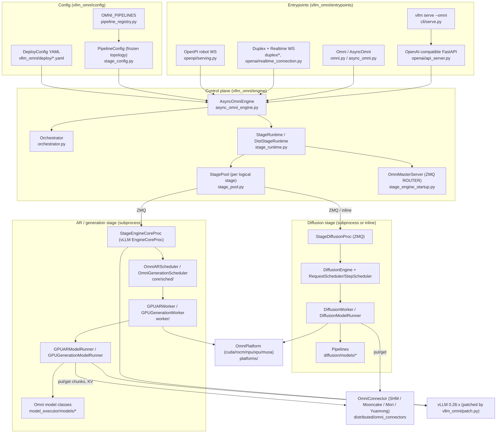
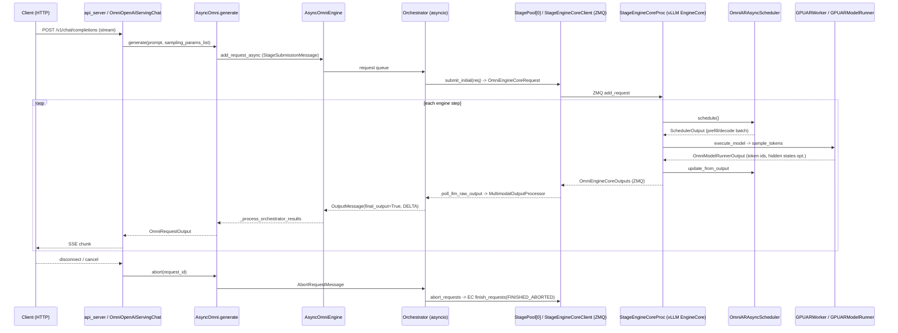

# vLLM-Omni (vllm-project/vllm-omni) — Engine Analysis

| Field | Value |
| --- | --- |
| Local path | `/data/zhoutaichang/embedding_infer/vllm-omni` (links below are relative to `analysis/engines/`, pointing into the sibling `vllm-omni/` checkout) |
| Remote | `https://github.com/vllm-project/vllm-omni.git` (origin) |
| Branch | `main` |
| HEAD | `7be014bce6374f06c95b703763bdbac4c6198f31` — 2026-09-07 "[Bugfix][NPU] Fix MiniMax-H3 INT8 quantization dispatch (#6876)" |
| Dirty status | clean (`git status --short` empty) |
| Submodules | none (`git submodule status` empty) |
| Analysis date | 2026-09-08 |
| Installed package caveat | The Python environment has vllm-omni installed **editable from a different checkout**: `/home/zhoutaichang/feature/vllm-omni-main` @ `be335a86f` (2026-08-28), version string `0.28.0rc2.dev22+gbe335a86f`, with `vllm==0.28.0`. This report analyses the newer `7be014bc` tree only; nothing was executed. [Verified] |
| Size | 1,382 `.py` files / 508,455 LOC under `vllm_omni/`; 912 `test_*.py` files; 266 files under `docs/`; 90 deploy YAMLs. [Verified] |

Evidence labels: **[Verified]** read in code/docs; **[Inferred]** reasoned from structure; **[Proposal]** design suggestion; **[Unknown]** not determinable from the tree.

## 0. Summary

- vLLM-Omni is a **Python-only serving framework layered on top of vLLM (v1 engine)**; it does not ship its own kernels, allocator, or C++ runtime. Its `setup.py` builds a pure-Python wheel and only selects a platform-specific `requirements/*.txt` (`cuda|rocm|npu|xpu|musa|cpu`). [Verified] (`../../vllm-omni/setup.py`, `../../vllm-omni/requirements/common.txt`)
- **vLLM is not pinned in packaging metadata.** No `vllm==` appears in `requirements/` or `pyproject.toml`; instead `version.py` warns at import if major.minor differ, and docs pin `vllm==0.28.0` for the 0.28.x line. [Verified] (`../../vllm-omni/vllm_omni/version.py`, `../../vllm-omni/docs/getting_started/installation/gpu/cuda.inc.md`)
- It **imports 284 distinct `vllm.*` modules** and 104 files import `vllm.v1.*` internals; `patch.py` **monkeypatches** vLLM classes at import (`EngineCoreRequest/Output(s)`, `Request`, `StreamingUpdate`, `TokensPrompt`, `MRotaryEmbedding`, `ModelConfig.is_mm_prefix_lm`, `CuMemAllocator`, NVFP4/FP8 kernels, torch inductor). Backend substitution below vLLM is therefore not a plugin exercise; it is a re-implementation of the AR runtime. [Verified] (`../../vllm-omni/vllm_omni/patch.py`)
- Core abstraction: a model is a **frozen `PipelineConfig` of stages** (`LLM_AR`, `LLM_GENERATION`, `DIFFUSION`), and a **`DeployConfig` YAML** places stages on devices, sizes them, and wires named connectors. 60 pipelines are registered in `OMNI_PIPELINES`. [Verified] (`../../vllm-omni/vllm_omni/config/stage_config.py`, `../../vllm-omni/vllm_omni/config/pipeline_registry.py`)
- Each AR/generation stage is a **separate vLLM `EngineCoreProc` subprocess** (spawned by `StageEngineCoreProcManager`) reached over ZMQ; diffusion stages run either in a separate `StageDiffusionProc` (ZMQ PUSH/PULL) or inline in the orchestrator process. An `Orchestrator` asyncio loop routes outputs stage→stage. [Verified]
- **Inter-stage tensors travel host-side by default** ("D2H2D") through `OmniConnector`s: `SharedMemoryConnector` (POSIX shm + msgpack); Mooncake (TCP/RDMA) and Yuanrong (Ascend) for multi-node, Mori (RDMA, plus an intra-node AMD `xgmi` backend configured in `deploy/qwen3_omni_moe_mori_intranode.yaml`); `MooncakeTransferEngineConnector.put` and the Mori connector pass `torch.Tensor`/`ManagedBuffer` payloads without msgpack serialization and can use device memory pools (repo docs still describe all connectors as D2H2D); none of these device paths is validated for an edge target. [Verified] (`../../vllm-omni/vllm_omni/distributed/omni_connectors/`)
- **Streaming audio** is produced by `async_chunk`: talker decode steps accumulate codec frames (`codec_chunk_frames`, default 25, with a smaller dynamic first chunk) and push them to the code2wav stage, which decodes chunk-by-chunk while the request sits in a patched `RequestStatus.WAITING_FOR_CHUNK`. [Verified] (`../../vllm-omni/docs/design/feature/async_chunk.md`)
- **Platforms actually in tree:** CUDA, ROCm, Ascend NPU (via `vllm_ascend`), Intel XPU, Moore Threads MUSA (via `vllm_musa`). There is **no CPU platform/worker**; `requirements/cpu.txt` exists only for docs builds and the fallback `UnspecifiedOmniPlatform` reports `device_count()==0`. [Verified] (`../../vllm-omni/vllm_omni/platforms/__init__.py`)
- **No edge/mobile targets**: no Jetson/ARM/Metal/CoreML/Vulkan/OpenCL/QNN/NNAPI code, no ONNX/TensorRT export path (onnxruntime is used only to load a few speaker-embedding / codec helper models). [Verified]
- **TTS is a first-class citizen**: 15 TTS model families, an OpenAI `/v1/audio/speech` endpoint with a per-model `TTSModelAdapter` registry, WebSocket streaming `/v1/audio/speech/stream`, PCM/WAV/MP3/Opus encoding via `soundfile`, and a repo-published Qwen3-TTS TTFP of 64 ms (H200, conc. 1; repo-reported, not reproduced). [Verified]
- **VLA is present but server-side**: π0, GR00T-N1.7, InternVLA-A1 (single diffusion stage returning `actions`), DreamZero-DROID and LingBot-World (AR-diffusion world models with engine-level paged KV), Cosmos3 action modes; served over `WS /v1/realtime/robot/openpi` (msgpack). Actions are not streamed; one observation → one action chunk. [Verified]
- Diffusion has its own runtime (`DiffusionEngine`, `RequestScheduler`/`StepScheduler`, `DiffusionWorker`, 11 attention backends, cache-DiT/TeaCache/MagCache/StepCache, CPU/layerwise/distributed offload, HSDP/Ulysses/Ring/CFG/VAE parallel) that reuses vLLM layers/quant/`KVCacheManager` as a library. [Verified]
- Compilation: AR stages inherit vLLM CUDA graphs/`torch.compile`; diffusion uses `regionally_compile()` (`torch.compile` per repeated block) and per-model CUDA-graph wrappers (e.g., `CUDAGraphDecoderWrapper` for Qwen3-TTS code2wav). [Verified]
- Quantization is inherited from vLLM (`quantization_config` path) with omni additions (Int8, MXFP4/MXFP8 for NPU, SVDQuant, quack FP8, bitsandbytes); non-AR TTS stages stay BF16 per docs. [Verified] (`../../vllm-omni/docs/user_guide/quantization/overview.md`)
- Bottom line for the edge study: vLLM-Omni is the reference **serving stack** (pipeline/stage/streaming semantics, model ports, API contracts) but its **execution runtime is vLLM+CUDA-class accelerators**; an edge port must replace the AR runtime (vLLM EngineCore/scheduler/worker) and the diffusion worker while keeping `PipelineConfig`, stage input processors, connector payload schemas, and the OpenAI/OpenPI protocol layers. [Inferred]

## 1. Architecture overview



Key modules:

| Module | Path | Responsibility | Key symbols |
| --- | --- | --- | --- |
| Package init / patches | `../../vllm-omni/vllm_omni/__init__.py`, `../../vllm-omni/vllm_omni/patch.py` | Version check, then monkeypatch vLLM internals at import | `warn_if_misaligned_vllm_version`, `_patched_is_mm_prefix_lm`, `_patch_cumem_free_callback_cuda` |
| Engine args | `../../vllm-omni/vllm_omni/engine/arg_utils.py` | `OmniEngineArgs(EngineArgs)` per-stage fields; `OrchestratorArgs`; registers omni models into vLLM via entry point | `OmniEngineArgs`, `OrchestratorArgs`, `register_omni_models_to_vllm` |
| Composition root | `../../vllm-omni/vllm_omni/engine/async_omni_engine.py` | Resolves stage configs, boots stages, hosts orchestrator loop, request submit/abort/RPC/sleep | `AsyncOmniEngine`, `_create_default_diffusion_stage_cfg`, `add_request_async`, `abort_async` |
| Orchestrator | `../../vllm-omni/vllm_omni/engine/orchestrator.py` | Cross-stage routing, output ordering, cancellation, CFG companions, PD pair | `Orchestrator`, `_route_output`, `_forward_to_next_stage_unguarded`, `_prewarm_async_chunk_stages`, `_handle_abort` |
| Stage runtime | `../../vllm-omni/vllm_omni/engine/stage_runtime.py`, `../../vllm-omni/vllm_omni/engine/stage_pool.py` | Expand logical stages into local/remote replicas; replica selection/affinity; metrics | `StageRuntime`, `DistStageRuntime`, `StagePool.pick`, `submit_initial` |
| Stage process launch | `../../vllm-omni/vllm_omni/engine/stage_engine_startup.py`, `../../vllm-omni/vllm_omni/engine/stage_engine_core_proc.py`, `../../vllm-omni/vllm_omni/engine/stage_engine_core_proc_manager.py` | ZMQ address allocation, headless replica registration, spawn of `EngineCoreProc` subclasses | `OmniMasterServer`, `StageEngineCoreProc.run_stage_core`, `launch_stage_replica` |
| Stage client | `../../vllm-omni/vllm_omni/engine/stage_engine_core_client.py` | vLLM `AsyncMPClient` subclass per replica; KV sender endpoint | `StageEngineCoreClient`, `DPLBStageEngineCoreClient` |
| Pipeline/deploy config | `../../vllm-omni/vllm_omni/config/stage_config.py`, `../../vllm-omni/vllm_omni/config/pipeline_registry.py`, `../../vllm-omni/vllm_omni/config/omni_config.py` | Frozen topology, deploy overlay, precedence, scheduler resolution | `PipelineConfig`, `StagePipelineConfig`, `StageDeployConfig`, `StageExecutionType`, `_resolve_scheduler`, `OMNI_PIPELINES`, `register_pipeline` |
| AR scheduler | `../../vllm-omni/vllm_omni/core/sched/omni_ar_scheduler.py`, `../../vllm-omni/vllm_omni/core/sched/omni_scheduler_mixin.py` | vLLM `Scheduler` subclass adding chunk/KV-transfer hooks | `OmniARScheduler`, `OmniARAsyncScheduler`, `OmniSchedulerMixin` |
| Generation scheduler | `../../vllm-omni/vllm_omni/core/sched/omni_generation_scheduler.py` | One-shot non-AR stage scheduling (code2wav, DiT-in-vLLM) | `OmniGenerationScheduler.schedule` |
| Workers/runners | `../../vllm-omni/vllm_omni/worker/gpu_ar_worker.py`, `../../vllm-omni/vllm_omni/worker/gpu_ar_model_runner.py`, `../../vllm-omni/vllm_omni/worker/gpu_generation_model_runner.py`, `../../vllm-omni/vllm_omni/worker/omni_connector_model_runner_mixin.py` | vLLM `GPUWorker`/`GPUModelRunner` subclasses; multimodal outputs, talker MTP, connector I/O | `GPUARWorker`, `GPUARModelRunner.execute_model`, `GPUGenerationModelRunner`, `OmniConnectorModelRunnerMixin.send_chunk` |
| Model registry | `../../vllm-omni/vllm_omni/model_executor/models/registry.py`, `../../vllm-omni/vllm_omni/diffusion/registry.py` | 89 omni AR/generation archs + all vLLM archs; 66 diffusion pipelines | `OmniModelRegistry`, `DiffusionModelRegistry`, `register_diffusion_model` |
| Stage input processors | `../../vllm-omni/vllm_omni/model_executor/stage_input_processors/` | Model-owned functions converting stage-N output → stage-N+1 input (full payload or async chunk) | `talker2code2wav_async_chunk` (qwen3_tts.py) |
| Diffusion engine | `../../vllm-omni/vllm_omni/diffusion/diffusion_engine.py`, `../../vllm-omni/vllm_omni/diffusion/sched/`, `../../vllm-omni/vllm_omni/diffusion/executor/`, `../../vllm-omni/vllm_omni/diffusion/worker/` | Request/step batching, uniproc/multiproc executors, worker & runner | `DiffusionEngine`, `RequestScheduler`, `StepScheduler`, `MultiprocDiffusionExecutor`, `DiffusionWorker`, `DiffusionModelRunner` |
| Diffusion attention | `../../vllm-omni/vllm_omni/diffusion/attention/backends/registry.py`, `../../vllm-omni/vllm_omni/diffusion/attention/selector.py`, `../../vllm-omni/vllm_omni/diffusion/attention/layer.py` | Enum registry, per-role selection, platform defaults | `DiffusionAttentionBackendEnum`, `register_diffusion_backend`, `get_attn_backend_for_role`, `Attention` |
| Connectors | `../../vllm-omni/vllm_omni/distributed/omni_connectors/` | Transport-only put/get + chunk transfer adapter | `OmniConnectorBase`, `SharedMemoryConnector`, `OmniConnectorFactory`, `OmniChunkTransferAdapter` |
| Platforms | `../../vllm-omni/vllm_omni/platforms/interface.py`, `../../vllm-omni/vllm_omni/platforms/__init__.py` | Backend detection, worker class selection, diffusion attention defaults | `OmniPlatform`, `resolve_current_omni_platform_cls_qualname`, `CudaOmniPlatform`, `NPUOmniPlatform` |
| I/O types | `../../vllm-omni/vllm_omni/inputs/data.py`, `../../vllm-omni/vllm_omni/outputs/__init__.py`, `../../vllm-omni/vllm_omni/data_entry_keys.py`, `../../vllm-omni/vllm_omni/request.py` | Prompt types with embeds/payloads; `OmniRequestOutput`; typed inter-stage payload | `OmniTokensPrompt`, `OmniRequestOutput`, `OmniPayload`, `OmniRequest` |
| Serving | `../../vllm-omni/vllm_omni/entrypoints/openai/api_server.py`, `../../vllm-omni/vllm_omni/entrypoints/openai/serving_speech.py`, `../../vllm-omni/vllm_omni/entrypoints/openpi/serving.py` | HTTP/WS routes; TTS request building & audio encoding; robot policy WS | `omni_run_server`, `create_speech`, `ServingRealtimeRobotOpenPI.infer` |
| Experimental | `../../vllm-omni/vllm_omni/experimental/ar_diffusion/engine.py`, `../../vllm-omni/vllm_omni/experimental/world_models/` | AR-diffusion (world model) engine with paged KV; session state | `ARDiffusionEngine`, `ARDiffusionModelRunner` |

## 2. Device layer

**Backends and registration.** `vllm_omni/platforms/__init__.py` defines five builtin probe functions and an entry-point group `vllm_omni.platform_plugins` for out-of-tree platforms; exactly one may activate. [Verified] (`../../vllm-omni/vllm_omni/platforms/__init__.py` — `builtin_omni_platform_plugins`, `resolve_current_omni_platform_cls_qualname`)

| Platform | Probe | Class (inherits vLLM/vendor platform) | AR/generation worker | Notes |
| --- | --- | --- | --- | --- |
| CUDA | `pynvml.nvmlDeviceGetCount()>0` | `CudaOmniPlatform(OmniPlatform, CudaPlatformBase)` `../../vllm-omni/vllm_omni/platforms/cuda/platform.py` | `GPUARWorker`, `GPUGenerationWorker` | Default deploy dir `vllm_omni/deploy`; diffusion attention default chain (TRTLLM→cuDNN→FlashInfer→FA→SDPA) keyed on SM version [Verified] |
| ROCm | `amdsmi` handles>0 | `RocmOmniPlatform(OmniPlatform, RocmPlatform)` `../../vllm-omni/vllm_omni/platforms/rocm/platform.py` | same GPU workers | Forces `TRITON_ATTN`/`ROCM_AITER_FA` for AR; `patch_groupnorm.py`; several deploy YAMLs flip code2wav to eager (MIOpen not capture-safe) [Verified] |
| Ascend NPU | `torch.npu.is_available()` | `NPUOmniPlatform(OmniPlatform, vllm_ascend.NPUPlatform)` `../../vllm-omni/vllm_omni/platforms/npu/platform.py` | `NPUARWorker`, `NPUGenerationWorker` (`../../vllm-omni/vllm_omni/platforms/npu/worker/`) | HCCL; applies model patches for code2wav conv ops, 310P patches; `YuanrongTransferEngineConnector`; ACL graph wrapper [Verified] |
| Intel XPU | `torch.xpu.is_available()` | `XPUOmniPlatform(OmniPlatform, XPUPlatform)` `../../vllm-omni/vllm_omni/platforms/xpu/platform.py` | `XPUARWorker`, `XPUGenerationWorker` | Disables XPU sampler kernel via env [Verified] |
| MUSA | `torchada.is_musa_platform()` | `MUSAOmniPlatform(OmniPlatform, vllm_musa.MUSAPlatformBase)` `../../vllm-omni/vllm_omni/platforms/musa/platform.py` | GPU workers | requires `torchada`, `mate`, `flash_attn_3` (`../../vllm-omni/requirements/musa.txt`) [Verified] |
| CPU | — | `UnspecifiedOmniPlatform` (`device_type="cpu"`, `get_device_count()==0`) | none | No CPU worker/runner exists; `cli/serve.py` falls back to vLLM `CpuPlatform` **only for argument parsing** [Verified] |

**Device discovery/selection.** Placement is declarative: each stage's `devices: "0,1"` in the deploy YAML must equal TP×DP_local×PP (×replicas); `StageRuntime._scoped_spawn_device_env` sets the platform's `device_control_env_var` (e.g., `CUDA_VISIBLE_DEVICES`) around subprocess spawn, and `GPUARWorker.init_device` maps local rank → visible device via `current_omni_platform.get_torch_device`. [Verified] (`../../vllm-omni/vllm_omni/engine/stage_runtime.py`, `../../vllm-omni/vllm_omni/worker/gpu_ar_worker.py`, `../../vllm-omni/docs/configuration/stage_configs.md`)

**Memory allocation/pools.**
- AR/generation stages inherit vLLM's paged KV allocation; `OmniGPUWorkerBase.determine_available_memory` re-implements the budget as `total*gpu_memory_utilization − (weights + peak activation + non-torch)` measured by `memory_profiling` around `profile_run()`, or honors explicit `kv_cache_memory_bytes`. [Verified] (`../../vllm-omni/vllm_omni/worker/base.py`)
- Multi-stage co-location on one GPU is guarded by `stage_admission.py` (`DeviceLedger`, `check_admission`) using per-stage `gpu_memory_utilization` plus a CUDA-graph reserve, and by SH/EX device locks for sequential profiling (`parallel_stage_init`). [Verified] (`../../vllm-omni/vllm_omni/engine/stage_admission.py`)
- Sleep mode uses vLLM's `CuMemAllocator` tagged pools (`_maybe_get_memory_pool_context`), patched in `patch.py` to avoid a CUDA double-free on shutdown. [Verified]
- Diffusion workers: `DiffusionWorker.init_device` calls `init_distributed_environment`/`initialize_model_parallel` from `vllm_omni.diffusion.distributed`, and only takes a `MemorySnapshot`/KV budget when `diffusion_kv_mode=paged_scheduler`. Host-side: pinned memory for offload (`pin_cpu_memory`), CUDA host registration for DLO, and the Host Weight Runtime (mmap'd safetensors shared across same-host workers). [Verified] (`../../vllm-omni/vllm_omni/diffusion/worker/diffusion_worker.py`, `../../vllm-omni/vllm_omni/diffusion/offloader/`, `../../vllm-omni/docs/design/feature/host_weight_runtime.md`)
- NVML process-scoped accounting helpers remain for diffusion memory reporting. [Verified] (`../../vllm-omni/vllm_omni/worker/gpu_memory_utils.py`)

**Host↔device transfers.** Inter-stage data is always staged to host: connector `put()` serializes CPU tensors (msgpack, `OmniMsgpackEncoder`, "zero-copy not implemented yet") into a POSIX shm segment; the receiving stage deserializes and re-uploads. `GPUARModelRunner` snapshots multimodal outputs to CPU on a dedicated copy stream (`_get_or_create_omni_payload_copy_stream`, `_snapshot_tensor_payload_to_cpu_async`) so D2H does not block decode ("async omni output materialization"). [Verified] (`../../vllm-omni/vllm_omni/distributed/omni_connectors/utils/serialization.py`, `../../vllm-omni/vllm_omni/worker/gpu_ar_model_runner.py`, `../../vllm-omni/docs/design/feature/omni_async_output_materialization.md`)

**Synchronization/streams.** `OmniPlatform.record_device_event()` marks tensor readiness for async diffusion output (NPU overrides to sync the default stream first, since HCCL uses hidden streams). Prefix cache writes record a CUDA event on the copy stream (`_PendingAsyncWrite`). Ruff bans `torch.cuda.*` in favor of `torch.accelerator.*` to keep code device-neutral. [Verified] (`../../vllm-omni/vllm_omni/platforms/interface.py`, `../../vllm-omni/vllm_omni/core/prefix_cache.py`, `../../vllm-omni/pyproject.toml`)

**Portability.** Linux only (`docs/getting_started/quickstart.md`: "OS: Linux"); Python 3.10–3.13; Dockerfiles for cuda/rocm/xpu/npu (A2/A3). No macOS/Windows/ARM CPU/mobile code paths were found. [Verified] (`../../vllm-omni/docker/Dockerfile.cuda`, `../../vllm-omni/docker/Dockerfile.npu`)

## 3. Kernel layer

**Operator set & registration.** vLLM-Omni has no compiled extension of its own; operators come from (a) vLLM's layers (`vllm.model_executor.layers.{linear,layernorm,activation,rotary_embedding,fused_moe,quantization}` — 62/25/15/9/5/17 import sites respectively) and vLLM's custom-op/IR mechanism, (b) PyTorch/Triton code inside model files (e.g., `attention/fish_kvcache_triton.py`, `diffusion/layers/mot/ops/mot_gemm.py`, `diffusion/layers/fused_qk_norm_rope.py`), and (c) optional external kernel packages (flash-attn 2/3/4, FlashInfer, SageAttention 2/3, cuDNN SDPA, HF `kernels` hub, quack FP8, TRT-LLM gen). [Verified]

**Dispatch mechanisms.**
- AR stages: attention/backend dispatch is vLLM's (`attention_backend` engine arg, forced to `TRITON_ATTN`/`ROCM_AITER_FA` on ROCm by `stage_init_utils.py`). Omni adds a Fish-Speech-specific KV-cache attention Triton path selected by model arch (`is_fish_kvcache_attn_active_for_model`) with fallback counters. [Verified] (`../../vllm-omni/vllm_omni/attention/fish_kvcache_backend.py`)
- Diffusion attention: `Attention` layer → `get_attn_backend_for_role(role, head_size, attention_config)` with precedence per-role config → role category → global default → `current_omni_platform.get_diffusion_attn_backend_cls()`; classes resolved from `DiffusionAttentionBackendEnum` (11 members) with runtime overrides via `register_diffusion_backend`. Each backend declares `supported_platforms`, `validate_available()`, head-size sets, mask/paged-KV capabilities. [Verified] (`../../vllm-omni/vllm_omni/diffusion/attention/selector.py`, `../../vllm-omni/vllm_omni/diffusion/attention/backends/registry.py`, `../../vllm-omni/vllm_omni/diffusion/attention/backends/abstract.py`)
- Diffusion generic ops: `CustomOp.dispatch_forward()` picks `forward_cuda|hip|npu|xpu|musa|native` from `current_omni_platform`; HIP/MUSA default to the CUDA path, XPU to native. [Verified] (`../../vllm-omni/vllm_omni/diffusion/layers/custom_op.py`)
- IR op priority: CUDA platform prefers `["vllm_c","native"]` (optionally `oink` for rms_norm); per-pipeline `get_*_ir_op_priority_func` (Cosmos3) can merge overrides. [Verified] (`../../vllm-omni/vllm_omni/platforms/cuda/platform.py`, `../../vllm-omni/vllm_omni/diffusion/registry.py`)

**Quantization formats & where dequant happens.** Unified `quantization_config` path (`../../vllm-omni/vllm_omni/quantization/factory.py`); vLLM quant methods are reused (ModelOpt FP8/NVFP4, AutoRound W4A16, TorchAO, compressed-tensors) and omni adds `int8_config.py`, `mxfp4_config.py`, `mxfp8_config.py` (Ascend), `svdquant_config.py`, `bitsandbytes_config.py`, `inc_config.py`, `quack_fp8.py` (Blackwell fused-bias FP8 GEMM). Dequant/scaled-GEMM occurs inside vLLM's `LinearMethod.apply`/`ScaledMMLinearKernel` (patched in `patch.py` for non-contiguous batched diffusion activations and FlashInfer output shape). GGUF loading for diffusion via `gguf_adapters` (`requirements/common.txt`). Runtime FP8 attention quant for diffusion FA (`AttnQuantSpec`). Docs state omni/TTS quantization is scoped to the AR LM stage; non-AR stages stay BF16. [Verified] (`../../vllm-omni/docs/user_guide/quantization/overview.md`, `../../vllm-omni/vllm_omni/quantization/`)

**Compilation / JIT / graph capture.**
- AR stages: vLLM `compilation_config` (`cudagraph_mode: PIECEWISE|FULL`, `custom_ops`) is settable per stage in deploy YAML (see `platforms.npu.stages[*].compilation_config` in `../../vllm-omni/vllm_omni/deploy/qwen3_omni_moe.yaml`). `GPUARModelRunner._capture_talker_mtp_graphs` captures a dedicated CUDA graph for the talker MTP/code-predictor path; `supports_talker_mtp_graph_capture()` is a platform hook. NPU uses `ACLGraphWrapper` via `get_graph_wrapper_cls()`. [Verified]
- Generation stages (code2wav): model-owned wrappers, e.g., `CUDAGraphDecoderWrapper` with capture sizes derived from chunk ramp/left context (`decode_cudagraph_capture_sizes`, `decode_cudagraph_batch_sizes` connector extras). [Verified] (`../../vllm-omni/vllm_omni/model_executor/models/qwen3_tts/cuda_graph_decoder_wrapper.py`, `../../vllm-omni/vllm_omni/deploy/qwen3_tts.yaml`)
- Diffusion: `regionally_compile()` applies `torch.compile` to each repeated block (`_repeated_blocks`), keeping offload hook wrappers outside the graph; `diffusion_compile_granularity="regional"`, `diffusion_compile_dynamic=True` defaults; `enforce_eager` disables. `patch.py` also patches torch inductor's `statically_known_multiple_of` for FLUX fp8 dynamic shapes. [Verified] (`../../vllm-omni/vllm_omni/diffusion/compile.py`, `../../vllm-omni/docs/user_guide/diffusion/regional_compilation.md`)

**Fallback when an op is unsupported.** Diffusion attention: explicit selection of an unavailable backend raises at platform resolution (fail-fast); automatic selection degrades to `TORCH_SDPA`. `CustomOp.forward_native` is the last resort. Fish KV attention records fallback reasons and uses vLLM attention otherwise. Platform-specific model patches (NPU code2wav conv2d, ROCm groupnorm) replace individual ops. [Verified]

**Extension points.**
- Out-of-tree platform: entry point `vllm_omni.platform_plugins` returning a class path; general plugins `vllm_omni.general_plugins`. [Verified] (`../../vllm-omni/vllm_omni/plugins/__init__.py`)
- Attention backend: `register_diffusion_backend(enum, "pkg.Class")`. [Verified]
- Model: `register_diffusion_model(arch, module, cls, pre/post-process funcs)`; AR models via `OmniModelRegistry` (vLLM `_ModelRegistry`); pipelines via `register_pipeline`. [Verified]
- Connector: `OmniConnectorFactory.register_connector(name, ctor)`. [Verified] (`../../vllm-omni/vllm_omni/distributed/omni_connectors/factory.py`)
- Custom diffusion pipeline without registry edits: `diffusion_load_format="dummy"` + `custom_pipeline_args={"pipeline_class": ...}` + `CustomPipelineWorkerExtension`. [Verified] (`../../vllm-omni/docs/features/custom_pipeline.md`)
- TTS serving adapter: `@register_tts_adapter` subclasses of `TTSModelAdapter` (`ARTTSAdapter`, `DiffusionTTSAdapter`). [Verified] (`../../vllm-omni/vllm_omni/entrypoints/openai/tts_adapters/__init__.py`, `../../vllm-omni/vllm_omni/entrypoints/openai/tts_adapters/base.py`)
- Contributor guides: `../../vllm-omni/docs/contributing/model/adding_omni_model.md`, `../../vllm-omni/docs/contributing/model/adding_tts_model.md`, `../../vllm-omni/docs/contributing/model/adding_diffusion_model.md`. [Verified]

## 4. Model runner

**Model loading / formats.**
- AR/generation stages: standard vLLM loader path (HF `config.json` + safetensors; `trust_remote_code`); the omni arch is looked up in `OmniModelRegistry` (vLLM archs + `_OMNI_MODELS`), and `register_omni_models_to_vllm` is installed as a `vllm.general_plugins` entry point so vLLM worker subprocesses that only import `vllm` still see omni archs. Per-stage `hf_config_name`, `model_subdir`, `tokenizer_subdir`, `model_path_resolver` select sub-configs inside multi-component repos. [Verified] (`../../vllm-omni/pyproject.toml`, `../../vllm-omni/vllm_omni/config/stage_config.py`)
- Diffusion stages: `DiffusersPipelineLoader` reads Diffusers-style `model_index.json` repos (safetensors index or unindexed shards, GGUF via `download_gguf`, ModelOpt/direct-mmap checkpoint adapters, multithreaded weight load, HWR host-weight plan); `diffusion_load_format ∈ {default, dummy, diffusers}` where `diffusers` runs the stock `diffusers` pipeline through `DiffusersAdapterPipeline`. Some VLA pipelines self-load (π0 loads `model.safetensors` in `__init__`; GR00T uses `AutoModel`/`AutoProcessor`). [Verified] (`../../vllm-omni/vllm_omni/diffusion/model_loader/diffusers_loader.py`, `../../vllm-omni/vllm_omni/diffusion/models/pi0/pipeline_pi0.py`, `../../vllm-omni/vllm_omni/diffusion/models/gr00t/policy.py`)
- No export/conversion pipeline exists (no ONNX/TensorRT/GGUF-export tooling; GGUF is consumed, not produced). [Verified]
- Pipeline auto-detection: `StageConfigFactory.create_from_model()` maps HF `model_type`/`architectures`/`_class_name` to `OMNI_PIPELINES`; single-stage diffusion models without a registered pipeline use `_create_default_diffusion_stage_cfg`. [Verified] (`../../vllm-omni/vllm_omni/config/config_factory.py`, `../../vllm-omni/vllm_omni/engine/async_omni_engine.py`)

**Execution lifecycle (init → warmup → step).**
1. `AsyncOmniEngine.__init__` → `_resolve_stage_configs` → `StageRuntime.initialize()` builds `LogicalStageInitPlan`/`ReplicaInitPlan`, runs admission, spawns replicas (LLM via `launch_stage_replica` → `StageEngineCoreProcManager` → `StageEngineCoreProc.run_stage_core`; diffusion via `StageDiffusionProcManager.launch_headless` or `InlineStageDiffusionClient`). [Verified]
2. Inside an LLM stage, vLLM's `EngineCore` init runs `init_device` → `load_model` → `determine_available_memory` (profile run) → `initialize_kv_cache` → `compile_or_warm_up_model` (CUDA graph capture); omni overrides `load_model` (`_init_talker_mtp`, `_prewarm_attention_capture_workspaces`) and `capture_model` (`_capture_talker_mtp_graphs`). [Verified] (`../../vllm-omni/vllm_omni/worker/gpu_model_runner.py`, `../../vllm-omni/vllm_omni/worker/gpu_ar_model_runner.py`)
3. Diffusion: `DiffusionEngine.make_engine()` → executor init → `load_model` → `run_startup_warmup()` (`_dummy_run`, KV profile requests when paged) → `_busy_loop` thread performing `schedule → execute_batch/execute_step → update_from_output → per-request asyncio queue`. [Verified] (`../../vllm-omni/vllm_omni/diffusion/diffusion_engine.py`, `../../vllm-omni/docs/design/feature/diffusion_continuous_batching.md`)
4. Orchestrator `_prewarm_async_chunk_stages` pre-submits downstream stage requests when `async_chunk` is on, so they can park in `WAITING_FOR_CHUNK`. [Verified]
5. Step: AR stage `GPUARModelRunner.execute_model` → `_preprocess` (model-specific `preprocess` builds `inputs_embeds`; `_build_model_kwargs_extra`) → `_model_forward` → `sample_tokens` (may run `_run_post_sample_talker_mtp`) → `_build_omni_step_outputs` → `OmniModelRunnerOutput` with `multimodal_outputs`/`pooler_output`. [Verified]

**Dynamic shapes.** AR stages rely on vLLM's padded batch buckets (`max_cudagraph_capture_size`, `cudagraph_mode`); talker MTP graphs are captured per batch bucket. Code2wav graph shapes are derived from the chunk-size schedule (`initial_codec_chunk_frames`, `codec_chunk_frames`, `codec_left_context_frames`, optional `codec_chunk_ramp`/adaptive ramp) and batch buckets; eager fallback on unmatched shapes (`_get_padded_size` returns None). Diffusion uses `diffusion_compile_dynamic=True` and per-request `DiffusionRequestBatch` slicing. [Verified]

**State & KV cache.**
- AR/generation: inherits vLLM paged KV (`KVCacheManager`, block tables, prefix caching, chunked prefill, preemption). Omni additions: `OmniTensorPrefixCache` stores hidden states and multimodal tensors aligned to vLLM block slot mappings so prefix hits reuse stage outputs (`../../vllm-omni/vllm_omni/core/prefix_cache.py`, `../../vllm-omni/docs/design/feature/prefix_caching.md`); `retains_state_across_chunks` keeps a request resident while awaiting chunks; KV transfer between stages (`omni_kv_config`, `send_kv_cache`/`recv_kv_cache`, rank-aware keys) for PD disaggregation and thinker→talker reuse. [Verified]
- Across calls (sessions): streaming input sessions (`OmniStreamingUpdate`, `resumable` requests, `session_id`) and duplex sessions retain KV between segments; `session_mode: duplex` in deploy YAML. [Verified] (`../../vllm-omni/vllm_omni/request.py`, `../../vllm-omni/docs/design/fullduplex.md`)
- Diffusion: `DiffusionKVCacheMode ∈ {dense_legacy, paged_scheduler}`; `DiffusionKVCacheManager` wraps vLLM `KVCacheManager` (caching disabled) for scheduler-owned paged KV in AR-DiT/world models ("unified AR/DiT paged KV cache runtime", 0.28.0). Experimental `ARDiffusionEngine` keeps runner-owned paged KV per session with sliding window + sink frames (`ARDiffusionKVCacheSpec`). Prompt-embedding cache (`enable_prompt_embed_cache`). Eviction: LRU-style session accounting in `experimental/world_models/session_state`. [Verified] (`../../vllm-omni/vllm_omni/diffusion/diffusion_kv/manager.py`, `../../vllm-omni/vllm_omni/experimental/ar_diffusion/capability.py`)

**Multimodal stages.**
- Encoders (audio/vision) live inside the thinker model class (vLLM multimodal processors, `mm_features`); `requires_multimodal_data` lets a downstream stage receive raw media. [Verified]
- Projectors/talkers: `LLM_AR` stage with `engine_output_type="latent"` emitting codec codes via `multimodal_outputs`. [Verified]
- Decoders/vocoders: `LLM_GENERATION` stage (`GPUGenerationModelRunner`: no logits/sampling, returns tensors via `pooler_output`) e.g. `Qwen3TTSCode2Wav`, `Qwen3OmniMoeCode2Wav`, `MossTTSCodecDecoder`, `FishSpeechDACDecoder`, `IndexTTS2S2MelDecoder`; or a DIFFUSION stage for flow-matching decoders (`CosyVoice3` DiT, `MiniMaxMusic3Acoustic`, `OmniVoicePipeline`). [Verified] (`../../vllm-omni/vllm_omni/worker/gpu_generation_model_runner.py`, `../../vllm-omni/vllm_omni/model_executor/models/registry.py`)
- Diffusion (image/video/audio/action) as DIFFUSION stage pipelines. [Verified]

## 5. Scheduler

### (a) Request / token / pipeline-level scheduling

- **Per-stage continuous batching** is inherited from vLLM: each LLM stage runs its own `Scheduler` subclass chosen by `_resolve_scheduler(execution_type, async_scheduling)`: `OmniARScheduler` (sync), `OmniARAsyncScheduler` (vLLM `AsyncScheduler`), `OmniGenerationScheduler`; diffusion stages return `None` (own scheduler). Batching knobs are per stage (`max_num_seqs`, `max_num_batched_tokens`, `enable_chunked_prefill`, `enable_prefix_caching`, `async_scheduling`). [Verified] (`../../vllm-omni/vllm_omni/config/stage_config.py`)
- **AR schedule hooks**: `OmniARScheduler.schedule` drops aborted requests, `_process_pending_omni_inputs`, optionally defers waiting admission, calls `super().schedule()`, restores omni wait queues, post-processes with cached payloads, and wraps output with `finished_requests_needing_kv_transfer`. `update_from_output` triggers `chunk_transfer_adapter.save_async` per decode step and handles KV-transfer readiness. [Verified] (`../../vllm-omni/vllm_omni/core/sched/omni_ar_scheduler.py`)
- **Generation schedule** (`OmniGenerationScheduler.schedule`): one-shot fast path feeding all input tokens at once (placeholder token if 0), chunk-aware: skips placeholder tokens when no new chunk arrived, finishes when `is_done_receiving_chunks`. [Verified]
- **Chunk lifecycle** (`OmniChunkTransferAdapter`): keys `{req_id}_{stage_id}_{chunk_id}`; background `recv_loop`/`save_loop` threads; `process_pending_chunks` parks requests in `WAITING_FOR_CHUNK` (enum value −1 added by `patch.py`), `restore_queues` re-admits when ready, `_preempt_non_active_running` with `active_stream_window`. Full-payload (non-async) handoff uses `WAITING_FOR_INPUT` (−2) and `OmniSchedulingCoordinator`. [Verified] (`../../vllm-omni/vllm_omni/distributed/omni_connectors/transfer_adapter/chunk_transfer_adapter.py`, `../../vllm-omni/vllm_omni/core/sched/omni_scheduling_coordinator.py`)
- **Pipeline-level**: `Orchestrator._orchestration_loop` (poll) or `_orchestration_loop_event_driven` (`VLLM_OMNI_EVENT_DRIVEN_ORCH=1`) reads each replica's `EngineCoreOutputs`, runs `MultimodalOutputProcessor`, then `_route_output`: final-output stages → `OutputMessage` to client queue; non-final → `_forward_to_next_stage` (unless the next stage receives async chunks, in which case data flows via connectors and the stage was pre-submitted). Diffusion next stages get inputs via `custom_process_input_func(source_outputs, prompt, requires_multimodal_data)`; CFG companions are bundled (`CfgCompanionTracker`); PD pairs forward original prompt + `kv_transfer_params`. [Verified] (`../../vllm-omni/vllm_omni/engine/orchestrator.py`, `../../vllm-omni/vllm_omni/engine/cfg_companion_tracker.py`)
- **Replica selection / load balancing**: `StagePool.pick`/`select_replica_id` with `LoadBalancer` policies (`--omni-lb-policy`, default `random`), request→replica binding for affinity; `OmniCoordinator` tracks heartbeats for distributed replicas. [Verified] (`../../vllm-omni/vllm_omni/engine/stage_pool.py`, `../../vllm-omni/vllm_omni/distributed/omni_coordinator/omni_coordinator.py`)
- **Diffusion scheduling**: `REQUEST_BATCH` (`RequestScheduler`: fuse compatible requests by `RequestBatchSamplingParamsKey`, optional `request_batch_max_wait_ms` admission window) or `STEP_BATCH` (`StepScheduler`: continuous batching at denoise-step granularity, `max_num_seqs>1`), plus `streaming_output` for chunked video and `submit_interaction` for mid-stream prompt events. [Verified] (`../../vllm-omni/vllm_omni/diffusion/sched/request_scheduler.py`, `../../vllm-omni/vllm_omni/diffusion/sched/step_scheduler.py`, `../../vllm-omni/docs/user_guide/diffusion/execution_modes.md`)
- **Cancellation/abort**: `AsyncOmni.abort` → `AsyncOmniEngine.abort_async` → `AbortRequestMessage` → `Orchestrator._handle_abort` → `StagePool.abort_requests` on every stage holding the request; AR final-stage abort yields a terminal output with `finish_reason="abort"` and the generated prefix; diffusion abort is whole-sample (`DiffusionEngine.abort` → `_process_aborts_queue`); connector `cleanup(request_id)` unlinks shm segments; `abort_requests_collecting_outputs` in the output processor; `FINISHED_ABORTED` requests are dropped before vLLM sees them. [Verified] (`../../vllm-omni/docs/design/module/engine_orchestration.md`)
- **Backpressure**: generation admission gate in `AsyncOmni._submit_with_admission`; `duplex_max_sessions` engine-owned session capacity; `max_num_seqs` per stage; `collect_timed_out_request_ids` for chunk/input timeouts (`connector_get_max_wait*`); `active_stream_window` limits concurrently fed downstream streams. [Verified]

### (b) Graph / operator / thread-level scheduling

- Within a stage step the model forward is a single torch call sequence (eager, piecewise or full CUDA graph) — there is **no omni-level operator DAG scheduler**; ordering is the model's Python. [Verified]
- Thread pools: chunk transfer adapter `recv_loop`/`save_loop` threads; async omni output builder thread (`OmniAsyncGPUModelRunnerOutput._build_output_in_background`); `DiffusionEngine._busy_loop` thread; multiproc diffusion `_result_pump` thread; `orchestrator_monitor`. [Verified]
- Stream assignment: default compute stream plus a dedicated payload copy stream for D2H snapshots and prefix-cache writes; NPU synchronizes default stream before events. Diffusion sequence-parallel comms use `GroupCoordinator` in `vllm_omni.diffusion.distributed`. [Verified]
- Diffusion regional compilation is the only compile-graph scheduling; N/A otherwise. [Verified]

## 6. I/O layer

- **Preprocessing.** Media parsing reuses `vllm.multimodal` (audio via `vllm.multimodal.audio` — `librosa` is banned by ruff in favor of vLLM helpers/torchaudio); `utils/audio.py` provides mel filterbanks; per-model processors under `transformers_utils/processors`; TTS reference audio encoding happens in serving adapters (`_encode_moss_references`, `_build_qwen3_tts_request`); diffusion image preprocessing via `get_*_pre_process_func`. [Verified] (`../../vllm-omni/vllm_omni/utils/audio.py`, `../../vllm-omni/vllm_omni/entrypoints/openai/serving_speech.py`)
- **Tokenization.** HF `transformers` tokenizers through vLLM's tokenizer layer (`vllm.tokenizers` imported in 20 files); `owns_tokenizer` marks the stage whose tokenizer the pipeline exposes; custom `MammothModa2Tokenizer`; speech tokenizers/codecs per model (e.g., `Qwen3TTSTokenizer` 12 Hz/25 Hz, `s3tokenizer`, `whisper_vq`). [Verified] (`../../vllm-omni/vllm_omni/tokenizers/mammoth_moda2_tokenizer.py`, `../../vllm-omni/vllm_omni/model_executor/models/qwen3_tts/qwen3_tts_tokenizer.py`)
- **Streaming.** Text deltas via vLLM `RequestOutputKind.DELTA`; audio via async chunk `OmniEngineCoreOutput.multimodal_output` per chunk, accumulated by `OmniRequestState.add_multimodal_tensor` / `multimodal_accumulation.py`; HTTP TTS streams PCM through `_generate_pcm_chunks`/`_iter_pcm_audio_bytes` or SSE (`_generate_audio_sse_events`); WebSocket `OmniStreamingSpeechHandler` (`/v1/audio/speech/stream`, optional word alignments via forced aligner); `StreamingAudioResampler` for integer-ratio downsampling (24 kHz→8 kHz). Video streaming output via `/v1/video/chat/stream`, `/v1/realtime/video`. [Verified] (`../../vllm-omni/vllm_omni/entrypoints/openai/serving_speech_stream.py`, `../../vllm-omni/vllm_omni/entrypoints/openai/audio_utils_mixin.py`, `../../vllm-omni/vllm_omni/outputs/output_processor.py`)
- **Buffering.** Talker→code2wav frame accumulation (`code_prompt_token_ids` deque per request; chunk = 25 frames, left context 25–72 frames, first chunk 1–4 or dynamic); shm segments per chunk; per-request asyncio queues for diffusion; duplex `realtime_input.py` audio buffers with Silero VAD (`SileroStreamingVAD`, 16 kHz). [Verified] (`../../vllm-omni/vllm_omni/model_executor/stage_input_processors/qwen3_tts.py`, `../../vllm-omni/vllm_omni/entrypoints/duplex/vad.py`)
- **Postprocessing.** Detokenize via vLLM output processor (`sampling_constraints={"detokenize": False}` on talkers); vocoders as generation/diffusion stages; diffusion `get_*_post_process_func` converts latents → PIL/video/actions; audio encoding with `soundfile` (`wav`, `pcm`, `mp3`, `opus`), speed change via torchaudio phase-vocoder. [Verified]
- **Application boundaries.**
  - Python: `Omni.generate(prompts, sampling_params_list, py_generator=...)`, `AsyncOmni` (implements vLLM `EngineClient`). [Verified] (`../../vllm-omni/vllm_omni/entrypoints/omni.py`, `../../vllm-omni/vllm_omni/entrypoints/async_omni.py`)
  - CLI: `vllm serve <model> --omni` (vLLM subcommand plugin) and `vllm-omni` console script; stage-based launch `--stage-id N --headless --omni-master-address/-port`; `vllm-omni bench serve`. [Verified] (`../../vllm-omni/vllm_omni/entrypoints/cli/main.py`, `../../vllm-omni/vllm_omni/entrypoints/cli/serve.py`)
  - HTTP (FastAPI): `/v1/chat/completions` (+`/batch`), `/v1/audio/speech` (+`/batch`), `/v1/audio/generate`, `/v1/audio/voices` (GET/POST/DELETE), `/v1/images/generations`, `/v1/images/edits`, `/v1/videos` (+`/sync`, list/get/delete/content), `/v1/models`, `/health`, `/v1/omni/sleep|wakeup`, `/start_profile|/stop_profile`. WebSocket: `/v1/audio/speech/stream`, `/v1/video/chat/stream`, `/v1/realtime/video`, `/v1/realtime` (turn-based PCM), `/v1/realtime/robot/openpi`, `/v1/duplex`. [Verified] (`../../vllm-omni/vllm_omni/entrypoints/openai/api_server.py`)
  - No C API, no mobile bindings, no gRPC. [Verified]

## 7. Execution flow

### (a) Text LLM decode (thinker-only pipeline, e.g. `qwen3_omni_moe_thinker_only`)


[Verified] for the participants and call names (`../../vllm-omni/vllm_omni/entrypoints/async_omni.py`, `../../vllm-omni/vllm_omni/engine/orchestrator.py`, `../../vllm-omni/vllm_omni/engine/stage_pool.py`); exact vLLM-internal ZMQ framing inherited from `AsyncMPClient` [Inferred].

### (b) TTS with async chunk streaming (Qwen3-TTS: talker → code2wav)

```mermaid
sequenceDiagram
  participant C as Client
  participant SP as OmniOpenAIServingSpeech (+Qwen3TTS adapter)
  participant O as Orchestrator
  participant T as Stage0 talker (OmniARScheduler + GPUARModelRunner)
  participant AD as OmniChunkTransferAdapter (stage0 sched proc)
  participant SHM as SharedMemoryConnector (/dev/shm)
  participant G as Stage1 code2wav (OmniGenerationScheduler + GPUGenerationModelRunner)
  participant M as Qwen3TTSCode2Wav (+CUDAGraphDecoderWrapper)
  C->>SP: POST /v1/audio/speech {input, voice, stream}
  SP->>SP: build prompt (prompt_embeds/additional_information, ref audio codes)
  SP->>O: AsyncOmni.generate (2 sampling params)
  O->>T: submit stage0 request
  O->>G: _prewarm_async_chunk_stages: pre-submit stage1 request (WAITING_FOR_CHUNK)
  loop each talker decode step
    T->>T: execute_model -> codec frame in multimodal_outputs
    T->>AD: update_from_output -> save_async(pooler_output, request)
    AD->>AD: talker2code2wav_async_chunk: accumulate frames; emit when >= initial/steady chunk (1..25 frames + left ctx)
    AD->>SHM: put(key=req_stage_chunk, OmniPayloadStruct{codes,meta})
  end
  G->>SHM: recv_loop get(key) -> chunk ready
  G->>G: restore_queues -> schedule (append chunk tokens)
  G->>M: execute_model -> chunked_decode_with_cudagraph
  M-->>G: waveform chunk (per request via ubatch_slices)
  G-->>O: OmniEngineCoreOutput.multimodal_output {audio}
  O-->>SP: OutputMessage(stage1 final_output=True)
  SP->>SP: soundfile encode (pcm/wav/mp3/opus), optional resample
  SP-->>C: chunked HTTP / SSE / WS audio
  T-->>AD: finished -> meta.finished chunk
  G-->>O: last chunk, finished=True -> cleanup shm segments
```
[Verified] (`../../vllm-omni/vllm_omni/model_executor/stage_input_processors/qwen3_tts.py`, `../../vllm-omni/vllm_omni/distributed/omni_connectors/connectors/shm_connector.py`, `../../vllm-omni/vllm_omni/core/sched/omni_generation_scheduler.py`, `../../vllm-omni/vllm_omni/deploy/qwen3_tts.yaml`, `../../vllm-omni/docs/design/feature/async_chunk.md`).

VLA path (π0 / GR00T): `WS /v1/realtime/robot/openpi` → `ServingRealtimeRobotOpenPI.infer(obs, session_id, reset)` → `_build_request` puts the raw observation into `sampling_params.extra_args["robot_obs"]` → `AsyncOmni.generate` → single DIFFUSION stage (`DiffusionEngine.step_streaming`) → `Pi0Pipeline.forward(req)` (preprocess + flow-matching denoise) → `DiffusionOutput(output={"actions": ndarray})` → `multimodal_output["actions"]` → msgpack reply. [Verified] (`../../vllm-omni/vllm_omni/entrypoints/openpi/serving.py`, `../../vllm-omni/vllm_omni/diffusion/models/pi0/pipeline_pi0.py`)

## 8. Tests and examples

- **Layout**: `../../vllm-omni/tests/` (912 test files) split by module: `engine/` (48), `core/` (21), `worker/` (14), `diffusion/` (311), `entrypoints/` (66), `e2e/` (180: `offline_inference/`, `online_serving/`, `accuracy/`, `features/`), `model_executor/` (136), `distributed/` (18), `platforms/` (9), `examples/` (17), plus `dfx/` (perf/reliability/stability). Root `conftest.py` is thin; fixtures in `tests/helpers/fixtures/`. [Verified] (`../../vllm-omni/tests/conftest.py`)
- **Markers / levels** (pyproject): `core_model` (L1/L2 per PR), `advanced_model` (L3 per merge), `full_model` (L4 nightly), `local_model`; module markers `diffusion|omni|tts|cache|parallel|sp|example`; platform markers `cpu|gpu|cuda|rocm|xpu|npu|musa`; SKU markers `H100|H800|H200|L4|B200|MI325|B60|S5000|A2|A3`; `cards_1..8`. [Verified] (`../../vllm-omni/pyproject.toml`)
- **How to run** (`../../vllm-omni/docs/contributing/ci/test_execution_guide.md`): `uv pip install ".[dev]"; apt-get install espeak-ng jq`; L1: `cd tests && pytest -s -v -m "core_model and cpu"`; L2/L3/L4 via `bash tools/run_ready_jobs.sh|run_merge_jobs.sh|tools/nightly/run_nightly_jobs.sh` which read `.buildkite/cuda/test-{ready,merge,nightly}.yml`; ad hoc `pytest -s -v test_x.py --run-level=core_model`. [Verified]
- **CI**: Buildkite pipelines for cuda (`../../vllm-omni/.buildkite/cuda/test-ready.yml`, `test-merge.yml`, `test-nightly.yml`, `test-weekly.yml`), amd, intel (XPU, `VLLM_VERSION: v0.28.0`), npu (A2/A3); GitHub Actions only `pre-commit.yml` and `build_wheel.yml`. Nightly docker `vllm/vllm-omni:nightly`. [Verified]
- **Relevant examples**: TTS `../../vllm-omni/examples/offline_inference/text_to_speech/` (qwen3_tts, cosyvoice3, fish_speech, gepard, glm_tts, higgs_audio_v2/v3, indextts2, ming_tts, moss_tts(_nano), omnivoice, voxcpm2, voxtral_tts; `qwen3_tts/word_timestamps.py`) and `../../vllm-omni/examples/online_serving/text_to_speech/`; omni `../../vllm-omni/examples/offline_inference/qwen3_omni/end2end_async_chunk.py`, `../../vllm-omni/examples/online_serving/qwen3_omni/openai_realtime_client.py`; VLA `../../vllm-omni/examples/online_serving/pi0/openpi_client.py`, `../../vllm-omni/examples/online_serving/dreamzero/openpi_client.py`, `../../vllm-omni/examples/offline_inference/internvla_a1/end2end.py`, `../../vllm-omni/examples/offline_inference/dreamzero/client_schedule.py`; custom pipeline `../../vllm-omni/examples/offline_inference/custom_pipeline/image_to_image/custom_pipeline.py`; apps `../../vllm-omni/apps/ComfyUI-vLLM-Omni`. No mobile examples. [Verified]
- **Relevant e2e tests**: `../../vllm-omni/tests/e2e/offline_inference/test_qwen3_tts_base.py`, `test_qwen3_omni_colocate_async.py`, `test_lingbot_world_v2_stepwise.py`; `../../vllm-omni/tests/e2e/online_serving/test_pi0_expansion.py`, `test_gr00t_openpi_expansion.py`, `test_dreamzero_expansion.py`, `test_minicpmo_4_5_duplex.py`. [Verified]
- **Benchmarks**: `../../vllm-omni/benchmarks/tts/bench_tts.py` (+`model_configs.yaml`), `benchmarks/diffusion`, `benchmarks/kernels`, `vllm-omni bench serve` (TTFP/RTF metrics in `vllm_omni/metrics`). [Verified]

## 9. TTS relevance

**Pipeline-level facts.**
- TTS models are two-stage `LLM_AR` (talker → codec tokens) + `LLM_GENERATION` (code2wav) or + `DIFFUSION` (flow-matching acoustic decoder) pipelines; single-stage native-AR TTS also exists (Gepard). `sampling_constraints={"detokenize": False, "stop_token_ids": [...]}` keep vLLM from detokenizing codec ids. [Verified] (`../../vllm-omni/vllm_omni/model_executor/models/qwen3_tts/pipeline.py`)
- Streaming audio is produced by `async_chunk: true` with connector extras (`codec_streaming`, `codec_chunk_frames`, `codec_left_context_frames`, `initial_codec_chunk_frames`, `codec_chunk_ramp`, `codec_chunk_adaptive`, `decode_batch_max_size`, `decode_cudagraph_*`). Dynamic initial chunk sizing (`compute_dynamic_initial_chunk_size`) trades TTFP vs load. [Verified] (`../../vllm-omni/vllm_omni/deploy/qwen3_tts.yaml`, `../../vllm-omni/vllm_omni/model_executor/stage_input_processors/chunk_size_utils.py`)
- Code2wav batching across requests uses `ubatch_slices` to split batched waveforms; CUDA graphs captured for the stateful streaming decoder shapes. [Verified] (`../../vllm-omni/docs/design/feature/async_chunk.md`, `../../vllm-omni/vllm_omni/model_executor/models/qwen3_tts/cuda_graph_decoder_wrapper.py`)
- Serving: `/v1/audio/speech` with per-model adapters (`qwen3_tts`, `cosyvoice3`, `fish_speech`, `voxtral`, `moss_tts`, `higgs_audio_v2/v3`, `indextts2`, `ming_tts`, `ming_flash_omni_tts`, `glm_tts`, `dots_tts`, `voxcpm2`, `omnivoice`, `step_audio2`, `covo_audio`, `audex`, `audex_tta`, `minimax_music3`); voices registry endpoints (`/v1/audio/voices`, `custom_voice_dir`), speaker cache (`utils/speaker_cache.py`), forced aligner for word timestamps (`utils/forced_aligner.py`, `--forced-aligner`), speech usage accounting (`speech_usage.py`). [Verified] (`../../vllm-omni/vllm_omni/entrypoints/openai/tts_adapters/`)
- Realtime speech-to-speech: `/v1/realtime` (turn-based) and full-duplex `/v1/duplex` / `/v1/realtime?duplex=1` with server VAD (Silero), used by MiniCPM-o 4.5, PersonaPlex (Moshi finetune), Nemotron VoiceChat. [Verified] (`../../vllm-omni/docs/serving/realtime_duplex_api.md`, `../../vllm-omni/docs/serving/full_duplex_api.md`)
- Repo-reported performance (not reproduced): Qwen3-TTS on H200, concurrency 1: E2E 941 ms, TTFP 64 ms, RTF 0.16 vs HF 15,513 ms / 2.64; Qwen3-Omni on A100: TTFP 0.934 s, RTF 0.32. [Verified as repo claims] (`../../vllm-omni/docs/design/qwen3_omni_tts_performance_optimization.md`)

**TTS/audio model families in tree** (registry keys in `../../vllm-omni/vllm_omni/model_executor/models/registry.py`, dirs under `../../vllm-omni/vllm_omni/model_executor/models/`):

| Family | Dir | Stages | Vocoder/codec |
| --- | --- | --- | --- |
| Qwen3-TTS (CustomVoice/VoiceDesign/Base) | `qwen3_tts` | Talker (AR) → `Qwen3TTSCode2Wav` (gen) | 12 Hz/25 Hz speech tokenizer, ConvNet code2wav, x-vector speaker enc |
| CosyVoice3 | `cosyvoice3` (+ `diffusion/models/cosyvoice3_audio`) | Talker → flow-matching DiT code2wav | s3tokenizer; ONNX speaker embedding |
| Fish Speech S2 Pro | `fish_speech` | Slow AR (+fast AR) → `FishSpeechDACDecoder` | DAC; custom KV-cache Triton attention |
| Gepard-1.0 | `gepard` | single-stage native AR | FSQ/NanoCodec |
| VoxCPM2 | `voxcpm2` | Talker (+ diffusion head) | — |
| dots.tts | `dots_tts` | Talker | — |
| Voxtral TTS | `voxtral_tts` | AR → `VoxtralTTSAudioGeneration` (flow matching) + audio tokenizer | — |
| MOSS-TTS family (Delay/Realtime/Local, TTSD, SoundEffect, VoiceGenerator) | `moss_tts`, `moss_tts_nano` | Talker → `MossTTSCodecDecoder` | MOSS codec |
| IndexTTS-2 / 2.5 | `indextts2` | Talker → `IndexTTS2S2MelDecoder` | s2mel + vocoder |
| GLM-TTS | `glm_tts` | Talker (+ voice clone helper, ONNX) | — |
| Higgs-Audio v2 / v3 | `higgs_audio_v2`, `higgs_audio_v3` | Talker → Code2Wav | — |
| OmniVoice | `omnivoice` (+ `diffusion/models/omnivoice`) | diffusion pipeline | — |
| Ming-TTS (dense/MoE), Ming-flash-omni TTS | `ming_tts`, `ming_flash_omni` | LLM → `MingAudioVAEModel` | audio VAE |
| Audex (Nemotron) TTS/TTA/S2S | `audex` | Thinker → `AudexCode2Wav` / `AudexXCodec1` | XCodec |
| Step-Audio2, MiMo-Audio, Covo-Audio, MiniCPM-o 4.5, Qwen2.5/3-Omni, Nemotron VoiceChat, PersonaPlex, Dynin-Omni, Aura-Omni | respective dirs | omni thinker → talker → token2wav | model codecs (Token2Wav / CosyVoice2 flow) |
| MiniMax-Music3 (text-to-music) | `minimax_music3` | Talker → acoustic flow decoder | — |
| Stable-Audio-Open | `diffusion/models/stable_audio` | diffusion | — |

**What's missing for edge TTS.** No CPU or mobile execution path for talker or vocoder; vocoder stages assume CUDA graphs or Ascend/ROCm patches; audio chunks cross a POSIX-shm + msgpack boundary (fine on a server, wasteful on a single-process edge device); no low-latency in-process single-stage mode (a stage is always a vLLM `EngineCore` subprocess with its own scheduler); no quantization validated for talker/code2wav stages (docs: "not validated"); no INT8/INT4 vocoder path; `Omni` offline API is batch-oriented (`py_generator=True` streams finished requests, not audio chunks — chunk streaming is only via `AsyncOmni`/HTTP). [Verified/Inferred]

## 10. VLA relevance

**Pipeline-level facts.**
- VLA policies are **single `DIFFUSION` stages** with `final_output_type="action"|"actions"`: `PI0_PIPELINE` (`../../vllm-omni/vllm_omni/diffusion/models/pi0_pipeline_config.py`), `GR00T_N1D7_PIPELINE` (`../../vllm-omni/vllm_omni/model_executor/models/gr00t/pipeline.py`), InternVLA-A1 (`InternVLAA1Pipeline`, default single-stage fallback). Observations arrive in `sampling_params.extra_args["robot_obs"]`; the pipeline owns all preprocessing (image resize, tokenization of the language instruction, state normalization) and returns `DiffusionOutput(output={"actions": ...})`. [Verified]
- Vision encoders: π0 uses PaliGemma (SigLIP + Gemma-2B prefix, `paligemma_variant`, `action_expert_variant: gemma_300m`, 224×224, up to 3 cameras); GR00T N1.7 uses its own VLM backbone through `Gr00tN1d7`/`Gr00tN1d7Processor` with embodiment-conditioned MLP and DiT action head (`modeling/modules/dit.py`, `embodiment_conditioned_mlp.py`); InternVLA-A1 uses a Qwen3-VL adapter (`adapter_qwen3_vl.py`) with a Cosmos-based world/action model (`model_cosmos.py`). [Verified] (`../../vllm-omni/vllm_omni/deploy/pi0.yaml`, `../../vllm-omni/vllm_omni/diffusion/models/gr00t/modeling/gr00t_n1d7.py`, `../../vllm-omni/vllm_omni/diffusion/models/internvla_a1/model_internvla_a1.py`)
- Structured/proprioceptive inputs: π0 `max_state_dim: 32`, `max_action_dim: 32`, `chunk_size: 50`, `num_inference_steps: 10`; GR00T `dataio/state_action/{state_action_processor,action_chunking,pose}.py` and `embodiment_tags.py` (DROID, G1, R1 Pro, LIBERO, SimplerEnv …); DreamZero `transform/droid.py`, `roboarena.py`, `action_encoder.py`. [Verified]
- Action heads / diffusion-flow policies: flow matching (π0 `sample_actions` loop, Euler; GR00T DiT; InternVLA Cosmos CI); Cosmos3 action modes `policy|forward_dynamics|inverse_dynamics` with embodiment→domain id map (`../../vllm-omni/vllm_omni/diffusion/models/cosmos3/action.py`). [Verified]
- World models: DreamZero-DROID (`DreamZeroPipeline`, `engine_backend: ARDiffusionEngine`, `step_cache` DiT cache, `dreamzero_tp1_cfg2.yaml` CFG-parallel) and LingBot-World 2.0 (`LingBotWorldCausalDMDPipeline`, stepwise deploy `lingbot_world_v2_stepwise.yaml`) run on the experimental AR-diffusion engine: per-session paged KV (`ARDiffusionKVCacheSpec`: tokens_per_frame, window/sink frames), tick protocol with `session_id/event_id/chunk_index/request_id`, one latent block per request. SANA-WM (`sana_wm`) and Cosmos3 world generation also exist. [Verified] (`../../vllm-omni/docs/design/feature/realtime_ar_diffusion.md`, `../../vllm-omni/vllm_omni/deploy/dreamzero.yaml`)
- Low-latency loop: OpenPI WebSocket (`/v1/realtime/robot/openpi`, msgpack + numpy ext, 64 MiB max frame, 30 s idle close, `session_id`/`reset` semantics, first frame = `policy_server_config`); request→response per observation; `max_num_seqs: 1`, `enforce_eager: true`, float32 for π0 by default. Session state manager (`enable_session_state_manager`, `experimental/world_models/session_state`) keeps model state across observations. [Verified] (`../../vllm-omni/docs/serving/openpi_api.md`, `../../vllm-omni/docs/features/session_state_manager.md`)
- Deploy YAMLs: `../../vllm-omni/vllm_omni/deploy/pi0.yaml`, `../../vllm-omni/vllm_omni/deploy/Gr00tN1d7.yaml`, `../../vllm-omni/vllm_omni/deploy/dreamzero.yaml`, `../../vllm-omni/vllm_omni/deploy/dreamzero_tp1_cfg2.yaml`, `../../vllm-omni/vllm_omni/deploy/lingbot_world_v2_stepwise.yaml`. [Verified]

**What's missing for edge VLA.** No action-token streaming (one reply per observation); no explicit control-loop latency budget/deadline scheduling; VLA pipelines are eager PyTorch modules (no CUDA graph / compile path exercised for π0/GR00T by default; GR00T loads via HF `AutoModel`); no CPU/Jetson-specific path (π0 picks `cuda` if available else falls to CPU only implicitly via `torch.cuda.is_available()` in GR00T — untested); KV/state reuse across observations is only implemented for world models (AR-diffusion), not for VLM-prefix caching in π0/GR00T; no quantized VLA recipes. [Verified/Inferred]

## 11. Edge deployment profile

- **Binary size / dependencies.** Pure-Python wheel; runtime deps (`../../vllm-omni/requirements/common.txt`): `transformers>=5.10.1,<5.15`, `diffusers==0.40.0`, `kernels==0.15.2`, `accelerate`, `cache-dit`, `torchsde`, `openai-whisper`, `imageio[ffmpeg]`, `x-transformers`, `einops`, `pyzmq`, `janus`, `msgpack`, `pydantic`, `gguf`, `cosmos-guardrail`, `soundfile`, `av`; platform files add `onnxruntime` (+`fa3-fwd` on CUDA, `onnxruntime-cann`+`torchaudio` on NPU, `torchada/mate/flash_attn_3` on MUSA, `auto-round-lib` on XPU). Plus vLLM 0.28.x itself (compiled CUDA kernels) and PyTorch. Docker images derive from `vllm/vllm-openai:v0.28.0`. Footprint is multi-GB; no size-optimized build exists. [Verified]
- **Build system.** `setuptools` + `setuptools-scm`; `setup.py` picks the requirements file from `VLLM_OMNI_TARGET_DEVICE` or torch introspection; version suffix `+rocm|+npu|+xpu|+musa|+cpu`. No CMake, no native code. [Verified] (`../../vllm-omni/setup.py`)
- **Supported platforms** (docs `../../vllm-omni/docs/getting_started/installation/README.md`): NVIDIA CUDA (CC ≥ 7.0 per docs; diffusion FA needs ≥ 8.0; Blackwell needs FA4/cuDNN ≥ 9.5), AMD ROCm, Intel XPU, MThreads MUSA, Ascend NPU (Atlas A2/A3, 310P patches). Recipes mention consumer GPUs (RTX 4090/5090, RTX PRO, DGX Spark GB10 for MiniMax-H3). [Verified] (`../../vllm-omni/recipes/MiniMaxAI/MiniMax-H3-Spark-GB10.md`)
- **Embedded NVIDIA / Jetson**: no Jetson/aarch64-specific code, docs, or CI; the DGX Spark (GB10, aarch64+Blackwell) recipe is the closest evidence that an aarch64 CUDA host can run it, contingent on a vLLM aarch64 wheel. [Verified: absence] [Inferred: GB10 feasibility]
- **ARM CPU, Apple Silicon/Metal/CoreML, Android GPU/NPU (Vulkan/OpenCL/QNN/NNAPI)**: none. `grep` for `metal|coreml|vulkan|opencl|qnn|nnapi|jetson` over `vllm_omni/` and `docs/` found no implementation. [Verified: absence]
- **Model conversion path & constraints.** Models are consumed directly as HF/Diffusers checkpoints (safetensors; GGUF for some diffusion models; ModelOpt/AutoRound/TorchAO pre-quantized checkpoints). There is no exporter to ONNX/TensorRT/CoreML/TFLite; the only "conversion" is loader-side (weight renaming, TP slicing, online quantization, Host Weight Runtime artifacts). Constraints: vLLM's model-class contract (`forward(input_ids, positions, intermediate_tensors, inputs_embeds)`), vLLM paged attention layout, and `OmniPayload` schemas between stages. [Verified]
- **Process model on the edge.** Minimum footprint for a 2-stage TTS is: API server process + orchestrator thread + 2 vLLM `EngineCoreProc` subprocesses (each with scheduler + worker) + shm connector; single-stage diffusion can run inline (`inline_diffusion`/`uni` executor). [Verified] (`../../vllm-omni/docs/configuration/stage_configs.md`)
- [Proposal] For an edge port, retain: `PipelineConfig`/`StagePipelineConfig` topology descriptions, `stage_input_processors` (chunking math in `chunk_size_utils.py`), `OmniPayload` typed schemas, TTS adapters' request building, OpenPI/realtime protocol handlers; replace: `EngineCoreProc` stages with in-process executors, `SharedMemoryConnector` with in-memory queues, vLLM model classes with the target runtime's graphs.

## 12. Limitations and unknowns

- [Verified] Hard dependency on vLLM 0.28.x internals (284 modules, v1 engine, monkeypatched classes); minor-version drift is expected to break (`version.py` warning, `patch.py` FRAGILITY notes).
- [Verified] No CPU/edge/mobile execution backend; `requirements/cpu.txt` is for docs builds only.
- [Verified] The default single-node transport is host-staged (D2H2D) even when stages share a GPU (`docs/design/feature/disaggregated_inference.md`); zero-copy is a TODO in `OmniMsgpackEncoder`. Mooncake TE and Mori have device-memory fast paths, including Mori's intra-node XGMI backend; their applicability to an edge target is unvalidated.
- [Verified] Each LLM stage is a separate subprocess with its own memory budget; co-location relies on `gpu_memory_utilization` partitioning and admission checks.
- [Verified] Quantization for TTS/omni non-AR stages is documented as not validated; MXFP4/MXFP8 are Ascend-only.
- [Verified] Many design docs are `status: draft` with "candidate invariants" (engine orchestration, stage runtime, connectors, platforms); the stage-client/process refactor #5441 is in flight.
- [Verified] Experimental subsystems: AR-diffusion engine/world models (`vllm_omni/experimental/ar_diffusion`), full-duplex JoyVL/Mage-VL (`experimental/fullduplex`), `PAGED_WORKER_LOCAL` KV mode reserved-but-rejected.
- [Verified] VLA serving returns whole action chunks; no intermediate streaming; `session_id`/`reset` ignored by π0 (stateless).
- [Inferred] Latency floor for TTS on a single device includes subprocess ZMQ hops, shm serialization, and scheduler polling (`connector_get_sleep_s: 0.01`), which matter more on edge SoCs than on H100.
- [Unknown] Actual runtime behavior of the `7be014bc` tree was not executed here (installed editable is `be335a86f`); no benchmark numbers were reproduced.
- [Unknown] Whether vLLM's aarch64/Jetson wheels satisfy the kernel packages omni's CUDA path probes (`fa3-fwd`, FlashInfer, FA4) — not determinable from this tree.
- [Unknown] Memory footprint of the smallest supported TTS deployment (e.g., Qwen3-TTS 1.7B two-stage) — deploy YAMLs use `gpu_memory_utilization: 0.3` per stage on H100 but no absolute numbers are published in-tree beyond recipes.

## 13. Reference index

| Path | Role |
| --- | --- |
| `../../vllm-omni/pyproject.toml` | Package metadata, extras, pytest markers, `vllm.general_plugins` entry point |
| `../../vllm-omni/setup.py` | Platform-aware dependency routing, version suffix |
| `../../vllm-omni/requirements/common.txt` | Common runtime deps (no vllm pin) |
| `../../vllm-omni/requirements/cpu.txt` | CPU requirements (docs builds) |
| `../../vllm-omni/requirements/musa.txt` | MUSA deps |
| `../../vllm-omni/README.md` | Project overview, model classes |
| `../../vllm-omni/docker/Dockerfile.cuda` | CUDA image from `vllm/vllm-openai:v0.28.0` |
| `../../vllm-omni/docker/Dockerfile.npu` | Ascend image |
| `../../vllm-omni/vllm_omni/__init__.py` | Import-time version check + patch |
| `../../vllm-omni/vllm_omni/version.py` | vLLM major.minor alignment warning |
| `../../vllm-omni/vllm_omni/patch.py` | Monkeypatches of vLLM/torch/transformers |
| `../../vllm-omni/vllm_omni/plugins/__init__.py` | Omni plugin groups |
| `../../vllm-omni/vllm_omni/platforms/__init__.py` | Platform probes and resolution |
| `../../vllm-omni/vllm_omni/platforms/interface.py` | `OmniPlatform` abstract hooks, `UnspecifiedOmniPlatform` |
| `../../vllm-omni/vllm_omni/platforms/cuda/platform.py` | CUDA platform, diffusion attention default chain |
| `../../vllm-omni/vllm_omni/platforms/rocm/platform.py` | ROCm platform |
| `../../vllm-omni/vllm_omni/platforms/npu/platform.py` | Ascend platform (vllm_ascend) |
| `../../vllm-omni/vllm_omni/platforms/npu/worker/` | NPU AR/generation workers and runners |
| `../../vllm-omni/vllm_omni/platforms/xpu/platform.py` | Intel XPU platform |
| `../../vllm-omni/vllm_omni/platforms/musa/platform.py` | MUSA platform |
| `../../vllm-omni/vllm_omni/engine/arg_utils.py` | `OmniEngineArgs`, `OrchestratorArgs`, model registration |
| `../../vllm-omni/vllm_omni/engine/async_omni_engine.py` | `AsyncOmniEngine` composition root |
| `../../vllm-omni/vllm_omni/engine/orchestrator.py` | Cross-stage routing, abort, CFG, PD |
| `../../vllm-omni/vllm_omni/engine/cfg_companion_tracker.py` | CFG companion bookkeeping |
| `../../vllm-omni/vllm_omni/engine/stage_runtime.py` | Local/distributed replica lifecycle |
| `../../vllm-omni/vllm_omni/engine/stage_pool.py` | Per-stage replica pool, LB, metrics |
| `../../vllm-omni/vllm_omni/engine/stage_engine_startup.py` | ZMQ master server, replica launch |
| `../../vllm-omni/vllm_omni/engine/stage_engine_core_proc.py` | `StageEngineCoreProc` |
| `../../vllm-omni/vllm_omni/engine/stage_engine_core_proc_manager.py` | Subprocess spawning per replica |
| `../../vllm-omni/vllm_omni/engine/stage_engine_core_client.py` | ZMQ client per replica |
| `../../vllm-omni/vllm_omni/engine/stage_admission.py` | Device memory admission |
| `../../vllm-omni/vllm_omni/engine/__init__.py` | `OmniEngineCoreRequest/Output(s)` |
| `../../vllm-omni/vllm_omni/config/stage_config.py` | `PipelineConfig`, `StageDeployConfig`, scheduler resolution |
| `../../vllm-omni/vllm_omni/config/pipeline_registry.py` | `OMNI_PIPELINES` |
| `../../vllm-omni/vllm_omni/config/config_factory.py` | Pipeline auto-detection from HF config |
| `../../vllm-omni/vllm_omni/config/omni_config.py` | Typed control-plane config |
| `../../vllm-omni/vllm_omni/deploy/qwen3_tts.yaml` | Qwen3-TTS deploy (chunk streaming knobs) |
| `../../vllm-omni/vllm_omni/deploy/qwen3_omni_moe.yaml` | Qwen3-Omni 3-stage deploy with platform overrides |
| `../../vllm-omni/vllm_omni/deploy/pi0.yaml` | π0 deploy |
| `../../vllm-omni/vllm_omni/deploy/Gr00tN1d7.yaml` | GR00T deploy |
| `../../vllm-omni/vllm_omni/deploy/dreamzero.yaml` | DreamZero deploy (AR-diffusion engine) |
| `../../vllm-omni/vllm_omni/deploy/dreamzero_tp1_cfg2.yaml` | DreamZero CFG-parallel deploy |
| `../../vllm-omni/vllm_omni/deploy/lingbot_world_v2_stepwise.yaml` | LingBot-World stepwise deploy |
| `../../vllm-omni/vllm_omni/core/sched/omni_ar_scheduler.py` | AR scheduler |
| `../../vllm-omni/vllm_omni/core/sched/omni_generation_scheduler.py` | Generation scheduler |
| `../../vllm-omni/vllm_omni/core/sched/omni_scheduler_mixin.py` | Shared omni scheduling state |
| `../../vllm-omni/vllm_omni/core/sched/omni_scheduling_coordinator.py` | Full-payload input coordination |
| `../../vllm-omni/vllm_omni/core/prefix_cache.py` | Hidden-state/multimodal prefix cache |
| `../../vllm-omni/vllm_omni/worker/base.py` | Worker base, memory profiling, sleep |
| `../../vllm-omni/vllm_omni/worker/gpu_ar_worker.py` | AR worker |
| `../../vllm-omni/vllm_omni/worker/gpu_model_runner.py` | Shared omni runner (MRoPE, talker MTP init, preprocess) |
| `../../vllm-omni/vllm_omni/worker/gpu_ar_model_runner.py` | AR runner execute/sample/async output |
| `../../vllm-omni/vllm_omni/worker/gpu_generation_model_runner.py` | Non-AR generation runner |
| `../../vllm-omni/vllm_omni/worker/omni_connector_model_runner_mixin.py` | Runner-side connector I/O (chunks, payloads, KV) |
| `../../vllm-omni/vllm_omni/worker/gpu_memory_utils.py` | NVML memory helpers |
| `../../vllm-omni/vllm_omni/attention/fish_kvcache_backend.py` | Fish Speech Triton KV attention |
| `../../vllm-omni/vllm_omni/model_executor/models/registry.py` | Omni AR/generation model registry (89 archs) |
| `../../vllm-omni/vllm_omni/model_executor/models/output_templates.py` | `OmniOutput` |
| `../../vllm-omni/vllm_omni/model_executor/models/qwen3_tts/pipeline.py` | Qwen3-TTS topology |
| `../../vllm-omni/vllm_omni/model_executor/models/qwen3_tts/cuda_graph_decoder_wrapper.py` | Code2wav CUDA graph capture |
| `../../vllm-omni/vllm_omni/model_executor/models/qwen3_tts/qwen3_tts_tokenizer.py` | Qwen3-TTS speech tokenizer |
| `../../vllm-omni/vllm_omni/model_executor/models/gr00t/pipeline.py` | GR00T topology |
| `../../vllm-omni/vllm_omni/model_executor/models/dreamzero/pipeline.py` | DreamZero topology |
| `../../vllm-omni/vllm_omni/model_executor/models/lingbot_world/pipeline.py` | LingBot-World topology |
| `../../vllm-omni/vllm_omni/model_executor/stage_input_processors/qwen3_tts.py` | Talker→code2wav chunk/full-payload processors |
| `../../vllm-omni/vllm_omni/model_executor/stage_input_processors/chunk_size_utils.py` | Chunk ramp / dynamic IC math |
| `../../vllm-omni/vllm_omni/diffusion/registry.py` | Diffusion pipeline registry (66) |
| `../../vllm-omni/vllm_omni/diffusion/diffusion_engine.py` | `DiffusionEngine` |
| `../../vllm-omni/vllm_omni/diffusion/sched/request_scheduler.py` | Request-level batching |
| `../../vllm-omni/vllm_omni/diffusion/sched/step_scheduler.py` | Step-level continuous batching |
| `../../vllm-omni/vllm_omni/diffusion/executor/` | Uniproc/multiproc executors |
| `../../vllm-omni/vllm_omni/diffusion/worker/diffusion_worker.py` | Diffusion worker, device init, sleep |
| `../../vllm-omni/vllm_omni/diffusion/worker/request_batch.py` | `DiffusionRequestBatch` |
| `../../vllm-omni/vllm_omni/diffusion/compile.py` | Regional `torch.compile` |
| `../../vllm-omni/vllm_omni/diffusion/attention/backends/registry.py` | Attention backend enum/overrides |
| `../../vllm-omni/vllm_omni/diffusion/attention/backends/abstract.py` | Backend capability contract |
| `../../vllm-omni/vllm_omni/diffusion/attention/selector.py` | Per-role backend resolution |
| `../../vllm-omni/vllm_omni/diffusion/attention/layer.py` | Diffusion `Attention` layer |
| `../../vllm-omni/vllm_omni/diffusion/layers/custom_op.py` | Platform op dispatch |
| `../../vllm-omni/vllm_omni/diffusion/diffusion_kv/manager.py` | Scheduler-owned paged KV for diffusion |
| `../../vllm-omni/vllm_omni/diffusion/model_loader/diffusers_loader.py` | Diffusers-style checkpoint loader |
| `../../vllm-omni/vllm_omni/diffusion/offloader/` | CPU/layerwise/distributed offload |
| `../../vllm-omni/vllm_omni/diffusion/models/pi0_pipeline_config.py` | π0 topology |
| `../../vllm-omni/vllm_omni/diffusion/models/pi0/pipeline_pi0.py` | π0 pipeline |
| `../../vllm-omni/vllm_omni/diffusion/models/gr00t/pipeline_gr00t.py` | GR00T pipeline |
| `../../vllm-omni/vllm_omni/diffusion/models/gr00t/policy.py` | GR00T policy wrapper |
| `../../vllm-omni/vllm_omni/diffusion/models/gr00t/modeling/gr00t_n1d7.py` | GR00T model |
| `../../vllm-omni/vllm_omni/diffusion/models/internvla_a1/pipeline_internvla_a1.py` | InternVLA-A1 pipeline |
| `../../vllm-omni/vllm_omni/diffusion/models/internvla_a1/model_internvla_a1.py` | InternVLA-A1 policy |
| `../../vllm-omni/vllm_omni/diffusion/models/cosmos3/action.py` | Cosmos3 action modes |
| `../../vllm-omni/vllm_omni/experimental/ar_diffusion/engine.py` | `ARDiffusionEngine` |
| `../../vllm-omni/vllm_omni/experimental/ar_diffusion/capability.py` | AR-diffusion KV spec contract |
| `../../vllm-omni/vllm_omni/distributed/omni_connectors/connectors/base.py` | `OmniConnectorBase` |
| `../../vllm-omni/vllm_omni/distributed/omni_connectors/connectors/shm_connector.py` | Shared-memory connector |
| `../../vllm-omni/vllm_omni/distributed/omni_connectors/factory.py` | Connector factory/registry |
| `../../vllm-omni/vllm_omni/distributed/omni_connectors/transfer_adapter/chunk_transfer_adapter.py` | Chunk lifecycle adapter |
| `../../vllm-omni/vllm_omni/distributed/omni_connectors/utils/serialization.py` | msgpack encoder for tensors |
| `../../vllm-omni/vllm_omni/distributed/omni_coordinator/omni_coordinator.py` | Replica membership/heartbeats |
| `../../vllm-omni/vllm_omni/inputs/data.py` | Omni prompt types |
| `../../vllm-omni/vllm_omni/outputs/__init__.py` | `OmniRequestOutput` |
| `../../vllm-omni/vllm_omni/outputs/output_processor.py` | Multimodal output processor |
| `../../vllm-omni/vllm_omni/data_entry_keys.py` | `OmniPayload` schema |
| `../../vllm-omni/vllm_omni/request.py` | `OmniRequest`, `OmniStreamingUpdate` |
| `../../vllm-omni/vllm_omni/entrypoints/omni.py` | Offline `Omni` |
| `../../vllm-omni/vllm_omni/entrypoints/async_omni.py` | `AsyncOmni` EngineClient |
| `../../vllm-omni/vllm_omni/entrypoints/cli/main.py` | CLI interception of `--omni` |
| `../../vllm-omni/vllm_omni/entrypoints/cli/serve.py` | `vllm serve --omni` subcommand |
| `../../vllm-omni/vllm_omni/entrypoints/openai/api_server.py` | HTTP/WS routes |
| `../../vllm-omni/vllm_omni/entrypoints/openai/serving_speech.py` | TTS serving |
| `../../vllm-omni/vllm_omni/entrypoints/openai/serving_speech_stream.py` | TTS WebSocket streaming |
| `../../vllm-omni/vllm_omni/entrypoints/openai/audio_utils_mixin.py` | Audio encode/resample |
| `../../vllm-omni/vllm_omni/entrypoints/openai/tts_adapters/__init__.py` | TTS adapter registry |
| `../../vllm-omni/vllm_omni/entrypoints/openai/tts_adapters/base.py` | `TTSModelAdapter` |
| `../../vllm-omni/vllm_omni/entrypoints/openpi/serving.py` | OpenPI robot serving |
| `../../vllm-omni/vllm_omni/entrypoints/duplex/vad.py` | Silero VAD |
| `../../vllm-omni/vllm_omni/quantization/factory.py` | Quantization config factory |
| `../../vllm-omni/vllm_omni/quantization/` | Omni quant configs |
| `../../vllm-omni/vllm_omni/utils/audio.py` | Mel filterbank utilities |
| `../../vllm-omni/vllm_omni/tokenizers/mammoth_moda2_tokenizer.py` | Custom tokenizer |
| `../../vllm-omni/docs/design/architecture_overview.md` | Architecture overview (mermaid, layers) |
| `../../vllm-omni/docs/design/module/engine_orchestration.md` | Orchestration contract |
| `../../vllm-omni/docs/design/module/stage_runtime.md` | Stage runtime contract |
| `../../vllm-omni/docs/design/module/omni_connector.md` | Connector contract |
| `../../vllm-omni/docs/design/module/execution_platforms.md` | Platform contract |
| `../../vllm-omni/docs/design/module/ar_runtime.md` | AR runtime contract |
| `../../vllm-omni/docs/design/module/input_output_modality_contracts.md` | I/O contracts |
| `../../vllm-omni/docs/design/feature/async_chunk.md` | Async chunk design + perf table |
| `../../vllm-omni/docs/design/feature/disaggregated_inference.md` | Connectors/D2H2D |
| `../../vllm-omni/docs/design/feature/diffusion_continuous_batching.md` | Diffusion batching modes |
| `../../vllm-omni/docs/design/feature/realtime_ar_diffusion.md` | AR-diffusion sessions |
| `../../vllm-omni/docs/design/feature/host_weight_runtime.md` | Host weight runtime |
| `../../vllm-omni/docs/design/feature/prefix_caching.md` | Omni prefix caching |
| `../../vllm-omni/docs/design/feature/omni_async_output_materialization.md` | Async output materialization |
| `../../vllm-omni/docs/design/fullduplex.md` | Full-duplex runtime |
| `../../vllm-omni/docs/design/qwen3_omni_tts_performance_optimization.md` | Repo-reported TTS perf |
| `../../vllm-omni/docs/configuration/stage_configs.md` | Pipeline/deploy schema, precedence, stage CLI |
| `../../vllm-omni/docs/getting_started/installation/README.md` | Platform list, vLLM alignment |
| `../../vllm-omni/docs/getting_started/installation/gpu/cuda.inc.md` | `vllm==0.28.0` pin, CC≥7.0 |
| `../../vllm-omni/docs/getting_started/quickstart.md` | Linux/Python 3.12, offline API |
| `../../vllm-omni/docs/user_guide/quantization/overview.md` | Quant modes × hardware matrix |
| `../../vllm-omni/docs/user_guide/diffusion/execution_modes.md` | Diffusion execution modes |
| `../../vllm-omni/docs/user_guide/diffusion/cpu_offload.md` | Offload strategies |
| `../../vllm-omni/docs/user_guide/diffusion/regional_compilation.md` | Regional compile |
| `../../vllm-omni/docs/features/custom_pipeline.md` | Custom pipeline extension |
| `../../vllm-omni/docs/features/session_state_manager.md` | Session state manager |
| `../../vllm-omni/docs/serving/openpi_api.md` | OpenPI WS protocol |
| `../../vllm-omni/docs/serving/speech_api.md` | TTS HTTP API |
| `../../vllm-omni/docs/serving/realtime_api.md` | Realtime audio WS |
| `../../vllm-omni/docs/serving/realtime_duplex_api.md` | Duplex realtime |
| `../../vllm-omni/docs/serving/full_duplex_api.md` | Full-duplex API |
| `../../vllm-omni/docs/models/supported_models.md` | Model × hardware table |
| `../../vllm-omni/docs/contributing/ci/test_execution_guide.md` | How to run tests |
| `../../vllm-omni/docs/contributing/model/adding_tts_model.md` | TTS model guide |
| `../../vllm-omni/docs/contributing/model/adding_omni_model.md` | Omni model guide |
| `../../vllm-omni/docs/contributing/model/adding_diffusion_model.md` | Diffusion model guide |
| `../../vllm-omni/tests/conftest.py` | Test bootstrap |
| `../../vllm-omni/tests/e2e/offline_inference/test_qwen3_tts_base.py` | TTS e2e |
| `../../vllm-omni/tests/e2e/online_serving/test_pi0_expansion.py` | π0 e2e |
| `../../vllm-omni/tests/e2e/online_serving/test_gr00t_openpi_expansion.py` | GR00T e2e |
| `../../vllm-omni/.buildkite/cuda/test-ready.yml` | L1/L2 CI |
| `../../vllm-omni/examples/offline_inference/text_to_speech/qwen3_tts/end2end.py` | Offline TTS example |
| `../../vllm-omni/examples/online_serving/pi0/openpi_client.py` | π0 client |
| `../../vllm-omni/examples/online_serving/dreamzero/openpi_client.py` | DreamZero client |
| `../../vllm-omni/examples/offline_inference/qwen3_omni/end2end_async_chunk.py` | Async chunk example |
| `../../vllm-omni/examples/online_serving/qwen3_omni/openai_realtime_client.py` | Realtime client |
| `../../vllm-omni/examples/offline_inference/internvla_a1/end2end.py` | InternVLA example |
| `../../vllm-omni/examples/offline_inference/custom_pipeline/image_to_image/custom_pipeline.py` | Custom pipeline example |
| `../../vllm-omni/benchmarks/tts/bench_tts.py` | TTS benchmark |
| `../../vllm-omni/recipes/MiniMaxAI/MiniMax-H3-Spark-GB10.md` | DGX Spark recipe (aarch64 hint) |
| `../../vllm-omni/apps/ComfyUI-vLLM-Omni` | ComfyUI app |
