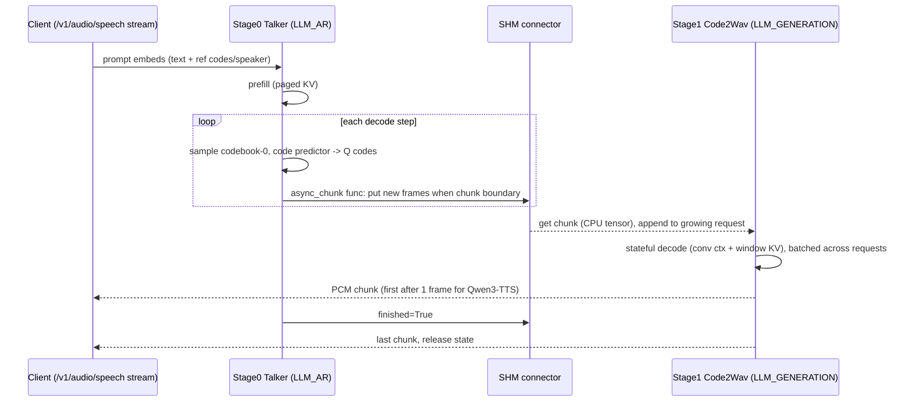

# vLLM-Omni — TTS and VLA Model-Level Analysis

| Field | Value |
|---|---|
| Local path | `/data/zhoutaichang/embedding_infer/vllm-omni` |
| Remote | `https://github.com/vllm-project/vllm-omni.git` (origin) |
| Branch | `main` |
| HEAD | `7be014bce6374f06c95b703763bdbac4c6198f31` (expected `7be014bc` — matches) |
| Dirty status | clean (`git status --short` empty) |
| Submodules | none (`git submodule status` empty, no `.gitmodules`) |
| Repo AGENTS.md/CLAUDE.md | none at repo root; `.claude/skills/` contains contributor skills only |
| Analysis date | 2026-09-07 (UTC) |
| Scope | Model-level deep dive of TTS and VLA/world-model implementations, feeding `tts_edge_design.md` / `vla_edge_design.md` |

Evidence labels: **[Verified]** = read in the cited source; **[Inferred]** = reasoned from structure; **[Proposal]** = design suggestion; **[Unknown]** = could not determine. Line numbers (`#Lnnn`) are from the cited checkout. Delegated read-outs by subagents were spot-checked against the tree; link existence was verified mechanically (see §8).

---

## 0. Summary

- vLLM-Omni is a **serving framework**, not an execution runtime: it composes vLLM's AR runtime (paged KV, continuous batching, CUDA graphs) with two additional stage types — `LLM_GENERATION` (non-AR "generation worker", used for codec decoders/vocoders) and `DIFFUSION` (its own diffusion worker) — orchestrated as multi-stage pipelines ([`stage_config.py#L194`](../../vllm-omni/vllm_omni/config/stage_config.py#L194), [`architecture_overview.md`](../../vllm-omni/docs/design/architecture_overview.md)). [Verified]
- Model topology is code (`PipelineConfig` in each `models/<family>/pipeline.py`, registered in [`pipeline_registry.py`](../../vllm-omni/vllm_omni/config/pipeline_registry.py)); placement/resources are YAML in [`vllm_omni/deploy/`](../../vllm-omni/vllm_omni/deploy) (90 files). There are **no** stage YAMLs under `vllm_omni/config/`. [Verified]
- 40 directories under `model_executor/models` (39 model families, every one shipping a `pipeline.py`, plus `common/` for shared kernels/modules; `output_templates.py` defines `OmniOutput`); by primary use: 15 TTS (+ Ming-flash-omni's TTS variant), 12 speech-to-speech/omni, 1 music, 5 image, 4 video/world, 2 VLA (+ `pi0` and `internvla_a1` living under `diffusion/models`). See §1. [Verified]
- **Dominant TTS pattern**: stage 0 = AR talker on a vLLM `Qwen2/Qwen3Model` backbone producing multi-codebook codec tokens (often with a per-frame sub-AR "code predictor"/"depth transformer"), stage 1 = codec decoder on the generation worker, connected by a `SharedMemoryConnector` carrying msgpack-serialised **CPU** tensors. [Verified]
- Streaming ("async chunk") is real and per-family: Qwen3-TTS emits the first chunk after **1 frame (80 ms)**, Fish after 4 frames, CosyVoice3 after 15+3 tokens with **cumulative re-decode**, MOSS-Delay variants effectively **not streaming** (`chunk_frames = 1<<30`), MOSS-Local after 1 frame. [Verified]
- Codec state across chunks is explicit and model-owned: Qwen3-TTS keeps 2-frame/12-frame conv contexts + a 72-frame sliding-window KV; MOSS keeps ring-KV slots; CosyVoice3 keeps cumulative mel; Fish keeps nothing (25-frame overlap re-decode). [Verified]
- **VLA models bypass vLLM entirely**: GR00T N1.7 and π0 are single `DIFFUSION`-stage wrappers around plain HF/torch models; observations arrive as raw numpy dicts in `OmniDiffusionSamplingParams.extra_args["robot_obs"]` over an OpenPI-compatible msgpack WebSocket (`/v1/realtime/robot/openpi`), actions return as `multimodal_output["actions"]`. No paged attention, no compile, `enforce_eager: true`, batch = 1. [Verified]
- DreamZero and LingBot-World are **AR-diffusion world models** with an experimental engine (`ARDiffusionEngine`) owning per-session paged KV; DreamZero = Wan-style 14B causal DiT + UMT5-XXL + CLIP ViT-H + Wan VAE, emitting a 24×8 action chunk per tick. Far outside edge budgets. [Verified]
- Edge-relevant small models in tree (label sources in §1): MOSS-TTS-Nano 0.1B, Gepard ~0.5B, CosyVoice3 0.5B, Ming-TTS 0.5B, Qwen3-TTS 0.6B/1.7B, MOSS-TTS-Realtime 1.7B, VoxCPM2 2B (L4-verified), Audex 2B, GR00T-N1.7 3B, π0 (~2B+0.3B+SigLIP). [Verified labels, sizes not computed]
- Portable sub-modules (plain torch, exportable in principle): Qwen3-TTS 12 Hz tokenizer decoder, Fish DAC decoder, CosyVoice3 CFM + HiFT, MOSS codec (transformer-only), GR00T policy + DiT head, π0 model. Non-portable: every AR talker (vLLM `Qwen3Model`/paged attention), CUDA-graph wrappers, TensorRT paths, Triton Snake kernels (with torch fallback). See §5. [Verified/Inferred]
- Platforms actually in tree: CUDA, ROCm, Ascend NPU, Intel XPU, MUSA ([`platforms/`](../../vllm-omni/vllm_omni/platforms)); **no CPU platform**, no Apple/Android/Jetson-specific code; `requirements/cpu.txt` exists only for docs builds. [Verified]
- Dependency floor: `vllm==0.28.0`, `transformers>=5.10.1,<5.15`, `diffusers==0.40.0`, `torchaudio` only pinned for NPU, `soundfile`, `onnxruntime`, `openai-whisper`; optional `flash-attn-4`, `tensorrt` (CosyVoice3/Step-Audio2), NeMo (Gepard/IndexTTS2), `fish-speech` pip package. [Verified]
- Repo-reported (not reproduced) TTS numbers: Qwen3-TTS TTFP 64 ms / RTF 0.16 on H200 at c=1 ([`qwen3_omni_tts_performance_optimization.md`](../../vllm-omni/docs/design/qwen3_omni_tts_performance_optimization.md)); async-chunk cuts Qwen3-Omni TTFP 6.5 s→0.52 s on H800 ([`async_chunk.md`](../../vllm-omni/docs/design/feature/async_chunk.md)).
- Key gaps for an edge port: no CPU/mobile backend, model code entangled with vLLM layer classes for all talkers, per-family bespoke stage processors, control loops with no KV reuse across steps (GR00T/π0 recompute full VLM prefill every tick), and several documented-but-unimplemented knobs (§7).

---

## 1. Model families inventory

Every directory under [`vllm_omni/model_executor/models`](../../vllm-omni/vllm_omni/model_executor/models). Stage notation: `id:model_stage(exec, arch, engine_out→final_out)`. Pipeline symbols are in each family's `pipeline.py`; registry keys from [`pipeline_registry.py#L130`](../../vllm-omni/vllm_omni/config/pipeline_registry.py#L130). Async flag from the family's default deploy YAML. Parameter counts are **labels** (HF id / comment / recipe), never computed. [Verified unless marked]

### 1a. TTS (text → speech)

| Family | in → out | Architecture type | Stages (async) | Example | Key files | Codec / vocoder | Params (source) |
|---|---|---|---|---|---|---|---|
| [`qwen3_tts`](../../vllm-omni/vllm_omni/model_executor/models/qwen3_tts) | text+instruct+ref-audio/speaker → 24 kHz | AR (Qwen3) + code predictor + codec | `0:qwen3_tts(LLM_AR, Qwen3TTSTalkerForConditionalGeneration, latent)`, `1:code2wav(LLM_GENERATION, Qwen3TTSCode2Wav, audio→audio)` (async **true**) | [offline](../../vllm-omni/examples/offline_inference/text_to_speech/qwen3_tts), [online](../../vllm-omni/examples/online_serving/text_to_speech/qwen3_tts) | [`qwen3_tts_talker.py`](../../vllm-omni/vllm_omni/model_executor/models/qwen3_tts/qwen3_tts_talker.py), [`qwen3_tts_code2wav.py`](../../vllm-omni/vllm_omni/model_executor/models/qwen3_tts/qwen3_tts_code2wav.py), [`prompt_embeds_builder.py`](../../vllm-omni/vllm_omni/model_executor/models/qwen3_tts/prompt_embeds_builder.py) | 12 Hz Mimi-style RVQ (16×2048) + causal conv/Snake decoder | 0.6B / 1.7B (HF ids, [recipe](../../vllm-omni/recipes/Qwen/Qwen3-TTS.md)) |
| [`cosyvoice3`](../../vllm-omni/vllm_omni/model_executor/models/cosyvoice3) | text+ref-audio+ref-text → 24 kHz | AR (Qwen2-0.5B) → CFM DiT → HiFT | `0:cosyvoice3_talker(LLM_AR, CosyVoice3Model, latent)`, `1:cosyvoice3_code2wav(LLM_GENERATION, latent→audio)` (async true) | [offline](../../vllm-omni/examples/offline_inference/text_to_speech/cosyvoice3), [online](../../vllm-omni/examples/online_serving/text_to_speech/cosyvoice3) | [`cosyvoice3.py`](../../vllm-omni/vllm_omni/model_executor/models/cosyvoice3/cosyvoice3.py), [`cfm.py`](../../vllm-omni/vllm_omni/model_executor/models/cosyvoice3/code2wav_core/cfm.py), [`hifigan.py`](../../vllm-omni/vllm_omni/model_executor/models/cosyvoice3/code2wav_core/hifigan.py) | 25 Hz FSQ tokens → 50 Hz mel (CFM, 10 Euler steps) → HiFT ISTFT | 0.5B (HF id) |
| [`fish_speech`](../../vllm-omni/vllm_omni/model_executor/models/fish_speech) | text+ref-audio+ref-text → 44.1 kHz | dual-AR (Qwen3 slow + 4-layer fast) + DAC | `0:fish_speech_slow_ar(LLM_AR, FishSpeechSlowARForConditionalGeneration, latent)`, `1:dac_decoder(LLM_GENERATION, FishSpeechDACDecoder, audio→audio)` (async true) | [offline](../../vllm-omni/examples/offline_inference/text_to_speech/fish_speech), [online](../../vllm-omni/examples/online_serving/text_to_speech/fish_speech) | [`fish_speech_slow_ar.py`](../../vllm-omni/vllm_omni/model_executor/models/fish_speech/fish_speech_slow_ar.py), [`fish_speech_fast_ar.py`](../../vllm-omni/vllm_omni/model_executor/models/fish_speech/fish_speech_fast_ar.py), [`fish_speech_dac_decoder.py`](../../vllm-omni/vllm_omni/model_executor/models/fish_speech/fish_speech_dac_decoder.py) | DAC (1 semantic 4096 + 9 residual 1024), hop 2048 ≈ 21.5 Hz | "4B" ([`speech_api.md`](../../vllm-omni/docs/serving/speech_api.md)) |
| [`moss_tts`](../../vllm-omni/vllm_omni/model_executor/models/moss_tts) | text+ref-audio/instruction → 24 kHz (Local: 48 kHz stereo) | AR (Qwen3 + n_vq+1 heads, delay pattern; Realtime/Local: depth transformer) + transformer codec | `0:moss_tts(LLM_AR, MossTTSDelayModel\|MossTTSRealtime\|MossTTSLocalModel, latent)`, `1:moss_tts_codec(LLM_GENERATION, MossTTSCodecDecoder, audio→audio, retains_state_across_chunks)` (async true) | [offline](../../vllm-omni/examples/offline_inference/text_to_speech/moss_tts) | [`modeling_moss_tts_talker.py`](../../vllm-omni/vllm_omni/model_executor/models/moss_tts/modeling_moss_tts_talker.py), [`modeling_moss_tts_codec.py`](../../vllm-omni/vllm_omni/model_executor/models/moss_tts/modeling_moss_tts_codec.py), [`audio_tokenizer_v2.py`](../../vllm-omni/vllm_omni/model_executor/models/moss_tts/audio_tokenizer_v2.py) | MOSS Audio Tokenizer (RLFQ, 12.5 Hz, transformer-only) | 8B / 1.7B ([`registry.py#L364`](../../vllm-omni/vllm_omni/model_executor/models/registry.py#L364), YAML headers) |
| [`moss_tts_nano`](../../vllm-omni/vllm_omni/model_executor/models/moss_tts_nano) | text(+ref) → speech | single-stage AR (HF remote code) | `0:moss_tts_nano(LLM_AR, MossTTSNanoForCausalLM, audio→audio)` (async false) | [offline](../../vllm-omni/examples/offline_inference/text_to_speech/moss_tts_nano), [online](../../vllm-omni/examples/online_serving/text_to_speech/moss_tts_nano) | [`modeling_moss_tts_nano.py`](../../vllm-omni/vllm_omni/model_executor/models/moss_tts_nano/modeling_moss_tts_nano.py) | MOSS-Audio-Tokenizer-Nano | 0.1B ([`pipeline.py#L5`](../../vllm-omni/vllm_omni/model_executor/models/moss_tts_nano/pipeline.py#L5)) |
| [`dots_tts`](../../vllm-omni/vllm_omni/model_executor/models/dots_tts) | text+x-vector → 48 kHz | single-stage AR (Qwen2.5-1.5B) + DiTAR/MeanFlow + AudioVAE + BigVGAN | `0:latent_generator(LLM_AR, DotsTTSForConditionalGeneration, audio→audio)` (async false) | [offline](../../vllm-omni/examples/offline_inference/text_to_speech/dots_tts) | [`dots_tts_talker.py`](../../vllm-omni/vllm_omni/model_executor/models/dots_tts/dots_tts_talker.py), [`dots_tts_vocoder.py`](../../vllm-omni/vllm_omni/model_executor/models/dots_tts/dots_tts_vocoder.py) | AudioVAE → BigVGAN 48 kHz | ~1.7B ([recipe](../../vllm-omni/recipes/rednote-hilab/dots.tts.md)) |
| [`gepard`](../../vllm-omni/vllm_omni/model_executor/models/gepard) | text → 22 kHz | single-stage AR (Qwen3.5 + 32 FSQ heads) | `0:gepard(LLM_AR, GepardTalkerForConditionalGeneration, audio→audio)` (async false, eager) | [offline](../../vllm-omni/examples/offline_inference/text_to_speech/gepard) | [`gepard_talker.py`](../../vllm-omni/vllm_omni/model_executor/models/gepard/gepard_talker.py), [`nanocodec.py`](../../vllm-omni/vllm_omni/model_executor/models/gepard/nanocodec.py) | NeMo NanoCodec (external dep) | ~0.5B ([`gepard.yaml#L1`](../../vllm-omni/vllm_omni/deploy/gepard.yaml#L1)) |
| [`glm_tts`](../../vllm-omni/vllm_omni/model_executor/models/glm_tts) | text+ref-audio (WhisperVQ) → 24/32 kHz | AR → CFM DiT → HiFT/Vocos | `0:glm_tts(LLM_AR, GLMTTSForConditionalGeneration, latent)`, `1:glm_tts_dit(LLM_GENERATION, latent→audio)` (async true) | [offline](../../vllm-omni/examples/offline_inference/text_to_speech/glm_tts), [online](../../vllm-omni/examples/online_serving/text_to_speech/glm_tts) | [`glm_tts.py`](../../vllm-omni/vllm_omni/model_executor/models/glm_tts/glm_tts.py), [`glm_tts_dit.py`](../../vllm-omni/vllm_omni/model_executor/models/glm_tts/glm_tts_dit.py), [`whisper_vq.py`](../../vllm-omni/vllm_omni/model_executor/models/common/whisper_vq.py) | HiFT (reused from CosyVoice3) or Vocos2D TorchScript | Unknown |
| [`higgs_audio_v2`](../../vllm-omni/vllm_omni/model_executor/models/higgs_audio_v2) | text → 24 kHz | AR (Llama-3.2-3B, 8 codebooks, DualFFN) + RVQ/DAC | `0:higgs_audio_v2(LLM_AR, latent)`, `1:code2wav(LLM_GENERATION, audio→audio)` (async false) | [offline](../../vllm-omni/examples/offline_inference/text_to_speech/higgs_audio_v2) | [`higgs_audio_v2_talker.py`](../../vllm-omni/vllm_omni/model_executor/models/higgs_audio_v2/higgs_audio_v2_talker.py), [`higgs_audio_decoder.py`](../../vllm-omni/vllm_omni/model_executor/models/higgs_audio_v2/higgs_audio_decoder.py) | RVQ 8×1024 + DAC decoder, 25 fps | 3B (HF id) |
| [`higgs_audio_v3`](../../vllm-omni/vllm_omni/model_executor/models/higgs_audio_v3) | text+ref → 24 kHz | AR (Qwen3 ~4B, delay pattern) + RVQ/DAC | same shape, key `higgs_multimodal_qwen3` (async true) | [offline](../../vllm-omni/examples/offline_inference/text_to_speech/higgs_audio_v3), [online](../../vllm-omni/examples/online_serving/text_to_speech/higgs_audio_v3) | [`higgs_audio_v3_talker.py`](../../vllm-omni/vllm_omni/model_executor/models/higgs_audio_v3/higgs_audio_v3_talker.py) | v2 decoder | ~4B (talker docstring) |
| [`indextts2`](../../vllm-omni/vllm_omni/model_executor/models/indextts2) | text+ref(+emotion ref) → speech | GPT2-style AR → S2Mel CFM (25 steps) + BigVGAN | `0:indextts2_talker(LLM_AR, latent)`, `1:indextts2_s2mel_decoder(LLM_GENERATION, audio→audio)` (async **false**, non-streaming) | [offline](../../vllm-omni/examples/offline_inference/text_to_speech/indextts2), [online](../../vllm-omni/examples/online_serving/text_to_speech/indextts2) | [`indextts2_talker.py`](../../vllm-omni/vllm_omni/model_executor/models/indextts2/indextts2_talker.py), [`indextts2_s2mel_decoder.py`](../../vllm-omni/vllm_omni/model_executor/models/indextts2/indextts2_s2mel_decoder.py) | S2Mel CFM → BigVGAN; w2v-bert (~600M) semantic front-end | Unknown |
| [`ming_tts`](../../vllm-omni/vllm_omni/model_executor/models/ming_tts) | text+ref (CAM++) → 44.1 kHz | AR LM + per-step CFM head (DiTAR) → AudioVAE | `0:llm(LLM_AR, MingTTSForConditionalGeneration, latent)`, `1:audio_vae(LLM_GENERATION, audio→audio)` (async true) | [offline](../../vllm-omni/examples/offline_inference/text_to_speech/ming_tts), [online](../../vllm-omni/examples/online_serving/text_to_speech/ming_tts) | [`ming_tts.py`](../../vllm-omni/vllm_omni/model_executor/models/ming_tts/ming_tts.py), [`common/ming/cfm_dit.py`](../../vllm-omni/vllm_omni/model_executor/models/common/ming/cfm_dit.py) | AudioVAE (Qwen2 decoder + ISTFT) | 0.5B dense / 16.8B-A3B MoE ([`pipeline.py#L18`](../../vllm-omni/vllm_omni/model_executor/models/ming_tts/pipeline.py#L18)) |
| [`omnivoice`](../../vllm-omni/vllm_omni/model_executor/models/omnivoice) | text+ref → 24 kHz | non-AR masked-generative (Qwen3 backbone) → DAC | `0:dit(DIFFUSION, OmniVoicePipeline, audio→audio)` (async false) | [offline](../../vllm-omni/examples/offline_inference/text_to_speech/omnivoice), [online](../../vllm-omni/examples/online_serving/text_to_speech/omnivoice) | [`omnivoice_generator.py`](../../vllm-omni/vllm_omni/model_executor/models/omnivoice/omnivoice_generator.py), [`fused_qkv_rope.py`](../../vllm-omni/vllm_omni/model_executor/models/omnivoice/fused_qkv_rope.py) (Triton) | RVQ + `transformers` DacModel | Unknown |
| [`voxcpm2`](../../vllm-omni/vllm_omni/model_executor/models/voxcpm2) | text+ref → 48 kHz | single-stage AR (MiniCPM4 paged) + LocDiT CFM + AudioVAE | `0:latent_generator(LLM_AR, VoxCPM2TalkerForConditionalGeneration, audio→audio)`, custom scheduler (async false) | [offline](../../vllm-omni/examples/offline_inference/text_to_speech/voxcpm2), [online](../../vllm-omni/examples/online_serving/text_to_speech/voxcpm2) | [`voxcpm2_talker.py`](../../vllm-omni/vllm_omni/model_executor/models/voxcpm2/voxcpm2_talker.py), [`scheduler.py`](../../vllm-omni/vllm_omni/model_executor/models/voxcpm2/scheduler.py) | LocDiT CFM → AudioVAE | 2B ([recipe](../../vllm-omni/recipes/OpenBMB/VoxCPM2.md)); L4-24GB target ([`voxcpm2.yaml#L2`](../../vllm-omni/vllm_omni/deploy/voxcpm2.yaml#L2)) |
| [`voxtral_tts`](../../vllm-omni/vllm_omni/model_executor/models/voxtral_tts) | text+voice → 24 kHz | AR LM → flow-matching acoustic transformer + codec | `0:audio_generation(LLM_AR, latent)`, `1:audio_tokenizer(LLM_GENERATION, audio→audio)` (async true) | [offline](../../vllm-omni/examples/offline_inference/text_to_speech/voxtral_tts), [online](../../vllm-omni/examples/online_serving/text_to_speech/voxtral_tts) | [`voxtral_tts_audio_generation.py`](../../vllm-omni/vllm_omni/model_executor/models/voxtral_tts/voxtral_tts_audio_generation.py) | Mistral audio tokenizer (Euler ODE + CFG) | 4B (HF id) |
| [`ming_flash_omni`](../../vllm-omni/vllm_omni/model_executor/models/ming_flash_omni) (TTS variant `ming_flash_omni_tts`) | text → speech | single `LLM_GENERATION` talker (Qwen2 + CFM + AudioVAE) | `0:ming_tts(LLM_GENERATION, MingFlashOmniTalkerForConditionalGeneration, audio→audio)` (async false) | [offline](../../vllm-omni/examples/offline_inference/text_to_speech/ming_flash_omni_tts) | [`ming_flash_omni_talker.py`](../../vllm-omni/vllm_omni/model_executor/models/ming_flash_omni/ming_flash_omni_talker.py) | CFM DiT + AudioVAE | Unknown |

### 1b. Speech-to-speech / omni (multimodal in → text + speech)

| Family | in → out | Architecture | Stages (async) | Example | Key files | Vocoder | Params |
|---|---|---|---|---|---|---|---|
| [`qwen2_5_omni`](../../vllm-omni/vllm_omni/model_executor/models/qwen2_5_omni) | text/image/audio/video → text+speech | thinker AR → talker AR → DiT+BigVGAN | `0:thinker(LLM_AR)`, `1:talker(LLM_AR)`, `2:code2wav(LLM_GENERATION)` (async false) | [offline](../../vllm-omni/examples/offline_inference/qwen2_5_omni) | [`qwen2_5_omni_token2wav.py`](../../vllm-omni/vllm_omni/model_executor/models/qwen2_5_omni/qwen2_5_omni_token2wav.py) | DiT (50 Hz) + BigVGAN | 7B / 3B |
| [`qwen3_omni`](../../vllm-omni/vllm_omni/model_executor/models/qwen3_omni) | same → text+16 kHz speech | MoE thinker → MoE talker (+code predictor) → ConvNeXt Code2Wav | 3 stages, async **true** (reference streaming impl) | [offline](../../vllm-omni/examples/offline_inference/qwen3_omni), [online](../../vllm-omni/examples/online_serving/qwen3_omni) | [`qwen3_omni_code2wav.py`](../../vllm-omni/vllm_omni/model_executor/models/qwen3_omni/qwen3_omni_code2wav.py) | ~200M ConvNet ([doc](../../vllm-omni/docs/design/architecture_overview.md)) | 30B-A3B |
| [`minicpmo_4_5`](../../vllm-omni/vllm_omni/model_executor/models/minicpmo_4_5) | omni → text+24 kHz; **full-duplex** | thinker AR → TTS AR → CFM+HiFT | 3 stages, async true, `duplex_control_enabled` | [offline](../../vllm-omni/examples/offline_inference/minicpmo), [online](../../vllm-omni/examples/online_serving/minicpmo) | [`minicpmo_4_5_omni_llm.py`](../../vllm-omni/vllm_omni/model_executor/models/minicpmo_4_5/minicpmo_4_5_omni_llm.py), [`duplex/stage0.py`](../../vllm-omni/vllm_omni/model_executor/models/minicpmo_4_5/duplex/stage0.py) | CosyVoice-style CFM + HiFT | Unknown |
| [`step_audio2`](../../vllm-omni/vllm_omni/model_executor/models/step_audio2) | audio+text → text+speech | AR thinker → CosyVoice2 flow + HiFT | 2 stages (async false default; `_async_chunk.yaml` true) | [offline](../../vllm-omni/examples/offline_inference/step_audio2) | [`step_audio2_token2wav.py`](../../vllm-omni/vllm_omni/model_executor/models/step_audio2/step_audio2_token2wav.py), [`step_audio2_dit_trt.py`](../../vllm-omni/vllm_omni/model_executor/models/step_audio2/step_audio2_dit_trt.py) | CosyVoice2 DiT (+TRT) + HiFT | Unknown |
| [`mimo_audio`](../../vllm-omni/vllm_omni/model_executor/models/mimo_audio) | audio+text → text+24 kHz | fused thinker/talker AR + patch decoder → Vocos | 2 stages, async true; RTX 5090 profile | [offline](../../vllm-omni/examples/offline_inference/mimo_audio) | [`mimo_audio_code2wav.py`](../../vllm-omni/vllm_omni/model_executor/models/mimo_audio/mimo_audio_code2wav.py) | VQ → Vocos ISTFT | 7B |
| [`covo_audio`](../../vllm-omni/vllm_omni/model_executor/models/covo_audio) | audio+text → text+24 kHz | fused AR → CFM + BigVGAN | 2 stages, async false | [offline](../../vllm-omni/examples/offline_inference/covo_audio) | [`token2wav.py`](../../vllm-omni/vllm_omni/model_executor/models/covo_audio/token2wav.py) | CFM + BigVGAN | 7B |
| [`dynin_omni`](../../vllm-omni/vllm_omni/model_executor/models/dynin_omni) | text → text+image+audio | 3× `LLM_GENERATION` chain | async false; L4-sized CI profile | [offline](../../vllm-omni/examples/offline_inference/dynin_omni) | [`dynin_omni_common.py`](../../vllm-omni/vllm_omni/model_executor/models/dynin_omni/dynin_omni_common.py) | external tokenizer | Unknown |
| [`ming_flash_omni`](../../vllm-omni/vllm_omni/model_executor/models/ming_flash_omni) | omni → text/speech/image | BailingMoE-v2 AR (TP4) → talker / DiT | async false | [offline](../../vllm-omni/examples/offline_inference/ming_flash_omni) | [`modeling_bailing_moe_v2.py`](../../vllm-omni/vllm_omni/model_executor/models/ming_flash_omni/modeling_bailing_moe_v2.py) | CFM+AudioVAE | Unknown (MoE) |
| [`aura_omni`](../../vllm-omni/vllm_omni/model_executor/models/aura_omni) | mic audio+video → text+speech | 4-stage cascade ASR→VLM→Qwen3-TTS→Code2Wav | async false, single GPU | [offline](../../vllm-omni/examples/offline_inference/aura_omni) | [`pipeline.py`](../../vllm-omni/vllm_omni/model_executor/models/aura_omni/pipeline.py) | Qwen3-TTS Code2Wav | 1.7B+?+1.7B |
| [`audex`](../../vllm-omni/vllm_omni/model_executor/models/audex) | text→16 kHz (TTS), audio→text/speech (S2S), caption→audio (TTA) | Nemotron AR + streaming causal speech decoder / XCodec1 | 4 pipelines; TTS/S2S async true | [offline](../../vllm-omni/examples/offline_inference/audex) | [`speech_decoder/modeling_audex_causal_speech_decoder.py`](../../vllm-omni/vllm_omni/model_executor/models/audex/speech_decoder/modeling_audex_causal_speech_decoder.py) | Audex causal decoder (4-frame lookahead) | 2B / 30B-A3B ([recipe](../../vllm-omni/recipes/NVIDIA/Nemotron-Labs-Audex.md)) |
| [`nemotron_voicechat`](../../vllm-omni/vllm_omni/model_executor/models/nemotron_voicechat) | speech → text+22.05 kHz; full-duplex | FastConformer + NemotronH AR → EAR-TTS AR → RVQ-VAE | 3 stages; `_duplex.yaml` | [offline](../../vllm-omni/examples/offline_inference/nemotron_voicechat) | [`nemo_vendored/ear_tts_model.py`](../../vllm-omni/vllm_omni/model_executor/models/nemotron_voicechat/nemo_vendored/ear_tts_model.py) | NeMo RVQ-VAE (fp32) | 11B |
| [`personaplex`](../../vllm-omni/vllm_omni/model_executor/models/personaplex) | audio → audio (Moshi finetune, full-duplex) | Helium temporal AR + depformer + Mimi | 2 stages, async true | [online](../../vllm-omni/examples/online_serving/personaplex) | [`personaplex_depformer.py`](../../vllm-omni/vllm_omni/model_executor/models/personaplex/personaplex_depformer.py), [`personaplex_mimi.py`](../../vllm-omni/vllm_omni/model_executor/models/personaplex/personaplex_mimi.py) | Mimi 24 kHz | Unknown |

### 1c. Music, image, video / world

| Family | in → out | Architecture | Stages | Key files | Params |
|---|---|---|---|---|---|
| [`minimax_music3`](../../vllm-omni/vllm_omni/model_executor/models/minimax_music3) | caption+lyrics → 32 kHz stereo music | AR (Qwen3 + depth decoder, 8 RVQ, mandatory CFG) → CFM DiT + DAV | 2 stages, async true, 140 GB card | [`talker.py`](../../vllm-omni/vllm_omni/model_executor/models/minimax_music3/talker.py), [`dit.py`](../../vllm-omni/vllm_omni/model_executor/models/minimax_music3/dit.py) | Unknown |
| [`bagel`](../../vllm-omni/vllm_omni/model_executor/models/bagel) | text+image → text/image | AR thinker (KV transfer) → DiT; single-stage variant | 3 pipelines | [`bagel.py`](../../vllm-omni/vllm_omni/model_executor/models/bagel/bagel.py) | 7B |
| [`glm_image`](../../vllm-omni/vllm_omni/model_executor/models/glm_image) | text → image | AR VQ tokens → DiT | 2 stages, 2 GPUs | [`glm_image_ar.py`](../../vllm-omni/vllm_omni/model_executor/models/glm_image/glm_image_ar.py) | Unknown |
| [`hunyuan_image3`](../../vllm-omni/vllm_omni/model_executor/models/hunyuan_image3) | text+image → text+image | MoE AR → DiT (KV reuse) | 3 pipelines, TP2–4 | [`hunyuan_image3.py`](../../vllm-omni/vllm_omni/model_executor/models/hunyuan_image3/hunyuan_image3.py) | 80B (comment) |
| [`mammoth_moda2`](../../vllm-omni/vllm_omni/model_executor/models/mammoth_moda2) | text+image → image | AR (Qwen2.5-VL) → DiT on generation worker | 2 stages | [`mammoth_moda2.py`](../../vllm-omni/vllm_omni/model_executor/models/mammoth_moda2/mammoth_moda2.py) | Unknown |
| [`lance`](../../vllm-omni/vllm_omni/model_executor/models/lance) | text+image → image/text/video | single DiT stage (embedded Qwen2-MoT + Wan VAE) | 1 stage | [`pipeline.py`](../../vllm-omni/vllm_omni/model_executor/models/lance/pipeline.py) | 3B (recipe) |
| [`wan2_2`](../../vllm-omni/vllm_omni/model_executor/models/wan2_2) | text(+image) → video | diffusion DiT | 1 stage | [`pipeline.py`](../../vllm-omni/vllm_omni/model_executor/models/wan2_2/pipeline.py) | 5B (YAML) |
| [`hunyuan_video`](../../vllm-omni/vllm_omni/model_executor/models/hunyuan_video) | text/image → video | diffusion DiT | 1 stage | [`pipeline.py`](../../vllm-omni/vllm_omni/model_executor/models/hunyuan_video/pipeline.py) | Unknown |
| [`minimax_h3`](../../vllm-omni/vllm_omni/model_executor/models/minimax_h3) | text+refs → video+audio | Qwen3-VL text encoder (LLM_AR) → inline DiT | 2 stages, 6 GPUs default | [`text_encoder.py`](../../vllm-omni/vllm_omni/model_executor/models/minimax_h3/text_encoder.py) | Unknown |
| [`lingbot_world`](../../vllm-omni/vllm_omni/model_executor/models/lingbot_world) | image+text+camera controls → streaming video | causal AR-diffusion DiT, paged KV (world model) | 1 DIFFUSION stage, `ARDiffusionEngine` | [`diffusion/models/lingbot_world/pipeline.py`](../../vllm-omni/vllm_omni/diffusion/models/lingbot_world/pipeline.py) | 14B (HF id) |

### 1d. VLA / robot policy

| Family | in → out | Architecture | Stages | Example | Key files | Params |
|---|---|---|---|---|---|---|
| [`gr00t`](../../vllm-omni/vllm_omni/model_executor/models/gr00t) | images+state+instruction → action chunk | Qwen3-VL (Cosmos-Reason2-2B, 12 layers) + flow-matching DiT head | `0:diffusion(DIFFUSION, Gr00tN1d7Pipeline, →actions)`; `max_num_seqs 1`, eager | none in `examples/` (recipe only) | [`pipeline_gr00t.py`](../../vllm-omni/vllm_omni/diffusion/models/gr00t/pipeline_gr00t.py), [`policy.py`](../../vllm-omni/vllm_omni/diffusion/models/gr00t/policy.py), [`gr00t_n1d7.py`](../../vllm-omni/vllm_omni/diffusion/models/gr00t/modeling/gr00t_n1d7.py) | 3B (HF id) |
| [`dreamzero`](../../vllm-omni/vllm_omni/model_executor/models/dreamzero) | images+state+text → actions (+video latents) | Wan-style causal 14B DiT world model + UMT5-XXL + CLIP ViT-H + Wan VAE | `0:diffusion(DIFFUSION, DreamZeroPipeline, →image)`; `ARDiffusionEngine`; CFG-parallel 2 | [offline](../../vllm-omni/examples/offline_inference/dreamzero), [online](../../vllm-omni/examples/online_serving/dreamzero) | [`pipeline_dreamzero.py`](../../vllm-omni/vllm_omni/diffusion/models/dreamzero/pipeline_dreamzero.py), [`causal_wan_model.py`](../../vllm-omni/vllm_omni/diffusion/models/dreamzero/causal_wan_model.py) | 14B (comment [`causal_wan_model.py#L743`](../../vllm-omni/vllm_omni/diffusion/models/dreamzero/causal_wan_model.py#L743)) |
| `pi0` (under `diffusion/models`) | 3 images+state+prompt → 50×32 actions | PaliGemma (SigLIP+Gemma-2B) + Gemma-300M action expert, flow matching | `0:diffusion(DIFFUSION, Pi0Pipeline, →action)` ([`pi0_pipeline_config.py`](../../vllm-omni/vllm_omni/diffusion/models/pi0_pipeline_config.py)) | [online](../../vllm-omni/examples/online_serving/pi0) | [`pipeline_pi0.py`](../../vllm-omni/vllm_omni/diffusion/models/pi0/pipeline_pi0.py), [`modeling_pi0.py`](../../vllm-omni/vllm_omni/diffusion/models/pi0/modeling_pi0.py) | "~13 GB checkpoint" ([recipe](../../vllm-omni/recipes/lerobot/Pi0.md)) |
| `internvla_a1` (diffusion only, no PipelineConfig) | 3 cams×2 frames+state+task → 50×32 actions | Qwen3-VL und/gen/act three-expert + Cosmos CI8x8 tokenizer, flow matching | offline-only via `pipeline.forward` | [offline](../../vllm-omni/examples/offline_inference/internvla_a1) | [`pipeline_internvla_a1.py`](../../vllm-omni/vllm_omni/diffusion/models/internvla_a1/pipeline_internvla_a1.py), [`model_internvla_a1.py`](../../vllm-omni/vllm_omni/diffusion/models/internvla_a1/model_internvla_a1.py) | 3B (HF id) |

### 1e. Shared `common/` modules [Verified]

[`common/`](../../vllm-omni/vllm_omni/model_executor/models/common): [`snake_activation.py`](../../vllm-omni/vllm_omni/model_executor/models/common/snake_activation.py) (Snake/SnakeBeta, lazy `@triton.jit` on CUDA with torch fallback; used by Qwen3-TTS, Qwen3-Omni, Qwen2.5-Omni, CoVo, CosyVoice3); [`alias_free_activation.py`](../../vllm-omni/vllm_omni/model_executor/models/common/alias_free_activation.py) (plain torch); [`qwen3_code_predictor.py`](../../vllm-omni/vllm_omni/model_executor/models/common/qwen3_code_predictor.py) (shared code predictor, SDPA + `torch.compile` + optional manual CUDA graphs); [`nucleus_ras_sampling.py`](../../vllm-omni/vllm_omni/model_executor/models/common/nucleus_ras_sampling.py) (used by GLM-TTS only; CosyVoice3 has its own copy); [`whisper_vq.py`](../../vllm-omni/vllm_omni/model_executor/models/common/whisper_vq.py); [`cfg_pairing.py`](../../vllm-omni/vllm_omni/model_executor/models/common/cfg_pairing.py) (CFG request pairing for the vLLM scheduler); [`ops/fused_group_norm_silu.py`](../../vllm-omni/vllm_omni/model_executor/models/common/ops/fused_group_norm_silu.py) and [`ops/fused_adaptive_group_norm_silu.py`](../../vllm-omni/vllm_omni/model_executor/models/common/ops/fused_adaptive_group_norm_silu.py) (Triton `@triton.autotune`/`@triton.jit`, torch fallback when `HAS_TRITON` false); [`ming/`](../../vllm-omni/vllm_omni/model_executor/models/common/ming) (CFM DiT, AudioVAE, batch-1 CUDA-graph executor `cfm_cudagraph.py`, CAM++ via onnxruntime).

---

## 2. TTS deep dive

Four families chosen for documentation depth and architectural spread: **Qwen3-TTS** (AR + code predictor + neural codec, streaming reference), **CosyVoice3** (AR + flow-matching + HiFT), **Fish Speech S2 Pro** (dual-AR + DAC), **MOSS-TTS** (delay-pattern / depth-transformer + transformer codec). Cross-family mechanics are in §4.

### 2.1 Qwen3-TTS (`qwen3_tts`)

**Pipeline** [Verified] — [`pipeline.py#L16`](../../vllm-omni/vllm_omni/model_executor/models/qwen3_tts/pipeline.py#L16): stage 0 `qwen3_tts` (`LLM_AR`, `Qwen3TTSTalkerForConditionalGeneration`, `engine_output_type="latent"`, `owns_tokenizer`, `sampling_constraints={"detokenize": False, "stop_token_ids": [2150]}`, async func `talker2code2wav_async_chunk`, full-payload func `talker2code2wav_full_payload`); stage 1 `code2wav` (`LLM_GENERATION`, `Qwen3TTSCode2Wav`, `final_output_type="audio"`, `sync_process_input_func=talker2code2wav_token_only`, `requires_full_payload_input`, `extras.tts_args.max_instructions_length=500`). Deploy [`qwen3_tts.yaml`](../../vllm-omni/vllm_omni/deploy/qwen3_tts.yaml): `async_chunk: true`; connector extras `codec_chunk_frames: 25`, `codec_left_context_frames: 72` ("must match the decoder sliding attention window"), `initial_codec_chunk_frames: 1`, `decode_batch_max_size: 4`; stage 0 `max_num_seqs 64`, `gpu_memory_utilization 0.3`, `max_model_len 4096`, sampling `temperature 0.9, top_k 50, repetition_penalty 1.05, min_tokens 2`, `subtalker_sampling_params {do_sample, 0.9, top_k 50}`; stage 1 `max_num_seqs 64`, `enforce_eager: false`, `max_model_len 65536` ("prefill length is Q × num_frames"); `platforms.rocm` forces stage 1 eager (MIOpen Conv1d inside graph capture), `platforms.npu` uses `cudagraph_mode: PIECEWISE`. High-concurrency 2-GPU profile: [`qwen3_tts_high_concurrency.yaml`](../../vllm-omni/vllm_omni/deploy/qwen3_tts_high_concurrency.yaml).

**Conditioning** [Verified] — [`prompt_embeds_builder.py`](../../vllm-omni/vllm_omni/model_executor/models/qwen3_tts/prompt_embeds_builder.py) `Qwen3TTSPromptEmbedsBuilder.build_prompt_embeds()` (L918-1455): text via HF `AutoTokenizer` in `<|im_start|>assistant\n{text}<|im_end|>` template, embedded through a separate `text_embedding` table + `text_projection` MLP ([`qwen3_tts_talker.py#L371`](../../vllm-omni/vllm_omni/model_executor/models/qwen3_tts/qwen3_tts_talker.py#L371)); `instruct` prepended as a user turn; `language` inserted as codec "think" tokens from `talker_config.codec_language_id`; **CustomVoice** = speaker id embedded via codec table; **VoiceDesign** = tags + text only; **Base** (clone) = ECAPA-TDNN speaker encoder `Qwen3TTSSpeakerEncoder` ([`qwen3_tts_talker.py#L202`](../../vllm-omni/vllm_omni/model_executor/models/qwen3_tts/qwen3_tts_talker.py#L202)) over a 128-mel spectrogram (24 kHz, n_fft 1024, hop 256), optionally plus ICL: reference audio encoded to codec frames by `Qwen3TTSTokenizerV2Encoder` (a `MimiModel` subclass, [`modeling_qwen3_tts_tokenizer_v2.py#L1587`](../../vllm-omni/vllm_omni/model_executor/models/qwen3_tts/tokenizer_12hz/modeling_qwen3_tts_tokenizer_v2.py#L1587)) in `_encode_ref_audio_batch` ([`#L1039`](../../vllm-omni/vllm_omni/model_executor/models/qwen3_tts/qwen3_tts_talker.py#L1039)) — 16 codebooks kept, cached by SHA1 of waveform (LRU 256). Audio loading: `soundfile` for base64, vLLM `MediaConnector`/`load_audio` + `AudioResampler` otherwise (no direct librosa/torchaudio import in this dir). Streaming vs non-streaming prompt mode: non-streaming (default for CustomVoice/VoiceDesign) puts full text in prefill; streaming (default for Base) feeds one text-embedding row per decode step from a `trailing_text_hidden` queue ([`#L833`](../../vllm-omni/vllm_omni/model_executor/models/qwen3_tts/qwen3_tts_talker.py#L833)).

**Generation** [Verified] — AR over codec **frames**: vLLM samples codebook-0 per step from `lm_head` (logits masked to `[1, codebook_vocab) ∪ {eos}`, [`#L414`](../../vllm-omni/vllm_omni/model_executor/models/qwen3_tts/qwen3_tts_talker.py#L414)); residual codebooks 1..Q-1 predicted by the **code predictor** ([`common/qwen3_code_predictor.py`](../../vllm-omni/vllm_omni/model_executor/models/common/qwen3_code_predictor.py) `CodePredictorWrapper.forward` L996-1138): a 5-layer / hidden-1024 / 16-head decoder (config defaults [`configuration_qwen3_tts.py#L191`](../../vllm-omni/vllm_omni/model_executor/models/qwen3_tts/configuration_qwen3_tts.py#L191)) that **re-prefills** `[proj(hidden), proj(embed(c0)), …]` per codebook with SDPA and **no KV cache**, Gumbel-max top-k sampling; on CUDA it is `torch.compile(dynamic=False)` with power-of-2 batch buckets, manual CUDA graphs only on NPU ([`qwen3_tts_code_predictor_vllm.py#L38`](../../vllm-omni/vllm_omni/model_executor/models/qwen3_tts/qwen3_tts_code_predictor_vllm.py#L38)). Runner hook `talker_mtp()` ([`#L1245`](../../vllm-omni/vllm_omni/model_executor/models/qwen3_tts/qwen3_tts_talker.py#L1245)) returns `(inputs_embeds [B,H], audio_codes [B,Q])`; next-step input embedding = Σ codebook embeddings + one text-step vector. Q = 16 codebooks × 2048 for the 12 Hz family ([`stage_input_processors/qwen3_tts.py#L390`](../../vllm-omni/vllm_omni/model_executor/stage_input_processors/qwen3_tts.py#L390)); frame = 1920 samples @ 24 kHz = **80 ms = 12.5 Hz** ([`configuration_qwen3_tts_tokenizer_v2.py#L147`](../../vllm-omni/vllm_omni/model_executor/models/qwen3_tts/tokenizer_12hz/configuration_qwen3_tts_tokenizer_v2.py#L147)). The 25 Hz tokenizer ([`tokenizer_25hz/`](../../vllm-omni/vllm_omni/model_executor/models/qwen3_tts/tokenizer_25hz), Whisper-VQ + DiT + BigVGAN, imports onnxruntime/torchaudio-kaldi/flash-attn) is **not** used by the vLLM stages.

**Codec / vocoder** [Verified] — [`qwen3_tts_code2wav.py`](../../vllm-omni/vllm_omni/model_executor/models/qwen3_tts/qwen3_tts_code2wav.py) `Qwen3TTSCode2Wav` wraps `Qwen3TTSTokenizerV2Decoder` ([`modeling_qwen3_tts_tokenizer_v2.py#L807`](../../vllm-omni/vllm_omni/model_executor/models/qwen3_tts/tokenizer_12hz/modeling_qwen3_tts_tokenizer_v2.py#L807)) in **float32**: `SplitResidualVectorQuantizer.decode` (1 semantic + 15 acoustic) → causal `pre_conv(k=3)` → 8-layer **sliding-window-72 causal transformer** → two ×2 causal ConvTranspose+ConvNeXt upsamples → BigVGAN/DAC-style stack (SnakeBeta, rates 8,5,4,3, dilations 1,3,9) → clamp. Runs on the generation worker (stage 1, `requires_raw_input_tokens`, `requires_request_ids`); input codes arrive flat codebook-major `[Q*F]` in `runtime_additional_information["codes"]["audio"]`; **batched** across requests (`[B,Q,max_F]` + lengths, `decode_batch_max_size`), chunked via `batched_chunked_decode(chunk 300, left_context 25)` in non-async mode, or **stateful per-request** decode in async mode. Output `{"model_outputs": [float32 wav], "sr": [24000]}`. CUDA graphs: [`segmented_graph_wrapper.py`](../../vllm-omni/vllm_omni/model_executor/models/qwen3_tts/segmented_graph_wrapper.py) captures stateful ICL-prefix / xvec-prefix graphs per batch bucket and "combined suffix" graphs for every reachable chunk length derived from `initial→+25→…→72→72+25` (`_derive_suffix_transitions` L113); the older stateless [`cuda_graph_decoder_wrapper.py`](../../vllm-omni/vllm_omni/model_executor/models/qwen3_tts/cuda_graph_decoder_wrapper.py) survives only for its `_batched_chunked_decode` helper.

**Streaming / first-audio structure** [Verified] — `talker2code2wav_async_chunk` ([`stage_input_processors/qwen3_tts.py#L77`](../../vllm-omni/vllm_omni/model_executor/stage_input_processors/qwen3_tts.py#L77)) is called every talker step by `OmniChunkTransferAdapter._send_single_request_for_generation` ([`chunk_transfer_adapter.py#L654`](../../vllm-omni/vllm_omni/distributed/omni_connectors/transfer_adapter/chunk_transfer_adapter.py#L654)); emits when `len == initial_chunk` or `(len-initial) % 25 == 0` or finished; payload = only the **new** frames (`left_context_size=0`, because Code2Wav keeps context per request), first chunk of an ICL request prepends ≤72 reference frames. Dynamic initial chunk from server load (`compute_dynamic_initial_chunk_size`), optional `codec_chunk_ramp [4,4,8,16,25]`. **Before first audio**: text prefill → **1 talker step** (+15 code-predictor sub-steps) → SHM put → Code2Wav first-chunk path (`_decode_xvec_first_chunk` / `_decode_icl_first_chunk`) → 1920 samples. Repo-reported TTFP 64 ms at c=1 on H200 ([doc](../../vllm-omni/docs/design/qwen3_omni_tts_performance_optimization.md), not reproduced).

**State** [Verified] — Talker KV: vLLM `Qwen3Model` paged attention ([`#L355`](../../vllm-omni/vllm_omni/model_executor/models/qwen3_tts/qwen3_tts_talker.py#L355)); per-request GPU-resident buffers `hidden_states.last`, `hidden_states.trailing_text`, `codes.audio`, `codes.ref`. Code predictor: stateless. Code2Wav: `_decoder_state_cache[req_id]` holding `ref_hidden`, `suffix_quantized` (≤72 frames), `past_key_values` (`DynamicCache` of the ref prefix; suffix KV recomputed per chunk), and explicit conv contexts `_CONV_CONTEXT_FRAME=2` (pre_conv) and `_DOWNSTREAM_CONTEXT_FRAME=12` (upsample+decoder stack) ([`modeling_qwen3_tts_tokenizer_v2.py#L803`](../../vllm-omni/vllm_omni/model_executor/models/qwen3_tts/tokenizer_12hz/modeling_qwen3_tts_tokenizer_v2.py#L803)); tests assert these are the minimal exact contexts ([`test_qwen3_tts_incremental_decode.py`](../../vllm-omni/tests/model_executor/models/qwen3_tts/test_qwen3_tts_incremental_decode.py)).

**Inter-stage tensors** [Verified] — stage 0 `make_omni_output` ([`#L635`](../../vllm-omni/vllm_omni/model_executor/models/qwen3_tts/qwen3_tts_talker.py#L635)) → `OmniPayload{"codes": {"audio": long [span,Q], "ref": [T_ref,Q]}, "meta": {"ref_code_len", "codec_streaming"}}`, hidden states **not** shipped (`omni_pooler_payload_include_hidden=False`). Wire: `OmniPayloadStruct(codes.audio flat long [Q*F], meta.{finished,left_context_size,ref_context_*})` from [`data_entry_keys.py`](../../vllm-omni/vllm_omni/data_entry_keys.py). Stage 1 → `{"model_outputs": [float32 [n]], "sr": [int32]}`.

**Forced aligner** [Verified] — [`qwen3_tts_forced_aligner.yaml`](../../vllm-omni/vllm_omni/deploy/qwen3_tts_forced_aligner.yaml) + [`utils/forced_aligner.py#L85`](../../vllm-omni/vllm_omni/utils/forced_aligner.py#L85) `inject_forced_aligner_stage` appends a third `LLM_AR` pooling stage (`Qwen3-ForcedAligner-0.6B`) consuming the waveform + text and emitting per-word `{word,start_ms,end_ms}` for the `word_timestamps` API option.

### 2.2 CosyVoice3 (`cosyvoice3`)

**Pipeline** [Verified] — [`pipeline.py#L23`](../../vllm-omni/vllm_omni/model_executor/models/cosyvoice3/pipeline.py#L23): stage 0 `cosyvoice3_talker` (`LLM_AR`, `CosyVoice3Model`, stop `[6562]` = logsumexp-merged 200 stop logits, async `talker2code2wav_async_chunk`, full-payload `text2flow_full_payload`); stage 1 `cosyvoice3_code2wav` (`LLM_GENERATION`, `final_output_type="audio"`, sync `text2flow_token_only`, `requires_full_payload_input`). Deploy [`cosyvoice3.yaml`](../../vllm-omni/vllm_omni/deploy/cosyvoice3.yaml): `async_chunk: true`; connector `codec_chunk_frames: 15`, `codec_left_context_frames: 25` (unused by this family's processor), `codec_vocab_size: 6561`; stage 0 `max_num_seqs 8`, `gpu 0.4`, `enforce_eager: false`, sampling `top_k 25, top_p 0.8, repetition_penalty 1.0001` (near-identity so vLLM tracks output ids for RAS); stage 1 `enforce_eager: true` ("CUDA graphs don't work with dynamic conv shapes"), `gpu 0.2`; both on GPU 0. No `platforms:` section.

**Conditioning** [Verified] — `CosyVoice3MultiModalProcessor._call_hf_processor` ([`cosyvoice3.py#L248`](../../vllm-omni/vllm_omni/model_executor/models/cosyvoice3/cosyvoice3.py#L248)): inputs `prompt`, `mm_data["audio"]=(wav,sr)`, `mm_kwargs["prompt_text"]` (system prompt + transcript, e.g. `"You are a helpful assistant.<|endofprompt|>…"`), optional `voice_name` for the speaker cache. No explicit instruction/language field. Prompt speech tokens via `s3tokenizer` (`speech_tokenizer_v3_25hz`, GPU; ONNX path unused, [`#L221`](../../vllm-omni/vllm_omni/model_executor/models/cosyvoice3/cosyvoice3.py#L221)); speaker embedding = **CAM++** 192-d from kaldi fbank (`torchaudio.compliance.kaldi.fbank`), TensorRT `CampplusTRT` ([`speaker_embedding_trt.py`](../../vllm-omni/vllm_omni/model_executor/models/cosyvoice3/speaker_embedding_trt.py)) or onnxruntime CPU fallback; prompt mel 80-bin/24 kHz/hop 480 ([`utils.py#L49`](../../vllm-omni/vllm_omni/model_executor/models/cosyvoice3/utils.py#L49)), trimmed to 2:1 mel:token. Audio loading `torchaudio.load(backend="soundfile")` + `torchaudio.transforms.Resample` ([`utils.py#L89`](../../vllm-omni/vllm_omni/model_executor/models/cosyvoice3/utils.py#L89)). Tokenizer: `AutoTokenizer` from `CosyVoice-BlankEN` + special tokens ([`tokenizer.py`](../../vllm-omni/vllm_omni/model_executor/models/cosyvoice3/tokenizer.py)).

**Generation** [Verified] — AR over semantic speech tokens, vocab 6561 (=3⁸, FSQ [Inferred]) + 200 stop ids ([`cosyvoice3_talker.py#L125`](../../vllm-omni/vllm_omni/model_executor/models/cosyvoice3/cosyvoice3_talker.py#L125)), **25 Hz**, `token_mel_ratio=2`. Backbone `VLLMQwen2Encoder` wrapping vLLM `Qwen2Model` (hidden 896, 24 layers, 14/2 heads → Qwen2.5-0.5B class [Inferred]) with paged attention. Sampling: model-owned `prefer_model_sampler=True` implementing nucleus + **RAS** (repetition-aware: mask `top_id` if it appears ≥ `win_size*tau_r` in last 10 outputs; [`#L610`](../../vllm-omni/vllm_omni/model_executor/models/cosyvoice3/cosyvoice3.py#L610)); bypassed to vLLM `Sampler` when logprobs/penalties requested.

**Code2wav** [Verified] — [`cosyvoice3_code2wav.py#L43`](../../vllm-omni/vllm_omni/model_executor/models/cosyvoice3/cosyvoice3_code2wav.py#L43): `PreLookaheadLayer` (3-frame right context) → `CausalConditionalCFM` ([`cfm.py#L190`](../../vllm-omni/vllm_omni/model_executor/models/cosyvoice3/code2wav_core/cfm.py#L190)) with estimator `DiT` ([`diffusion/models/cosyvoice3_audio/cosyvoice3_dit.py#L340`](../../vllm-omni/vllm_omni/diffusion/models/cosyvoice3_audio/cosyvoice3_dit.py#L340): dim 1024, depth 22, 16 heads, uses `vllm_omni.diffusion.attention.layer.Attention`, diffusers `AdaLayerNormZero`, `x_transformers` rotary) — **10 Euler steps**, cosine t-schedule, CFG 0.7 as batch-2 → 80-bin mel at 50 Hz → `CausalHiFTGenerator` ([`hifigan.py#L606`](../../vllm-omni/vllm_omni/model_executor/models/cosyvoice3/code2wav_core/hifigan.py#L606)): NSF source (f0 predictor pinned to **CPU** for precision, L757) + ISTFTNet (upsample 8·5·3, n_fft 16/hop 4 → 480 samples/frame), Snake activations, forced fp32, 24 kHz. **TensorRT**: `COSYVOICE3_TRT` env (default on) swaps the DiT estimator for a TRT engine built from `flow.decoder.estimator.autocast_fp16.onnx` (downloaded from `yuekai/Fun-CosyVoice3-0.5B-2512-FP16-ONNX` if absent, [`#L901`](../../vllm-omni/vllm_omni/model_executor/models/cosyvoice3/cosyvoice3.py#L901)) via [`flow_estimator_trt.py`](../../vllm-omni/vllm_omni/model_executor/models/cosyvoice3/flow_estimator_trt.py); requires the `tensorrt` python package. **Batching**: stage 1 is scheduled with `max_num_seqs 8` but `CosyVoice3Model.forward` loops requests **sequentially** at batch 1 (`inference` asserts `token.shape[0]==1`, [`cfm.py#L302`](../../vllm-omni/vllm_omni/model_executor/models/cosyvoice3/code2wav_core/cfm.py#L302)); only CFG doubles the DiT batch.

**Streaming** [Verified] — `talker2code2wav_async_chunk` ([`stage_input_processors/cosyvoice3.py#L96`](../../vllm-omni/vllm_omni/model_executor/stage_input_processors/cosyvoice3.py#L96)): first chunk after `chunk(15) + prompt_pad + 3 lookahead` tokens, subsequent hops double (15, 30, 60, 60 …; ≈0.6 s, 1.2 s, 2.4 s of audio [Inferred]); payload `codes.audio` = **cumulative prefix** of all tokens so far with `meta.left_context_size` = already-emitted length. Consumer `forward_streaming` ([`cosyvoice3_code2wav.py#L196`](../../vllm-omni/vllm_omni/model_executor/models/cosyvoice3/cosyvoice3_code2wav.py#L196)) reruns the **full CFM over prompt + all tokens** and HiFT over cumulative mel, then trims — per-chunk cost grows with history (O(n²) overall) [Inferred]. No waveform cross-fade (`_stitch_stream_audio` is pass-through); `mel_window/speech_window` attributes are dead. First audio requires: mm preprocessing (s3tokenizer GPU + CAM++ + mel) → talker prefill + ≥18+pad decode steps → SHM → CFM (10 steps × batch 2) → HiFT.

**State** [Verified] — talker: vLLM paged KV only. Code2wav: `_stream_vocoder_cache_by_req[req] = {"mel": cumulative CPU mel, "speech_offset"}` cleared on `stream_finished`; no HiFT conv cache, no CFM noise cache.

**Inter-stage tensors** [Verified] — prefill emits `embed.{speech_token [1,T] int32, speech_feat [1,2T,80], embedding [1,192], speech_token_len}` once ([`#L992`](../../vllm-omni/vllm_omni/model_executor/models/cosyvoice3/cosyvoice3.py#L992)); async chunks `codes.audio` int64 `[prefix_len]` + `meta`; stage-1 output `{"audio": [float32 1-D], "sr": [24000]}`.

### 2.3 Fish Speech S2 Pro (`fish_qwen3_omni`)

**Pipeline** [Verified] — [`pipeline.py#L21`](../../vllm-omni/vllm_omni/model_executor/models/fish_speech/pipeline.py#L21): stage 0 `fish_speech_slow_ar` (`LLM_AR`, `FishSpeechSlowARForConditionalGeneration`, stop `[151645]`, async `slow_ar_to_dac_decoder_async_chunk` — **no sync full-payload func**); stage 1 `dac_decoder` (`LLM_GENERATION`, `FishSpeechDACDecoder`). Deploy [`fish_qwen3_omni.yaml`](../../vllm-omni/vllm_omni/deploy/fish_qwen3_omni.yaml): connector `codec_chunk_frames: 25` (≈1.16 s at ~21 Hz), `codec_left_context_frames: 25`, `initial_codec_chunk_frames: 4`; stage 0 `max_num_seqs 4`, `gpu 0.6`, `enable_chunked_prefill: false` ("SlowAR decode loop isn't chunked-prefill-safe"), sampling `0.8/top_k 30/top_p 0.9`; stage 1 `enforce_eager: true`, `gpu 0.1`; `platforms.xpu` override (Intel Arc B60). Variants [`_2gpu`](../../vllm-omni/vllm_omni/deploy/fish_qwen3_omni_2gpu.yaml) (64 seqs each GPU), [`_high_concurrency_dual_gpu`](../../vllm-omni/vllm_omni/deploy/fish_qwen3_omni_high_concurrency_dual_gpu.yaml) / [`_single_gpu`](../../vllm-omni/vllm_omni/deploy/fish_qwen3_omni_high_concurrency_single_gpu.yaml) add `fish_speech_tensor_codes`, `fish_speech_single_initial_chunk`, `fish_speech_backlog_codec_chunk_frames: 50`, `fish_speech_dac_dtype: fp16`, `fish_speech_dac_max_padded_frames: 256`.

**Conditioning** [Verified] — chat-template prompt in [`prompt_utils.py`](../../vllm-omni/vllm_omni/model_executor/models/fish_speech/prompt_utils.py) (`<|im_start|>system … <|voice|>`); voice clone = system prompt with `ref_text` + `<|audio_start|>semantic_ids<|audio_end|>`; no separate instruction field. **DAC encoding of reference audio runs inside stage 0's model on the stage-0 GPU during prefill** (`_build_structured_voice_clone_prefill_embeds` → `encode_reference_audio_codes`, [`dac_encoder.py#L118`](../../vllm-omni/vllm_omni/model_executor/models/fish_speech/dac_encoder.py#L118); `torchaudio.transforms.Resample` to 44.1 kHz; the `dac_utils.py` docstring saying "CPU" is stale). Injection: sum of per-codebook embeddings / `sqrt(num_codebooks+1)` at the audio span ([`fish_speech_slow_ar.py#L641`](../../vllm-omni/vllm_omni/model_executor/models/fish_speech/fish_speech_slow_ar.py#L641)). Serving fetches audio through vLLM `MediaConnector`; offline example uses `soundfile`. Speaker cache 512 MiB LRU keyed by voice name ([`utils/speaker_cache.py`](../../vllm-omni/vllm_omni/utils/speaker_cache.py)).

**Generation (dual-AR)** [Verified] — **Slow AR** = vLLM `Qwen3Model` (dim 2560, 36 layers, 32/8 heads, vocab 155776; RoPE rebuilt GPT-J interleaved; logits masked to semantic range `[151678..155773]` + `<|im_end|>`; [`configuration_fish_speech.py#L14`](../../vllm-omni/vllm_omni/model_executor/models/fish_speech/configuration_fish_speech.py#L14)). **Fast AR** ([`fish_speech_fast_ar.py#L338`](../../vllm-omni/vllm_omni/model_executor/models/fish_speech/fish_speech_fast_ar.py#L338)) = 4-layer / dim-2560 transformer with `max_seq_len=11` predicting 9 residual codebooks (1024 entries) per frame: position 0 = projected slow hidden, position 1 = semantic-code embedding, then a Python loop of 9 single-token steps over a per-call scratch KV `[L,B,kv_heads,11,D]` with plain `F.scaled_dot_product_attention` (**no paged attention**); inline top-k/top-p/multinomial. Invoked through the runner-owned `talker_mtp` hook wrapped in a **full CUDA graph** per batch size when `talker_mtp_graph_safe=True` ([`gpu_ar_model_runner.py#L534`](../../vllm-omni/vllm_omni/worker/gpu_ar_model_runner.py#L534)); Fast AR for step t uses hidden_{t-1} and code_{t-1} (matches reference flow). Frame rate: hop 2048 @ 44.1 kHz = **21.5 Hz** ([`dac_utils.py#L12`](../../vllm-omni/vllm_omni/model_executor/models/fish_speech/dac_utils.py#L12)).

**DAC decoder** [Verified] — [`fish_speech_dac_decoder.py#L72`](../../vllm-omni/vllm_omni/model_executor/models/fish_speech/fish_speech_dac_decoder.py#L72): Descript-style conv+transformer hybrid from the external **`fish-speech` pip package** (`fish_speech.models.dac.modded_dac`; `build_dac_codec` in [`dac_utils.py#L16`](../../vllm-omni/vllm_omni/model_executor/models/fish_speech/dac_utils.py#L16): decoder_dim 1536, rates [8,8,4,2], causal, 4 transformer layers in the first decoder block, RVQ 9×1024 + window-limited transformers); weight-norm baked, encoder pruned. Stage 1, eager. Input `[10, frames]` (tensor path) or flat `10*frames` ids; **batched** (`_decode_group` pads `[B,10,T]`, groups bounded by `fish_speech_dac_max_padded_frames`), decode under `autocast(enabled=False)`. Chunked decode has **no cross-chunk conv state**: each chunk is decoded with 25 frames of left overlap then trimmed proportionally (`cut = ctx/total * len(wav)`, L454-470). Output `{"model_outputs": [wav], "sr": [44100]}`.

**Streaming** [Verified] — `slow_ar_to_dac_decoder_async_chunk` ([`stage_input_processors/fish_speech.py#L117`](../../vllm-omni/vllm_omni/model_executor/stage_input_processors/fish_speech.py#L117)): first chunk after `initial_codec_chunk_frames=4` (≈186 ms audio), steady 25-frame chunks with 25 frames of left context, backlog mode grows to 50 frames under load. First audio needs: prefill (+DAC encode for clone) + 4 slow steps (each = Qwen3 decode + 9 fast-AR micro-steps) + SHM poll + one DAC decode of 4(+ctx) frames [Inferred structure].

**State** [Verified] — Slow AR KV: vLLM paged attention, optionally with a Triton decode-only kernel ([`attention/fish_kvcache_backend.py`](../../vllm-omni/vllm_omni/attention/fish_kvcache_backend.py), env `VLLM_OMNI_FISH_KVCACHE_ATTN`, requires head_dim 128 / block 16). Fast AR: scratch KV reset every step. Cross-step: `hidden_states.last` GPU-resident. Stage 1 stateless.

**Inter-stage tensors** [Verified] — `OmniPayloadStruct(codes.audio: long [10,F] or flat [10*F], meta.{left_context_size, finished})`; intra-stage `codes.audio [B,10]` per step from `talker_mtp_output_key=("codes","audio")`.

### 2.4 MOSS-TTS family (`moss_tts_delay` / `moss_tts_realtime` / `moss_tts_local`, plus `moss_tts_nano`)

**Pipelines** [Verified] — [`pipeline.py`](../../vllm-omni/vllm_omni/model_executor/models/moss_tts/pipeline.py): three 2-stage pipelines (L23, L56, L87) sharing stage 1 `moss_tts_codec` (`LLM_GENERATION`, `MossTTSCodecDecoder`, **`retains_state_across_chunks=True`** — counted by the generation scheduler as parked streaming requests, [`omni_generation_scheduler.py#L172`](../../vllm-omni/vllm_omni/core/sched/omni_generation_scheduler.py#L172)). Delay uses async processor `talker2codec_delay_async_chunk`; Realtime/Local use `talker2codec_raw_async_chunk`. Nano ([`moss_tts_nano/pipeline.py#L19`](../../vllm-omni/vllm_omni/model_executor/models/moss_tts_nano/pipeline.py#L19)) is single-stage (`final_output=True`, `engine_output_type="audio"`), wrapping HF remote code. Deploy variants: [`moss_tts.yaml`](../../vllm-omni/vllm_omni/deploy/moss_tts.yaml) (8B, n_vq 32, stage 1 `max_model_len 196608` = 4096 frames × 32 codes + margin, `decode_cudagraph_capture_sizes`), [`moss_tts_realtime.yaml`](../../vllm-omni/vllm_omni/deploy/moss_tts_realtime.yaml) (1.7B, n_vq 16, `codec_chunk_frames 15`, claimed "TTFB ~180 ms" — not measured in repo), [`moss_tts_local.yaml`](../../vllm-omni/vllm_omni/deploy/moss_tts_local.yaml) (v1.5, n_vq 12, 48 kHz stereo, `initial_codec_chunk_frames: 1`, stage 1 `cudagraph_capture_sizes [1..64]`), plus [`moss_ttsd.yaml`](../../vllm-omni/vllm_omni/deploy/moss_ttsd.yaml), [`moss_sound_effect.yaml`](../../vllm-omni/vllm_omni/deploy/moss_sound_effect.yaml), [`moss_voice_generator.yaml`](../../vllm-omni/vllm_omni/deploy/moss_voice_generator.yaml) (notes the Delay talker is "not CUDA-graph-safe"), [`moss_tts_80gb.yaml`](../../vllm-omni/vllm_omni/deploy/moss_tts_80gb.yaml), [`moss_tts_nano.yaml`](../../vllm-omni/vllm_omni/deploy/moss_tts_nano.yaml) (0.1B, "verified on 1× L4 24 GB", eager).

**Conditioning** [Verified] — prompts are built by the upstream HF `AutoProcessor` (`build_user_message(text, reference, instruction, tokens, quality, sound_event, ambient_sound, language)`) into an `(L, 1+n_vq)` grid: column 0 → `prompt_token_ids`, columns 1.. → `additional_information["codes"]["ref"]` ([`end2end.py#L44`](../../vllm-omni/examples/offline_inference/text_to_speech/moss_tts/end2end.py#L44); serving `_build_moss_tts_params` [`serving_speech.py#L1494`](../../vllm-omni/vllm_omni/entrypoints/openai/serving_speech.py#L1494)). **Reference audio is encoded outside both stages** (API-server process, `encode_audios_from_wav` on CPU via [`reference_encoder.py`](../../vllm-omni/vllm_omni/model_executor/models/moss_tts/reference_encoder.py) with content-addressed cache, micro-batching 10 ms / 8). The talker adds `codes.ref` embeddings at prefill. Realtime feeds remaining text ids one per decode step via forced one-hot logits (`ids.all`). Loading: `soundfile` + `torchaudio.functional.resample`.

**Generation** [Verified] — all on vLLM `Qwen3Model` with additive fusion `text_embed + Σ audio_embed_i`. **Delay** ([`modeling_moss_tts_talker.py#L97`](../../vllm-omni/vllm_omni/model_executor/models/moss_tts/modeling_moss_tts_talker.py#L97)): n_vq+1 parallel heads on the final hidden; text head drives vLLM's sampler, audio heads sampled in `make_omni_output` via one stacked matmul with hard-coded `top_k 25 / temp 1.7`; codebook i activates i steps after the delay slot; de-delay in the input processor. **Realtime**: no text head; per-step frame from a 4-layer `MossTTSRealtimeLocalTransformer` re-prefilled over codebooks (no KV) ([`modeling_moss_tts_local.py`](../../vllm-omni/vllm_omni/model_executor/models/moss_tts/modeling_moss_tts_local.py)). **Local v1.5**: 1-layer GPT2-style depth transformer ([`modeling_moss_tts_local_depth.py#L35`](../../vllm-omni/vllm_omni/model_executor/models/moss_tts/modeling_moss_tts_local_depth.py#L35)) with a binary continue/stop head, run through the runner's `talker_mtp` hook **before** the backbone (FULL-graph wrapped when graph-safe), `torch.compile` on the depth prefix. Frame rate **12.5 Hz / 80 ms**; codec sample rate 24 kHz (v1, `downsample_rate 1920`) or 48 kHz stereo channel-interleaved (v2, 3840) ([`audio_tokenizer_v2.py`](../../vllm-omni/vllm_omni/model_executor/models/moss_tts/audio_tokenizer_v2.py)).

**Codec** [Verified] — MOSS Audio Tokenizer: **transformer-only** (patched reshape up/down-sampling + causal RoPE transformer blocks, no strided convs; residual LFQ quantizer 32×1024 default; v2 folds decode projections into a LUT). Stage 1 [`modeling_moss_tts_codec.py#L207`](../../vllm-omni/vllm_omni/model_executor/models/moss_tts/modeling_moss_tts_codec.py#L207): non-streaming path decodes one request at a time (optional B=1 CUDA-graph wrapper [`moss_codec_cudagraph.py`](../../vllm-omni/vllm_omni/model_executor/models/moss_tts/moss_codec_cudagraph.py) per padded-T bucket); streaming path groups requests with identical T into `(NQ,B,T)` batches through `_MossCodecStreamSession` with **per-slot ring KV caches** (`RingKVCache`, capacity = 10 s context) and no overlap (`codec_left_context_frames: 0` everywhere) — graphs keyed `(B_bucket, exact_T)` in [`cuda_graph_streaming_decoder_wrapper.py`](../../vllm-omni/vllm_omni/model_executor/models/moss_tts/cuda_graph_streaming_decoder_wrapper.py). Decoder cast bf16 on non-CPU.

**Streaming / first audio** [Verified] — **Delay variants do not stream**: `chunk_frames = 1 << 30` in `talker2codec_delay_async_chunk` ([`stage_input_processors/moss_tts.py#L152`](../../vllm-omni/vllm_omni/model_executor/stage_input_processors/moss_tts.py#L152)) so codes are emitted only on finish, making `codec_streaming: true / codec_chunk_frames: 25` in five YAMLs inert; stage 1 then splits internally. **Realtime**: raw rows buffered to 15 frames (1.2 s) → first audio after ~15 talker steps + one codec step. **Local**: first codec call after **1 frame** (80 ms), then 15-frame steps. **Nano**: one waveform chunk per upstream `inference_stream()` yield.

**State** [Verified] — backbone paged KV; per-request `audio_state` dicts + GPU-resident `audio_codes.current/accumulated`, `hidden_states.last`; depth/local transformers stateless; codec ring-KV slots leased per request and released on terminal payload. **Inter-stage**: Delay → `codes.audio` python list (codebook-major); raw → 1-D long `[NQ*T]` + `meta.{req_id, codec_chunk_frames, code_flat_numel, stream_finished, finished}`; talker inputs `codes.ref (L,n_vq)`, `ids.all`, `max_new_frames`.

### 2.5 TTS cross-family comparison

| | Qwen3-TTS | CosyVoice3 | Fish S2 Pro | MOSS (Delay / Realtime / Local) |
|---|---|---|---|---|
| Talker backbone | vLLM `Qwen3Model` | vLLM `Qwen2Model` 0.5B | vLLM `Qwen3Model` 36L | vLLM `Qwen3Model` |
| Per-frame sub-AR | 5L code predictor (15 sub-steps, re-prefill) | none (single FSQ token) | 4L fast AR (9 steps, scratch KV) | none / 4L local / 1L depth |
| Codec tokens | 16×2048 @ 12.5 Hz | 6561 @ 25 Hz | 10 cb @ 21.5 Hz | 32/16/12 cb @ 12.5 Hz |
| Vocoder type | conv+sliding-window transformer (fp32) | CFM DiT (10 steps, CFG) + HiFT ISTFT | DAC conv+transformer | transformer-only codec |
| First audio after | 1 frame (80 ms) | ≥18 tokens (~0.7 s) + 10-step CFM | 4 frames (~186 ms) | full utterance / 15 frames / 1 frame |
| Cross-chunk vocoder state | conv ctx 2+12, ref KV, 72-frame window | cumulative mel (re-decode all) | none (25-frame overlap) | ring KV per slot |
| Stage-1 batching | yes (padded, ≤4) | no (sequential loop) | yes (padded groups) | streaming: same-T grouping |
| Stage-1 graphs | stateful CUDA graphs per chunk length | eager (TRT estimator optional) | eager | CUDA graphs `(B,T)` buckets |
| Output SR | 24 kHz | 24 kHz | 44.1 kHz | 24 kHz / 48 kHz stereo |

### 2.6 Inter-stage tensor contracts (TTS)

What actually crosses the stage boundary, per family. All wire tensors are serialized to **CPU bytes** by the connector ([`serialization.py#L89`](../../vllm-omni/vllm_omni/distributed/omni_connectors/utils/serialization.py#L89)) and re-materialized on the consumer's device; the schema is enforced by `OmniPayloadStruct` (`forbid_unknown_fields`) in [`data_entry_keys.py`](../../vllm-omni/vllm_omni/data_entry_keys.py). [Verified]

| Family | Stage-0 per-step `multimodal_outputs` | Wire payload (async chunk) | Stage-1 consumes as | Stage-1 emits |
|---|---|---|---|---|
| Qwen3-TTS | `codes.audio` long `[span, 16]`, `codes.ref` `[T_ref, 16]`, `meta.ref_code_len`, `meta.codec_streaming`; hidden states **not** shipped | `codes.audio` flat long `[16·F_new]` (codebook-major), `meta.{finished, left_context_size(=0 or ref ctx), ref_context_size, ref_context_request_id, ref_context_included}`, `speaker`, `language` | placeholder `prompt_token_ids` growing per chunk + `runtime_additional_information["codes"]["audio"]` | `{"model_outputs": [float32 [n]], "sr": [int32 24000]}` |
| CosyVoice3 | prefill only: `embed.{speech_token [1,T] int32, speech_feat [1,2T,80], embedding [1,192], speech_token_len}`; `text_hidden_states [tokens, 896]` | `codes.audio` int64 `[prefix_len]` (**cumulative**), `meta.{left_context_size=emitted_len, stream_finished, req_id}`, `embed` on first chunk | flat codec ids as `input_ids` (embedded as zeros `[N,896]`), conditioning via `model_intermediate_buffer` | `{"audio": [float32 1-D], "sr": [24000]}` |
| Fish S2 Pro | `codes.audio` `[B, 10]` per step (`talker_mtp_output_key`), `hidden_states.last [2560]` bf16, `embed.prefill` (CPU pinned) | `codes.audio` long `[10, F]` (tensor mode) or flat `[10·F]`, `meta.{left_context_size=25, finished}` | `[10, F]` tensor or flat ids reshaped codebook-major | `{"model_outputs": [wav], "sr": [44100]}` |
| MOSS Delay | `codes.audio` list of `(T_acc, n_vq)` int64 accumulated snapshots | python list (codebook-major, de-delayed) on **finish only**, `meta.{left_context_size=0, finished}` | flat ids split by `seq_token_counts` → `(n_vq, T)` | `{"model_outputs": [float32 (T_wav,) or (C, T_wav)], "sr"}` |
| MOSS Realtime / Local | `codes.audio` list of `(1, n_vq)` rows | 1-D long `[n_vq·T_chunk]`, `meta.{req_id, codec_chunk_frames, codec_left_context_frames=0, code_flat_numel, stream_finished, finished}` | same, with `retains_state_across_chunks` slot state | same |

Consequence for an edge port [Inferred]: the only information a codec stage needs from the talker is the integer code stream plus a small metadata record (reference-context length, chunk boundary, finished flag). Speaker conditioning for the vocoder (CosyVoice3's `embed.*`, Qwen3-TTS's `codes.ref`) is sent once at the first chunk, so a single-process edge pipeline can keep it resident and skip the transport entirely.

### 2.7 First-audio latency decomposition

Sequential components that must complete before the first PCM sample leaves the pipeline, from the cited code paths (no timings measured here; repo-reported numbers are labelled). [Verified structure / Inferred ordering]

| Family | 1. Front-end (CPU/GPU) | 2. Talker prefill | 3. Talker decode steps before first chunk | 4. Transport | 5. First vocoder call | Repo-reported |
|---|---|---|---|---|---|---|
| Qwen3-TTS (12 Hz) | tokenizer + text_projection; Base: ECAPA mel + Mimi encoder over ref audio (cached by SHA1) | one vLLM prefill (prompt ≈ instruct + codec tags + text or first text token) | **1 step** = 1 Qwen3 decode + 15 code-predictor sub-prefills (`initial_codec_chunk_frames: 1`; `min_tokens 2` only blocks EOS) | SHM put/get, poll 10 ms, first-chunk wait ≤3 s | stateful first-chunk graph (`_decode_icl_first_chunk` incl. ≤72 ref frames, or xvec path) → 1920 samples (80 ms) | TTFP 64 ms @ c=1, H200 ([doc](../../vllm-omni/docs/design/qwen3_omni_tts_performance_optimization.md)) |
| CosyVoice3 (25 Hz) | s3tokenizer (GPU) + CAM++ (TRT/ORT) + prompt mel; text tokens | prefill of `[SOS, text, TASK, prompt speech tokens]` | `15 + prompt_pad + 3` steps (~0.72 s of speech) | SHM, poll 10 ms | CFM 10 Euler steps × batch 2 (CFG) over prompt+chunk (TRT estimator optional) + HiFT on cumulative mel | none for TTFP; continuity notes only |
| Fish S2 Pro (21.5 Hz) | chat template; clone: DAC **encoder on stage-0 GPU** during prefill | prefill incl. `<\|audio_start\|>…` ref span | **4 steps** (`initial_codec_chunk_frames: 4`, ≈186 ms audio), each = Qwen3 decode + 9 fast-AR micro-steps (CUDA-graphed) | SHM, poll 10 ms (1 ms in HC profiles) | DAC decode of 4 (+ctx) frames, eager, batched | none |
| MOSS Delay (12.5 Hz) | HF `AutoProcessor` grid; ref audio encoded in the API-server process (CPU, cached) | prefill with `codes.ref` added | **entire utterance** (chunking disabled) | one put on finish | full-utterance decode split into 25-frame steps | none |
| MOSS Realtime | grid + `ids.all` text queue | prefill | **15 steps** (1.2 s audio), each with a 4-layer local-transformer re-prefill over 16 codebooks | SHM, poll 5 ms, first wait 1 s | one `(NQ,B,15)` ring-KV decode | "TTFB ~180 ms" (YAML header, unmeasured) |
| MOSS Local v1.5 | grid | prefill | **1 step** (`initial_codec_chunk_frames: 1`), depth transformer runs before the backbone (`talker_mtp`) | SHM, poll 5 ms | `(B,1)` CUDA-graph bucket decode, 48 kHz stereo | none |

Design reading [Proposal]: for an on-device TTS the components that dominate are (3) and (5). Qwen3-TTS and MOSS-Local show the pattern to copy — emit after a single frame and keep vocoder context resident — while CosyVoice3's flow-matching vocoder needs ≥10 DiT evaluations per chunk and re-decodes history, which is the wrong shape for edge streaming unless the CFM is replaced by an incremental variant.

---

## 3. VLA / world-model deep dive

Shared request plumbing first (applies to all): `OmniDiffusionRequest` ([`diffusion/request.py#L39`](../../vllm-omni/vllm_omni/diffusion/request.py#L39)) carries `prompt`, `sampling_params: OmniDiffusionSamplingParams`, whose `extra_args: dict[str, Any]` ([`inputs/data.py#L319`](../../vllm-omni/vllm_omni/inputs/data.py#L319)) is **the** pathway for non-text tensors (robot obs, state, noise, camera scripts). Pipelines return `DiffusionOutput(output=...)` ([`diffusion/data.py#L1565`](../../vllm-omni/vllm_omni/diffusion/data.py#L1565)); [`output_formatter.py#L254`](../../vllm-omni/vllm_omni/diffusion/output_formatter.py#L254) copies only keys in `{"audio","actions","trajectory"}` into `OmniRequestOutput.multimodal_output`. Robot policies are served on `WS /v1/realtime/robot/openpi` ([`api_server.py#L1869`](../../vllm-omni/vllm_omni/entrypoints/openai/api_server.py#L1869) → [`entrypoints/openpi/connection.py`](../../vllm-omni/vllm_omni/entrypoints/openpi/connection.py) / [`serving.py`](../../vllm-omni/vllm_omni/entrypoints/openpi/serving.py)): binary msgpack with numpy markers, server first sends `policy_server_config` from the deploy YAML, then request/response `infer` (one action reply per message, no streaming) and `reset` ([`openpi_api.md`](../../vllm-omni/docs/serving/openpi_api.md)); 64 MiB payload cap, 30 s idle timeout. Enabled only when the deploy YAML declares `model_config.policy_server_config`. [Verified]

### 3.1 GR00T N1.7 (`Gr00tN1d7`)

- **Pipeline** [Verified]: [`gr00t/pipeline.py#L11`](../../vllm-omni/vllm_omni/model_executor/models/gr00t/pipeline.py#L11) single `DIFFUSION` stage, `final_output_type="actions"`, no custom funcs. Deploy [`Gr00tN1d7.yaml`](../../vllm-omni/vllm_omni/deploy/Gr00tN1d7.yaml): `async_chunk: false` (validator requires it for single stage), `max_num_seqs 1`, `enforce_eager: true`, `model_config.embodiment_tag: OXE_DROID_RELATIVE_EEF_RELATIVE_JOINT`, `policy_server_config` (`image_resolution [180,320]`, `action_horizon 40`, `action_keys [eef_9d, gripper_position, joint_position]`). `Gr00tN1d7Pipeline` ([`pipeline_gr00t.py`](../../vllm-omni/vllm_omni/diffusion/models/gr00t/pipeline_gr00t.py)) is a thin wrapper: `load_weights` is a no-op; the whole model loads via `AutoModel.from_pretrained(..., bf16)` in [`policy.py#L64`](../../vllm-omni/vllm_omni/diffusion/models/gr00t/policy.py#L64).
- **Perception** [Verified]: backbone = stock HF `Qwen3VLForConditionalGeneration` configured from `nvidia/Cosmos-Reason2-2B`, forced `sdpa`, LLM **truncated to 12 layers**, `lm_head` dropped; features = pre-final-norm hidden of the last kept layer `[B, seq, 2048]` via a forward hook ([`gr00t_n1d7.py#L291`](../../vllm-omni/vllm_omni/diffusion/models/gr00t/modeling/gr00t_n1d7.py#L291)). Image preprocessing ([`processing_gr00t_n1d7.py#L49`](../../vllm-omni/vllm_omni/diffusion/models/gr00t/modeling/processing_gr00t_n1d7.py#L49)): torchvision v2 `LetterBox → Resize(256) → CenterCrop(230) → Resize(256)` on uint8, then the HF `Qwen3VLProcessor` (from `Qwen/Qwen3-VL-2B-Instruct`) does patching/normalization. Cameras/frames come from checkpoint `modality_configs`; DROID test uses V=2 views × T=2 frames = 4 images/step ([`tests/helpers/client.py#L155`](../../vllm-omni/tests/helpers/client.py#L155)) [Inferred for the count].
- **Structured inputs** [Verified]: `obs["state"]: {key: float32 (B,T,D)}` (DROID: eef_9d 9 + gripper 1 + joint 7 = 17 raw), min/max-normalized to [-1,1] from checkpoint `statistics.json`, zero-padded to `max_state_dim=132`, projected by a **per-embodiment** `CategorySpecificMLP` (`W[32,132,1024]`→`[32,1024,1536]`, index = embodiment id, DROID→24; [`embodiment_conditioned_mlp.py`](../../vllm-omni/vllm_omni/diffusion/models/gr00t/modeling/modules/embodiment_conditioned_mlp.py)). Language: lower-cased, tokenized by the Qwen3-VL tokenizer (left pad), one chat turn with all images then text. All of it arrives as raw numpy in `extra_args["robot_obs"]` (`video|images`, `state`, `language|prompt`) — **never** `multi_modal_data` ([`pipeline_gr00t.py#L110`](../../vllm-omni/vllm_omni/diffusion/models/gr00t/pipeline_gr00t.py#L110)).
- **Fusion** [Verified]: vision+language inside the VLM; `vlln` LayerNorm; state fused as one token prepended to 40 action tokens; VL features enter the DiT via cross-attention in `AlternateVLDiT` ([`modules/dit.py#L239`](../../vllm-omni/vllm_omni/diffusion/models/gr00t/modeling/modules/dit.py#L239)): even blocks cross-attend (alternating text-only / image-only K/V masks, `attend_text_every_n_blocks=2`), odd blocks self-attend; built on `diffusers.models.attention.Attention` + `AdaLayerNorm`.
- **Action head** [Verified]: `Gr00tN1d7ActionHead` — 16 DiT layers, 32 heads × 48 = 1536, cross-attn dim 2048; `MultiEmbodimentActionEncoder` (per-embodiment W1/W2/W3 with sinusoidal timestep), decoder `CategorySpecificMLP(1024→1024→132)`; flow matching with **4 Euler steps** (`num_inference_timesteps=4`, from model config only — request `num_inference_steps` ignored), horizon **40**, padded action dim 132, no CFG, no scheduler object ([`gr00t_n1d7.py#L123`](../../vllm-omni/vllm_omni/diffusion/models/gr00t/modeling/gr00t_n1d7.py#L123)). RTC inpainting code exists but is unreachable at inference.
- **Temporal state** [Verified]: none — `state_history_length=1`, `reset()` returns `{}`; every request recomputes the full VLM forward (4 images) + 4 DiT steps; frame history must be supplied by the client.
- **Output** [Verified]: `DiffusionOutput(output={"actions": {key: float32 (B,40,D)}})` after un-normalization and relative→absolute conversion using scipy `Rotation` ([`dataio/state_action`](../../vllm-omni/vllm_omni/diffusion/models/gr00t/dataio/state_action)); DROID shapes `eef_9d (1,40,9)`, `gripper_position (1,40,1)`, `joint_position (1,40,7)` ([`test_gr00t_openpi_expansion.py`](../../vllm-omni/tests/e2e/online_serving/test_gr00t_openpi_expansion.py)).
- **Latency per step** [Verified]: CPU transforms + HF processor → H2D → Qwen3-VL prefill (ViT + 12 layers, SDPA, eager) → 4 × (encoder + 16-block DiT + decoder) → D2H → numpy/scipy post. Nothing compiled or graph-captured; startup warm-up returns zeros without touching the model, so the first real request pays cold start. Batch 1; one embodiment per server.
- **Client** [Verified]: no GR00T-specific example; reuse [`examples/online_serving/pi0/openpi_client.py`](../../vllm-omni/examples/online_serving/pi0/openpi_client.py) (`openpi_client.WebsocketClientPolicy`). Serve: `vllm serve nvidia/GR00T-N1.7-3B --omni --port 8000 --served-model-name gr00t-n1d7 --deploy-config vllm_omni/deploy/Gr00tN1d7.yaml` ([recipe](../../vllm-omni/recipes/NVIDIA/GR00T-N1.7.md)); recipe reports ~6 GiB peak bf16 (repo-reported).

### 3.2 π0 (`pi0`)

- **Pipeline** [Verified]: [`pi0_pipeline_config.py#L16`](../../vllm-omni/vllm_omni/diffusion/models/pi0_pipeline_config.py#L16) single `DIFFUSION` stage, `final_output_type="action"`. Deploy [`pi0.yaml`](../../vllm-omni/vllm_omni/deploy/pi0.yaml): `dtype: float32`, `max_num_seqs 1`, `enforce_eager: true` ("flow matching needs no CUDA graph"), `model_config`: `paligemma_variant gemma_2b`, `action_expert_variant gemma_300m`, `chunk_size 50`, `max_action_dim 32`, `max_state_dim 32`, `num_inference_steps 10`, `image_resolution [224,224]`, `tokenizer_max_length 48`, `max_cameras 3`, `policy_server_config`.
- **Model** [Verified]: `PaliGemmaWithActionExpert` = HF `PaliGemmaForConditionalGeneration` (SigLIP + Gemma-2B prefix) + `GemmaForCausalLM` Gemma-300M suffix ([`modeling_pi0.py#L372`](../../vllm-omni/vllm_omni/diffusion/models/pi0/modeling_pi0.py#L372)); hand-rolled eager attention walking Gemma layers manually (prefix-only / suffix-only helpers); flow matching Euler t=1→0, 10 steps, no CFG; prefix = `[3×256 image tokens, 48 text]` bidirectional, suffix = `[state, 50 action-time tokens]`.
- **Inputs** [Verified]: `extra_args["robot_obs"]` — up to 3 cameras in `image_feature_keys` order (missing → −1-filled, masked), `resize_with_pad` to 224 in [-1,1] ([`processor_pi0.py#L48`](../../vllm-omni/vllm_omni/diffusion/models/pi0/processor_pi0.py#L48), numpy/PIL/torch only), `state` zero-padded to 32, `prompt` right-padded to 48 tokens; no embodiment id. Optional `extra_args["noise"]`, `["num_inference_steps"]`.
- **State/Output/Latency** [Verified]: stateless across calls (`session_id`/`reset` ignored); prefix KV computed once per request and reused across the 10 suffix steps only. Output `{"actions": float32 (50,32)}`; un-normalization via `config.norm_stats` (identity for `pi0_base`; README notes LeRobot `policy_preprocessor.json` stats are **not** loaded). Per step: 3× SigLIP + 18-layer Gemma-2B prefix over ~816 tokens + 10 × 18-layer 300M suffix passes; float32, eager, batch 1.
- **Client** [Verified]: [`examples/online_serving/pi0/openpi_client.py`](../../vllm-omni/examples/online_serving/pi0/openpi_client.py) loop `policy.infer(obs)`; serve `vllm serve lerobot/pi0_base --omni --port 8000 --served-model-name pi0 --deploy-config vllm_omni/deploy/pi0.yaml --enforce-eager` ([recipe](../../vllm-omni/recipes/lerobot/Pi0.md)). Parity test runs on **CPU/float32** ([`test_pi0_parity.py`](../../vllm-omni/tests/diffusion/models/pi0/test_pi0_parity.py)).

### 3.3 DreamZero-DROID (`dreamzero`)

- **Pipeline** [Verified]: [`dreamzero/pipeline.py#L11`](../../vllm-omni/vllm_omni/model_executor/models/dreamzero/pipeline.py#L11) single `DIFFUSION` stage, `final_output_type="image"` (actions ride in `multimodal_output`). Deploy [`dreamzero.yaml`](../../vllm-omni/vllm_omni/deploy/dreamzero.yaml): `engine_backend: vllm_omni.experimental.ar_diffusion.engine.ARDiffusionEngine` (mandatory, pipeline refuses others), `max_num_seqs 1`, `enforce_eager: false` (but all shipped commands add `--enforce-eager`), `cache_backend: step_cache` (skip DiT steps when velocity cosine-sim > 0.95/0.93), `policy_server_config` (`image_resolution [180,320]`, 2 external + wrist cameras, `needs_session_id`, `action_space joint_position`). [`dreamzero_tp1_cfg2.yaml`](../../vllm-omni/vllm_omni/deploy/dreamzero_tp1_cfg2.yaml) differs only by `devices "0,1"` and `parallel_config {tensor_parallel_size 1, cfg_parallel_size 2}`.
- **Model** [Verified]: `CausalWanModel` ([`causal_wan_model.py`](../../vllm-omni/vllm_omni/diffusion/models/dreamzero/causal_wan_model.py), comment L743 "14B: 40 layers, dim 5120, heads 40, ffn 13824"; real dims from checkpoint config) — causal DiT with **action/state tokens appended after video tokens** (own RoPE tables, own `VideoActionScheduler`), `WanI2VCrossAttention` (257 CLIP tokens + 512 UMT5 tokens), fused `QKVParallelLinear` + `paged_write_attn` custom op. Text encoder UMT5-XXL (24L, d 4096, tokenizer `google/umt5-xxl`), image encoder CLIP ViT-H/14 ([`image_encoder.py#L184`](../../vllm-omni/vllm_omni/diffusion/models/dreamzero/image_encoder.py#L184)), VAE `DistributedAutoencoderKLWan` (16 ch, 8× spatial, 4 frames/latent). Denoising: `FlowUniPCMultistepScheduler`, **16 steps**, CFG 5.0 (video only; action takes positive branch), sigma shift 5.0 ([`utils.py#L6`](../../vllm-omni/vllm_omni/diffusion/models/dreamzero/utils.py#L6)). Action horizon 24, dim 8 (7 joints + gripper, [`transform/droid.py#L42`](../../vllm-omni/vllm_omni/diffusion/models/dreamzero/transform/droid.py#L42)), relative joint actions un-normalized with q01/q99 stats from `experiment_cfg/metadata.json`.
- **Inputs** [Verified]: `extra_args["robot_obs"]` with `observation/exterior_image_{0,1}_left`, `observation/wrist_image_left` (`(H,W,3)` first call, `(4,H,W,3)` later), `observation/joint_position (7)`, `observation/gripper_position (1)`, `prompt`, `session_id`; three cameras center-cropped, resized 176×320 and **stitched to 352×640** ([`transform/droid.py#L46`](../../vllm-omni/vllm_omni/diffusion/models/dreamzero/transform/droid.py#L46)); state padded to `max_state_dim`; language wrapped in a multi-view template, tokenized to 512.
- **Temporal state** [Verified]: per-session paged KV in the AR-Diffusion runner ([`experimental/ar_diffusion/runner.py`](../../vllm-omni/vllm_omni/experimental/ar_diffusion/runner.py)) with window 21 latent frames, two KV branches (pos/neg CFG), cross-attn caches (text 512, image 257), `session_capacity 64` (LRU), **603 MiB model-owned state per session** (Wan VAE encoder `feat_cache`) ([`pipeline_dreamzero.py#L129`](../../vllm-omni/vllm_omni/diffusion/models/dreamzero/pipeline_dreamzero.py#L129)); each request = prefill observation latents into KV → denoise `num_frame_per_block` future latents + action chunk → `current_start_frame += nfpb`; window resets keep prompt/text KV. Optional [`session_state_manager`](../../vllm-omni/docs/features/session_state_manager.md) adapter bounds the VAE history ring. Not `diffusion_kv/`.
- **Output** [Verified]: `{"actions": float32 (24, 8), "video": normalized latents (B,16,T,H/8,W/8) bf16}`; RGB decode only via worker RPC in [`export_prediction_video.py`](../../vllm-omni/examples/offline_inference/dreamzero/export_prediction_video.py).
- **Latency per tick** [Verified]: CPU transform → (first call) UMT5 + CLIP + VAE encode + cross-KV population; (later) incremental VAE encode → 1 DiT prefill pass per CFG branch → 16 × (1–2) DiT passes (step-cache may skip) → denorm. `torch.compile` (`reduce-overhead` encoders, `default` per DiT block) exists but is opt-in since CI/examples force eager. Batch 1, single sequence per runner.
- **Client** [Verified]: [`openpi_client.py`](../../vllm-omni/examples/online_serving/dreamzero/openpi_client.py) (frame schedule offsets `[-23,-16,-8,0]`, cursor +24), [`droid_sim_eval_client.py`](../../vllm-omni/examples/online_serving/dreamzero/droid_sim_eval_client.py) (Isaac Lab; replans every `open_loop_horizon=8` of the 24-action chunk, gripper binarized). Serve: `vllm serve GEAR-Dreams/DreamZero-DROID --omni --port 8000 --served-model-name dreamzero-droid --deploy-config vllm_omni/deploy/dreamzero_tp1_cfg2.yaml --enforce-eager --disable-log-stats` ([README](../../vllm-omni/examples/online_serving/dreamzero/README.md)).

### 3.4 LingBot-World 2.0 (`lingbot_world`)

- **Pipeline** [Verified]: [`lingbot_world/pipeline.py#L23`](../../vllm-omni/vllm_omni/model_executor/models/lingbot_world/pipeline.py#L23) single `DIFFUSION` stage → `video`; deploy [`lingbot_world_v2_stepwise.yaml`](../../vllm-omni/vllm_omni/deploy/lingbot_world_v2_stepwise.yaml): `ARDiffusionEngine`, `step_execution: true`, `streaming_output: true`, `num_inference_steps 4`, `ar_diffusion_height/width 480×832`, KV `gpu_memory_fraction 0.6`.
- **Model** [Verified]: `CausalLingBotWorldTransformer3DModel` ([`transformer.py#L675`](../../vllm-omni/vllm_omni/diffusion/models/lingbot_world/transformer.py#L675)): Wan-style 40-layer / dim 5120 DiT, block-causal self-attn with **sink 9 + sliding window 18 latent frames**, `num_frames_per_block 3`, camera AdaLN injection from Plücker embeddings ([`camera.py`](../../vllm-omni/vllm_omni/diffusion/models/lingbot_world/camera.py)); UMT5 text (512), `DistributedAutoencoderKLWan`, DMD 4 timesteps `(1000,750,500,250)` with 4 probe + 1 commit forwards per block ([`dmd_block.py`](../../vllm-omni/vllm_omni/diffusion/models/lingbot_world/dmd_block.py)); no CFG.
- **Controls** [Verified]: `prompt.multi_modal_data.image` (first frame, required) + `extra_args`: `action_path` (poses/intrinsics npy under a trusted root), `camera_action_script` (per-chunk WASD/IJKL lists, integrated in [`actions.py#L274`](../../vllm-omni/vllm_omni/diffusion/models/lingbot_world/actions.py#L274)), or a typed `ar_diffusion_tick`. Served via `WS /v1/realtime/video` ([`streaming_video_output_api.md`](../../vllm-omni/docs/serving/streaming_video_output_api.md)) emitting one m4s chunk per AR block; mid-session camera interaction not wired ([recipe](../../vllm-omni/recipes/Robbyant/LingBot-World-2.0.md)). This is a world model without an action head — relevant to VLA only as the KV/session template. No AMD/NPU/XPU support claimed.

### 3.5 InternVLA-A1 (`internvla_a1`)

[Verified] No `PipelineConfig`, no deploy YAML, not in `OMNI_PIPELINES`; **offline-only** via `initialize_model(OmniDiffusionConfig(model_class_name="InternVLAA1Pipeline"))` and direct `pipeline.forward` ([`examples/offline_inference/internvla_a1/end2end.py`](../../vllm-omni/examples/offline_inference/internvla_a1/end2end.py)). Model ([`model_internvla_a1.py`](../../vllm-omni/vllm_omni/diffusion/models/internvla_a1/model_internvla_a1.py)): three Qwen3-VL experts (understanding `Qwen3VLForConditionalGeneration` 28L/2048, generation and action `Qwen3VLTextModel` 28L/1024) with joint attention (`compute_layer_complete` concatenates Q/K/V across experts), plus a vendored NVIDIA Cosmos CI8x8 continuous image tokenizer ([`cosmos_ci_torch.py`](../../vllm-omni/vllm_omni/diffusion/models/internvla_a1/cosmos_ci_torch.py)) whose latents form a "middle" token stream; flow-matching action head, chunk 50, dim 32 (16 used), 10 steps, no CFG; inputs `extra_args["batch_inputs"]` with 3 cameras × T=2 frames `[B,2,3,H,W]` in [0,1], `observation.state` (pre-normalized by the example), `observation.task`. Optional `torch.compile(max-autotune)` / `regionally_compile`; bf16 eager; doc reports 38 s one-sample e2e on H200 ([`internvla_a1.md`](../../vllm-omni/docs/user_guide/examples/offline_inference/internvla_a1.md), repo-reported). `supported_models.md` lists online ✅ but no serving path exists in source [Verified]; `end2end.py` passes `prompts=` to a dataclass whose field is `prompt` [Inferred possible bug, not executed].

### 3.6 Cosmos3 action policy (brief)

[Verified] [`diffusion/models/cosmos3/action.py`](../../vllm-omni/vllm_omni/diffusion/models/cosmos3/action.py): modes `policy | forward_dynamics | inverse_dynamics`, `EMBODIMENT_TO_DOMAIN_ID`; RoboLab defaults chunk 32, raw action dim 8, 540×640, 4 steps, guidance 3.0; requires external `cosmos_framework` for the action transform. Not analysed further.

### 3.7 VLA cross-family comparison

| | GR00T N1.7 | π0 | DreamZero | InternVLA-A1 |
|---|---|---|---|---|
| Vision/LM backbone | Qwen3-VL (Cosmos-Reason2-2B, 12/… layers), HF classes | PaliGemma (SigLIP + Gemma-2B), HF classes | CLIP ViT-H + UMT5-XXL + Wan VAE, reimplemented | Qwen3-VL ×3 experts + Cosmos CI8x8 |
| Images / step | V×T from checkpoint (DROID 2×2), 256² | 3 × 224² | 3 cams stitched 352×640, 4-frame history | 3 × 224² × 2 frames |
| State entry | `robot_obs["state"]` dict, per-embodiment MLP | `robot_obs["state"]` → 32-pad | `robot_obs` joint+gripper → 64-pad | `batch_inputs["observation.state"]` |
| Action head | 16-block DiT cross-attn, flow, 4 steps, H=40 | Gemma-300M expert, flow, 10 steps, H=50 | actions as DiT tokens, 16 UniPC steps, CFG, H=24 | act expert, flow, 10 steps, H=50 |
| Cross-step state | none | none | paged KV per session + VAE stream | none |
| Compile/graphs | none (eager) | none (fp32 eager) | opt-in compile; eager in CI | opt-in compile |
| Serving | OpenPI WS | OpenPI WS | OpenPI WS (session) | none (offline) |

### 3.8 Control-loop request/response contracts

Exact observation and action shapes as consumed/produced in tree (batch dimension included where the code requires it). [Verified from the cited files]

| Family | Observation keys (in `extra_args["robot_obs"]` / `batch_inputs`) | Shapes / dtypes | Reply | Session semantics |
|---|---|---|---|---|
| GR00T N1.7 | `video` or `images`: `{cam: uint8 (B,T,H,W,3)}`; `state`: `{key: float32 (B,T,D)}`; `language`: `{key: [[str]]}` or `prompt`; ([`pipeline_gr00t.py#L135`](../../vllm-omni/vllm_omni/diffusion/models/gr00t/pipeline_gr00t.py#L135)) | DROID: 2 cams × T=2 × 256² uint8; `eef_9d (1,1,9)`, `gripper_position (1,1,1)`, `joint_position (1,1,7)`; any image size accepted (letterboxed to 256²) | `{key: float32 (B,40,D)}` — `eef_9d (1,40,9)`, `gripper_position (1,40,1)`, `joint_position (1,40,7)`, un-normalized, relative→absolute applied | stateless; `reset` is a no-op; `policy_server_config.needs_session_id: true` only for client bookkeeping |
| π0 | `observation.images.*` / `images` (≤3 cams, `image_feature_keys` order), `state`, `prompt`; ([`processor_pi0.py#L162`](../../vllm-omni/vllm_omni/diffusion/models/pi0/processor_pi0.py#L162)) | HWC uint8 224² (resized with pad), `state` float32 ≤32, prompt ≤48 tokens | `actions` float32 `(50, 32)` (batch squeezed), identity norm for `pi0_base` | stateless; `session_id`/`reset` ignored |
| DreamZero | `observation/exterior_image_{0,1}_left`, `observation/wrist_image_left`, `observation/joint_position`, `observation/gripper_position`, `prompt`, `session_id`, optional `embodiment`; ([`pipeline_dreamzero.py#L1361`](../../vllm-omni/vllm_omni/diffusion/models/dreamzero/pipeline_dreamzero.py#L1361)) | images `(H,W,3)` on first call then `(4,H,W,3)` history (180×320 from clients), joint `(7)`, gripper `(1)` | `actions` float32 `(24, 8)`; `video` = latents `(B,16,T,H/8,W/8)` in `images` | **session-affine**: paged KV + VAE stream per `session_id`, LRU 64; `reset` on first call / explicit / prompt change; `extra_args["close_session"]` |
| InternVLA-A1 | `batch_inputs`: `observation.images.image{0,1,2}` `[B,2,3,H,W]` float [0,1] + `_mask`, `observation.state` (pre-normalized, 16→32 pad), `observation.task` str; `noise`, `decode_image`; ([`pipeline_internvla_a1.py#L235`](../../vllm-omni/vllm_omni/diffusion/models/internvla_a1/pipeline_internvla_a1.py#L235)) | B=1 enforced; history T=2 (offsets −15, 0) | `payload.actions` `(1, 50, 32)` (first 16 dims meaningful), optional decoded image in `metadata` | stateless; offline `pipeline.forward` only |
| LingBot-World (for reference) | `multi_modal_data.image` + `extra_args.{action_path \| camera_action_script \| ar_diffusion_tick, flow_shift}` | first frame 480×832; per-chunk 3-frame WASD lists | video chunk (m4s) per AR block, `metadata.ar_diffusion.{session_id, chunk_index, applied_event_ids}` | session KV (sink 9 + window 9 latent frames), `session_capacity 2` |

Latency-relevant client behaviour [Verified]: the DreamZero sim client replans every 8 executed actions of a 24-action chunk ([`droid_sim_eval_client.py`](../../vllm-omni/examples/online_serving/dreamzero/droid_sim_eval_client.py)); the π0/GR00T clients issue one `infer` per chunk with no overlap; no client in tree pipelines the next observation while the previous chunk executes (asynchronous inference would need server-side session state that only DreamZero has) [Inferred].

---

## 4. Cross-cutting pipeline mechanics

```mermaid
graph LR
  C[Client: /v1/audio/speech, /v1/realtime/robot/openpi, Omni.generate] --> E[AsyncOmniEngine]
  E --> O[Orchestrator: request state, routing, abort]
  O --> S0[Stage 0 process: LLM_AR (vLLM engine + OmniARScheduler)]
  S0 -- OmniConnector put/get (SHM, msgpack, CPU tensors) --> S1[Stage 1 process: LLM_GENERATION (GPUGenerationModelRunner) or DIFFUSION worker]
  S1 --> MO[OmniRequestOutput.multimodal_output / streaming chunks]
  MO --> E
```

- **Stage config format** [Verified]: `PipelineConfig(model_type, model_arch, hf_architectures, stages=(StagePipelineConfig(...),), default_deploy_config_name, endpoint_restrictions, duplex_*)` and `StagePipelineConfig(stage_id, model_stage, execution_type ∈ {LLM_AR, LLM_GENERATION, DIFFUSION}, input_sources, final_output/_type, owns_tokenizer, engine_output_type, model_arch, retains_state_across_chunks, sampling_constraints, custom_process_input_func, custom_process_next_stage_input_func, async_chunk_process_next_stage_input_func, sync_process_input_func, prompt_transform_func, prompt_expand_func, cfg_kv_collect_func, omni_kv_config, scheduler_cls, model_subdir, tokenizer_subdir, inline_diffusion, requires_full_payload_input, extras)` ([`stage_config.py#L229`](../../vllm-omni/vllm_omni/config/stage_config.py#L229)). Deploy YAML schema = `DeployConfig` (`async_chunk`, `session_mode`, `connectors`, `edges`, `stages: [StageDeployConfig]`, `platforms: {npu|rocm|xpu: {stages}}`, pipeline-wide dtype/quantization/TP/PP) with per-stage `StageDeployConfig` (devices, num_replicas, connectors, sampling defaults, engine sizing, ~60 diffusion knobs, `engine_extras` catch-all) ([`#L371`](../../vllm-omni/vllm_omni/config/stage_config.py#L371); doc [`stage_configs.md`](../../vllm-omni/docs/configuration/stage_configs.md)). Precedence: `--stage-overrides` > global CLI > platform section > `base_config` overlay > defaults. Scheduler per exec type: `OmniARScheduler`/`OmniARAsyncScheduler`, `OmniGenerationScheduler`, `None` for diffusion ([`#L202`](../../vllm-omni/vllm_omni/config/stage_config.py#L202)). Single-stage diffusion models without a registered pipeline use `_create_default_diffusion_stage_cfg` ([`async_omni_engine.py#L1013`](../../vllm-omni/vllm_omni/engine/async_omni_engine.py#L1013)).
- **Stage output → next-stage input** [Verified]: producer side, `custom_process_next_stage_input_func` (full payload) or `async_chunk_process_next_stage_input_func` (per step) is invoked by the transfer adapter in the main thread, then `connector.put` in a background `save_loop` ([`chunk_transfer_adapter.py#L654`](../../vllm-omni/vllm_omni/distributed/omni_connectors/transfer_adapter/chunk_transfer_adapter.py#L654); design [`async_chunk.md`](../../vllm-omni/docs/design/feature/async_chunk.md)); consumer side, `custom_process_input_func` / `sync_process_input_func` run in the stage client / orchestrator ([`orchestrator.py#L2548`](../../vllm-omni/vllm_omni/engine/orchestrator.py#L2548), [`stage_engine_core_client.py#L398`](../../vllm-omni/vllm_omni/engine/stage_engine_core_client.py#L398)); async-selection logic in `_select_processor_funcs` ([`stage_config.py#L875`](../../vllm-omni/vllm_omni/config/stage_config.py#L875)). Payload schema = `OmniPayload` TypedDicts / msgspec `OmniPayloadStruct` (`hidden_states`, `embed`, `ids`, `codes.{audio,ref}`, `meta.*`, `latent`, `speaker`, `language`) validated with `forbid_unknown_fields` ([`data_entry_keys.py`](../../vllm-omni/vllm_omni/data_entry_keys.py)). No `action`/`video` keys exist in `OmniPayload` — VLA/diffusion models do not use it.
- **Connectors** [Verified]: registered names `SharedMemoryConnector`, `MooncakeStoreConnector`, `MooncakeTransferEngineConnector`, `MoriTransferEngineConnector`, `YuanrongConnector`, `YuanrongTransferEngineConnector` ([`factory.py#L129`](../../vllm-omni/vllm_omni/distributed/omni_connectors/factory.py#L129)). SHM connector writes POSIX shared memory under `/dev/shm` with a flock, serializing via `OmniSerializer` (msgpack; **tensors moved to CPU and copied as bytes**, [`serialization.py#L89`](../../vllm-omni/vllm_omni/distributed/omni_connectors/utils/serialization.py#L89); `data_entry_keys._serialize_tensor` also does `.to("cpu")`). Hence every stage hop is a D2H → IPC → H2D round trip [Inferred consequence]. Same-host only; Mooncake for cross-host.
- **Streaming output paths** [Verified]: AR stage emits per decode step; generation stage batches chunk payloads; HTTP `/v1/audio/speech` returns wav/mp3/flac/pcm/opus via `soundfile` ([`audio_utils_mixin.py#L106`](../../vllm-omni/vllm_omni/entrypoints/openai/audio_utils_mixin.py#L106), resampling with `torchaudio.functional.resample`), streams raw bytes (`stream_format="audio"`) or OpenAI `speech.audio.delta` SSE; WebSocket `/v1/audio/speech/stream` accepts incremental text and returns per-sentence PCM chunks with optional word timestamps ([`serving_speech_stream.py`](../../vllm-omni/vllm_omni/entrypoints/openai/serving_speech_stream.py); [`speech_api.md`](../../vllm-omni/docs/serving/speech_api.md)). Per-model request normalisation/validation lives in [`tts_adapters/`](../../vllm-omni/vllm_omni/entrypoints/openai/tts_adapters) (one adapter per TTS family, `ARTTSAdapter`/`DiffusionTTSAdapter`). Robot actions: one msgpack reply per request, no streaming.
- **Output objects** [Verified]: `OmniRequestOutput(RequestOutput)` ([`outputs/__init__.py#L108`](../../vllm-omni/vllm_omni/outputs/__init__.py#L108)) adds `stage_id`, `replica_id`, `final_output_type` ("text"/"image"/"audio"/"latents"), `images`, `latents`, `multimodal_output` and plain-dict `metrics` to vLLM's `RequestOutput`; TTS audio arrives as `multimodal_output["audio"]`/`["model_outputs"]` + `"sr"`, robot actions as `multimodal_output["actions"]`, DreamZero video latents in `images`. Diffusion-side, `OmniRequestOutput.from_diffusion` is built by [`output_formatter.py`](../../vllm-omni/vllm_omni/diffusion/output_formatter.py) which unwraps `{"payload", "metadata"}` envelopes.
- **Deploy precedence and platform overrides** [Verified]: `--stage-overrides '{"1": {...}}'` > explicit global CLI flags > `platforms.{npu|rocm|xpu}.stages` > `base_config` overlay > bundled YAML > parser defaults ([`stage_configs.md`](../../vllm-omni/docs/configuration/stage_configs.md)); the stage-based CLI (`--stage-id N --headless --omni-master-address/port`) runs one stage per process. TTS YAMLs already carry per-platform escape hatches (Qwen3-TTS: ROCm stage-1 eager, NPU piecewise graphs; Fish: XPU memory/len limits) — evidence that vocoder graph capture is the first thing to break off-CUDA [Inferred].
- **Abort propagation** [Verified]: client disconnect → `serving_speech_stream` calls `engine_client.abort(request_id)` ([`#L365`](../../vllm-omni/vllm_omni/entrypoints/openai/serving_speech_stream.py#L365)) → `AsyncOmni._abort` ([`async_omni.py#L1181`](../../vllm-omni/vllm_omni/entrypoints/async_omni.py#L1181)) → `AsyncOmniEngine.abort_async` (RPC with ack, [`async_omni_engine.py#L1931`](../../vllm-omni/vllm_omni/engine/async_omni_engine.py#L1931)) → `Orchestrator._handle_abort` / `_abort_request_ids` → each stage pool's `abort_requests` ([`orchestrator.py#L897`](../../vllm-omni/vllm_omni/engine/orchestrator.py#L897)); partial AR tokens returned as terminal abort outputs. Model-level per-request cleanup hooks (`on_requests_finished`) release codec state slots (MOSS) / decoder caches (Qwen3-TTS).
- **Device/dtype assumptions** [Verified]: platforms `cuda`, `rocm`, `npu` (Ascend, incl. 310P patches), `xpu`, `musa` selected by probing pynvml/amdsmi/torch.npu ([`platforms/__init__.py`](../../vllm-omni/vllm_omni/platforms/__init__.py)); **no CPU platform**. Only compiled source: `diffusion/distributed/csrc/a2a_permute.cu` JIT-built via `torch.utils.cpp_extension.load` for Ulysses all-to-all ([`a2a_permute.py#L64`](../../vllm-omni/vllm_omni/diffusion/distributed/a2a_permute.py#L64)) — not used by TTS/VLA. `setup.py` compiles nothing; it only routes requirements by detected device ([`setup.py#L43`](../../vllm-omni/setup.py#L43)). Talkers are bf16 (vLLM default); vocoders mostly fp32 (Qwen3-TTS, HiFT, NeMo RVQ-VAE) or bf16 (MOSS codec on GPU); π0 float32.
- **Dependencies** [Verified]: [`requirements/common.txt`](../../vllm-omni/requirements/common.txt) — `transformers>=5.10.1,<5.15`, `diffusers==0.40.0`, `accelerate`, `soundfile>=0.13.1`, `openai-whisper`, `x-transformers`, `einops`, `cache-dit`, `torchsde`, `gguf`, `cosmos-guardrail`, `msgpack`, `pyzmq`; `cuda.txt` adds `onnxruntime`, `fa3-fwd`; `npu.txt` pins `torchaudio==2.10.0`; `xpu.txt` `auto-round-lib`; `musa.txt` `flash_attn_3`. vLLM itself is **not** in requirements — docs pin `vllm==0.28.0` ([`cuda.inc.md#L23`](../../vllm-omni/docs/getting_started/installation/gpu/cuda.inc.md#L23)). Optional extras in [`pyproject.toml`](../../vllm-omni/pyproject.toml): `forced-aligner` (`qwen-asr`), `indextts2` (fugashi/WeTextProcessing), `fa4`, `quack`; dev extras include `step-audio2`, `voxcpm`, `s3tokenizer`, `funasr`, `mooncake-transfer-engine-cuda13`. Family-specific external packages: `fish-speech` (DAC), `tensorrt` (CosyVoice3/Step-Audio2), NeMo (Gepard/IndexTTS2), `openpi-client` (VLA clients), `cosmos_framework` (Cosmos3).
- **Session/duplex state** [Verified]: turn-based by default; `session_mode: "duplex"` + `DuplexSessionRuntimeConfig` for MiniCPM-o/PersonaPlex/Nemotron VoiceChat ([`stage_config.py#L499`](../../vllm-omni/vllm_omni/config/stage_config.py#L499), [`fullduplex.md`](../../vllm-omni/docs/design/fullduplex.md)); AR-diffusion world models keep per-session paged KV and model-owned state under [`experimental/ar_diffusion`](../../vllm-omni/vllm_omni/experimental/ar_diffusion) / [`experimental/world_models`](../../vllm-omni/vllm_omni/experimental/world_models) ([`realtime_ar_diffusion.md`](../../vllm-omni/docs/design/feature/realtime_ar_diffusion.md)).



---

## 5. Portability assessment per family

Legend: **A** plain torch / HF (exportable to ONNX/TorchScript/ExecuTorch in principle), **B** depends on vLLM layer classes or paged-attention runtime (needs re-implementation for an edge runtime), **C** CUDA-only kernels/graphs/TRT (must be dropped or replaced). Parameter counts are labels (source in §1).

| Family | Sub-module | Class | Notes |
|---|---|---|---|
| Qwen3-TTS | 12 Hz tokenizer decoder ([`modeling_qwen3_tts_tokenizer_v2.py`](../../vllm-omni/vllm_omni/model_executor/models/qwen3_tts/tokenizer_12hz/modeling_qwen3_tts_tokenizer_v2.py)) | A | torch + transformers mask utils/`DynamicCache`; SnakeBeta Triton has torch fallback; NPU patches RoPE/RMSNorm. Causal convs + 72-frame window make it a clean streaming candidate [Inferred]. |
| | Talker (`Qwen3TTSTalkerForConditionalGeneration`) | B | vLLM `Qwen3Model`, `ParallelLMHead`, `LogitsProcessor`; ECAPA speaker encoder is plain nn. |
| | Code predictor | A/B | math is `nn.Linear` + SDPA (design note in file); wrapped by `VocabParallelEmbedding`/`CustomOp` and `torch.compile` — bypassable [Inferred]. |
| | Graph wrappers, forced aligner | C | `torch.cuda.CUDAGraph`; drop on edge. |
| CosyVoice3 | CFM ([`cfm.py`](../../vllm-omni/vllm_omni/model_executor/models/cosyvoice3/code2wav_core/cfm.py)), HiFT ([`hifigan.py`](../../vllm-omni/vllm_omni/model_executor/models/cosyvoice3/code2wav_core/hifigan.py)), layers | A | plain torch (+omegaconf); HiFT has data-dependent `finalize` branches and a 300 s sine buffer that complicate static export [Inferred]. |
| | DiT estimator ([`cosyvoice3_dit.py`](../../vllm-omni/vllm_omni/diffusion/models/cosyvoice3_audio/cosyvoice3_dit.py)) | A/B | standard math but uses `vllm_omni.diffusion.attention.layer.Attention`, diffusers `AdaLayerNormZero`, `x_transformers` rotary — swap attention for SDPA [Proposal]. An fp16 ONNX export already exists upstream (`yuekai/Fun-CosyVoice3-0.5B-2512-FP16-ONNX`) [Verified reference]. |
| | Talker (`Qwen2Model`), s3tokenizer, CAM++ | B / A | talker on vLLM; CAM++ is ONNX (onnxruntime) — portable; s3tokenizer is a GPU pip package. |
| | TRT paths | C | optional; `COSYVOICE3_TRT=0` disables. |
| Fish S2 Pro | DAC decoder/encoder | A (external) | needs `fish-speech` pip package; plain torch inside; decoder uses `torch.amp.autocast("cuda")` literal (harmless off-CUDA) [Inferred]. |
| | Slow AR | B (+C optional) | vLLM `Qwen3Model`; optional Triton KV backend. |
| | Fast AR ([`fish_speech_fast_ar.py`](../../vllm-omni/vllm_omni/model_executor/models/fish_speech/fish_speech_fast_ar.py)) | A/B | SDPA + scratch KV, but layers are vLLM `Linear/RMSNorm/RoPE (disable_tp)`; small (4 layers). |
| MOSS-TTS | Codec ([`audio_tokenizer_v2.py`](../../vllm-omni/vllm_omni/model_executor/models/moss_tts/audio_tokenizer_v2.py)) | A | transformers `PreTrainedModel` + SDPA, ring KV; no convs → attractive for NPU/GPU-less export [Inferred]. |
| | Talkers, depth/local transformers | B | vLLM `Qwen3Model`; depth transformer itself is plain torch (1–4 layers). |
| | Graph wrappers | C | CUDA-only, gated by `device.type == "cuda"`. |
| | Nano | A (HF remote code) | not vLLM-native at all; 0.1B; `flash_attn` optional else sdpa. |
| Gepard / VoxCPM2 / dots.tts / Ming-TTS | codecs | A / external | NeMo NanoCodec (Gepard) is an external dep; AudioVAE (Ming/dots/VoxCPM2) plain torch; CAM++ via onnxruntime. |
| GR00T N1.7 | `policy.py`, `modeling/`, `dataio/`, `configs/` | **A** | torch + transformers (Qwen3-VL) + diffusers (`Attention`, `FeedForward`, `AdaLayerNorm`) + torchvision + scipy; no vLLM kernels; only `pipeline_gr00t.py` and two `vllm.logger` imports bind it to vLLM-Omni. Needs HF hub access for Cosmos-Reason2-2B config and Qwen3-VL-2B processor unless cached [Inferred]. |
| π0 | `modeling_pi0.py`, `processor_pi0.py` | **A** | torch + transformers (Gemma/PaliGemma); vLLM import only for `default_weight_loader`; parity test runs on CPU/fp32. |
| InternVLA-A1 | model + Cosmos tokenizer | A | torch/einops/transformers; `regionally_compile` optional. |
| DreamZero | everything | B/C | vLLM TP layers, custom `paged_write_attn` (flash-attn on CUDA, aiter on ROCm, torch reference elsewhere), AR-Diffusion engine; 14B — not an edge candidate. |
| LingBot-World | transformer | B/C | vLLM parallel layers, paged attention; 14B. |
| Shared | `common/ops/*`, `snake_activation.py` | C with fallback | Triton kernels guarded by `HAS_TRITON` / `is_cuda`. |

Suggested extraction boundaries per family [Proposal] — "keep" = reuse the in-tree module as the reference implementation for export; "re-implement" = rewrite against the edge runtime's primitives; "drop" = server-only.

| Family | Keep (export as-is) | Re-implement on edge runtime | Drop |
|---|---|---|---|
| Qwen3-TTS | 12 Hz decoder (`Qwen3TTSTokenizerV2Decoder`, incl. its explicit conv/KV contexts), ECAPA speaker encoder, prompt-template logic from `prompt_embeds_builder.py` | Qwen3 talker decode loop with extra embedding tables + codebook-0 head; code predictor (5-layer, 15 sub-prefills/frame) | CUDA-graph wrappers, SHM transport, forced aligner, 25 Hz tokenizer |
| MOSS-TTS-Realtime / Local | transformer codec with ring KV (`audio_tokenizer_v2.py`), depth/local transformer | Qwen3 backbone loop with additive multi-codebook embeddings | delay-pattern variants (8B, non-streaming), graph wrappers, reference-encoder service |
| CosyVoice3 | HiFT vocoder, CAM++ ONNX, text tokenizer | Qwen2-0.5B talker + RAS sampler; CFM DiT with SDPA and an **incremental** (non-cumulative) chunk schedule | s3tokenizer GPU dependency (needs an ONNX speech tokenizer), TRT paths |
| Fish S2 Pro | DAC decoder/encoder (via `fish-speech`), fast AR (4 layers) | Qwen3-36L slow AR (largest talker of the four — likely too big) | Triton KV backend, graphs |
| GR00T N1.7 | entire `policy.py` + `modeling/` + `dataio/` (HF/torch/diffusers) | nothing mandatory; optionally cache VLM features across steps when images are unchanged | vLLM-Omni pipeline wrapper, OpenPI server (replace with in-process loop) |
| π0 | `modeling_pi0.py` + `processor_pi0.py` | prefix KV caching across steps (not present in tree) | same as above |
| DreamZero / LingBot-World | — | — | out of edge scope (14B, session paged KV, CFG parallel) |

For an edge TTS port the minimal extraction is: (1) talker weights → any small-LLM runtime with KV cache (the talker is a stock Qwen2/Qwen3 decoder plus extra embedding tables and heads); (2) the per-frame sub-AR (code predictor / fast AR / depth transformer) as a tiny stateless transformer re-prefilled per codebook (≤5 layers, 2–16 sub-steps per frame); (3) the codec decoder as a standalone streaming torch module with explicit context state (Qwen3-TTS's 2/12-frame conv contexts + windowed KV, or MOSS's ring KV, are already factored). For VLA, GR00T and π0 are directly liftable as HF/torch graphs; the serving contract to keep is the OpenPI msgpack `infer/reset` protocol with `policy_server_config` handshake.

---

## 6. Tests and examples

- **Layout** [Verified]: [`tests/`](../../vllm-omni/tests) — `model_executor/models/<family>/` CPU unit tests (`core_model`, `cpu` marks), `model_executor/stage_input_processors/`, `diffusion/models/<family>/`, `e2e/offline_inference/`, `e2e/online_serving/`, `e2e/accuracy/`, `entrypoints/openai_api/`, `attention/`, `platforms/`, `dfx/` (perf/stability). Markers in [`pyproject.toml`](../../vllm-omni/pyproject.toml): CI levels `core_model` (L1/L2 per PR), `advanced_model` (L3 merge), `full_model` (L4 nightly), `local_model`; module marks `tts`, `diffusion`, `omni`; hardware marks `cpu/cuda/rocm/xpu/npu/musa` + SKU (`H100`, `L4`, `MI325`, `B60`, `A2/A3`, `S5000`) + `cards_N`; a pre-commit hook enforces one level + one platform mark per test file ([`docs/contributing/README.md`](../../vllm-omni/docs/contributing/README.md)). Buildkite lanes: [`.buildkite/cuda`](../../vllm-omni/.buildkite/cuda) (ready/merge/nightly/weekly), [`amd`](../../vllm-omni/.buildkite/amd), [`npu`](../../vllm-omni/.buildkite/npu), [`intel`](../../vllm-omni/.buildkite/intel). Run per docs: `pytest tests/...` with markers; L1 CPU tests need no weights.
- **TTS tests** [Verified]: Qwen3-TTS — [`tests/model_executor/models/qwen3_tts/`](../../vllm-omni/tests/model_executor/models/qwen3_tts) (incremental decode, CUDA-graph decoder equivalence, talker preprocess/prompt len/ref codes/silence ban, custom voice profiles), [`test_qwen3_tts_async_chunk.py`](../../vllm-omni/tests/model_executor/stage_input_processors/test_qwen3_tts_async_chunk.py), e2e [`test_qwen3_tts_base.py`](../../vllm-omni/tests/e2e/offline_inference/test_qwen3_tts_base.py) / [`test_qwen3_tts_customvoice.py`](../../vllm-omni/tests/e2e/offline_inference/test_qwen3_tts_customvoice.py) and online counterparts. CosyVoice3 — [`tests/model_executor/models/cosyvoice3/`](../../vllm-omni/tests/model_executor/models/cosyvoice3) (components incl. TRT stream deps, helpers, utils, config), [`test_cosyvoice3_stage_input_processors.py`](../../vllm-omni/tests/model_executor/stage_input_processors/test_cosyvoice3_stage_input_processors.py), e2e [`test_cosyvoice3_expansion.py`](../../vllm-omni/tests/e2e/offline_inference/test_cosyvoice3_expansion.py) (L4; sync + async params) / [`online`](../../vllm-omni/tests/e2e/online_serving/test_cosyvoice3_tts_expansion.py) (H100/MI325, `COSYVOICE3_TRT=0` on ROCm). Fish — [`tests/model_executor/models/fish_speech/`](../../vllm-omni/tests/model_executor/models/fish_speech), [`test_fish_speech_async_chunk.py`](../../vllm-omni/tests/model_executor/stage_input_processors/test_fish_speech_async_chunk.py), [`tests/attention/test_fish_kvcache_attn.py`](../../vllm-omni/tests/attention/test_fish_kvcache_attn.py). MOSS — [`tests/model_executor/models/moss_tts/`](../../vllm-omni/tests/model_executor/models/moss_tts) (codec CUDA graph, compact top-k, depth RoPE cache, fused load, per-request codes, reference encoder, logits processor); e2e [`test_moss_tts_expansion.py`](../../vllm-omni/tests/e2e/offline_inference/test_moss_tts_expansion.py), [`test_moss_tts_realtime.py`](../../vllm-omni/tests/e2e/offline_inference/test_moss_tts_realtime.py), [`test_moss_tts_nano_expansion.py`](../../vllm-omni/tests/e2e/offline_inference/test_moss_tts_nano_expansion.py) — several MOSS e2e tests are **skipped** (issues #4700, #6417). TTS API/adapters: [`test_serving_speech.py`](../../vllm-omni/tests/entrypoints/openai_api/test_serving_speech.py), [`test_tts_adapter.py`](../../vllm-omni/tests/entrypoints/openai_api/test_tts_adapter.py). Benchmarks: [`benchmarks/tts/`](../../vllm-omni/benchmarks/tts) (`vllm bench serve --omni --backend openai-audio-speech --endpoint /v1/audio/speech --percentile-metrics ttft,e2el,audio_rtf,audio_ttfp,...`; registry [`model_configs.yaml`](../../vllm-omni/benchmarks/tts/model_configs.yaml)).
- **VLA tests** [Verified]: GR00T — [`tests/diffusion/models/gr00t/test_pipeline.py`](../../vllm-omni/tests/diffusion/models/gr00t/test_pipeline.py) (CPU, fake policy), e2e [`test_gr00t_openpi_expansion.py`](../../vllm-omni/tests/e2e/online_serving/test_gr00t_openpi_expansion.py) (L4; precision vs Isaac-GR00T reference `atol=1e-2`, `GR00T_NOISE_SEED=42`). π0 — [`test_pi0_units.py`](../../vllm-omni/tests/diffusion/models/pi0/test_pi0_units.py) (CPU), [`test_pi0_parity.py`](../../vllm-omni/tests/diffusion/models/pi0/test_pi0_parity.py) (vs LeRobot, `local_model`, atol 1e-4), e2e [`test_pi0_expansion.py`](../../vllm-omni/tests/e2e/online_serving/test_pi0_expansion.py) (H100, `DIFFUSION_ATTENTION_BACKEND=TORCH_SDPA`). DreamZero — [`tests/diffusion/models/dreamzero/`](../../vllm-omni/tests/diffusion/models/dreamzero) (deploy configs, session state accounting/equivalence/lifecycle, fused QK norm), e2e [`test_dreamzero_expansion.py`](../../vllm-omni/tests/e2e/online_serving/test_dreamzero_expansion.py) (H100×2, expects 3 × `(24,8)`), accuracy [`test_dreamzero.py`](../../vllm-omni/tests/e2e/accuracy/test_dreamzero.py) (upstream parity, `rtol 1e-2 / atol 1e-3`). LingBot-World — [`tests/diffusion/models/lingbot_world/`](../../vllm-omni/tests/diffusion/models/lingbot_world), [`test_lingbot_world_v2_stepwise.py`](../../vllm-omni/tests/e2e/online_serving/test_lingbot_world_v2_stepwise.py). InternVLA — [`test_internvla_a1.py`](../../vllm-omni/tests/examples/offline_inference/test_internvla_a1.py) (advanced level, env-gated). OpenPI transport: [`test_openpi_serving.py`](../../vllm-omni/tests/entrypoints/openai_api/test_openpi_serving.py), [`test_openpi_connection.py`](../../vllm-omni/tests/entrypoints/openai_api/test_openpi_connection.py).
- **Example commands (verbatim from READMEs; not run)** [Verified]:
  - Qwen3-TTS: `python examples/offline_inference/text_to_speech/qwen3_tts/end2end.py --query-type Base --audio-path /path/to/reference.wav`; `vllm serve Qwen/Qwen3-TTS-12Hz-1.7B-CustomVoice --omni --port 8091`; `python qwen3_tts/streaming_speech_client.py --text "Hello world. How are you?" --stream-audio --response-format pcm --word-timestamps` ([offline README](../../vllm-omni/examples/offline_inference/text_to_speech/README.md), [online README](../../vllm-omni/examples/online_serving/text_to_speech/README.md)).
  - CosyVoice3: `python examples/offline_inference/text_to_speech/cosyvoice3/end2end.py --model pretrained_models/Fun-CosyVoice3-0.5B --tokenizer pretrained_models/Fun-CosyVoice3-0.5B/CosyVoice-BlankEN --ref-audio /path/to/reference.wav --prompt-text "You are a helpful assistant.<|endofprompt|>Trascript in your ref audio clip"`; `vllm serve FunAudioLLM/Fun-CosyVoice3-0.5B-2512 --omni --port 8091 --trust-remote-code`.
  - Fish: `python examples/offline_inference/text_to_speech/fish_speech/end2end.py --text "Hello, this is a streaming test." --streaming`; `vllm serve fishaudio/s2-pro --omni --port 8091` ([recipe](../../vllm-omni/recipes/fishaudio/Fish-Speech-S2-Pro.md)).
  - MOSS: `python end2end.py --model OpenMOSS-Team/MOSS-TTS --text "Hello, this is a MOSS-TTS test." --ref-audio path/to/reference.wav --output output.wav`; `vllm serve OpenMOSS-Team/MOSS-TTS-Realtime --omni --port 8091`; `vllm serve OpenMOSS-Team/MOSS-TTS-Nano --omni --port 8091` ([recipe](../../vllm-omni/recipes/OpenMOSS/MOSS-TTS.md)).
  - GR00T: `vllm serve nvidia/GR00T-N1.7-3B --omni --host 127.0.0.1 --port 8000 --served-model-name gr00t-n1d7 --deploy-config vllm_omni/deploy/Gr00tN1d7.yaml`.
  - π0: `vllm serve lerobot/pi0_base --omni --port 8000 --served-model-name pi0 --deploy-config vllm_omni/deploy/pi0.yaml --enforce-eager --disable-log-stats`; `python examples/online_serving/pi0/openpi_client.py --host 127.0.0.1 --port 8000 --prompt "pick up the red block and place it in the bin"` ([README](../../vllm-omni/examples/online_serving/pi0/README.md)).
  - DreamZero: `vllm serve GEAR-Dreams/DreamZero-DROID --omni --port 8000 --served-model-name dreamzero-droid --deploy-config vllm_omni/deploy/dreamzero_tp1_cfg2.yaml --enforce-eager --disable-log-stats`; `python examples/online_serving/dreamzero/openpi_client.py --host 127.0.0.1 --port 8000 --video-dir outputs/dreamzero/assets`.
  - InternVLA-A1: `bash run.sh --num-episodes 1` in [`examples/offline_inference/internvla_a1/`](../../vllm-omni/examples/offline_inference/internvla_a1) ([README](../../vllm-omni/examples/offline_inference/internvla_a1/README.md)).
  - LingBot-World: `vllm serve robbyant/lingbot-world-v2-14b-causal-fast-diffusers --omni --deploy-config vllm_omni/deploy/lingbot_world_v2_stepwise.yaml --port 8000` + [`streaming_video_client.py`](../../vllm-omni/examples/online_serving/streaming_video_generation/streaming_video_client.py).
- **Apps** [Verified]: [`apps/ComfyUI-vLLM-Omni`](../../vllm-omni/apps/ComfyUI-vLLM-Omni) (ComfyUI nodes) and [`apps/lvsa-omni-showcase`](../../vllm-omni/apps/lvsa-omni-showcase) (long-video sparse attention) — neither mobile nor TTS/VLA specific. No mobile bindings exist.

---

## 7. Limitations and unknowns

1. **No edge/CPU/mobile execution path at all** — platforms are CUDA/ROCm/NPU/XPU/MUSA only; `cpu` requirements exist solely for docs builds. [Verified]
2. **All talkers depend on vLLM's paged-attention runtime** (`Qwen2Model`/`Qwen3Model`, `ParallelLMHead`, `LogitsProcessor`); exporting them requires re-implementing embedding/head extensions on a different LLM runtime. [Verified]
3. **Stage hops serialize tensors through CPU shared memory** (msgpack), so even co-located stages pay D2H/H2D per chunk. [Verified] Latency impact not measured here. [Unknown]
4. **MOSS Delay-family streaming is inert** (`chunk_frames = 1<<30`), despite YAML `codec_streaming: true`; `MOSS_TTS_CODEC_PATH` is documented but unimplemented; Realtime online serving passes `prompt_audio_array` the talker never reads. [Verified]
5. **CosyVoice3 streaming re-decodes the full history per chunk** (cumulative CFM + HiFT), O(n²); stage 1 is not batched; `codec_left_context_frames` is unused by its processor; two RAS implementations diverge (`common/nucleus_ras_sampling.py` vs inline). [Verified]
6. **Qwen3-TTS `stop_token_ids [2150]` vs config default `codec_eos_token_id=4198`** — checkpoint override assumed. [Inferred] Actual talker layer counts for shipped checkpoints not in tree. [Unknown]
7. **Fish `dac_utils.py` docstring says the DAC encoder runs on CPU; code runs it on the stage-0 GPU.** Recipe links to non-existent doc/example paths. [Verified]
8. **VLA models have no cross-step reuse**: GR00T and π0 recompute the full VLM prefill each control step; only DreamZero/LingBot keep session KV, and those require the experimental `ARDiffusionEngine` with `max_num_seqs=1`. [Verified]
9. **GR00T warm-up never runs the model** (dummy zeros), so first-request cold start is unmitigated; `policy_server_config.image_resolution [180,320]` is advertised but the model letterboxes to 256². `final_output_type` for GR00T resolves to `"image"` in the diffusion metadata path while the pipeline declares `"actions"`. [Verified]
10. **InternVLA-A1 has no serving path** despite the supported-models table's online ✅; `end2end.py` may pass a wrong kwarg (`prompts=`). [Verified / Inferred]
11. **Parameter counts are never computed in-tree**; all sizes here are HF ids, YAML headers, or comments. DreamZero's UMT5-XXL / ViT-H sizes, GLM-TTS, IndexTTS2, OmniVoice, MiniCPM-o 4.5, PersonaPlex, Local v1.5 backbone: [Unknown].
12. **Performance numbers are repo-reported only** (Qwen3-TTS TTFP 64 ms, MOSS Realtime "TTFB ~180 ms", InternVLA 38 s/sample); nothing reproduced. [Verified labels]
13. **DreamZero NPU/Intel checkmarks** in `supported_models.md` are not evidenced by DreamZero-specific platform code (CUDA stream sync in CFG-parallel, `torch.cuda.is_available` gates). [Inferred]
14. **Several e2e tests are skipped** (MOSS #4700/#6417); GR00T recipe references a test file that does not exist (`test_gr00t_openpi.py`). [Verified]
15. **Subagent-derived line numbers** were spot-checked but not all re-read individually; the mechanical check below covers path existence, not line accuracy. [Inferred]

---

## 8. Reference index

All links resolve relative to `analysis/engines/`; existence verified mechanically at write time.

| Path | Role |
|---|---|
| [`vllm_omni/config/pipeline_registry.py`](../../vllm-omni/vllm_omni/config/pipeline_registry.py) | `OMNI_PIPELINES` model_type → `PipelineConfig` map, `register_pipeline`, `resolve_pipeline_config` |
| [`vllm_omni/config/stage_config.py`](../../vllm-omni/vllm_omni/config/stage_config.py) | `StageExecutionType`, `StagePipelineConfig`, `PipelineConfig`, `StageDeployConfig`, `DeployConfig`, scheduler resolution, processor-func selection |
| [`vllm_omni/model_executor/models/registry.py`](../../vllm-omni/vllm_omni/model_executor/models/registry.py) | `_OMNI_MODELS` HF-arch → module/class map |
| [`vllm_omni/model_executor/models/output_templates.py`](../../vllm-omni/vllm_omni/model_executor/models/output_templates.py) | `OmniOutput(text_hidden_states, multimodal_outputs, ...)` |
| [`vllm_omni/data_entry_keys.py`](../../vllm-omni/vllm_omni/data_entry_keys.py) | `OmniPayload` / `OmniPayloadStruct` inter-stage schema, tensor (de)serialization to CPU |
| [`vllm_omni/deploy/`](../../vllm-omni/vllm_omni/deploy) | 90 bundled deploy YAMLs (`qwen3_tts.yaml`, `cosyvoice3.yaml`, `fish_qwen3_omni*.yaml`, `moss_*.yaml`, `Gr00tN1d7.yaml`, `pi0.yaml`, `dreamzero*.yaml`, `lingbot_world_v2_stepwise.yaml`, …) |
| [`vllm_omni/model_executor/models/qwen3_tts/`](../../vllm-omni/vllm_omni/model_executor/models/qwen3_tts) | talker, code2wav, prompt builder, code predictor wrapper, 12 Hz/25 Hz tokenizers, CUDA-graph wrappers |
| [`vllm_omni/model_executor/models/common/qwen3_code_predictor.py`](../../vllm-omni/vllm_omni/model_executor/models/common/qwen3_code_predictor.py) | shared residual-codebook predictor (`CodePredictorWrapper`) |
| [`vllm_omni/model_executor/stage_input_processors/qwen3_tts.py`](../../vllm-omni/vllm_omni/model_executor/stage_input_processors/qwen3_tts.py) | `talker2code2wav_async_chunk`, `_full_payload`, `_token_only` |
| [`vllm_omni/utils/forced_aligner.py`](../../vllm-omni/vllm_omni/utils/forced_aligner.py) | injects Qwen3-ForcedAligner pooling stage for word timestamps |
| [`vllm_omni/model_executor/models/cosyvoice3/`](../../vllm-omni/vllm_omni/model_executor/models/cosyvoice3) | talker (`CosyVoice3Model`, RAS sampler), code2wav (CFM + HiFT), TRT helpers, tokenizer, utils |
| [`vllm_omni/diffusion/models/cosyvoice3_audio/cosyvoice3_dit.py`](../../vllm-omni/vllm_omni/diffusion/models/cosyvoice3_audio/cosyvoice3_dit.py) | CFM estimator DiT used by CosyVoice3 code2wav |
| [`vllm_omni/model_executor/stage_input_processors/cosyvoice3.py`](../../vllm-omni/vllm_omni/model_executor/stage_input_processors/cosyvoice3.py) | CosyVoice3 async-chunk / sync processors |
| [`vllm_omni/model_executor/models/fish_speech/`](../../vllm-omni/vllm_omni/model_executor/models/fish_speech) | slow AR, fast AR, DAC decoder/encoder, prompt utils |
| [`vllm_omni/model_executor/stage_input_processors/fish_speech.py`](../../vllm-omni/vllm_omni/model_executor/stage_input_processors/fish_speech.py) | `slow_ar_to_dac_decoder_async_chunk` |
| [`vllm_omni/attention/fish_kvcache_backend.py`](../../vllm-omni/vllm_omni/attention/fish_kvcache_backend.py) | optional Triton decode-only KV backend for Fish slow AR |
| [`vllm_omni/utils/speaker_cache.py`](../../vllm-omni/vllm_omni/utils/speaker_cache.py) | LRU speaker/voice cache shared by TTS families |
| [`vllm_omni/model_executor/models/moss_tts/`](../../vllm-omni/vllm_omni/model_executor/models/moss_tts) | Delay/Realtime/Local talkers, depth transformer, codec decoder, audio tokenizer v1/v2, graph wrappers, reference encoder |
| [`vllm_omni/model_executor/models/moss_tts_nano/`](../../vllm-omni/vllm_omni/model_executor/models/moss_tts_nano) | single-stage Nano wrapper around HF remote code |
| [`vllm_omni/model_executor/stage_input_processors/moss_tts.py`](../../vllm-omni/vllm_omni/model_executor/stage_input_processors/moss_tts.py) | delay/raw async processors, sync `talker2codec` |
| [`vllm_omni/core/sched/omni_generation_scheduler.py`](../../vllm-omni/vllm_omni/core/sched/omni_generation_scheduler.py) | generation-stage scheduler (`retains_state_across_chunks` accounting) |
| [`vllm_omni/worker/gpu_ar_model_runner.py`](../../vllm-omni/vllm_omni/worker/gpu_ar_model_runner.py) | AR runner: `talker_mtp` CUDA-graph capture, model-owned sampler hooks |
| [`vllm_omni/model_executor/models/gr00t/pipeline.py`](../../vllm-omni/vllm_omni/model_executor/models/gr00t/pipeline.py) | `GR00T_N1D7_PIPELINE` |
| [`vllm_omni/diffusion/models/gr00t/`](../../vllm-omni/vllm_omni/diffusion/models/gr00t) | `pipeline_gr00t.py`, `policy.py`, `modeling/gr00t_n1d7.py`, `modeling/modules/dit.py`, `embodiment_conditioned_mlp.py`, `processing_gr00t_n1d7.py`, `dataio/` |
| [`vllm_omni/diffusion/models/pi0_pipeline_config.py`](../../vllm-omni/vllm_omni/diffusion/models/pi0_pipeline_config.py) | `PI0_PIPELINE` |
| [`vllm_omni/diffusion/models/pi0/`](../../vllm-omni/vllm_omni/diffusion/models/pi0) | `pipeline_pi0.py`, `modeling_pi0.py`, `processor_pi0.py`, `config.py` |
| [`vllm_omni/model_executor/models/dreamzero/pipeline.py`](../../vllm-omni/vllm_omni/model_executor/models/dreamzero/pipeline.py) | `DREAMZERO_PIPELINE` |
| [`vllm_omni/diffusion/models/dreamzero/`](../../vllm-omni/vllm_omni/diffusion/models/dreamzero) | `pipeline_dreamzero.py`, `causal_wan_model.py`, `image_encoder.py`, `action_encoder.py`, `state_dreamzero.py`, `transform/droid.py`, `utils.py` |
| [`vllm_omni/model_executor/models/lingbot_world/pipeline.py`](../../vllm-omni/vllm_omni/model_executor/models/lingbot_world/pipeline.py) | `LINGBOT_WORLD_PIPELINE` |
| [`vllm_omni/diffusion/models/lingbot_world/`](../../vllm-omni/vllm_omni/diffusion/models/lingbot_world) | `pipeline.py`, `transformer.py`, `dmd_block.py`, `camera.py`, `actions.py` |
| [`vllm_omni/diffusion/models/internvla_a1/`](../../vllm-omni/vllm_omni/diffusion/models/internvla_a1) | `pipeline_internvla_a1.py`, `model_internvla_a1.py`, `cosmos_ci_torch.py`, `config.py` |
| [`vllm_omni/diffusion/models/cosmos3/action.py`](../../vllm-omni/vllm_omni/diffusion/models/cosmos3/action.py) | Cosmos3 action-policy modes |
| [`vllm_omni/diffusion/request.py`](../../vllm-omni/vllm_omni/diffusion/request.py) | `OmniDiffusionRequest` |
| [`vllm_omni/inputs/data.py`](../../vllm-omni/vllm_omni/inputs/data.py) | `OmniDiffusionSamplingParams.extra_args` |
| [`vllm_omni/diffusion/data.py`](../../vllm-omni/vllm_omni/diffusion/data.py) | `DiffusionOutput`, `OmniDiffusionConfig`, model-class auto-detection |
| [`vllm_omni/diffusion/output_formatter.py`](../../vllm-omni/vllm_omni/diffusion/output_formatter.py) | maps `actions/audio/trajectory` into `multimodal_output` |
| [`vllm_omni/outputs/__init__.py`](../../vllm-omni/vllm_omni/outputs/__init__.py) | `OmniRequestOutput` (stage_id, final_output_type, images, latents, multimodal_output) |
| [`vllm_omni/entrypoints/openpi/connection.py`](../../vllm-omni/vllm_omni/entrypoints/openpi/connection.py) | OpenPI msgpack WebSocket connection handler |
| [`vllm_omni/entrypoints/openpi/serving.py`](../../vllm-omni/vllm_omni/entrypoints/openpi/serving.py) | builds `OmniDiffusionRequest` with `extra_args["robot_obs"]`, extracts actions |
| [`vllm_omni/entrypoints/openai/api_server.py`](../../vllm-omni/vllm_omni/entrypoints/openai/api_server.py) | route registration (`/v1/realtime/robot/openpi`, `/v1/realtime/video`, speech endpoints) |
| [`vllm_omni/entrypoints/openai/serving_speech.py`](../../vllm-omni/vllm_omni/entrypoints/openai/serving_speech.py) | `/v1/audio/speech` request building per family |
| [`vllm_omni/entrypoints/openai/serving_speech_stream.py`](../../vllm-omni/vllm_omni/entrypoints/openai/serving_speech_stream.py) | WebSocket streaming-text TTS session, abort on disconnect |
| [`vllm_omni/entrypoints/openai/audio_utils_mixin.py`](../../vllm-omni/vllm_omni/entrypoints/openai/audio_utils_mixin.py) | wav/mp3/flac/pcm/opus encoding via soundfile, torchaudio resampling |
| [`vllm_omni/entrypoints/openai/tts_adapters/`](../../vllm-omni/vllm_omni/entrypoints/openai/tts_adapters) | per-family TTS request adapters and capability loaders |
| [`vllm_omni/entrypoints/async_omni.py`](../../vllm-omni/vllm_omni/entrypoints/async_omni.py) | `AsyncOmni` generate/abort |
| [`vllm_omni/engine/async_omni_engine.py`](../../vllm-omni/vllm_omni/engine/async_omni_engine.py) | engine composition root, `abort_async`, default diffusion stage cfg |
| [`vllm_omni/engine/orchestrator.py`](../../vllm-omni/vllm_omni/engine/orchestrator.py) | cross-stage routing, `_handle_abort`, custom input func invocation |
| [`vllm_omni/engine/stage_engine_core_client.py`](../../vllm-omni/vllm_omni/engine/stage_engine_core_client.py) | applies `custom_process_input_func` per stage |
| [`vllm_omni/distributed/omni_connectors/factory.py`](../../vllm-omni/vllm_omni/distributed/omni_connectors/factory.py) | connector registry |
| [`vllm_omni/distributed/omni_connectors/transfer_adapter/chunk_transfer_adapter.py`](../../vllm-omni/vllm_omni/distributed/omni_connectors/transfer_adapter/chunk_transfer_adapter.py) | async-chunk put/get lifecycle |
| [`vllm_omni/distributed/omni_connectors/utils/serialization.py`](../../vllm-omni/vllm_omni/distributed/omni_connectors/utils/serialization.py) | `OmniSerializer` (msgpack, tensors → CPU bytes) |
| [`vllm_omni/platforms/__init__.py`](../../vllm-omni/vllm_omni/platforms/__init__.py) | platform plugin probing (cuda/rocm/npu/xpu/musa) |
| [`vllm_omni/diffusion/distributed/a2a_permute.py`](../../vllm-omni/vllm_omni/diffusion/distributed/a2a_permute.py) | only compiled CUDA source (JIT) in tree |
| [`vllm_omni/experimental/ar_diffusion/`](../../vllm-omni/vllm_omni/experimental/ar_diffusion) | `ARDiffusionEngine`, runner, session, paged KV for world models |
| [`vllm_omni/experimental/world_models/`](../../vllm-omni/vllm_omni/experimental/world_models) | session state manager and DreamZero adapter |
| [`setup.py`](../../vllm-omni/setup.py) | platform-aware requirements routing, no extensions |
| [`pyproject.toml`](../../vllm-omni/pyproject.toml) | optional extras, pytest markers |
| [`requirements/common.txt`](../../vllm-omni/requirements/common.txt) | core dependency pins |
| [`docs/design/architecture_overview.md`](../../vllm-omni/docs/design/architecture_overview.md) | stage-based architecture, Qwen3-Omni stage sizes |
| [`docs/configuration/stage_configs.md`](../../vllm-omni/docs/configuration/stage_configs.md) | pipeline vs deploy config schema |
| [`docs/design/feature/async_chunk.md`](../../vllm-omni/docs/design/feature/async_chunk.md) | async chunk design + repo-reported perf table |
| [`docs/design/feature/realtime_ar_diffusion.md`](../../vllm-omni/docs/design/feature/realtime_ar_diffusion.md) | AR-diffusion session contract |
| [`docs/design/fullduplex.md`](../../vllm-omni/docs/design/fullduplex.md) | full-duplex runtime |
| [`docs/design/qwen3_omni_tts_performance_optimization.md`](../../vllm-omni/docs/design/qwen3_omni_tts_performance_optimization.md) | repo-reported Qwen3-TTS/Omni latency numbers |
| [`docs/features/session_state_manager.md`](../../vllm-omni/docs/features/session_state_manager.md) | per-session state accounting (DreamZero) |
| [`docs/serving/speech_api.md`](../../vllm-omni/docs/serving/speech_api.md) | `/v1/audio/speech`, streaming formats, voices |
| [`docs/serving/openpi_api.md`](../../vllm-omni/docs/serving/openpi_api.md) | OpenPI robot WebSocket protocol |
| [`docs/serving/streaming_video_output_api.md`](../../vllm-omni/docs/serving/streaming_video_output_api.md) | `/v1/realtime/video` |
| [`docs/models/supported_models.md`](../../vllm-omni/docs/models/supported_models.md) | model/platform support table |
| [`docs/getting_started/installation/gpu/cuda.inc.md`](../../vllm-omni/docs/getting_started/installation/gpu/cuda.inc.md) | `vllm==0.28.0` pin |
| [`docs/contributing/README.md`](../../vllm-omni/docs/contributing/README.md) | test levels and marks |
| [`docs/user_guide/examples/offline_inference/internvla_a1.md`](../../vllm-omni/docs/user_guide/examples/offline_inference/internvla_a1.md) | InternVLA-A1 usage + repo-reported timings |
| [`recipes/Qwen/Qwen3-TTS.md`](../../vllm-omni/recipes/Qwen/Qwen3-TTS.md), [`recipes/fishaudio/Fish-Speech-S2-Pro.md`](../../vllm-omni/recipes/fishaudio/Fish-Speech-S2-Pro.md), [`recipes/OpenMOSS/MOSS-TTS.md`](../../vllm-omni/recipes/OpenMOSS/MOSS-TTS.md), [`recipes/OpenBMB/VoxCPM2.md`](../../vllm-omni/recipes/OpenBMB/VoxCPM2.md), [`recipes/rednote-hilab/dots.tts.md`](../../vllm-omni/recipes/rednote-hilab/dots.tts.md), [`recipes/NVIDIA/Nemotron-Labs-Audex.md`](../../vllm-omni/recipes/NVIDIA/Nemotron-Labs-Audex.md) | TTS deployment recipes (size labels, commands) |
| [`recipes/NVIDIA/GR00T-N1.7.md`](../../vllm-omni/recipes/NVIDIA/GR00T-N1.7.md), [`recipes/lerobot/Pi0.md`](../../vllm-omni/recipes/lerobot/Pi0.md), [`recipes/Robbyant/LingBot-World-2.0.md`](../../vllm-omni/recipes/Robbyant/LingBot-World-2.0.md) | VLA / world-model recipes |
| [`examples/offline_inference/text_to_speech/`](../../vllm-omni/examples/offline_inference/text_to_speech), [`examples/online_serving/text_to_speech/`](../../vllm-omni/examples/online_serving/text_to_speech) | per-family TTS examples and READMEs |
| [`examples/online_serving/pi0/`](../../vllm-omni/examples/online_serving/pi0), [`examples/online_serving/dreamzero/`](../../vllm-omni/examples/online_serving/dreamzero), [`examples/offline_inference/dreamzero/`](../../vllm-omni/examples/offline_inference/dreamzero), [`examples/offline_inference/internvla_a1/`](../../vllm-omni/examples/offline_inference/internvla_a1), [`examples/online_serving/streaming_video_generation/streaming_video_client.py`](../../vllm-omni/examples/online_serving/streaming_video_generation/streaming_video_client.py) | VLA / world-model clients |
| [`benchmarks/tts/`](../../vllm-omni/benchmarks/tts) | universal TTS benchmark CLI + model registry |
| [`tests/`](../../vllm-omni/tests) | see §6 for per-family test files |
| [`.buildkite/`](../../vllm-omni/.buildkite) | CI lanes (cuda/amd/npu/intel) |
| [`apps/`](../../vllm-omni/apps) | ComfyUI nodes, LVSA showcase (no mobile) |
